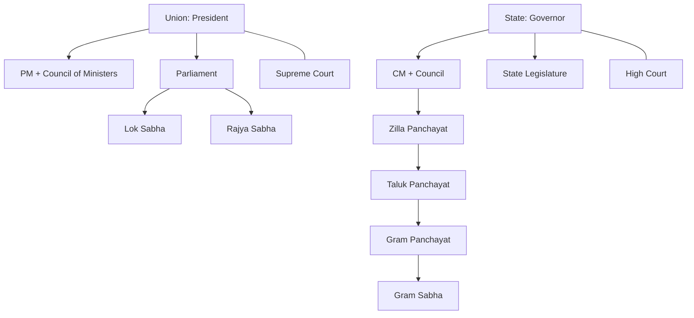

> [!focus] Exam Focus
> **73rd Amendment / Panchayati Raj is the single most important polity topic for land-related posts** (land schemes run through the Gram Panchayat → Taluk → Zilla machinery). Second tier: FR vs DPSP articles by number, Amendment numbers (42nd, 44th, 73rd, 74th, 86th), and basic Parliament/Judiciary structure. Questions are usually **article-number → topic matching**.

# Indian Polity

## 1. The Constitution

Adopted **26 Nov 1949**, enforced **26 Jan 1950** (Republic Day; Drafting Committee chairman **Dr. B.R. Ambedkar**; Constituent Assembly President Dr. Rajendra Prasad). Longest written constitution; originally 395 Articles/22 Parts/8 Schedules (now **~470+ Articles, 25 Parts, 12 Schedules**). **Preamble** — "Sovereign Socialist Secular Democratic Republic" (Socialist & Secular added by the **42nd Amendment, 1976**; "integrity" also then), source of authority = "We the People"; amended once (42nd). **Basic Structure doctrine** — *Kesavananda Bharati v. State of Kerala* (1973): Parliament can amend any part (Art 368) but cannot destroy the basic structure (secularism, federalism, judicial review, republic). Land-reform link: **9th Schedule** (Art 31A/31B) shields land-ceiling laws from FR challenges (added 1st Amendment, 1951).

**Fundamental Rights (Art 12–35)** — justiciable, enforceable by **Art 32 (SC) & Art 226 (HC) writs**:

| Art | Right | Note |
|---|---|---|
| 14–18 | Equality | 16 = equality in public employment (reservation) |
| 19–22 | Freedom | 19: 6 freedoms; 21: life & personal liberty |
| 23–24 | Against exploitation | trafficking, child labour |
| 25–28 | Religion | freedom & non-discrimination |
| 29–30 | Cultural & educational | minorities |
| 31 | — | **Right to Property deleted by 44th Amendment (1978); now legal right under Art 300A** — vital for land officers |

**Six FRs**: Equality, Freedom, Against Exploitation, Religion, Cultural-Educational, Constitutional Remedies. Art 32 = "heart and soul" (Ambedkar). Suspension during Emergency (Art 352: war/external aggression/armed rebellion; 44th Amendment removed "internal disturbance").

**DPSP (Art 36–51)** — non-justiciable guidelines; **Art 39(b)(c)**: equitable distribution of material resources, prevention of concentration of wealth; **Art 43**: decent standard of life for workers; **Art 48**: organise agriculture & animal husbandry; **Art 50**: separate judiciary from executive. Socialistic (39–43), Gandhian (40, 43, 46, 47, 48), Liberal-intellectual (44, 45, 49, 51). FRs vs DPSP: *Minerva Mills (1980)* — harmony, "two wheels of a chariot."

**Fundamental Duties (Art 51A)** — 10 by **42nd Amendment (1976)** on Swaran Singh Committee; **11th (parents/guardians to educate child 6–14) by 86th Amendment (2002)** — total **11**, non-justiciable.

## 2. Union & State Structure

**Union**: President (indirect election, electoral college of elected MPs+MLAs; minimum age 35; ordinance power Art 123; pardoning Art 72) → real executive **PM + Council of Ministers** (Art 74, aids & advises; collectively responsible to LS under Art 75). **Parliament**: **Lok Sabha 543 elected** (max 552 incl. 20 UT reps; term 5 yr; age 25) + **Rajya Sabha 245** (12 President-nominated; permanent house, 1/3 biennial retirement; age 30). Money Bills (Art 110) start only in LS; joint sitting Art 108; **106th Amendment (2023)**: 1/3 reservation of seats for women, to apply after delimitation. Budget = Annual Financial Statement (Art 112); CAG audits (Art 149).

**State**: Governor (President's nominee, discretionary powers), **CM + Council** (Art 163/164); Legislature: Vidhan Sabha & (in some states) Vidhan Parishad (MLCs); minimum age to contest a state seat: **25**. **Single constitution, federal-with-unitary bias** ("quasi-federal" — K.C. Wheare); 7th Schedule: Union/State/Concurrent Lists.

The chart traces authority from Union to village: note the **Panchayati Raj ladder ends in the Gram Sabha (ಜನಸಭೆ)** — the body that certifies land records and elections in Karnataka, the heart of your future fieldwork.

## 3. Panchayati Raj — 73rd Amendment (1992) ★ VERY IMPORTANT

Added **Part IX (Art 243 onwards)** + **11th Schedule (29 functional items — incl. land improvement, soil conservation, aggregation & redistribution of land!)**. **74th Amendment**: Part IXA, municipalities (Urban Local Bodies).

- **Three-tier**: **Gram Panchayat → Taluk Panchayat → Zilla Panchayat** (Karnataka's model under its 1993 Act; the old Mandal Panchayat tier was merged into Gram Panchayats). **Gram Sabha = all registered voters of the village**.
- **Direct elections**; **5-year term**; re-election within 6 months if dissolved.
- **Reservations**: SC/ST proportionate to population; **not less than 1/3 women** (raised to **50% in Karnataka**); SC/ST chairpersons similarly; state may reserve for backward classes.
- **State Election Commission** conducts PRI & ULB elections; **State Finance Commission** every 5 years (Art 243I) to recommend devolution; District Planning Committee (Art 243ZD).
- 11th/12th Schedules list subjects devolved; **Gram Sabha approves land-use plans, beneficiary identification for land schemes**.

**Mnemonics**
- **FR numbers**: 14 equality, 19 freedom, 21 life, 32 remedy → "**E**ach **F**ree **L**ife has a **R**emedy".
- **Amendments**: "**42**nd = secular+socialist, **44**th = property out, **73**rd = Panchayat, **74**th = urban (Nagarapalike), **86**th = education duty" → "**42-44 make, 73-74 take**" (42/44 changed the text; 73/74 gave local self-government).
- **Two houses**: "**LS 543, term 5, age 25; RS 245, permanent, age 30**" → "**5-25 / 30**" (LS: 5 years at 25; RS at 30).

## Likely Questions / PYQ

1. **The 73rd Constitutional Amendment relates to** (a) Municipalities (b) **Panchayati Raj (Part IX)** (c) Cooperative societies (d) National Capital territory — *Answer: b*.
2. **Right to Property is now a** (a) FR (b) **legal right (Art 300A)** (c) DPSP (d) Duty — *Answer: b*.
3. **Minimum age to be a member of Lok Sabha / Rajya Sabha** (a) 25/30 (b) 30/25 (c) 21/25 (d) 25/21 — *Answer: a*.
4. **Fundamental Duties (Art 51A) were added by which amendment** (a) **42nd (1976)** (b) 44th (c) 86th (d) 24th — *Answer: a* (the 86th added the 11th duty in 2002).
5. **Writ jurisdiction for enforcing Fundamental Rights lies with** (a) Art 32 & 226 (b) only Art 32 (c) only 136 (d) Art 143 — *Answer: a*.
6. **The subject reserved for Gram Panchayats in the 11th Schedule includes** (a) Defence (b) **Land improvement & soil conservation** (c) Banking (d) Railways — *Answer: b*.
7. **Reservation of seats for women in Panchayats is at least** (a) 1/4 (b) **1/3 (50% in Karnataka)** (c) 1/2 (d) 30% — *Answer: b*.
8. **The Basic Structure doctrine was laid down in** (a) Golaknath (b) **Kesavananda Bharati (1973)** (c) Minerva Mills (d) Berubari — *Answer: b*.

> [!tip] Quick Revision Box
> - **26 Nov 1949 adopted / 26 Jan 1950 enforced; Ambedkar drafted; Preamble amended only by 42nd.**
> - **FR = Art 12–35 (6 rights; property gone, 300A). DPSP 36–51 (Art 39, 43, 48 = land/agri-linked). Duties 51A (11).**
> - **LS 543/5 yrs/25+; RS 245/permanent/30+; Money Bill LS only.**
> - **73rd Amendment 1992 = Part IX + 11th Schedule: 3-tier PRIs, direct elections, 5-yr term, 1/3 women (50% Karnataka), SC reservations, State Election & Finance Commissions.**
> - **Karnataka 3 tiers: GP → Taluk → Zilla; Gram Sabha = voters of the village (land-scheme beneficiary body).**
> - Related: [[06_History]] | [[07_Geography]] | [[09_Economy_Science]] | [[05_Karnataka_Land_Revenue]]
