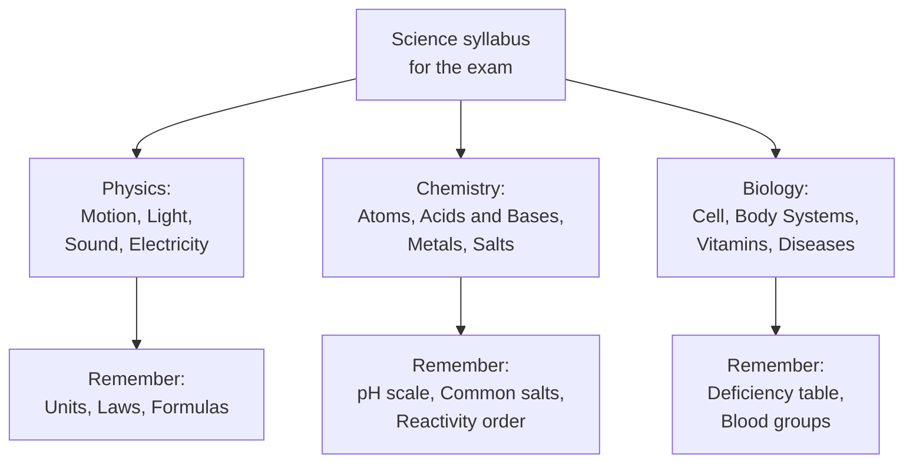

> [!focus] Exam Focus
> Economy questions in KEA GK papers favour **agri-linked basics**: GDP vs GNP, inflation types, Green Revolution facts, Karnataka crops/seasons and irrigation projects. Science is definition-level: SI units, simple laws (Newton, Ohm, reflection), acids/bases/pH, vitamins and deficiency diseases. Expect 4–6 questions total from this cluster.

# Economy & General Science (ಆರ್ಥಿಕತೆ ಮತ್ತು ವಿಜ್ಞಾನ)

## 1. Economy basics (ಆರ್ಥಿಕತೆಯ ಮೂಲಭೂತಗಳು)

- **GDP** = value of final goods/services produced *within* a country in a year; **GNP = GDP + net factor income from abroad**; **NNP = GNP − depreciation**; **per-capita income = net national income ÷ population**.
- **Inflation** — sustained price rise; measured by **CPI (retail, base 2012)** and **WPI (wholesale, base 2011–12)**. Demand-pull (too much money) vs cost-push (input costs). Opposite = deflation; slow fall in inflation rate = disinflation; **stagflation = stagnant growth + high inflation**.
- **Fiscal vs monetary policy** — fiscal = government budget (taxing + spending; deficit types: revenue, fiscal, primary); monetary = **RBI** tools: **repo rate** (RBI lends to banks), **reverse repo**, **CRR/SLR** (reserves banks must hold), open-market operations. RBI Governor chairs? no — **MPC (Monetary Policy Committee, 6 members) sets the repo rate** since 2016, targeting **4% CPI inflation (±2)**.
- **Five Year Plans** — 1st (1951–56, Harrod-Domar, agriculture) to 12th (2012–17); **Planning Commission replaced by NITI Aayog (1 Jan 2015)**. 2nd Plan = Mahalanobis/industry; Green Revolution (1966–67) falls in the Plan-holiday period under M.S. Swaminathan ("Father of Green Revolution in India"; Norman Borlaug globally).

## 2. Agriculture & Karnataka economy (ಕೃಷಿ ಮತ್ತು ಕರ್ನಾಟಕ ಆರ್ಥಿಕತೆ)

**Crop seasons**: **Kharif** (sown June–July, harvested Oct: rice/paddy — ಭತ್ತ, jowar, maize, cotton, groundnut, sugarcane), **Rabi** (sown Oct–Nov, harvested Mar–Apr: wheat — ಗೋಧಿ, barley, gram, mustard), **Zaid** (summer: watermelon, cucumber). Karnataka: Kharif-dominant in coast/Malnad (paddy, sugarcane), Rabi-dominant in north (jowar, Bengal gram, sunflower).

| Item | Karnataka facts |
|---|---|
| Top crops | **Ragi** (finger millet, southern districts — largest producer in India), **jowar**, tur (Kalaburagi = "Tur bowl"), sugarcane (Belagavi), **coffee (Kodagu/Chikkamagaluru = top producer in India)**, areca, silk (Kolar/Ramnagara — top in India for mulberry silk), sunflower |
| Irrigation | Canals (Tungabhadra, Upper Krishna, Kabini, Harangi, Hemavathi), tanks; **net irrigated area ~30%+ of sown area**; major dams: **TBD (Hospet), Almatti, KRS, Narayanpur, Linganamakki (Sharavathi, hydro), Supa (Kali)** |
| Green Revolution | HYV seeds + fertiliser + irrigation; Punjab/Haryana/Western UP first; criticism: regional + crop (wheat/rice) imbalance; **Evergreen Revolution** (ecological) by Swaminathan |
| State economy | Services-led (Bengaluru IT); **Staple? — GSDP rank ~3rd–4th**; **Mysuru (ಮೈಸೂರು) silk**, Dharwad cotton, Kolar gold (KGF closed 2001, Bharat Gold Mines) |

## 3. General Science (ಸಾಮಾನ್ಯ ವಿಜ್ಞಾನ)

**Physics (ಭೌತಶಾಸ್ತ್ರ)** — Newton: 1st inertia, 2nd F = ma, 3rd action–reaction. Speed vs velocity (scalar/vector); **acceleration due to gravity g = 9.8 m/s²**; escape velocity 11.2 km/s. Sound: longitudinal wave, speed ~343 m/s in air; **ultrasonic > 20 kHz** (used in SONAR/medical scans — same echo principle as survey EDM!). Light: **reflection (mirrors), refraction (lenses)**, total internal reflection (optical fibre); rainbow = dispersion + TIR; **speed of light 3×10⁸ m/s**. Electricity: **Ohm's law V = IR**; power P = VI (watt); **fuse wire = low melting point (lead-tin alloy)**; India mains **220 V, 50 Hz**; earthing for safety. SI units: metre, kg, second, ampere, kelvin, mole, candela; **1 horsepower = 746 W**; Richter scale for earthquakes (logarithmic).

**Chemistry (ರಸಾಯನಶಾಸ್ತ್ರ)** — Atom: protons/neutrons/electrons; **atomic number = protons**, mass number = protons + neutrons. Periodic table: **Mendeleev**; periods = rows, groups = columns. Acids (sour, pH < 7, turn blue litmus red; HCl, H₂SO₄) vs bases (bitter/soapy, pH > 7; NaOH, Ca(OH)₂); **pH 7 neutral**; **pH scale by S.P.L. Sørensen**; stomach acid HCl, antacid = milk of magnesia. Salts: **NaCl (common salt), baking soda NaHCO₃, washing soda Na₂CO₃, plaster of Paris CaSO₄·½H₂O, bleaching powder CaOCl₂**. Metals: good conductors, malleable/ductile, sonorous; most reactive **K > Na > Ca > Mg** (reactivity series top); **noble metals Au, Pt, Ag**; alloys — brass (Cu+Zn), bronze (Cu+Sn), steel (Fe+C). Non-metals: poor conductors; **diamond/graphite are carbon allotropes**; noble gases He, Ne, Ar. Water H₂O (**universal solvent**); **hardness from Ca/Mg salts**; heavy water D₂O.

**Biology (ಜೀವಶಾಸ್ತ್ರ)** — **Cell (ಜೀವಕೋಶ)**: basic unit; **Robert Hooke (1665)** coined "cell"; powerhouse = mitochondria; photosynthesis (chloroplast): 6CO₂ + 6H₂O → C₆H₁₂O₆ + 6O₂. Human body: **206 bones (adult)**, 600+ muscles; largest bone femur; smallest stapes; **normal body temp 37°C/98.6°F**; **blood pH ~7.4**; universal donor O−, universal recipient AB+; **RBCs carry Hb, no nucleus; WBCs fight infection (soldiers); platelets clot**. Digestion: saliva (ptyalin/amylase), HCl + pepsin in stomach, bile (liver) emulsifies fat, absorption in small intestine (villi). Vitamins: **A (night blindness), B1 (beriberi), C (scurvy), D (rickets — sunlight vitamin), E (sterility), K (clotting)**. Diseases: communicable (TB — bacteria; malaria/dengue — mosquito; cholera — water; COVID/flu — virus) vs non-communicable (diabetes — insulin; hypertension). **Vaccines: BCG (TB), OPV (polio), DPT**. Plants: transpiration (leaves), root pressure; **nitrogen-fixing legumes (Rhizobium)**.

The map tells you **how to split prep time**: Physics rewards formula clarity (F = ma, V = IR), Chemistry rewards two tables (pH scale + common salts), Biology rewards two tables (vitamins + blood groups). If time is short, memorise exactly those six blocks — they cover most repeated questions.

> **Mnemonics**
> - **Crop seasons**: "**K**harif = **K**har (monsoon, rice); **R**abi = **R**abi (winter, wheat); **Z**aid = **Z**ummer shorts" → "**K-July, R-October, Z-April**" (sowing months).
> - **Vitamins**: "**A**pple sight (**A** = eyes/night blindness), **B**eri (**B1** = beriberi), **C**itrus (**C** = scurvy), **D**aylight (**D** = sun/rickets), **E**very baby (**E** = reproduction), **K**lot (**K** = clotting)."
> - **Reactivity top 4**: "**K**ings **N**ever **C**ry **M**uch (K-Na-Ca-Mg)."
> - **Alloys**: "**Brass** has **Z**inc (both end in 'ss/z' hiss); **Bronze** has ti**n** (both end in 'n')."
> - **Blood**: "**O** gives to all (**O** = zero antigens = universal donor); **AB** accepts all."

## Likely Questions / PYQ

1. **GNP differs from GDP by** (a) taxes (b) **net factor income from abroad** (c) depreciation (d) subsidies — *Answer: b*.
2. **The repo rate is** (a) banks' lending rate to customers (b) **rate at which RBI lends to commercial banks** (c) savings rate (d) CRR rate — *Answer: b*.
3. **Father of the Green Revolution in India** (a) Norman Borlaug (b) Verghese Kurien (c) **M.S. Swaminathan** (d) C. Subramaniam — *Answer: c*.
4. **Karnataka is India's largest producer of** (a) wheat (b) **coffee** (c) tea (d) jute — *Answer: b*.
5. **pH of human blood is approximately** (a) 6.0 (b) **7.4** (c) 8.4 (d) 5.6 — *Answer: b*.
6. **Deficiency of vitamin D causes** (a) scurvy (b) beriberi (c) **rickets** (d) night blindness — *Answer: c*.
7. **Fuse wire is made of an alloy with** (a) high melting point (b) **low melting point (lead-tin)** (c) high resistance only (d) magnetic property — *Answer: b*.
8. **Universal blood donor group is** (a) AB+ (b) A− (c) **O−** (d) B+ — *Answer: c*.

> [!tip] Quick Revision Box
> - **GDP (domestic) → +abroad = GNP → −depreciation = NNP; CPI 2012 / WPI 2011–12; RBI repo via 6-member MPC, 4% target; NITI Aayog replaced Planning Commission (2015).**
> - **Kharif–rice/July; Rabi–wheat/Oct; Zaid–summer. Karnataka: ragi, jowar, tur, coffee, silk top; ~30% irrigated (TBD, Almatti, KRS, Kabini).**
> - **Physics: g = 9.8; V = IR; 1 HP = 746 W; 220 V/50 Hz India. Chemistry: pH 7 neutral; NaHCO₃/Na₂CO₃/CaSO₄·½H₂O/CaOCl₂; K-Na-Ca-Mg; brass = Cu+Zn, bronze = Cu+Sn. Biology: 206 bones; O− donor, AB+ recipient; A/B1/C/D/E/K deficiencies; 37°C; blood pH 7.4.**
> - Related: [[06_History]] | [[07_Geography]] | [[08_Polity]] | [[04_Current_Affairs_GK/Current_Affairs_2026]]
