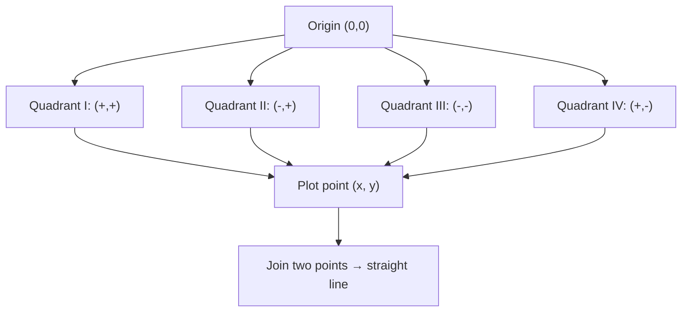

> [!focus] Exam Focus
> Highest-yield: the **five standard identities**, **quadratic formula + discriminant (nature of roots)**, **sum & product of roots**, and **plotting points across the four quadrants with correct sign convention**. Must-memorise: $(a+b)^2=a^2+2ab+b^2$, $(a-b)^2=a^2-2ab+b^2$, $(a+b)(a-b)=a^2-b^2$, $(a+b+c)^2=a^2+b^2+c^2+2ab+2bc+2ca$; quadratic $x=\dfrac{-b\pm\sqrt{b^2-4ac}}{2a}$; discriminant $D=b^2-4ac$; **sum of roots $=-b/a$, product $=c/a$**.

# Algebra & Coordinate Geometry (ಬೀಜಗಣಿತ ಮತ್ತು ನಿರ್ದೇಶಾಂಕ ರೇಖಾಗಣಿತ)

Algebra is the manipulation half of the Mathematics block; coordinate geometry links it to the plane a surveyor plots on. Companion notes: arithmetic in [[03_Notes/11_Maths_Arithmetic]], geometry in [[03_Notes/13_Maths_Geometry_and_Mensuration]]; syllabus source [[02b_Paper2_Official_Syllabus]].

## 1. Basics of algebra (ಬೀಜಗಣಿತದ ಮೂಲಗಳು)

- **Literal / variable** — a symbol (x, y, a) standing for a number; **constant** — a fixed value.
- **Term** — a product of numbers and variables (e.g. $-3x^2y$); the numerical part is the **coefficient**.
- **Like terms** — same variables to the same powers; only like terms can be added/subtracted.
- **Expression** — terms joined by + / −; monomial (1 term), binomial (2), trinomial (3), polynomial (many).

**Operations with signed literal numbers** — the sign rules of integers carry over:
- $(+)(+) = +$, $(-)(-) = +$, $(+)(-) = -$.
- Adding like terms: $5x + 3x = 8x$; $7ab - 2ab = 5ab$.
- Laws of exponents: $x^m\cdot x^n=x^{m+n}$, $\dfrac{x^m}{x^n}=x^{m-n}$, $(x^m)^n=x^{mn}$, $x^0=1$.

**Use of symbols** — a general statement becomes an equation: "a number increased by 5 equals twice the number" → $x+5=2x$ → $x=5$.

## 2. Multiplication of algebraic expressions & identities (ಗುಣಾಕಾರ ಮತ್ತು ನಿತ್ಯಸಮೀಕರಣ)

Multiply term-by-term (distributive law), then combine like terms. **Binomial × binomial** uses the FOIL pattern (First, Outer, Inner, Last).

**Standard identities (memorise all five):**

| Identity | Expansion |
|---|---|
| $(a+b)^2$ | $a^2+2ab+b^2$ |
| $(a-b)^2$ | $a^2-2ab+b^2$ |
| $(a+b)(a-b)$ | $a^2-b^2$ |
| $(a+b+c)^2$ | $a^2+b^2+c^2+2ab+2bc+2ca$ |
| $(x+a)(x+b)$ | $x^2+(a+b)x+ab$ |

**Special products / squaring a trinomial:**
- $(2x+3)^2=4x^2+12x+9$.
- $(x+y+z)^2$: square each, add twice each pairwise product.
- Useful cubes: $(a+b)^3=a^3+3a^2b+3ab^2+b^3$; $a^3+b^3=(a+b)(a^2-ab+b^2)$; $a^3-b^3=(a-b)(a^2+ab+b^2)$.

Worked: $103^2=(100+3)^2=10000+600+9=10609$; $98\times102=(100-2)(100+2)=10000-4=9996$.

## 3. Factorisation of algebraic expressions (ಅಪವರ್ತನ)

Factorisation reverses multiplication. Try methods in order:

1. **Common factor** — $6x^2+9x=3x(2x+3)$.
2. **Grouping** — $ax+ay+bx+by=a(x+y)+b(x+y)=(a+b)(x+y)$.
3. **Identity a² − b²** — $x^2-25=(x+5)(x-5)$.
4. **Perfect square a² ± 2ab + b²** — $x^2+6x+9=(x+3)^2$.
5. **Trinomial / splitting the middle term** — for $x^2+7x+12$, find two numbers with product 12, sum 7 → 3 and 4 → $(x+3)(x+4)$.
6. **General $ax^2+bx+c$** — split middle term into factors of $a\cdot c$ that add to $b$. For $2x^2+7x+3$: $a\cdot c=6$, split $7=6+1$ → $2x^2+6x+x+3=2x(x+3)+1(x+3)=(2x+1)(x+3)$.

## 4. HCF & LCM of binomials and trinomials (ಬಹುಪದೋಕ್ತಿಗಳ ಮ.ಸಾ.ಅ / ಲ.ಸಾ.ಅ)

Factorise each expression fully, then apply the number rules to the factors:
- **HCF** = product of factors common to all (lowest powers).
- **LCM** = product of all distinct factors (highest powers).

Worked: $x^2-9=(x-3)(x+3)$ and $x^2-6x+9=(x-3)^2$.
- **HCF** $=(x-3)$; **LCM** $=(x-3)^2(x+3)$.

Check with the identity $\text{HCF}\times\text{LCM}=$ product: $(x-3)\cdot(x-3)^2(x+3)=(x-3)^3(x+3)$, and product $=(x-3)(x+3)\cdot(x-3)^2=(x-3)^3(x+3)$. ✔

## 5. Linear equations & the coordinate system (ರೇಖೀಯ ಸಮೀಕರಣ)

A **linear equation in one variable** $ax+b=0$ has one solution $x=-b/a$. A **linear equation in two variables** $ax+by+c=0$ plots as a **straight line**; two such lines are solved by substitution, elimination, or graphically (their intersection).

**Rectangular (Cartesian) coordinate system** — two perpendicular axes: x-axis (horizontal, abscissa) and y-axis (vertical, ordinate), meeting at the **origin (0,0)**. A point is $(x, y)$.

**Quadrants & sign convention:**

| Quadrant | x sign | y sign | Example |
|---|---|---|---|
| I | + | + | (3, 2) |
| II | − | + | (−3, 2) |
| III | − | − | (−3, −2) |
| IV | + | − | (3, −2) |

**Graphs of linear equations** — a straight line; plot two points and join. $y=2x+1$: at $x=0,y=1$; at $x=1,y=3$. Slope $m=2$, y-intercept $=1$. Distance between $(x_1,y_1)$ and $(x_2,y_2)$: $\sqrt{(x_2-x_1)^2+(y_2-y_1)^2}$ — the surveyor's coordinate-distance formula.

Worked simultaneous: $x+y=10$, $x-y=4$ → add: $2x=14$, $x=7$, $y=3$.

The flowchart shows how any ordered pair is placed: the two signs decide the quadrant, the magnitudes fix the exact spot, and joining any two plotted solutions of a linear equation draws its line. This is exactly how a surveyor lays out a boundary from computed coordinates.

## 6. Quadratic equations (ವರ್ಗ ಸಮೀಕರಣ)

Standard form $ax^2+bx+c=0$ ($a\ne0$).
- **Pure quadratic** — no x-term ($b=0$): $x^2=k \Rightarrow x=\pm\sqrt k$.
- **Affected (adfected) quadratic** — has the x-term ($b\ne0$).

**Solving methods:**
1. **Factorisation** — $x^2-5x+6=0 \Rightarrow (x-2)(x-3)=0 \Rightarrow x=2,3$.
2. **Formula method** — $x=\dfrac{-b\pm\sqrt{b^2-4ac}}{2a}$.
3. **Reducible equations** — substitution turns them into $ax^2+bx+c=0$ (e.g. let $y=x^2$ in $x^4-5x^2+4=0$ → $y^2-5y+4=0$).
4. **Graphical** — plot $y=ax^2+bx+c$ (a parabola); the **x-intercepts are the roots**. No intercept → no real root.

**Nature of roots (discriminant $D=b^2-4ac$):**

| D | Roots |
|---|---|
| $D>0$ (perfect square) | Real, distinct, rational |
| $D>0$ (not perfect square) | Real, distinct, irrational |
| $D=0$ | Real, equal (coincident) |
| $D<0$ | Imaginary (no real roots) |

**Relation between roots and coefficients** — if roots are $\alpha,\beta$:
$$\alpha+\beta=-\frac{b}{a},\qquad \alpha\beta=\frac{c}{a}$$

**Forming an equation from roots:** $x^2-(\alpha+\beta)x+\alpha\beta=0$. Example: roots 2 and 5 → $x^2-7x+10=0$.

Worked (formula): $2x^2-4x-3=0$ → $D=16+24=40$; $x=\dfrac{4\pm\sqrt{40}}{4}=\dfrac{4\pm2\sqrt{10}}{4}=1\pm\dfrac{\sqrt{10}}{2}$.

## 7. Coordinate / plane geometry — reading values off a graph (ನಿರ್ದೇಶಾಂಕ ರೇಖಾಗಣಿತ)

To **plot simple equations**, tabulate a few (x, y) pairs and join. To **find a value along one axis given the other**, substitute the known coordinate into the equation:
- Line $2x+3y=12$: given $x=3$ → $6+3y=12$ → $y=2$; given $y=0$ (x-intercept) → $x=6$.
- Midpoint of a segment $\left(\frac{x_1+x_2}{2},\frac{y_1+y_2}{2}\right)$; useful for finding the centre of a plotted plot line.

This is precisely the calculation a surveyor performs when a boundary line's easting is known and the northing must be read off, or vice-versa.

## Likely questions (PYQ-style)

*(Compiled in the KEA pattern — labelled expected/PYQ-style, not official.)*

1. **(Expected)** $(a+b)^2-(a-b)^2$ equals (a) $2ab$ (b) **$4ab$** (c) $a^2+b^2$ (d) $2a^2$.
2. **(Expected)** The factors of $x^2-7x+12$ are (a) (x−2)(x−6) (b) **(x−3)(x−4)** (c) (x+3)(x+4) (d) (x−1)(x−12).
3. **(PYQ-style)** The point (−4, 5) lies in quadrant (a) I (b) **II** (c) III (d) IV.
4. **(Expected)** For $x^2-4x+4=0$ the roots are (a) real & distinct (b) **real & equal** (c) imaginary (d) irrational — *D = 16−16 = 0.*
5. **(Expected)** If roots of a quadratic are 3 and −2, the equation is (a) **$x^2-x-6=0$** (b) $x^2+x-6=0$ (c) $x^2-5x+6=0$ (d) $x^2+5x+6=0$.
6. **(PYQ-style)** Sum of roots of $2x^2-6x+4=0$ is (a) 2 (b) **3** (c) −3 (d) 6 — *−b/a = 6/2.*
7. **(Expected)** $(a+b+c)^2$ has how many terms in expanded form (a) 3 (b) **6** (c) 4 (d) 9 — *three squares + three cross terms.*
8. **(Expected)** On the line $x+y=7$, if $x=2$ then $y=$ (a) **5** (b) 9 (c) 3.5 (d) 2.
9. **(PYQ-style)** The discriminant of $x^2+x+1=0$ is (a) 5 (b) 1 (c) **−3** (d) 0 → roots are imaginary.
10. **(Expected)** HCF of $x^2-1$ and $x^2+2x+1$ is (a) $(x-1)$ (b) **$(x+1)$** (c) $(x+1)^2$ (d) $(x-1)(x+1)$.

> [!tip] 60-second revision
> - **Identities:** $(a\pm b)^2=a^2\pm2ab+b^2$; $(a+b)(a-b)=a^2-b^2$; $(a+b+c)^2=a^2+b^2+c^2+2ab+2bc+2ca$.
> - **Factorise:** common → grouping → $a^2-b^2$ → perfect square → split middle term.
> - **Quadrants:** I(+,+), II(−,+), III(−,−), IV(+,−).
> - **Quadratic:** $x=\frac{-b\pm\sqrt{b^2-4ac}}{2a}$; $D=b^2-4ac$ → >0 distinct, =0 equal, <0 imaginary.
> - **Sum of roots = −b/a, product = c/a;** build equation $x^2-(\text{sum})x+(\text{product})=0$.
> - **Distance** $=\sqrt{(x_2-x_1)^2+(y_2-y_1)^2}$; midpoint = averages.
> - Related: [[02b_Paper2_Official_Syllabus]] | [[03_Notes/11_Maths_Arithmetic]] | [[03_Notes/13_Maths_Geometry_and_Mensuration]] | [[01_Surveying_Basics]]
