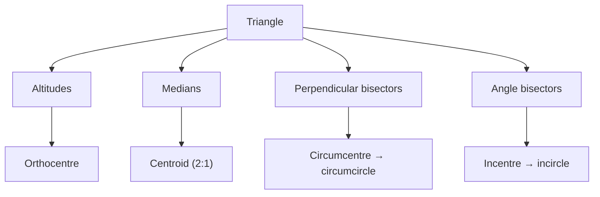

> [!focus] Exam Focus
> Highest-yield for a surveyor: the **mensuration formula table (area & volume of every standard shape)**, **Pythagoras theorem**, **congruence rules (SAS, SSS, ASA, RHS)**, **the four concurrent-line centres**, and **circle chord/tangent properties**. Must-memorise: area of triangle $=\frac12 bh$ and Heron's $\sqrt{s(s-a)(s-b)(s-c)}$; circle area $=\pi r^2$, circumference $=2\pi r$; cylinder volume $=\pi r^2h$; cone $=\frac13\pi r^2h$; sphere $=\frac43\pi r^3$; Pythagoras $c^2=a^2+b^2$; **basic proportionality (Thales)** and **areas of similar triangles ∝ square of corresponding sides**.

# Geometry & Mensuration (ರೇಖಾಗಣಿತ ಮತ್ತು ಕ್ಷೇತ್ರಗಣಿತ)

Geometry underpins every plan a Land Surveyor draws; mensuration is the daily arithmetic of area and volume for plots, tanks and earthwork. Companion notes: arithmetic [[03_Notes/11_Maths_Arithmetic]], algebra & coordinate geometry [[03_Notes/12_Maths_Algebra_and_Coordinate_Geometry]]; syllabus [[02b_Paper2_Official_Syllabus]].

## 1. Axioms, postulates & angle theorems (ಸ್ವಯಂಸಿದ್ಧ ಮತ್ತು ಆಧಾರತತ್ವ)

- **Axiom** — a self-evident truth accepted without proof (e.g. "the whole is greater than the part"; "things equal to the same thing are equal").
- **Postulate** — an assumption specific to geometry (e.g. Euclid's: "a straight line can be drawn between any two points"; "all right angles are equal").
- **Theorem** — a statement proved from axioms/postulates; its **converse** swaps hypothesis and conclusion (not always true).

**Angles on parallel lines cut by a transversal (ಸಮಾನಾಂತರ ರೇಖೆಗಳು):**

| Pair | Relation |
|---|---|
| Corresponding angles | Equal |
| Alternate interior angles | Equal |
| Alternate exterior angles | Equal |
| Co-interior (allied) angles | Supplementary (sum 180°) |
| Vertically opposite angles | Equal |

**Converse** — if a transversal makes a pair of alternate angles equal (or co-interior angles supplementary), the two lines are parallel — the theorem a surveyor uses to check parallel boundaries.

## 2. Polygons (ಬಹುಭುಜಾಕೃತಿ)

A polygon is a closed figure of straight sides. **Regular** = all sides and angles equal; **irregular** otherwise.
- **Sum of interior angles** $=(n-2)\times180°$.
- **Each interior angle (regular)** $=\dfrac{(n-2)180°}{n}$; **each exterior angle** $=\dfrac{360°}{n}$.

| Polygon | n | Interior angle (regular) |
|---|---|---|
| Pentagon (ಪಂಚಭುಜ) | 5 | 108° |
| Hexagon (ಷಡ್ಭುಜ) | 6 | 120° |
| Octagon (ಅಷ್ಟಭುಜ) | 8 | 135° |

**Inscribing** a regular pentagon/hexagon/octagon in a circle — divide the 360° centre into $n$ equal arcs (72°, 60°, 45°) and join. The hexagon is special: **its side equals the circle's radius**, so a surveyor can strike six radius-arcs to inscribe it.

**Well-conditioned polygon/triangle** — a figure whose angles are neither too acute nor too obtuse (ideally between 30° and 120°); such shapes give the **most reliable plotting and least error**, which is why triangulation networks avoid "ill-conditioned" thin triangles.

## 3. Triangles (ತ್ರಿಭುಜ)

**Classification** — by sides: equilateral, isosceles, scalene; by angles: acute, right, obtuse.
- **Angle sum = 180°** (ಕೋನಗಳ ಮೊತ್ತ). 
- **Exterior angle = sum of the two remote interior angles.**
- **Triangle inequality** — any side < sum of the other two.

**Construction** — possible given SSS, SAS, ASA, or RHS (right-angle–hypotenuse–side) data using compass and ruler.

### Congruence of triangles (ಸರ್ವಸಮತೆ)

Two triangles are congruent (identical in shape and size) under:

| Rule | Given |
|---|---|
| **SSS** | three sides equal |
| **SAS** | two sides + included angle |
| **ASA** (& AAS) | two angles + a side |
| **RHS** | right angle, hypotenuse, one side |

Note: **AAA gives similarity, not congruence** (same shape, possibly different size).

### Concurrent lines of a triangle (ಸಂಗಾಮಿ ರೇಖೆಗಳು)

| Lines | Point of concurrency | Property |
|---|---|---|
| **Altitudes** (perpendicular from vertex to opposite side) | **Orthocentre** | — |
| **Medians** (vertex to midpoint of opposite side) | **Centroid** | divides each median 2:1; centre of gravity |
| **Perpendicular bisectors** of sides | **Circumcentre** | equidistant from vertices → **circumcircle** |
| **Angle bisectors** | **Incentre** | equidistant from sides → **incircle** |

> **Mnemonic** — "**A**ltitude→**O**rthocentre, **M**edian→**C**entroid, **P**erp-bisector→**C**ircumcentre, **A**ngle-bisector→**I**ncentre." Centroid ratio is always **2:1** from vertex.

The flowchart pairs each set of concurrent lines with the single point where they meet and the circle (if any) it generates. In the exam these four are frequently confused, so fixing "which lines give which centre" — and that only the **circumcentre** and **incentre** carry circles — is the fastest way to secure the mark.

## 4. Quadrilaterals & parallelograms (ಚತುರ್ಭುಜ)

**Angle sum of a quadrilateral = 360°.**

| Type | Key properties |
|---|---|
| Parallelogram | opposite sides parallel & equal; opposite angles equal; diagonals bisect each other |
| Rectangle | parallelogram + all angles 90°; diagonals equal |
| Square | rectangle + all sides equal; diagonals equal & perpendicular |
| Rhombus | parallelogram + all sides equal; diagonals perpendicular bisectors |
| Trapezium (ಟ್ರೆಪಿಜಿಯಂ) | exactly one pair of parallel sides |

**Theorems on parallelograms** — a diagonal divides it into two congruent triangles; opposite sides/angles equal; if one pair of opposite sides is equal **and** parallel, the figure is a parallelogram.

**Mid-point theorem** — the segment joining midpoints of two sides of a triangle is **parallel to the third side and half its length**; the converse locates a midpoint.

**Areas on the same base / between the same parallels** — parallelograms (or triangles) on the **same base and between the same parallels are equal in area**; a triangle's area is **half** that of a parallelogram on the same base and same parallels.

**Cyclic quadrilateral** — all four vertices lie on a circle; **opposite angles are supplementary (sum 180°)**, and the exterior angle equals the interior opposite angle.

## 5. Circles (ವೃತ್ತ)

| Property | Statement |
|---|---|
| Chord–centre | perpendicular from centre bisects the chord (and vice-versa) |
| Equal chords | are equidistant from the centre |
| Central vs inscribed angle | central angle = **twice** the inscribed angle on the same arc |
| Angle in a semicircle | = 90° |
| Tangent–radius | tangent is **perpendicular** to the radius at the point of contact |
| Tangents from a point | two external tangents are **equal** in length |
| Secant / tangent | angles in the same segment are equal |

**Tangent constructions** — a tangent at a point is drawn perpendicular to the radius there; from an external point, tangents are constructed using the circle on the line joining the point to the centre as diameter. The **radius–point of contact–tangent relation** ($radius \perp tangent$) is the geometric basis for setting out a curve tangent to a boundary.

## 6. Similarity, Thales & Pythagoras (ಸಾಮ್ಯತೆ, ಥೇಲ್ಸ್, ಪೈಥಾಗೊರಸ್)

- **Similar triangles** — equal corresponding angles, proportional corresponding sides (AAA / SSS / SAS similarity).
- **Basic proportionality theorem (Thales, ಥೇಲ್ಸ್)** — a line drawn parallel to one side of a triangle divides the other two sides in the **same ratio**: if $DE\parallel BC$ then $\dfrac{AD}{DB}=\dfrac{AE}{EC}$.
- **Areas of similar triangles** — the ratio of areas equals the **square of the ratio of corresponding sides**: $\dfrac{\text{ar}(\triangle_1)}{\text{ar}(\triangle_2)}=\left(\dfrac{s_1}{s_2}\right)^2$.
- **Pythagoras theorem** — in a right triangle, $\text{hypotenuse}^2=\text{base}^2+\text{perpendicular}^2$, i.e. $c^2=a^2+b^2$. Its converse tests for a right angle (3-4-5, 5-12-13, 8-15-17 triples).
- **Touching circles** — two circles touch **externally** when the distance between centres $=r_1+r_2$, and **internally** when $=|r_1-r_2|$; the point of contact lies on the line of centres.

Worked: a plot forms a right triangle with legs 30 m and 40 m → diagonal $=\sqrt{30^2+40^2}=\sqrt{2500}=50$ m.

## 7. Mensuration — the surveyor's formula table (ಕ್ಷೇತ್ರಗಣಿತ)

**2-D (perimeter & area):**

| Shape | Perimeter | Area |
|---|---|---|
| Triangle | $a+b+c$ | $\frac12 bh$; Heron $\sqrt{s(s-a)(s-b)(s-c)}$, $s=\frac{a+b+c}{2}$ |
| Equilateral triangle | $3a$ | $\frac{\sqrt3}{4}a^2$ |
| Rectangle | $2(l+b)$ | $l\times b$ |
| Square | $4a$ | $a^2$ (diagonal $a\sqrt2$) |
| Parallelogram | $2(a+b)$ | base × height |
| Rhombus | $4a$ | $\frac12 d_1 d_2$ |
| Trapezium | sum of sides | $\frac12(a+b)h$ |
| Circle | $2\pi r$ | $\pi r^2$ |

**3-D (surface area & volume):**

| Solid | Total surface area | Volume |
|---|---|---|
| Cube | $6a^2$ | $a^3$ |
| Cuboid | $2(lb+bh+hl)$ | $l\,b\,h$ |
| Cylinder | $2\pi r(r+h)$ | $\pi r^2 h$ |
| Cone | $\pi r(r+l)$, $l=\sqrt{r^2+h^2}$ | $\frac13\pi r^2 h$ |
| Sphere | $4\pi r^2$ | $\frac43\pi r^3$ |
| Hemisphere | $3\pi r^2$ | $\frac23\pi r^3$ |
| **Prism** | $2(\text{base area})+(\text{perimeter}\times h)$ | base area × height |
| **Pyramid** | base area $+\frac12(\text{perimeter}\times \text{slant height})$ | $\frac13\times$ base area $\times h$ |

### Prism vs pyramid (ಪ್ರಿಸಂ ಮತ್ತು ಪಿರಮಿಡ್)

- **Prism** — two identical parallel polygonal bases joined by rectangular faces; **uniform cross-section**; volume = base area × height.
- **Pyramid** — one polygonal base tapering to a single apex; triangular side faces; volume = ⅓ × base area × height.
- **Difference** — a prism has two congruent bases and constant cross-section; a pyramid has one base and a point apex, so a pyramid holds **one-third** the volume of a prism on the same base and height.

Worked (earthwork): a rectangular tank 10 m × 6 m × 3 m holds $10\times6\times3=180\ \text{m}^3$; a conical heap radius 3 m, height 4 m holds $\frac13\pi(9)(4)\approx37.7\ \text{m}^3$.

## Likely questions (PYQ-style)

*(Compiled in the KEA pattern — labelled expected/PYQ-style, not official.)*

1. **(Expected)** Each interior angle of a regular hexagon is (a) 108° (b) **120°** (c) 135° (d) 90°.
2. **(PYQ-style)** The medians of a triangle meet at the (a) orthocentre (b) **centroid** (c) circumcentre (d) incentre, dividing each in ratio (b) **2:1**.
3. **(Expected)** Which is NOT a congruence rule (a) SSS (b) SAS (c) **AAA** (d) RHS — *AAA gives similarity.*
4. **(Expected)** Opposite angles of a cyclic quadrilateral are (a) equal (b) **supplementary** (c) complementary (d) 90° each.
5. **(PYQ-style)** A tangent to a circle is ______ to the radius at the point of contact (a) parallel (b) **perpendicular** (c) equal (d) inclined 45°.
6. **(Expected)** Area of a triangle with sides 13, 14, 15 m by Heron's formula (a) 82 (b) **84** (c) 90 (d) 96 m² — *s = 21.*
7. **(Expected)** Volume of a sphere of radius 3 cm is (a) $27\pi$ (b) **$36\pi$** (c) $12\pi$ (d) $9\pi$ cm³ — *$\frac43\pi\cdot27$.*
8. **(PYQ-style)** The central angle is ______ the inscribed angle on the same arc (a) equal to (b) half (c) **twice** (d) thrice.
9. **(Expected)** A line parallel to one side of a triangle divides the other two sides (a) equally (b) **proportionally** (c) at 90° (d) 2:1 — *Thales / BPT.*
10. **(Expected)** Volume of a pyramid compared with a prism on same base & height is (a) equal (b) double (c) **one-third** (d) half.

> [!tip] 60-second revision
> - **Angle sums:** triangle 180°, quadrilateral 360°, polygon $(n-2)180°$; exterior of regular = 360°/n.
> - **Congruence:** SSS, SAS, ASA, RHS (AAA = similarity only).
> - **Centres:** altitude→orthocentre, median→centroid (2:1), perp-bisector→circumcentre, angle-bisector→incentre.
> - **Circle:** perpendicular from centre bisects chord; tangent ⊥ radius; central = 2 × inscribed; cyclic opposite angles = 180°.
> - **Thales:** parallel line splits sides proportionally; **similar-triangle areas ∝ (side ratio)².**
> - **Pythagoras** $c^2=a^2+b^2$; 3-4-5, 5-12-13 triples.
> - **Areas:** triangle $\frac12bh$, trapezium $\frac12(a+b)h$, circle $\pi r^2$. **Volumes:** cuboid $lbh$, cylinder $\pi r^2h$, cone $\frac13\pi r^2h$, sphere $\frac43\pi r^3$; **pyramid = ⅓ prism.**
> - Related: [[02b_Paper2_Official_Syllabus]] | [[03_Notes/11_Maths_Arithmetic]] | [[03_Notes/12_Maths_Algebra_and_Coordinate_Geometry]] | [[01_Surveying_Basics]]
