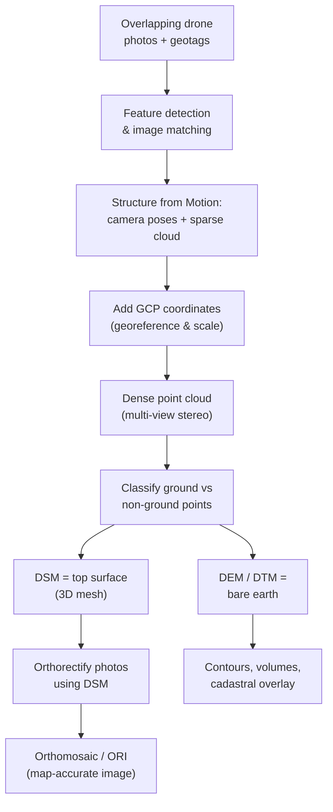

> [!focus] Exam Focus
> **Scale of a vertical photo = f / H** (focal length ÷ flying height above datum), **relief displacement is radial from the nadir/principal point and increases with object height & distance from centre**, standard **forward overlap ≈ 60%, side lap ≈ 30%**, and **stereoscopy needs ~60% overlap** to form a 3-D model. For drones remember the SfM chain: **image matching → sparse then dense point cloud → DSM/DEM → orthomosaic (ORI)**, and the key distinction **DSM = top surface (canopy, roofs) vs DEM/DTM = bare earth**. GCPs georeference and control the model; check points assess accuracy.

# Photogrammetry, Aerial & Drone Survey (ಛಾಯಾಚಿತ್ರ ಮಾಪನ / ಡ್ರೋನ್ ಸಮೀಕ್ಷೆ)

Modern surveying block of Paper 2 — see [[02b_Paper2_Official_Syllabus]]. Sibling notes: [[15_Satellite_Imagery_Remote_Sensing_and_GIS]] and [[16_GNSS_DGPS_RTK_and_CORS]].

## 1. Photogrammetry — definition & principle

**Photogrammetry (ಛಾಯಾಚಿತ್ರ ಮಾಪನಶಾಸ್ತ್ರ)** is the science and art of obtaining **reliable measurements, maps and 3-D models of objects and terrain from photographs**, without physically touching the object. The core idea: a photograph is a **central (perspective) projection** — every ground point, the corresponding image point and the camera lens (perspective centre) lie on one straight ray. From two or more overlapping photographs taken from different positions, the intersecting rays reconstruct the 3-D position of each point (**the principle of stereoscopic intersection / space resection & intersection**).

**Branches:**

| Branch | Basis | Typical use |
|---|---|---|
| **Aerial photogrammetry** | Camera in aircraft/drone, near-vertical axis | Topographic mapping, DEM, orthophotos |
| **Terrestrial (close-range)** | Camera on ground/tripod | Facades, structures, monuments, forensics |
| **Analog → Analytical → Digital** | Optical/mechanical → math models → softcopy on computer | Modern work is fully **digital (softcopy) photogrammetry** |

## 2. Aerial photograph geometry

### Vertical vs oblique photographs

| Type | Camera axis | Feature |
|---|---|---|
| **Truly vertical** | Optical axis exactly vertical | Ideal; rare in practice |
| **Near-vertical / tilted** | Axis within ~3° of vertical | Normal mapping photography |
| **Low oblique** | Tilted, horizon **not** shown | Reconnaissance |
| **High oblique** | Tilted, horizon **visible** | Illustration, panoramas |

Key points on a vertical photo: **principal point** (foot of optical axis on the image), **nadir point** (image of the point vertically below the camera — same as principal point on a truly vertical photo), **isocentre**, and **fiducial marks** whose intersection defines the principal point.

### Scale of a vertical photograph — importance of scale & height

For flat terrain the **photo scale**:

$$ S = \frac{f}{H} = \frac{1}{H/f} $$

where **f = focal length** of the camera and **H = flying height above the ground datum**. Because scale depends on H, a change in terrain elevation changes the scale point-to-point. For a point at ground elevation **h** above datum with flying height **H** above the same datum:

$$ S = \frac{f}{H - h} $$

So higher ground (smaller H − h) appears at a **larger scale**. Average scale uses mean ground elevation. Photo scale drives **flying height planning**: to get a required Ground Sample Distance (GSD) you fix H for a given camera; lower flight = finer detail but more photos and more flight lines.

### Relief displacement

**Relief displacement** is the **radial shift of the image of any point that is not at datum, measured outward from the principal/nadir point**. A tall object leans outward from the centre of the photo. Magnitude:

$$ d = \frac{r \cdot h}{H} $$

where **r** = radial distance of the image point from the principal point, **h** = height of the object above datum, **H** = flying height. Consequences: (i) it increases with object height and with distance from centre; (ii) it is **zero at the principal point**; (iii) it lets us **measure heights of towers/buildings** from a single photo; and (iv) it is exactly what **orthorectification** removes to make a photo map-accurate.

### Overlap, sidelap & stereoscopy

- **Forward overlap (end lap)** between successive photos in a strip ≈ **60%** — required so every ground point appears on at least two photos for stereo viewing and for the tie between photos.
- **Side lap (lateral overlap)** between adjacent strips ≈ **30%** (often 20–40%).
- The 3-D-viewable region common to two overlapping photos is the **stereoscopic model**; the fixed camera-base-to-height relation gives depth perception.
- **Stereoscopy (ಸ್ಟೀರಿಯೊಸ್ಕೋಪಿ)**: viewing the overlapping pair (a **stereo-pair**) so the left eye sees the left photo and the right eye the right photo produces a 3-D impression, viewed with a **mirror or pocket stereoscope**. **Parallax** (the apparent shift of a point between the two photos) is measured to compute **heights/elevations** — greater parallax = closer to camera = higher ground.

## 3. Aerial survey — methods, flight planning & applications

**Methods:** plan a project boundary → choose scale/GSD → fix flying height and camera → design **flight lines (parallel strips)** with the required end lap and side lap → fly and expose photos → establish **ground control** → do **aerial triangulation (bundle adjustment)** to tie the block → compile maps, DEM and orthophotos.

**Flight-planning basics** decide: flying height H (from scale/GSD), photo/ground coverage, **air base B** (ground distance between successive exposures = photo ground-side × (1 − overlap)), spacing between strips (from side lap), number of photos per strip and number of strips, exposure interval and aircraft speed, and Sun angle/weather window.

**Applications (importance):** topographic and cadastral mapping, DEM/contour generation, volume and area computation, town planning, highway/canal/railway alignment, forestry and agriculture, disaster assessment, mining, and updating of village/revenue maps. Advantages: **large area covered quickly, permanent record, access to difficult terrain, high point density**; limits: cost of manned flights, dependence on weather and ground control, and processing skill.

## 4. Drone (UAV) imagery — the modern workflow

A **drone / UAV (Unmanned Aerial Vehicle, ಡ್ರೋನ್)** carries a camera at low altitude, giving very high resolution (cm-level GSD) at low cost — now the standard tool for small-to-medium cadastral and engineering surveys.

### Types of drones

| Type | Feature | Best for |
|---|---|---|
| **Multirotor (quadcopter/hexacopter)** | Vertical take-off, hover, easy control | Small sites, detailed mapping, inspection |
| **Fixed-wing** | Long endurance, large area per flight | Corridors, large blocks; needs runway/launch |
| **VTOL / hybrid** | Vertical take-off + fixed-wing cruise | Large area without runway |

Sensors carried: **RGB optical camera** (most common), **multispectral** (crop/vegetation), **thermal**, and **LiDAR** (direct 3-D point cloud, penetrates canopy).

### Drone survey planning

Define the **Area of Interest** and required **GSD/accuracy** → choose drone & camera → set **flying height** (H sets GSD) → set **front overlap (typically 70–80%)** and **side overlap (60–70%)** — higher than manned photography because SfM needs many matching views → autopilot **mission plan (grid/double-grid for facades, corridor for roads)** → plan **GCPs and check points** → check airspace, permissions and weather.

### Ground Control Points (GCPs)

**GCPs** are marked, clearly visible targets on the ground whose **precise coordinates are measured by GNSS/RTK or total station**. They **georeference the model to real-world coordinates and control scale, tilt and distortion**, sharply improving absolute accuracy. **Check points** are additional surveyed points **not** used in processing, kept aside to independently verify accuracy. Rule of thumb: distribute GCPs evenly across the site and edges, with at least a few in the interior. Drones with **RTK/PPK** onboard need fewer GCPs but check points are still advised.

### Image acquisition

The drone flies the planned grid, the camera fires at fixed intervals/positions (geotagged with onboard GNSS), producing hundreds of overlapping photos with EXIF position/attitude. Consistent lighting, minimal wind and correct exposure keep the block sharp.

## 5. Processing — Structure from Motion (SfM) pipeline

The pipeline begins by finding the **same feature points across many overlapping photos**; **Structure from Motion (SfM)** then simultaneously solves the **camera positions/orientations and a sparse 3-D point cloud** purely from these matches (no prior camera info needed). **GCPs are introduced** to lock the model to real-world coordinates and correct scale/tilt. **Multi-view stereo (MVS)** densifies this into a **dense point cloud** of millions of points; classifying them into ground/non-ground yields the **DEM (bare earth)** and, from the full top surface, the **DSM**. Finally each photo is **orthorectified** (relief and tilt displacement removed using the surface model) and blended into a single **orthomosaic / Ortho-Rectified Image (ORI)** on which distances and areas can be measured directly like a map.

### DEM vs DSM vs DTM

| Model | Represents | Includes buildings/trees? |
|---|---|---|
| **DSM (Digital Surface Model)** | Top of everything — canopy, roofs, structures | **Yes** |
| **DEM (Digital Elevation Model)** | Elevation of terrain (often used generically) | Usually bare-earth in this context |
| **DTM (Digital Terrain Model)** | Bare-earth ground surface + breaklines | **No** |

An **orthomosaic** is a *2-D map-accurate image*; a **DSM/DEM** stores *elevation (Z)*. Both come from the same dense cloud.

### Softwares used

**Agisoft Metashape, Pix4D / Pix4Dmapper, DroneDeploy, DJI Terra, OpenDroneMap (open-source), Bentley ContextCapture, and Trimble/Propeller** for SfM processing; outputs are then taken into **GIS/CAD (QGIS, ArcGIS, AutoCAD)** for cadastral overlay and area computation. Mission planning uses **DJI Pilot, Litchi, Pix4Dcapture**.

## 6. Mnemonics

> - **Photo scale = f / H** → "**Focal over Height**".
> - Overlap values: "**Sixty forward, thirty side**" (60% end lap, 30% side lap).
> - Relief displacement: "**Tall things lean OUT from the centre**" (radial, ∝ height × radius ÷ H).
> - SfM pipeline: "**Match → Sparse → Dense → Surface → Ortho**" = **"My Steady Drone Sees Orthophotos."**
> - **DSM = Surface (tops); DTM = Terrain (bare earth).**
> - GCP vs check point: "**Control builds the model; Check tests the model.**"

## Likely questions (PYQ-style)

*Compiled/expected pattern, not official.*

1. **The scale of a truly vertical aerial photograph over flat ground is** (a) H/f (b) **f/H** (c) f·H (d) f + H — *Answer: b*.
2. **Relief displacement on a vertical photograph is** (a) tangential (b) **radial from the principal/nadir point, increasing with height** (c) zero for all points (d) constant — *Answer: b*.
3. **Typical forward (end) overlap in aerial photography is about** (a) 20% (b) 30% (c) **60%** (d) 90% — *Answer: c*.
4. **Minimum overlap needed for stereoscopic viewing of a pair is about** (a) 10% (b) 30% (c) **60%** (d) 100% — *Answer: c*.
5. **A DSM differs from a DTM/DEM in that the DSM** (a) is bare earth (b) **includes buildings and vegetation (top surface)** (c) has no elevation (d) is 2-D only — *Answer: b*.
6. **Structure from Motion (SfM) primarily recovers** (a) only colour (b) **camera poses and a 3-D point cloud from overlapping images** (c) magnetic bearing (d) rainfall — *Answer: b*.
7. **Ground Control Points in a drone survey are used to** (a) power the drone (b) **georeference the model and improve absolute accuracy** (c) charge batteries (d) increase overlap — *Answer: b*.
8. **An orthomosaic (ORI) is** (a) a raw tilted photo (b) **a mosaicked, relief-corrected, map-accurate image** (c) a contour map (d) a point cloud — *Answer: b*.
9. **A fixed-wing drone compared with a multirotor** (a) hovers better (b) **covers larger areas per flight** (c) has vertical-only flight (d) cannot carry a camera — *Answer: b*.
10. **The height of a vertical object can be found from a single photo using** (a) side lap (b) **relief displacement d = r·h/H** (c) focal length only (d) fiducial marks — *Answer: b*.

> [!tip] 60-second revision
> - **Photogrammetry = measurements from photos**; photo = central projection, rays reconstruct 3-D.
> - **Scale = f / H**; higher ground → larger scale.
> - **Relief displacement radial from centre, d = r·h/H**, zero at principal point, removed by orthorectification.
> - **Overlap 60% forward, 30% side; stereo needs ~60%**; parallax → heights.
> - **Drones: multirotor (small/detail), fixed-wing (large area), VTOL (both).**
> - **GCPs georeference & control; check points verify accuracy.**
> - **SfM: match → sparse cloud → dense cloud → DSM/DEM → orthomosaic (ORI).**
> - **DSM = tops; DTM = bare earth; orthomosaic = 2-D map image.**
> - Software: **Metashape, Pix4D, DroneDeploy, DJI Terra, OpenDroneMap.**
> - Related: [[02b_Paper2_Official_Syllabus]] | [[15_Satellite_Imagery_Remote_Sensing_and_GIS]] | [[16_GNSS_DGPS_RTK_and_CORS]]
