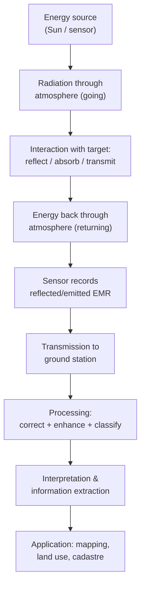

> [!focus] Exam Focus
> Know the **four resolutions cold — Spatial (pixel size/detail), Spectral (number & width of bands), Temporal (revisit time), Radiometric (bit depth/grey levels)**. **Passive sensors need external Sun energy (optical/multispectral); active sensors carry their own (SAR, LiDAR)**. Remote sensing = **energy source → interaction with atmosphere → interaction with target (reflect/absorb/transmit) → sensor → data → processing**. **GIS = Hardware + Software + Data + People + Methods**; **vector (points/lines/polygons) for cadastral boundaries, raster (grid of cells) for imagery/DEM.**

# Satellite Imagery, Remote Sensing & GIS (ದೂರ ಸಂವೇದನೆ / ಜಿ.ಐ.ಎಸ್.)

Modern surveying block of Paper 2 — see [[02b_Paper2_Official_Syllabus]]. Sibling notes: [[14_Photogrammetry_Aerial_and_Drone_Survey]] and [[16_GNSS_DGPS_RTK_and_CORS]].

## 1. Remote sensing — principle

**Remote sensing (ದೂರ ಸಂವೇದನೆ)** is the science of acquiring information about the earth's surface **without being in physical contact**, by detecting and recording the **electromagnetic radiation (EMR)** reflected or emitted from it. The recorded energy is turned into images and interpreted.

**The remote sensing process (7 elements):**

Energy from a source (mostly the **Sun** for passive systems) travels through the atmosphere, **interacts with the target** — where different materials reflect, absorb or transmit differently (this **spectral response / signature** is what lets us tell water from vegetation from soil) — returns through the atmosphere, and is **recorded by a sensor**. The data are downlinked, **processed and classified**, then interpreted for the final application. Each material's unique **spectral signature** (e.g., healthy vegetation reflects strongly in near-infrared) is the physical basis of all classification.

## 2. Electromagnetic radiation (EMR) & interaction

EMR travels as waves characterised by **wavelength (λ)** and **frequency (ν)**, with **c = λν**. The **EM spectrum** used in remote sensing:

| Region | Approx. wavelength | Use |
|---|---|---|
| **Visible** | 0.4–0.7 µm (Blue, Green, Red) | Natural-colour imaging |
| **Near / Shortwave IR (NIR/SWIR)** | 0.7–3 µm | Vegetation, moisture, minerals |
| **Thermal IR** | 3–15 µm | Temperature, heat mapping |
| **Microwave** | 1 mm–1 m | **SAR/RADAR**, all-weather, cloud-penetrating |

**Atmospheric windows** are wavelength ranges where the atmosphere transmits energy well (used for sensing); elsewhere gases **absorb/scatter** it. Energy interacting with the target splits into **reflected + absorbed + transmitted** (energy balance). Scattering types: **Rayleigh (small particles, blue sky), Mie (aerosols), non-selective (clouds/fog, all λ equally)**.

## 3. Resolutions — the four types

| Resolution | Meaning | Example distinction |
|---|---|---|
| **Spatial** | Ground area of one pixel (GSD) — level of **detail** | 30 m (Landsat) vs 0.5 m (high-res) |
| **Spectral** | **Number and width of bands** the sensor records | Panchromatic (1) < Multispectral (few) < **Hyperspectral (100s)** |
| **Temporal** | **Revisit time** — how often the same place is imaged | Daily vs 16-day |
| **Radiometric** | **Bit depth / number of grey levels** (sensitivity) | 8-bit (256) vs 12-bit (4096) |

There is usually a **trade-off**: very high spatial resolution often means smaller swath and less frequent revisit. Understanding which resolution a question targets is the single most common MCQ theme.

## 4. Types of sensors — passive vs active

| | **Passive** | **Active** |
|---|---|---|
| Energy | Uses **external source (Sun / earth's emission)** | **Carries its own** energy source |
| Examples | Optical, multispectral, hyperspectral, thermal cameras | **RADAR / SAR, LiDAR, laser altimeter** |
| Day/night | Needs sunlight (except thermal) | **Works day & night** |
| Cloud/weather | Blocked by cloud | **SAR penetrates cloud** |

- **LiDAR (Light Detection and Ranging)** — an **active sensor** that fires laser pulses and times the return (**range = c·t/2**), producing a dense 3-D **point cloud**; it **penetrates vegetation gaps to map bare earth (DTM)** and is prized for high-accuracy elevation and forestry.
- **SAR (Synthetic Aperture Radar)** — active microwave imaging; **all-weather, day/night, cloud-penetrating**; used for terrain, deformation (InSAR), flood and soil-moisture mapping.

## 5. Types of satellites & image acquisition

| Type | Records | Notes |
|---|---|---|
| **Optical / Panchromatic** | Single broad visible band | Sharpest detail (highest spatial), grey-scale |
| **Multispectral** | A few discrete bands (e.g., B,G,R,NIR) | Standard land-cover mapping (Landsat, Sentinel-2, IRS/Resourcesat) |
| **Hyperspectral** | Hundreds of narrow contiguous bands | Fine material/mineral discrimination |
| **SAR (microwave)** | Active radar backscatter | All-weather (Sentinel-1, RISAT) |

**Image acquisition:** a satellite in a **Sun-synchronous polar orbit** scans successive strips (**push-broom or whisker-broom scanners**) as the earth rotates beneath; data are quantised per band and downlinked to receiving stations. **Orbit types:** **Sun-synchronous / near-polar** (fixed local Sun time, good for imaging, ~700–900 km) and **geostationary** (~35,786 km, fixed over one point — weather/communication).

## 6. Imagery processing

- **Radiometric correction** — remove sensor/atmospheric errors, striping, haze.
- **Geometric correction / rectification** — fit the image to a map coordinate system using **Ground Control Points** and a resampling (nearest-neighbour, bilinear, cubic).
- **Orthorectification** — additionally removes **terrain relief distortion** using a DEM, giving a truly map-accurate image (same idea as in [[14_Photogrammetry_Aerial_and_Drone_Survey]]).
- **Mosaicking** — join adjacent corrected scenes into one seamless image (colour-balanced).
- **Image enhancement** — contrast stretch, band ratios, filtering, **NDVI** = (NIR − Red)/(NIR + Red) for vegetation.
- **Classification & information extraction:**

| Method | How |
|---|---|
| **Supervised** | Analyst defines **training samples** for known classes; algorithm (Maximum Likelihood, SVM) labels the rest |
| **Unsupervised** | Algorithm **clusters** pixels statistically (ISODATA, K-means); analyst labels clusters |
| **Object-based (OBIA)** | Segments the image into objects then classifies |

**Visual (manual) interpretation** uses the elements **tone, texture, shape, size, pattern, shadow, site & association**; **digital processing** uses the numerical pixel values and algorithms above.

**Softwares used:** **Google Earth Engine** (cloud-based analysis of huge archives), **ArcGIS Image Analyst / ArcGIS Pro, ERDAS IMAGINE, ENVI, QGIS (with SCP), SNAP** (for Sentinel/SAR).

## 7. Geographical Information System (GIS)

**GIS (ಭೌಗೋಳಿಕ ಮಾಹಿತಿ ವ್ಯವಸ್ಥೆ)** is a computer system to **capture, store, manage, analyse and display spatially referenced (geographic) data** — combining *where* (location) with *what* (attributes).

### Components — "**HSDPM**"

| Component | Role |
|---|---|
| **Hardware** | Computers, servers, GNSS, scanners, plotters |
| **Software** | ArcGIS, QGIS — tools for storage, analysis, display |
| **Data** | Spatial (vector/raster) + attribute; the costliest, most vital part |
| **People** | Analysts, surveyors, decision-makers |
| **Methods / Procedures** | Well-defined workflows, standards, models |

### Vector vs Raster

| | **Vector** | **Raster** |
|---|---|---|
| Model | **Points, lines, polygons** with coordinates | **Grid of cells (pixels)**, each with a value |
| Best for | **Discrete features — parcels, roads, boundaries** | **Continuous surfaces — imagery, DEM, temperature** |
| Precision | High, scalable, exact boundaries | Depends on cell size |
| Attributes | Rich per-feature tables | One value per cell (per layer) |
| Cadastral use | **Parcel/survey-number boundaries stored as polygons** | Base imagery underlay |

Data are organised in **thematic layers** (roads, parcels, water, land use) overlaid by common coordinates; core analysis includes **overlay, buffering, network analysis, spatial query and geostatistics**.

### Applications & cadastral mapping

Land-use/land-cover mapping, urban and infrastructure planning, natural-resource and watershed management, disaster management, utilities, and — most relevant here — **cadastral mapping**: **survey-number/parcel boundaries are stored as vector polygons with attributes (owner, area, land-use, RTC details)**, georeferenced onto satellite/drone imagery. This underpins **digitisation of village maps, land-records modernisation and spatial land administration**, linking the graphic parcel to the textual record.

## 8. Mnemonics

> - Four resolutions: "**Space Spends Time Radiantly**" → **S**patial, **S**pectral, **T**emporal, **R**adiometric.
> - Passive vs active: "**Passive borrows the Sun; Active brings its own torch (SAR, LiDAR).**"
> - GIS components: "**HSDPM — Hardware, Software, Data, People, Methods**" → "**Happy Surveyors Draw Precise Maps.**"
> - Vector vs raster: "**Vector = boundaries (parcels); Raster = pictures (imagery/DEM).**"
> - Spectral order: "**Pan (1) < Multi (few) < Hyper (hundreds).**"
> - Scattering: "**Rayleigh = blue sky, Mie = haze, Non-selective = white cloud.**"

## Likely questions (PYQ-style)

*Compiled/expected pattern, not official.*

1. **Spatial resolution refers to** (a) revisit time (b) **the ground size represented by one pixel (detail)** (c) number of bands (d) bit depth — *Answer: b*.
2. **The number and width of bands recorded by a sensor is its** (a) spatial (b) **spectral** (c) temporal (d) radiometric resolution — *Answer: b*.
3. **Revisit time of a satellite over the same area is its** (a) spatial (b) spectral (c) **temporal** (d) radiometric resolution — *Answer: c*.
4. **Which is an active sensor?** (a) Multispectral camera (b) Panchromatic (c) **SAR / LiDAR** (d) Thermal scanner — *Answer: c*.
5. **A hyperspectral sensor is characterised by** (a) one band (b) a few bands (c) **hundreds of narrow contiguous bands** (d) no bands — *Answer: c*.
6. **The correct sequence of the remote-sensing process begins with** (a) sensor (b) **energy source** (c) classification (d) application — *Answer: b*.
7. **Which GIS data model best stores cadastral parcel boundaries?** (a) Raster (b) **Vector (polygons)** (c) Point cloud only (d) Text — *Answer: b*.
8. **The five components of GIS are hardware, software, data, people and** (a) satellites (b) **methods/procedures** (c) drones (d) money — *Answer: b*.
9. **Removing terrain relief distortion from an image using a DEM is called** (a) mosaicking (b) **orthorectification** (c) classification (d) filtering — *Answer: b*.
10. **NDVI is computed as** (a) Red − Blue (b) **(NIR − Red)/(NIR + Red)** (c) NIR × Red (d) Green/Blue — *Answer: b*.
11. **Supervised classification requires** (a) no input (b) **analyst-defined training samples** (c) only clustering (d) a DEM — *Answer: b*.
12. **Which sensor works through clouds, day and night?** (a) Optical (b) Panchromatic (c) **SAR (microwave radar)** (d) Thermal only — *Answer: c*.

> [!tip] 60-second revision
> - **Remote sensing = info without contact, via reflected/emitted EMR**; process: source → atmosphere → target → sensor → data → processing → application.
> - **Four resolutions: Spatial (detail), Spectral (bands), Temporal (revisit), Radiometric (grey levels).**
> - **Passive = uses Sun (optical, multispectral, hyperspectral, thermal); Active = own energy (SAR, LiDAR).**
> - **LiDAR → 3-D point cloud, penetrates canopy → bare-earth DTM; SAR → all-weather microwave.**
> - **Processing: radiometric → geometric rectification → orthorectification → mosaic → classify.**
> - **Classification: supervised (training samples) vs unsupervised (clustering).**
> - **GIS = Hardware + Software + Data + People + Methods.**
> - **Vector = parcels/boundaries; Raster = imagery/DEM; cadastre stored as vector polygons.**
> - Software: **Google Earth Engine, ArcGIS Image Analyst, ERDAS, ENVI, QGIS.**
> - Related: [[02b_Paper2_Official_Syllabus]] | [[14_Photogrammetry_Aerial_and_Drone_Survey]] | [[16_GNSS_DGPS_RTK_and_CORS]]
