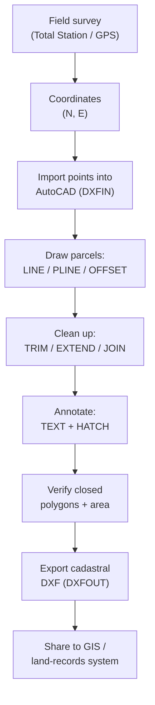

> [!focus] Exam Focus
> **MS Excel survey formulae** (`SUM`, `AVERAGE`, `SQRT`, `SUMSQ`, `ATAN2`, `RADIANS`/`DEGREES`, `VLOOKUP`, `ROUND`), the **AutoCAD core command set** (LINE, CIRCLE, ARC, TRIM, EXTEND, OFFSET, HATCH, MIRROR, EXTRUDE), the difference between **2D draughting and 3D solids (EXTRUDE / REVOLVE)**, and above all **DXF import/export for cadastral data** are the highest-yield items. Remember: **DXF = Drawing eXchange Format, an open ASCII/plain-text interchange file**, while **DWG is AutoCAD's native binary**. Common shortcuts: `Ctrl+C/V/Z/Y/S/P`, and AutoCAD aliases `L, C, A, TR, EX, O, H, MI, EXT`.

# Computer Applications — MS Office & AutoCAD (ಕಂಪ್ಯೂಟರ್ ಅನ್ವಯಗಳು)

This note covers the **office productivity suite** and **AutoCAD** portions of the Computer Applications block (20% of Paper 2). Focus is on features a **land surveyor actually uses**: tabulating field data, computing areas and coordinates in Excel, and drafting/editing cadastral drawings and DXF plots in AutoCAD.

## 1. MS Office overview (ಎಂ.ಎಸ್. ಆಫೀಸ್)

**MS Office** is Microsoft's integrated productivity suite. The three core applications examined are:

| Application | Type | Surveyor's use |
|---|---|---|
| **MS Word** (ವರ್ಡ್) | Word processor | Reports, notices, survey memos, letter-heads |
| **MS Excel** (ಎಕ್ಸೆಲ್) | Spreadsheet | Field-book computation, area, coordinates, level-books |
| **MS PowerPoint** (ಪವರ್‌ಪಾಯಿಂಟ್) | Presentation | Awareness slides, project briefings |

### 1.1 MS Word — core features

- **Editing & formatting:** fonts, paragraph alignment, line spacing, bullets/numbering, styles and headings.
- **Page layout:** margins, orientation (portrait/landscape), page size, headers/footers, page numbers.
- **Tables** for tabulated survey data; **Mail Merge** for issuing many similar notices (e.g., mutation notices) from one template + a data list.
- **Insert:** images, shapes, symbols, equations; **Track Changes** and **Comments** for review.
- **Review:** spell-check, word count; **References:** table of contents, footnotes.

### 1.2 MS Excel — core features

- Organised in **rows (numbered) and columns (lettered)**; the intersection is a **cell** with an **address** like `C5`. A group is a **range** (`A1:A10`).
- **Cell references:** **relative** (`A1`, shifts when copied), **absolute** (`$A$1`, fixed), **mixed** (`$A1`, `A$1`).
- **Charts** (column, line, scatter) — a **scatter (XY) plot** draws a traverse or plotted stations from N/E coordinates.
- **Sort, Filter, Freeze Panes, Conditional Formatting, Data Validation, Pivot Table** for large field registers.
- A **formula begins with `=`**; a **function** is a built-in formula (e.g., `=SUM(...)`).

### 1.3 Excel formulae/functions relevant to survey computation

| Function | Purpose in survey work |
|---|---|
| `=SUM(range)` | Total of latitudes/departures, chainages |
| `=AVERAGE(range)` | Mean of repeated angle/level readings |
| `=SQRT(number)` | Distance from ΔN, ΔE: `=SQRT(dN^2+dE^2)` |
| `=SUMSQ(a,b)` | Sum of squares (used inside distance/RMS) |
| `=POWER(x,2)` or `x^2` | Squaring for area/distance |
| `=RADIANS()` / `=DEGREES()` | Convert bearings before/after trig |
| `=SIN()`, `=COS()`, `=TAN()` | Latitude = L·cos(θ), Departure = L·sin(θ) |
| `=ATAN2(dE,dN)` | Bearing from departure & latitude (quadrant-correct) |
| `=ROUND(x, n)` | Round coordinates/areas to n decimals |
| `=VLOOKUP(key,table,col,FALSE)` | Look up a station's coordinates by name |
| `=IF(test,a,b)` | Add 360° if bearing negative, apply checks |
| `=COUNT()`, `=MAX()`, `=MIN()` | Number of stations, extreme levels |

> **Worked idea — latitude & departure of a line:** with length in `B2` and whole-circle bearing (degrees) in `C2`:
> `Latitude =B2*COS(RADIANS(C2))` and `Departure =B2*SIN(RADIANS(C2))`.
> Line length back from coordinates: `=SQRT((E2-E1)^2+(N2-N1)^2)`; bearing: `=DEGREES(ATAN2(dE,dN))`.

### 1.4 MS PowerPoint — core features

- **Slides** built from **layouts, placeholders, themes**; **Slide Master** for uniform styling.
- **Transitions** (between slides) vs **Animations** (of objects on a slide).
- **Insert** images, tables, charts, SmartArt; **Slide Show** view (`F5` from start, `Shift+F5` from current).
- **Notes pane** for speaker notes; export to PDF/handout.

### 1.5 Common shortcuts (across MS Office)

| Shortcut | Action | Shortcut | Action |
|---|---|---|---|
| `Ctrl+C / X / V` | Copy / Cut / Paste | `Ctrl+Z / Y` | Undo / Redo |
| `Ctrl+S` | Save | `Ctrl+P` | Print |
| `Ctrl+B / I / U` | Bold / Italic / Underline | `Ctrl+F / H` | Find / Replace |
| `Ctrl+A` | Select all | `Ctrl+Home / End` | Top / bottom of doc |
| Excel `F2` | Edit active cell | Excel `F4` | Toggle `$` absolute ref |
| Excel `Ctrl+;` | Insert date | PowerPoint `F5` | Start slide show |

## 2. AutoCAD — introduction (ಆಟೋಕ್ಯಾಡ್)

**AutoCAD** (by Autodesk) is a **Computer-Aided Design/Drafting (CAD)** package for precise **2D drawings and 3D models**. In survey practice it is used to plot **cadastral (village) maps, plot/site plans, sub-division (phodi) sketches, contour plans and layouts**. Drawings are stored to a **real-world scale (drawn 1:1 in model space, plotted at a scale)** using **coordinates** — the same N/E logic as the field.

**Workspace basics:** the **Model space** (draw at full size), **Layout/Paper space** (arrange for printing), the **command line** (type commands/aliases), **UCS** (User Coordinate System) icon, and **status bar** toggles — **ORTHO**, **OSNAP** (object snap), **GRID**, **SNAP**, **POLAR**. Coordinates can be entered **absolute** (`x,y`), **relative** (`@dx,dy`), or **relative polar** (`@dist<angle>`).

### 2.1 Core commands (with aliases)

| Command | Alias | What it does |
|---|---|---|
| **LINE** | `L` | Draw straight line segments |
| **PLINE** | `PL` | Polyline (connected segments as one object) |
| **CIRCLE** | `C` | Circle by centre-radius/diameter, 2P, 3P, TTR |
| **ARC** | `A` | Arc (3-point, start-centre-end, etc.) |
| **RECTANG** | `REC` | Rectangle from two corners |
| **POLYGON** | `POL` | Regular polygon (n sides) |
| **TRIM** | `TR` | Cut objects at a cutting edge |
| **EXTEND** | `EX` | Lengthen objects to a boundary |
| **OFFSET** | `O` | Parallel copy at a set distance |
| **FILLET / CHAMFER** | `F` / `CHA` | Rounded / bevelled corner |
| **MIRROR** | `MI` | Reflect a copy about an axis |
| **MOVE / COPY** | `M` / `CO` | Reposition / duplicate |
| **ROTATE / SCALE** | `RO` / `SC` | Turn / resize |
| **ARRAY** | `AR` | Rectangular/polar repetition |
| **HATCH** | `H` | Fill an area with a pattern/solid |
| **TEXT / MTEXT** | `DT` / `T` | Single-line / multi-line text |
| **DIMLINEAR / DIM** | `DLI` / `DIM` | Dimensioning |
| **ERASE / OOPS** | `E` | Delete / restore last erased |
| **EXTRUDE** | `EXT` | 2D profile → 3D solid |
| **REVOLVE** | `REV` | Spin a profile about an axis → 3D solid |

### 2.2 Drawing simple figures

- **Rectangle:** `RECTANG` → pick first corner → type `@30,20` (30 long, 20 wide) → done. Or `LINE` with relative coordinates.
- **Triangle:** `LINE` → point 1 → `@60,0` → `@-30,52` → `C` (close) gives a closed triangle; or draw three lines and **TRIM** overshoots.
- **Circle:** `CIRCLE` → centre → radius. **Arc:** `ARC` → 3 points or start/centre/end.
- Use **OSNAP** (endpoint, midpoint, intersection, centre) and **ORTHO** for clean, exact geometry.

### 2.3 Text, hatching and editing

- **Text writing:** `MTEXT` for a paragraph (survey number, owner name, area); set **text style/height**; `DTEXT` for quick single lines and labels.
- **Hatching:** `HATCH` → pick a **closed boundary** → choose a **pattern** (e.g., `ANSI31`, `SOLID`, `EARTH`) and **scale/angle** → apply. Used to shade land parcels, built-up area, water bodies on a cadastral plan.
- **MIRROR option:** select object → `MIRROR` → pick two points of the mirror line → keep or delete source. Handy for symmetric layouts and reflected plots.
- **Editing:** `TRIM`/`EXTEND` to close/clean parcel boundaries, `OFFSET` for road/plot setbacks, `STRETCH`, `EXPLODE` (break a block/polyline into parts), `JOIN`.

### 2.4 2D vs 3D development

- **2D elements:** lines, polylines, arcs, circles on the XY plane — the normal cadastral/plan drawing.
- **3D development:** give geometry a **Z / thickness/elevation**; **EXTRUDE** turns a closed 2D profile into a 3D solid of a chosen height; **REVOLVE** spins a profile about an axis; **PRESSPULL** pushes a region into a solid. View with **3DORBIT**, **VPOINT**, and visual styles (wireframe/shaded). Used for terrain/volume and building-mass visualisation.

### 2.5 Working with DXF files — cadastral data

**DXF = Drawing eXchange Format**, an **open, published, plain-text (ASCII) interchange format** created by Autodesk so drawings move **between different CAD/GIS packages** (AutoCAD ↔ QGIS ↔ Bhoomi/cadastral systems). **DWG** is AutoCAD's native **binary** format — smaller and faster but proprietary.

- **Export (`DXFOUT` / Save As → `.dxf`):** send a cadastral drawing to another system; choose an ASCII DXF and a version compatible with the receiver.
- **Import (`DXFIN` / Open):** bring survey/cadastral DXF (village map, parcel boundaries) into AutoCAD for editing.
- **Editing cadastral DXF:** correct **layer names** (parcel, boundary, text, survey-number), snap boundaries, close open polygons (needed for correct **area**), reposition mislabelled survey-number text, and re-export cleanly. Keep **coordinates georeferenced** so the file overlays correctly in GIS.

The flow shows the surveyor's normal loop: coordinates from the instrument are imported, parcel geometry is drawn and cleaned so every boundary forms a **closed polygon** (essential for area to compute), text and hatching label the parcels, and the result is exported as a **DXF** that any GIS or land-records package can read. Because DXF is plain text and open, it is the safe hand-off format between AutoCAD and systems like QGIS or the state cadastral database.

## 3. Why DXF matters for cadastral work

- **Interoperability:** open ASCII format readable by QGIS, GeoServer and land-records software — see [[18_Computer_GIS_Software]].
- **Layer discipline:** cadastral DXF typically separates **boundary, survey-number text, hatch, and control points** onto named layers so each can be edited independently.
- **Coordinates preserved:** exporting from a coordinate-based drawing keeps parcels georeferenced, so the DXF overlays correctly on a GIS map.
- **Version compatibility:** when exporting, pick a DXF version the receiving software supports (older versions are the safest for exchange).

> **Mnemonics**
> - Modify command family: **"T-E-O-M-M — Trim, Extend, Offset, Move, Mirror."**
> - 2D → 3D: **"Extrude pushes up, Revolve spins around."**
> - File formats: **"DXF = eXchange (text, open); DWG = native (binary, Autodesk)."** → *"X to eXchange, W stays at Work."*
> - Excel line length: **"SQRT of (dN² + dE²)."**
> - Coordinate entry: **"absolute `x,y`, relative `@dx,dy`, polar `@d<angle>`."**

## Likely questions (PYQ-style)
*Compiled in the style of the exam for practice — not official past papers.*

1. **DXF stands for** (a) Data eXchange File (b) **Drawing eXchange Format** (c) Digital eXtension Format (d) Drawing eXtra File — *Answer: b*.
2. **Which is AutoCAD's native binary drawing format?** (a) DXF (b) **DWG** (c) SHP (d) PDF — *Answer: b*.
3. **The AutoCAD command to make a parallel copy at a set distance is** (a) COPY (b) **OFFSET** (c) MIRROR (d) ARRAY — *Answer: b*.
4. **To convert a closed 2D profile into a 3D solid of a given height, use** (a) REVOLVE (b) **EXTRUDE** (c) HATCH (d) STRETCH — *Answer: b*.
5. **The Excel function best suited to compute line length from ΔN and ΔE is** (a) SUM (b) **SQRT (with squares)** (c) COUNT (d) ROUND — *Answer: b*.
6. **`$A$1` in Excel is an example of** (a) relative (b) **absolute** (c) mixed (d) circular reference — *Answer: b*.
7. **The command that cuts objects at a selected cutting edge is** (a) EXTEND (b) **TRIM** (c) ERASE (d) EXPLODE — *Answer: b*.
8. **`ATAN2(dE, dN)` in Excel is used to obtain** (a) area (b) **bearing (quadrant-correct)** (c) distance (d) level — *Answer: b*.
9. **Ctrl+Z performs** (a) Save (b) **Undo** (c) Redo (d) Print — *Answer: b*.
10. **HATCH requires the selected region to be** (a) any lines (b) **a closed boundary** (c) 3D solid (d) a block — *Answer: b*.

> [!tip] 60-second revision
> - **Office three:** Word (documents), Excel (computation), PowerPoint (slides).
> - **Excel survey kit:** `SUM, AVERAGE, SQRT, SIN/COS/TAN with RADIANS, ATAN2, VLOOKUP, ROUND`; `$` = absolute, `F4` toggles it.
> - **AutoCAD aliases:** `L, C, A, TR, EX, O, H, MI, EXT`; enter points as `x,y` / `@dx,dy` / `@d<angle>`.
> - **2D → 3D:** EXTRUDE (height), REVOLVE (spin); MIRROR reflects a copy.
> - **DXF = open ASCII interchange; DWG = native binary.** Import `DXFIN`, export `DXFOUT`; keep polygons **closed** and layers clean for cadastral hand-off.
> - Related: [[18_Computer_GIS_Software]] | [[19_Computer_Software_Solutions_and_Land_Records_IT]] | [[02b_Paper2_Official_Syllabus]]
