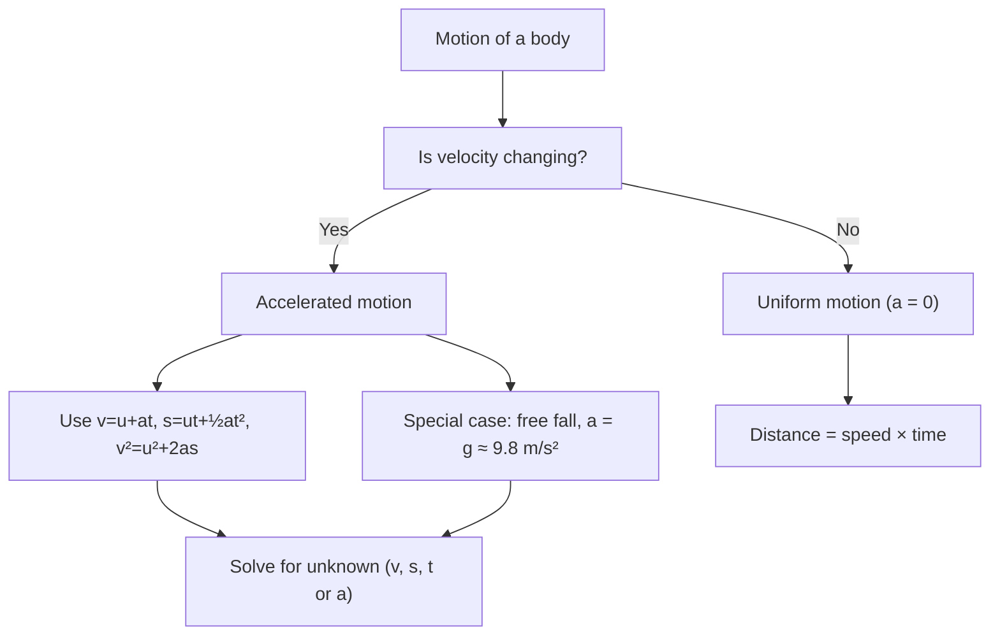

> [!focus] Exam Focus
> Highest-yield: the **equations of motion** ($v=u+at$, $s=ut+\tfrac12at^2$, $v^2=u^2+2as$), **Newton's second law** $F=ma$, **universal gravitation** $F=G\frac{m_1m_2}{r^2}$, the **EM spectrum order** (radio → micro → IR → visible → UV → X-ray → gamma), **temperature-scale conversions** ($\frac{C}{5}=\frac{F-32}{9}=\frac{K-273}{5}$), **refractive index** $n=\frac{\sin i}{\sin r}=\frac{c}{v}$, **lens/mirror formula** $\frac1v-\frac1u=\frac1f$, dia/para/ferromagnetic classification, **SONAR** distance $d=\tfrac12vt$, and **1 kWh = 1 unit = 3.6×10⁶ J**.

# Physics (ಭೌತಶಾಸ್ತ್ರ)

Physics is a 10% block of Paper 2 and rewards clean formula recall plus a few standard definitions. See the parent list in [[02b_Paper2_Official_Syllabus]]. This note follows the official sub-topic order: magnetism, electricity, EM radiation, electronics, dynamics, heat, light, sound and gravitation.

## 1. Magnetism (ಕಾಂತತ್ವ)

A **magnet (ಕಾಂತ)** attracts iron, nickel, cobalt and points north–south when suspended freely.

- **Natural magnet** — magnetite/lodestone (Fe₃O₄), found in nature, irregular and weak.
- **Artificial magnet** — man-made (bar, horseshoe, needle, electromagnet), stronger and of chosen shape.

**Properties of a magnet:**
- Attractive property — attracts magnetic materials, strongest at the poles.
- Directive property — freely suspended, it aligns north–south.
- Poles always exist in pairs; **like poles repel, unlike poles attract**; an isolated pole cannot exist (break a magnet → two smaller magnets).
- **Repulsion is the surest test** of magnetism (attraction alone can be induced).

**Magnetic field & detection** — the region around a magnet where its force acts. Detected with iron filings or a plotting **compass (ದಿಕ್ಸೂಚಿ)**; the compass needle aligns along the field.

**Magnetic lines of force** — imaginary closed curves running **N → S outside** the magnet and **S → N inside**; they never intersect, and their crowding shows field strength (denser = stronger).

| Class | Behaviour in a field | Example |
|---|---|---|
| **Diamagnetic** | weakly *repelled* | bismuth, copper, water |
| **Paramagnetic** | weakly *attracted* | aluminium, platinum |
| **Ferromagnetic** | strongly *attracted*, retain magnetism | iron, nickel, cobalt |

**Preparing magnets** — single-touch and double-touch (stroking method), by **induction**, and most effectively by the **electrical method** (passing current through a solenoid around the specimen).

**Earth's magnetism** — the Earth behaves like a huge bar magnet whose **magnetic south** lies near the geographic north. Elements: **declination** (angle between geographic and magnetic north), **dip/inclination** (angle of the needle with the horizontal) and the horizontal component of the field — directly relevant to a surveyor's compass work.

**Electromagnetism** — a current-carrying conductor produces a magnetic field (Oersted's discovery). A **solenoid** with a soft-iron core makes an **electromagnet** (temporary, controllable). Direction from the **right-hand thumb rule**.

**Instruments using the magnetic effect of current** — electric bell, galvanometer, ammeter, voltmeter, electric motor, loudspeaker, magnetic relay.

## 2. Electricity (ವಿದ್ಯುತ್)

- **Charge (Q)** in coulomb (C); **current (I)** in ampere (A), $I=Q/t$.
- **Potential difference (V)** in volt (V); **resistance (R)** in ohm (Ω); Ohm's law $V=IR$.
- **Electric power** $P=VI=I^2R=V^2/R$, unit **watt (W)**.
- **Practical (commercial) unit of energy = kilowatt-hour (kWh) = 1 "unit"**; $1\text{ kWh}=3.6\times10^6$ J.
- **Electromotive force (EMF)** — the energy a source gives per coulomb of charge driven round the circuit (volt); it is the terminal voltage on open circuit.

**Effects of electric current:**
- **Heating effect** — $H=I^2Rt$ (Joule's law); used in heater, iron, geyser, incandescent bulb.
- **Magnetic effect** — current makes a magnetic field; used in motors, bells, relays.
- **Chemical effect** — current through an electrolyte causes decomposition (electrolysis, electroplating).

**Electric fuse** — a short wire of low melting point and high resistance in series with the circuit; excess current melts it and breaks the circuit — a **safety device**.

**Electric bulb** — a tungsten filament (high melting point) in an inert gas (argon/nitrogen) glows white-hot by the heating effect.

**Sources of current:**
- **Cell** — converts chemical energy to electrical; a **primary cell** (e.g. dry cell / Leclanché) is non-rechargeable, a **secondary cell** (lead-acid) is rechargeable.
- **Dry cell** — zinc case (−), carbon rod (+), ammonium-chloride paste; EMF ≈ 1.5 V.

## 3. Electromagnetic radiation (ವಿದ್ಯುತ್ಕಾಂತ ವಿಕಿರಣ)

**EM waves** are transverse waves of oscillating electric and magnetic fields; they need **no medium** and travel in vacuum at $c=3\times10^8$ m/s. Relation $c=f\lambda$.

| Radiation (increasing frequency) | Typical use |
|---|---|
| **Radio waves** | radio, TV, mobile communication |
| **Microwaves** | RADAR, microwave oven, satellite links |
| **Infrared (IR)** | remote controls, thermal imaging, heating |
| **Visible light** | vision, photography, illumination |
| **Ultraviolet (UV)** | sterilisation, detecting forged notes, vitamin-D formation |
| **X-rays** | bone imaging, security scanning |
| **Gamma rays** | cancer therapy, sterilising equipment |

Mnemonic (low → high frequency): **"Radio Music In Very Unusual eXpensive Gadgets"** = Radio, Micro, IR, Visible, UV, X-ray, Gamma.

**Laser (Light Amplification by Stimulated Emission of Radiation)** — its light is **monochromatic** (single wavelength), **coherent** (in phase), **highly directional** and **intense**. Uses: surveying/distance measurement (EDM, total station), fibre-optic communication, CD/DVD, surgery, barcode readers.

## 4. Electronics (ಎಲೆಕ್ಟ್ರಾನಿಕ್ಸ್)

**Radio communication** — sound (audio) signal is superimposed on a high-frequency **carrier wave** (modulation: AM/FM).
- **Transmitter** — microphone → modulator → amplifier → antenna radiates EM waves.
- **Receiver** — antenna picks up the wave → tuner selects the station → demodulator recovers the audio → loudspeaker.

**Television** — transmits both **audio and video**; the camera converts a picture into electrical signals scanned line by line, broadcast as modulated EM waves, and the receiver reconstructs the image on the screen with synchronised sound.

## 5. Dynamics (ಚಲನಶಾಸ್ತ್ರ)

**Motion** — change of position with time relative to a reference.
- **Distance** — total path length (scalar, always ≥ 0). **Displacement** — shortest straight-line from start to finish (vector, can be zero/negative).
- **Speed** = distance/time (scalar); **velocity** = displacement/time (vector); **acceleration** $a=\frac{v-u}{t}$ (m/s²).

**Graphs of motion:**
- Distance–time slope = speed; a straight line = uniform speed.
- Velocity–time slope = acceleration; **area under a v–t graph = displacement**.

**Equations of motion (uniform acceleration):** $v=u+at$, $s=ut+\tfrac12at^2$, $v^2=u^2+2as$.

**Newton's laws of motion:**
1. **First (inertia)** — a body stays at rest or in uniform motion unless acted on by a net force.
2. **Second** — $F=ma$; force = rate of change of momentum ($F=\frac{d(mv)}{dt}$).
3. **Third** — every action has an equal and opposite reaction.

**Periodic motion** — motion repeating in equal time intervals (period $T$).
**Simple pendulum** — $T=2\pi\sqrt{\dfrac{L}{g}}$. **Laws:** period is (i) independent of mass and (of small) amplitude, (ii) proportional to $\sqrt{L}$, (iii) inversely proportional to $\sqrt{g}$.

**Waves & wave motion** — energy transfer without net transport of matter. **Transverse** (vibration ⊥ propagation, e.g. light) and **longitudinal** (vibration ∥ propagation, e.g. sound). $v=f\lambda$.

**Energy** — capacity to do work; **work** $W=F\times s$ (joule). **Kinetic** $KE=\tfrac12mv^2$, **potential** $PE=mgh$. Forms: mechanical, heat, light, sound, electrical, chemical, nuclear. Sources: solar, wind, hydro, fossil fuels, nuclear (renewable vs non-renewable). **Law of conservation of energy** — energy is neither created nor destroyed.

**Acceleration due to gravity ($g$)** — the free-fall acceleration near Earth, $g\approx9.8$ m/s². **Equations of motion under gravity** (take a = g, drop = +g downward): $v=u+gt$, $h=ut+\tfrac12gt^2$, $v^2=u^2+2gh$.

The chart shows how to pick a method in a numerical: first ask whether velocity is constant. If it is, use simple distance = speed × time; if it changes, the three equations of motion apply, with free fall as the special case where the acceleration is $g$. Almost every dynamics MCQ reduces to identifying the known quantities (u, v, a/g, t, s) and choosing the equation that omits the one you neither know nor want.

## 6. Heat (ಶಾಖ)

**Nature of heat** — a form of energy that flows from a hotter to a colder body; measured in **joule** (SI) or **calorie** (1 cal = 4.2 J).

**Heat vs temperature** — heat is total thermal energy transferred; **temperature (ಉಷ್ಣತೆ)** is the degree of hotness (average kinetic energy of molecules).

**Temperature-scale relations:** $\dfrac{C}{5}=\dfrac{F-32}{9}=\dfrac{K-273}{5}$.
- 0 °C = 32 °F = 273 K; 100 °C = 212 °F = 373 K.

**Thermometers** — **mercury** (laboratory, −39 to 357 °C); **clinical** (35–42 °C, with a constriction so the reading holds); **maximum–minimum** (records extremes, used in meteorology).

**Units of heat** — joule, calorie, kilocalorie. **Specific heat** $Q=mc\Delta T$; **latent heat** $Q=mL$ (heat at constant temperature during a state change).

**Changes of state** — melting/fusion, freezing, vaporisation/boiling, condensation, sublimation; temperature stays constant during a change of state.

**Expansion of solids** — **linear** $\Delta L=L\alpha\Delta T$; area and volume expansion follow with $\beta\approx2\alpha$, $\gamma\approx3\alpha$. Practical points: gaps in railway lines and bridges, bimetallic strips in thermostats.

## 7. Light (ಬೆಳಕು)

**Refraction** — bending of light on passing between media of different densities.
**Laws of refraction:** (1) incident ray, refracted ray and normal lie in one plane; (2) **Snell's law** $\dfrac{\sin i}{\sin r}=$ constant $=n$.

**Refractive index** $n=\dfrac{\sin i}{\sin r}=\dfrac{c}{v}$ (denser medium → higher $n$, slower light).

**Total internal reflection (TIR)** — when light goes from a denser to a rarer medium at an angle beyond the **critical angle**, it is fully reflected. Applications: **optical fibre**, sparkle of **diamond**, and the **mirage**.

**Prism & dispersion** — a prism splits white light into **VIBGYOR** because $n$ varies with wavelength (violet bends most, red least).

**Lenses & image formation:**

| Lens | Nature | Image |
|---|---|---|
| **Convex (converging)** | thicker at centre | real & inverted (or virtual, enlarged when object inside f) |
| **Concave (diverging)** | thinner at centre | always virtual, erect, diminished |

**Lens/mirror formula** $\dfrac1v-\dfrac1u=\dfrac1f$ (lens) and $\dfrac1v+\dfrac1u=\dfrac1f$ (mirror); **magnification** $m=\dfrac{v}{u}$; **power** $P=\dfrac1{f\text{(m)}}$ dioptre.

**Eye defects** — **myopia (short sight)** corrected by a **concave** lens; **hypermetropia (long sight)** corrected by a **convex** lens.

**Optical instruments** — simple/compound **microscope**, **camera** (convex lens forms a real image on film/sensor), astronomical **telescope**, and **binoculars** (two telescopes with prisms for TIR).

**Spectrum & spectroscope** — a spectroscope disperses light to study its spectrum (emission/absorption lines identify elements). **Raman effect** — the change in wavelength when light is scattered by molecules (Raman scattering), discovered by C. V. Raman; basis of Raman spectroscopy.

## 8. Sound (ಶಬ್ದ)

Sound is a **longitudinal mechanical wave** needing a medium; audible range ≈ 20 Hz–20 kHz.

- **Ultrasonic sound** — frequency **above 20 kHz** (inaudible). Uses: cleaning, drilling, flaw detection, echdepth sounding, medical imaging.
- **SONAR (Sound Navigation And Ranging)** — sends an ultrasonic pulse into water and times its echo; depth/distance $d=\dfrac{v\times t}{2}$ (halved because the sound travels there and back). Used to find sea depth, submarines and shoals.
- **Ultrasound scanner** — reflects ultrasound off internal organs/foetus to build a real-time image; safe (non-ionising).
- **Doppler effect** — the apparent change in frequency when source and observer move relative to each other. In **sound**: approaching source → higher pitch, receding → lower pitch. In **light**: approaching → **blue shift**, receding → **red shift** (evidence for the expanding universe). Applications: speed radar/guns, weather RADAR, medical Doppler blood-flow, astronomy.

## 9. Gravitation (ಗುರುತ್ವಾಕರ್ಷಣೆ)

**Newton's universal law of gravitation** — every two masses attract with a force
$$F=G\frac{m_1m_2}{r^2},\qquad G=6.67\times10^{-11}\ \text{N m}^2\text{kg}^{-2}.$$

**Gravity near the Earth** — the same force gives free-fall acceleration $g=\dfrac{GM}{R^2}\approx9.8$ m/s².
- **Weight** $W=mg$ (a force, changes with location); **mass** is constant.
- **Variation of g** — decreases with **altitude** and **depth**, is **greater at the poles** than the equator (Earth is flattened + rotation), so a body weighs slightly more at the poles.
- **Weightlessness** — free fall / orbit: everything accelerates at $g$ together, so there is no normal reaction (apparent weight = 0), as felt by astronauts.

**Importance** — explains falling bodies, the tides, planetary and satellite orbits, and gives the value of $g$ used throughout dynamics.

## Formula table (must-memorise)

| Quantity | Formula |
|---|---|
| Equations of motion | $v=u+at$; $s=ut+\tfrac12at^2$; $v^2=u^2+2as$ |
| Under gravity | $v=u+gt$; $h=ut+\tfrac12gt^2$; $v^2=u^2+2gh$ |
| Newton's 2nd law | $F=ma$ |
| Universal gravitation | $F=G\dfrac{m_1m_2}{r^2}$ |
| Gravity from mass | $g=\dfrac{GM}{R^2}$, $W=mg$ |
| Simple pendulum | $T=2\pi\sqrt{L/g}$ |
| Wave / EM wave | $v=f\lambda$; $c=3\times10^8$ m/s |
| Refractive index | $n=\dfrac{\sin i}{\sin r}=\dfrac{c}{v}$ |
| Lens / mirror | $\dfrac1v-\dfrac1u=\dfrac1f$ (lens); $\dfrac1v+\dfrac1u=\dfrac1f$ (mirror); $P=\dfrac1{f}$ |
| Temperature scales | $\dfrac{C}{5}=\dfrac{F-32}{9}=\dfrac{K-273}{5}$ |
| Electric power / energy | $P=VI=I^2R$; $1$ unit $=1$ kWh $=3.6\times10^6$ J |
| Heat | $Q=mc\Delta T$; $Q=mL$ |
| SONAR distance | $d=\tfrac12vt$ |

## Likely questions (PYQ-style)

*(Compiled in the KEA pattern — labelled expected/PYQ-style, not official.)*

1. **(Expected)** The surest test of magnetism is (a) attraction (b) **repulsion** (c) weight (d) colour.
2. **(Expected)** Iron, nickel and cobalt are (a) diamagnetic (b) paramagnetic (c) **ferromagnetic** (d) non-magnetic.
3. **(PYQ-style)** 1 unit of electricity equals (a) 1 W (b) 1 J (c) **1 kWh** (d) 1 kW.
4. **(Expected)** Which EM radiation has the highest frequency? (a) radio (b) X-ray (c) **gamma** (d) microwave.
5. **(Expected)** A body starts from rest and accelerates at 2 m/s² for 5 s; final velocity is (a) 5 (b) **10** (c) 20 (d) 2.5 m/s — *v = u+at = 0+2×5.*
6. **(PYQ-style)** 37 °C in Fahrenheit is (a) 96.8 (b) **98.6** (c) 100 (d) 99.4 — *F = 9/5×37+32.*
7. **(Expected)** Short-sightedness (myopia) is corrected by a (a) **concave** (b) convex (c) plano (d) cylindrical lens.
8. **(Expected)** SONAR uses (a) light (b) radio (c) **ultrasonic sound** (d) X-rays.
9. **(PYQ-style)** The value of g is greatest at the (a) equator (b) **poles** (c) sea level (d) top of a mountain.
10. **(Expected)** The Raman effect concerns the scattering of (a) sound (b) **light** (c) electrons (d) heat.

> [!tip] 60-second revision
> - **Magnets:** like poles repel; repulsion is the sure test; dia (repelled), para (weakly attracted), ferro (iron/nickel/cobalt).
> - **Electricity:** $P=VI=I^2R$; **1 unit = 1 kWh = 3.6×10⁶ J**; fuse melts on excess current; dry cell ≈ 1.5 V.
> - **EM spectrum (low→high f):** radio, micro, IR, visible, UV, X-ray, gamma. **Laser** = monochromatic, coherent, directional.
> - **Motion:** $v=u+at$, $s=ut+½at²$, $v²=u²+2as$; **F = ma**; pendulum $T=2\pi\sqrt{L/g}$.
> - **Heat:** $\frac C5=\frac{F-32}9=\frac{K-273}5$; state changes at constant temperature.
> - **Light:** $n=\frac{\sin i}{\sin r}=\frac cv$; TIR → fibre/diamond/mirage; myopia→concave, hypermetropia→convex.
> - **Sound:** ultrasonic > 20 kHz; **SONAR** $d=\frac12vt$; Doppler → pitch/blue-red shift.
> - **Gravitation:** $F=G\frac{m_1m_2}{r^2}$, $g=\frac{GM}{R^2}$, W=mg; g max at poles; weightlessness in free fall.
> - Related: [[02b_Paper2_Official_Syllabus]] | [[03_Notes/21_Geography_Earth_Lithosphere_Maps_India]]
