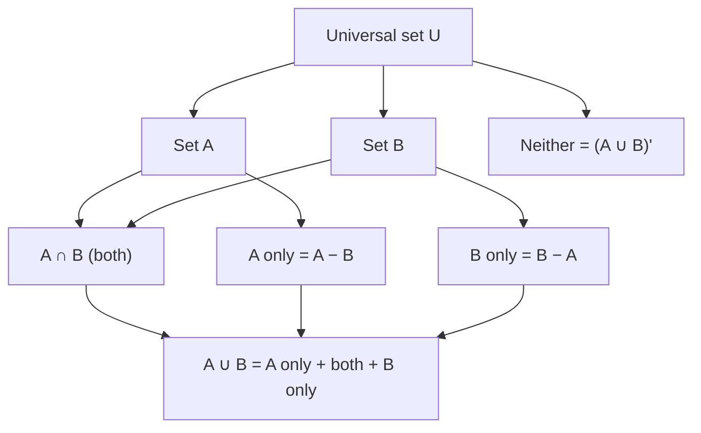
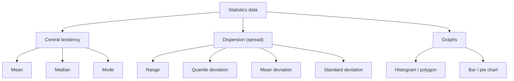

> [!focus] Exam Focus
> Highest-yield: **square/cube roots by division & factor method**, **AP/GP nth term and sum**, **AM ≥ GM ≥ HM with GM² = AM·HM**, **nPr vs nCr distinction**, and the full **statistics toolkit (mean/median/mode, standard deviation, coefficient of variation)**. Must-memorise: $a_n = a+(n-1)d$, $S_n=\frac{n}{2}[2a+(n-1)d]$, $t_n=ar^{n-1}$, $S_n=\frac{a(r^n-1)}{r-1}$, $S_\infty=\frac{a}{1-r}$ (|r|<1), $^nP_r=\frac{n!}{(n-r)!}$, $^nC_r=\frac{n!}{r!(n-r)!}$, $\sigma=\sqrt{\frac{\sum f(x-\bar x)^2}{N}}$, and **HCF × LCM = product of two numbers**. De Morgan: $(A\cup B)'=A'\cap B'$.

# Arithmetic (ಅಂಕಗಣಿತ)

Arithmetic carries a large share of the Mathematics block (40% of Paper 2). It rewards formula recall and clean computation. See the parent list in [[02b_Paper2_Official_Syllabus]]; algebra continues in [[LandSurveyor/ClaudeCode/03_Notes/Paper2/12_Maths_Algebra_and_Coordinate_Geometry]] and geometry in [[LandSurveyor/ClaudeCode/03_Notes/Paper2/13_Maths_Geometry_and_Mensuration]].

## 1. Squares & square roots, cubes & cube roots (ವರ್ಗ ಮತ್ತು ವರ್ಗಮೂಲ)

**Perfect square** = a number expressible as $n^2$. A perfect square never ends in 2, 3, 7 or 8, and never has an odd number of trailing zeros.

**Factor (prime factorisation) method** — group prime factors in pairs (for square root) or triples (for cube root); take one factor from each group.
- $\sqrt{1764}=\sqrt{2^2\cdot3^2\cdot7^2}=2\cdot3\cdot7=42$.
- $\sqrt[3]{3375}=\sqrt[3]{3^3\cdot5^3}=3\cdot5=15$.

**Division (long-division) method** — for large numbers and non-perfect squares. Pair digits from the decimal point outward, find the largest digit whose square ≤ leading group, double the quotient as the new divisor's leading part, bring down the next pair.
- $\sqrt{6889}=83$ (pairs 68|89 → 8, remainder 4; 4·100+89 with divisor 16_ → 3 → 163×3=489 exact).

**Estimating roots of non-perfect squares** — locate between consecutive squares. $\sqrt{50}$: since $7^2=49<50<64=8^2$, $\sqrt{50}\approx7.07$. Refine by division method or by $\sqrt{50}=7+\frac{50-49}{2\cdot7}\approx7.07$.

**Smallest number to add / subtract to make a perfect square** — do the long division; the *remainder* is what to **subtract**; to find what to **add**, take the next perfect square above.
- Make 1300 a perfect square: $36^2=1296$, remainder $4$ → subtract **4** (→1296) or add $37^2-1300=1369-1300=$ **69** (→1369).

| Number type | Test / result |
|---|---|
| Last digit 0,1,4,5,6,9 | May be a perfect square |
| Last digit 2,3,7,8 | Never a perfect square |
| Cube last digits | 0→0, 1→1, 8→2, 7→3, 4→4, 5→5, 6→6, 3→7, 2→8, 9→9 (used to guess cube root's unit digit) |

## 2. HCF and LCM (ಮ.ಸಾ.ಅ ಮತ್ತು ಲ.ಸಾ.ಅ)

- **HCF (GCD, ಮಹತ್ತಮ ಸಾಮಾನ್ಯ ಭಾಜಕ)** = largest number dividing all given numbers; take **lowest** power of each common prime.
- **LCM (ಕನಿಷ್ಠ ಸಾಮಾನ್ಯ ಅಪವರ್ತ್ಯ)** = smallest number divisible by all; take **highest** power of every prime present.
- **Key identity (two numbers only):** $\text{HCF}\times\text{LCM}=a\times b$.
- **Fractions:** $\text{HCF of fractions}=\dfrac{\text{HCF of numerators}}{\text{LCM of denominators}}$; $\text{LCM of fractions}=\dfrac{\text{LCM of numerators}}{\text{HCF of denominators}}$.

Worked: $48=2^4\cdot3$, $60=2^2\cdot3\cdot5$ → HCF $=2^2\cdot3=12$, LCM $=2^4\cdot3\cdot5=240$; check $12\times240=2880=48\times60$. ✔

**Applications** — largest tile/tape that measures two lengths exactly = HCF; bells ringing together again, or minimum length divided into equal plots = LCM. Surveyor angle: the largest chain unit that measures both boundary lengths $84$ m and $126$ m exactly is $\text{HCF}=42$ m.

## 3. Set theory (ಗಣ ಸಿದ್ಧಾಂತ)

**Representation** — roster/tabular form $\{2,4,6\}$ and set-builder $\{x:x\text{ is even},x\le6\}$.

**Types** — empty/null $\varnothing$, singleton, finite, infinite, equal, equivalent (same $n$), subset $\subseteq$, proper subset $\subset$, universal $U$, power set (all subsets, $2^n$ of them).

| Operation | Meaning | Symbol |
|---|---|---|
| Union | in A or B or both | $A\cup B$ |
| Intersection | in both | $A\cap B$ |
| Difference | in A but not B | $A-B$ |
| Complement | in U but not A | $A'$ |
| Disjoint | no common element | $A\cap B=\varnothing$ |

**Properties** — commutative, associative, distributive $A\cap(B\cup C)=(A\cap B)\cup(A\cap C)$; idempotent $A\cup A=A$.

**De Morgan's laws:** $(A\cup B)'=A'\cap B'$ and $(A\cap B)'=A'\cap B'$ → $(A\cap B)'=A'\cup B'$.

**Relation between number of elements (inclusion–exclusion):**
$$n(A\cup B)=n(A)+n(B)-n(A\cap B)$$
$$n(A\cup B\cup C)=\sum n(A)-\sum n(A\cap B)+n(A\cap B\cap C)$$

The flowchart mirrors a two-set Venn diagram: every element of the universe falls into exactly one region — A only, both, B only, or neither. Adding the three "inside" regions gives $n(A\cup B)$, which is why the inclusion–exclusion formula subtracts the doubly-counted intersection once.

## 4. Sequence & series (ಶ್ರೇಢಿ ಮತ್ತು ಶ್ರೇಣಿ)

| Progression | nth term | Sum of n terms |
|---|---|---|
| **AP** (common difference d) | $a_n=a+(n-1)d$ | $S_n=\frac{n}{2}[2a+(n-1)d]=\frac{n}{2}(a+l)$ |
| **GP** (common ratio r) | $t_n=ar^{\,n-1}$ | $S_n=\frac{a(r^n-1)}{r-1}$; $S_\infty=\frac{a}{1-r}$, \|r\|<1 |
| **HP** (reciprocals form an AP) | $t_n=\frac{1}{a+(n-1)d}$ | no simple closed form |

**Means between two numbers a and b:**
- Arithmetic mean $AM=\dfrac{a+b}{2}$
- Geometric mean $GM=\sqrt{ab}$
- Harmonic mean $HM=\dfrac{2ab}{a+b}$

**Relation:** $GM^2=AM\times HM$, and $AM\ge GM\ge HM$ (equality only when $a=b$).

Worked: for 4 and 16 → AM = 10, GM = 8, HM = 6.4; check $8^2=64=10\times6.4$. ✔ Specified term example: 5th term of AP 3, 7, 11… is $3+4\cdot4=19$; 4th term of GP 2, 6, 18… is $2\cdot3^3=54$.

## 5. Matrices (ಮ್ಯಾಟ್ರಿಕ್ಸ್)

A matrix is a rectangular array; **order = rows × columns** ($m\times n$).

| Type | Definition |
|---|---|
| Row / column | single row / single column |
| Square | $m=n$ |
| Diagonal | square, off-diagonal all 0 |
| Scalar | diagonal with equal diagonal entries |
| Identity $I$ | scalar with 1's on diagonal |
| Zero / null | every entry 0 |
| Transpose $A^T$ | rows ↔ columns |
| Symmetric / skew | $A^T=A$ / $A^T=-A$ |

**Equality** — same order **and** each corresponding element equal.

**Conditions:**
- **Addition/subtraction** — matrices must have the **same order**; add element-wise.
- **Multiplication $A\times B$** — needs **columns of A = rows of B** ($m\times n$ times $n\times p$ gives $m\times p$); not commutative in general.

Worked: $\begin{bmatrix}1&2\\3&4\end{bmatrix}+\begin{bmatrix}5&6\\7&8\end{bmatrix}=\begin{bmatrix}6&8\\10&12\end{bmatrix}$. Transpose of $\begin{bmatrix}1&2&3\\4&5&6\end{bmatrix}$ (order 2×3) is a 3×2 matrix $\begin{bmatrix}1&4\\2&5\\3&6\end{bmatrix}$.

## 6. Permutations & combinations (ಕ್ರಮಯೋಜನೆ ಮತ್ತು ಸಂಯೋಜನೆ)

**Factorial:** $n!=n(n-1)\cdots2\cdot1$, with $0!=1$.

$$^nP_r=\frac{n!}{(n-r)!}\qquad ^nC_r=\frac{n!}{r!\,(n-r)!}=\frac{^nP_r}{r!}$$

**Distinguishing them — order matters or not:**
- **Permutation = arrangement** (order matters): seating, ranking, forming numbers, passwords.
- **Combination = selection** (order does not matter): choosing a committee, picking teams, drawing cards.

Useful facts: $^nC_r={}^nC_{n-r}$, $^nC_0={}^nC_n=1$, $^nP_n=n!$.

Worked: from 5 people, arrange 3 in a row $=^5P_3=60$; choose 3 for a committee $=^5C_3=10$. The row problem is 6× larger because each committee of 3 can be ordered in $3!=6$ ways.

> **Mnemonic** — "**P**ermutation = **P**osition (order counts); **C**ombination = **C**hoosing (order ignored)." Also $^nC_r$ is always ≤ $^nP_r$.

## 7. Statistics (ಸಂಖ್ಯಾಶಾಸ್ತ್ರ)

**Frequency distribution** — raw data grouped into class intervals with tally & frequency; **class mark = (lower + upper limit)/2**.

**Measures of central tendency:**

| Measure | Ungrouped | Grouped |
|---|---|---|
| **Mean** $\bar x$ | $\frac{\sum x}{n}$ | $\frac{\sum f x}{\sum f}$ (x = class mark) |
| **Median** | middle value (sort first) | $L+\frac{\frac{N}{2}-cf}{f}\times h$ |
| **Mode** | most frequent value | $L+\frac{f_1-f_0}{2f_1-f_0-f_2}\times h$ |

**Empirical relation:** $\text{Mode}=3\,\text{Median}-2\,\text{Mean}$.

**Measures of dispersion:**

| Measure | Formula |
|---|---|
| **Range** | max − min |
| **Quartile deviation** | $\frac{Q_3-Q_1}{2}$ (semi-interquartile range) |
| **Mean deviation** (about mean) | $\frac{\sum f\,\|x-\bar x\|}{N}$ |
| **Standard deviation** $\sigma$ | ungrouped $\sqrt{\frac{\sum (x-\bar x)^2}{n}}$; grouped $\sqrt{\frac{\sum f(x-\bar x)^2}{N}}$ |
| **Variance** | $\sigma^2$ |
| **Coefficient of variation (CV)** | $\dfrac{\sigma}{\bar x}\times100\%$ (lower CV = more consistent) |

Worked SD: data 2, 4, 6, 8, 10 → $\bar x=6$; deviations −4,−2,0,2,4; squares 16,4,0,4,16 → $\sum=40$; $\sigma=\sqrt{40/5}=\sqrt8\approx2.83$.

**Graphical representation:**
- **Histogram** — adjacent bars, area ∝ frequency, no gaps (continuous data).
- **Frequency polygon** — join class-mark tops; can overlay a histogram.
- **Bar chart** — separated bars for discrete/categorical data.
- **Pie / sector chart** — whole = 360°; each sector angle $=\frac{\text{value}}{\text{total}}\times360°$.

The tree separates the three questions statistics answers: *where is the centre* (central tendency), *how spread out is the data* (dispersion), and *how do we display it* (graphs). Exam MCQs almost always target one leaf — most often standard deviation or the mode formula — so recognising which branch a question sits on saves time.

## Likely questions (PYQ-style)

*(Compiled in the KEA pattern — labelled expected/PYQ-style, not official.)*

1. **(Expected)** The square root of 1521 is (a) 37 (b) **39** (c) 41 (d) 43 — *39² = 1521.*
2. **(Expected)** Smallest number to subtract from 2000 to get a perfect square (a) **36** (b) 64 (c) 4 (d) 44 — *44²=1936, 2000−1936=64? recompute: 44²=1936 → subtract 64; 45²=2025.* **Answer: 64.**
3. **(PYQ-style)** If HCF of two numbers is 12 and LCM is 240, one number is 48, the other is (a) **60** (b) 72 (c) 96 (d) 120 — *product = 12×240 = 2880; 2880/48 = 60.*
4. **(Expected)** $(A\cup B)'$ equals (a) $A'\cup B'$ (b) **$A'\cap B'$** (c) $A\cap B$ (d) $A-B$ — *De Morgan.*
5. **(Expected)** The 10th term of the AP 5, 8, 11… is (a) 30 (b) **32** (c) 35 (d) 29 — *5 + 9×3 = 32.*
6. **(PYQ-style)** For 9 and 16, GM = (a) 12.5 (b) **12** (c) 12.8 (d) 25 — *√(9×16)=12.*
7. **(Expected)** Number of ways to select 2 surveyors from 6 is (a) 30 (b) **15** (c) 12 (d) 720 — *⁶C₂ = 15.*
8. **(Expected)** In a pie chart a value that is 25% of the total subtends (a) 45° (b) **90°** (c) 60° (d) 120°.
9. **(PYQ-style)** SD of 5, 5, 5, 5 is (a) 5 (b) **0** (c) 2.5 (d) 1 — *no spread.*
10. **(Expected)** Two matrices can be multiplied A·B only if (a) same order (b) **columns of A = rows of B** (c) both square (d) both symmetric.

> [!tip] 60-second revision
> - **Roots:** factor method → pair/triple primes; division method for big/non-perfect; remainder = subtract, next square = add.
> - **HCF × LCM = product of two numbers**; HCF = lowest powers, LCM = highest powers.
> - **De Morgan:** $(A\cup B)'=A'\cap B'$; $n(A\cup B)=n(A)+n(B)-n(A\cap B)$.
> - **AP:** $a+(n-1)d$, $S=\frac n2[2a+(n-1)d]$. **GP:** $ar^{n-1}$, $S=\frac{a(r^n-1)}{r-1}$, $S_\infty=\frac{a}{1-r}$.
> - **AM ≥ GM ≥ HM**, $GM^2=AM\cdot HM$.
> - **Matrix add:** same order; **multiply:** cols(A)=rows(B).
> - **P = order matters, C = selection;** $^nP_r=\frac{n!}{(n-r)!}$, $^nC_r=\frac{^nP_r}{r!}$.
> - **Mode = 3 Median − 2 Mean;** $\sigma=\sqrt{\frac{\sum f(x-\bar x)^2}{N}}$; **CV = σ/x̄ ×100** (lower = more consistent).
> - Related: [[02b_Paper2_Official_Syllabus]] | [[LandSurveyor/ClaudeCode/03_Notes/Paper2/12_Maths_Algebra_and_Coordinate_Geometry]] | [[LandSurveyor/ClaudeCode/03_Notes/Paper2/13_Maths_Geometry_and_Mensuration]] | [[10_Mental_Ability]]
