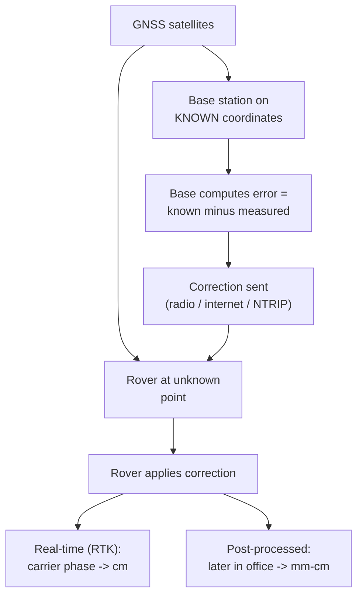

> [!focus] Exam Focus
> **NAVSTAR GPS = three segments: Space + Control + User**; positioning by **trilateration from pseudo-ranges** needs a **minimum of 4 satellites (X, Y, Z + receiver clock bias)**. **DGPS** removes correlated errors using a base station → sub-metre; **RTK** uses carrier-phase corrections over a radio/NTRIP link → **cm-level real time**. **CORS** = permanent reference stations broadcasting corrections (Karnataka State CORS network) via **NTRIP** over the internet. Constellations: **GPS (USA), GLONASS (Russia), Galileo (EU), NavIC/IRNSS (India, regional, 7 satellites)**. **Lower DOP = better geometry = better accuracy.**

# GNSS, DGPS, RTK & CORS (ಜಿ.ಎನ್.ಎಸ್.ಎಸ್. / ಡಿ.ಜಿ.ಪಿ.ಎಸ್. / ಆರ್.ಟಿ.ಕೆ.)

Advanced positioning & satellite communication block of Paper 2 — see [[02b_Paper2_Official_Syllabus]]. Sibling notes: [[LandSurveyor/ClaudeCode/03_Notes/Paper2/14_Photogrammetry_Aerial_and_Drone_Survey]] and [[LandSurveyor/ClaudeCode/03_Notes/Paper2/15_Satellite_Imagery_Remote_Sensing_and_GIS]].

## 1. GPS — definition, principle, applications

**GPS (Global Positioning System, ಜಾಗತಿಕ ಸ್ಥಾನ ನಿರ್ಣಯ ವ್ಯವಸ್ಥೆ)** is the US **NAVSTAR** satellite navigation system that provides **position, velocity and time (PVT)** anywhere on/near Earth, in **all weather, 24 hours**. **GNSS (Global Navigation Satellite System)** is the umbrella term covering GPS and the other constellations together.

**Principle — trilateration from ranges:** each satellite continuously broadcasts its **position and precise time**. The receiver measures the **travel time** of the signal and computes a **range = c × travel time**. One range places the receiver on a sphere around that satellite; **three spheres intersect at a point**, and a **fourth measurement solves the receiver's clock error**. (Not triangulation — no angles are measured; distances/ranges only.)

**Applications:** control surveys and geodetic networks, **cadastral georeferencing of survey-number boundaries**, setting-out/staking, machine control, navigation, GIS data capture, deformation monitoring, and time transfer.

## 2. NAVSTAR GPS architecture — three segments

| Segment | Contents | Function |
|---|---|---|
| **Space** | ~24+ satellites in **6 orbital planes**, ~**20,200 km** altitude, ~**12-hour** period, **55°** inclination | Broadcast signals so ≥4 satellites are visible anywhere, anytime |
| **Control** | Master Control Station + monitor stations + upload antennas | Track satellites, compute **orbit (ephemeris) & clock corrections**, upload navigation data |
| **User** | Receiver + antenna (handheld, geodetic, rover) | Receive signals, compute position, velocity & time |

### Signal structure

GPS transmits on **L-band carrier frequencies**, modulated with **ranging codes** and the **navigation message**:

| Component | Detail |
|---|---|
| **L1 = 1575.42 MHz** | Carries **C/A code** (Coarse/Acquisition, civil) + **P(Y) code** |
| **L2 = 1227.60 MHz** | Carries **P(Y) code** (dual-freq. corrects ionosphere) |
| **L5 = 1176.45 MHz** | Modern civil safety-of-life signal |
| **Navigation message** | **Ephemeris** (precise own orbit), **almanac** (coarse all-satellite orbits), clock parameters, health |

Two measurement types: **code (pseudo-range)** — metre level; and **carrier-phase** — mm–cm after resolving the integer **cycle ambiguity** (the basis of RTK and static geodetic GPS).

## 3. Types of errors and corrections

| Error source | Cause | Correction |
|---|---|---|
| **Satellite clock & ephemeris** | Orbit/clock drift | Broadcast/precise corrections; **differential (DGPS)** |
| **Ionospheric delay** | Free electrons bend/slow signal | **Dual-frequency (L1/L2)** modelling; DGPS |
| **Tropospheric delay** | Water vapour/pressure | Models (Saastamoinen, Hopfield) |
| **Multipath** | Signal reflected off surfaces | Good antenna siting, choke-ring, masking |
| **Receiver noise** | Electronics | Averaging, better receivers |
| **Geometry (DOP)** | Poor satellite spread | Wait for better geometry; more satellites |
| (Historic) **Selective Availability** | Deliberate US degradation | **Switched off in 2000** |

**Differential correction** works because errors like satellite clock, ephemeris and atmospheric delay are **spatially correlated** — a nearby known station experiences almost the same error, so its computed correction can be applied to the rover.

## 4. DGPS (Differential GPS)

**DGPS** improves accuracy by using a **base (reference) station on a known point** and one or more **rovers**:

The **base station**, sitting on precisely known coordinates, compares its GNSS-measured position with its true position to derive **corrections** and transmits them; the **rover** applies these to cancel the common (correlated) errors. Two modes:

| Mode | When correction applied | Accuracy |
|---|---|---|
| **Real-time differential** | Live in the field via radio/internet link | Sub-metre (code-DGPS); cm with RTK |
| **Post-processed (PPK)** | Later, in office, using logged base + rover data | mm–cm; robust, no live link needed |

**Accuracy levels (typical):** standalone code GPS ≈ **5–10 m**; code-DGPS ≈ **sub-metre (0.3–1 m)**; carrier-phase **RTK ≈ 1–3 cm**; static post-processing ≈ **mm–few mm**.

## 5. GNSS rovers — RTK, CORS, NTRIP

### RTK (Real Time Kinematic)

**RTK** is **carrier-phase differential positioning in real time**: the base (or a CORS) streams carrier-phase corrections to the rover, which resolves the **integer ambiguity on the fly** to give a **"fixed" cm-level solution instantly** in the field. The rover shows **float** (decimetre, ambiguity not yet fixed) then **fixed** (cm) status. Ideal for **cadastral corner marking, setting-out and detail survey** at high productivity — one surveyor, one pole-mounted rover.

### CORS — Continuously Operating Reference Stations & the Karnataka State CORS network

A **CORS** is a **permanent GNSS reference station** running 24×7 on precisely known coordinates, continuously logging data and broadcasting corrections over the internet. A **CORS network** (many stations, network-RTK / VRS) lets rovers work anywhere in coverage **without setting up their own base**, and models errors across the network for consistent accuracy over large areas.

The **Karnataka State CORS network** is the state government's network of continuously operating GNSS reference stations distributed across Karnataka, set up to support **high-accuracy cadastral and land-records surveys** (e.g., re-survey of village maps). A field surveyor's GNSS rover connects to the network over mobile internet, receives RTK corrections, and obtains **cm-level coordinates tied to a common state datum** — ensuring all survey-number boundaries across districts are consistent and directly relatable to the digital cadastre.

### NTRIP

**NTRIP (Networked Transport of RTCM via Internet Protocol)** is the standard protocol that **streams GNSS corrections (in RTCM format) over the internet/mobile data**. Components: **NTRIP Caster** (server that distributes streams), **NTRIP Server/Source** (a CORS feeding data to the caster), and **NTRIP Client** (the rover that logs in with a mount-point, username and password to pull corrections). This is how a rover uses the Karnataka CORS network without a local radio base.

### Field data collection & precision in cadastral surveys

Workflow: connect rover to CORS via NTRIP → wait for **RTK-fixed** solution → **occupy each parcel corner** (survey-number boundary point) → store coordinates + attributes on the controller → export to GIS/CAD for the [[LandSurveyor/ClaudeCode/03_Notes/Paper2/15_Satellite_Imagery_Remote_Sensing_and_GIS]] cadastral layer. Because every point is on the **same state datum**, boundaries are seamless and legally defensible at **cm precision**, replacing older chain/plane-table demarcation.

## 6. Satellite communication technology — constellations, frequencies, geometry & DOP

### GNSS constellations

| System | Country/Region | Coverage | Note |
|---|---|---|---|
| **GPS** | USA | Global | NAVSTAR; L1/L2/L5 |
| **GLONASS** | Russia | Global | FDMA (per-satellite frequency) |
| **Galileo** | European Union | Global | Civil-controlled |
| **BeiDou** | China | Global | — |
| **NavIC / IRNSS** | India | **Regional** (India + ~1500 km around) | **7 satellites** (GEO + GSO); L5 & S-band |

Modern rovers are **multi-constellation, multi-frequency**, tracking several systems at once for more satellites, better geometry and faster fixes. Signals sit in the **L-band (~1.1–1.6 GHz)**; NavIC also uses **S-band**.

### Satellite geometry & DOP (Dilution of Precision)

**DOP** is a **unitless number expressing how satellite geometry affects positioning accuracy**. **Well-spread satellites → low DOP → better accuracy**; **clustered satellites → high DOP → poorer accuracy**. Types: **GDOP** (geometric — overall), **PDOP** (position, 3-D), **HDOP** (horizontal), **VDOP** (vertical), **TDOP** (time).

| DOP value | Quality |
|---|---|
| **1 (ideal)** | Best possible geometry |
| **1–2** | Excellent |
| **2–5** | Good (typical survey) |
| **5–10** | Moderate |
| **>10** | Poor — avoid for precise work |

Actual error ≈ **DOP × range measurement error (UERE)**, so the same measurement noise gives a larger position error when DOP is high.

## 7. Related software

**GNSS data processing / post-processing & network adjustment:** **Trimble Business Center (TBC), Leica Infinity, Topcon Magnet, Bernese, GAMIT/GLOBK, RTKLIB (open-source)** for baseline processing and **least-squares network adjustment**; field controllers run **Trimble Access, Leica Captivate, SurvCE/SurvPC**. Coordinates are then **integrated with GIS (QGIS, ArcGIS)** — exporting RTK/adjusted points straight into the cadastral vector layer of [[LandSurveyor/ClaudeCode/03_Notes/Paper2/15_Satellite_Imagery_Remote_Sensing_and_GIS]].

## 8. Mnemonics

> - GPS segments: "**S-C-U → Space, Control, User**" = "**Satellites Control Users.**"
> - "**4 satellites, 4 unknowns: X, Y, Z + clock bias.**"
> - Frequencies: "**L1 = 1575, L2 = 1227, L5 = 1176 MHz.**"
> - Constellations: "**Every Good Group Guides Navigation**" → **G**PS, **G**LONASS, **G**alileo, Beidou, **N**avIC.
> - **DOP: Low = good, High = bad** ("**D**own is **G**ood").
> - Accuracy ladder: "**Standalone 5–10 m → DGPS sub-metre → RTK cm → Static mm.**"
> - NTRIP roles: "**Caster serves, Server feeds, Client pulls.**"

## Likely questions (PYQ-style)

*Compiled/expected pattern, not official.*

1. **The three segments of GPS are** (a) L1, L2, L5 (b) **space, control, user** (c) base, rover, caster (d) code, carrier, message — *Answer: b*.
2. **Minimum satellites for a 3-D GPS fix and why** (a) 3 (b) **4 — three coordinates + receiver clock bias** (c) 5 (d) 24 — *Answer: b*.
3. **GPS positioning is based on** (a) angle triangulation (b) **trilateration from pseudo-ranges** (c) levelling (d) magnetic bearing — *Answer: b*.
4. **The C/A code is carried on** (a) L5 only (b) **L1 (1575.42 MHz)** (c) S-band (d) none — *Answer: b*.
5. **DGPS improves accuracy by** (a) more codes (b) **applying corrections from a base station on a known point** (c) larger antenna (d) faster clock — *Answer: b*.
6. **RTK surveying provides** (a) 10 m accuracy (b) **cm-level accuracy in real time via carrier phase** (c) only post-processed results (d) no correction — *Answer: b*.
7. **A CORS is** (a) a rover (b) **a permanent continuously operating reference station** (c) a satellite (d) a total station — *Answer: b*.
8. **NTRIP is used to** (a) level the instrument (b) **stream GNSS corrections over the internet** (c) classify images (d) measure angles — *Answer: b*.
9. **India's regional navigation system is** (a) GLONASS (b) Galileo (c) **NavIC / IRNSS (7 satellites)** (d) BeiDou — *Answer: c*.
10. **A lower DOP value indicates** (a) worse geometry (b) **better satellite geometry and accuracy** (c) more errors (d) fewer satellites — *Answer: b*.
11. **Selective Availability, which degraded civil GPS, was** (a) added in 2000 (b) **switched off in 2000** (c) still active (d) part of RTK — *Answer: b*.
12. **The Karnataka State CORS network is primarily used for** (a) weather (b) **high-accuracy cadastral/land-records surveys on a common datum** (c) TV broadcast (d) navigation only — *Answer: b*.
13. **Post-processed differential positioning (PPK) differs from RTK in that** (a) it is less accurate (b) **corrections are applied later in the office, not live** (c) it needs no base data (d) it uses angles — *Answer: b*.

> [!tip] 60-second revision
> - **GPS = NAVSTAR; segments Space + Control + User; ~24 sats, 20,200 km, 6 planes, 55°.**
> - **Trilateration from pseudo-ranges; 4 satellites = X, Y, Z + clock bias.**
> - **L1 = 1575.42, L2 = 1227.60, L5 = 1176.45 MHz; C/A on L1; ephemeris + almanac in nav message.**
> - **Errors: clock, ephemeris, iono/tropo, multipath, geometry (DOP); differential cancels correlated ones.**
> - **DGPS base+rover → sub-metre; RTK carrier phase → cm real time; static → mm.**
> - **CORS = permanent reference stations; Karnataka State CORS network feeds cadastral RTK via NTRIP.**
> - **Constellations: GPS, GLONASS, Galileo, BeiDou, NavIC/IRNSS (India, regional, 7 sats).**
> - **DOP: low = good geometry; error ≈ DOP × measurement error.**
> - Software: **TBC, Leica Infinity, Topcon Magnet, RTKLIB; integrate with GIS.**
> - Related: [[02b_Paper2_Official_Syllabus]] | [[LandSurveyor/ClaudeCode/03_Notes/Paper2/14_Photogrammetry_Aerial_and_Drone_Survey]] | [[LandSurveyor/ClaudeCode/03_Notes/Paper2/15_Satellite_Imagery_Remote_Sensing_and_GIS]]
