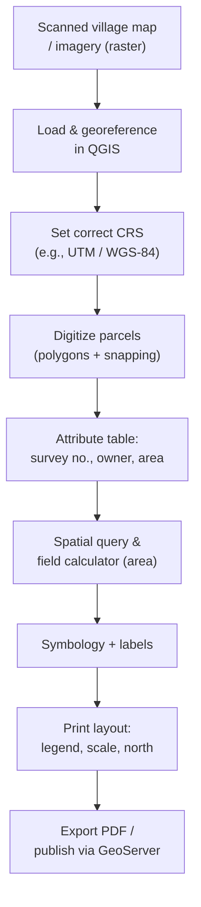

> [!focus] Exam Focus
> **QGIS is the free/open-source desktop GIS** — know its workflow (load layer → attribute table → query → digitize → style → layout). The **OGC web services WMS / WFS / WCS** and which serves what (**WMS = map image, WFS = vector features, WCS = raster coverage**) are near-certain. **GeoServer / MapServer publish** these services; **PostGIS is the spatial extension of PostgreSQL** for storing/querying geographic data. Remember **CRS**: geographic **EPSG:4326 (WGS-84 lat/long)** vs projected **UTM (metres)**, and that vector = points/lines/polygons while raster = a grid of cells.

# Computer Applications — GIS Software & Applications (ಜಿಐಎಸ್ / ಭೂ-ಮಾಹಿತಿ ವ್ಯವಸ್ಥೆ)

A **Geographic Information System (GIS)** captures, stores, analyses and displays **spatially referenced (geographic) data**. Every feature carries a **location (geometry + CRS)** and **attributes (a data table)**. For a land surveyor, GIS is where **cadastral maps, RTC/parcel attributes, and imagery** come together for mapping, querying and printing.

## 1. Data model in GIS

| Model | Stores | Examples |
|---|---|---|
| **Vector** (ವೆಕ್ಟರ್) | Discrete features as **points / lines / polygons** with attributes | Survey stations (point), roads (line), parcels/villages (polygon) |
| **Raster** (ರಾಸ್ಟರ್) | A **grid of cells (pixels)**, each holding a value | Satellite imagery, DEM/elevation, scanned cadastral sheet |

Common vector formats: **Shapefile (.shp), GeoJSON, KML, DXF**; raster: **GeoTIFF, JPEG, PNG (+world file)**. A **CRS (Coordinate Reference System)** ties coordinates to the earth — **geographic (lat/long, degrees, e.g., EPSG:4326 WGS-84)** or **projected (metres, e.g., UTM zone)**.

## 2. GIS software environment

A desktop GIS combines a **map canvas**, a **layers/table-of-contents panel** (stacking order = draw order), a **browser/data source panel**, a **toolbar/processing toolbox**, and an **attribute table** per layer. Software may be **proprietary (Esri ArcGIS)** or **open-source (QGIS, GRASS GIS, SAGA)**. Server-side software publishes data to the web (GeoServer, MapServer), and databases store it (PostGIS).

## 3. QGIS — open-source desktop GIS (ಕ್ಯೂಜಿಐಎಸ್)

**QGIS** is a **free and open-source (FOSS)** desktop GIS, cross-platform (Windows/Linux/Mac), and the standard low-cost tool for cadastral mapping.

### 3.1 Installation
- Download from the official QGIS site; on Windows use the **standalone installer** (or OSGeo4W). Choose the **Long-Term Release (LTR)** for stability. No licence fee.

### 3.2 Interface
- **Menu bar, toolbars, Map Canvas** (centre), **Layers panel** (left), **Browser panel** (data sources), **Status bar** (scale, coordinates, current CRS), and the **Processing Toolbox**.

### 3.3 Loading vector & raster data
- **Layer → Add Layer → Add Vector Layer** (`.shp`, GeoJSON, DXF) or **Add Raster Layer** (GeoTIFF). Also **drag-and-drop** from the Browser. Connect to **PostGIS**, **WMS/WFS**, and XYZ tiles.

### 3.4 Layer management
- Reorder layers (top draws over bottom), toggle visibility, set **transparency**, group layers, set **scale-dependent visibility**, and check/assign each layer's **CRS**.

### 3.5 Attribute table operations
- Open the **attribute table** to view/edit records; **select by expression**, **field calculator** (compute area/length into a column), add/delete fields, and **join** a non-spatial table (e.g., RTC data) to a spatial layer by a key.

### 3.6 Spatial queries
- **Select by location** (features that intersect/are within/contain another layer), **Select by expression** (attribute filters like `"area_ha" > 2`), buffer, clip, intersection, dissolve, union in the Processing Toolbox.

### 3.7 Digitizing & editing vector layers
- **Toggle Editing** → add point/line/polygon features by tracing over imagery or coordinates, use **snapping** for clean shared boundaries, split/merge features, edit vertices with the **Vertex Tool**, then **Save Edits**. This is how a scanned village map is converted to digital parcels.

### 3.8 Styling & symbology
- **Layer Properties → Symbology:** single symbol, **categorized** (by class, e.g., land use), **graduated** (by numeric ranges), rule-based; set colour/outline; **labels** from an attribute (survey number, owner) with placement and buffers.

### 3.9 Map layout & printing
- **Project → New Print Layout:** add the **map frame, legend, scale bar, north arrow, title, grid/graticule**, set the **scale**, and **export to PDF/PNG or print**. This produces a finished cadastral/plan sheet.

### 3.10 Plugins & extensions
- **Plugins → Manage and Install Plugins** adds features (e.g., **QuickMapServices** basemaps, georeferencer, DXF tools). QGIS also runs **Python (PyQGIS)** scripts and models for automation.

### 3.11 CRS management
- Set the **Project CRS** and each **layer CRS**; QGIS performs **on-the-fly reprojection** so layers in different CRS overlay correctly. **Reproject** a layer permanently with *Warp/Reproject*. Correct CRS is critical so cadastral data lands in the right place.

### 3.12 Use in cadastral mapping
- Georeference scanned village maps, digitize parcels/survey numbers, attach RTC attributes, compute parcel areas with the field calculator, and print scaled cadastral sheets — a full low-cost cadastral workflow.

The diagram traces a cadastral job entirely in QGIS: a scanned map or image is loaded and georeferenced, given the correct CRS, then parcels are **digitized as snapped polygons**. Attributes such as survey number and owner are entered, areas are computed by the field calculator, styling and labels are applied, and finally a scaled sheet is laid out and exported — or the data is pushed to a server for web publishing.

## 4. GIS servers — GeoServer / MapServer

**GeoServer** (Java) and **MapServer** (C) are **open-source GIS servers** that **publish geospatial data to the web** as standard **OGC (Open Geospatial Consortium) services**. A browser or client (QGIS, a web portal, a mobile app) requests a map/features over HTTP and the server responds.

### 4.1 OGC web services (WMS / WFS / WCS)

| Service | Full form | Returns | Nature |
|---|---|---|---|
| **WMS** | Web Map **Service** | A **rendered map image** (PNG/JPEG) | View-only picture; server styles it |
| **WFS** | Web Feature **Service** | **Vector features** (GML/GeoJSON) with geometry + attributes | Editable/queryable raw data |
| **WCS** | Web Coverage **Service** | **Raster coverage data** (the actual grid values) | For analysis, not just viewing |
| *(WMTS)* | Web Map **Tile** Service | Pre-rendered **map tiles** | Fast cached basemaps |

Rule of thumb: **WMS = a map to look at, WFS = the vector features to use, WCS = the raster values to analyse.** GeoServer reads from Shapefiles, GeoTIFFs and **PostGIS**, then serves WMS/WFS/WCS to clients — the backbone of a public cadastral web map.

## 5. PostGIS — spatial database

**PostGIS** is the **spatial extension of PostgreSQL** (an open-source relational database). It adds **geometry/geography data types, spatial indexes (GiST), and spatial SQL functions** so geographic data can be **stored and queried with SQL**.

- Store parcels as a `geometry` column alongside attribute columns in a table.
- **Spatial SQL** examples: `ST_Area(geom)` (area), `ST_Length(geom)`, `ST_Intersects(a,b)` (do two parcels touch/overlap?), `ST_Within`, `ST_Buffer`, `ST_Transform(geom, 4326)` (reproject).
- Enable with `CREATE EXTENSION postgis;`. QGIS connects directly to PostGIS, and **GeoServer publishes PostGIS layers** as WMS/WFS — so PostGIS is the **central store** in a GIS stack.

## 6. How the GIS pieces fit together

A typical open-source cadastral stack is a chain: **PostGIS (store) → GeoServer/MapServer (publish OGC services) → QGIS / web portal (view & edit)**. Data is digitized or imported into PostGIS, GeoServer exposes it as **WMS/WFS**, and both desktop QGIS and a browser-based citizen map consume the same authoritative data. This mirrors the land-records IT stack in [[LandSurveyor/ClaudeCode/03_Notes/Paper2/19_Computer_Software_Solutions_and_Land_Records_IT]].

| Layer | Software (open-source) | Role |
|---|---|---|
| **Store** | PostGIS on PostgreSQL | Spatial + attribute data with SQL |
| **Serve** | GeoServer / MapServer | Publish WMS / WFS / WCS |
| **View / Edit** | QGIS (desktop), web map client | Digitize, query, style, print |

## 7. GIS vs GPS vs Remote Sensing (don't confuse)

- **GPS** — *gets* position (coordinates) in the field.
- **Remote Sensing (RS)** — *acquires* data (imagery) from satellites/aircraft without contact.
- **GIS** — *stores, analyses and maps* that spatial data.

They are complementary: GPS/RS feed data **into** a GIS.

> **Mnemonics**
> - OGC services: **"WMS = Map (picture), WFS = Features (vector), WCS = Coverage (raster)."** → *"Map, Feature, Coverage."*
> - Vector types: **"P-L-P — Point, Line, Polygon."**
> - GIS stack top-to-bottom: **"Store → Serve → See"** (PostGIS → GeoServer → QGIS).
> - Data model split: **"Vector is objects, Raster is pixels."**
> - QGIS workflow: **"Load, Look (attribute), Query, Draw (digitize), Dress (style), Deliver (layout)."**

## Likely questions (PYQ-style)
*Compiled in the style of the exam for practice — not official past papers.*

1. **QGIS is** (a) proprietary Esri software (b) **free and open-source desktop GIS** (c) a database only (d) a web browser — *Answer: b*.
2. **Which OGC service returns a rendered map image?** (a) WFS (b) **WMS** (c) WCS (d) PostGIS — *Answer: b*.
3. **WFS delivers** (a) a picture only (b) **vector features with geometry and attributes** (c) raster grids (d) map tiles — *Answer: b*.
4. **WCS is used to obtain** (a) styled images (b) vector points (c) **raster coverage/grid values for analysis** (d) tiles — *Answer: c*.
5. **PostGIS is the spatial extension of** (a) MySQL (b) **PostgreSQL** (c) Oracle Forms (d) MongoDB — *Answer: b*.
6. **EPSG:4326 refers to** (a) UTM in metres (b) **WGS-84 geographic (lat/long)** (c) a raster format (d) a hatch pattern — *Answer: b*.
7. **In GIS, roads are best represented as** (a) points (b) **lines** (c) polygons (d) raster — *Answer: b*.
8. **GeoServer and MapServer are primarily** (a) desktop editors (b) **servers that publish OGC web services** (c) spreadsheet tools (d) CAD packages — *Answer: b*.
9. **The QGIS component that lists layers and their draw order is the** (a) Map Canvas (b) **Layers panel** (c) status bar (d) toolbox — *Answer: b*.
10. **`ST_Area(geom)` in PostGIS returns the** (a) length (b) **area of a geometry** (c) centroid (d) buffer — *Answer: b*.

> [!tip] 60-second revision
> - **GIS = location (geometry + CRS) + attributes.** Vector = points/lines/polygons; raster = grid of cells.
> - **QGIS** (free/open): load → attribute table → query → **digitize (snapping)** → symbology → **print layout**; plugins + PyQGIS; on-the-fly reprojection.
> - **OGC services:** **WMS = map image, WFS = vector features, WCS = raster coverage** (WMTS = tiles).
> - **GeoServer / MapServer** publish those services; **PostGIS** = spatial extension of **PostgreSQL** (spatial types + `ST_*` functions).
> - **CRS:** EPSG:4326 = WGS-84 lat/long (degrees); UTM = metres.
> - Related: [[LandSurveyor/ClaudeCode/03_Notes/Paper2/17_Computer_MSOffice_and_AutoCAD]] | [[LandSurveyor/ClaudeCode/03_Notes/Paper2/19_Computer_Software_Solutions_and_Land_Records_IT]] | [[02b_Paper2_Official_Syllabus]]
