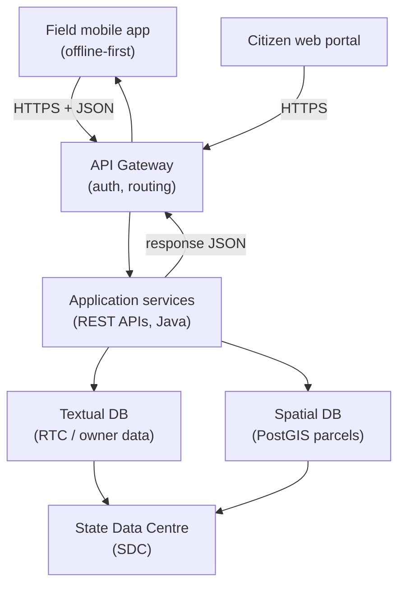

> [!focus] Exam Focus
> Know the **SDLC phases in order** (Requirements → Design → Development → Testing → Deployment → Maintenance) and the **difference between REST and SOAP** (**REST = lightweight, JSON over HTTP, stateless; SOAP = strict XML protocol with WSDL**). Remember the **web stack acronyms** — **HTML** (structure), **HTTPS** (secure transport), **XML** vs **JSON** (data formats), **Java** (backend language) — and the **field-app design ideas: offline-first, geo-tagging, eSign/DSC, sync to central server**. An **API Gateway** is the single controlled entry point to backend services; **SDC** = State Data Centre where state data is hosted.

# Software Solutions & Land Records IT (ತಂತ್ರಾಂಶ ಪರಿಹಾರಗಳು / ಭೂ-ದಾಖಲೆ ಮಾಹಿತಿ ತಂತ್ರಜ್ಞಾನ)

This note covers **how software is built** (SDLC), **how web and mobile applications work**, **how spatial + textual land data is stored and retrieved**, and the **web technologies (API, REST/SOAP, Java, JSON, XML, HTML, HTTPS)** behind modern land-records systems.

## 1. Software Development Life Cycle (SDLC)

**SDLC** is the structured process by which an application is **designed, developed, tested and deployed**. It gives a repeatable path from an idea to a running, maintained system.

| # | Phase | What happens |
|---|---|---|
| 1 | **Requirement analysis** | Gather and document what users need (functional + non-functional) |
| 2 | **Design** | Architecture, database schema, UI/UX, API design |
| 3 | **Development / Coding** | Programmers build the modules |
| 4 | **Testing** | Verify against requirements — unit, integration, system, UAT; fix bugs |
| 5 | **Deployment** | Release to production (servers / cloud / SDC) |
| 6 | **Maintenance** | Bug fixes, updates, enhancements over the system's life |

**Models:** **Waterfall** (sequential, each phase completed before the next — good when requirements are fixed); **Iterative/Incremental**; **Agile** (short sprints, continuous feedback, working software early); **Spiral** (risk-driven). Testing types: **unit** (single module), **integration** (modules together), **system** (whole app), **UAT (User Acceptance Testing)** by end-users, plus **regression** after changes.

## 2. Web application development concepts

A **web application** runs in a browser and has **three tiers**: the **front end (client)** the user sees, the **back end (server)** with business logic, and the **database**. The client requests over **HTTP/HTTPS**; the server processes and returns a response.

- **Front end (client-side):** **HTML** (structure), **CSS** (styling), **JavaScript** (behaviour) — the "presentation" layer.
- **Back end (server-side):** application code (e.g., **Java**, PHP, Python, .NET) implementing logic, security and data access.
- **Database:** stores persistent data (e.g., PostgreSQL/PostGIS, Oracle, MySQL).
- **Web portal:** a single gateway site aggregating services/information. A **citizen service portal** delivers government services online — e.g., applying for an RTC, checking mutation status, downloading a map — reducing office visits (e-Governance). Good portals stress **single sign-on, search, service catalogue, and status tracking**.

## 3. Mobile application development for field work

Field survey apps must work where connectivity is poor, so they follow **offline-first design**.

- **Offline-first:** the app **stores data locally** (on-device database) and works without a network; it **syncs later** when online. Prevents data loss in remote villages.
- **Geo-tagging:** each record/photo is stamped with **GPS coordinates (lat/long)** and often a timestamp — ties field evidence to a location.
- **Digital signature (eSign / DSC):** authenticates and legally binds a document. **DSC (Digital Signature Certificate)** is a hardware/token-based certificate; **eSign** is an Aadhaar-based online signing service. Provides **authentication, integrity, non-repudiation**.
- **Sync with central server:** when connectivity returns, local records are **uploaded (and server updates downloaded)** through an **API**, with conflict handling so the central database stays authoritative.

## 4. How spatial & textual data is procured, stored and retrieved

Land data is of two kinds: **spatial** (maps, parcel geometry) and **textual/attribute** (RTC, owner, extent). Both must be procured, stored and retrievable.

- **Procurement:** field survey (Total Station/GPS), digitization of old maps, satellite imagery, existing records.
- **Storage:** a **relational database** for textual data and a **spatial database (PostGIS)** for geometry; files/imagery on servers. Data lives in a **State Data Centre (SDC)** — the state's central, secured facility that hosts government applications, servers, storage and networking with backup/DR (disaster recovery). A typical **architecture** is **3-tier: presentation (portal/app) → application (business logic/API) → data (database at SDC)**.
- **Retrieval:** users query through the portal/app; requests hit the **application tier**, which runs **database queries (SQL / spatial SQL)** and returns results. **Indexes** speed retrieval; **caching** and **replication** improve performance and availability.

## 5. Application Programming Interface (API)

An **API** is a defined **contract that lets two software systems talk** — the mobile app or portal calls the backend through the API rather than touching the database directly. This gives security, versioning and reuse.

### 5.1 REST vs SOAP

| Aspect | **REST** (Representational State Transfer) | **SOAP** (Simple Object Access Protocol) |
|---|---|---|
| Type | **Architectural style** | **Strict protocol** |
| Data format | **JSON** (also XML, plain text) | **XML only** (SOAP envelope) |
| Transport | **HTTP/HTTPS** | HTTP, SMTP, etc. |
| Methods | **HTTP verbs: GET, POST, PUT, DELETE** | Operations defined in **WSDL** |
| State | **Stateless** | Can be stateful |
| Weight | **Lightweight, fast** | Heavier, verbose |
| Standards | Flexible | Strong (WS-Security, ACID) |
| Best for | Web/mobile apps, public APIs | Enterprise, high-security transactions |

Rule of thumb: **REST is the light, JSON-over-HTTP style used by most modern web/mobile apps; SOAP is the older, strict XML protocol used where formal contracts and enterprise security are required.**

### 5.2 API Gateway
An **API Gateway** is a **single entry point** in front of many backend services. It handles **routing, authentication, rate-limiting, logging and request/response transformation** — so clients call one controlled endpoint instead of many services directly.

### 5.3 Integration of mobile apps with backend
The field app calls **REST APIs (over HTTPS)** exposed through the **API Gateway**; the gateway authenticates the request, routes it to the right service, which reads/writes the **SDC database** and returns **JSON**. The same APIs feed the **web portal**, keeping app, portal and database consistent.

The diagram shows the standard integration: both the **mobile app** and the **web portal** talk over **HTTPS** to a single **API Gateway**, which authenticates and routes requests to **REST application services**. Those services query the **textual and spatial databases** hosted in the **State Data Centre**, and return **JSON** back through the gateway to the client — one secure backend serving both field and citizen users.

## 6. Web portal design & UX fundamentals

**UX (User Experience)** is how easily and pleasantly a user achieves a goal. Key principles:

- **Simplicity & clarity** — clear labels, minimal steps to complete a service.
- **Consistency** — same layout, colours, navigation across pages.
- **Navigation & information architecture** — logical menus, breadcrumbs, search.
- **Accessibility** — usable by people with disabilities (contrast, keyboard, screen-reader labels); often bilingual (Kannada/English).
- **Responsive design** — adapts to phone, tablet, desktop.
- **Feedback & error handling** — confirmations, clear error messages, progress/status.
- **Performance & trust** — fast pages, HTTPS lock, privacy.

## 7. Core web technologies (Java, JSON, XML, HTML, HTTPS)

| Technology | What it is | Role |
|---|---|---|
| **Java** | A platform-independent, object-oriented **programming language** ("write once, run anywhere" via the JVM) | Common **backend/server** language for enterprise & government apps |
| **JSON** | **JavaScript Object Notation** — lightweight **data format** using key–value pairs `{"key":"value"}` | Data exchange in **REST APIs**; compact, human-readable |
| **XML** | **eXtensible Markup Language** — tag-based **data format** `<tag>value</tag>` | Structured/config data, **SOAP** messages, GML in GIS |
| **HTML** | **HyperText Markup Language** — the **structure** of web pages (tags/elements) | Front-end content the browser renders |
| **HTTPS** | **HyperText Transfer Protocol Secure** = HTTP + **TLS/SSL encryption** | Secure transport of requests/responses (the padlock) |

**JSON vs XML:** JSON is lighter and easier to parse (favoured by REST); XML is more verbose but supports schemas/namespaces (used by SOAP and GIS GML). **HTTP vs HTTPS:** HTTPS encrypts traffic so credentials and citizen data cannot be read in transit — mandatory for government portals.

## 8. Putting it together — a land-records transaction

When a citizen applies online for a mutation: the **portal (HTML/UX front end)** sends the request over **HTTPS** → the **API Gateway** authenticates and routes it → a **REST service (Java)** validates and writes to the **textual + spatial (PostGIS) databases at the SDC** → the field surveyor's **offline-first mobile app** later records the on-ground verification with **geo-tagging** and an **eSign/DSC**, then **syncs** back → the citizen tracks status on the portal. Every layer here is an exam topic, and the GIS side connects to [[18_Computer_GIS_Software]].

> **Mnemonics**
> - SDLC phases: **"Really Design Development Takes Direct Maintenance"** → **R**equirements, **D**esign, **D**evelopment, **T**esting, **D**eployment, **M**aintenance.
> - REST verbs: **"CRUD → POST (create), GET (read), PUT (update), DELETE (delete)."**
> - REST vs SOAP: **"REST = Really Easy, Simple Text (JSON); SOAP = Strict, Old, All-XML Protocol."**
> - Field app four: **"O-G-E-S — Offline-first, Geo-tag, eSign, Sync."**
> - Data formats: **"JSON = braces `{}`; XML = tags `<>`; HTML = page; HTTPS = lock."**

## Likely questions (PYQ-style)
*Compiled in the style of the exam for practice — not official past papers.*

1. **The correct SDLC order is** (a) Design → Requirements → Testing (b) **Requirements → Design → Development → Testing → Deployment → Maintenance** (c) Testing → Design → Deployment (d) Deployment → Coding → Design — *Answer: b*.
2. **REST APIs most commonly exchange data in** (a) **JSON** (b) DXF (c) DWG (d) PDF — *Answer: a*.
3. **SOAP messages are always formatted in** (a) JSON (b) **XML** (c) CSV (d) HTML — *Answer: b*.
4. **HTTPS differs from HTTP because it adds** (a) faster DNS (b) **TLS/SSL encryption** (c) more ports (d) caching — *Answer: b*.
5. **An API Gateway primarily provides** (a) map rendering (b) **a single controlled entry point (routing, auth, rate-limiting)** (c) digitizing (d) spreadsheet formulae — *Answer: b*.
6. **"Offline-first" design in a field app means** (a) no data stored (b) **the app works without network and syncs later** (c) it needs constant internet (d) it uses only paper — *Answer: b*.
7. **A DSC / eSign on a document ensures** (a) faster upload (b) **authentication, integrity and non-repudiation** (c) higher resolution (d) larger storage — *Answer: b*.
8. **The State Data Centre (SDC) is** (a) a field instrument (b) **the state's central secured facility hosting servers/data** (c) a CAD command (d) a GIS layer — *Answer: b*.
9. **HTML is used to define a web page's** (a) encryption (b) **structure/content** (c) database (d) coordinate system — *Answer: b*.
10. **Geo-tagging attaches to a record its** (a) file size (b) **GPS location (lat/long)** (c) font (d) hatch pattern — *Answer: b*.

> [!tip] 60-second revision
> - **SDLC:** Requirements → Design → Development → Testing → Deployment → Maintenance (Waterfall vs Agile).
> - **REST vs SOAP:** REST = lightweight **JSON over HTTP, stateless, GET/POST/PUT/DELETE**; SOAP = strict **XML protocol + WSDL**.
> - **API Gateway** = single secure entry (routing, auth, rate-limit); apps + portals → gateway → services → **SDC database**.
> - **Field app:** offline-first, geo-tagging, **eSign/DSC**, sync to central server.
> - **Web tech:** **Java** (backend), **HTML** (structure), **JSON/XML** (data), **HTTPS** (encrypted transport). UX = simple, consistent, accessible, responsive.
> - Related: [[LandSurveyor/ClaudeCode/03_Notes/Paper2/17_Computer_MSOffice_and_AutoCAD]] | [[18_Computer_GIS_Software]] | [[02b_Paper2_Official_Syllabus]]
