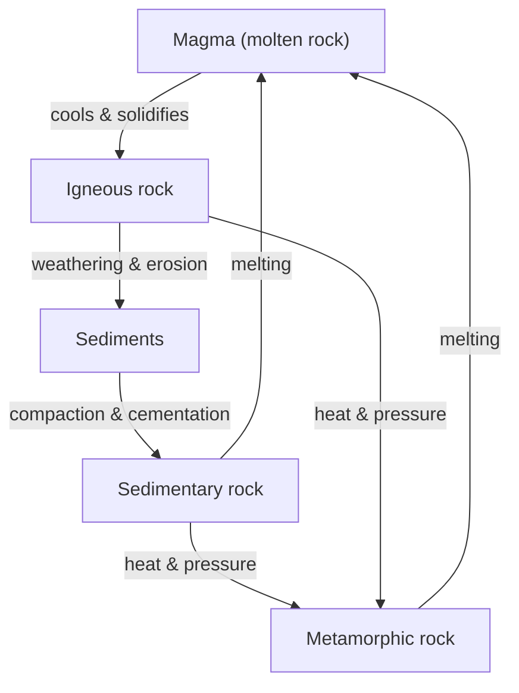

> [!focus] Exam Focus
> Highest-yield: **latitude/longitude basics** (equator 0°, poles 90°, Tropics 23½°, Prime Meridian 0°, IDL ~180°), **longitude ↔ time** (15° = 1 hour, 1° = 4 minutes), **India's Standard Time = 82½°E** (UTC +5:30), the **three rock types** (igneous/sedimentary/metamorphic) and the **rock cycle**, **seismic waves** (P = primary/longitudinal/fastest, S = secondary/transverse, L = long/surface/most damaging), **representative fraction** (RF) and **contours**, and India's **physical divisions** (Himalayas, Northern Plain, Peninsular Plateau, Coastal Plains & Islands).

# Geography — Earth, Lithosphere, Maps & India (ಭೂಗೋಳ)

Geography is a 10% block of Paper 2. It is fact-dense but predictable. See the parent list in [[02b_Paper2_Official_Syllabus]]; for Karnataka-specific physical and regional detail cross-refer [[07_Geography]]. This note keeps strictly to the syllabus themes: the Earth, the lithosphere, maps, and the physical features of India.

## 1. The Earth (ಭೂಮಿ)

**The universe (ಬ್ರಹ್ಮಾಂಡ)** — galaxies made of stars; our Sun is a star in the **Milky Way**, and the **Solar System** has eight planets orbiting it. Earth is the **third planet** and the only one known to support life.

**Shape of the Earth** — not a perfect sphere but an **oblate spheroid (geoid)**: bulging at the equator and flattened at the poles because of its rotation. Proofs: ships' hulls vanish first over the horizon, circumnavigation, and satellite photographs.

**Axis, rotation & revolution:**
- **Axis** — the imaginary line through the poles, tilted **23½°** from the vertical to the orbital plane; this tilt causes the **seasons**.
- **Rotation** — spin on its axis, **west → east**, one turn in **~24 hours**, causing **day and night**.
- **Revolution** — orbit around the Sun once in **365¼ days**; the extra ¼ day gives a **leap year** every 4 years.

**Latitudes (ಅಕ್ಷಾಂಶ)** — angular distance north/south of the equator, parallel circles from **0° (equator)** to **90° (poles)**.

| Important parallel | Latitude |
|---|---|
| Equator | 0° |
| Tropic of Cancer (N) | 23½° N |
| Tropic of Capricorn (S) | 23½° S |
| Arctic Circle | 66½° N |
| Antarctic Circle | 66½° S |
| North / South Pole | 90° N / S |

**Heat zones** — **Torrid zone** (between the Tropics, hottest, Sun overhead), two **Temperate zones** (Tropics to Circles, moderate), two **Frigid zones** (Circles to poles, coldest).

**Longitudes (ರೇಖಾಂಶ)** — semicircles from pole to pole, measured east/west of the **Prime Meridian (0°, Greenwich)** up to **180°**. Unlike latitudes they are equal in length.

**Longitudes & time (zonal / standard time):**
- Earth turns 360° in 24 h → **15° = 1 hour**, and **1° = 4 minutes**.
- Places east of Greenwich are **ahead** in time; places west are **behind**.
- **Indian Standard Time (IST)** is fixed on the **82½° E** meridian (passing near Mirzapur) = **UTC + 5:30**.
- **International Date Line (IDL)** — roughly the **180°** meridian; crossing it **west → east you subtract a day**, **east → west you add a day**. It zig-zags to avoid splitting island groups.

## 2. The Lithosphere (ಶಿಲಾಗೋಳ)

**Layers of the Earth:**

| Layer | Feature |
|---|---|
| **Crust (ಶಿಲಾವರಣ)** | thin outermost solid layer; SIAL (continents) over SIMA (oceans) |
| **Mantle** | thick, semi-molten rock (magma source); convection currents move plates |
| **Core** | outer core liquid (iron–nickel), inner core solid; source of Earth's magnetism; hottest |

**Rocks & rock types:**

| Type | Formation | Examples |
|---|---|---|
| **Igneous** (primary) | cooling & solidifying of magma/lava | granite, basalt |
| **Sedimentary** | compaction of sediments in layers; may bear fossils | sandstone, limestone, shale |
| **Metamorphic** | heat & pressure alter existing rocks | marble (from limestone), slate (from shale), gneiss (from granite) |

**Weathering of rocks** — breakdown *in place* by:
- **Physical/mechanical** — temperature changes, frost, exfoliation.
- **Chemical** — oxidation, carbonation, solution.
- **Biological** — roots, burrowing animals, lichens.

Weathering + erosion + deposition + re-melting form the **rock cycle**.

**Earthquakes (ಭೂಕಂಪ)** — sudden release of energy at the **focus**; the point vertically above on the surface is the **epicentre**; recorded by a **seismograph** on the **Richter scale**. **Seismic waves:**

| Wave | Type | Speed / travel |
|---|---|---|
| **P (Primary)** | longitudinal | fastest; through solids & liquids; arrive first |
| **S (Secondary)** | transverse | slower; through solids only |
| **L (Long / surface)** | surface | slowest but **most destructive** |

**Volcanoes (ಜ್ವಾಲಾಮುಖಿ)** — vents where magma, gases and ash erupt. Types by activity: **active, dormant, extinct**. Products build cones, plateaus (e.g. the Deccan Trap basalt) and fertile volcanic soils.

The rock cycle shows the three rock families are not fixed: magma cools to igneous rock, which weathers into sediments that compact into sedimentary rock; heat and pressure turn either into metamorphic rock, and deep melting returns any of them to magma. Exam questions usually give a "before → after" pair (limestone → marble, shale → slate) and ask for the process (metamorphism) or the resulting type.

## 3. Maps (ನಕ್ಷೆಗಳು)

A **map** is a scaled, flat representation of the Earth (or part of it) on paper; a **globe** is a true-to-shape spherical model but cannot show detail or fold into a pocket.

**Characteristics of a good map** — title, **scale**, direction (north arrow), **conventional signs/legend**, and grid of latitude–longitude.

**Types of maps:**
- **Large-scale maps** — show a small area in great detail (e.g. cadastral/village and topographic sheets); a surveyor's working maps.
- **Small-scale maps** — show a large area with little detail (atlas, world, wall maps).
- **Thematic maps** — one theme: physical (relief), political, climatic, population, geological, etc.

**Map scale & representative fraction (RF):**
- Scale relates map distance to ground distance. **RF** is a unitless ratio, e.g. **1:50,000** means 1 unit on the map = 50,000 units on the ground.
- 1:50,000 → 1 cm = 50,000 cm = **0.5 km**. Larger denominator = smaller scale.
- Scale can be shown as a **statement** (1 cm = 1 km), an **RF** (1:100,000), or a **linear/graphic scale bar**.

**Conventional signs** — standard symbols/colours: blue = water, green = forest/lowland, brown contours = relief, black = roads/settlements, red = major roads.

**Contours** — lines joining points of **equal height** above mean sea level; the vertical gap between them is the **contour interval**.
- Contours **close together = steep slope**; **far apart = gentle slope**.
- Concentric closed contours = a hill; the same with hachures/inward ticks = a depression; V-contours pointing **upstream** mark a valley, pointing outward mark a ridge/spur.

## 4. Physical Features of India (ಭಾರತದ ಭೌತಿಕ ಲಕ್ಷಣಗಳು)

**Location & extent** — India lies in the **Northern & Eastern Hemispheres**, roughly **8°N–37°N** and **68°E–97°E**. The **Tropic of Cancer (23½°N)** divides it almost in half. It is the **seventh-largest** country by area; the mainland is bounded by the Himalayas in the north and the Indian Ocean, Arabian Sea and Bay of Bengal to the south.

India's relief has **six physical divisions**:

1. **The Northern Mountains (Himalayas)** — young **fold mountains**, in three parallel ranges: **Himadri** (Great Himalaya, highest, permanent snow — Kanchenjunga, Everest in Nepal), **Himachal** (Middle, hill stations), and **Shiwaliks** (Outer, lowest). They block cold winds, cause rainfall, and feed the perennial rivers.
2. **The Northern (Indo-Gangetic) Plain** — a vast, flat, fertile alluvial plain built by the **Indus, Ganga and Brahmaputra** systems; India's agricultural heartland and most densely populated region.
3. **The Peninsular Plateau** — old, stable igneous/metamorphic rock; split into the **Central Highlands** and the **Deccan Plateau**, flanked by the **Western** and **Eastern Ghats** that meet at the **Nilgiris**. Rich in minerals; the Deccan Trap gives black cotton soil.
4. **The Coastal Plains** — the **Western Coastal Plain** (narrow: Konkan, Kanara, Malabar) and the broader **Eastern Coastal Plain** (Northern Circars, Coromandel) with deltas.
5. **The Islands** — the **Andaman & Nicobar** in the Bay of Bengal (higher, of tectonic/volcanic origin) and the **Lakshadweep** coral islands in the Arabian Sea.
6. **The Great Indian (Thar) Desert** — arid sandy region in the north-west (Rajasthan).

**Rivers of India:**
- **Himalayan (perennial)** — snow- and rain-fed, flow all year: **Indus, Ganga, Brahmaputra** and tributaries (Yamuna, Ghaghara, Kosi).
- **Peninsular (seasonal)** — mostly rain-fed: east-flowing to the Bay of Bengal (**Godavari, Krishna, Kaveri, Mahanadi**) forming deltas, and west-flowing to the Arabian Sea (**Narmada, Tapti**) through rift valleys forming estuaries.

**Lakes** — freshwater (**Wular** in Kashmir, the largest natural freshwater lake; Dal), saltwater (**Sambhar**, Rajasthan), and lagoons (**Chilika** in Odisha, the largest; Vembanad in Kerala).

## Mnemonic — India north to south

**"Himalayas → Plain → Plateau → Coast → Islands."** Picture travelling from the snowy north, across the flat river plains, up onto the old plateau, down to the sea, and out to the islands — the same order questions list the divisions.

## Likely questions (PYQ-style)

*(Compiled in the KEA pattern — labelled expected/PYQ-style, not official.)*

1. **(Expected)** The latitude of the equator is (a) 90° (b) **0°** (c) 23½° (d) 66½°.
2. **(PYQ-style)** Indian Standard Time is based on the meridian (a) 0° (b) 75°E (c) **82½°E** (d) 90°E.
3. **(Expected)** Earth turns through 15° of longitude in (a) 4 min (b) 30 min (c) **1 hour** (d) 24 hours.
4. **(Expected)** Marble is formed from limestone by (a) cooling (b) deposition (c) **metamorphism** (d) weathering.
5. **(PYQ-style)** The fastest seismic waves are (a) **P (primary)** (b) S (secondary) (c) L (surface) (d) tidal.
6. **(Expected)** A map with RF 1:50,000 means 1 cm represents (a) 50 m (b) 5 km (c) **0.5 km** (d) 50 km.
7. **(Expected)** Contour lines drawn very close together indicate (a) gentle slope (b) **steep slope** (c) plain (d) valley bottom.
8. **(PYQ-style)** The Himalayas are an example of (a) block (b) volcanic (c) **fold** (d) residual mountains.
9. **(Expected)** Which is a west-flowing peninsular river? (a) Godavari (b) Krishna (c) **Narmada** (d) Kaveri.
10. **(Expected)** The largest coral island group of India is (a) Andaman (b) Nicobar (c) **Lakshadweep** (d) Diu.

> [!tip] 60-second revision
> - **Earth:** oblate spheroid; axis tilt **23½°** → seasons; rotation → day/night; revolution 365¼ days → leap year.
> - **Latitude:** equator 0°, poles 90°, Tropics 23½°, Circles 66½°; zones torrid/temperate/frigid.
> - **Longitude & time:** 15° = 1 h, 1° = 4 min; **IST = 82½°E = UTC+5:30**; IDL ≈ 180°.
> - **Interior:** crust → mantle → core; **rocks:** igneous (cooling), sedimentary (layers/fossils), metamorphic (heat+pressure).
> - **Seismic waves:** P fastest (longitudinal, solids+liquids), S transverse (solids only), **L most destructive**.
> - **Maps:** large scale = detail/small area; RF unitless (1:50,000 → 1 cm = 0.5 km); contours close = steep.
> - **India divisions:** Himalayas → Northern Plain → Peninsular Plateau → Coastal Plains → Islands (+Thar).
> - **Rivers:** Himalayan perennial (Indus, Ganga, Brahmaputra); peninsular seasonal (Godavari, Krishna, Kaveri east; Narmada, Tapti west).
> - Related: [[02b_Paper2_Official_Syllabus]] | [[07_Geography]] | [[20_Physics]]
