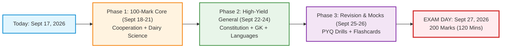
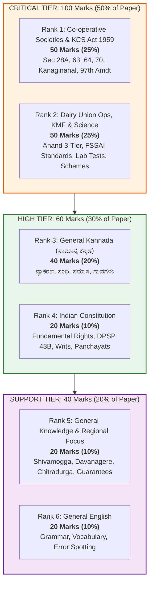
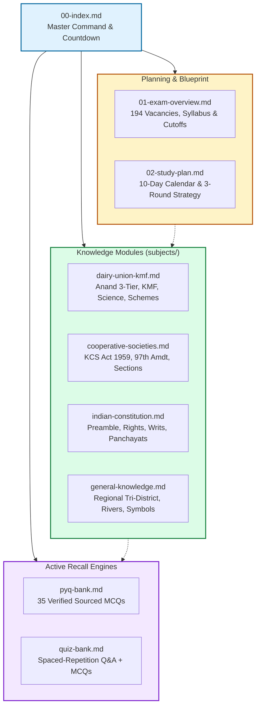

# 00. SHIMUL Recruitment Exam 2026: Master Study Vault

---

## 1. Executive Exam Overview

The **Shivamogga, Davanagere and Chitradurga District Co-operative Milk Producers' Societies Union Limited (SHIMUL / ಕೆ.ಎಂ.ಎಫ್. ಶಿಮುಲ್)** recruitment examination is a high-stakes competitive selection drive for **194 vacancies** across 17 technical, administrative, and artisan cadres (including Assistant Manager, Technical Officer, Chemist, Extension Officer, Administrative/Accounts Assistants, and Junior Technicians). Affiliated with the apex **Karnataka Milk Federation (KMF)**, the selection is governed by a **200-mark objective written test** (bilingual in Kannada and English, lasting 120 minutes, with a 0.25 negative marking penalty per incorrect answer). The syllabus is heavily anchored in the **Karnataka Co-operative Societies Act, 1959**, **Dairy Union operations & KMF structure**, the **Indian Constitution**, **Karnataka regional geography & general knowledge**, and **General Kannada/English language proficiency**.

---

## 2. Exam Countdown & Master Strategy

> [!IMPORTANT]
> **EXAM COUNTDOWN:** Exactly **10 DAYS REMAINING**!
> * **Today's Date:** September 17, 2026
> * **Official Written Examination Date:** **September 27, 2026 (Sunday)**
> * **Direct Action Link:** Jump directly to your customized day-by-day timetable: [[02-study-plan|02. Day-by-Day 10-Day Study Plan]]

---

## 3. Priority-Ranked Subject Hierarchy

Based on comprehensive analysis of **(a) marks weightage** in the official scheme and **(b) recurrence frequency in verified Previous Year Question papers (PYQs)**, study time must be prioritized in the following strict descending order:

### Marks Breakdown & Strategy Table

|   Rank    | Subject & Domain Focus                     | Typical Marks | Weightage (%) | Strategic Assessment & Focus                                                        |
| :-------: | :----------------------------------------- | :-----------: | :-----------: | :---------------------------------------------------------------------------------- |
|   **1**   | **Co-operative Societies & KCS Act, 1959** | **50 Marks**  |   **25.0%**   | **CRITICAL:** High-scoring legal sections (Sec 20, 28A, 63, 64, 69, 70) and history |
|   **2**   | **Dairy Union Operations, KMF & Science**  | **50 Marks**  |   **25.0%**   | **CRITICAL:** Anand model, FSSAI Fat/SNF, Pasteurization, *Ksheera Bhagya*          |
|   **3**   | **General Kannada (ಸಾಮಾನ್ಯ ಕನ್ನಡ)**        | **40 Marks**  |   **20.0%**   | **HIGH:** Scoring booster through grammar, proverbs, and cooperative terms          |
|   **4**   | **Indian Constitution (ಭಾರತದ ಸಂವಿಧಾನ)**    | **20 Marks**  |   **10.0%**   | **HIGH:** Predictable, finite domain (FRs, Writs, DPSP 43B, 73rd Amendment)         |
|   **5**   | **General Knowledge & Regional Focus**     | **20 Marks**  |   **10.0%**   | **MEDIUM:** Regional landmarks (Jog Falls, Obavva, Shanti Sagara) & State schemes   |
|   **6**   | **General English**                        | **20 Marks**  |   **10.0%**   | **MEDIUM:** Standard objective grammar, tenses, and vocabulary                      |
| **Total** | **Complete Examination Pattern**           | **200 Marks** |   **100%**    | **Target Score: 155+ for Guaranteed Selection**                                     |

> 💡 **The Golden Rule:** The top two subjects—**Cooperative Societies** and **Dairy Union / KMF**—together make up **100 marks (50% of the entire written exam)**. Mastering these two ensures you clear the qualifying threshold and build an unbeatable competitive margin!

---

## 4. Vault Architecture & Navigation Map

This vault is engineered as an interconnected, authoritative study system and active-recall engine:

### Blueprint & Planning
* [[01-exam-overview|01. Exam Overview & Official Pattern]] — Complete breakdown of 194 vacancies across 17 cadres, marking scheme, bilingual structure, full section-wise syllabus, and confidence & gaps analysis.
* [[02-study-plan|02. Day-by-Day 10-Day Study Plan]] — Hour-by-hour operational calendar from September 18 to September 27, 2026, incorporating conceptual learning, revision blocks, and exam-day execution strategy.

### Core Subject Knowledge Modules
* [[subjects/dairy-union-kmf|Dairy Union Functioning, KMF Structure & Dairy Technology]] — Comprehensive coverage of the Anand 3-tier pattern, KMF history (KDDC 1974 → KMF 1984), SHIMUL profile (Machenahalli, Davanagere, Chitradurga), FSSAI standards (Toned, Double Toned, Full Cream), pasteurization (LTLT, HTST, UHT), Alkaline Phosphatase testing, *Ksheera Bhagya*, and memory aids.
* [[subjects/cooperative-societies|Co-operative Societies: Movement, Principles & KCS Act, 1959]] — Detailed breakdown of Rochdale Pioneers (1844), 7 ICA Principles, Frederic Nicholson's Report, Kanaginahal 1905 heritage (Siddanagouda Patil), KCS Act 1959 Master Sections (Sec 20, 27, 28A, 57, 63, 64, 69, 70), Constitutional 97th Amendment, and the landmark Supreme Court 2021 *Rajendra N. Shah* judgment.
* [[subjects/indian-constitution|Indian Constitution: Core Framework, Panchayati Raj & Co-op Jurisprudence]] — Preamble keywords, Fundamental Rights (Articles 12–35), 5 Constitutional Writs (Habeas Corpus to Quo-Warranto), DPSP (Article 40, Article 43B), Fundamental Duties (51A), 73rd Amendment (Panchayati Raj 29 subjects), and Master Constitutional Articles table.
* [[subjects/general-knowledge|General Knowledge: Karnataka Profile, Regional Focus (SHIMUL Area) & Current Affairs]] — Physiography, river systems, Tri-District regional focus (Shivamogga, Davanagere, Chitradurga; Jog Falls, Koodli, Shanti Sagara, Onake Obavva, Vani Vilasa Sagara), state symbols, 8 Jnanpith awardees, and the *Panch Guarantee* welfare schemes.

### Testing & Active Recall Engines
* [[pyq-bank|Previous Year Question Bank (PYQ Bank)]] — 35 authentic, verified, and sourced MCQs from past KMF, BAMUL, TUMUL, MYMUL, and SHIMUL exams, plus adjacent Karnataka cooperative examinations, complete with correct answers and detailed explanations.
* [[quiz-bank|Interactive Flashcard & Quiz Bank]] — 30+ flashcard Q&A pairs and MCQ questions with distractors derived directly from the subject notes, tagged by difficulty and subject, topped with autonomous agent instructions for interactive spaced-repetition quizzing.

---

## 5. Instructions for Future AI Agent Sessions

> **Note for downstream AI Agents:**
> When conducting teaching or quizzing sessions with the user:
> 1. Use [[quiz-bank|quiz-bank.md]] and [[pyq-bank|pyq-bank.md]] as your primary ground truth.
> 2. Quiz the user **one question at a time**.
> 3. Provide concise explanations and immediately cite the relevant subject file (e.g., `[[subjects/cooperative-societies#Section-70]]`).
> 4. Keep track of user errors to re-surface failed concepts more frequently (spaced repetition).
