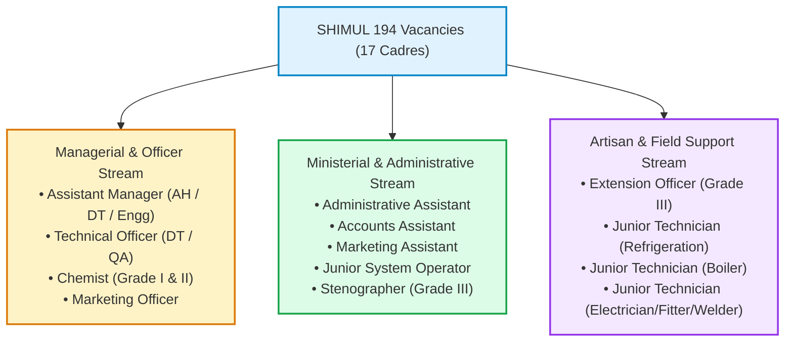
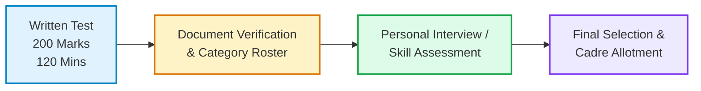
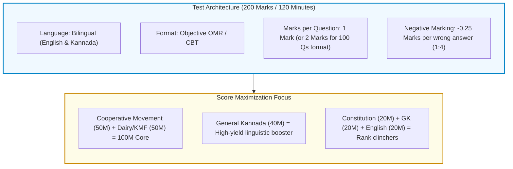

# 01. SHIMUL Recruitment Exam Overview & Official Pattern

---

## 1. Exam Identification & Official Context

* **Recruiting Body:** Shivamogga, Davanagere & Chitradurga District Co-operative Milk Producers' Societies Union Limited (**SHIMUL** / ಕೆ.ಎಂ.ಎಫ್. ಶಿಮುಲ್).
* **Affiliation:** Karnataka Milk Federation (KMF - ಕರ್ನಾಟಕ ಹಾಲು ಮಹಾಮಂಡಳ), Apex Cooperative Body.
* **Governing Department:** Department of Co-operation, Government of Karnataka.
* **Notification Window:** June 14, 2026 – July 14, 2026 (Revised cycle).
* **Total Advertised Vacancies:** **194 Posts** across 17 cadres.
* **Written Examination Date:** **September 27, 2026 (Sunday)**.
* **Admit Card / Hall Ticket Portal:** Official SHIMUL recruitment portal at [shimul.coop](https://www.shimul.coop).

---

## 2. Post-Wise Categorization (194 Vacancies)

The 194 vacancies span three major operational streams. While the general sections (Cooperation, Constitution, GK, Languages) remain common across streams, the domain/work activity section adapts to the technical versus managerial/administrative demands:

### Stream Specifics:
1. **Officer & Technical Cadres:** Focuses heavily on Dairy Science, Food Safety (FSSAI), Quality Control (Gerber, Lactometer, MBRT), Cattle Management, and Cooperative Dairy Processing.
2. **Ministerial / Assistant Cadres:** Emphasizes Cooperative Accounting, Auditing (Section 63), Computer Knowledge, Office Management, and Commercial Operations.
3. **Field & Extension Cadres (Extension Officer Gr-III):** Emphasizes village-level Dairy Cooperative Societies (DCS), milk procurement routes, chilling centers, animal husbandry extension, and farmer incentive schemes.

---

## 3. Exam Pattern & Marks Distribution

The written test is designed to test domain-specific legal and operational knowledge as well as general administrative competence.

| Section # | Section Name | Focus Areas | Typical Marks | Weightage (%) |
| :---: | :--- | :--- | :---: | :---: |
| **I** | **Co-operative Movement & Acts** | KCS Act 1959, 97th Amdt, ICA Principles, History | **50** | **25.0%** |
| **II** | **Union Operations & Dairy Domain** | KMF / SHIMUL setup, Anand Model, Dairy Science, Schemes | **50** | **25.0%** |
| **III** | **General Kannada (ಸಾಮಾನ್ಯ ಕನ್ನಡ)** | Grammar, vocabulary, comprehension, official idioms | **40** | **20.0%** |
| **IV** | **Indian Constitution (ಭಾರತದ ಸಂವಿಧಾನ)** | Preamble, Fundamental Rights, DPSP (43B), Panchayats | **20** | **10.0%** |
| **V** | **General Knowledge (GK)** | Karnataka geography/history, Shivamogga region, Static GK | **20** | **10.0%** |
| **VI** | **General English** | Basic grammar, sentence structure, error spotting, vocabulary | **20** | **10.0%** |
| **Total** | **Comprehensive Written Test** | **Objective Type Multiple Choice (MCQ)** | **200** | **100%** |

*(Note: In some technical streams, Section II expands to 60 marks with Section V/VI adjusted to 15 marks, keeping the overall total strictly at 200 marks).*

### Key Test Parameters:
* **Total Marks:** **200 Marks**
* **Total Questions:** 200 Questions (1 mark each) or 100 Questions (2 marks each, scaled to 200).
* **Exam Duration:** **2 Hours (120 Minutes)**.
* **Negative Marking:** **Yes — 0.25 marks deducted** for each incorrect answer (1:4 penalty ratio).
* **Medium of Question Paper:** **Bilingual (Kannada and English)**.
* **Mode of Exam:** Offline OMR Optical Sheet or Computer Based Test (CBT) as notified on the candidate's admit card.

---

## 4. Comprehensive Section-Wise Syllabus

### Section 1: Co-operative Societies & Karnataka Co-operative Societies Act
* **History of World & Indian Cooperation:**
  * Rochdale Pioneers of 1844 (Rochdale Principles, Toad Lane).
  * Sir Frederic Nicholson’s 1895 Report (*"Find Raiffeisen"*).
  * Cooperative Credit Societies Act of 1904 & 1912.
  * Kanaginahal (Gadag District) — First Agricultural Credit Cooperative Society in Karnataka/India (July 8, 1905) founded by Siddanagouda Sannaramanagouda Patil.
* **Principles of Cooperation:**
  * International Co-operative Alliance (ICA) 1995 Manchester Declaration (7 Golden Principles).
* **The Karnataka Co-operative Societies Act, 1959 & Rules, 1960:**
  * Registration of Societies & Bye-laws (Sections 6, 7, 12).
  * Membership Rights, Disqualifications, and Voting (Sections 16, 20).
  * Managing Committee / Board Composition & Elections (Section 28A — 5-year term, reservations for SC/ST, Women, and Backward Classes).
  * Appointment of Chief Executive / MD (Section 29G).
  * Supersession / Suspension of Board (Section 30).
  * Cooperative Audit (Section 63 — Director of Cooperative Audit).
  * Inquiry by Registrar (Section 64) and Inspection of Books (Section 65).
  * Surcharge and Recovery (Section 69).
  * Dispute Settlement & Arbitration (Section 70 — bar on civil courts).
  * Winding Up & Dissolution (Sections 72, 73).
* **Constitutional Dimensions:**
  * 97th Constitutional Amendment Act, 2011: Insertion of Part IX-B (Articles 243ZH to 243ZT), Article 19(1)(c), Article 43-B.
  * Union of India vs. Rajendra N. Shah (Supreme Court 2021 judgment on Part IX-B).
  * Formation of Union Ministry of Cooperation (July 6, 2021) — *"Sahakar Se Samriddhi"*.

### Section 2: Dairy Union Functioning & KMF Structure
* **Genesis of Dairy Cooperation:**
  * Kaira District Co-operative Milk Producers' Union (Amul, 1946) — Tribhuvandas Patel & Sardar Vallabhbhai Patel.
  * National Dairy Development Board (NDDB, 1965) — Anand, Gujarat.
  * Operation Flood (Phase I: 1970–1980, Phase II: 1981–1985, Phase III: 1985–1996) — Dr. Verghese Kurien.
* **Three-Tier Anand Pattern:**
  * Village Tier: Primary Dairy Co-operative Society (DCS / ಹಾಲು ಉತ್ಪಾದಕರ ಸಹಕಾರ ಸಂಘ).
  * District Tier: District Milk Union (e.g., SHIMUL).
  * State Apex Tier: Karnataka Milk Federation (KMF - ಕರ್ನಾಟಕ ಹಾಲು ಮಹಾಮಂಡಳ).
* **Karnataka Dairy Evolution:**
  * Karnataka Dairy Development Corporation (KDDC) established with World Bank aid in 1974.
  * Restructured into Karnataka Milk Federation (KMF) in 1984.
  * Launch of brand name *"Nandini"* in 1983.
  * 16 District Cooperative Milk Unions under KMF.
* **SHIMUL Specifics:**
  * Shivamogga, Davanagere, and Chitradurga District Milk Union Ltd.
  * Commenced operations: March 16, 1988; Operational transfer under Operation Flood-III: August 1, 1991.
  * Head Office / Mother Dairy: Machenahalli (Shivamogga).
  * Key processing plants & chilling centers: Shivamogga Dairy, Davanagere Dairy, Chitradurga, Honnali, Anandapura, Tadagani, Challakere, Hosadurga.
* **Dairy Science & Quality Standards (FSSAI):**
  * Milk composition (Water, Fat, Solids-Not-Fat [SNF], Protein, Lactose).
  * Milk grades: Toned (3.0% Fat, 8.5% SNF), Double Toned (1.5% Fat, 9.0% SNF), Standardized (4.5% Fat, 8.5% SNF), Full Cream (6.0% Fat, 9.0% SNF).
  * Quality tests: Gerber Fat Test, Lactometer Specific Gravity, Methylene Blue Reduction Test (MBRT), Clot-on-Boiling (COB), Alcohol Test, Alkaline Phosphatase Test.
  * Thermal Processing: LTLT (63°C, 30 min), HTST (72°C, 15 sec), UHT (135–150°C, 1–2 sec). Homogenization principles.
* **Government Schemes:**
  * *Ksheera Bhagya* (launched Aug 1, 2013 — milk to school and anganwadi children).
  * *Ksheera Dhare* (Direct Benefit Transfer incentive to milk producers).
  * *Pashu Sanjeevini* (Ambulatory veterinary clinics).

### Section 3: Indian Constitution
* **Constitutional Architecture:**
  * Preamble: Core philosophy, 42nd Amendment additions (Socialist, Secular, Integrity).
  * Part III: Fundamental Rights (Articles 12–35) — 6 categories, Writ jurisdiction (Article 32 for Supreme Court, Article 226 for High Courts).
  * Part IV: Directive Principles of State Policy (Articles 36–51) — Article 40 (Village Panchayats), Article 43B (Cooperatives), Article 44 (UCC).
  * Part IVA: Fundamental Duties (Article 51A — 11 duties, Swaran Singh Committee).
  * Executive & Legislature: President, Governor, Council of Ministers, Bicameralism in Karnataka (Vidhana Sabha & Vidhana Parishad).
  * Rural Governance: 73rd Amendment Act, 1992 (Part IX, 11th Schedule — 29 subjects).
  * Constitutional Authorities: Comptroller & Auditor General (CAG, Art 148), Election Commission (Art 324), Finance Commission (Art 280), Advocate General (Art 165).

### Section 4: General Knowledge (GK) & Regional Geography
* **Karnataka State Profile:**
  * Physical geography: Karavali (coastal), Malnad (Western Ghats), Maidan (North & South plains).
  * River systems: Krishna (Tungabhadra, Bhima, Ghataprabha, Malaprabha) and Cauvery (Hemavathi, Harangi, Kabini).
  * Historical Dynasties: Kadambas of Banavasi, Chalukyas of Badami, Hoysalas, Vijayanagara Empire, Nayakas of Keladi, Wodeyars of Mysuru.
  * State Unification: November 1, 1956 (Mysore State), renamed Karnataka on November 1, 1973 (Chief Minister D. Devaraj Urs).
  * State Symbols: Asian Elephant, Indian Roller, Lotus, Sandalwood tree, Southern Birdwing butterfly, Gandaberunda emblem.
* **SHIMUL Operational Region (Shivamogga, Davanagere, Chitradurga):**
  * *Shivamogga:* "Gateway of Malnad", Jog Falls (Sharavathi river), Kunchikal Falls (Varahi river), Linganamakki Dam, Bhadra Reservoir, Gudavi Bird Sanctuary, Kuvempu (Kuppalli).
  * *Davanagere:* "Manchester of Karnataka" (cotton & textile legacy), famous for Benne Dosa, Shanti Sagara / Sulekere (Channagiri — second largest ancient irrigation tank in Asia), Kunduvada Lake.
  * *Chitradurga:* "Kallina Kote" (Stone Fort with 7 rings), Onake Obavva's Kindi, Nayakas of Chitradurga (Madakari Nayaka), Vani Vilasa Sagara / Mari Kanive Dam (oldest dam across Vedavathi river, built 1907).
* **Current Affairs & Schemes:**
  * Karnataka *Panch Guarantee* Schemes: Gruha Jyothi, Gruha Lakshmi, Shakti, Anna Bhagya, Yuva Nidhi.
  * National & International Days: World Milk Day (June 1), National Milk Day (November 26), All India Cooperative Week (November 14–20).

### Section 5 & 6: Kannada & English Language Proficiency
* **General Kannada:** ವರ್ಣಮಾಲೆ, ಸಂಧಿಗಳು, ಸಮಾಸಗಳು, ತತ್ಸಮ-ತದ್ಭವ, ನಾಣ್ಣುಡಿಗಳು (proverbs), ಗಾದೆಮಾತುಗಳು, ವಾಕ್ಯದೋಷ ತಿದ್ದುಪಡಿ, ಪಾರಿಭಾಷಿಕ ಪದಗಳು (administrative and cooperative terminology).
* **General English:** Parts of speech, subject-verb agreement, tenses, active/passive voice, direct/indirect speech, idioms and phrases, synonyms/antonyms, spot the error.

---

## 5. Confidence & Gaps Assessment

To adhere strictly to professional standards, here is the explicit evaluation of verified facts versus operational variances:

| Domain Item | Status | Verification Detail |
| :--- | :---: | :--- |
| **Exam Date (Sept 27, 2026)** | **Verified** | Confirmed through regional recruitment schedules for the 194 posts. |
| **Total Marks (200)** | **Verified** | Standard across KMF and district union exams (BAMUL, TUMUL, SHIMUL). |
| **Negative Marking (0.25)** | **Verified** | 1:4 negative marking applies to standard KMF written exams. |
| **Duration (120 min)** | **Verified** | 2 hours standard duration across all union competitive exams. |
| **Post-wise technical weightage** | **Slight Variance** | Technical Officer / Chemist posts may allocate 60 marks to Dairy/Chemistry with minor reductions in general English/GK. For administrative posts, Cooperation and Union activities dominate with 50 marks each. |
| **Official PDF release of PYQs** | **Gap / Restricted** | KMF / Milk Unions rarely release official PDF test papers with keys post-exam. Questions are preserved through coaching memory transcripts, official provisional answer keys, and adjacent cooperative examinations. Agent-labeled authentic sources are documented in `pyq-bank.md`. |

---

## 6. Quick Review & Revise: Exam Pattern at a Glance

---
*Sources & References:*
1. *Official Portal of Shivamogga Milk Union:* [shimul.coop](https://www.shimul.coop)
2. *Karnataka Milk Federation Apex Portal:* [kmfnandini.coop](https://www.kmfnandini.coop)
3. *The Karnataka Co-operative Societies Act, 1959 (Karnataka Act No. 11 of 1959)*
4. *National Dairy Development Board (NDDB) Institutional Repository*
5. *Department of Co-operation, Government of Karnataka Notification Bulletins*
