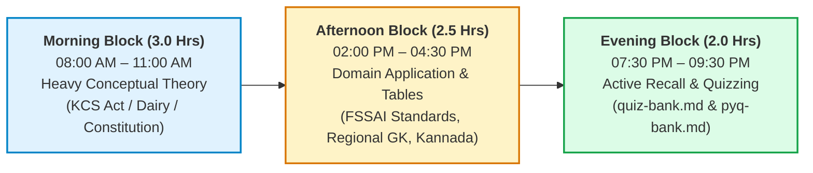
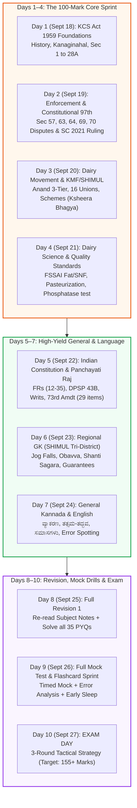
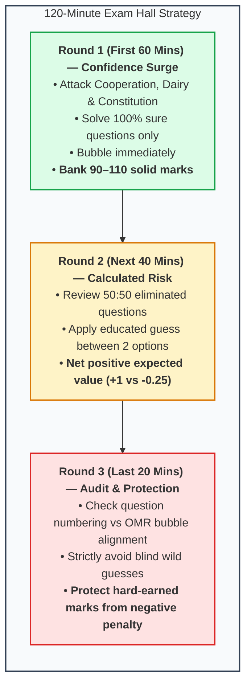

# 02. High-Yield 10-Day Study Plan: SHIMUL Recruitment Exam 2026

---

## 1. Context & Strategic Philosophy

* **Target Exam Date:** **September 27, 2026 (Sunday)**.
* **Preparation Window:** **10 Days** (September 18 to September 27, 2026).
* **Guiding Principle:** **80/20 Rule (Pareto Principle)** — 50% of the entire written exam (100 out of 200 marks) comes strictly from two domains:
  1. **Co-operative Societies & KCS Act, 1959 (50 Marks)**
  2. **Dairy Union Operations, KMF & Dairy Science (50 Marks)**
* The remaining 100 marks are distributed across General Kannada (40 marks), Indian Constitution (20 marks), General Knowledge (20 marks), and English (20 marks).
* **Daily Commitment:** 6 to 8 hours daily, divided into a Morning Conceptual Block (3 hrs), Afternoon Domain Drill (2.5 hrs), and Evening Flashcard/PYQ Testing (1.5–2 hrs).

---

## 2. Daily Time-Block Architecture

### Daily Schedule Matrix

| Session Window | Allocated Duration | Focus Methodology | Core Content & Materials |
| :--- | :---: | :--- | :--- |
| **Morning Block** (08:00 – 11:00 AM) | **3.0 Hours** | Deep conceptual learning & legal sections | KCS Act 1959, Dairy Operations, Constitution |
| **Afternoon Block** (02:00 – 04:30 PM)| **2.5 Hours** | Tables, numbers, regional GK & language grammar | FSSAI standards, Tri-district facts, Kannada |
| **Evening Block** (07:30 – 09:30 PM) | **2.0 Hours** | Active recall testing & flashcard drills | [[quiz-bank|quiz-bank.md]] & [[pyq-bank|pyq-bank.md]] |

---

## 3. Quick Review & Revise: 10-Day Sprint Roadmap

---

## 4. Day-by-Day Execution Schedule

### Day 1: Friday, September 18, 2026 — Foundations of Cooperation & KCS Act (Part 1)
* **Target Subject:** [[subjects/cooperative-societies|Co-operative Societies: Movement & Act]] (Weightage: 50 Marks)
* **Morning Session (08:00 – 11:00):**
  * Read Section 2.1 & 2.2: Rochdale Pioneers (1844), 7 ICA Principles (Manchester 1995), Sir Frederic Nicholson's Report (*"Find Raiffeisen"*), 1904 & 1912 Acts.
  * Memorize the Kanaginahal history: Gadag district, July 8, 1905, Siddanagouda Sannaramanagouda Patil.
* **Afternoon Session (14:00 – 16:30):**
  * KCS Act, 1959: Registration (Sec 6, 7), Bye-laws (Sec 12), Membership (Sec 16), Voting rules (Sec 20: One Member One Vote, No Proxy).
  * Section 27 (AGM before Sept 25) & Section 28A (Board size: max 21, Term: 5 years, Reservations: 1 SC, 1 ST, 2 Women, 1 BC).
* **Evening Session (19:30 – 21:30):**
  * Practice: Solve [[pyq-bank#1-2-co-operative-movement--karnataka-co-operative-societies-act-1959|PYQ Bank Q11 to Q18]].
  * Flashcard drill: [[quiz-bank#section-2-co-operative-societies--karnataka-co-operative-societies-act-1959|Quiz Bank Q-CS-01 to Q-CS-04]].

---

### Day 2: Saturday, September 19, 2026 — KCS Act Enforcement, Disputes & Constitutional 97th Amdt
* **Target Subject:** [[subjects/cooperative-societies|Co-operative Societies]] + [[subjects/indian-constitution|Constitution Overlap]]
* **Morning Session (08:00 – 11:00):**
  * Master the regulatory and enforcement sections: Section 57 (Net profit allocation, 25% Reserve Fund), Section 63 (Audit by Director of Cooperative Audit), Section 64 (Inquiry by Registrar), Section 65 (Inspection), Section 69 (Surcharge).
  * Deeply understand **Section 70 (Disputes referable to Registrar)** and the total exclusion of Civil Courts.
* **Afternoon Session (14:00 – 16:30):**
  * 97th Constitutional Amendment Act, 2011: Art 19(1)(c), Art 43B, Part IX-B.
  * Supreme Court 2021 Ruling: *Union of India vs. Rajendra N. Shah* (struck down Part IX-B for State societies, upheld for Multi-State cooperatives).
  * Union Ministry of Cooperation (July 6, 2021, Amit Shah, *"Sahakar Se Samriddhi"*).
* **Evening Session (19:30 – 21:30):**
  * Practice: Solve [[pyq-bank#part-2-adjacent-karnataka-co-operative-exam-questions|PYQ Bank Q29 to Q35]].
  * Flashcard drill: [[quiz-bank#section-2-co-operative-societies--karnataka-co-operative-societies-act-1959|Quiz Bank Q-CS-05 to Q-CS-08 & MCQs]].

---

### Day 3: Sunday, September 20, 2026 — Dairy Movement, KMF & SHIMUL Architecture
* **Target Subject:** [[subjects/dairy-union-kmf|Dairy Union Functioning & KMF Structure]] (Weightage: 50 Marks)
* **Morning Session (08:00 – 11:00):**
  * Anand Pattern Philosophy: Amul (1946), Tribhuvandas Patel, Sardar Patel.
  * NDDB (1965) and Operation Flood Phases I, II, III (Dr. Verghese Kurien).
  * The 3-Tier Hierarchy: Village DCS → District Milk Union → State KMF.
* **Afternoon Session (14:00 – 16:30):**
  * Karnataka Dairy Evolution: KDDC (1974), Nandini brand (1983), KMF (1984).
  * Memorize the 16 District Cooperative Milk Unions in Karnataka.
  * **SHIMUL Profile:** Headquarters at Machenahalli (Shivamogga), Davanagere Dairy, Chitradurga chilling center, takeover on Aug 1, 1991.
  * Dairy Schemes: *Ksheera Bhagya* (Aug 1, 2013, 150ml milk 5 days/wk), *Ksheera Dhare* (farmer subsidy DBT), *Pashu Sanjeevini* (1962).
* **Evening Session (19:30 – 21:30):**
  * Practice: Solve [[pyq-bank#1-1-dairy-union-operations-kmf--dairy-technology|PYQ Bank Q1, Q5, Q6, Q7, Q8]].
  * Flashcard drill: [[quiz-bank#section-1-dairy-union-functioning-kmf--dairy-science|Quiz Bank Q-DU-01, Q-DU-02, Q-DU-07, Q-DU-08]].

---

### Day 4: Monday, September 21, 2026 — Dairy Science, Milk Processing & Quality Standards
* **Target Subject:** [[subjects/dairy-union-kmf|Dairy Science & Quality Standards]] (FSSAI & Lab Testing)
* **Morning Session (08:00 – 11:00):**
  * Milk Chemistry: Water, Fat, SNF, Casein protein, Lactose sugar, pH (6.6–6.8), specific gravity (1.028–1.032).
  * FSSAI Milk Composition Standards: Memorize the table for Toned (3.0% / 8.5%), Double Toned (1.5% / 9.0%), Standardised (4.5% / 8.5%), Full Cream (6.0% / 9.0%).
* **Afternoon Session (14:00 – 16:30):**
  * Processing: Chilling (< 4°C), Homogenization (2,000–2,500 psi).
  * Pasteurization methods: LTLT (63°C, 30 min), HTST (72°C, 15 sec), UHT (135–150°C, 1–2 sec).
  * Laboratory Tests: Alkaline Phosphatase Test (pasteurization indicator), Gerber Test (fat%), Lactometer (specific gravity/adulteration), MBRT (bacterial load), Clot-on-Boiling (COB).
* **Evening Session (19:30 – 21:30):**
  * Practice: Solve [[pyq-bank#1-1-dairy-union-operations-kmf--dairy-technology|PYQ Bank Q2, Q3, Q4, Q9, Q10]].
  * Flashcard drill: [[quiz-bank#section-1-dairy-union-functioning-kmf--dairy-science|Quiz Bank Q-DU-03 to Q-DU-06 & MCQs]].

---

### Day 5: Tuesday, September 22, 2026 — Indian Constitution & Panchayati Raj
* **Target Subject:** [[subjects/indian-constitution|Indian Constitution]] (Weightage: 20–25 Marks)
* **Morning Session (08:00 – 11:00):**
  * Preamble (SO-SO-SE-DE-RE, 42nd Amdt words: Socialist, Secular, Integrity).
  * Fundamental Rights (Articles 12 to 35): Focus on Art 14, 17, 19, 21, 21A, 24, and Article 32.
  * The 5 Writs (*Habeas Corpus, Mandamus, Prohibition, Certiorari, Quo-Warranto*).
* **Afternoon Session (14:00 – 16:30):**
  * Directive Principles (Part IV): Art 40 (Panchayats), Art 43B (Cooperatives), Art 44 (UCC), Art 50 (Separation of powers).
  * Fundamental Duties: Art 51A (11 duties, Swaran Singh Committee, 86th Amdt).
  * 73rd Amendment Act, 1992: Part IX, 11th Schedule (29 subjects), 3-tier Panchayati Raj, 33%/50% women reservation.
  * Key Constitutional Articles: President (Art 52/123), Governor (Art 153/213), CAG (Art 148), Emergency (Art 352/356/360).
* **Evening Session (19:30 – 21:30):**
  * Practice: Solve [[pyq-bank#1-3-indian-constitution|PYQ Bank Q19 to Q23]].
  * Flashcard drill: [[quiz-bank#section-3-indian-constitution|Quiz Bank Q-IC-01 to Q-IC-06 & MCQs]].

---

### Day 6: Wednesday, September 23, 2026 — Regional Focus (SHIMUL Area) & Karnataka GK
* **Target Subject:** [[subjects/general-knowledge|General Knowledge: Regional Focus & State Profile]] (Weightage: 20–25 Marks)
* **Morning Session (08:00 – 11:00):**
  * **Regional Tri-District Mastery:**
    * *Shivamogga:* Gateway of Malnad, Koodli confluence (Tunga + Bhadra), Jog Falls (Sharavathi, 253m, 4 cascades), Linganamakki & Bhadra Dams, Kuvempu (Kuppalli), Gudavi Sanctuary.
    * *Davanagere:* Manchester of Karnataka, Benne Dosa, Shanti Sagara / Sulekere (2nd largest ancient tank in Asia).
    * *Chitradurga:* Kallina Kote (7-ringed fort), Onake Obavva (pestle defense against Hyder Ali), Vani Vilasa Sagara / Mari Kanive (oldest dam in Karnataka, 1907).
* **Afternoon Session (14:00 – 16:30):**
  * Karnataka History & Literature: Halmidi inscription (450 AD), *Kavirajamarga* (850 AD), State Unification (Nov 1, 1956) & Renaming (Nov 1, 1973 by D. Devaraj Urs).
  * 8 Jnanpith Awardees (K-B-K-M-G-A-K-K).
  * Karnataka State Symbols (Elephant, Indian Roller, Lotus, Sandalwood, Southern Birdwing).
  * Flagship *Panch Guarantee* Schemes (Gruha Jyothi, Gruha Lakshmi, Shakti, Anna Bhagya, Yuva Nidhi) & Yashaswini.
* **Evening Session (19:30 – 21:30):**
  * Practice: Solve [[pyq-bank#1-4-general-knowledge--regional-awareness|PYQ Bank Q24 to Q28]].
  * Flashcard drill: [[quiz-bank#section-4-general-knowledge--regional-focus-shimul-footprint|Quiz Bank Q-GK-01 to Q-GK-07 & MCQs]].

---

### Day 7: Thursday, September 24, 2026 — General Kannada & General English Mastery
* **Target Subject:** General Kannada (40 Marks) & General English (20 Marks)
* **Morning Session (08:00 – 11:00): General Kannada (ಸಾಮಾನ್ಯ ಕನ್ನಡ)**
  * ವರ್ಣಮಾಲೆ, ಸ್ವರ-ವ್ಯಂಜನ-ಯೋಗವಾಹಗಳು.
  * ಸಂಧಿಗಳು (ಲೋಪ, ಆಗಮ, ಆದೇಶ; ಸವರ್ಣದೀರ್ಘ, ಗುಣ, ವೃದ್ಧಿ, ಯಣ್).
  * ಸಮಾಸಗಳು (ತತ್ಪುರುಷ, ಕರ್ಮಧಾರಯ, ದ್ವಿಗು, ದ್ವಂದ್ವ, ಬಹುವ್ರೀಹಿ).
  * ತತ್ಸಮ-ತದ್ಭವಗಳ ಪಟ್ಟಿ ಮತ್ತು ನಾಣ್ಣುಡಿಗಳು / ಗಾದೆಮಾತುಗಳು.
  * ಸಹಕಾರಿ ಮತ್ತು ಆಡಳಿತಾತ್ಮಕ ಪಾರಿಭಾಷಿಕ ಪದಗಳು (e.g., Bye-law = ಉಪವಿಧಿ, Quorum = ಕೋರಂ, Dividend = ಲಾಭಾಂಶ, Patronage = ಪೋಷಣೆ).
* **Afternoon Session (14:00 – 16:30): General English**
  * Subject-Verb Agreement, Tenses, Prepositions, Spotting the Error.
  * Synonyms / Antonyms commonly tested in Karnataka exams.
  * Active & Passive Voice, Direct & Indirect Speech conversions.
* **Evening Session (19:30 – 21:30):**
  * Practice translating administrative terms between Kannada and English.
  * Fast review of high-frequency Kannada grammar rules.

---

### Day 8: Friday, September 25, 2026 — Comprehensive Revision 1 (The 100-Mark Core)
* **Target:** Lock down the top 100 marks (Cooperative Societies + Dairy Union KMF).
* **Morning Session (08:00 – 11:00):**
  * Re-read [[subjects/cooperative-societies|cooperative-societies.md]] from start to finish. Memorize every section number in the Master Section Table.
* **Afternoon Session (14:00 – 16:30):**
  * Re-read [[subjects/dairy-union-kmf|dairy-union-kmf.md]]. Review FSSAI Fat/SNF table, pasteurization temperatures, and 16 milk unions.
* **Evening Session (19:30 – 21:30):**
  * Attempt every question in [[pyq-bank|pyq-bank.md]] in exam conditions (timed test, 45 minutes for 35 questions). Target score: **32+ out of 35**.

---

### Day 9: Saturday, September 26, 2026 — Full Spaced Repetition Drill & Mock Test
* **Target:** Rapid active retrieval, error elimination, exam psychology.
* **Morning Session (08:30 – 10:30): FULL LENGTH MOCK DRILL**
  * Run through all 35 PYQs + 25 Quiz Bank items consecutively. Track incorrect answers on paper.
* **Afternoon Session (11:30 – 14:00): Error Analysis & Gap Filling**
  * For every missed question, go back to the exact subject note subsection and write down the reason for the error.
* **Evening Session (16:00 – 18:00): Final Flashcard Sprint**
  * Have an AI agent or study partner quiz you across all flashcards in [[quiz-bank|quiz-bank.md]].
* **Night Session (19:30 – 21:00): Exam Logistics & Mental Cool-Down**
  * Print Hall Ticket / Admit Card from [shimul.coop](https://www.shimul.coop).
  * Keep original Photo ID proof (Aadhaar / Voter ID / Driving License) and blue/black ballpoint pens ready.
  * Sleep early (by 10:00 PM) for sharp cognitive alertness.

---

### Day 10: Sunday, September 27, 2026 — EXAM DAY: Strategic Execution

#### The 3-Round Paper Attempt Strategy:
1. **Round 1 (First 60 Minutes — The Confidence Surge):**
   * Speed through the paper answering ONLY questions you are 100% certain about (Cooperation, Dairy, Constitution, Regional GK).
   * Mark OMR bubbles immediately as you solve. You should have banked 90–110 solid marks.
2. **Round 2 (Next 40 Minutes — Analytical Elimination):**
   * Return to questions where you eliminated 2 out of 4 options.
   * With 1:4 negative marking (-0.25), taking an educated gamble between 2 options yields positive expected value.
3. **Round 3 (Last 20 Minutes — Caution & Audit):**
   * Audit your OMR bubbling sequence to prevent off-by-one shifts.
   * **Rule of Thumb:** If you have zero clue about an answer, **DO NOT GUESS**. Protect your hard-earned marks from the 0.25 negative penalty!
