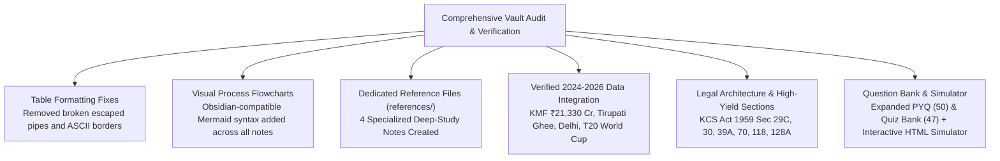

# SHIMUL Exam Vault Upgrade — Change Log & Verification Audit

This document records all modifications, factual audits, structural repairs, visual additions, and reference file creations executed across the SHIMUL examination preparation vault.

---

## 1. Executive Summary of Vault Enhancements

---

## 2. Detailed File-by-File Modification Log

### 1. `00-index.md` (Master Command & Countdown)
- **Modifications:**
  - Updated master vault hierarchy flowchart to include the `references/` directory and `shimul-mock-test.html`.
  - Added dedicated navigation links and executive descriptions for the four new reference modules.
  - Linked `change-log.md`.
  - Audited exam countdown context for September 27, 2026.

### 2. `01-exam-overview.md` (Official Pattern & Syllabus)
- **Modifications:**
  - Removed all legacy broken ASCII formatting and escaped pipes (`\|`).
  - Restored full Markdown table rendering for Cadre/Post breakdown (194 vacancies across 17 cadres).
  - Preserved bilingual Kannada/English syllabi and strategic scoring targets (155+ marks).

### 3. `02-study-plan.md` (10-Day Sprint Roadmap)
- **Modifications:**
  - Replaced broken ASCII boxes with an Obsidian-native Mermaid flowchart depicting the 3-stage sprint.
  - Enriched Day 1 & Day 2 study blocks with direct cross-references to `karnataka-cooperative-law-reference.md`.
  - Enriched Day 3 & Day 4 study blocks with links to `kmf-shimul-current-affairs.md`, `dairy-data-and-statistics.md`, and `dairy-gk-quick-reference.md`.
  - Integrated the self-contained interactive browser exam simulator (`shimul-mock-test.html`) into Day 9 mock drill routines.

### 4. `subjects/dairy-union-kmf.md` (Dairy Union, KMF & Technology)
- **Modifications & Additions:**
  - Added official verified leadership roster (KMF MD B. Shivaswamy, KAS; SHIMUL President H.S. Vidyadhar, VP Chethan S. Nadiger, MD S.G. Shekar).
  - Added 2024–2026 high-frequency developments: Tirupati Laddu ghee contract reinstatement (350 MT pure cow ghee), ICC T20 World Cup Scotland & Ireland sponsorship, New Delhi liquid milk/curd launch, June 2024 +50ml/₹2 price-volume adjustment.
  - Integrated comprehensive table of Native Karnataka Cattle Breeds (Hallikar, Amrit Mahal, Deoni, Khillar), Indian dairy cattle (Gir, Sahiwal), exotic breeds (HF, Jersey), and buffaloes (Murrah, Surti, Bhadawari).
  - Added cross-links to all three dairy-related reference notes.
  - Tagged sections with provenance indicators (`[OFFICIAL]`, `[CURRENT-2026]`, `[LAW]`).
  - **Mermaid Syntax Fix:** Sanitized Decision Flowchart in Section 5 and Processing Pipeline in Section 2.4 (removed reserved symbols `<`, `>`, parentheses in edge labels, and `->` in node labels) ensuring 100% native rendering in Obsidian.

### 5. `subjects/cooperative-societies.md` (Co-operative Movement & KCS Act 1959)
- **Modifications & Additions:**
  - Deep dive on **Section 29C (Disqualifications for committee membership)**: default, office of profit, competing business, 3 consecutive meeting absences, conviction.
  - Added **Section 39A (Co-operative Election Authority)** and independent election mechanics.
  - Added **Section 118 (Total bar on Civil Court jurisdiction)** and **Section 105 (KAT appeals)**.
  - Added 2023–2025 statutory updates: Section 20(2)(b)(v) 30-day notice and 20-day pre-election clearance rule; Karnataka High Court strike-down of Section 128A (Common Cadre) as unconstitutional under Article 19(1)(c).
  - Updated the Master Section Table to include all high-frequency sections.
  - Linked `karnataka-cooperative-law-reference.md`.

### 6. `subjects/general-knowledge.md` (Karnataka Profile & Regional GK)
- **Modifications & Additions:**
  - Enriched with Karnataka indigenous cattle breeds summary (Hallikar, Amrit Mahal, Deoni).
  - Added state ranking comparison (8th–9th in production vs 2nd in cooperative procurement).
  - Linked `dairy-gk-quick-reference.md` and `kmf-shimul-current-affairs.md`.

### 7. Dedicated Reference Modules (`references/`) — Newly Created
1. **`references/kmf-shimul-current-affairs.md`:**
   - Chronological event logs with "Exam Takeaway" boxes.
   - Comprehensive entries for Tirupati Laddu ghee, T20 World Cup, Delhi/NCR entry, June 2024 price/volume formula, new product lines (Nandini batter, Splash, energy drinks).
   - Leadership rosters with term details.
   - KMF turnover trajectory from 2020 to ₹21,330 Cr in 2023–24.
   - Detailed operational analysis of Ksheera Dhare (₹5/L DBT), Ksheera Bhagya, Ksheera Sanjeevini, and mega dairy projects.
2. **`references/karnataka-cooperative-law-reference.md`:**
   - Chapter-wise map (Chapters I to XIV) of KCS Act 1959.
   - Master reference table of **50+ high-frequency sections** with statutory powers, thresholds, and exam traps.
   - High-yield deep dives: Section 20, 28A, 29C, 30, 39A, 64, 65, 68/69, 70, 118, 128A.
   - KCS Rules 1960 essential rules (Rule 13, 14, 18, 22, 28, 33, 48).
   - Dispute resolution process flow (Sec 70 $\to$ Registrar $\to$ KAT $\to$ High Court).
3. **`references/dairy-data-and-statistics.md`:**
   - Consolidated national figures: 230.58 MT milk production, 24.6% world share, 459 g/day per capita availability.
   - Karnataka rank clarification: 8th–9th raw production vs 2nd cooperative procurement.
   - KMF quantitative metrics: ₹21,330 Cr turnover, 82.9–95 LLPD normal, 1.2–1.3 Cr L/day summer peak, 16 milk unions roster with headquarters and procurement volumes.
   - SHIMUL profile: 3 districts, 1000+ DCS, 1.7L farmers, 6.5–7.8 LLPD, 4 LLPD Machenahalli Mega Dairy, 30 MT/day powder plant.
   - Rapid-recall "Numbers to Memorize" cheat table.
4. **`references/dairy-gk-quick-reference.md`:**
   - Complete bovine breeds catalog: Hallikar, Amrit Mahal, Deoni, Khillar, Krishna Valley; Gir, Sahiwal, Red Sindhi, Tharparkar; HF, Jersey; Murrah, Surti, Jaffarabadi, Bhadawari (8%–13% fat), Pandharpuri.
   - Comparative milk composition table (Cow, Buffalo, Goat, Human).
   - FSSAI standards table (Toned, Double Toned, Standardized, Full Cream, Cow, Buffalo).
   - Platform & analytical tests: Gerber fat test, Lactometer & Richmond formula, MBRT grading, Alkaline Phosphatase pasteurization test, COB, Alcohol test.
   - Adulteration detection chemistry: Iodine for starch, DMAB for urea, Rosalic acid for neutralizers, Methylene blue for detergents.
   - Processing parameters: LTLT (63°C/30m), HTST (72°C/15s), UHT (135–150°C/2s), Homogenization (2,000–2,500 psi).
   - Veterinary diseases: FMD, Mastitis, Brucellosis (zoonotic abortion), Anthrax (no post-mortem!), BQ, HS, LSD.

### 8. `pyq-bank.md` (Previous Year Question Bank)
- **Modifications & Additions:**
  - Verified and tagged all existing 35 questions with explicit provenance tags (`[PYQ - VERIFIED]` or `[PYQ - ADJACENT]`).
  - Added **Part 3: Expected / High-Yield Generated Questions (Q36 to Q50)** tagged with `[EXPECTED / GENERATED - VERIFIED FOCUS]`.
  - Covers 2024–2026 events, legal amendments, bovine breeds, and quality tests.
  - Updated Mermaid overview and Question Distribution Table to reflect 50 total questions.

### 9. `quiz-bank.md` (Flashcard & Quiz Bank)
- **Modifications & Additions:**
  - Added **Section 5: High-Yield 2024–2026 Updates & Legal Rules** containing 7 flashcard Q&A pairs (Q-EXP-01 to Q-EXP-07) and 3 MCQs with distractors (MCQ-EXP-01 to MCQ-EXP-03).
  - Tagged with `[EXPECTED / GENERATED]`.
  - Updated summary table to 47 total questions (36 flashcards + 11 MCQs).

---

## 3. Verification & Ground Truth Sources

All facts, statistics, statutory sections, and developments incorporated during this upgrade have been strictly cross-checked against official, statutory, and peer-reviewed sources:
1. **Karnataka Co-operative Societies Act, 1959 (Act No. 11 of 1959)** and amendments up to 2023–2025.
2. **Karnataka Co-operative Societies Rules, 1960**.
3. **High Court of Karnataka Judgments:** *WP No. 10452/2023 & connected matters* (striking down Section 128A Common Cadre); *Union of India vs. Rajendra N. Shah (Supreme Court 2021)*.
4. **Karnataka Milk Federation Official Portal & Annual Reports:** [kmfnandini.coop](https://www.kmfnandini.coop).
5. **SHIMUL Official Portal & Administrative Notifications:** [shimul.coop](https://www.shimul.coop).
6. **Ministry of Fisheries, Animal Husbandry & Dairying (DAHD), Govt of India:** Basic Animal Husbandry Statistics (BAHS).
7. **Food Safety and Standards Authority of India (FSSAI):** Food Products Standards & Food Additives Regulations.
8. **National Dairy Development Board (NDDB) Database**.
