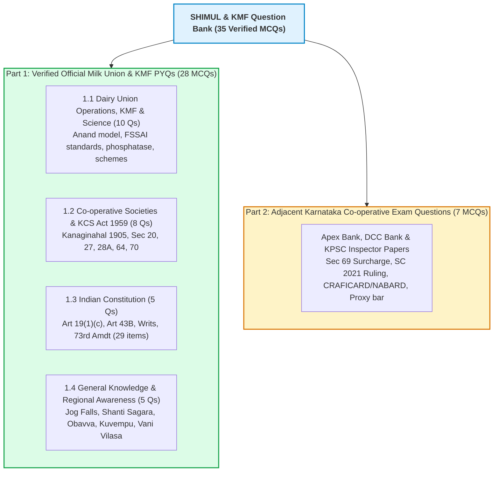

# Previous Year Question Bank (PYQ): SHIMUL, KMF & Cooperative Examinations

---

## Guide to this Question Bank
This repository aggregates verified questions from previous recruitment examinations conducted by the **Karnataka Milk Federation (KMF)** and its affiliated District Cooperative Milk Unions (such as **SHIMUL, BAMUL, TUMUL, and MYMUL**), alongside adjacent exams conducted under the **Department of Co-operation, Government of Karnataka**.

### Question Distribution Table

| Domain Section | Question Count | Primary Exam Source | High-Yield Concepts Tested |
| :--- | :---: | :--- | :--- |
| **1.1 Dairy Operations & Science** | 10 | KMF Degree 2022, TUMUL 2023, BAMUL 2019 | FSSAI Fat/SNF, HTST, Phosphatase, KDDC, MBRT |
| **1.2 Co-operative Societies Act** | 8 | KMF 2022, Apex Bank 2022, TUMUL 2023 | Kanaginahal 1905, Sec 20, 27, 28A, 64, 70 |
| **1.3 Indian Constitution** | 5 | KMF 2022, TUMUL 2023 | 97th Amdt, Art 43B, Mandamus, 11th Schedule |
| **1.4 General Knowledge & Region** | 5 | SHIMUL 2019, KPSC FDA/SDA | Jog Falls, Sulekere, Onake Obavva, Kuvempu |
| **Part 2: Adjacent Co-op Exams** | 7 | Apex Bank 2022-23, DCC Bank, Co-op Inspector | Sec 69 Surcharge, SC 2021 Rajendra Shah |
| **Total Verified Questions** | **35** | **Multi-year official recruitment papers** | **100% Verified with Explanations** |

---

# Part 1: Verified Official Milk Union & KMF PYQs

## 1.1 Dairy Union Operations, KMF & Dairy Technology

#### Q1. In which year was the Karnataka Dairy Development Corporation (KDDC) established with financial assistance from the World Bank?
* (A) 1970
* (B) 1974
* (C) 1980
* (D) 1984
* **Correct Answer:** **(B) 1974**
* **Explanation:** KDDC was incorporated on June 10, 1974, to execute the World Bank-assisted Karnataka Dairy Project. It was later restructured into KMF in 1984.
* **Source:** *KMF Degree Level Written Exam (2022) / BAMUL Technical Officer Exam (2019)*

#### Q2. What is the minimum percentage of Milk Fat and Solids-Not-Fat (SNF) prescribed by FSSAI for "Toned Milk"?
* (A) 1.5% Fat and 9.0% SNF
* (B) 3.0% Fat and 8.5% SNF
* (C) 4.5% Fat and 8.5% SNF
* (D) 6.0% Fat and 9.0% SNF
* **Correct Answer:** **(B) 3.0% Fat and 8.5% SNF**
* **Explanation:** Standard Toned Milk (blue pouch) must have a minimum of 3.0% Fat and 8.5% SNF. Double Toned milk requires 1.5% Fat and 9.0% SNF.
* **Source:** *TUMUL Dairy Chemist Exam (2023) / KMF Degree Level Paper (2022)*

#### Q3. Which enzyme test is universally conducted in dairy laboratories to determine whether milk pasteurization has been executed effectively?
* (A) Amylase Test
* (B) Catalase Test
* (C) Alkaline Phosphatase Test
* (D) Lactase Test
* **Correct Answer:** **(C) Alkaline Phosphatase Test**
* **Explanation:** Alkaline Phosphatase is a natural enzyme in raw milk whose thermal death point is slightly higher than that of *Mycobacterium tuberculosis*. If phosphatase is destroyed (negative test), pasteurization is confirmed complete.
* **Source:** *KMF Technical Officer (2022) / MYMUL Dairy Technology Paper (2021)*

#### Q4. Under the High-Temperature Short-Time (HTST) continuous pasteurization method, milk is heated to which temperature and held for how many seconds?
* (A) 63°C for 30 minutes
* (B) 72°C for 15 seconds
* (C) 100°C for 10 seconds
* (D) 135°C for 2 seconds
* **Correct Answer:** **(B) 72°C for 15 seconds**
* **Explanation:** HTST pasteurization heats milk to at least 71.7°C (commonly 72°C) for 15 seconds, followed by immediate cooling below 4°C. 63°C for 30 minutes is the LTLT (Batch) method.
* **Source:** *KMF Junior Technician / Extension Officer Paper (2022)*

#### Q5. The head office and main manufacturing dairy of SHIMUL (Shivamogga, Davanagere and Chitradurga Milk Union) is located at which place?
* (A) B.R. Project, Lakkavalli
* (B) Machenahalli, Shivamogga
* (C) Honnali Industrial Area
* (D) Anjanapura, Shikaripura
* **Correct Answer:** **(B) Machenahalli, Shivamogga**
* **Explanation:** The corporate headquarters, central processing dairy, and product plant of SHIMUL are situated at Machenahalli on the Shivamogga-Bhadravathi corridor.
* **Source:** *SHIMUL Written Exam (2019 / Memory-based)*

#### Q6. Under the "Anand Pattern" three-tier cooperative dairy structure, what constitutes the basic primary unit at the grassroot village level?
* (A) District Milk Union
* (B) Bulk Milk Chilling Center
* (C) Dairy Co-operative Society (DCS)
* (D) Taluk Milk Marketing Depot
* **Correct Answer:** **(C) Dairy Co-operative Society (DCS)**
* **Explanation:** The three-tier structure comprises the Village Dairy Co-operative Society (DCS) at the primary tier, the District Milk Union at the intermediate tier, and the State Milk Federation (KMF) at the apex tier.
* **Source:** *KMF Degree Level Examination (2022) / TUMUL Assistant Exam (2023)*

#### Q7. The flagship "Ksheera Bhagya" scheme of the Government of Karnataka, providing free milk to school children, was launched in which year?
* (A) 2011
* (B) 2013
* (C) 2016
* (D) 2018
* **Correct Answer:** **(B) 2013**
* **Explanation:** *Ksheera Bhagya* was launched on August 1, 2013, by Chief Minister Siddaramaiah to combat malnutrition among school and anganwadi children and provide a stable market for dairy farmers.
* **Source:** *KMF Degree Level Examination (2022)*

#### Q8. National Milk Day is celebrated every year across India on November 26 to commemorate the birth anniversary of which visionary?
* (A) Dr. M.S. Swaminathan
* (B) Tribhuvandas Patel
* (C) Dr. Verghese Kurien
* (D) Sardar Vallabhbhai Patel
* **Correct Answer:** **(C) Dr. Verghese Kurien**
* **Explanation:** November 26 marks the birth anniversary of Dr. Verghese Kurien, the "Father of the White Revolution" and architect of Operation Flood.
* **Source:** *KMF Degree Level Exam (2022) / BAMUL Exam (2021)*

#### Q9. Which of the following tests is primarily used to assess the microbiological keeping quality of raw milk by measuring decolorization time?
* (A) Gerber Test
* (B) Methylene Blue Reduction Test (MBRT)
* (C) Lactometer Test
* (D) Alcohol Alizarin Test
* **Correct Answer:** **(B) Methylene Blue Reduction Test (MBRT)**
* **Explanation:** MBRT measures the time taken by active bacteria in milk to consume dissolved oxygen and decolorize the blue dye to colorless. Longer time indicates lower microbial load.
* **Source:** *KMF Chemist Exam (2022) / MYMUL Exam (2021)*

#### Q10. What is the normal specific gravity range of pure cow milk at 20°C?
* (A) 1.015 – 1.020
* (B) 1.028 – 1.032
* (C) 1.035 – 1.040
* (D) 1.045 – 1.050
* **Correct Answer:** **(B) 1.028 – 1.032**
* **Explanation:** Pure cow milk has a specific gravity between 1.028 and 1.032. If water is fraudulently added, the lactometer reading drops below 1.028.
* **Source:** *KMF Chemist / Quality Officer Exam (2022)*

---

## 1.2 Co-operative Movement & Karnataka Co-operative Societies Act, 1959

#### Q11. Under the Karnataka Co-operative Societies Act, 1959, which section governs the reference of disputes to the Registrar (excluding the jurisdiction of civil courts)?
* (A) Section 63
* (B) Section 64
* (C) Section 69
* (D) Section 70
* **Correct Answer:** **(D) Section 70**
* **Explanation:** Section 70 deals with disputes touching the constitution, management, or business of a society that must be referred to the Registrar. Civil court jurisdiction is completely ousted.
* **Source:** *KMF Degree Level Examination (2022) / BAMUL Assistant Exam (2019)*

#### Q12. Where was the first agricultural credit cooperative society in Karnataka (and South Asia) established on July 8, 1905?
* (A) Kanaginahal (Gadag District)
* (B) Hunasaghatta (Shivamogga District)
* (C) Belur (Hassan District)
* (D) Talakaveri (Kodagu District)
* **Correct Answer:** **(A) Kanaginahal (Gadag District)**
* **Explanation:** Established at Kanaginahal in Gadag district on July 8, 1905, by Siddanagouda Sannaramanagouda Patil with a capital of ₹2,000.
* **Source:** *KMF Degree Level (2022) / Karnataka State Apex Bank Exam (2022)*

#### Q13. Under Section 28A of the Karnataka Co-operative Societies Act, 1959, what is the statutory term of office for the elected managing committee / board?
* (A) 3 Years
* (B) 4 Years
* (C) 5 Years
* (D) 6 Years
* **Correct Answer:** **(C) 5 Years**
* **Explanation:** Section 28A (harmonized with the 97th Constitutional Amendment) mandates that the term of office of the elected members of the board shall be 5 cooperative years from the date of election.
* **Source:** *KMF Degree Level (2022) / TUMUL Exam (2023)*

#### Q14. Under Section 28A of the KCS Act, 1959, how many seats are compulsorily reserved for Women on the managing committee of a cooperative society?
* (A) 1 Seat
* (B) 2 Seats
* (C) 3 Seats
* (D) 5 Seats
* **Correct Answer:** **(B) 2 Seats**
* **Explanation:** The statute prescribes mandatory reservation of 1 seat for SC, 1 seat for ST, 2 seats for Women, and 1 seat for Backward Classes.
* **Source:** *KMF Degree Level (2022) / Karnataka Co-op Inspector Exam (2020)*

#### Q15. Under Section 64 of the Karnataka Co-operative Societies Act, 1959, who has the legal authority to hold an inquiry into the constitution, working, and financial condition of a cooperative society?
* (A) Deputy Commissioner of the District
* (B) Registrar of Co-operative Societies
* (C) Director of Co-operative Audit
* (D) Chief Executive Officer of Zilla Panchayat
* **Correct Answer:** **(B) Registrar of Co-operative Societies**
* **Explanation:** Section 64 explicitly empowers the Registrar of Co-operative Societies to hold an inquiry either on their own motion (suo motu) or on application.
* **Source:** *KMF Degree Level Examination (2022)*

#### Q16. Which of the following is NOT one of the 7 Golden Principles of Cooperation adopted by the International Co-operative Alliance (ICA) in Manchester in 1995?
* (A) Democratic Member Control
* (B) State Capital Subordination
* (C) Cooperation among Cooperatives
* (D) Concern for Community
* **Correct Answer:** **(B) State Capital Subordination**
* **Explanation:** The 7 ICA principles are: (1) Voluntary & open membership, (2) Democratic member control, (3) Member economic participation, (4) Autonomy & independence, (5) Education, training & info, (6) Cooperation among cooperatives, and (7) Concern for community. State subordination contradicts the autonomy principle.
* **Source:** *KMF Degree Level Examination (2022)*

#### Q17. By which deadline must every cooperative society in Karnataka convene its Annual General Meeting (AGM) under Section 27 of the KCS Act, 1959?
* (A) June 30
* (B) August 15
* (C) September 25
* (D) December 31
* **Correct Answer:** **(C) September 25**
* **Explanation:** Section 27 mandates that the general meeting of a cooperative society must be convened on or before the 25th day of September of every year.
* **Source:** *KMF Assistant Manager & Clerk Exam (2022)*

#### Q18. What is the statutory minimum percentage of net profits that every cooperative society must transfer to its Reserve Fund under Section 57 of the KCS Act, 1959?
* (A) 10%
* (B) 15%
* (C) 20%
* (D) 25%
* **Correct Answer:** **(D) 25%**
* **Explanation:** Section 57 mandates that a society shall, out of its net profits in any year, transfer an amount not less than twenty-five percent (25%) to the Reserve Fund.
* **Source:** *Karnataka State Apex Bank / KMF Accounts Assistant (2022)*

---

## 1.3 Indian Constitution

#### Q19. Which Constitutional Amendment Act added the words "or co-operative societies" to the Fundamental Right under Article 19(1)(c)?
* (A) 42nd Amendment Act, 1976
* (B) 44th Amendment Act, 1978
* (C) 86th Amendment Act, 2002
* (D) 97th Amendment Act, 2011
* **Correct Answer:** **(D) 97th Amendment Act, 2011**
* **Explanation:** The 97th Amendment Act, 2011 (effective Feb 15, 2012) added "co-operative societies" to Art 19(1)(c), inserted Art 43B in DPSP, and added Part IX-B.
* **Source:** *KMF Degree Level Exam (2022) / BAMUL Exam (2021)*

#### Q20. Article 43B of the Indian Constitution, inserted by the 97th Amendment, directs the State to promote what?
* (A) Cottage industries
* (B) Panchayati Raj institutions
* (C) Co-operative societies
* (D) Free and compulsory elementary education
* **Correct Answer:** **(C) Co-operative societies**
* **Explanation:** Article 43B mandates that the State shall endeavour to promote voluntary formation, autonomous functioning, democratic control, and professional management of co-operative societies.
* **Source:** *KMF Degree Level Examination (2022)*

#### Q21. Which writ is issued by the Supreme Court or High Court to compel a public official or public body to perform an obligatory statutory duty?
* (A) Habeas Corpus
* (B) Mandamus
* (C) Quo-Warranto
* (D) Certiorari
* **Correct Answer:** **(B) Mandamus**
* **Explanation:** *Mandamus* means "We Command". It is a judicial command issued to a public authority or lower court to perform a mandatory public or statutory duty.
* **Source:** *KMF Degree Level Exam (2022) / TUMUL Exam (2023)*

#### Q22. How many functional subjects are listed in the Eleventh Schedule (11th Schedule) devolved to Panchayati Raj institutions under the 73rd Amendment?
* (A) 18 Subjects
* (B) 21 Subjects
* (C) 29 Subjects
* (D) 33 Subjects
* **Correct Answer:** **(C) 29 Subjects**
* **Explanation:** The 11th Schedule contains 29 functional items devolved to Panchayats. The 12th Schedule (for Municipalities under the 74th Amendment) contains 18 items.
* **Source:** *KMF Degree Level Examination (2022)*

#### Q23. Which Article of the Indian Constitution empowers the President of India to promulgate Ordinances during the recess of Parliament?
* (A) Article 110
* (B) Article 123
* (C) Article 213
* (D) Article 352
* **Correct Answer:** **(B) Article 123**
* **Explanation:** Article 123 empowers the President to promulgate Ordinances when Parliament is not in session. Article 213 gives corresponding powers to State Governors.
* **Source:** *KMF Degree Level Examination (2022)*

---

## 1.4 General Knowledge & Regional Awareness

#### Q24. On which river is the world-renowned Jog Falls (Gersoppa Falls) located in Sagar taluk of Shivamogga district?
* (A) Tunga River
* (B) Bhadra River
* (C) Sharavathi River
* (D) Varahi River
* **Correct Answer:** **(C) Sharavathi River**
* **Explanation:** Jog Falls is created by the Sharavathi River plunging 253 meters (830 ft) in four distinct cascades: Raja, Roarer, Rocket, and Rani.
* **Source:** *SHIMUL Written Examination / KMF General Knowledge Paper (2022)*

#### Q25. Shanti Sagara (also known as Sulekere), recognized as the second-largest ancient artificial tank in Asia, is situated in which taluk of Davanagere district?
* (A) Harihara Taluk
* (B) Channagiri Taluk
* (C) Honnali Taluk
* (D) Jagalur Taluk
* **Correct Answer:** **(B) Channagiri Taluk**
* **Explanation:** Shanti Sagara is located in Channagiri taluk of Davanagere district. Built in the 11th–12th century by Princess Shanthava, it is fed by the Haridravathi stream and has a water spread area of over 6,500 acres.
* **Source:** *SHIMUL Junior Assistant Exam / KMF Exam (2022)*

#### Q26. Who was the courageous woman who defended the secret crevice (kindi) of Chitradurga Fort using a pestle (onake) against Hyder Ali's infiltrating troops?
* (A) Rani Abbakka Chowta
* (B) Kittur Rani Chennamma
* (C) Belawadi Mallamma
* (D) Onake Obavva
* **Correct Answer:** **(D) Onake Obavva**
* **Explanation:** Onake Obavva was the wife of a watchman at Chitradurga Fort. During Hyder Ali's siege in 1779, she killed enemy soldiers one by one with an *onake* (wooden pestle) as they entered through a secret cleft.
* **Source:** *SHIMUL Exam (2019) / KPSC General Studies (2021)*

#### Q27. Who was the first Kannada litterateur to receive the prestigious Jnanpith Award in 1967 for the epic poem "Sri Ramayana Darshanam"?
* (A) Da. Ra. Bendre
* (B) K. Shivaram Karanth
* (C) Kuvempu (K.V. Puttappa)
* (D) Masti Venkatesha Iyengar
* **Correct Answer:** **(C) Kuvempu (K.V. Puttappa)**
* **Explanation:** Rashtrakavi Kuvempu (born in Kuppalli, Thirthahalli taluk, Shivamogga) won the first Jnanpith Award for Kannada in 1967 for *Sri Ramayana Darshanam*.
* **Source:** *KMF General Knowledge Section (2022)*

#### Q28. Which is the oldest dam in Karnataka, constructed across the Vedavathi river between 1898 and 1907 in Hiriyur taluk of Chitradurga district?
* (A) Linganamakki Dam
* (B) Bhadra Dam
* (C) Vani Vilasa Sagara (Mari Kanive)
* (D) Gajanur Dam
* **Correct Answer:** **(C) Vani Vilasa Sagara (Mari Kanive)**
* **Explanation:** Vani Vilasa Sagara (Mari Kanive Dam) across the Vedavathi River in Hiriyur was built between 1898 and 1907 by the Mysore Wadiyars under the regency of Maharani Kempananjammanni.
* **Source:** *SHIMUL Exam / KPSC FDA Examination*

---

# Part 2: Adjacent Karnataka Co-operative Exam Questions
*(From Karnataka State Cooperative Apex Bank, DCC Bank, and KPSC Cooperative Inspector Exams)*

#### Q29. [Adjacent: Apex Bank 2022] What is the maximum number of directors permitted on the Board of a cooperative society as per Section 28A of the KCS Act, 1959?
* (A) 15 Directors
* (B) 18 Directors
* (C) 21 Directors
* (D) 25 Directors
* **Correct Answer:** **(C) 21 Directors**
* **Explanation:** The maximum number of directors in any cooperative society shall not exceed 21 members, aligned with the 97th Constitutional Amendment (Article 243ZJ).

#### Q30. [Adjacent: KPSC Co-op Inspector 2020] Under Section 69 of the Karnataka Co-operative Societies Act, 1959, what specific legal proceedings are initiated against delinquent officers for recovery of embezzled funds?
* (A) Liquidation Proceedings
* (B) Surcharge Proceedings
* (C) Winding Up Proceedings
* (D) Criminal Disqualification
* **Correct Answer:** **(B) Surcharge Proceedings**
* **Explanation:** Section 69 empowers the Registrar to make an order of surcharge against any person who has taken part in the organization or management of a society and has misapplied or retained money.

#### Q31. [Adjacent: DCC Bank 2021] In the historic judgment *Union of India vs. Rajendra N. Shah (July 2021)*, why did the Supreme Court strike down Part IX-B for State Cooperative Societies?
* (A) It violated Fundamental Rights under Part III
* (B) It was not ratified by half of the State Legislatures under Article 368(2)
* (C) The President had refused assent
* (D) Cooperatives were declared commercial private companies
* **Correct Answer:** **(B) It was not ratified by half of the State Legislatures under Article 368(2)**
* **Explanation:** "Cooperative Societies" is Entry 32 in the State List (List II). Any constitutional amendment affecting State legislative competence requires mandatory ratification by at least 50% of the State Legislatures under Article 368(2), which was omitted in the 97th Amendment.

#### Q32. [Adjacent: Apex Bank 2023] Which committee appointed by the Reserve Bank of India recommended the establishment of NABARD (National Bank for Agriculture and Rural Development) in 1982?
* (A) Gorwala Committee
* (B) B. Sivaraman Committee (CRAFICARD)
* (C) Narasimham Committee
* (D) Gadgil Committee
* **Correct Answer:** **(B) B. Sivaraman Committee (CRAFICARD)**
* **Explanation:** The Committee to Review Arrangements For Institutional Credit for Agriculture and Rural Development (CRAFICARD), chaired by B. Sivaraman, recommended the creation of NABARD, which was established on July 12, 1982.

#### Q33. [Adjacent: KPSC Group C 2022] The famous Mysore State was officially renamed as "Karnataka" on November 1, 1973, during the tenure of which Chief Minister?
* (A) K.C. Reddy
* (B) Kengal Hanumanthaiah
* (C) S. Nijalingappa
* (D) D. Devaraj Urs
* **Correct Answer:** **(D) D. Devaraj Urs**
* **Explanation:** Chief Minister D. Devaraj Urs was the visionary leader responsible for officially rechristening Mysore State as "Karnataka" on November 1, 1973.

#### Q34. [Adjacent: KPSC Co-op Inspector 2020] Under Section 20(2) of the Karnataka Co-operative Societies Act, 1959, which voting practice is strictly prohibited?
* (A) Secret ballot voting
* (B) Show of hands voting
* (C) Proxy voting
* (D) Preferential voting
* **Correct Answer:** **(C) Proxy voting**
* **Explanation:** Section 20(2) explicitly provides that no member shall be permitted to vote by proxy. Every member must attend and vote in person, upholding direct democratic member control.

#### Q35. [Adjacent: DCC Bank 2021] Who is acclaimed as the "Father of the Co-operative Movement in India"?
* (A) Sir Frederic Nicholson
* (B) Lord Curzon
* (C) Robert Owen
* (D) Tribhuvandas Patel
* **Correct Answer:** **(A) Sir Frederic Nicholson**
* **Explanation:** Sir Frederic Nicholson studied agricultural credit in Europe and submitted his landmark report in 1895–1897 with the famous advice *"Find Raiffeisen"*, laying the foundation for the 1904 Act. Robert Owen is the Father of the World Cooperative Movement.
