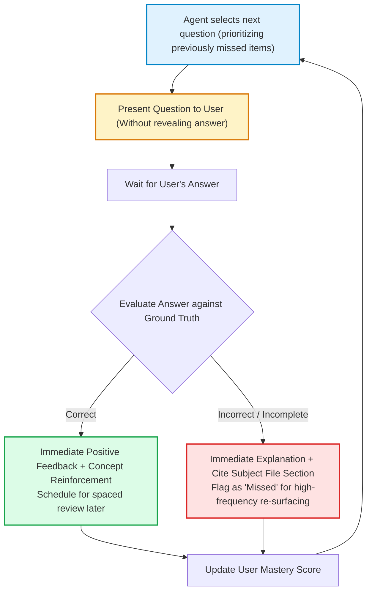

# Interactive Flashcard & Quiz Bank: SHIMUL Exam

---

> **Agent instructions:** Use this file to quiz the user one question at a time, track right/wrong, and re-surface missed questions more often (spaced repetition). Ask the question, wait for the user's answer, provide immediate feedback with the explanation, and record their mastery status.

### Flashcard & Quiz Distribution Table

| Section Focus | Flashcards | MCQs with Distractors | Total Questions | High-Yield Coverage |
| :--- | :---: | :---: | :---: | :--- |
| **Section 1: Dairy Union & KMF** | 8 | 2 | 10 | 3-Tier Anand, KDDC/KMF, FSSAI Fat/SNF, HTST/LTLT, Tests |
| **Section 2: Co-operative Societies** | 8 | 2 | 10 | Kanaginahal 1905, Sec 20, 27, 28A, 64, 70, 97th Amdt |
| **Section 3: Indian Constitution** | 6 | 2 | 8 | Preamble, Art 19(1)(c), Art 32 & Writs, Art 43B, 73rd Amdt |
| **Section 4: General Knowledge** | 7 | 2 | 9 | Jog Falls, Sulekere, Obavva, Vani Vilasa, Jnanpith, Schemes |
| **Total Interactive Question Bank** | **29** | **8** | **37** | **Flashcard Q&A + Standard 4-Option MCQs** |

---

## Section 1: Dairy Union Functioning, KMF & Dairy Science

### Flashcard Q&A Pairs

#### Q-DU-01
* **Subject:** Dairy Union & KMF
* **Difficulty:** Easy
* **Origin:** PYQ-Derived
* **Question:** What is the three-tier organizational hierarchy of the dairy cooperative movement in Karnataka?
* **Answer:**
  1. **Village Level:** Primary Dairy Co-operative Society (DCS / ಗ್ರಾಮ ಹಾಲು ಉತ್ಪಾದಕರ ಸಹಕಾರ ಸಂಘ).
  2. **District Level:** District Co-operative Milk Producers' Societies Union (e.g., SHIMUL).
  3. **State Level:** Karnataka Milk Federation (KMF / ಕರ್ನಾಟಕ ಹಾಲು ಮಹಾಮಂಡಳ - Apex Body).
* **Key Concept:** Anand Pattern (AMUL model) where farmers own the value chain.

---

#### Q-DU-02
* **Subject:** Dairy Union & KMF
* **Difficulty:** Easy
* **Origin:** PYQ-Derived
* **Question:** When was KDDC established, when was the brand "Nandini" launched, and when was KMF incorporated?
* **Answer:**
  * **KDDC (Karnataka Dairy Development Corporation):** Established on **June 10, 1974** with World Bank aid.
  * **Brand "Nandini":** Introduced in **1983**.
  * **KMF (Karnataka Milk Federation):** KDDC restructured into KMF in **1984**.
* **Key Concept:** Chronology of dairy development in Karnataka.

---

#### Q-DU-03
* **Subject:** Dairy Union & KMF
* **Difficulty:** Medium
* **Origin:** Subject-Concept
* **Question:** What are the minimum FSSAI standards of Fat% and SNF% for Toned Milk, Double Toned Milk, and Standardised Milk?
* **Answer:**
  * **Double Toned Milk:** Minimum **1.5% Fat** and **9.0% SNF**.
  * **Toned Milk:** Minimum **3.0% Fat** and **8.5% SNF**.
  * **Standardised Milk:** Minimum **4.5% Fat** and **8.5% SNF**.
  * **Full Cream Milk:** Minimum **6.0% Fat** and **9.0% SNF**.
* **Memory Hook:** "Double Tea Standards Fill" -> 1.5% jumps: 1.5% → 3.0% → 4.5% → 6.0%.

---

#### Q-DU-04
* **Subject:** Dairy Union & KMF
* **Difficulty:** Medium
* **Origin:** PYQ-Derived
* **Question:** What are the temperature and time combinations for LTLT, HTST, and UHT pasteurization/sterilization?
* **Answer:**
  * **LTLT (Low Temperature Long Time / Batch):** Heated to **63°C for 30 minutes**.
  * **HTST (High Temperature Short Time / Continuous):** Heated to **72°C (71.7°C) for 15 seconds**, then chilled below 4°C.
  * **UHT (Ultra High Temperature / Aseptic):** Heated to **135°C – 150°C for 1 to 2 seconds** (e.g., Nandini GoodLife, shelf life 90–180 days).
* **Key Concept:** Thermal preservation destroying pathogens (*Mycobacterium tuberculosis* and *Coxiella burnetii*).

---

#### Q-DU-05
* **Subject:** Dairy Union & KMF
* **Difficulty:** Medium
* **Origin:** PYQ-Derived
* **Question:** Which enzyme test confirms complete pasteurization of milk, and what is the scientific rationale behind it?
* **Answer:**
  * **Alkaline Phosphatase Test.**
  * **Rationale:** Alkaline phosphatase is a native milk enzyme whose thermal destruction temperature is slightly higher than pathogenic bacteria (*Mycobacterium tuberculosis*). If phosphatase is completely inactivated (negative test), all pathogenic bacteria are guaranteed destroyed.
* **Key Concept:** Gold-standard quality assurance in dairy processing.

---

#### Q-DU-06
* **Subject:** Dairy Union & KMF
* **Difficulty:** Hard
* **Origin:** Subject-Concept
* **Question:** Explain the purpose and hydraulic mechanism of Homogenization in milk processing.
* **Answer:**
  * **Purpose:** To break down large milk fat globules (4–10 microns) into microscopic droplets (< 2 microns) so that fat remains permanently dispersed without rising to form a cream layer (*creaming*). It enhances viscosity, whiteness, and mouthfeel.
  * **Mechanism:** Milk is pumped under high hydraulic pressure (**2,000 to 2,500 psi / 140–175 bar**) through a tiny orifice at high velocity.

---

#### Q-DU-07
* **Subject:** Dairy Union & KMF
* **Difficulty:** Easy
* **Origin:** PYQ-Derived
* **Question:** What are the operational boundaries and headquarters of SHIMUL?
* **Answer:**
  * **Operational Coverage:** 3 Districts — **Shivamogga, Davanagere, and Chitradurga**.
  * **Headquarters & Mother Dairy:** **Machenahalli**, Nidige Post, Shivamogga – 577222.
  * **Operations Commenced:** March 16, 1988 (Assets transferred Aug 1, 1991, under Operation Flood III).

---

#### Q-DU-08
* **Subject:** Dairy Union & KMF
* **Difficulty:** Medium
* **Origin:** Subject-Concept
* **Question:** What is the daily milk quota and beneficiary group under the "Ksheera Bhagya" scheme?
* **Answer:**
  * **Quota:** **150 ml of hot boiled milk per child per day, 5 days a week**.
  * **Beneficiaries:** Children studying in **1st to 10th standard** in Government and Government-aided schools, and children aged **6 months to 6 years** in Anganwadis across Karnataka.
  * **Launched:** August 1, 2013, by CM Siddaramaiah. Disbursed via Nandini Skimmed Milk Powder (SMP).

---

### Multiple Choice Questions (with Distractors)

#### MCQ-DU-01
* **Subject:** Dairy Union & KMF | **Difficulty:** Easy | **Origin:** PYQ-Derived
* **Question:** Who is hailed as the "Father of the White Revolution" in India?
  * (A) M.S. Swaminathan
  * (B) Tribhuvandas Patel
  * (C) Dr. Verghese Kurien
  * (D) Sir Frederic Nicholson
* **Correct Answer:** **(C) Dr. Verghese Kurien**
* **Distractor Rationale:** M.S. Swaminathan is the Father of the Green Revolution; Tribhuvandas Patel was the founder-chairman of Amul; Frederic Nicholson is the Father of Indian Cooperation.

#### MCQ-DU-02
* **Subject:** Dairy Union & KMF | **Difficulty:** Medium | **Origin:** Subject-Concept
* **Question:** Which instrument is used in primary dairy cooperative societies to measure the specific gravity of milk to detect water adulteration?
  * (A) Butyrometer
  * (B) Lactometer
  * (C) Refractometer
  * (D) Viscometer
* **Correct Answer:** **(B) Lactometer**
* **Distractor Rationale:** Butyrometer is used with Gerber acid to measure Fat%; Refractometer measures total soluble solids / refractive index. Pure cow milk lactometer reading is 1.028–1.032.

---

## Section 2: Co-operative Societies & Karnataka Co-operative Societies Act, 1959

### Flashcard Q&A Pairs

#### Q-CS-01
* **Subject:** Co-operative Societies
* **Difficulty:** Easy
* **Origin:** PYQ-Derived
* **Question:** Where and when was the first agricultural credit cooperative society established in Karnataka and India, and who founded it?
* **Answer:**
  * **Location:** **Kanaginahal village, Gadag district** (Bombay Presidency).
  * **Date:** **July 8, 1905** (under the Cooperative Credit Societies Act of 1904).
  * **Founder:** **Siddanagouda Sannaramanagouda Patil** (1843–1933), known as the *"Father of the Co-operative Movement in Karnataka"*.
  * **Initial Capital:** ₹2,000.

---

#### Q-CS-02
* **Subject:** Co-operative Societies
* **Difficulty:** Medium
* **Origin:** PYQ-Derived
* **Question:** What is the statutory term of office for the managing committee/board of a cooperative society in Karnataka under Section 28A of the KCS Act, 1959?
* **Answer:**
  * Exactly **5 cooperative years** from the date of election.
  * Aligned with the 97th Constitutional Amendment Act, 2011.

---

#### Q-CS-03
* **Subject:** Co-operative Societies
* **Difficulty:** Hard
* **Origin:** Subject-Concept
* **Question:** Detail the mandatory seat reservations on the managing committee of a cooperative society in Karnataka under Section 28A.
* **Answer:**
  * **1 Seat:** Scheduled Castes (SC)
  * **1 Seat:** Scheduled Tribes (ST)
  * **2 Seats:** Women
  * **1 Seat:** Backward Classes
  * **Total Reserved Seats:** Minimum **5 seats** reserved on the committee.
  * **Maximum Total Directors:** Cannot exceed **21 directors**.

---

#### Q-CS-04
* **Subject:** Co-operative Societies
* **Difficulty:** Medium
* **Origin:** PYQ-Derived
* **Question:** Which section of the KCS Act, 1959, governs "Disputes" referable to the Registrar, and what is its effect on Civil Courts?
* **Answer:**
  * **Section 70.**
  * **Effect:** Any dispute touching the constitution, management, or business of a cooperative society must be referred strictly to the Registrar of Co-operative Societies. **Civil courts have NO jurisdiction** to entertain any suit regarding these matters.

---

#### Q-CS-05
* **Subject:** Co-operative Societies
* **Difficulty:** Medium
* **Origin:** PYQ-Derived
* **Question:** Match Sections 63, 64, 65, and 69 of the KCS Act, 1959, to their subject matter.
* **Answer:**
  * **Section 63:** **Audit** (conducted by Director of Cooperative Audit).
  * **Section 64:** **Inquiry** by the Registrar (suo motu or on application).
  * **Section 65:** **Inspection** of books and records.
  * **Section 69:** **Surcharge** proceedings (recovering misapplied or embezzled funds from past/present officers).
* **Memory Hook:** "A-I-I-S" (Audit 63, Inquiry 64, Inspection 65, Surcharge 69).

---

#### Q-CS-06
* **Subject:** Co-operative Societies
* **Difficulty:** Easy
* **Origin:** PYQ-Derived
* **Question:** What is the universal democratic voting principle enshrined in Section 20 of the KCS Act, 1959?
* **Answer:**
  * **"One Member, One Vote"** — each member has strictly one vote regardless of how many shares they hold.
  * **Proxy voting is strictly barred** under Section 20(2); every member must cast their vote in person.

---

#### Q-CS-07
* **Subject:** Co-operative Societies
* **Difficulty:** Hard
* **Origin:** Subject-Concept
* **Question:** What was the historic verdict of the Supreme Court in *Union of India vs. Rajendra N. Shah (July 2021)* regarding the 97th Constitutional Amendment?
* **Answer:**
  * The Supreme Court struck down **Part IX-B** of the Constitution **insofar as it applies to State Cooperative Societies** because it was not ratified by 50% of State Legislatures under Article 368(2) (Cooperation being State List Entry 32).
  * The Court **upheld Part IX-B for Multi-State Co-operative Societies (MSCS)**.
  * Fundamental Right Article 19(1)(c) and DPSP Article 43B remained 100% valid and untouched.

---

#### Q-CS-08
* **Subject:** Co-operative Societies
* **Difficulty:** Easy
* **Origin:** Subject-Concept
* **Question:** When was the Union Ministry of Cooperation formed, who is the first Union Minister, and what is its official motto?
* **Answer:**
  * **Formed:** **July 6, 2021**.
  * **First Minister:** **Shri Amit Shah**.
  * **Motto:** *"Sahakar Se Samriddhi"* (Prosperity through Cooperation).

---

### Multiple Choice Questions (with Distractors)

#### MCQ-CS-01
* **Subject:** Co-operative Societies | **Difficulty:** Medium | **Origin:** PYQ-Derived
* **Question:** What is the statutory deadline by which a cooperative society must conduct its Annual General Meeting (AGM) under Section 27 of the KCS Act, 1959?
  * (A) June 30
  * (B) August 15
  * (C) September 25
  * (D) October 31
* **Correct Answer:** **(C) September 25**
* **Distractor Rationale:** June 30 is the close of the cooperative audit preparation quarter; September 25 is the statutory cutoff under Section 27.

#### MCQ-CS-02
* **Subject:** Co-operative Societies | **Difficulty:** Easy | **Origin:** PYQ-Derived
* **Question:** When is "All India Co-operative Week" celebrated nationwide every year?
  * (A) October 2 to 8
  * (B) November 14 to 20
  * (C) December 1 to 7
  * (D) January 26 to February 1
* **Correct Answer:** **(B) November 14 to 20**
* **Distractor Rationale:** November 14–20 starts on Pandit Nehru's birthday and is celebrated as the national Cooperative Week.

---

## Section 3: Indian Constitution

### Flashcard Q&A Pairs

#### Q-IC-01
* **Subject:** Indian Constitution
* **Difficulty:** Easy
* **Origin:** PYQ-Derived
* **Question:** Which three words were added to the Preamble of the Indian Constitution by the 42nd Amendment Act in 1976?
* **Answer:**
  * **"SOCIALIST"**, **"SECULAR"**, and **"AND INTEGRITY"**.
  * The Preamble has been amended only once in history.

---

#### Q-IC-02
* **Subject:** Indian Constitution
* **Difficulty:** Medium
* **Origin:** PYQ-Derived
* **Question:** Which Constitutional Amendment gave citizens the Fundamental Right to form cooperative societies under Article 19(1)(c)?
* **Answer:**
  * The **97th Constitutional Amendment Act, 2011** (effective February 15, 2012).

---

#### Q-IC-03
* **Subject:** Indian Constitution
* **Difficulty:** Easy
* **Origin:** PYQ-Derived
* **Question:** Why did Dr. B.R. Ambedkar describe Article 32 as the "Heart and Soul of the Constitution"?
* **Answer:**
  * Because without Article 32 (Right to Constitutional Remedies), all other Fundamental Rights are unenforceable words on paper. It empowers citizens to directly approach the Supreme Court to issue writs to enforce their fundamental freedoms.

---

#### Q-IC-04
* **Subject:** Indian Constitution
* **Difficulty:** Medium
* **Origin:** PYQ-Derived
* **Question:** What is the difference between the writs of *Prohibition* and *Certiorari*?
* **Answer:**
  * **Prohibition:** Issued to a lower court/tribunal while proceedings are **pending**, forbidding it from exceeding its legal jurisdiction (preventive remedy).
  * **Certiorari:** Issued **after** an order has been illegally passed by a lower court/tribunal without jurisdiction, to quash the illegal order (curative remedy).

---

#### Q-IC-05
* **Subject:** Indian Constitution
* **Difficulty:** Medium
* **Origin:** Subject-Concept
* **Question:** What are the key features introduced by the 73rd Constitutional Amendment Act, 1992, for Panchayati Raj?
* **Answer:**
  * Inserted **Part IX** (Articles 243 to 243-O).
  * Added the **Eleventh Schedule (11th Schedule)** with **29 functional subjects**.
  * Mandated a 3-tier Panchayati Raj system (Gram, Taluk, Zilla).
  * Mandated minimum 1/3rd (33%) reservation for women (Karnataka provides 50%).
  * Created independent State Election Commission and State Finance Commission.

---

#### Q-IC-06
* **Subject:** Indian Constitution
* **Difficulty:** Easy
* **Origin:** PYQ-Derived
* **Question:** What are the minimum qualifying ages for President of India, Member of Legislative Assembly (MLA), and Member of Legislative Council (MLC)?
* **Answer:**
  * **President of India:** **35 Years**
  * **MLA (Legislative Assembly) / MP (Lok Sabha):** **25 Years**
  * **MLC (Legislative Council) / MP (Rajya Sabha):** **30 Years**

---

### Multiple Choice Questions (with Distractors)

#### MCQ-IC-01
* **Subject:** Indian Constitution | **Difficulty:** Easy | **Origin:** PYQ-Derived
* **Question:** Which Article of the Indian Constitution directs the State to organise village panchayats as units of self-government?
  * (A) Article 39A
  * (B) Article 40
  * (C) Article 43B
  * (D) Article 44
* **Correct Answer:** **(B) Article 40**
* **Distractor Rationale:** Article 39A is free legal aid; Article 43B is cooperatives; Article 44 is Uniform Civil Code.

#### MCQ-IC-02
* **Subject:** Indian Constitution | **Difficulty:** Medium | **Origin:** PYQ-Derived
* **Question:** Under which Article can an individual approach the High Court of Karnataka for the enforcement of Fundamental Rights and other legal rights?
  * (A) Article 32
  * (B) Article 136
  * (C) Article 226
  * (D) Article 300A
* **Correct Answer:** **(C) Article 226**
* **Distractor Rationale:** Article 32 is Supreme Court writ jurisdiction; Article 136 is Special Leave Petition; Article 226 is High Court writ jurisdiction.

---

## Section 4: General Knowledge & Regional Focus (SHIMUL Footprint)

### Flashcard Q&A Pairs

#### Q-GK-01
* **Subject:** General Knowledge
* **Difficulty:** Easy
* **Origin:** PYQ-Derived
* **Question:** On which river is Jog Falls located, what is its drop height, and what are the names of its four cascades?
* **Answer:**
  * **River:** **Sharavathi River** (Sagar taluk, Shivamogga).
  * **Drop Height:** **253 meters (830 feet)**.
  * **Four Cascades:** **Raja, Roarer, Rocket, and Rani**.

---

#### Q-GK-02
* **Subject:** General Knowledge
* **Difficulty:** Medium
* **Origin:** PYQ-Derived
* **Question:** Where do the Tunga and Bhadra rivers merge, and what river do they form?
* **Answer:**
  * They merge at **Koodli** (near Shivamogga city).
  * They unite to form the **Tungabhadra River**, which flows eastwards into the Krishna River.

---

#### Q-GK-03
* **Subject:** General Knowledge
* **Difficulty:** Medium
* **Origin:** PYQ-Derived
* **Question:** Why is Davanagere called the "Manchester of Karnataka", and what is Shanti Sagara?
* **Answer:**
  * **Manchester of Karnataka:** Due to its historical concentration of cotton spinning, ginning, and textile mills.
  * **Shanti Sagara (Sulekere):** Located in Channagiri taluk, Davanagere. Built in the 11th–12th century by Princess Shanthava; recognized as the **second-largest ancient artificial tank in Asia**.

---

#### Q-GK-04
* **Subject:** General Knowledge
* **Difficulty:** Easy
* **Origin:** PYQ-Derived
* **Question:** Who was Onake Obavva, and what is her historical association with Chitradurga Fort?
* **Answer:**
  * Onake Obavva was the wife of watchman Kahale Mudda Hanuma at Chitradurga Fort.
  * In 1779, during the siege by Hyder Ali, she guarded a secret crevice (*kindi*) and killed invading enemy soldiers one by one using a wooden pestle (**Onake**). The cleft is immortalized as *"Onake Obavvana Kindi"*.

---

#### Q-GK-05
* **Subject:** General Knowledge
* **Difficulty:** Medium
* **Origin:** PYQ-Derived
* **Question:** Which is the oldest dam in Karnataka, across which river is it built, and in which district is it located?
* **Answer:**
  * **Dam:** **Vani Vilasa Sagara (Mari Kanive Dam)**.
  * **River:** **Vedavathi River**.
  * **District:** **Hiriyur taluk, Chitradurga district**.
  * **Period:** Built between 1898 and 1907 by the Mysore Wadiyars.

---

#### Q-GK-06
* **Subject:** General Knowledge
* **Difficulty:** Easy
* **Origin:** Subject-Concept
* **Question:** List the official State Animal, State Bird, State Tree, State Flower, and State Butterfly of Karnataka.
* **Answer:**
  * **State Animal:** Asian Elephant (*Elephas maximus*)
  * **State Bird:** Indian Roller / Neelkanth (*Coracias benghalensis*)
  * **State Tree:** Sandalwood (*Santalum album*)
  * **State Flower:** Lotus (*Nelumbo nucifera*)
  * **State Butterfly:** Southern Birdwing (*Troides minos*)

---

#### Q-GK-07
* **Subject:** General Knowledge
* **Difficulty:** Hard
* **Origin:** Subject-Concept
* **Question:** Name the 8 Jnanpith Award winners from Karnataka in chronological order.
* **Answer:**
  1. **Kuvempu** (1967 - *Sri Ramayana Darshanam*)
  2. **Da. Ra. Bendre** (1973 - *Naku Tanti*)
  3. **K. Shivaram Karanth** (1977 - *Mookajjiya Kanasugalu*)
  4. **Masti Venkatesha Iyengar** (1983 - *Chikkaveera Rajendra*)
  5. **V. K. Gokak** (1990 - *Bharatha Sindhu Rashmi*)
  6. **U. R. Ananthamurthy** (1994 - Lifetime contribution)
  7. **Girish Karnad** (1998 - Plays and drama)
  8. **Chandrashekhara Kambara** (2010 - Lifetime contribution)
* **Memory Hook:** "K-B-K-M-G-A-K-K".

---

### Multiple Choice Questions (with Distractors)

#### MCQ-GK-01
* **Subject:** General Knowledge | **Difficulty:** Easy | **Origin:** Subject-Concept
* **Question:** Which welfare scheme in Karnataka provides ₹2,000 per month directly into the bank accounts of women heads of households?
  * (A) Gruha Jyothi
  * (B) Gruha Lakshmi
  * (C) Shakti Scheme
  * (D) Yuva Nidhi
* **Correct Answer:** **(B) Gruha Lakshmi**
* **Distractor Rationale:** Gruha Jyothi is 200 units free power; Shakti is free bus travel; Yuva Nidhi is youth unemployment allowance.

#### MCQ-GK-02
* **Subject:** General Knowledge | **Difficulty:** Easy | **Origin:** PYQ-Derived
* **Question:** In which taluk of Shivamogga is the famous Gudavi Bird Sanctuary located?
  * (A) Sagar Taluk
  * (B) Soraba Taluk
  * (C) Thirthahalli Taluk
  * (D) Bhadravathi Taluk
* **Correct Answer:** **(B) Soraba Taluk**
* **Distractor Rationale:** Sagar has Jog Falls; Thirthahalli has Kuppalli/Kavishaila; Soraba hosts the Gudavi Bird Sanctuary.
