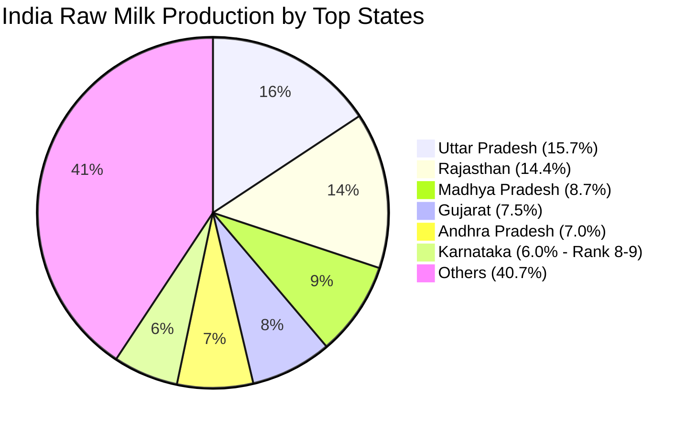
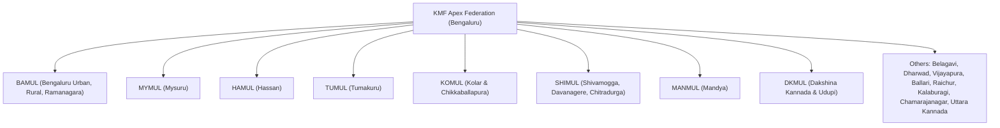
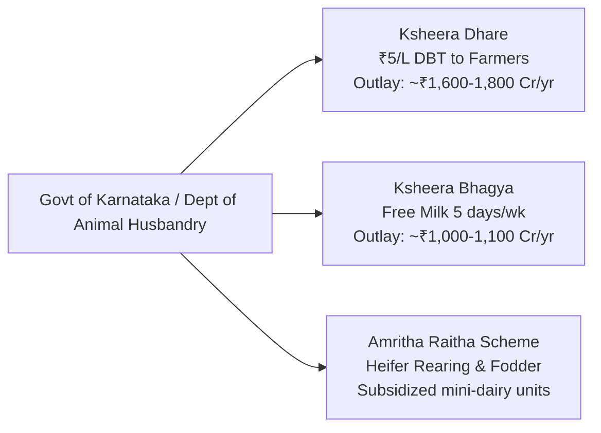

# Dairy Data, Quantitative Statistics & Financial Reference

> [!ABSTRACT] 30-Second Rapid Recall Cheat Sheet
> - **India Milk Production:** ~230.58 Million Tonnes (MT); **#1 in the world** (24.6% global share).
> - **Per Capita Availability (India):** ~459 grams/day (World average: ~322 g/day).
> - **Karnataka Milk Production Rank:** **8th–9th nationally** (~13.90 MT).
> - **Karnataka Cooperative Procurement Rank:** **#2 in India** (after Gujarat/Amul); **#1 in South India**.
> - **KMF Group Annual Turnover:** **₹21,330 Crore** (2023–24 record).
> - **Daily Milk Procurement (KMF):** 82.9 LLPD (2023–24 avg) $\to$ 90–95 LLPD (2024–25) $\to$ Peak summer 2026: **1.2–1.3 Crore Litres/day** (120–130 LLPD).
> - **Network Structure:** **16 District Milk Unions**, ~15,000+ operational DCS, **26.8 Lakh dairy farmer members** (~4,000+ Women Dairy Cooperative Societies).
> - **Farmer Payout:** Base price ~₹34.50/L + State Govt Ksheera Dhare subsidy ₹5.00/L = **~₹39.50 – ₹40.00/L total**.
> - **SHIMUL Key Metrics:** 3 Districts (Shivamogga, Davanagere, Chitradurga); ~1,000+ DCS; ~1.7 Lakh members; ~6.5–7.5+ LLPD procurement; 4 LLPD Mega Dairy (Machenahalli) + 30 MT/day powder plant.

---

## 1. National Dairy Landscape & State Rankings

| Metric | National Figure | Karnataka Status |
| :--- | :--- | :--- |
| **Total Annual Milk Production** | ~230.58 Million Tonnes (MT) | ~13.90 Million Tonnes (MT) |
| **National Production Rank** | **#1 Globally** (24.6% world share) | **Rank 8th–9th** nationally |
| **Per Capita Availability** | ~459 grams/person/day | ~580 grams/person/day (Above national avg) |
| **Organized Cooperative Procurement** | ~550–600 Lakh Litres/Day (LLPD) | **85–95 LLPD** (**Rank #2 in India**, #1 in South) |
| **Top 5 Milk Producing States** | 1. Uttar Pradesh 2. Rajasthan 3. Madhya Pradesh 4. Gujarat 5. Andhra Pradesh | Karnataka follows Punjab, Maharashtra, Andhra Pradesh. |

> [!IMPORTANT] Critical Exam Distinction
> Do NOT confuse **Raw Milk Production** with **Cooperative Procurement**:
> - If the question asks: *"What is Karnataka's rank in total raw milk production in India?"* $\to$ Answer is **8th to 9th rank**.
> - If the question asks: *"What is Karnataka's (KMF) rank in milk procurement through cooperative societies in India?"* $\to$ Answer is **2nd rank** (behind Amul / Gujarat Co-operative Milk Marketing Federation).

---

## 2. KMF & Karnataka Cooperative Statistics

### Macro Operational Parameters
| Parameter | Quantitative Metric | Verification Source |
| :--- | :--- | :--- |
| **Annual Turnover (2023–24)** | **₹21,330 Crore** | Official KMF Annual Audited Accounts |
| **Daily Milk Procurement (Normal)** | **82.9 to 95 Lakh Litres/Day (LLPD)** | KMF Daily Dashboard |
| **Peak Flush Procurement (2026)** | **1.20 to 1.30 Crore Litres/Day (120–130 LLPD)** | Summer 2026 Peak Records |
| **Daily Liquid Milk Sales** | ~45–50 Lakh Litres/Day | Domestic + Neighbouring States |
| **Daily Curd Sales** | ~10–12 Lakh Kgs/Day | Nandini Dahi / Curd |
| **Number of District Milk Unions** | **16 Unions** | Covering all 31 districts of Karnataka |
| **Operational Primary DCS** | **15,000+ Societies** | Registered under KCS Act 1959 |
| **Total Farmer Members** | **26.8+ Lakh Farmers** | Registered shareholding producers |
| **Exclusive Women DCS (WDCS)** | **~4,000+ Societies** | STEP / Women empowerment programs |
| **Total Chilling & Processing Capacity** | Over 120+ LLPD | 16 Unions combined processing network |
| **Cattle Feed Production Capacity** | ~3,500 MT/Day | 5 KMF-owned Cattle Feed Plants |

### Cattle Feed Plants of KMF
KMF operates five large-scale computerized Cattle Feed Plants:
1. **Rajankunte** (Bengaluru Rural)
2. **Gubbi** (Tumakuru)
3. **Dharwad** (Dharwad)
4. **Hassan** (Hassan)
5. **Shikaripura** (Shivamogga District — captive feed supplier for SHIMUL)

---

## 3. The 16 District Milk Unions of KMF

| # | Union Name | Headquarters | Operational Revenue Districts Covered | Approx Daily Procurement (LLPD) | Notable Feature / Specialty |
| :-: | :--- | :--- | :--- | :---: | :--- |
| 1 | **BAMUL** | Bengaluru | Bengaluru Urban, Rural, Ramanagara | 16.0 – 20.0 | Largest urban sales; Kanakapura Mega Dairy |
| 2 | **KOMUL** | Kolar | Kolar, Chikkaballapura | 9.0 – 11.5 | Drought-resilient dairy heartland |
| 3 | **MANMUL** | Mandya | Mandya District | 8.5 – 10.5 | Gejjalagere Mega Dairy & Packaging Hub |
| 4 | **MYMUL** | Mysuru | Mysuru District | 7.5 – 9.0 | Alanahalli Mega Dairy; Heritage city sales |
| 5 | **HAMUL** | Hassan | Hassan District | 8.0 – 10.0 | Large-scale automated SMP & butter plants |
| 6 | **TUMUL** | Tumakuru | Tumakuru District | 6.5 – 8.0 | Major cattle feed manufacturing; central transit |
| 7 | **SHIMUL** | Shivamogga | Shivamogga, Davanagere, Chitradurga | 6.5 – 7.8 | 4 LLPD Machenahalli Mega Dairy; 3-district union |
| 8 | **DKMUL** | Mangaluru | Dakshina Kannada, Udupi | 4.5 – 5.5 | Coastal Karnataka supply; high curd & sweet demand |
| 9 | **Belagavi Union** | Belagavi | Belagavi District | 3.5 – 5.0 | Cross-border retail to Southern Maharashtra |
| 10 | **Dharwad Union** | Dharwad | Dharwad, Gadag, Haveri, Uttara Kannada (part) | 3.5 – 4.5 | Dharwad Mega Dairy; North Karnataka hub |
| 11 | **Vijayapura Union** | Vijayapura | Vijayapura, Bagalkote | 2.5 – 3.5 | Semi-arid Krishna basin dairy cooperative |
| 12 | **Ballari Union** | Ballari | Ballari, Vijayanagara | 1.8 – 2.5 | Hyderabad-Karnataka mining & irrigation belt |
| 13 | **Kalaburagi Union** | Kalaburagi | Kalaburagi, Bidar, Yadgir | 1.5 – 2.2 | Deoni breed tract; northeast Karnataka coverage |
| 14 | **Raichur-Koppal** | Raichur | Raichur, Koppal | 1.2 – 1.8 | Doab region dairy development |
| 15 | **Chamarajanagar** | Chamarajanagar| Chamarajanagar District | 2.0 – 2.5 | Carved out of MYMUL; southern border forest tract |
| 16 | **Uttara Kannada** | Sirsi | Uttara Kannada District | 0.8 – 1.2 | Smallest procurement union; coastal/Western Ghats |

---

## 4. Deep-Dive: SHIMUL Institutional & Operating Data

| Parameter | Current Operational Statistic | Context / Operational Detail |
| :--- | :--- | :--- |
| **Official Full Name** | Shivamogga, Davanagere and Chitradurga District Co-operative Milk Producers Societies Union Ltd. | Registered under KCS Act 1959; affiliated to KMF. |
| **Union Headquarters** | **Machenahalli, Nidige Post, Shivamogga — 577222** | Located on Shivamogga-Bhadravathi industrial corridor (NH 69/206). |
| **Districts Covered** | **3 Districts:** Shivamogga, Davanagere, Chitradurga | Spans Malnad lush hills, Bhadra plains, and central semi-arid Deccan plateau. |
| **Number of Taluks** | **20 Taluks** across 3 districts | Shivamogga (7), Davanagere (6), Chitradurga (7). |
| **Active Primary DCS** | **~1,000 to 1,060 Societies** | Operating daily collection points (Morning & Evening). |
| **Women DCS (WDCS)** | **~240+ Exclusive Women Societies** | Managed and staffed entirely by women milk producers. |
| **Dairy Farmer Members** | **~1,70,000+ Dairy Farmers** | Active milk-pouring member base. |
| **Daily Milk Procurement** | **~6.5 to 7.8 Lakh Litres/Day (LLPD)** | Fluctuates between lean (summer ~6.2) and flush (monsoon/winter ~7.8). |
| **Shivamogga Mega Dairy** | **4.0 LLPD** (Expandable to 6.0 LLPD) | Modern processing plant at Machenahalli. |
| **Skimmed Milk Powder Plant** | **30 MT per day** drying capacity | Converts surplus flush milk into SMP and White Butter. |
| **Chilling Centers** | Multiple sub-regional centers | Channagiri, Davanagere, Chitradurga, Hosadurga, Sagara, Anandapura. |
| **Union Cattle Feed Plant** | **Shikaripura Cattle Feed Plant** | Supplies enriched Nandini Balanced Cattle Feed to local societies. |
| **Key Packaged Products** | Nandini Toned Milk, Homogenized Cow Milk, Curd, Buttermilk, Peda, Ghee | Distributed through ~1,200+ authorized retail booths. |

---

## 5. Government Dairy Welfare Schemes & Financial Outlays

### 1. Ksheera Dhare Scheme (Direct Producer Subsidy)
- **Rate:** **₹5.00 per litre** of milk poured into cooperative societies.
- **Budgetary Impact:** Annual state budget outlay of **~₹1,600 to ₹1,800 Crore**.
- **Mode of Payment:** Aadhaar-linked Direct Benefit Transfer (DBT) directly from the State Treasury to farmer bank accounts.
- **Objective:** Mitigate escalating costs of cattle fodder, feed ingredients, and veterinary healthcare; prevent farmer distress.

### 2. Ksheera Bhagya Scheme (School Nutrition)
- **Beneficiaries:** ~65 Lakh children in Class 1 to 10 across Government and Government-aided schools, plus ~35 Lakh Anganwadi children.
- **Milk Allocation:** **150 ml per student** per day, prepared using **18 grams of Whole Milk Powder (WMP)** with added sugar.
- **Frequency:** **5 days a week** (Monday to Friday).
- **Annual State Outlay:** **~₹1,050 to ₹1,150 Crore**.
- **Cooperative Synergy:** Consumes ~25,000 to 30,000 MT of Whole Milk Powder annually, acting as an economic stabilizer for KMF powder reserves.

### 3. Amritha Raitha / Mini Dairy Incentives
- Subsidized bank loans for purchase of 2 to 10 milch crossbred cows/buffaloes.
- Subsidized distribution of green fodder seeds (Hybrid Napier, Co-3, Co-4, African Tall Maize) and chaff cutters (up to 75% subsidy for SC/ST and small/marginal farmers).

---

## 6. High-Speed "Numbers to Memorize" Cheat Table

| Number / Statistic | What it Represents |
| :---: | :--- |
| **₹21,330 Crore** | KMF Group annual turnover (2023–24). |
| **230.58 MT** | Total annual milk production of India (World #1). |
| **24.6%** | India's contribution to global milk production. |
| **459 g/day** | National per capita milk availability in India. |
| **Rank 8th–9th** | Karnataka's national rank in **total raw milk production**. |
| **Rank 2nd** | Karnataka's (KMF) national rank in **organized cooperative milk procurement**. |
| **16** | Total number of District Co-operative Milk Unions in Karnataka. |
| **3** | Number of revenue districts under SHIMUL (Shivamogga, Davanagere, Chitradurga). |
| **26.8 Lakh** | Total registered dairy farmer members under KMF. |
| **1.70 Lakh** | Registered dairy farmer members under SHIMUL. |
| **82.9 – 95 LLPD** | Normal daily milk procurement range of KMF. |
| **1.2 – 1.3 Crore L/day** | Peak summer 2026 flush procurement record of KMF. |
| **6.5 – 7.8 LLPD** | Daily milk procurement range of SHIMUL. |
| **4.0 LLPD** | Processing capacity of Shivamogga Mega Dairy (Machenahalli). |
| **30 MT/day** | Drying capacity of Shivamogga Powder Plant. |
| **₹5.00 / Litre** | State Government incentive under Ksheera Dhare scheme. |
| **+50 ml / +₹2.00** | June 2024 volume & price adjustment formula in Karnataka. |
| **350 MT** | Agmark Special Grade Ghee supplied by KMF to TTD for Tirupati Laddus (2024). |
