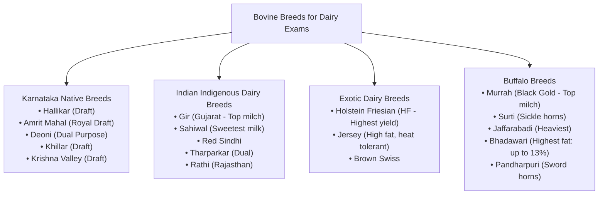
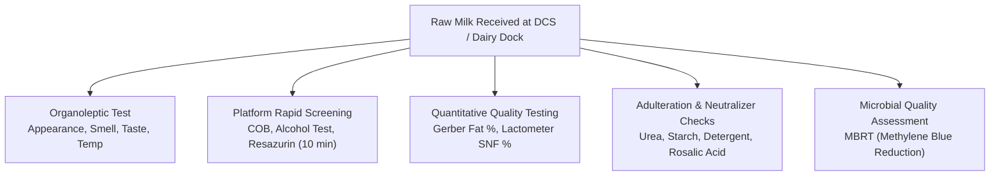

# Dairy Science, Animal Husbandry & Platform Testing Quick Reference

> [!ABSTRACT] 30-Second Rapid Recall Cheat Sheet
> - **Karnataka Native Cattle:** Hallikar (Premier Mysore draft breed), Amrit Mahal (Historical royal cavalry transport), Deoni (Bidar, dual-purpose), Khillar (Northern border draft), Krishna Valley (River basin draft).
> - **Top Indian Dairy Breeds:** Gir (Gujarat, highest indigenous milch), Sahiwal (Punjab/Haryana, sweetest milk, Lola/loose skin), Murrah Buffalo (Haryana, "Black Gold", tightly curled horns, highest milch buffalo).
> - **FSSAI Milk Standards (Karnataka):** Cow milk (Min Fat 3.2%, Min SNF 8.3%); Buffalo milk (Min Fat 5.0%, Min SNF 9.0%); Toned milk (3.0% Fat, 8.5% SNF); Double Toned (1.5% Fat, 9.0% SNF); Full Cream (6.0% Fat, 9.0% SNF).
> - **Milk Chemistry:** Cow milk yellow color = **Carotene**; Buffalo milk white color = **Casein micelles** (complete conversion of carotene to Vitamin A). Milk sugar = **Lactose** (Glucose + Galactose).
> - **Key Tests:** Gerber Method = **Fat %** (uses $H_2SO_4$ + Amyl Alcohol); MBRT = **Microbial Quality** (Methylene blue reduction time); Phosphatase Test = **Pasteurization Efficiency** (Alkaline Phosphatase destruction).
> - **Zoonotic Diseases:** Anthrax (*Bacillus anthracis* - no post-mortem!), Brucellosis (*Brucella abortus* - causes abortion in 3rd trimester & Undulant fever in humans), Tuberculosis, Rabies.

---

## 1. Cattle & Buffalo Breeds of India & Karnataka

### Karnataka Indigenous Cattle Breeds
| Breed Name | Native Tract / Districts | Breed Type | Key Physical & Utility Characteristics |
| :--- | :--- | :--- | :--- |
| **Hallikar** | Mysuru, Mandya, Hassan, Tumakuru, Shivamogga | Pure Draft | Premier draft breed of Southern India. Long, slender, erect backward-pointing horns with sharp tips; grey to dark grey coat; compact body; great endurance for trotting and plowing. Historical progenitor of Amrit Mahal. |
| **Amrit Mahal** | Hassan, Chikkamagaluru, Chitradurga, Shivamogga | Pure Draft | Supreme draft power. Developed by the Maharajas of Mysore (Wodeyars & Hyder Ali/Tipu Sultan) for rapid military artillery movement. Horns emerge backward and turn inward forming a crest; steel-grey coat; fiery temperament. |
| **Deoni** | Bidar District (adjoining Maharashtra/Telangana) | Dual Purpose (Milch & Draft) | Resembles Gir in physical conformation. Convex forehead, drooping ears, white coat with distinct black/red spots; docile nature; moderate milk yield (1,000–1,500 kg per lactation). |
| **Khillar** | Vijayapura, Bagalkote, Belagavi | Pure Draft | Renowned for speed, strength, and drought tolerance. Greyish-white coat; prominent backward curving horns; fast trotting draft animal in Deccan plateau drylands. |
| **Krishna Valley** | Bagalkote, Belagavi (Krishna river basin) | Heavy Draft | Massive, heavy body with loose skin and deep dewlap; suited for heavy draft work in deep black cotton soils. Low milk yield. |

### Major Indian Indigenous Milch Breeds
| Breed | Native Tract | Physical Markers | Lactation Yield & Fat |
| :--- | :--- | :--- | :--- |
| **Gir** | Saurashtra / Gir Hills (Gujarat) | Prominent convex dome-shaped forehead, long pendulous leaf-like curling ears, red or speckled white-red coat. | 2,000 – 3,200 kg; Fat: 4.5% – 5.0%. Highly export-acclaimed (Brazil). |
| **Sahiwal** | Montgomery (now Pakistan), Punjab, Haryana | Heavy loose skin and voluminous dewlap (known as **Lola**), reddish-dun color, short stumpy horns. | 2,200 – 3,500 kg; Fat: 4.5% – 5.2%. **Sweetest milk** among indigenous cattle (high lactose). |
| **Red Sindhi** | Karachi/Sindh (tracts in India) | Deep compact dark red coat, intelligent head, docile temperament. | 1,800 – 2,800 kg; Fat: 4.5% – 5.0%. High heat and tick tolerance. |
| **Tharparkar** | Thar desert (Rajasthan) | Completely white/light grey coat, lyre-shaped horns. Changes color between seasons. | 1,800 – 2,600 kg; Fat: 4.4% – 4.8%. Dual-purpose; survives extreme heat and scarce forage. |
| **Kankrej** | Rann of Kutch (Gujarat) | Majestic lyre-shaped horns, unique dignified pacing gait known as **Sawai Chal**. | Dual-purpose; high endurance. |

### Exotic Dairy Breeds
| Breed | Origin | Distinguishing Feature | Production & Fat |
| :--- | :--- | :--- | :--- |
| **Holstein Friesian (HF)** | Netherlands / North Germany | Large-framed body with distinct black and white patches (piebald). | **Highest milk yielder in the world** (6,000–9,000+ kg); Low fat: **3.2% – 3.6%**. Susceptible to tropical heat. |
| **Jersey** | Island of Jersey (UK) | Small, compact frame; fawn, yellowish-brown or mahogany color; dished forehead. | Moderate-to-high yield (4,000–5,500 kg); **High fat content (4.8% – 5.5%)**; Excellent heat and tropical disease tolerance. Ideal for crossbreeding in India. |
| **Brown Swiss** | Switzerland | Light to dark brown; rugged mountain draft and dairy dual-purpose breed. | 5,000 – 6,500 kg; Fat: ~4.0%. |

### Buffalo Breeds of India
| Breed | Origin / Tract | Distinguishing Characteristics | Milk Yield & Fat Content |
| :--- | :--- | :--- | :--- |
| **Murrah** | Haryana (Rohtak, Hisar, Jind) | Jet black body with white switch on tail; tightly curled spiral horns ("curled like a ring"); short neck. Known as **"Black Gold"** of Haryana. | **Highest milk yielder among buffaloes** (2,000–3,000 kg); Fat: **7.0% – 8.5%**. |
| **Surti** | Charotar tract, Kheda/Vadodara (Gujarat) | Medium-sized; straight back; flat, sickle-shaped horns; two white collars on brisket ("Chevrons"). | 1,600 – 2,200 kg; High fat: **7.5% – 8.5%**. |
| **Jaffarabadi** | Gir forest, Kathiawar (Gujarat) | Massive, heaviest buffalo breed in India. Extremely heavy, flat, drooping horns curling upwards at tip like a hook ("sleepy eyes"). | 2,200 – 2,800 kg; Fat: **7.5% – 9.0%**. |
| **Bhadawari** | Chambal river ravines (Agra, Etawah, Bhind, Morena) | Light copper or copper-grey coat; legs light yellow. Adapted to harsh ravines. | **Highest fat content in India: 8.0% to 13.0%!** Very high butter-yielding capability. |
| **Mehsana** | Mehsana, Banaskantha (Gujarat) | Cross between **Murrah and Surti**. Longer body, less curled horns than Murrah; steady lactation. | 1,800 – 2,500 kg; Fat: 7.0%. |
| **Pandharpuri** | Solapur, Kolhapur (adjoining Northern Karnataka) | Extraordinarily long, flat, sword-shaped horns extending back over shoulders (up to 45–50 inches). Highly reproductive. | 1,500 – 2,000 kg; Fat: 7.0% – 8.0%. |

---

## 2. Milk Composition, Chemistry & Legal Standards

### Comparative Composition (Average Values)
| Constituent | Cow Milk (%) | Buffalo Milk (%) | Goat Milk (%) | Human Milk (%) |
| :--- | :---: | :---: | :---: | :---: |
| **Water** | 86.5 – 87.5% | 82.5 – 83.5% | 86.5 – 87.0% | 87.5% |
| **Fat** | 3.5 – 4.5% | **6.5 – 8.5%** | 3.8 – 4.5% | 3.8% |
| **Protein** | 3.2 – 3.5% | 3.8 – 4.3% | 3.3 – 3.7% | 1.2% |
| **Casein (% of protein)**| ~80% | ~82% | ~78% | ~40% (high whey!) |
| **Lactose (Milk Sugar)** | 4.6 – 4.9% | 5.0 – 5.2% | 4.2 – 4.5% | **7.0%** (highest) |
| **Ash (Minerals: Ca, P)**| 0.72% | 0.78% | 0.79% | 0.21% |
| **Specific Gravity (at 20°C)**| **1.028 – 1.032** | **1.030 – 1.034** | 1.029 – 1.033 | 1.030 |
| **Freezing Point Depression**| **-0.53°C to -0.55°C** | **-0.54°C to -0.56°C** | -0.54°C | -0.53°C |

### Chemical & Physical Key Facts
1. **Milk Pigmentation:**
   - **Cow Milk:** Light yellowish hue due to the presence of **Carotene** (a fat-soluble pigment and precursor of Vitamin A) obtained from green forage.
   - **Buffalo Milk:** Opaque white color because buffalo efficiently convert all dietary carotene into colorless active **Vitamin A** in the intestinal mucosa, combined with the light scattering of larger **Casein micelles** and fat globules.
2. **Milk Protein Classes:**
   - **Casein (80%):** Exists as colloidal calcium phosphocaseinate micelles. Composed of $\alpha_{s1}$, $\alpha_{s2}$, $\beta$, and $\kappa$-casein. **$\kappa$-casein** (kappa-casein) prevents micellar aggregation; rennet/chymosin cleaves kappa-casein, causing coagulation in cheese making.
   - **Whey Proteins (20%):** Soluble proteins remaining after casein curd precipitates. Composed of $\beta$-lactoglobulin (dominant), $\alpha$-lactalbumin, immunoglobulins, and serum albumin.
3. **Lactose (Milk Sugar):**
   - Disaccharide carbohydrate made of **Glucose + Galactose** linked by $\beta$-1,4 glycosidic bond.
   - Least variable constituent in normal bovine milk.

### FSSAI Statutory Standards (Karnataka & Southern Zone)
| Milk Product Category | Minimum Milk Fat (%) | Minimum Solids-Not-Fat (SNF) (%) |
| :--- | :---: | :---: |
| **Cow Milk** | **3.2%** | **8.3%** |
| **Buffalo Milk** | **5.0%** | **9.0%** |
| **Mixed Milk** | **4.5%** | **8.5%** |
| **Standardized Milk** | **4.5%** | **8.5%** |
| **Toned Milk (Single Toned)** | **3.0%** | **8.5%** |
| **Double Toned Milk** | **1.5%** | **9.0%** |
| **Full Cream Milk** | **6.0%** | **9.0%** |
| **Skimmed Milk** | **$\le$ 0.5%** | **8.7%** |

---

## 3. Platform Testing, Quality Control & Adulteration Tests

### Rapid Platform Quality Tests
| Test Name | Operating Principle & Procedure | Interpretation & Pass/Fail Threshold |
| :--- | :--- | :--- |
| **Clot on Boiling (COB)** | 5 ml of milk boiled in a test tube over flame for 1–2 minutes. | **Clotting occurs if titratable acidity > 0.22%**. Positive COB milk cannot withstand pasteurization heating $\to$ Rejected. |
| **Alcohol Test** | Equal volumes (5 ml each) of milk and **68% neutral ethyl alcohol** mixed in a test tube. | Curdling or flake formation indicates developed acidity, high mineral imbalance, or colostrum $\to$ Milk fails heat stability test. |
| **Titratable Acidity** | 10 ml milk titrated against 0.1N NaOH using phenolphthalein indicator until faint pink persists. | Normal fresh milk acidity is **0.12% to 0.16%** (expressed as lactic acid). Acidity > 0.18% indicates bacterial fermentation. |
| **Sediment Test** | Fixed volume filtered through a standard cotton lint disc. | Visually graded against standard discs (Class 1 clean to Class 4 dirty). |

### Analytical Quality & Compositional Tests
1. **Gerber Method for Milk Fat:**
   - **Apparatus:** Gerber butyrometer, Gerber centrifuge (running at 1,100 rpm for 4–5 minutes), automatic tilt measures.
   - **Reagents:** 10 ml of concentrated Sulfuric Acid ($H_2SO_4$, specific gravity 1.820–1.825) + 10.75 ml milk + 1 ml of Isoamyl Alcohol (specific gravity 0.815).
   - **Principle:** Sulfuric acid digests all milk proteins and dissolves non-fat solids, liberating fat in liquid form. Amyl alcohol prevents charring and sharpens fat-acid meniscus separation. Direct reading taken on graduated stem.
2. **Lactometer for SNF Determination:**
   - **Apparatus:** ISI certified Zeal Lactometer calibrated at 20°C (or 29°C / 84°F).
   - **Corrected Lactometer Reading (CLR):** Observed reading corrected for temperature deviation ($\pm 0.1$ for every $1^\circ C$ or $\pm 0.2$ for every $1^\circ F$).
   - **Richmond Formula:**
     $$\text{SNF}\% = \frac{\text{CLR}}{4} + 0.2 \times \text{Fat}\% + 0.36$$
     $$\text{Total Solids (TS)}\% = \text{Fat}\% + \text{SNF}\%$$
3. **Methylene Blue Reduction Test (MBRT):**
   - **Reagent:** 1 ml standard Methylene Blue thiocyanate dye solution added to 10 ml milk; incubated in water bath at 37°C.
   - **Principle:** Viable bacteria consume dissolved oxygen in milk. Once oxygen is exhausted, methylene blue is reduced to colorless *leuco-methylene blue*. Shorter decolorization time indicates heavier microbial contamination.
   - **Grading Scale:**
     - **Class I (Excellent):** Decolorization time **> 5 hours**.
     - **Class II (Good):** Decolorization time **3 to 4 hours**.
     - **Class III (Fair):** Decolorization time **1 to 2 hours**.
     - **Class IV (Poor):** Decolorization time **< 30 minutes**.
4. **Phosphatase Test (Pasteurization Verification):**
   - **Principle:** Milk contains the enzyme **Alkaline Phosphatase**, whose heat denaturation profile slightly exceeds that of pathogenic bacteria like *Mycobacterium tuberculosis* and *Coxiella burnetii*.
   - **Interpretation:** If pasteurization is effective ($72^\circ C$ for 15 sec or $63^\circ C$ for 30 min), alkaline phosphatase is completely inactivated. A **negative phosphatase test** confirms milk has been safely and properly pasteurized.

### Adulteration Detection Chemistry
| Adulterant | Chemical Test Procedure | Positive Result / Color |
| :--- | :--- | :--- |
| **Starch / Flour** | Add 2–3 drops of 1% **Iodine solution** to 5 ml boiled and cooled milk. | **Intense deep blue color** (formation of starch-iodine complex). |
| **Urea** | Add 5 ml of 1.6% **DMAB** (*p*-dimethylaminobenzaldehyde) in ethanol + concentrated HCl. | **Distinct bright yellow/canary yellow color** (Normal milk remains faint pale yellow). |
| **Detergent** | Shake 5 ml milk with 0.1 ml methylene blue solution and 2 ml chloroform. Centrifuge. | **Intense blue color in the lower chloroform layer** indicates anionic detergent. |
| **Neutralizers ($NaHCO_3, Na_2CO_3$)** | Add 5 ml of 0.05% **Rosalic Acid** solution in 95% alcohol to 5 ml milk. | **Rose-red to deep pink coloration** indicates added alkali/neutralizer. (Pure milk yields normal orange-brown). |
| **Hydrogen Peroxide ($H_2O_2$)** | Add 5 drops of 1% **Vanadium Pentoxide** ($V_2O_5$) in dilute sulfuric acid to milk. | **Pinkish-red to deep orange color**. |
| **Formalin (Preservative)** | Carefully pour concentrated $H_2SO_4$ containing traces of $FeCl_3$ along the side of the test tube. | **Violet or purple ring** at the junction of the two liquids. |
| **Salt (NaCl)** | Silver nitrate ($AgNO_3$) + potassium chromate indicator. | **Yellow color** indicates added sodium chloride. |

---

## 4. Dairy Technology Processes & Temperature Parameters

| Processing Step | Official Technical Parameters | Fundamental Purpose |
| :--- | :--- | :--- |
| **LTLT Pasteurization (Batch/Vat)** | **$63^\circ \text{C}$ ($145^\circ \text{F}$) held for 30 minutes**, followed by rapid chilling to $< 4^\circ \text{C}$. | Small-scale processing; destroys all pathogenic vegetative micro-organisms. |
| **HTST Pasteurization (Continuous)** | **$72^\circ \text{C}$ ($161^\circ \text{F}$) held for 15 seconds**, followed by immediate regenerative cooling to $4^\circ \text{C}$. | Commercial milk plant standard; utilizes plate heat exchangers (PHE) with flow diversion valves. |
| **UHT Sterilization (Ultra High Temp)** | **$135^\circ \text{C} - 150^\circ \text{C}$ for 2 to 5 seconds**, packed under aseptic conditions (Tetra Pak). | Destroys all vegetative bacteria and bacterial spores; ambient shelf life of **90 to 180 days** (e.g., Nandini GoodLife). |
| **Homogenization** | Operates at **2,000 to 2,500 psi (140–175 bar)**, forcing milk through microscopic valve orifice. | Disintegrates fat globules from 4–10 microns down to **$< 2$ microns**, preventing fat separation and cream layer formation. |
| **Cream Separation** | Centrifugal disc separator running at 5,000–7,000 rpm; milk warmed to $35^\circ - 40^\circ \text{C}$. | Separates lighter milk fat (cream) from heavier aqueous phase (skim milk) based on Stokes' Law. |
| **Curd / Dahi Fermentation** | Inoculated with starter culture (*Lactobacillus delbrueckii subsp. bulgaricus*, *Streptococcus thermophilus*) at $40^\circ - 42^\circ \text{C}$ for 4–6 hrs. | Converts lactose into lactic acid, lowering pH to 4.6 (isoelectric point of casein), forming uniform smooth gel. |
| **Ghee Clarification** | Heating cultured cream butter to **$110^\circ \text{C} - 120^\circ \text{C}$** until complete water evaporation. | Removes all moisture ($< 0.5\%$), precipitates curd solids, creates pleasant nutty aroma and granular texture. |

---

## 5. Major Dairy Animal Diseases & Veterinary Pathology

| Disease Name | Etiological Agent | Clinical Symptoms & Pathology | Prevention / Control & Zoonotic Status |
| :--- | :--- | :--- | :--- |
| **Foot and Mouth Disease (FMD)** | Picornavirus (*Aphthovirus*, types O, A, C, Asia-1) | High fever, vesicular blisters/erosions on tongue, dental pad, lips, interdigital space of hooves; severe salivation (roping saliva); lameness. Highly contagious. | Semi-annual bi-valent/polyvalent vaccination. Not dangerous to humans (low zoonosis), but causes massive economic loss. |
| **Mastitis** | Bacteria: *Staphylococcus aureus*, *Streptococcus agalactiae*, *Escherichia coli* | Inflammation of mammary gland; hard, swollen, painful udder; blood, clots, or flakes in milk. Subclinical form detected by California Mastitis Test (CMT). | Post-milking teat dipping in iodophor antiseptic; dry cow therapy. Major financial drain in dairying. |
| **Brucellosis (Bang's Disease)** | *Brucella abortus* (Gram-negative intracellular coccobacillus) | Contagious abortion in pregnant cattle during the **third trimester (7th to 9th month)**; retained placenta; orchitis in bulls; infertility. | **High Zoonotic Hazard!** Causes **Undulant Fever (Malta Fever)** in humans through unpasteurized milk. Controlled by Brucella Cotton Strain 19 or RB51 vaccine for female calves. |
| **Anthrax** | *Bacillus anthracis* (Gram-positive spore-forming rod) | Peracute fatal septicemia; sudden death without prior illness; **dark, uncoagulated tarry blood oozing from all natural orifices** (mouth, nostrils, anus); incomplete rigor mortis. | **Strictly Zoonotic! Never open or perform post-mortem on carcass!** Deep burial with quicklime. Annual spore vaccination in endemic tracts. |
| **Black Quarter (BQ)** | *Clostridium chauvoei* (Anaerobic spore-forming bacillus) | Acute disease in young cattle (6 months to 2 years); severe lameness; hot, painful, crepitant swelling (crackling sound on palpation due to gas) over heavy shoulder/thigh muscles; high fever. | Annual vaccination with polyvalent BQ vaccine before monsoon. |
| **Hemorrhagic Septicemia (HS)** | *Pasteurella multocida* (Gram-negative coccobacillus) | High fever; acute edema/swelling of throat, brisket, submandibular region; severe respiratory distress with stertorous breathing (**"Gurk-Gurk" sound**); tongue protrusion. High mortality. | Annual alum-precipitated or oil-adjuvant HS vaccination prior to rainy season. |
| **Lumpy Skin Disease (LSD)** | Capripoxvirus (*Neethling virus*) | High fever, enlarged lymph nodes, eruption of firm round cutaneous nodules (2–5 cm lumps) all over skin and mucosal membranes; edema of legs; drop in milk. | Transmitted mechanically by biting insects (flies, mosquitoes, ticks). Controlled by mass inoculation using **Goat Pox Vaccine** (heterologous live attenuated vaccine). |
| **Bovine Spongiform Encephalopathy (BSE)** | Prion protein (misfolded protein) | Degenerative neurological disease ("Mad Cow Disease"); hyperesthesia, ataxia, death. | Zoonotic: Causes variant Creutzfeldt-Jakob Disease (vCJD) in humans. Banned ruminant bone/meat meal in cattle feeds. |
