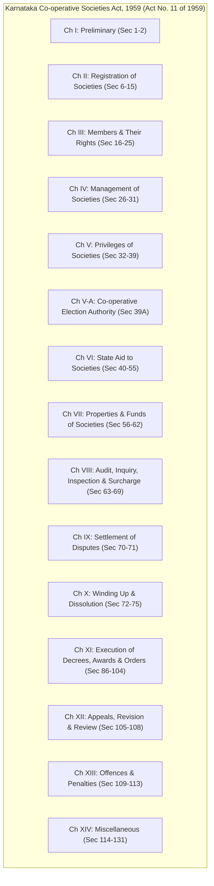
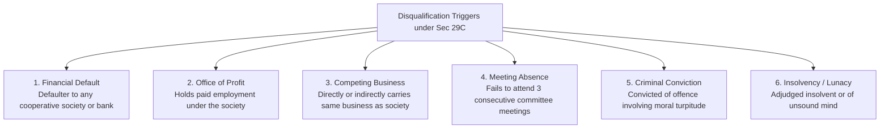
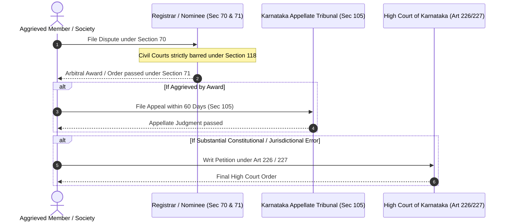

# Karnataka Co-operative Societies Act 1959 & Rules 1960: Complete Legal Reference

> [!ABSTRACT] 30-Second Exam Cheat Sheet
> - **Act Title & Number:** Karnataka Co-operative Societies Act, 1959 (Karnataka Act No. 11 of 1959). Received assent of President on 10th February 1959.
> - **Rules:** Karnataka Co-operative Societies Rules, 1960.
> - **Fundamental Right:** Article 19(1)(c) includes the right to form cooperative societies (inserted by 97th Constitutional Amendment Act, 2011).
> - **Directive Principle:** Article 43B promotes voluntary formation, autonomous functioning, democratic control, and professional management of cooperative societies.
> - **Key High-Yield Sections:**
>   - **Sec 20:** Voting rights (1 member = 1 vote; casting vote to President/Chairman in case of equality; defaulters barred from voting).
>   - **Sec 28A:** Management of society vested in committee; 5-year tenure; reservation of seats (SC, ST, Women, Backward Classes).
>   - **Sec 29C:** Disqualification for committee membership (defaulters, office of profit, carrying competing business, absent from 3 consecutive committee meetings).
>   - **Sec 30:** Supersession/suspension of committee by Registrar (maximum 6 months for normal societies, up to 1 year for cooperative banks; requires prior consultation with financing bank / RBI).
>   - **Sec 39A:** Co-operative Election Authority (independent superintendence, direction, and control of preparation of electoral rolls and conduct of elections).
>   - **Sec 64 & 65:** Statutory Inquiry (Sec 64) and Inspection of Books (Sec 65) ordered by Registrar.
>   - **Sec 68:** Surcharge proceedings against delinquent past/present officers for loss/misappropriation (limitation: within 5 years from date of act).
>   - **Sec 70:** Dispute arbitration; **Sec 118:** Complete bar of jurisdiction of Civil Courts on matters covered under Sec 70.
>   - **Sec 128A:** Common Cadre system inserted in 2023, declared unconstitutional (*ultra vires* Art 19(1)(c)) by the High Court of Karnataka.

---

## 1. Statutory Architecture & Chapter Map

---

## 2. Master Table of High-Frequency Sections (50+ Sections)

| Sec # | Section Title / Subject | Key Statutory Provisions & Details | Exam Trap / Question Pattern |
| :---: | :--- | :--- | :--- |
| **2** | Definitions | Defines `Registrar`, `Committee`, `Member`, `Financing Agency`, `Co-operative Year` (1st April to 31st March). | Trap: Co-operative year is **1st April to 31st March**, not calendar year. |
| **6** | Conditions of Registration | Minimum 10 individuals from different families for an ordinary primary society; viability criteria. | Minimum persons: **10 individuals** representing distinct families. |
| **7** | Registration | Application made to Registrar; Registrar must register if conditions satisfied within statutory period. | Registration time limit: Society deemed or registered within **3 months** of application. |
| **9** | Registration Certificate | Conclusive evidence that society is duly registered under KCS Act. | Conclusive proof of incorporation. |
| **12** | Amendment of Bye-laws | Amendment requires approval of general body; must be registered with Registrar to take effect. | Amendment is NOT valid until registered by Registrar. |
| **13** | Change of Name | Does not affect any rights or obligations or legal proceedings by or against the society. | Society's legal personality remains continuous. |
| **14** | Amalgamation, Division & Transfer | Voluntary or Registrar-directed restructuring in public interest after notice and resolution. | Requires 2/3rd majority of members present and voting. |
| **14A** | Framing Scheme for Amalgamation | Registrar's power to amalgamate cooperative banks in consultation with Reserve Bank of India (RBI). | Consultation with **RBI** is mandatory for banks. |
| **16** | Persons who may become members | Individuals, other societies, State Government, local authority, or body corporate approved by Govt. | A firm or partnership requires special approval. |
| **17** | Affiliation to Apex / Federal | Duty of every primary cooperative society to affiliate with relevant federal/apex society. | Affiliation is statutory for primary dairy societies to Union. |
| **18** | Nominal or Associate Member | Can be admitted without voting rights; cannot be elected to committee; has limited liabilities. | **No voting rights** and **cannot contest elections**. |
| **19** | Member not to exercise rights till due payment made | No member can exercise rights of membership until required payment for share or entrance fee is made. | Cannot vote without paying full share value. |
| **20** | **Votes of Members** | Principle: **One member, One vote**. Casting vote to Chairman in case of equality. No proxy voting. | **NO proxy voting** permitted; associate members cannot vote. |
| **20(2)(a)** | Restriction on Voting Right | Member must have been admitted at least 12 months prior to date of election and attended general meetings. | Minimum admission duration before voting: **12 months**. |
| **20(2)(b)(v)** | **Defaulter Disqualification (Amended)** | Member must not be in default. Under 2023 amendment: Society serves **30 days notice**; arrears must be cleared **20 days prior** to meeting/election. | Notice period = **30 days**; clearance deadline = **20 days prior**. |
| **21** | Manner of Exercising Vote | Every member must vote in person; institutional members vote through authorized nominee/delegate. | Institutional delegates must be authorized by valid committee resolution. |
| **22** | Restriction on Transfer of Shares | Cannot transfer shares unless held for at least 1 year; must be transferred to member or approved person. | Holding period before transfer: **Minimum 1 year**. |
| **24** | Disposal of Share/Interest on Death of Member | Transferred to nominee or legal heir; value paid within 1 year if nominee not qualified as member. | Society pays value within **1 year** if heir cannot be admitted. |
| **26** | **Final Authority in Society** | Final authority vests in the **General Body of Members** (subject to provisions of Act and Bye-laws). | General Body is supreme, NOT the Board of Directors or Registrar. |
| **27** | Annual General Meeting (AGM) | Must be held within **6 months of close of co-operative year** (on or before **25th September**). | Deadline for holding AGM: **Within 6 months** (by Sept 25). |
| **27(2)** | Business at AGM | Approval of annual report, audit report, disposal of net profits, election of committee, budget for next year. | Audit report MUST be placed before AGM. |
| **28** | Special General Meeting (SGM) | Convened within 1 month on requisition by 1/5th of total members, or by Committee, or directed by Registrar. | Minimum requisition: **1/5th of total members**; timeline: **1 month**. |
| **28A** | **Management of Society (Committee)** | Committee manages society; **Tenure is 5 years** from date of election; reservations for SC/ST, Women, BC. | Term of office of committee = **5 years** (aligned with 97th Constitutional Amendment). |
| **28A(4)** | Reservation in Committee | Mandatory reservation: 1 SC, 1 ST, 2 Women, and Backward Classes as specified in Act/Rules. | Failure to follow reservation renders election void. |
| **28B** | State Govt Nominees on Committee | Govt can nominate up to 3 persons on committee where Govt has subscribed shares or assisted financially. | Maximum Govt nominees = **3 persons** (cannot participate in election of office-bearers). |
| **29A** | Commencement of Term of Office | Term begins on date of announcement of election results by Returning Officer. | Begins on declaration of result, not first meeting date. |
| **29B** | Resignation of Committee Member / Office Bearer | Resignation addressed to President/Secretary in writing; effective upon acceptance or 15 days. | Notice and acceptance mechanics. |
| **29C** | **Disqualification for Membership of Committee** | Detailed statutory grounds barring a person from being elected or continuing as a committee member. | **Most tested section in KCS exams!** (See deep dive below). |
| **29E** | Filling of Casual Vacancy | Casual vacancy filled by co-option by committee if remaining term is less than half; else by election. | Co-option allowed only if remaining term is **< half of total term**. |
| **29F** | Chief Executive Officer (CEO / MD) | Society appoints CEO/MD responsible for general day-to-day administration and custody of records. | CEO is ex-officio member of committee without voting right. |
| **30** | **Supersession of Committee** | Registrar can supersede committee for persistent default, negligence, or acting against interests of society. | Max period = **6 months** (1 year for cooperative banks); consultation mandatory. |
| **30A** | Power to Appoint Special Officer | Registrar can appoint Special Officer where committee cannot be constituted or term expires without election. | Special Officer manages affairs till new board is elected. |
| **31** | Constitution of New Committee after Supersession | Administrator/Special Officer must hold elections to constitute new committee before expiry of term. | Mandatory election before expiry of 6 months. |
| **32** | First Charge of Society on Member's Property | Society has first charge on crops, agricultural produce, cattle, or implements for recovery of loan. | Prioritizes cooperative debt over private civil decrees. |
| **34** | Deduction from Salary | Employer is bound to deduct cooperative dues from member's salary upon written authorization and remit. | Obligatory on employer; failure creates civil liability. |
| **39A** | **Co-operative Election Authority** | Independent statutory authority created by State Govt to conduct, supervise, and control all cooperative elections. | Functions like State Election Commission for cooperatives. |
| **43** | State Aid to Societies | State may grant loans, subsidies, guarantee debentures, or take shares in cooperative societies. | Statutory basis for Govt financial backing. |
| **56** | Disposal of Net Profits | Reserve Fund allocation: **At least 25%** of net profits transferred to statutory Reserve Fund. | Reserve Fund share = **Minimum 25%** of net profit. |
| **57** | Co-operative Education Fund | Contribution of **1% to 2%** of net profits (capped as per rules) paid to Karnataka State Co-operative Federation. | Mandatory statutory allocation for training & education. |
| **58** | Investment of Funds | Funds can only be invested in Postal Savings, Govt securities, District Central Co-op Bank, or approved apex banks. | Cannot invest in private unsecured stocks/speculative assets. |
| **63** | **Audit of Societies** | Every society audited once every year by Director of Co-operative Audit or certified Chartered Accountant; completed within 6 months. | Audit must be completed within **6 months** of close of co-operative year. |
| **64** | **Inquiry by Registrar** | Registrar on own motion, or on request of 1/3rd committee or 1/10th members, or financing bank, orders inquiry. | Minimum requisition: **1/10th of members** or **1/3rd of committee**. |
| **65** | **Inspection of Books** | Registrar inspects books on own motion or on application of creditor whose debt is due. | Creditor must prove debt is unpaid and demand unsatisfied. |
| **68** | **Surcharge Proceedings** | Registrar orders recovery against officer/member who misapplied, retained, or committed breach of trust. | Limitation period: Surcharge order must be passed within **5 years** from date of act. |
| **69** | Suspension of Officer / Employee | Power of Registrar to direct suspension of employee facing serious misappropriation or inquiry. | Disciplinary power under statutory supervision. |
| **70** | **Disputes referred to Registrar (Arbitration)** | Any dispute touching constitution, management, or business of a society between members, past members, or society. | Master arbitration section; completely excludes Civil Court jurisdiction. |
| **70(2)** | What constitutes a dispute | Includes recovery of debts, election disputes, claims against sureties, employment-related monetary claims. | Election disputes MUST be filed under Sec 70 within limitation. |
| **71** | Settlement of Disputes | Registrar decides dispute himself or refers to an appointed Arbitrator / Nominee. Award has force of decree. | Arbitrator's award is legally enforceable as civil court decree. |
| **72** | Winding Up / Liquidation | Registrar orders winding up if society failed to commence business, ceased working, or membership < 10. | Minimum threshold: Membership drops below **10 persons**. |
| **73** | Appointment of Liquidator | Liquidator takes custody of all assets, books, and realizes assets to discharge liabilities. | Liquidator holds quasi-judicial powers for claim determination. |
| **86-104**| Execution of Decrees & Orders | Registrar / Recovery Officer executes awards through attachment of property, distraint, and auction sale. | Recovery officers have powers of Civil Court execution. |
| **105** | **Appeals to Karnataka Appellate Tribunal (KAT)** | Appeal against orders of Registrar under Sec 64, 68, 70, 72 lies to the Karnataka Appellate Tribunal. | Appellate forum = **KAT (Bangalore)**; limitation is generally **60 days**. |
| **106** | Appeals to Other Authorities | Appeals against orders of subordinate cooperative officers lie to Joint Registrar or Registrar. | Hierarchy of departmental appeals. |
| **108** | Review and Revision | Government / Tribunal power to call for records and revise or review orders. | Revising authority sits above regular administrative appeals. |
| **118** | **Bar of Jurisdiction of Civil Courts** | No Civil or Revenue Court has jurisdiction over matters required to be referred to Registrar under Sec 70. | Total jurisdiction bar; Civil suits on cooperative disputes are non-maintainable. |
| **126A** | Removal of Member for Misconduct | Expulsion of member for acts detrimental to society; requires 2/3rd majority and Registrar approval. | Requires **2/3rd majority of General Body** + **Registrar's approval**. |
| **128A** | Common Cadre for Cooperative Employees | 2023 Amendment attempted common cadre creation; **Struck down by Karnataka High Court** as unconstitutional. | Struck down: Infringes autonomy under **Art 19(1)(c)**. |

---

## 3. High-Yield Deep Dives

### Deep Dive 1: Section 29C — Disqualifications for Committee Membership
Section 29C is historically the most frequently tested section in KCS examinations.

**Comprehensive Disqualification Conditions:**
1. **Defaulter Status:** A person is disqualified if they are in default to the society or any other cooperative society/bank in respect of any loan or dues.
2. **Contract / Business Conflict:** Directly or indirectly carries on any business of the same kind as that carried on by the cooperative society (e.g., a private milk dairy operator cannot sit on a dairy cooperative committee).
3. **Office of Profit:** Holds any office or place of profit under the society (except the Chief Executive / Managing Director as ex-officio).
4. **Attendance Default:** Fails to attend **three consecutive meetings** of the committee without obtaining leave of absence from the committee.
5. **Conviction:** Has been convicted of an offence punishable under the Act or an offence involving moral turpitude with imprisonment exceeding 6 months (disqualification lasts for **5 years** from sentence completion).
6. **Statutory Non-compliance:** Failure to file annual returns or audit compliances as required by the Act.

---

### Deep Dive 2: Section 30 — Supersession of Committee
- **Grounds for Supersession:**
  1. Persistent default in performing duties imposed by Act, Rules, or Bye-laws.
  2. Negligence in functioning or acting prejudicial to the financial interest of the society.
  3. Failure to hold annual general meetings or conduct committee elections in time.
  4. Impasse or deadlock in management making normal governance impossible.
- **Mandatory Procedural Requirements:**
  - **Show Cause Notice:** Registrar must give the committee an opportunity of stating its objections (Notice period typically not less than 15 days).
  - **Consultation with Financing Agency:** Where the society is indebted to a financing bank (e.g., DCC Bank or Apex Bank), consultation with the financing agency is **mandatory**.
  - **Consultation with RBI:** In the case of a Cooperative Bank, previous sanction in writing from the Reserve Bank of India (RBI) is obligatory.
- **Tenure of Administrator / Board:**
  - For normal cooperative societies: Maximum period **cannot exceed 6 months**.
  - For cooperative banks: Maximum period **cannot exceed 1 year** (in accordance with 97th Constitutional Amendment limits).

---

### Deep Dive 3: Section 39A & Cooperative Election Authority
- **Constitutional Backing:** Inserted following the 97th Constitutional Amendment Act (Article 243ZK), mandating independent conduct of elections.
- **Structure:**
  - Headed by the **Co-operative Election Commissioner** appointed by the State Government.
  - Independent machinery responsible for preparing electoral rolls, publishing calendar of events, appointing Returning Officers, and counting/declaring results.
- **Timeline:**
  - The society must notify the Election Authority at least **60 days prior** to the expiry of the term of the outgoing committee.
  - Elections must be conducted before the expiration of the 5-year term to prevent vacuum or administrative supersession.

---

### Deep Dive 4: Dispute Resolution & Legal Hierarchy (Sections 70, 71, 105, 118)

- **Scope of Section 70 Disputes:**
  - Between members, past members, or persons claiming through them.
  - Between member/surety and the society regarding debts or dues.
  - Concerning election of office-bearers and committee members.
  - Note: Pure employment disputes regarding termination of workmen governed by Industrial Disputes Act 1947 may fall outside Sec 70 depending on jurisdiction rulings.
- **Bar of Jurisdiction (Section 118):**
  - No civil or revenue court has jurisdiction in respect of any matter required to be referred to the Registrar under Section 70.
  - No injunction can be granted by any civil court in respect of any action taken or to be taken under the Act.

---

## 4. Key Rules under Karnataka Co-operative Societies Rules, 1960

| Rule # | Title | Key Provision |
| :---: | :--- | :--- |
| **Rule 13** | Application for Membership | Procedure, fees, and timelines for society to accept or reject membership applications within 3 months. |
| **Rule 14** | Election of Committee Members | Step-by-step electoral calendar, publication of eligible voter list, objections, nomination filing, scrutiny, withdrawal, and balloting. |
| **Rule 14(a)–14(k)**| Conduct of Elections | Detailed procedures followed by Returning Officers under the Co-operative Election Authority. |
| **Rule 18** | Custody of Books & Accounts | Mandatory records to be maintained: Cash Book, Day Book, General Ledger, Share Register, Stock Register. |
| **Rule 22** | Audit Fees | Scale of audit fees payable by cooperative societies to the Department of Co-operative Audit. |
| **Rule 28** | Maintenance of Reserve Fund | Reserve Fund cannot be invested in ordinary working capital without prior Registrar sanction; invested as per Sec 58. |
| **Rule 33** | Procedure for Arbitration | Rules governing summons, evidence, examination of witnesses, and passing of awards under Sec 71. |
| **Rule 38** | Execution of Awards & Attachment | Procedure for seizing moveable and immoveable property of judgment debtors by Sale Officers. |
| **Rule 48** | Investment of Society Funds | Guidelines for depositing funds in Post Office, Government Treasury, Central Co-operative Banks, or scheduled banks. |

---

## 5. Recent Legal Amendments & Notable Judicial Rulings (2023–2025)

### 1. 2023 Amendment Act — Section 20(2)(b)(v) Defaulter Notice Rule
- **Previous Position:** Defaulters were often summarily disqualified on election day without sufficient prior notice.
- **Amended Rule:** The society must issue a specific registered demand notice giving **not less than 30 days** to the member to clear default dues.
- **Election Cutoff:** To exercise voting rights, the member must clear all default dues **at least 20 days prior** to the date fixed for the election or general meeting.

### 2. The Section 128A Controversy (Common Cadre System)
- **Legislative Action:** The State Government inserted Section 128A seeking to establish a centralized "Common Cadre" for recruitment, transfers, and service conditions of employees across cooperative societies.
- **Judicial Strike-Down:** In landmark rulings, the **High Court of Karnataka held Section 128A unconstitutional and *ultra vires* Article 19(1)(c)**.
- **Reasoning:** Primary and federal cooperative societies are autonomous, self-governing bodies owned by member-shareholders. Imposing centralized government-controlled transfers and cadre appointment violates the cooperative's fundamental right to manage its own administrative affairs.

### 3. Judicial Rulings on Section 30 Supersession
- The High Court of Karnataka has repeatedly ruled that supersession under Section 30 is an **extraordinary measure of last resort**.
- A supersession order passed without strictly issuing a show-cause notice and without bona fide consultation with the financing agency is void *ab initio* for violating natural justice.
