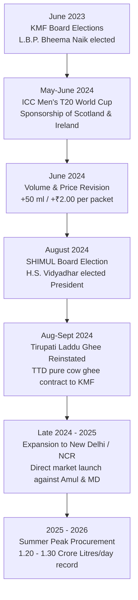
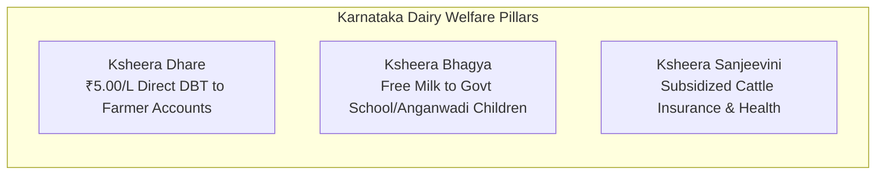

# KMF & SHIMUL Current Affairs & Key Developments (2023–2026)

> [!ABSTRACT] 30-Second Exam Cheat Sheet
> - **KMF 2023-24 Group Turnover:** ₹21,330 Crore (Record high; up from ₹14,018 Cr in 2020-21).
> - **Daily Milk Procurement:** 82.9 LLPD (2023-24 avg) $\to$ 90–95 LLPD (2024-25) $\to$ Peak summer 2026: 1.2–1.3 Crore L/day (120–130 LLPD).
> - **Karnataka Production vs Procurement Rank:** **8th–9th in total raw milk production** nationally (~13.9 MT), but **2nd in organized cooperative procurement** (after Gujarat/Amul) and **#1 in South India**.
> - **KMF Leadership:** Chairman / Board under Govt Administrator T.H.M. Kumar (IAS) / L.B.P. Bheema Naik (elected Chairman tenure June 2023); Managing Director: B. Shivaswamy (KAS).
> - **SHIMUL Leadership:** President: H.S. Vidyadhar (elected August 2024); Vice-President: Chethan S. Nadiger; Managing Director: S.G. Shekar (KAS/Sr. Officer).
> - **High-Frequency Events:** Tirupati Laddu Nandini Ghee reinstatement (Aug-Sept 2024); ICC T20 World Cup Scotland & Ireland team sponsorship (May-June 2024); Entry into New Delhi / NCR market (late 2024); 50ml extra / ₹2 price revision (June 2024).

---

## 1. Chronological Event Log & Exam Takeaways

### Event 1: Tirupati Laddu Pure Ghee Reinstatement (Aug–Sept 2024)
- **Background & Context:** Tirumala Tirupati Devasthanams (TTD) had temporarily halted Nandini ghee procurement in 2023 due to competitive tender pricing where private dairies quoted unfeasibly low prices. Following nationwide lab-tested revelations of animal fat/foreign adulterants in private ghee supplies under previous contracts, TTD cancelled private vendor tenders and officially reinstated KMF Nandini as the premier, trusted pure cow ghee supplier.
- **Supply Details:** KMF committed to supply **350 MT (Metric Tonnes)** of Agmark Special Grade pure cow ghee in tanker consignments meeting stringent quality standards.
- **Significance:** Solidified Nandini Ghee's reputation as the gold standard of purity and cooperative integrity.

> [!NOTE] Exam Takeaway Box: Tirupati Ghee
> - **Agency:** Tirumala Tirupati Devasthanams (TTD).
> - **Grade of Ghee:** Agmark Special Grade Cow Ghee.
> - **Key Reason for Reinstatement:** Absolute purity, state-of-the-art testing parameters, failure of low-cost private vendors.
> - **Potential Question:** *"Which cooperative brand was reinstated by TTD in 2024 to supply pure cow ghee for the world-famous Tirupati Laddu prasadam?"* $\to$ **Nandini (KMF)**.

---

### Event 2: ICC Men's T20 World Cup 2024 Sponsorship (May–June 2024)
- **Context:** KMF's Nandini brand became the official sponsor for the national cricket teams of **Scotland** and **Ireland** during the 2024 ICC Men's T20 World Cup hosted in the United States and the West Indies.
- **Strategic Objectives:**
  1. Expand brand visibility internationally into North America and European dairy and diaspora segments.
  2. Promote newly launched packaged beverage products including Nandini Splash (whey drink) and Nandini energy beverages on global television broadcasts.
- **Significance:** Marked the first time an Indian state cooperative dairy sponsored two international cricket teams at an ICC World Cup tournament.

> [!NOTE] Exam Takeaway Box: T20 World Cup Sponsorship
> - **Teams Sponsored:** Scotland National Cricket Team & Ireland National Cricket Team.
> - **Tournament:** ICC Men's T20 World Cup 2024 (USA & West Indies).
> - **Product Highlights Promoted:** Nandini Splash, Nandini Dairy Beverages.

---

### Event 3: Milk Volume & Price Adjustment (June 2024)
- **Nature of Change:** Rather than a simple price hike, the Government of Karnataka and KMF introduced a proportionate volume and price adjustment across liquid milk variants.
- **Formula Implemented:**
  - Standard 500 ml packet increased by 50 ml to **550 ml**, with price increased by **₹2.00** (from ₹22 to ₹24 for Toned Milk).
  - Standard 1000 ml (1 Litre) packet increased to **1050 ml**, with price increased by **₹2.00** (from ₹42 to ₹44).
- **Economic Rationale:** Milk procurement during the flush season rose drastically to over 95–100 LLPD. To absorb surplus liquid milk without converting excessive volumes into powder at a loss, KMF distributed extra milk directly to consumers at cost-effective rates.
- **Producer Price Share:** In Karnataka, dairy farmers receive approximately **80–82%** of the consumer rupee paid for milk—one of the highest producer shares in the world.

> [!NOTE] Exam Takeaway Box: Price & Quantity Formula
> - **Adjustment:** +50 ml milk with +₹2.00 price increase.
> - **Nandini Toned Milk Retail:** ₹24 for 550 ml packet (₹44 for 1050 ml).
> - **Farmer Realization:** Base procurement price (~₹34.50/L) + State Govt Ksheera Dhare subsidy (₹5.00/L) = ~₹39.50/L total farmer payout.

---

### Event 4: Market Expansion into New Delhi & National Capital Region (Late 2024)
- **Geographical Expansion:** KMF officially launched liquid milk and fresh curd under the Nandini brand in New Delhi and NCR markets.
- **Distribution Model:** Transporting milk via temperature-controlled insulated rail milk tankers and local processing/packaging tie-ups to ensure fresh daily delivery.
- **Variants Launched:** Toned milk, Full Cream milk, Standardized milk, and Cow milk variants priced competitively against incumbent market leaders Amul (GCMMF) and Mother Dairy (NDDB subsidiary).
- **Other Domestic Markets:** Nandini operates retail and wholesale chains in Goa, Maharashtra (Mumbai, Pune, Solapur), Telangana (Hyderabad), Andhra Pradesh, Tamil Nadu, and Kerala.
- **Exports:** Nandini products (GoodLife UHT milk, Ghee, Skimmed Milk Powder, Nandini Butter cookies) exported to UAE, Qatar, Oman, Singapore, Bhutan, and the USA.

---

### Event 5: New Product Diversification (2024–2026)
1. **Nandini Fresh Dosa & Idli Batter:** Packaged, fermented ready-to-cook batter utilizing KMF's extensive cold-chain and retail booths to diversify revenue streams.
2. **Nandini Splash:** Whey-based refreshing fruit-flavoured beverage utilizing dairy byproducts (whey from paneer and cheese manufacturing).
3. **Nandini Energy & Protein Drinks:** High-protein milk formulations and fortified malted dairy drinks targeted at youth and fitness demographics.
4. **Nandini Premium Ice Creams:** Launch of artisanal ice cream parlours and expanded impulse product lines competing with Amul, Kwality Wall's, and Baskin-Robbins.

---

## 2. Institutional Leadership Roster

### Karnataka Milk Federation (KMF)
| Position | Incumbent / Status | Key Details & Term |
| :--- | :--- | :--- |
| **Chairman** | **L.B.P. Bheema Naik** (Tenure commenced June 2023) / Administrative oversight under **T.H.M. Kumar, IAS** | Elected Chairman following consensus across 16 district milk unions; Government Administrator appointed during regulatory oversight periods. |
| **Managing Director** | **B. Shivaswamy, KAS** | Senior administrative officer overseeing day-to-day operations, procurement logistics, and national retail expansion. |
| **Apex Board** | 16 Elected Union Presidents + Registrar of Co-op Societies + Govt Nominees | Governing body representing all constituent district milk unions in Karnataka. |

### Shivamogga, Davanagere & Chitradurga Milk Union (SHIMUL)
| Position | Incumbent | Appointment / Status |
| :--- | :--- | :--- |
| **President** | **H. S. Vidyadhar** | Elected in **August 2024** by the SHIMUL Board of Directors. |
| **Vice-President** | **Chethan S. Nadiger** | Elected in **August 2024** alongside President Vidyadhar. |
| **Managing Director** | **S. G. Shekar** | Senior technical / executive officer heading union operations across Shivamogga, Davanagere, and Chitradurga. |
| **Jurisdiction** | 3 Revenue Districts | Covers Shivamogga, Davanagere, and Chitradurga. Headquarters: Machenahalli, Shivamogga. |

---

## 3. Financials, Turnover & Welfare Scheme Metrics

### KMF Turnover Trajectory
| Financial Year | Group Turnover (₹ Crore) | Growth / Milestone |
| :--- | :--- | :--- |
| **2020–21** | ₹14,018 Cr | Covid resilience; uninterrupted procurement |
| **2021–22** | ₹16,400 Cr | Domestic expansion; GoodLife exports |
| **2022–23** | ₹19,800 Cr | Cross-border retail footprint |
| **2023–24** | **₹21,330 Cr** | **Highest ever recorded turnover** |
| **2024–25 (Est.)** | ₹24,000+ Cr | Delhi entry, enhanced processing |
| **2025–26 (Proj.)**| ₹26,000+ Cr | Summer peak procurement of 1.3 Cr L/day |

### Key State Dairy Schemes

1. **Ksheera Dhare Scheme:**
   - **Incentive:** **₹5.00 per litre** direct subsidy paid by the Government of Karnataka over and above the union procurement price.
   - **Disbursement Method:** Direct Benefit Transfer (DBT) directly into farmer bank accounts based on DCS passbook records.
   - **Annual Budget Outlay:** ~₹1,500 – ₹1,800 Crore annually.
2. **Ksheera Bhagya Scheme:**
   - **Launched:** August 1, 2013.
   - **Coverage:** Provides free hot milk (150 ml per serving) prepared from Whole Milk Powder (WMP) to school students (Class 1 to 10) and Anganwadi children.
   - **Frequency:** 5 days a week across government and aided schools.
   - **Dual Objective:** Eliminates malnutrition among children while providing guaranteed bulk absorption of surplus cooperative milk.
3. **Ksheera Sanjeevini:**
   - Subsidized cattle health insurance, emergency veterinary doorstep services, and compensation for milch cattle mortality.

---

## 4. Mega Dairy Projects & Processing Infrastructure

| Project Location | Capacity / Investment | Strategic Role |
| :--- | :--- | :--- |
| **Shivamogga Mega Dairy (Machenahalli)** | 4.0 LLPD (expandable to 6.0 LLPD); 30 MT/day Powder Plant | Central processing hub for SHIMUL; handles peak flush milk from Malnad & Central plains. |
| **Dharwad Mega Dairy** | 5.0 LLPD (expandable to 8.0 LLPD) | North Karnataka processing & UHT manufacturing center. |
| **Kanakapura Mega Dairy (BAMUL)** | 10.0 LLPD; massive powder plant | Automated dairy plant in Ramanagara catering to Bangalore urban demand. |
| **Belagavi Mega Dairy** | 4.0 LLPD | Key processing unit near Maharashtra border for border retail and processing. |
| **Hassan Dairy Powder Plant** | Large-scale SMP & Butter Plant | Major drying unit buffering South Karnataka flush milk. |
