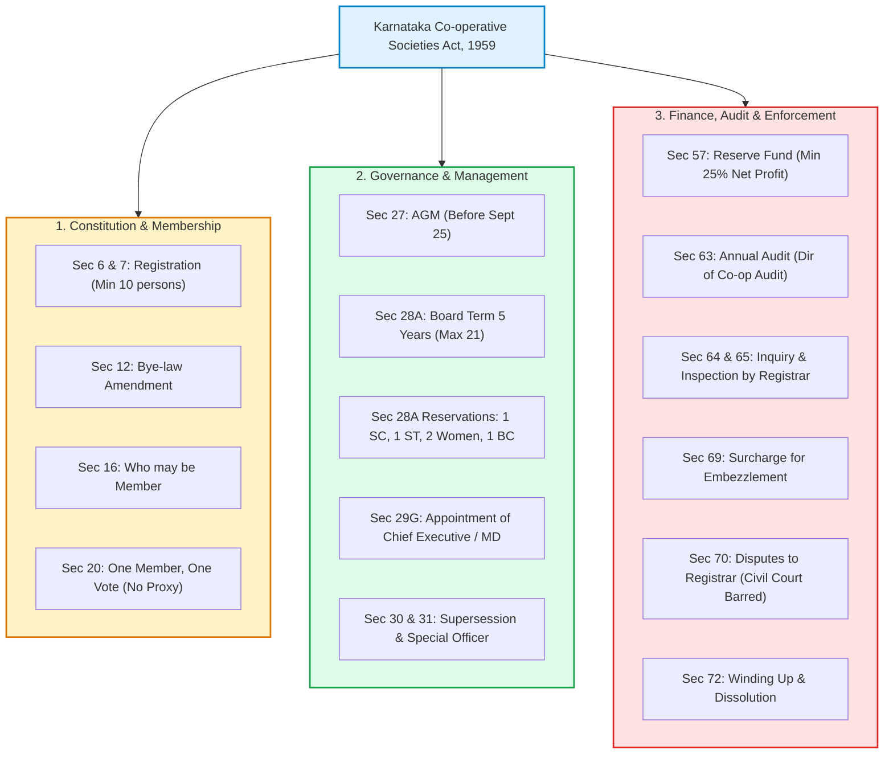
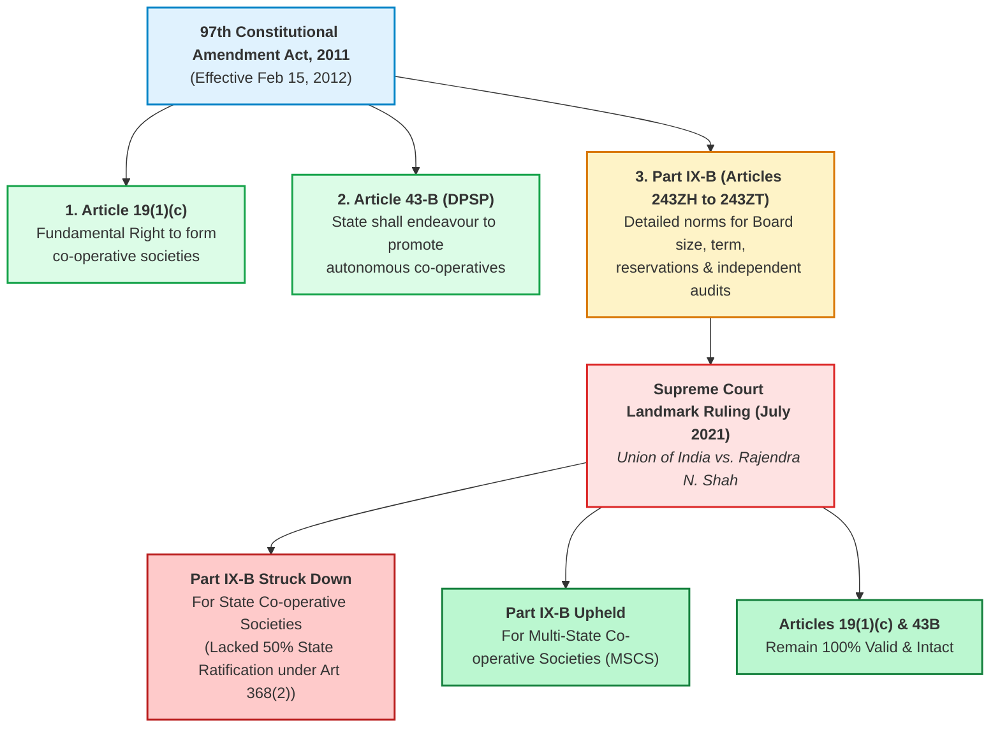
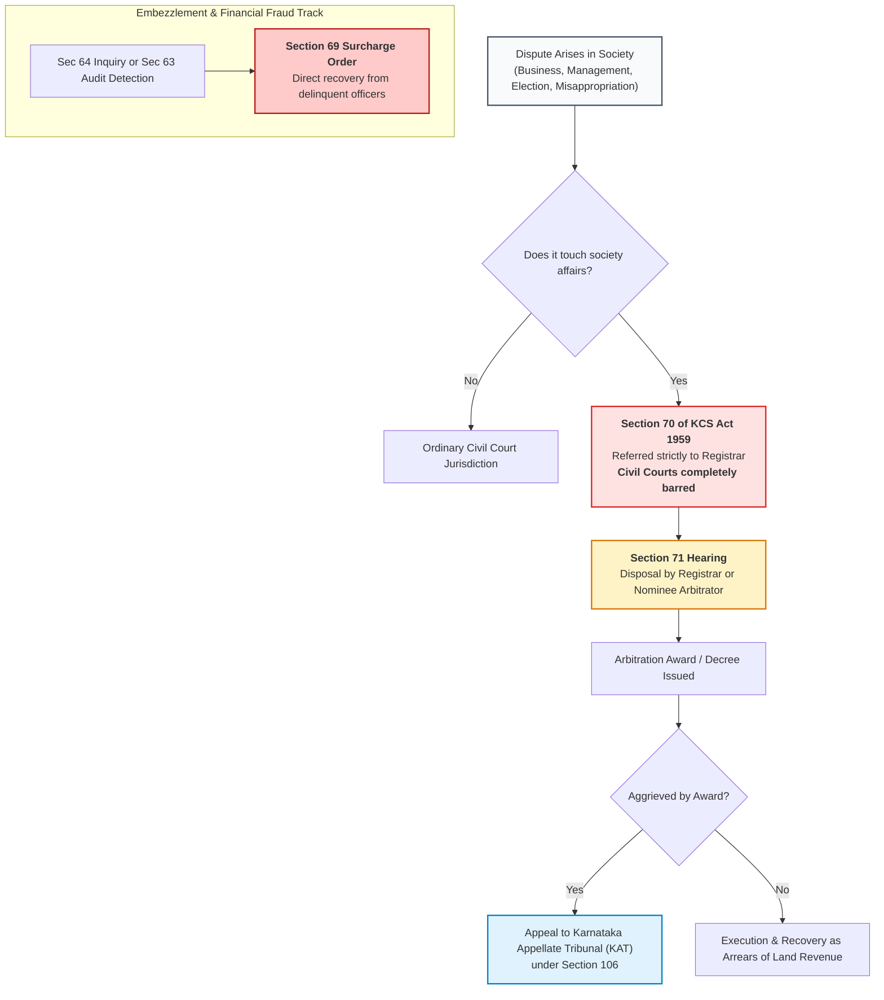

# Co-operative Societies: Movement, Principles & The Karnataka Co-operative Societies Act, 1959

---

## 1. Section Weightage & Typical Question Style

* **Exam Weightage:** **50 Marks (25% of the total written test)** — The single largest deterministic subject in the SHIMUL examination.
* **Core Focus:** History of the cooperative movement (Global, National, Karnataka), 7 ICA Principles, the *Karnataka Co-operative Societies Act, 1959* (key sections, board terms, reservations, audit, inquiry, disputes under Section 70), Constitutional 97th Amendment Act, and the Union Ministry of Cooperation.
* **Typical Question Formats:**
  1. *Section Number Matching:* "Under which section of the KCS Act, 1959, are disputes referred to the Registrar?" (Section 70).
  2. *Governance & Quorum:* Term of the elected Board/Committee (5 years), reservation breakdown on the board (SC/ST/Women), deadline for holding the Annual General Meeting (AGM) (September 25).
  3. *Historical Milestones:* First cooperative society in Karnataka (Kanaginahal, Gadag, 1905), Father of Karnataka Cooperation (Siddanagouda Patil), Father of Indian Cooperation (Sir Frederic Nicholson).
  4. *Constitutional Articles:* Article 19(1)(c), Article 43B, Part IX-B, and Supreme Court's 2021 judgment (*Rajendra N. Shah case*).
  5. *Principles of Cooperation:* Identifying which principle belongs to the 1995 Manchester ICA Declaration.

---

## 2. Core Concepts & Structural Mechanics

### 2.1 The Philosophy & Global Origin of Cooperation
* **What is a Cooperative?**
  * As defined by the International Co-operative Alliance (ICA): *"An autonomous association of persons united voluntarily to meet their common economic, social, and cultural needs and aspirations through a jointly-owned and democratically-controlled enterprise."*
* **The Rochdale Pioneers (1844):**
  * In 1844, in Rochdale, England (Toad Lane), 28 cotton mill weavers formed the **Rochdale Society of Equitable Pioneers** to escape the adulterated, expensive food sold by company merchants.
  * They formulated the foundational "Rochdale Principles": democratic control (one member, one vote), open membership, cash trading, and patronage dividends (sharing profit based on business conducted, not share ownership).
* **International Co-operative Alliance (ICA):**
  * Founded in **1895 in London**. Headquarters is currently in **Brussels, Belgium**.
  * Formulates international principles of cooperation.
* **The 7 Golden Principles of Cooperation (ICA Manchester Declaration, 1995):**
  1. **Voluntary and Open Membership:** Non-discriminatory entry.
  2. **Democratic Member Control:** One Member, One Vote (regardless of capital invested).
  3. **Member Economic Participation:** Capital receives limited compensation; surpluses benefit members in proportion to their transactions.
  4. **Autonomy and Independence:** Self-governing organizations free from state subordination.
  5. **Education, Training, and Information:** Educating members, elected representatives, managers, and youth.
  6. **Cooperation among Cooperatives:** Working together through local, national, regional, and international structures.
  7. **Concern for Community:** Sustainable development through policies approved by members.

> 🔁 Overlap: Tested identically in Karnataka State Cooperative Apex Bank, DCC Bank, and KPSC Cooperative Inspector examinations.

---

### 2.2 History of Cooperation in India & Karnataka

#### The National Landscape
* **Sir Frederic Nicholson's Report (1895–1897):**
  * Appointed by the Madras Presidency to study European land and agricultural banks. His famous conclusion summarized Indian rural revival in three words: *"Find Raiffeisen"* (referring to Friedrich Wilhelm Raiffeisen, father of German rural credit cooperatives).
  * Sir Frederic Nicholson is acclaimed as the **"Father of the Co-operative Movement in India"**.
* **Cooperative Credit Societies Act, 1904:**
  * Enacted during the viceroyalty of **Lord Curzon**. Provided for the formation of agricultural and non-agricultural credit societies only.
* **Cooperative Societies Act, 1912:**
  * Remedied the defects of the 1904 Act by allowing non-credit societies (marketing, dairy, weaving, consumer) and establishing federal secondary unions and central cooperative banks.
* **Montagu-Chelmsford Reforms (1919):**
  * Cooperation was transferred from the Central Government to the **Provincial Governments** (Provincial Subject). To this day, "Cooperative Societies" remains **Entry 32 of List II (State List)** in the Seventh Schedule of the Indian Constitution.

#### The Karnataka Heritage — The Kanaginahal Legacy
* **Kanaginahal Agricultural Credit Cooperative Society (ಕಣಗಿನಹಾಳ):**
  * On **July 8, 1905**, the first agricultural credit cooperative society in the entire Asian subcontinent was registered at **Kanaginahal village** in Gadag district (then part of Bombay Presidency).
  * Founded by **Siddanagouda Sannaramanagouda Patil** (1843–1933) with an initial capital of ₹2,000.
  * Siddanagouda Patil is revered as the **"Father of the Co-operative Movement in Karnataka"** (*ಕರ್ನಾಟಕದ ಸಹಕಾರ ರಂಗದ ಪಿತಾಮಹ*).
  * The society funded early rural infrastructure, including a local village railway halt and safe community drinking water.

---

### 2.3 The Karnataka Co-operative Societies Act, 1959 (KCS Act, 1959)

* **Enactment & Commencement:**
  * Enacted by the Karnataka State Legislature as **Karnataka Act No. 11 of 1959**.
  * Received presidential assent on August 11, 1959, and came into full legal force across the State on **June 1, 1960**.
  * Accompanied by the *Karnataka Co-operative Societies Rules, 1960*.

#### Detailed Statutory Provisions

#### 1. Registration & Bye-Laws (Sections 6, 7 & 12)
* **Registration Criteria (Section 6):** Minimum of 10 persons belonging to different families are required to register a primary society. The society must demonstrate economic viability and promote cooperative principles.
* **Amendment of Bye-laws (Section 12):** No amendment to a society’s bye-laws is legally valid until registered by the Registrar.

#### 2. Membership & Voting Rights (Sections 16 & 20)
* **Who May Become a Member (Section 16):** An individual competent to contract, another cooperative society, the State Government, or a statutory corporation.
* **Voting Principle (Section 20):** Every member possesses strictly **one vote** irrespective of the number of shares held. **Proxy voting is strictly prohibited** under Section 20(2).

#### 3. Governance & Board Composition (Sections 27 & 28A)
* **Annual General Meeting (AGM) (Section 27):** Every cooperative society must convene its general body meeting at least once in every cooperative year before the **25th day of September**.
* **Managing Committee / Board of Directors (Section 28A):**
  * The general management of a society is vested in an elected Board.
  * **Statutory Term of Office:** Exactly **5 years** from the date of election (aligned with the 97th Constitutional Amendment).
  * **Maximum Number of Directors:** Shall not exceed **21 directors** in any society.
  * **Mandatory Statutory Reservations on the Board:**
    * **1 Seat:** Scheduled Castes (SC)
    * **1 Seat:** Scheduled Tribes (ST)
    * **2 Seats:** Women
    * **1 Seat:** Backward Classes (Category A or B)
* **Chief Executive Officer (Section 29G):** Every society must have a Chief Executive (Managing Director / Secretary) who is the custodian of records and responsible for day-to-day operations.
* **Disqualifications for Committee Membership (Section 29C) `[HIGH-YIELD LAW]`: `[LAW]`**
  * *Financial Default:* A member in default to the society or any other cooperative society/bank is strictly barred from contesting or continuing on the board.
  * *Office of Profit:* Holds any paid post or office of profit under the society.
  * *Competing Business:* Directly or indirectly carries on any competing business of the same type as that of the society.
  * *Meeting Absence:* Fails to attend **three consecutive committee meetings** without obtaining leave of absence.
  * *Criminal Conviction:* Convicted of an offence involving moral turpitude with sentence > 6 months (disqualified for 5 years).
* **Supersession / Suspension of Committee (Section 30):** The Registrar has the power to supersede or suspend a board if it persistently defaults, acts contrary to the interests of the society, or fails to discharge statutory duties. Maximum period: **6 months** (1 year for cooperative banks). Prior consultation with financing bank / RBI is mandatory.
* **Special Officer (Section 31):** The State Government or Registrar may appoint a Special Officer for a specified duration to manage affairs when a committee's term expires or cannot be constituted.
* **Co-operative Election Authority (Section 39A) `[LAW]`: `[STATUTE]`** Independent statutory authority headed by the Co-operative Election Commissioner to conduct, superintend, and control all cooperative elections across Karnataka.

#### 4. Financial Structure & Net Profit Distribution (Section 57)
* Every cooperative society earning net profits must compulsorily allocate:
  * **Minimum 25% of Net Profits** to the statutory **Reserve Fund** (Section 57).
  * **Co-operative Education Fund:** Contribution remitted to the Karnataka State Co-operative Federation Ltd.
  * **Maximum Dividend Ceiling:** Dividend payable on equity shares cannot exceed **25%** per annum.

#### 5. Regulatory Oversight, Audit & Surcharge (Sections 63, 64, 65 & 69)
* **Audit (Section 63):** Conducted annually by the **Director of Cooperative Audit** or qualified chartered accountants empanelled by the Director. Completed within **September 1st**.
* **Inquiry (Section 64):** The Registrar may, on their own motion (suo motu), or on the application of a majority of committee members, or not less than **one-third of total members**, hold an inquiry into the working, constitution, and financial condition of the society.
* **Inspection of Books (Section 65):** The Registrar can inspect books on the application of a creditor whose debt is due and unpaid.
* **Surcharge Proceedings (Section 68/69):** Empowers the Registrar to investigate misapplication, misappropriation, breach of trust, or willful negligence by any past or present officer/employee and issue a recovery order with interest (limitation: within 5 years).

#### 6. Dispute Resolution & Bar of Civil Courts (Sections 70, 71 & 118) `[HIGH-YIELD]`
* **Section 70 (Disputes):** Any dispute touching the constitution, management, or business of a cooperative society between members, past members, committee officers, or surety **must be referred to the Registrar of Cooperative Societies**.
* **Section 118 (Total Bar of Civil Court Jurisdiction):** Civil courts have **no jurisdiction** to entertain any suit or proceeding in respect of any dispute covered under Section 70.
* **Section 71:** The Registrar may decide the dispute personally or refer it to a designated arbitrator/nominee. Awards have the force of a civil court decree.
* **Appeals (Section 105):** Appeals against arbitral awards or Registrar orders lie before the **Karnataka Appellate Tribunal (KAT)** within 60 days.

#### 7. Recent Statutory Amendments & Judicial Rulings (2023–2025) `[CURRENT-LAW]`
* **Section 20(2)(b)(v) Defaulter Notice Rule (2023 Amendment):** Society must issue a **30-day demand notice** to a defaulter; the member must clear all dues at least **20 days prior** to the election date to retain voting rights.
* **Section 128A Common Cadre Struck Down:** The Karnataka High Court struck down Section 128A (centralized cadre/recruitment for cooperative employees) as unconstitutional and *ultra vires* Article 19(1)(c), protecting cooperative autonomy.
* *For comprehensive 50+ section reference and rules, see:* [[references/karnataka-cooperative-law-reference|Karnataka Co-operative Law Master Reference]]

---

### 2.4 Constitutional Framework & Recent Legal Precedents

#### Ministry of Cooperation (सहकार से समृद्धि)
* Created on **July 6, 2021**, by the Government of India.
* **Vision / Motto:** *"Sahakar Se Samriddhi"* (Prosperity through Cooperation).
* **First Union Minister of Cooperation:** Shri Amit Shah.
* Mandate: Strengthen cooperative federalism, computerize 63,000+ Primary Agricultural Credit Societies (PACS), and establish national-level export, seed, and organic multi-state cooperatives.

---

### 2.5 Types of Cooperative Structures in Karnataka

1. **Three-Tier Short-Term Rural Credit Structure:**
   * Village: Primary Agricultural Credit Co-operative Societies (PACS).
   * District: District Central Co-operative Banks (DCC Banks — 21 in Karnataka).
   * State: The Karnataka State Co-operative Apex Bank Ltd. (Apex Bank, Bengaluru).
2. **Two-Tier Long-Term Rural Credit Structure:**
   * Taluk: Primary Co-operative Agriculture and Rural Development Banks (PCARD Banks).
   * State: The Karnataka State Co-operative Agriculture and Rural Development Bank (KSCARD Bank).
3. **Dairy Cooperative Structure (Anand Pattern):**
   * Village: Primary Dairy Co-operative Society (DCS).
   * District: District Cooperative Milk Producers' Societies Union (e.g., SHIMUL).
   * State: Karnataka Milk Federation (KMF).
4. **Autonomous Parallel Framework:**
   * *Karnataka Souharda Sahakari Act, 1997:* Enacted to provide complete operational autonomy without government financial interference. Does not report to the regular Registrar but to the *Karnataka State Souharda Federal Cooperative Ltd (KSSFCL)*.

---

## 3. Key Facts & Lists to Memorize

### Master Section Table: KCS Act, 1959

| Section # | Subject Matter / Statutory Power | Statutory Authority / Threshold |
| :---: | :--- | :--- |
| **Sec 6** | Application for registration of co-operative societies | Min 10 individuals from different families |
| **Sec 7** | Registration of societies by the Registrar | Registrar of Co-operative Societies |
| **Sec 12** | Amendment of bye-laws of a co-operative society | Registered by Registrar to take effect |
| **Sec 16** | Persons who may become members | Individuals, societies, State Govt |
| **Sec 20** | Votes of members | **One Member, One Vote (No Proxy)** |
| **Sec 27** | Annual General Meeting (AGM) | On or before **September 25** annually |
| **Sec 28A** | Managing Committee / Board Composition | **Term: 5 Years**; Max: 21 Directors |
| **Sec 28A Res**| Statutory Reservations on Committee | 1 SC, 1 ST, 2 Women, 1 Backward Class |
| **Sec 29C** | **Disqualification for Committee Membership** | Defaulter, office of profit, competing business, 3 absences |
| **Sec 29G** | Appointment of Chief Executive Officer / MD | Society with Registrar guidelines |
| **Sec 30** | **Supersession / Suspension of Committee** | Registrar of Co-operative Societies (Max 6 months) |
| **Sec 31** | Appointment of **Special Officer** | State Govt / Registrar |
| **Sec 39A** | **Co-operative Election Authority** | Independent conduct & superintendence of elections |
| **Sec 57** | Allocation of Net Profits | **Min 25% to Reserve Fund** |
| **Sec 63** | Mandatory Annual **Audit** | Director of Co-operative Audit |
| **Sec 64** | Statutory **Inquiry** | Registrar (Suo motu or on application) |
| **Sec 65** | **Inspection** of books and records | Registrar on creditor's application |
| **Sec 68/69** | **Surcharge** proceedings | Recovery for misapplied/embezzled funds (5-year limit) |
| **Sec 70** | **Disputes** referred to Registrar | **Civil Courts Strictly Excluded** |
| **Sec 71** | Settlement / Disposal of disputes | Registrar or designated Nominee |
| **Sec 72** | **Winding Up** / Liquidation of societies | Registrar of Co-operative Societies |
| **Sec 73** | Appointment of Liquidator | Registrar of Co-operative Societies |
| **Sec 105** | **Appeals to KAT** | Karnataka Appellate Tribunal (60-day limitation) |
| **Sec 118** | **Bar of Jurisdiction of Civil Courts** | Strict bar on matters covered by Sec 70 |
| **Sec 128A** | Common Cadre for Employees (2023) | **Struck down as unconstitutional by Karnataka High Court** |

---

## 4. Mnemonics & Memory Aids

### Mnemonic for Board Reservation (Section 28A):
* **"S-S-W-B"**
  * **S** = 1 Scheduled Caste (SC)
  * **S** = 1 Scheduled Tribe (ST)
  * **W** = 2 Women
  * **B** = 1 Backward Class
  * *(Total reserved seats = 5 seats minimum!)*

### Mnemonic for Enforcement Sections:
* **"A-I-I-S-D"** (Audit → Inquiry → Inspection → Surcharge → Dispute)
  * Sec **63** = **A**udit
  * Sec **64** = **I**nquiry
  * Sec **65** = **I**nspection
  * Sec **69** = **S**urcharge
  * Sec **70** = **D**ispute

### Mnemonic for 3 Slogans & Personalities:
* *India:* Frederic Nicholson → *"Find Raiffeisen"*
* *Karnataka:* Siddanagouda Patil → *Kanaginahal (1905)*
* *Union Ministry:* Amit Shah → *"Sahakar Se Samriddhi"*

---

## 5. Quick Review & Revise: Dispute & Enforcement Lifecycle

---

## 6. Overlap Notes
> 🔁 Overlap: Section 28A, Section 64, and Section 70 are asked in 100% of Karnataka Cooperative examinations (BAMUL, KMF, Apex Bank, Tumakuru Milk Union, KICMA).
> 🔁 Overlap: The 97th Constitutional Amendment details (Art 19(1)(c), Art 43B, Part IX-B) bridge both the "Cooperative Societies" section and the "Indian Constitution" section of the SHIMUL exam.

---

## 7. Sources & Reference Verification
1. *The Karnataka Co-operative Societies Act, 1959 (Karnataka Act No. 11 of 1959) — Bare Act*
2. *The Karnataka Co-operative Societies Rules, 1960*
3. *Supreme Court of India Judgment: Union of India vs. Rajendra N. Shah (Civil Appeal No. 91 of 2021)*
4. *International Co-operative Alliance (ICA) Manchester Declaration on Cooperative Identity (1995)*
5. *Ministry of Cooperation, Government of India: Official Portal & Publications*
6. *Karnataka State Co-operative Federation Limited Annual Compendiums*
