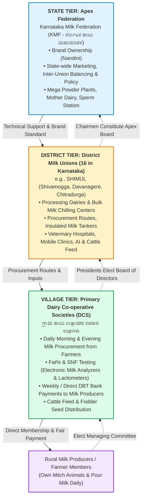
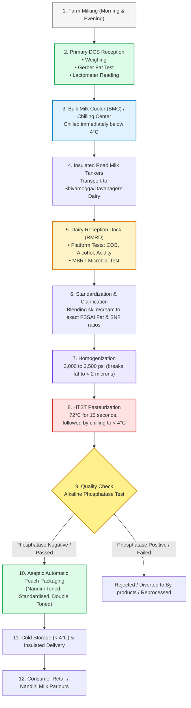

# Dairy Union Functioning, KMF Structure & Dairy Technology

---

## 1. Section Weightage & Typical Question Style

* **Exam Weightage:** **40 to 50 Marks (20% – 25% of the total paper)**.
* **Core Focus:** Organizational hierarchy of the dairy cooperative movement, KMF history, SHIMUL operational footprint, procurement logistics, milk chemistry, pasteurization/preservation, quality control testing, and governmental support schemes.
* **Typical Question Formats:**
  1. *Factual Chronology:* Years of establishment (KDDC in 1974, KMF in 1984, Nandini brand in 1983, Operation Flood phases).
  2. *Quality & Standards (FSSAI):* Minimum Fat and Solids-Not-Fat (SNF) percentages across standard milk categories (Toned, Double Toned, Full Cream).
  3. *Processing Parameters:* Temperatures and holding times for pasteurization (LTLT, HTST, UHT) and the specific enzyme used to verify pasteurization efficiency (Alkaline Phosphatase).
  4. *Institutional Architecture:* Roles and interrelations between primary DCS, District Milk Unions (16 in Karnataka), and the Apex Federation (KMF).
  5. *State Dairy Schemes:* Beneficiary criteria and milk quotas for *Ksheera Bhagya*, incentive amounts for *Ksheera Dhare*.

---

## 2. Core Concepts & Structural Mechanics

### 2.1 The White Revolution & The Anand Pattern Model
* **The Problem It Solved:**
  * Prior to the cooperative model, milk producers were exploited by private middlemen and contractors who manipulated lactometer readings, paid seasonal flush-period throwaway prices, and left farmers with unsold surpluses.
  * In 1946, farmers in Kaira (Gujarat) revolted under the guidance of **Sardar Vallabhbhai Patel** and **Tribhuvandas Patel**, establishing the Kaira District Co-operative Milk Producers' Union (**Amul**).
* **The "Anand Pattern" Philosophy:**
  * The model is farmer-owned and professionally managed. Producers control the entire value chain—from procurement and processing to branding and retail marketing. Surplus profits return directly to the milk producer as annual patronage dividends.
* **National Expansion — Operation Flood:**
  * **National Dairy Development Board (NDDB):** Set up in 1965 at Anand, Gujarat. **Dr. Verghese Kurien** was appointed founding Chairman by Prime Minister Lal Bahadur Shastri.
  * **Operation Flood (Launched in 1970):** The world’s largest agricultural development program. Financed by monetizing donated European Economic Community (EEC) skimmed milk powder and butter oil.
    * *Phase I (1970–1980):* Connected 18 major rural milk sheds to metropolitan consumer markets (Delhi, Mumbai, Kolkata, Chennai).
    * *Phase II (1981–1985):* Expanded to 136 milk sheds, establishing self-sustaining district unions and cold chains.
    * *Phase III (1985–1996):* Upgraded infrastructure, veterinary health, cattle feed production, and artificial insemination. Turned India into the world’s largest milk producer by 1998.

> 🔁 Overlap: Tested in BAMUL, TUMUL, MYMUL, and National Cooperative Development Corporation (NCDC) exams — Dr. Kurien's role and Operation Flood phases are perennial favorites.

---

### 2.2 The Three-Tier Cooperative Dairy Hierarchy

The Anand pattern is organized into three distinct, democratically linked legal tiers:



#### Tier 1: Primary Dairy Co-operative Society (DCS / ಗ್ರಾಮ ಹಾಲು ಉತ್ಪಾದಕರ ಸಹಕಾರ ಸಂಘ)
* **Location & Membership:** Operates at the village level. Membership is open strictly to rural dairy farmers who own milk-producing animals and commit to pouring a minimum volume of milk per year (typically 180 days or 500 liters).
* **Key Functions:**
  * Twice-daily milk procurement (morning and evening).
  * Automated testing of fat and SNF using electronic milk analyzers and lactometers.
  * Instant or weekly digital payment directly to farmers' bank accounts.
  * Distribution of balanced cattle feed (Nandini Cattle Feed), fodder seeds, and mineral mixtures.
  * First-aid veterinary assistance and artificial insemination (AI) services.
* **Governance:** Administered by an elected Managing Committee of village milk producers and managed daily by an appointed Secretary and Milk Tester.

#### Tier 2: District Co-operative Milk Producers' Societies Union (e.g., SHIMUL)
* **Territorial Jurisdiction:** Encompasses one or more revenue districts (SHIMUL covers Shivamogga, Davanagere, and Chitradurga).
* **Key Functions:**
  * Organizes and registers new village DCS units.
  * Operates milk transport routes using insulated milk tankers to collect milk twice daily from DCS units.
  * Runs Bulk Milk Coolers (BMCs) and Chilling Centers to drop raw milk temperature to below 4°C immediately, preventing bacterial spoilage.
  * Processes, pasteurizes, homogenizes, and packages liquid milk and short-shelf-life fresh products.
  * Operates veterinary hospitals, emergency mobile veterinary clinics, and semen banks for animal breeding.
* **Governance:** Administered by a Board of Directors elected from among the Presidents of the member village DCS units, led by an elected Chairman and managed by an appointed Managing Director.

#### Tier 3: State Apex Federation — Karnataka Milk Federation (KMF)
* **Scope & Character:** Apex federation representing all 16 District Cooperative Milk Unions in Karnataka.
* **Key Functions:**
  * Owns, safeguards, and promotes the premier brand name **"Nandini"**.
  * Formulates statewide pricing and dairy policy in consultation with the State Government.
  * Handles statewide marketing, inter-district milk balancing, and national/international exports.
  * Operates mega manufacturing units: Central Product Dairies, Cattle Feed Plants (CFP), Mother Dairy (Yelahanka), Nandini Sperm Station (Hessarghatta), and Mega Milk Powder Plants.
  * Implements government-funded social welfare programs (e.g., *Ksheera Bhagya*).

> 🔁 Overlap: Almost every KMF union exam asks: *"Who owns the brand name Nandini?"* (Answer: KMF) and *"What is the structural relationship between DCS, District Union, and KMF?"* (Answer: 3-Tier Anand Pattern).

---

### 2.3 Evolution of KMF & SHIMUL Footprint

#### Chronology of Dairy Development in Karnataka
1. **1974 (KDDC):** The Government of Karnataka launched the Karnataka Dairy Development Project with financial assistance from the World Bank (IDA credit of $30 million). To execute this, the **Karnataka Dairy Development Corporation (KDDC)** was incorporated on **June 10, 1974**. This marked the formal adoption of the Anand pattern in South India.
2. **1983 (Brand Nandini):** The brand name **"Nandini"** (symbolizing the divine wish-fulfilling cow) was introduced for liquid milk and milk products.
3. **1984 (KMF Restructuring):** KDDC was converted into a full-fledged three-tier cooperative apex structure under the Karnataka Co-operative Societies Act, renamed as the **Karnataka Co-operative Milk Producers' Federation Limited (KMF)**.
4. **Current Status:** KMF is the **second-largest dairy cooperative in India** (surpassed only by Amul/GCMMF in Gujarat) and ranks first in South India. Daily milk procurement exceeds 85 to 90 lakh kilograms per day during peak flush seasons.

#### SHIMUL Specifics (Shivamogga, Davanagere & Chitradurga District Milk Union)
* **Inception:** Registered under the Karnataka Co-operative Societies Act, 1959. Officially began operations on **March 16, 1988**.
* **Operation Flood-III Handover:** On **August 1, 1991**, the Government of Karnataka formally transferred the Shivamogga Main Dairy and chilling facilities to the elected Milk Union.
* **Administrative Head Office & Mother Dairy:** **Machenahalli**, Nidige Post, Shivamogga – 577222.
* **Key Dairy Plants:**
  * *Shivamogga Dairy (Machenahalli):* Primary processing, packing, and product manufacturing hub.
  * *Davanagere Dairy:* Major processing plant servicing Davanagere urban and rural consumers.
* **Chilling Centers & BMC Network:**
  * Strategically located at Chitradurga, Honnali, Anandapura, Tadagani, Challakere, Hosadurga, and Sagar to rapidly chill milk procured from over 1,000+ active primary DCS units.

---

### 2.4 Dairy Science, Processing Pipeline & Quality Assurance



#### Physical & Chemical Composition of Milk
* **Principal Constituents:** Water (~87%), Milk Fat (~3.5%–4.5% in cow, 6.5%–8.0% in buffalo), Solids-Not-Fat (SNF: Protein/Casein, Lactose/Milk Sugar, Minerals, Vitamins) (~8.5%–9.0%).
* **Acidity & pH:** Fresh raw milk has a normal pH of **6.6 to 6.8** and a titratable natural acidity of **0.14% to 0.16%** lactic acid equivalent. Acidity above 0.18% indicates bacterial fermentation and souring.
* **Major Milk Protein:** **Casein** (exists as calcium caseinate-phosphate micelles; accounts for ~80% of total milk protein).
* **Milk Sugar:** **Lactose** (a disaccharide composed of Glucose + Galactose). Fermented by *Lactobacillus* into lactic acid during curdling.

#### Standard Milk Categories (FSSAI Regulations Table)

| Milk Variant | Nandini Brand Identity | Minimum Milk Fat (%) | Minimum SNF (%) | Description / Nutritive Profile |
| :--- | :--- | :---: | :---: | :--- |
| **Double Toned Milk** | Smart / Yellow / Orange Stripe | **1.5%** | **9.0%** | Low calorie, high protein |
| **Toned Milk** | Standard Blue Pouch | **3.0%** | **8.5%** | Universal standard table milk |
| **Homogenised Cow Milk** | Green Pouch | **3.5%** | **8.5%** | Pure cow milk, homogenized |
| **Standardised Milk** | Orange Pouch | **4.5%** | **8.5%** | Balanced rich milk for tea/coffee |
| **Full Cream Milk (Samrudhi)**| Purple / Red Pouch | **6.0%** | **9.0%** | High fat, traditional sweets |

#### Thermal Processing & Preservation Methods
1. **Chilling (< 4°C):** Does not kill microorganisms, but bacteriostatic cooling halts the enzymatic activity and multiplication of mesophilic bacteria between farm milking and dairy reception.
2. **Pasteurization:** Heating raw milk to a specific temperature and holding it for a predetermined time to destroy all pathogenic organisms (notably *Mycobacterium tuberculosis* and *Coxiella burnetii*) without altering the nutritive value or chemical structure.
   * **LTLT (Low Temperature Long Time / Batch Method):** Heated to **63°C (145°F)** and held for **30 minutes**.
   * **HTST (High Temperature Short Time / Continuous Plate Heat Exchanger):** Heated to **72°C (161°F)** and held for **15 seconds**, followed by immediate regeneration chilling to < 4°C.
   * **UHT (Ultra High Temperature / Aseptic Sterilization - Nandini GoodLife):** Heated to **135°C – 150°C** for **1 to 2 seconds**, packaged in sterile multi-layer Tetra Pak aseptic cartons. Shelf life: **90 to 180 days** without refrigeration!
3. **Homogenization:** Passing milk under hydraulic pressure of **2,000 to 2,500 psi (140–175 kg/cm²)** through a microscopic orifice. Shatters fat globules from 4–10 microns down to under 2 microns, preventing cream separation (creaming layer) and giving uniform body and white appearance.

#### Crucial Quality Verification Tests
* **Gerber Test:** Quantitative measurement of fat percentage using a butyrometer and adding concentrated Sulphuric Acid ($H_2SO_4$, sp. gr. 1.82) and Amyl Alcohol. Centrifuged at 1100 RPM.
* **Lactometer Reading (CLR):** Measures specific gravity to detect water addition (adulteration) or solids skimming. Normal cow milk specific gravity: **1.028 to 1.032**.
* **Alkaline Phosphatase Test:** **The gold-standard verification test for pasteurization efficiency.** The native milk enzyme *alkaline phosphatase* has a heat-inactivation threshold slightly higher than pathogenic bacteria (*Mycobacterium tuberculosis*). If phosphatase is completely inactivated (negative result), pasteurization is guaranteed complete and safe.
* **Methylene Blue Reduction Test (MBRT):** Assesses microbial quality. Dye is added; active bacteria consume dissolved oxygen, reducing blue methylene dye to colorless leucomethylene blue. The longer it takes to decolorize (> 5 hours = Excellent; < 30 mins = Very Poor), the lower the bacterial count.
* **Clot-on-Boiling (COB) & Alcohol Test:** Detects developed acidity and heat-instability prior to bulk tank pumping.

---

### 2.5 Flagship Government Schemes in Karnataka Dairy

#### 1. Ksheera Bhagya Scheme (ಕ್ಷೀರ ಭಾಗ್ಯ ಯೋಜನೆ)
* **Launch Date:** **August 1, 2013** (initiated by Chief Minister Siddaramaiah).
* **Objectives:** Eradicate malnutrition among school children and pre-schoolers while providing an assured, steady institutional market for excess milk procured by KMF unions.
* **Modality:** Provides **150 ml of hot boiled milk per child per day, 5 days a week** to children studying from 1st to 10th standard in Government / Government-aided schools, and children aged 6 months to 6 years in Anganwadi centers.
* **Product Form:** Disbursed in the form of fortified Nandini Skimmed Milk Powder (SMP) and Whole Milk Powder (WMP) converted into liquid milk at schools.

#### 2. Ksheera Dhare Scheme (Milk Producer Incentive / ಪ್ರೋತ್ಸಾಹ ಧನ)
* **Mechanics:** Direct Benefit Transfer (DBT) subsidy paid directly from the Karnataka State exchequer to the bank account of every registered milk producer pouring milk at primary village DCS.
* **Incentive Rate:** Initiated at ₹2/liter in 2008 (BS Yediyurappa government), enhanced progressively to ₹4, ₹5, and ₹5+ per liter. Ensures farmers stay profitable even when global dairy feed commodity prices escalate.

#### 3. Pashu Sanjeevini (ಪಶು ಸಂಜೀವಿನಿ)
* 24/7 dedicated emergency veterinary health helpline (1962) and toll-free GPS-enabled mobile veterinary clinics delivering surgical, gynecological, and medical treatment directly to farmers' doorsteps.

---

## 3. Key Facts & Lists to Memorize

### 16 District Cooperative Milk Unions under KMF
1. **SHIMUL** (Shivamogga, Davanagere, Chitradurga)
2. **BAMUL** (Bengaluru Urban, Bengaluru Rural, Ramanagara)
3. **MYMUL** (Mysuru)
4. **MANMUL** (Mandya)
5. **HAMUL / HIMUL** (Hassan)
6. **TUMUL** (Tumakuru)
7. **KOMUL** (Kolar, Chikkaballapura)
8. **DKMUL** (Dakshina Kannada, Udupi - Mangaluru)
9. **BEMUL** (Belagavi)
10. **DMUL** (Dharwad, Gadag, Uttara Kannada)
11. **VIMUL** (Vijayapura, Bagalkote)
12. **KMUL** (Kalaburagi, Bidar, Yadgir)
13. **RBKMUL** (Raichur, Ballari, Koppal, Vijayanagara)
14. **CHAMUL** (Chamarajanagar)
15. **HAVMUL** (Haveri)
16. **CHIKMUL** (Chikkamagaluru — newly separated unit)

### Quick Dairy Physical & Thermal Parameters Table

| Parameter | Standard Value | Operational Context |
| :--- | :--- | :--- |
| **Normal Specific Gravity of Milk** | **1.028 – 1.032 at 20°C** | Detected using Quevenne Lactometer |
| **Freezing Point of Pure Cow Milk** | **-0.540°C to -0.555°C** | Cryoscope test to detect added water |
| **Acidity of Fresh Milk** | **0.14% to 0.16%** | Lactic acid equivalent (pH: 6.6 – 6.8) |
| **LTLT Pasteurization Temp & Time** | **63°C for 30 minutes** | Batch holder method |
| **HTST Pasteurization Temp & Time** | **72°C (71.7°C) for 15 seconds** | Continuous plate heat exchanger |
| **UHT Sterilization Temp & Time** | **135°C – 150°C for 1 – 2 seconds** | Aseptic cartons (GoodLife) |
| **Homogenization Pressure** | **2,000 to 2,500 psi (140 to 175 bar)** | Reduces fat globules to < 2 microns |

### Key Historical Milestones
* **1946:** Amul (Kaira Union) established at Anand.
* **1965:** NDDB established at Anand (Dr. Verghese Kurien).
* **1970:** Operation Flood launched nationwide.
* **1974 (June 10):** Karnataka Dairy Development Corporation (KDDC) incorporated.
* **1983:** Brand Name "Nandini" introduced.
* **1984:** KDDC transformed into KMF.
* **1988 (March 16):** SHIMUL commenced operations.
* **1991 (August 1):** SHIMUL takes over Shivamogga Dairy under Operation Flood III.
* **2013 (August 1):** *Ksheera Bhagya* scheme launched.
* **June 1:** World Milk Day (FAO).
* **November 26:** National Milk Day (Dr. Verghese Kurien’s birth anniversary).

---

## 4. Mnemonics & Memory Aids

### Mnemonic for FSSAI Fat Percentages (Ascending Order):
* **"Double Tea Standards Fill"**
  * **Double** Toned = **1.5%** Fat
  * **T**oned = **3.0%** Fat
  * **Standard**ised = **4.5%** Fat
  * **F**ull Cream = **6.0%** Fat
  * *(Notice the clean 1.5% jump each time: 1.5 → 3.0 → 4.5 → 6.0!)*

### Mnemonic for Three Tiers:
* **"V-D-S" (Village - District - State)**
  * **V**illage = **DCS** (Primary Dairy Cooperative Society)
  * **D**istrict = **Union** (SHIMUL, BAMUL, etc.)
  * **S**tate = **Apex Federation** (KMF)

### Mnemonic for Alkaline Phosphatase:
* **"P-P-P"** -> **P**asteurization **P**erfection = **P**hosphatase enzyme absent!

---

## 5. Quick Review & Revise: Quality Control Decision Flow

```mermaid
flowchart TD
    Sample["Raw Milk Sample at Dairy Dock"] --> T1{"Acidity Test (COB / Alcohol)"}
    T1 -->|Curdles / Acidic (>0.18%)| Sour["Reject for Liquid Milk / Use for Ghee/Casein"]
    T1 -->|Stable (<0.16%)| T2{"Lactometer Test (CLR)"}
    
    T2 -->|CLR < 1.028| Diluted["Adulterated with Water / Penalty to DCS"]
    T2 -->|CLR 1.028 - 1.032| Normal["Normal Specific Gravity"]
    
    Normal --> T3["Gerber Fat% Test"]
    T3 --> T4["MBRT Microbial Quality Test"]
    
    T4 -->|Decolorizes in < 30 Mins| Poor["Very Poor Quality Milk"]
    T4 -->|Decolorizes in > 5 Hours| Excellent["Excellent Microbial Grade -> Processing"]
    
    Excellent --> PastProc["HTST Pasteurization (72°C / 15s)"]
    PastProc --> T5{"Alkaline Phosphatase Test"}
    
    T5 -->|Positive (Enzyme Active)| FailPast["Pasteurization Incomplete / Danger"]
    T5 -->|Negative (Enzyme Destroyed)| SafePast["Safe Standard Nandini Milk -> Packaging"]

    style Sample fill:#f8fafc,stroke:#475569,stroke-width:2px
    style Sour fill:#fee2e2,stroke:#dc2626,stroke-width:2px
    style Diluted fill:#fee2e2,stroke:#dc2626,stroke-width:2px
    style Poor fill:#fef3c7,stroke:#d97706,stroke-width:2px
    style Excellent fill:#dcfce7,stroke:#16a34a,stroke-width:2px
    style SafePast fill:#dbeafe,stroke:#2563eb,stroke-width:2px
    style FailPast fill:#fee2e2,stroke:#dc2626,stroke-width:2px
```

---

## 6. Overlap Notes
> 🔁 Overlap: Tested identically in BAMUL, TUMUL, MYMUL, KOMUL, and KPSC Departmental tests for the Department of Animal Husbandry & Dairying.
> 🔁 Overlap: FSSAI fat/SNF standards and pasteurization time-temperatures are standard across all Food Safety Officer (FSO) and Dairy Technologist competitive exams nationwide.

---

## 7. Sources & Reference Verification
1. *Official Portal of Karnataka Milk Federation:* [kmfnandini.coop](https://www.kmfnandini.coop)
2. *Official Portal of SHIMUL:* [shimul.coop](https://www.shimul.coop)
3. *National Dairy Development Board (NDDB) Operation Flood Milestones Repository*
4. *Food Safety and Standards (Food Products Standards and Food Additives) Regulations, 2011 (FSSAI)*
5. *ICAR & NDRI Dairy Technology Course Manuals (Milk Processing and Quality Assurance)*
6. *Government of Karnataka, Department of Animal Husbandry & Veterinary Services Annual Reports*
