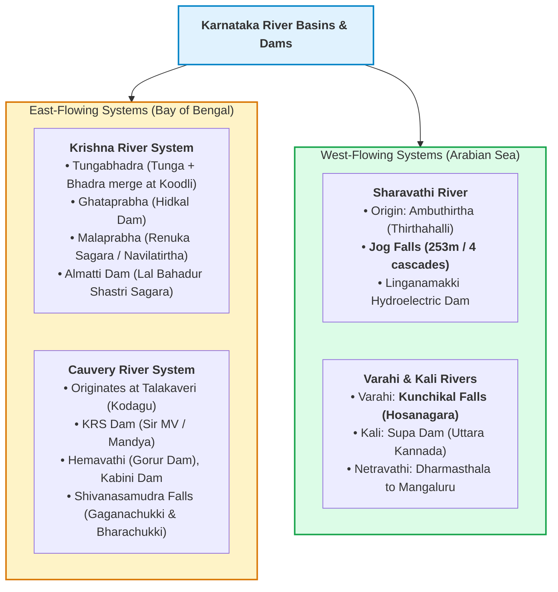
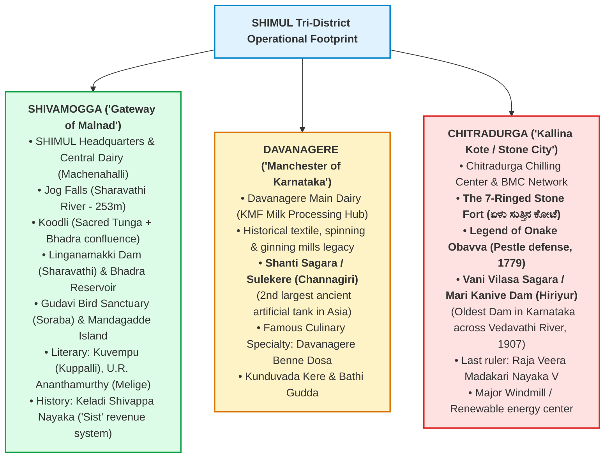
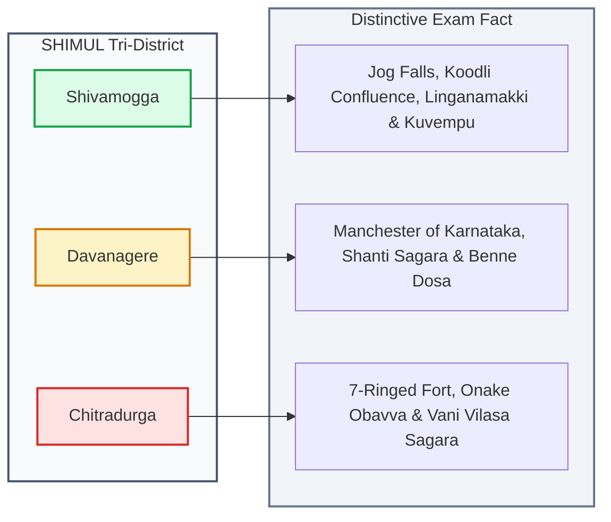

# General Knowledge: Karnataka Profile, Regional Focus (SHIMUL Area) & Current Affairs

---

## 1. Section Weightage & Typical Question Style

* **Exam Weightage:** **20 to 25 Marks (10% – 12.5% of the total written test)**.
* **Core Focus:** Karnataka state geography and river systems, local heritage of the SHIMUL operational districts (**Shivamogga, Davanagere, Chitradurga**), state symbols, historical dynasties, the *Panch Guarantee* welfare schemes, and static GK (Jnanpith awardees, important observances).
* **Typical Question Formats:**
  1. *Regional Geography & Waterfalls:* "On which river is the world-famous Jog Falls situated?" (Sharavathi); "Which is the second-largest ancient irrigation tank in Asia located in Davanagere?" (Shanti Sagara / Sulekere).
  2. *Local Forts & History:* "Who was the brave woman who defended Chitradurga Fort with a pestle (onake) against Hyder Ali's troops?" (Onake Obavva); "Where is the confluence of Tunga and Bhadra rivers?" (Koodli in Shivamogga).
  3. *State Historical Milestones:* Year of formation of Mysore State (Nov 1, 1956) and renaming as Karnataka (Nov 1, 1973 under CM D. Devaraj Urs); First stone inscription in Kannada (*Halmidi inscription*, 450 AD).
  4. *Government Schemes & Welfare:* Financial benefit provided under *Gruha Lakshmi* (₹2,000/month); Objective of *Shakti Scheme* (free bus transport for women).
  5. *Commemorative Days:* World Milk Day (June 1), National Milk Day (November 26), All India Cooperative Week (November 14–20).

---

## 2. Core Concepts & Structural Mechanics

### 2.1 Karnataka State Profile & Geographic Divisions
* **Geographical Span:**
  * Area: **1,91,791 sq km** (Accounts for **5.83% of India's total geographical area**; ranks **6th largest state** in India).
  * Coastline: Approximately **320 km** along the Arabian Sea (*Karavali*).
  * Boundaries: Bordered by 6 states — Maharashtra (North), Goa (North-West), Kerala (South-West), Tamil Nadu (South/South-East), Andhra Pradesh (East), and Telangana (North-East).
* **Physiographic Zones:**
  1. **Karavali (Coastal Strip):** High rainfall, marine resources, ports (New Mangalore Port).
  2. **Malnad (Western Ghats / Sahyadri):** Global biodiversity hotspot, evergreen rainforests, river headwaters, plantation crops (coffee, arecanut, spices). Highest peak: **Mullayanagiri (1,925 m)** in the Bababudangiri range, Chikkamagaluru district.
  3. **Maidan (Plains):** Divided into *Northern Maidan* (black cotton soil / Deccan trap, drought-prone) and *Southern Maidan* (red loamy soil, tank irrigation).

---

### 2.2 Regional Deep-Dive: The SHIMUL Tri-District Footprint
*Understanding these three operational districts is critical for SHIMUL local general knowledge questions:*

#### 1. Shivamogga District (ಶಿವಮೊಗ್ಗ)
* **Identity:** Known as the **"Gateway of Malnad"** (*ಮಲೆನಾಡಿನ ಹೆಬ್ಬಾಗಿಲು*) and the **"Rice Bowl of Karnataka"**.
* **Administrative Nexus:** Head office and mother dairy of SHIMUL are situated at **Machenahalli**, Nidige Post, Shivamogga.
* **Geographical & Engineering Landmarks:**
  * **Koodli:** Sacred confluence point where the rivers **Tunga** and **Bhadra** unite to form the Tungabhadra River.
  * **Jog Falls:** Highest plunge waterfall in Karnataka, formed by the Sharavathi River in Sagar taluk.
  * **Linganamakki Dam:** Constructed across the Sharavathi River in 1964; feeds the Mahatma Gandhi and Sharavathi Hydroelectric generating stations.
  * **Bhadra Dam (B.R. Project):** Built across the Bhadra River at Lakkavalli / Tarikere border, providing extensive irrigation and water supply.
  * **Gajanur Dam:** Built across the Tunga River near Shivamogga city.
* **Wildlife & Ecology:**
  * **Gudavi Bird Sanctuary:** Located in Soraba taluk; famous for nesting migratory water birds.
  * **Mandagadde Bird Sanctuary:** Natural river island sanctuary on the Tunga River.
  * **Tyavarekoppa Lion and Tiger Safari:** Located on the Shivamogga-Sagar highway.
  * **Bhadra Wildlife Sanctuary (Muthodi):** Major Project Tiger habitat spanning Shivamogga and Chikkamagaluru.
* **Literary & Cultural Luminary Heritage:**
  * **Kuvempu (K.V. Puttappa):** First Kannada writer to win the prestigious **Jnanpith Award (1967)** for his modern epic *Sri Ramayana Darshanam*. His ancestral home *Kavishaila* is at Kuppalli, Thirthahalli taluk.
  * **U.R. Ananthamurthy:** Renowned novelist (*Samskara*) and Jnanpith laureate (1994), hailed from Melige in Thirthahalli.
  * **G.S. Shivarudrappa:** Revered *Rashtrakavi* and literary critic, born in Shikaripura.
  * **Keladi & Ikkeri Dynasties:** Famous Nayaka rulers of Malnad. **Keladi Shivappa Nayaka** pioneered the historic land revenue assessment system known as **"Sist"** (*ಶಿವಪ್ಪ ನಾಯಕನ ಶಿಸ್ತು*). **Rani Chennamma of Keladi** gave refuge to Chhatrapati Rajaram (son of Shivaji Maharaj) against the Mughal armies of Aurangzeb.

#### 2. Davanagere District (ದಾವಣಗೆರೆ)
* **Identity:** Historically acclaimed as the **"Manchester of Karnataka"** because of its thriving textile, spinning, and cotton ginning mills.
* **Formation:** Carved out on **August 15, 1997**, by bifurcating taluks from Chitradurga, Shivamogga, and Harapanahalli (from Ballari).
* **Famous Landmarks:**
  * **Shanti Sagara (Sulekere / ಸೂಳೆಕೆರೆ):** Situated in Channagiri taluk. Built in the 11th–12th century by Princess Shanthava. Recognised as the **second-largest ancient artificial irrigation tank in Asia**, with a water spread area exceeding 6,500 acres.
  * **Kunduvada Kere:** Major scenic water reservoir supplying drinking water to Davanagere city.
  * **Culinary Fame:** World-renowned for **Davanagere Benne Dosa** (Butter Dosa).
  * **Davanagere Dairy:** Major milk processing and product distribution dairy under SHIMUL.

#### 3. Chitradurga District (ಚಿತ್ರದುರ್ಗ)
* **Identity:** Popularly hailed as the **"Kallina Kote"** (The Stone Fort / City of Stone) and **"Chinmuladri"**.
* **The Seven-Ringed Fort (ಏಳು ಸುತ್ತಿನ ಕೋಟೆ):**
  * Massive granite fortification featuring 19 gateways, 38 postern gates, and 35 secret entrances, built between the 10th and 18th centuries by the Rashtrakutas, Chalukyas, Hoysalas, and expanded by the Nayakas of Chitradurga.
* **The Legend of Onake Obavva (ಒನಕೆ ಓಬವ್ವ):**
  * The epitome of Karnataka woman warrior valor. In 1779, during the siege of Chitradurga Fort by Hyder Ali’s troops, Obavva (wife of watchman Kahale Mudda Hanuma) spotted enemy soldiers stealthily entering through a secret rocky crevice (*Kindi*).
  * Armed only with a wooden pestle (**Onake**), she struck down each infiltrating soldier as their head emerged through the narrow opening, preventing the fall of the fort until discovered. The crevice is revered today as **"Onake Obavvana Kindi"**.
* **The Nayakas of Chitradurga:** The valorous local dynasty whose last reigning king was **Raja Veera Madakari Nayaka V**.
* **Vani Vilasa Sagara (Mari Kanive Dam / ಮಾರಿ ಕಣಿವೆ ಅಣೆಕಟ್ಟು):**
  * Located across the **Vedavathi River** in Hiriyur taluk.
  * **Oldest dam in Karnataka.** Constructed between 1898 and 1907 by the Mysore Wadiyars under the regency of Maharani Kempananjammanni (Vani Vilasa) and Nalwadi Krishnaraja Wadiyar. Designed by Chief Engineer Sir M. Visvesvaraya / Col. Ellis.
* **Renewable Energy:** Known as Karnataka's "Windmill City" due to extensive wind turbine farms across the rocky hills.

---

### 2.3 Karnataka State Symbols & Cultural Milestones

| State Symbol Category | Official State Emblem / Entity | Scientific / Historical Identity |
| :--- | :--- | :--- |
| **State Emblem** | **Gandaberunda (ಗಂಡಭೇರುಂಡ)** | Two-headed mythical bird symbolizing immense power |
| **State Animal** | **Asian Elephant (ಏಷ್ಯನ್ ಆನೆ)** | *Elephas maximus* |
| **State Bird** | **Indian Roller / Blue Jay (ನೀಲಕಂಠ / ಕಾಡುಗುಬ್ಬಿ)** | *Coracias benghalensis* |
| **State Flower** | **Lotus (ಕಮಲ)** | *Nelumbo nucifera* |
| **State Tree** | **Sandalwood Tree (ಶ್ರೀಗಂಧ)** | *Santalum album* ("Gandhada Gudi") |
| **State Butterfly** | **Southern Birdwing (ದಕ್ಷಿಣದ ಹಕ್ಕಿರೆಕ್ಕೆ ಚಿಟ್ಟೆ)** | *Troides minos* (India’s second largest butterfly) |
| **State Anthem** | **"Jaya Bharata Jananiya Tanujate"** | Composed by Rashtrakavi Kuvempu |

#### Milestones in Karnataka History & Literature
* **Halmidi Inscription (450 AD):** Discovered near Belur in Hassan district; the **oldest available stone inscription written in ancient Kannada script**.
* **Kavirajamarga (850 AD):** The earliest surviving literary work on poetics and grammar in Kannada, composed during the reign of Rashtrakuta king **Amoghavarsha Nrupatunga** (written by Sri Vijaya). Contains the famous line: *"ಕಾವೇರಿಯಿಂದಮಾ ಗೋದಾವರಿವರಮಿರ್ಪ ನಾಡದಾ ಕನ್ನಡದೊಳ್"* (The land of Kannada extends from the Cauvery to the Godavari).
* **State Formation & Renaming:**
  * **November 1, 1956:** Formation of unified **Mysore State** under the States Reorganisation Act (incorporating Bombay Karnataka, Hyderabad Karnataka, Madras Karnataka, and Coorg).
  * **November 1, 1973:** Renamed as **Karnataka** under the visionary leadership of Chief Minister **D. Devaraj Urs**.

#### Jnanpith Award Laureates from Karnataka (Total: 8)
Karnataka holds the prestigious distinction of having the second-highest number of Jnanpith awards in India (8 recipients):
1. **Kuvempu (1967):** For *Sri Ramayana Darshanam* (First Kannada recipient).
2. **Da. Ra. Bendre (1973):** For *Naku Tanti*.
3. **K. Shivaram Karanth (1977):** For *Mookajjiya Kanasugalu*.
4. **Masti Venkatesha Iyengar (1983):** For *Chikkaveera Rajendra*.
5. **V. K. Gokak (1990):** For *Bharatha Sindhu Rashmi*.
6. **U. R. Ananthamurthy (1994):** For comprehensive lifetime contribution to literature.
7. **Girish Karnad (1998):** For dramatic literature and theatre works.
8. **Chandrashekhara Kambara (2010):** For comprehensive literary contribution.

---

### 2.4 Karnataka State Government Flagship Schemes

#### The "Panch Guarantee" Schemes (ಪಂಚ ಗ್ಯಾರಂಟಿ ಯೋಜನೆಗಳು)
1. **Gruha Jyothi (ಗೃಹ ಜ್ಯೋತಿ):**
   * Provides **up to 200 units of free electricity** every month to all domestic household consumers in Karnataka.
2. **Gruha Lakshmi (ಗೃಹ ಲಕ್ಷ್ಮಿ):**
   * Direct cash transfer of **₹2,000 per month** into the bank accounts of women who are the designated heads of households (holding BPL, APL, or Antyodaya ration cards).
3. **Shakti Scheme (ಶಕ್ತಿ ಯೋಜನೆ):**
   * Provides **free bus travel** to all women, girl students, and transgender persons resident in Karnataka on non-premium government buses (KSRTC, BMTC, NWKRTC, and KKRTC).
4. **Anna Bhagya (ಅನ್ನ ಭಾಗ್ಯ):**
   * Provides **10 kg of free food grains** (5 kg of rice plus cash transfer equivalent through DBT at ₹34 per kg for the remaining 5 kg) per person per month to BPL and Antyodaya cardholders.
5. **Yuva Nidhi (ಯುವ ನಿಧಿ):**
   * Financial unemployment stipend of **₹3,000 per month for unemployed degree holders** and **₹1,500 per month for unemployed diploma holders** who graduated in the specified academic years, paid for up to 2 years.

#### Dedicated Cooperative & Farmer Welfare Schemes
* **Yashaswini Scheme (ಯಶಸ್ವಿನಿ ಯೋಜನೆ):**
  * Revived cashless health insurance scheme tailored exclusively for members of rural and urban cooperative societies and their families, covering major hospitalizations and surgical treatments across empanelled hospitals.
* **Interest-Free Crop Loans (ಶೂನ್ಯ ಬಡ್ಡಿದರ ಬೆಳೆ ಸಾಲ):**
  * Short-term agricultural crop loans up to **₹5,00,000 (5 Lakhs)** disbursed at **0% interest** through Primary Agricultural Credit Societies (PACS) and District Central Cooperative (DCC) Banks.

---

## 3. Key Facts & Lists to Memorize

### Major Reservoirs & Dams of Karnataka

| Dam / Reservoir Name | River Across Which Built | District Located | Significance |
| :--- | :--- | :--- | :--- |
| **Linganamakki Dam** | Sharavathi River | **Shivamogga** | Massive storage for Sharavathi Hydroelectric Project |
| **Bhadra Dam (B.R. Project)** | Bhadra River | **Shivamogga** / Chikkamagaluru | Irrigation and drinking water for Malnad and plains |
| **Gajanur Dam** | Tunga River | **Shivamogga** | Tunga upper project irrigation |
| **Vani Vilasa Sagara (Mari Kanive)**| Vedavathi River | **Chitradurga** | **Oldest dam in Karnataka** (1907) |
| **Shanti Sagara (Sulekere)** | Haridravathi / Local streams | **Davanagere** | **2nd largest ancient tank in Asia** |
| **Almatti Dam (Lal Bahadur Shastri)**| Krishna River | Vijayapura / Bagalkote | Major powerhouse of Upper Krishna Project |
| **Krishna Raja Sagara (KRS)** | Cauvery River | Mandya | Built by Sir M. Visvesvaraya (1932) |
| **Tungabhadra Dam** | Tungabhadra River | Hosapete (Vijayanagara) | Inter-state reservoir (Karnataka & AP) |

### High-Yield Observance Days
* **June 1:** **World Milk Day** (Designated by UN FAO).
* **November 26:** **National Milk Day** (Birth anniversary of Dr. Verghese Kurien).
* **November 26:** **Constitution Day of India** (*Samvidhan Divas*).
* **November 14 – 20:** **All India Co-operative Week**.
* **April 24:** **National Panchayati Raj Day**.
* **December 23:** **National Farmers Day (Kisan Diwas)** (Birth anniversary of Chaudhary Charan Singh).
* **November 1:** **Kannada Rajyotsava** (Karnataka State Formation Day).

---

## 4. Mnemonics & Memory Aids

### Mnemonic for Shivamogga Confluence:
* **"T + B = TB at Koodli"**
  * **T**unga + **B**hadra = **T**unga**B**hadra River at **Koodli**.

### Mnemonic for 8 Jnanpith Winners in Chronological Order:
* **"K-B-K-M-G-A-K-K"**
  * **K**uvempu (1967)
  * **B**endre (1973)
  * **K**aranth (1977)
  * **M**asti (1983)
  * **G**okak (1990)
  * **A**nanthamurthy (1994)
  * **K**arnad (1998)
  * **K**ambara (2010)

### Mnemonic for 5 Guarantees:
* **"J-L-S-A-Y" (Jalsa for Karnataka)**
  * **J**yothi (Gruha Jyothi)
  * **L**akshmi (Gruha Lakshmi)
  * **S**hakti (Free bus travel)
  * **A**nna Bhagya (Food grains)
  * **Y**uva Nidhi (Unemployment aid)

---

## 5. Quick Review & Revise: High-Frequency Tri-District Matcher

---

## 6. Overlap Notes
> 🔁 Overlap: Tested in every Karnataka state competitive exam (KPSC, KEA, Police, Milk Unions, DCC Banks).
> 🔁 Overlap: Questions on *Jog Falls, Onake Obavva, Shanti Sagara, and Kuvempu* appear with heightened frequency in SHIMUL because they directly celebrate the heritage of Shivamogga, Davanagere, and Chitradurga!

---

## 7. Sources & Reference Verification
1. *Gazetteer of India: Karnataka State Gazetteer (Vols: Shimoga, Chitradurga, Davanagere)*
2. *Karnataka State Tourism Development Corporation (KSTDC) Official Records*
3. *Government of Karnataka: Guarantee Schemes Official Guidelines Portal*
4. *Water Resources Department, Government of Karnataka: Dam Safety & Reservoir Compendiums*
5. *Karnataka Sahitya Akademi & Jnanpith Trust Reference Handbooks*
