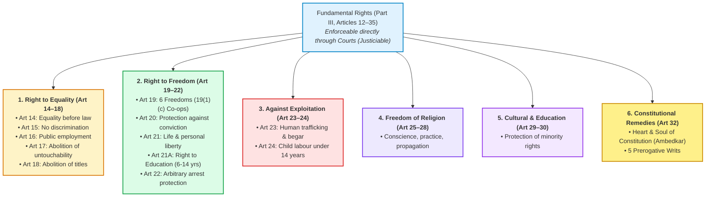
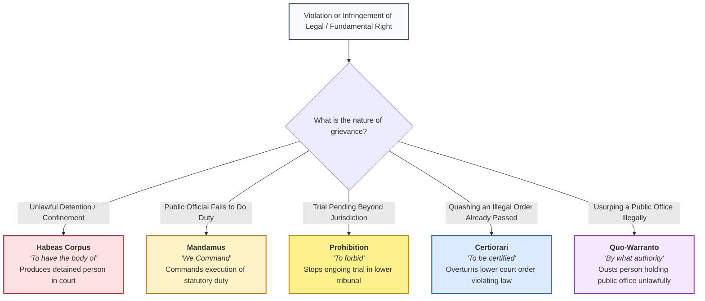
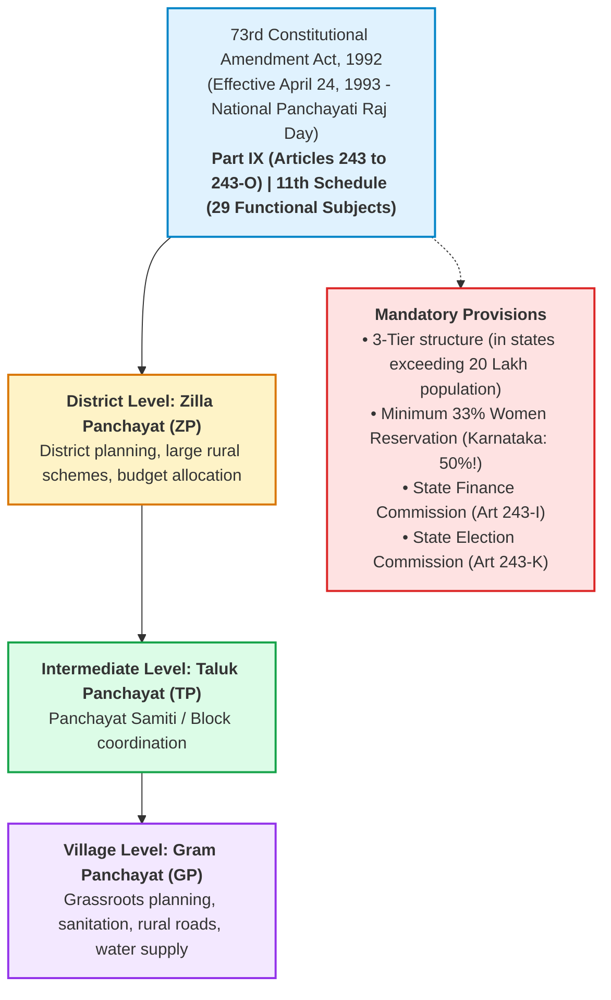

# Indian Constitution: Core Framework, Panchayati Raj & Cooperative Jurisprudence

---

## 1. Section Weightage & Typical Question Style

* **Exam Weightage:** **20 to 25 Marks (10% – 12.5% of the total paper)**.
* **Core Focus:** Preamble, Fundamental Rights (Part III), Directive Principles of State Policy (Part IV), Fundamental Duties (Part IVA), Union & State Executive, Panchayati Raj (73rd Amendment), Cooperative Provisions (97th Amendment), and key Articles/Writs.
* **Typical Question Formats:**
  1. *Article Number Identification:* "Which Article guarantees the abolition of untouchability?" (Article 17); "Under which Article can an individual approach the Supreme Court directly for enforcement of Fundamental Rights?" (Article 32).
  2. *Writ Jurisprudence:* Identifying the nature of writs (*Habeas Corpus, Mandamus, Quo-Warranto, Certiorari, Prohibition*).
  3. *Constitutional Amendments:* 42nd Amendment (Mini-Constitution), 44th Amendment (Right to Property made legal), 73rd Amendment (Panchayati Raj), 86th Amendment (Right to Education), and 97th Amendment (Cooperatives).
  4. *Constitutional Authorities & Terms:* Minimum age for President (35), Governor (35), Rajya Sabha/Legislative Council (30), Lok Sabha/Legislative Assembly (25).
  5. *Local Self-Government & Cooperatives:* Number of subjects in the 11th Schedule (29 subjects), Article 40 (Village Panchayats), Article 43B (Cooperatives).

---

## 2. Core Concepts & Structural Mechanics

### 2.1 The Preamble: The Constitutional Soul
* **Historical Source:** Drafted based on the *"Objectives Resolution"* introduced by Pandit Jawaharlal Nehru on December 13, 1946, and adopted on January 22, 1947.
* **Date of Adoption:** **November 26, 1949** (Celebrated annually as Constitution Day / *Samvidhan Divas*). The Constitution came into full effect on **January 26, 1950** (Republic Day).
* **Opening Words:** *"WE, THE PEOPLE OF INDIA..."* — establishes popular sovereignty.
* **Core Declaration:** Declares India to be a **SOVEREIGN, SOCIALIST, SECULAR, DEMOCRATIC, REPUBLIC**.
* **Core Objectives:**
  * **JUSTICE:** Social, Economic, and Political (borrowed from the Russian Revolution, 1917).
  * **LIBERTY:** Of thought, expression, belief, faith, and worship (borrowed from the French Revolution).
  * **EQUALITY:** Of status and of opportunity.
  * **FRATERNITY:** Assuring the dignity of the individual and the unity and integrity of the Nation.
* **The 42nd Constitutional Amendment Act (1976):**
  * The Preamble has been **amended only once** in history.
  * It added three historic words: **"SOCIALIST"**, **"SECULAR"**, and **"AND INTEGRITY"**.
* **Judicial Status:** In *Kesavananda Bharati vs. State of Kerala (1973)*, the Supreme Court ruled that the Preamble **is an integral part of the Constitution** and can be amended under Article 368, provided the "Basic Structure" is not altered.

---

### 2.2 Fundamental Rights (Part III, Articles 12 – 35)
* Borrowed from the **Bill of Rights** of the US Constitution. Termed the *Magna Carta of India*.
* Fundamental Rights are **justiciable** — enforceable directly through courts.

#### 1. Right to Equality (Articles 14 – 18)
* **Article 14:** Equality before the law and equal protection of the laws within the territory of India.
* **Article 15:** Prohibition of discrimination on grounds only of religion, race, caste, sex, or place of birth.
* **Article 16:** Equality of opportunity in matters of public employment.
* **Article 17:** **Abolition of Untouchability** and prohibition of its practice in any form.
* **Article 18:** Abolition of titles (except military and academic distinctions).

#### 2. Right to Freedom (Articles 19 – 22)
* **Article 19:** Guarantees 6 fundamental freedoms to Indian citizens:
  * 19(1)(a): Freedom of speech and expression.
  * 19(1)(b): Freedom to assemble peaceably and without arms.
  * 19(1)(c): **Freedom to form associations, unions, or CO-OPERATIVE SOCIETIES** *(Co-operatives added by 97th Constitutional Amendment, 2011)*.
  * 19(1)(d): Freedom to move freely throughout the territory of India.
  * 19(1)(e): Freedom to reside and settle in any part of the territory of India.
  * 19(1)(g): Freedom to practise any profession, or to carry on any occupation, trade, or business.
  *(Note: Article 19(1)(f) - Right to acquire, hold, and dispose of property was repealed by the 44th Amendment in 1978).*
* **Article 20:** Protection in respect of conviction for offences:
  * *No ex-post-facto law:* Cannot be punished under a retrospective criminal law.
  * *No double jeopardy:* No person shall be prosecuted and punished for the same offence more than once.
  * *No self-incrimination:* No accused person can be compelled to be a witness against themselves.
* **Article 21:** **Protection of life and personal liberty:** *"No person shall be deprived of his life or personal liberty except according to procedure established by law."* Has the widest judicial interpretation (includes right to privacy, clean environment, livelihood).
* **Article 21A:** **Right to Education (RTE):** Free and compulsory education to all children aged **6 to 14 years** as a Fundamental Right. Inserted by the **86th Amendment Act, 2002**.
* **Article 22:** Protection against arbitrary arrest and detention. Arrested persons must be produced before the nearest magistrate within 24 hours.

#### 3. Right against Exploitation (Articles 23 – 24)
* **Article 23:** Prohibition of traffic in human beings and *begar* (forced labor).
* **Article 24:** **Prohibition of employment of children in factories:** No child below the age of **14 years** shall be employed to work in any factory, mine, or hazardous employment.

#### 4. Right to Freedom of Religion (Articles 25 – 28)
* **Article 25:** Freedom of conscience and free profession, practice, and propagation of religion.

#### 5. Cultural and Educational Rights (Articles 29 – 30)
* **Article 29:** Protection of language, script, and culture of minorities.
* **Article 30:** Right of minorities to establish and administer educational institutions.

#### 6. Right to Constitutional Remedies (Article 32)
* Known as the **"Heart and Soul of the Constitution"** according to **Dr. B.R. Ambedkar**.
* Empowers citizens to directly petition the Supreme Court of India to enforce Fundamental Rights.
* **Article 226:** Empowers State High Courts to issue writs not only for Fundamental Rights but also for any ordinary legal right (broader writ jurisdiction than Article 32!).

---

### 2.3 The 5 Constitutional Writs Decision Architecture

---

### 2.4 Directive Principles of State Policy (Part IV, Articles 36 – 51)
* Borrowed from the **Irish Constitution** (which borrowed from Spain).
* **Nature:** Non-justiciable (cannot be enforced by court orders under Article 37), but *"fundamental in the governance of the country"*. Aim to establish a **Welfare State** (socio-economic democracy).

#### Critical Articles for Cooperative & Administrative Exams
* **Article 39A:** Equal justice and free legal aid (added by 42nd Amendment).
* **Article 40:** **Organisation of village panchayats** (*Gandhian Principle*).
* **Article 43B:** **Promotion of co-operative societies** (*Added by 97th Amendment, 2011*). Mandates the State to promote voluntary formation, autonomous functioning, democratic control, and professional management of cooperatives.
* **Article 44:** **Uniform Civil Code (UCC)** for all citizens.
* **Article 45:** Provision for early childhood care and education to children below the age of 6 years.
* **Article 48A:** Protection and improvement of environment and safeguarding of forests and wildlife.
* **Article 50:** **Separation of the judiciary from the executive**.
* **Article 51:** Promotion of international peace and security.

---

### 2.5 Fundamental Duties (Part IVA, Article 51A)
* Borrowed from the erstwhile **USSR Constitution**.
* Recommended by the **Swaran Singh Committee** in 1976.
* **Enactment:** Inserted into the Constitution by the **42nd Amendment Act, 1976**.
* **Count:** Originally contained **10 duties**.
* **11th Duty Added:** In 2002, the **86th Amendment Act** added duty **51A(k)**: *"Who is a parent or guardian to provide opportunities for education to his child or, as the case may be, ward between the age of six and fourteen years."*
* **Total Fundamental Duties today:** **11 Duties**.
* Fundamental duties are non-enforceable directly by courts, but serve as a constitutional compass for citizens.

---

### 2.6 Decentralization: Panchayati Raj (73rd Amendment Act, 1992)

* **Background Committees:**
  * **Balwant Rai Mehta Committee (1957):** Recommended a 3-tier Panchayati Raj system (Gram, Panchayat Samiti, Zilla Parishad) and coined *"Democratic Decentralization"*. First state to implement: **Rajasthan (Nagaur District, Oct 2, 1959)**, followed by Andhra Pradesh.
  * **Ashok Mehta Committee (1977):** Recommended a 2-tier system (Mandal Panchayat & Zilla Parishad).

> 🔁 Overlap: Essential for rural dairy cooperative officers (Extension Officers) because DCS procurement routes directly intersect Gram Panchayat boundaries.

---

### 2.7 Constitutional Machinery & Key Articles

| Constitutional Body / Office | Prescribed Article | Key Facts for Exam |
| :--- | :---: | :--- |
| **President of India** | **Article 52** | Head of State; Min age: **35 years**; Impeachment: **Article 61**; Pardoning power: **Article 72**; Ordinance power: **Article 123** |
| **Governor of a State** | **Article 153** | Appointed by the President (Art 155); Min age: **35 years**; Pardoning power: **Article 161**; Ordinance power: **Article 213** |
| **Attorney General of India** | **Article 76** | Highest law officer in India; appointed by President |
| **Advocate General for the State** | **Article 165** | Highest law officer in Karnataka; appointed by Governor |
| **Comptroller & Auditor General (CAG)** | **Article 148** | Guardian of the public purse; appointed by President |
| **Finance Commission** | **Article 280** | Constituted every 5 years by President for tax sharing |
| **Election Commission of India** | **Article 324** | Superintendence, direction & control of elections |
| **National Emergency** | **Article 352** | Grounds: War, External Aggression, or Armed Rebellion |
| **President's Rule (State Emergency)** | **Article 356** | Breakdown of constitutional machinery in a State |
| **Financial Emergency** | **Article 360** | Never declared in India to date |
| **Amendment of Constitution** | **Article 368** | Part XX; Powers and procedure of Parliament |

---

## 3. Key Facts & Lists to Memorize

### The 5 Writs Summary Table

| Writ Name | Literal Latin Meaning | Targeted Entity | Primary Purpose |
| :--- | :--- | :--- | :--- |
| **Habeas Corpus** | *"To have the body of"* | Public & Private bodies | Prevent illegal / unlawful physical confinement |
| **Mandamus** | *"We Command"* | Public officials & lower courts | Compel performance of mandatory public duty |
| **Prohibition** | *"To forbid"* | Lower judicial / quasi-judicial courts | Stop proceeding when acting without jurisdiction |
| **Certiorari** | *"To be certified"* | Lower judicial / quasi-judicial courts | Quash an illegal completed order |
| **Quo-Warranto** | *"By what authority"* | Individuals holding public office | Inquire into legality of claiming public office |

### Minimum Age Qualifications Table
* **President of India:** 35 Years
* **Vice President of India:** 35 Years
* **Governor of a State:** 35 Years
* **Member of Rajya Sabha (Council of States):** 30 Years
* **Member of Karnataka Legislative Council (MLC):** 30 Years
* **Member of Lok Sabha (House of the People):** 25 Years
* **Member of Karnataka Legislative Assembly (MLA):** 25 Years
* **Member of Gram Panchayat / Municipality:** 21 Years
* **Voting Age (Universal Adult Suffrage - Art 326):** **18 Years** *(Reduced from 21 to 18 by 61st Amendment Act, 1988)*

---

## 4. Mnemonics & Memory Aids

### Mnemonic for Preamble Order:
* **"SO-SO-SE-DE-RE"**
  * **SO**vereign
  * **SO**cialist
  * **SE**cular
  * **DE**mocratic
  * **RE**public

### Mnemonic for 6 Fundamental Rights:
* **"14 to 32: E-F-E-R-C-R"**
  * **E**quality (14–18)
  * **F**reedom (19–22)
  * **E**xploitation (23–24)
  * **R**eligion (25–28)
  * **C**ulture & Education (29–30)
  * **R**emedies (32)

### Mnemonic for Writs:
* **"Have More Potatoes Cold Quickly"**
  * **H**abeas Corpus
  * **M**andamus
  * **P**rohibition
  * **C**ertiorari
  * **Q**uo-Warranto

### Mnemonic for Emergency Articles:
* **352 (+4) → 356 (+4) → 360**
  * 352 = National
  * 356 = State / President's Rule
  * 360 = Financial

---

## 5. Overlap Notes
> 🔁 Overlap: Tested identically across KPSC SDA/FDA, Group C, KMF, and PSI/PC examinations.
> 🔁 Overlap: The 97th Constitutional Amendment (Article 19(1)(c) and Article 43B) intersects directly with the 50-mark "Cooperative Societies" syllabus section.

---

## 6. Sources & Reference Verification
1. *The Constitution of India (Ministry of Law and Justice, Government of India)*
2. *Indian Polity by M. Laxmikanth (Standard Competitive Reference)*
3. *Supreme Court of India Constitution Bench Landmark Judgments Compendium*
4. *Ministry of Panchayati Raj, Government of India: 73rd Constitutional Amendment Historical Compendium*
