# 🏛️ KEA VAO 2026 — Master Study Kit (Department of Revenue)

> [!IMPORTANT] Official Syllabus-Locked Study Kit
> Welcome to your comprehensive, Obsidian-native study kit for the **KEA Village Administrative Officer (VAO / ಗ್ರಾಮ ಆಡಳಿತಾಧಿಕಾರಿ - formerly Village Accountant / ಗ್ರಾಮ ಲೆಕ್ಕಿಗ) 2026** competitive examination (Department of Revenue / ಕಂದಾಯ ಇಲಾಖೆ).
> 
> With the examination on **4 October 2026** (4 study days remaining from 30 September 2026), this kit is rigorously calibrated to **maximize syllabus coverage and mark yield per study hour**. Every note is verified against the official KEA notification with stable syllabus line IDs (`P1-VAO-HIST-1.1` to `P2-VAO-COMP-3.6`), grammar rules, Mermaid diagrams, authentic verbatim PYQs, and interactive timed mock tests.

---

## 🧭 Vault Architecture & Quick Navigation Directory

```mermaid
flowchart TD
    ROOT["VAO/AGY/ (Master Study Kit)"] --> PLAN["[[01_Study_Plan]]<br/>Day-by-Day 4-Day Plan & 48-Hour Sprint"]
    ROOT --> SYLL["[[02_Syllabus_and_Pattern]]<br/>Official KEA Raw Syllabus & Traceability Matrix"]
    ROOT --> NOTES["[[03_Notes/01_General_Kannada_Grammar_and_Vocabulary|03_Notes/]]<br/>7 High-Yield Language, Computer & Admin Modules"]
    ROOT --> GK["[[04_Current_Affairs_GK/01_Karnataka_Government_Guarantee_Schemes_2026|04_Current_Affairs_GK/]]<br/>3 Dedicated State Schemes & Revenue Systems Notes"]
    ROOT --> RES["[[05_Resources/01_PYQ_and_Reference_Links|05_Resources/]]<br/>Verbatim PYQ Archive, Question Bank & YouTube"]
    ROOT --> RAW["[[05_Resources/Raw_Source_Papers/README|Raw Official PDF Papers]]<br/>Official KEA 2024 Exam Booklets & Key Answers"]
    ROOT --> MOCK["[[06_Mock_Tests/README|06_Mock_Tests/]]<br/>2 Full-Length (100 Qs) + 10 Subject-Wise HTML Mocks"]
    ROOT --> LOG["[[07_Agent_Log/sync_ledger|07_Agent_Log/]]<br/>Sync Ledger, Fact-Check Ledger & Decisions"]
```

---

## 📖 1. Core Subject Notes (`03_Notes/` — Papers I & II)

Every note features an **Exam Focus Callout**, explanatory theory, **Mermaid diagrams explained in text**, grammar tables, **verbatim PYQs**, and a **Quick Revision Box**.

| No. | Subject Module | Paper & Direct Syllabus Topics | Weightage | Direct Note Link |
| :---: | :--- | :--- | :---: | :--- |
| **01** | **General Kannada Grammar & Vocabulary** | **Paper-II:** 49 ವರ್ಣಮಾಲೆ; ಲೋಪ, ಆಗಮ, ಆದೇಶ, ಸವರ್ಣದೀರ್ಘ, ಗುಣ, ವೃದ್ಧಿ, ಯಣ್ ಸಂಧಿಗಳು; 8 ಸಮಾಸಗಳು; ತತ್ಸಮ-ತದ್ಭವ ಪಟ್ಟಿ; 7 ವಿಭಕ್ತಿಗಳು; ಗಾದೆಗಳು (`P2-VAO-KAN-1.1` to `1.8`). | **35 Marks** | [[03_Notes/01_General_Kannada_Grammar_and_Vocabulary]] |
| **02** | **General English Grammar & Comprehension** | **Paper-II:** Subject-Verb Agreement; 12 Tenses; Active/Passive Voice; Direct/Indirect Speech; Fixed Prepositions; Synonyms/Antonyms; Idioms (`P2-VAO-ENG-2.1` to `2.8`). | **35 Marks** | [[03_Notes/02_General_English_Grammar_and_Comprehension]] |
| **03** | **Computer Knowledge & MS Office** | **Paper-II:** 5 Computer Generations; Memory hierarchy (Cache > RAM > SSD); MS Office shortcuts (Word, Excel formulas `$A$1`, PowerPoint); IPv4/IPv6; SMTP/POP3; Cybersecurity (`P2-VAO-COMP-3.1` to `3.6`). | **30 Marks** | [[03_Notes/03_Computer_Knowledge_and_MS_Office]] |
| **04** | **Karnataka History & Heritage** | **Paper-I:** Halmidi Inscription (450 AD), Badami Chalukyas (Aihole), Rashtrakutas, Vijayanagara (1336–1565), Kittur Chennamma, Sangolli Rayanna (1831), Vidurashwatha, Renaming (1 Nov 1973) (`P1-VAO-HIST-1.1` to `1.4`). | **18–20 Marks** | [[03_Notes/04_Karnataka_History_and_Heritage]] |
| **05** | **Karnataka & Indian Geography** | **Paper-I:** 3 Physiographic regions; Mullayanagiri (1,930 m); Krishna & Kaveri river basins; Jog Falls (253 m); 10 Agro-Climatic Zones; Black soil cotton; Indian Great Plains & Ghats (`P1-VAO-GEOG-2.1` to `2.4`). | **16–18 Marks** | [[03_Notes/05_Karnataka_and_Indian_Geography]] |
| **06** | **Indian Constitution & Polity** | **Paper-I:** Preamble pillars; Articles 14–32; 5 Writs; DPSP (Part IV); Article 371J (Kalyana Karnataka); 73rd Amendment (11th Schedule 29 subjects, 50% women reservation) (`P1-VAO-POL-3.1` to `3.4`). | **16–18 Marks** | [[03_Notes/06_Indian_Constitution_and_Polity]] |
| **07** | **Panchayat Raj Act & Rural Administration** | **Paper-I:** 1993 Act 3-tier structure; Revenue hierarchy (DC $\to$ AC $\to$ Tahsildar $\to$ RI $\to$ VAO); Statutory duties of VAO; Section 128/129 KLR Act; RTC Form 16; e-Swathu (`P1-VAO-RDPR-4.1` to `4.4`). | **18–20 Marks** | [[03_Notes/07_Panchayat_Raj_Act_and_Rural_Administration]] |

---

## 🏛️ 2. Current Affairs & E-Governance (`04_Current_Affairs_GK/`)

| No. | Subject Module | Core Focus Areas & Line IDs | Weightage | Direct Note Link |
| :---: | :--- | :--- | :---: | :--- |
| **01** | **Karnataka Government Guarantee Schemes 2026** | Detailed operational rules for Gruha Lakshmi (₹2,000/mo DBT), Shakti (free bus), Yuva Nidhi (₹3,000 / ₹1,500), Anna Bhagya (10 kg), Gruha Jyothi (200 units), Budget 2026–27 (`P1-VAO-CA-5.1`, `5.2`). | **16–20 Marks** | [[04_Current_Affairs_GK/01_Karnataka_Government_Guarantee_Schemes_2026]] |
| **02** | **Karnataka Revenue Systems & Digitization** | Bhoomi (FIFO mutation under Sec 129 & computerized RTC), e-Swathu (Form 9 & 11), Mojini v3 (11E sketch & Tatkal Podi), Kaveri 2.0, Dishank app (`P1-VAO-RDPR-4.5`). | **14–16 Marks** | [[04_Current_Affairs_GK/02_Karnataka_Revenue_Systems_and_Digitization]] |
| **03** | **National & International Current Affairs 2026** | BRICS, G20, SCO, ISRO lunar & solar milestones, 58th Jnanpith awards, everyday science laws, human health, vitamins (`P1-VAO-CA-5.3`, `5.4`). | **14–16 Marks** | [[04_Current_Affairs_GK/03_National_and_International_Current_Affairs_2026]] |

---

## 🎯 3. Interactive Offline HTML Mock Tests (`06_Mock_Tests/`)

All tests feature offline execution, countdown timer, question palette, real negative marking (-0.25), scorecards, and instant step-by-step explanations:

### A. Full-Length Official Paper Simulations (100 Questions / 120 Minutes)
1. **[[06_Mock_Tests/Full_Length/Mock_Test_Paper_1_General_Knowledge_and_Rural_Admin.html|Full-Length Mock Test 01: Paper-I GK & Rural Administration]]** (100 Qs / 120 Mins)
2. **[[06_Mock_Tests/Full_Length/Mock_Test_Paper_2_Language_and_Computer_Knowledge.html|Full-Length Mock Test 02: Paper-II Language & Computers]]** (100 Qs: Kannada 35, English 35, Computers 30)

### B. Subject-Wise Focused Simulations (>= 2 Versions per Subject)
- **General Kannada (35 Qs / 42 Mins):** `Subject_Wise/General_Kannada_Mock_Test_V1.html` & `V2.html`
- **General English (35 Qs / 42 Mins):** `Subject_Wise/General_English_Mock_Test_V1.html` & `V2.html`
- **Computer Knowledge (30 Qs / 36 Mins):** `Subject_Wise/Computer_Knowledge_Mock_Test_V1.html` & `V2.html`
- **Rural Administration & RDPR (25 Qs / 30 Mins):** `Subject_Wise/Rural_Administration_Panchayat_Raj_Mock_Test_V1.html` & `V2.html`
- **Karnataka GK & Schemes (25 Qs / 30 Mins):** `Subject_Wise/Karnataka_GK_and_Schemes_Mock_Test_V1.html` & `V2.html`

👉 Full instructions: [[06_Mock_Tests/README|Mock Tests User Guide & Pacing Strategy]]

---

## 📁 4. Primary Resources & Master Question Bank (`05_Resources/`)

- **Master Question Bank:** [[05_Resources/Question_Bank|Question Bank (Markdown)]] & `Question_Bank.json` (200 curated questions with line IDs).
- **Verbatim PYQ Archives (Bilingual with Explanations):**
  - [[05_Resources/PYQ_Archive/KEA_VAO_Paper1_GK_RuralAdmin_Verbatim_PYQs|Paper-I GK & Rural Admin Verbatim PYQs]]
  - [[05_Resources/PYQ_Archive/KEA_VAO_Paper2_Language_Computer_Verbatim_PYQs|Paper-II Language & Computer Verbatim PYQs]]
- **Official Raw Source Question Papers (`05_Resources/Raw_Source_Papers/`):**
  - [[05_Resources/Raw_Source_Papers/README|Raw Source Papers Catalog & Verification Log]]
  - `[[05_Resources/Raw_Source_Papers/KEA_VAO_Paper_1_Question_Paper_English_27_10_2024.pdf|KEA VAO 2024 Paper-I GK & Rural Admin - English (PDF)]]` *(~2.98 MB — Original 100-Q test booklet, Code C1)*
  - `[[05_Resources/Raw_Source_Papers/KEA_VAO_Paper_1_Question_Paper_Kannada_27_10_2024.pdf|KEA VAO 2024 Paper-I GK & Rural Admin - Kannada (PDF)]]` *(~3.17 MB — Original 100-Q test booklet, Code C1)*
  - `[[05_Resources/Raw_Source_Papers/KEA_VAO_Paper_2_Question_Paper_27_10_2024.pdf|KEA VAO 2024 Paper-II Language & Computers (PDF)]]` *(~3.85 MB — Original 100-Q test booklet, Code A1 / VAO2710P224)*
  - `[[05_Resources/Raw_Source_Papers/KEA_VAO_Paper_2_Official_Key_Answer_27_10_2024.pdf|Official KEA Published Key Answers for Paper-II (PDF)]]` *(~177 KB — Official answer keys for versions A1–A4, B1–B4)*
  - `[[05_Resources/Raw_Source_Papers/KEA_VAO_Compulsory_Kannada_Question_Paper_29_09_2024.pdf|KEA 2024 Compulsory Kannada Language Test (PDF)]]` *(~2.55 MB — 150-mark qualifying test booklet)*
  - `[[05_Resources/Raw_Source_Papers/KEA_VAO_Compulsory_Kannada_Key_Answer_29_09_2024.pdf|Official Compulsory Kannada Key Answer (PDF)]]` *(~150 KB — Official published key)*
  - *Purpose:* Serves as the primary evidence repository backing all verbatim PYQs. You can open and read these unedited PDFs directly whenever you want to cross-examine questions or check original Kannada/English phrasings.
- **Official Source Registry:** [[05_Resources/Source_Registry|Master Source Registry & Statutory Acts]]
- **YouTube Coursework Directory:** [[VAO/AGY/07_Agent_Log/YouTube_Links|18 Verified Coursework Lessons & Transcripts]]

---

## 📋 5. Agent Verification & System Governance (`07_Agent_Log/`)

- **Execution & Resume Ledger:** [[07_Agent_Log/sync_ledger|Sync Ledger]]
- **Fact-Check Ledger:** [[07_Agent_Log/fact_check_ledger|Comprehensive Fact-Check Ledger (Zero Defects)]]
- **Unverified Parking Lot:** [[07_Agent_Log/_Unverified_Parking_Lot|Quarantine Ledger]]
- **Design Decisions Log:** [[07_Agent_Log/decisions|Batched Decisions Log]]

---

## 🚀 How to Begin Right Now (2-Minute Decision)
1. **If you have 4 Days (Sept 30 – Oct 3):** Open [[01_Study_Plan]] and follow the **Day 1 Schedule (General Kannada & English)** immediately.
2. **If you have only 24–48 Hours:** Jump straight to the [[01_Study_Plan#2-emergency-2-day-compressed-track-48-hour-high-yield-sprint|Emergency Compressed Track]] and drill the **Quick Revision Boxes** at the end of each note.
