# 🏛️ KEA VAO (Village Administrative Officer) 2026 — Master Study Kit

> [!IMPORTANT] Candidate Orientation & Rapid Execution Guide
> Welcome to your complete, Obsidian-native study kit for the **KEA Village Administrative Officer (VAO / ಗ್ರಾಮ ಆಡಳಿತಾಧಿಕಾರಿ - formerly Village Accountant / ಗ್ರಾಮ ಲೆಕ್ಕಿಗ) 2026** competitive examination (Department of Revenue / ಕಂದಾಯ ಇಲಾಖೆ).
> 
> With the examination scheduled for **4 October 2026**, this kit is engineered to deliver **maximum syllabus coverage per study hour**, combining exam-focused notes, visual diagrams, grammar rules, verified video coursework, and interactive offline mock tests.

---

## 🧭 Vault Architecture & Navigation Directory

```mermaid
flowchart TD
    ROOT["VAO/AGY/ (Master Study Kit)"] --> PLAN["[[01_Study_Plan]]<br/>Day-by-Day Hour-Block Plan & 48-Hour Sprint"]
    ROOT --> SYLL["[[02_Syllabus_and_Pattern]]<br/>Official KEA Pattern, Marks & Weightage Table"]
    ROOT --> NOTES["[[03_Notes/01_General_Kannada_Grammar_and_Vocabulary|03_Notes/]]<br/>7 High-Yield Language, Computer & Admin Modules"]
    ROOT --> GK["[[04_Current_Affairs_GK/01_Karnataka_Government_Guarantee_Schemes_2026|04_Current_Affairs_GK/]]<br/>3 Dedicated State Schemes & Revenue Systems Notes"]
    ROOT --> RES["[[05_Resources/01_PYQ_and_Reference_Links|05_Resources/]]<br/>PYQs, Official Books & 18 YouTube Transcripts"]
    ROOT --> MOCK["06_Mock_Tests/<br/>3 Timed Offline HTML Mock Simulations"]
    ROOT --> LOG["[[07_Agent_Log/plan_and_roster|07_Agent_Log/]]<br/>Sub-Agent Roster, Verified Videos & QA Report"]
```

---

## 📖 1. Core Subject Notes (`03_Notes/` — Papers I & II)

Every note features an **Exam Focus Callout**, clear explanatory prose, **Mermaid diagrams explained in text**, mnemonics, **PYQ analysis**, and a **Quick Revision Box**.

| No. | Subject Module | Key Topics Covered | Weightage Tier | Direct Link |
| :---: | :--- | :--- | :---: | :--- |
| **01** | **General Kannada Grammar & Vocabulary** | 49 ವರ್ಣಮಾಲೆ; ಲೋಪ, ಆಗಮ, ಆದೇಶ, ಸವರ್ಣದೀರ್ಘ, ಗುಣ, ವೃದ್ಧಿ, ಯಣ್ ಸಂಧಿಗಳು; 8 ಸಮಾಸಗಳು; ತತ್ಸಮ-ತದ್ಭವ ಪಟ್ಟಿ; 7 ವಿಭಕ್ತಿಗಳು. | **Tier 1** (35 Marks) | [[03_Notes/01_General_Kannada_Grammar_and_Vocabulary]] |
| **02** | **General English Grammar & Comprehension** | Subject-Verb Agreement rules; Type 1, 2, 3 Conditionals; Active & Passive Voice; Direct/Indirect Speech; Fixed Prepositions; Idioms. | **Tier 1** (35 Marks) | [[03_Notes/02_General_English_Grammar_and_Comprehension]] |
| **03** | **Computer Knowledge & MS Office** | 5 Computer Generations; Memory hierarchy (Cache > RAM > SSD); MS Office shortcuts (Word, Excel, PowerPoint); IPv4/IPv6; SMTP/POP3; Phishing. | **Tier 1** (30 Marks) | [[03_Notes/03_Computer_Knowledge_and_MS_Office]] |
| **04** | **Karnataka History & Heritage** | Halmidi Inscription (450 AD), Badami Chalukyas (Aihole), Rashtrakutas (Kavirajamarga), Hoysalas, Vijayanagara (1336–1565), Mysore Wodeyars, Ekikarana. | **Tier 1** (18–22 Marks) | [[03_Notes/04_Karnataka_History_and_Heritage]] |
| **05** | **Karnataka & Indian Geography** | 3 Physiographic regions; Mullayanagiri (1,930 m); Krishna & Cauvery river basins; Jog Falls (253 m); 10 Agro-Climatic Zones; Hutti Gold Mines. | **Tier 1** (16–20 Marks) | [[03_Notes/05_Karnataka_and_Indian_Geography]] |
| **06** | **Indian Constitution & Polity** | Preamble values; Articles 14–32; 5 Writs; DPSP (Articles 40, 44, 50); Fundamental Duties (51A); Bicameral legislature (224 + 75 seats). | **Tier 1** (16–18 Marks) | [[03_Notes/06_Indian_Constitution_and_Polity]] |
| **07** | **Panchayat Raj Act & Rural Administration** | Abdul Nazir Sab 1983 Act; 1993 Act 3-tier structure; 50% women reservation; Revenue hierarchy (DC $\to$ VAO); RTC/Pahani Form 16; Mutation Form 12; e-Swathu. | **Tier 1** (15–18 Marks) | [[03_Notes/07_Panchayat_Raj_Act_and_Rural_Administration]] |

---

## 🏛️ 2. Current Affairs & E-Governance (`04_Current_Affairs_GK/`)

| No. | Subject Module | Core Focus Areas | Weightage Tier | Direct Link |
| :---: | :--- | :--- | :---: | :--- |
| **01** | **Karnataka Government Guarantee Schemes 2026** | Detailed operational rules for Gruha Lakshmi (₹2,000/mo), Shakti (free bus), Yuva Nidhi (₹3,000 / ₹1,500), Anna Bhagya (10 kg), Gruha Jyothi (200 units). | **Tier 1** (16–20 Marks) | [[04_Current_Affairs_GK/01_Karnataka_Government_Guarantee_Schemes_2026]] |
| **02** | **Karnataka Revenue Systems & Digitization** | Bhoomi (FIFO mutation & computerized RTC), e-Swathu (Form 9 & 11), Mojini v3 (11E sketch & Tatkal Podi), Kaveri 2.0, Parihara crop loss DBT. | **Tier 1** (14–16 Marks) | [[04_Current_Affairs_GK/02_Karnataka_Revenue_Systems_and_Digitization]] |
| **03** | **National & International Current Affairs 2026** | Expanded BRICS grouping, G20, SCO, ISRO Gaganyaan & Vyommitra humanoid test, NISAR radar satellite, 8 Jnanpith awards in Kannada. | **Tier 1** (14–16 Marks) | [[04_Current_Affairs_GK/03_National_and_International_Current_Affairs_2026]] |

---

## 🎯 3. Interactive Offline Mock Tests (`06_Mock_Tests/`)

Each test is a single offline HTML application with **interactive timer, auto-submit, question palette, negative marking (-0.25), and detailed answer explanations**:

1. **`Mock_Test_1_Paper_1_General_Knowledge_and_Rural_Admin.html`** — Comprehensive Paper-I GK & Rural Governance Simulation.
2. **`Mock_Test_2_Paper_2_Language_and_Computer_Knowledge.html`** — High-Scoring Paper-II Languages (Kannada/English) & Computer Simulation.
3. **`Mock_Test_3_Full_Length_High_Yield_Simulation.html`** — Complete Marathon Simulation across all subjects.
👉 Read: [[06_Mock_Tests/README|Mock Tests Architecture & Instructions]]

---

## 📁 4. Resources, Verified Coursework & Transcripts (`05_Resources/`)

- **Official PYQ & Reference Links:** [[05_Resources/01_PYQ_and_Reference_Links|PYQ & Resource Guide]]
- **18 Verified YouTube Coursework Videos:** [[VAO/AGY/07_Agent_Log/YouTube_Links|Coursework Video Directory (Zero fluff/notification links)]]
- **Transcripts & Study Digests:** Stored in `VAO/AGY/05_Resources/YouTube_Transcripts/`

---

## 📋 5. Agent Verification & System Logs (`07_Agent_Log/`)

- **Sub-Agent Roster & Execution Plan:** [[07_Agent_Log/plan_and_roster]]
- **YouTube Links Master Record:** [[VAO/AGY/07_Agent_Log/YouTube_Links]]
- **Quality Assurance & Verification Report:** [[07_Agent_Log/qa_report]]

---

## 🚀 How to Begin Right Now (30 Seconds Decision)
1. **If you have 3+ days (Sept 30 – Oct 3):** Open [[01_Study_Plan]] and follow the **Day 1 Schedule (General Kannada & English)** immediately.
2. **If you have only 24–48 hours:** Jump straight to the [[01_Study_Plan#2-emergency-2-day-compressed-track-48-hour-high-yield-sprint|Emergency 2-Day Compressed Track]] and focus on the **Quick Revision Boxes** at the end of each note.
