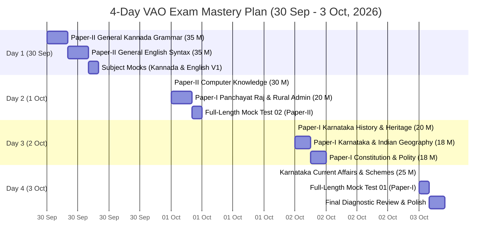

# KEA VAO 2026 — Master 4-Day & Compressed 2-Day Study Plan

> [!IMPORTANT] Time-to-Exam Countdown & High-Yield Strategy
> - **Current System Date:** **30 September 2026**.
> - **Target Exam Date:** **4 October 2026** — Exactly **4 Study Days Remaining**.
> - **Strategic Core:**
>   1. **Paper-II is the Decisive Merit Maker (100 Marks):** General Kannada (35 Marks) + General English (35 Marks) + Computer Knowledge (30 Marks). Consistent scoring of 85+ in Paper 2 creates an insurmountable lead.
>   2. **Paper-I Rural Administration & Land Records (25 Marks):** Karnataka Gram Swaraj & Panchayat Raj Act 1993, VAO statutory duties, Bhoomi FIFO mutation (Sec 129), and RTC Form 16.
>   3. **Paper-I Karnataka Current Affairs & Five Guarantees (20 Marks):** Gruha Lakshmi, Shakti, Yuva Nidhi, Budget 2026–27.
>   4. **Paper-I Foundations (55 Marks):** Karnataka History, Geography, and Constitution.
> - **Execution Discipline:** Follow the hour-by-hour schedule, memorize the **Quick Revision Boxes**, and execute timed mock drills!

---

## 1. High-Yield 4-Day Hour-by-Hour Master Schedule



---

### Day 1 (30 September 2026): Paper-II Languages (Kannada & English Core — 70 Marks)
*Goal: Secure 60+ Marks across Kannada grammar, English syntax, and vocabulary.*

- [ ] **06:00 – 08:30 (Block 1: General Kannada Grammar — 20 Marks)**
  - Read: [[03_Notes/01_General_Kannada_Grammar_and_Vocabulary|01. General Kannada Grammar & Vocabulary]]
  - Master: 49 ವರ್ಣಮಾಲೆ, ಸ್ವರ-ವ್ಯಂಜನ-ಯೋಗವಾಹ, ಲೋಪ, ಆಗಮ, ಆದೇಶ ಸಂಧಿಗಳು.
- [ ] **08:30 – 09:15** | *Breakfast & Quick Flashcards*
- [ ] **09:15 – 11:30 (Block 2: Kannada Samasa, Tatsama-Tadbhava & Vibhakti — 15 Marks)**
  - Continue: [[03_Notes/01_General_Kannada_Grammar_and_Vocabulary|01. General Kannada Grammar & Vocabulary]]
  - Master: 8 ಸಮಾಸಗಳು (ದ್ವಿಗು, ಬಹುವ್ರೀಹಿ, ತತ್ಪುರುಷ, ಕರ್ಮಧಾರಯ), ತತ್ಸಮ-ತದ್ಭವ ಪಟ್ಟಿ, 7 ವಿಭಕ್ತಿ ಪ್ರತ್ಯಯಗಳು ಮತ್ತು ಕಾರಕಾರ್ಥಗಳು, ಗಾದೆ ಮಾತುಗಳು.
- [ ] **11:30 – 13:00 (Block 3: General English Grammar Rules — 20 Marks)**
  - Read: [[03_Notes/02_General_English_Grammar_and_Comprehension|02. General English Grammar & Comprehension]]
  - Master: Parts of Speech, 12 Tense structures, Subject-Verb Agreement (neither...nor, along with, collective nouns).
- [ ] **13:00 – 14:00** | *Lunch & Relaxation*
- [ ] **14:00 – 16:30 (Block 4: English Voice, Speech & Vocabulary — 15 Marks)**
  - Continue: [[03_Notes/02_General_English_Grammar_and_Comprehension|02. General English Grammar & Comprehension]]
  - Master: Active/Passive Voice transformations, Direct/Indirect speech rules, Synonyms, Antonyms, One-word substitutions, and Idioms.
- [ ] **16:30 – 17:00** | *Tea Break*
- [ ] **17:00 – 18:30 (Block 5: Timed Subject Mocks — Kannada & English V1)**
  - Launch: `Subject_Wise/General_Kannada_Mock_Test_V1.html` (35 Qs / 42 Mins)
  - Launch: `Subject_Wise/General_English_Mock_Test_V1.html` (35 Qs / 42 Mins)
- [ ] **18:30 – 20:30 (Block 6: Error Analysis & Language Revision)**
  - Review all wrong grammar questions.
  - Scan: [[03_Notes/01_General_Kannada_Grammar_and_Vocabulary#9-quick-revision-box|Kannada Revision Box]] & [[03_Notes/02_General_English_Grammar_and_Comprehension#9-quick-revision-box|English Revision Box]].

---

### Day 2 (1 October 2026): Computers, Rural Administration & Paper-II Mock (50 Marks)
*Goal: Master Computer Knowledge (30 Marks), Panchayat Raj/VAO duties (20 Marks), and full Paper-II simulation.*

- [ ] **06:00 – 09:00 (Block 1: Computer Knowledge & MS Office — 30 Marks)**
  - Read: [[03_Notes/03_Computer_Knowledge_and_MS_Office|03. Computer Knowledge & MS Office]]
  - Master: Memory hierarchy (Registers > Cache > RAM > SSD), MS Excel formulas (`=COUNT`, `=COUNTA`), Absolute reference (`$A$1`), PPT shortcuts (F5, Shift+F5), IPv4 vs IPv6, SMTP/POP3, Cybersecurity, and Karnataka E-governance portals (Bhoomi, Kutumba).
- [ ] **09:00 – 09:45** | *Breakfast Break*
- [ ] **09:45 – 13:00 (Block 2: Panchayat Raj Act & Rural Administration — 20 Marks)**
  - Read: [[03_Notes/07_Panchayat_Raj_Act_and_Rural_Administration|07. Panchayat Raj Act & Rural Administration]]
  - Master: 73rd Amendment 29 subjects, Karnataka Gram Swaraj & Panchayat Raj Act 1993 (3-tier structure, 50% women reservation), Revenue hierarchy (DC $\to$ AC $\to$ Tahsildar $\to$ RI $\to$ VAO), VAO duties, RTC Form 16, and Section 129 FIFO mutation.
- [ ] **13:00 – 14:00** | *Lunch & Power Rest*
- [ ] **14:00 – 16:30 (Block 3: Revenue Digitization & Land IT — 15 Marks)**
  - Read: [[04_Current_Affairs_GK/02_Karnataka_Revenue_Systems_and_Digitization|02. Karnataka Revenue Systems & Digitization]]
  - Master: Bhoomi mutation workflow, Mojini v3 (11E sketch & Tatkal Podi), e-Swathu Form 9 & 11, Kaveri 2.0, Dishank GPS locator.
- [ ] **16:30 – 17:00** | *Tea Break*
- [ ] **17:00 – 19:00 (Block 4: Full-Length Timed Mock 02 — Paper-II Language & Computers)**
  - Launch: [[06_Mock_Tests/Full_Length/Mock_Test_Paper_2_Language_and_Computer_Knowledge.html|Mock Test Paper-II (100 Questions / 120 Minutes)]]
  - Complete the full 100-question test (Kannada 35, English 35, Computers 30) under exam conditions.
- [ ] **19:00 – 21:00 (Block 5: Diagnostic Review & Scorecard Analysis)**
  - Review all wrong options using the built-in explanation dialogs.

---

### Day 3 (2 October 2026): Karnataka History, Geography & Indian Constitution (56 Marks)
*Goal: Consolidate core General Studies for Paper-I.*

- [ ] **06:00 – 09:00 (Block 1: Karnataka History & Heritage — 20 Marks)**
  - Read: [[03_Notes/04_Karnataka_History_and_Heritage|04. Karnataka History & Heritage]]
  - Focus: Halmidi (450 AD), Badami Chalukyas (Aihole), Rashtrakutas, Vijayanagara (1336), Kittur Rani Chennamma (1824), Sangolli Rayanna (1831), Vidurashwatha firing (1938), and State renaming (1 Nov 1973).
- [ ] **09:00 – 09:45** | *Breakfast Break*
- [ ] **09:45 – 12:30 (Block 2: Karnataka & Indian Geography — 18 Marks)**
  - Read: [[03_Notes/05_Karnataka_and_Indian_Geography|05. Karnataka & Indian Geography]]
  - Focus: 3 Physiographic regions, Mullayanagiri (1,930 m), Krishna & Kaveri river systems, Jog Falls (253 m), 10 agro-climatic zones, black soil cotton, Great Plains, and Ten Degree Channel.
- [ ] **12:30 – 13:30** | *Lunch Break*
- [ ] **13:30 – 16:30 (Block 3: Indian Constitution & Polity — 18 Marks)**
  - Read: [[03_Notes/06_Indian_Constitution_and_Polity|06. Indian Constitution & Polity]]
  - Focus: Preamble 42nd Amendment, Articles 14–32, 5 Writs, DPSP, Article 371J (Kalyana Karnataka), 73rd Amendment, State legislature.
- [ ] **16:30 – 17:00** | *Tea Break*
- [ ] **17:00 – 18:30 (Block 4: Timed Subject Mocks — RDPR & Computer V2)**
  - Launch: `Subject_Wise/Rural_Administration_Panchayat_Raj_Mock_Test_V1.html` (25 Qs / 30 Mins)
  - Launch: `Subject_Wise/Computer_Knowledge_Mock_Test_V1.html` (30 Qs / 36 Mins)

---

### Day 4 (3 October 2026): Five Guarantees, Budget 2026-27 & Paper-I Full Mock
*Goal: Final high-yield current affairs consolidation and full Paper-I readiness.*

- [ ] **06:00 – 09:00 (Block 1: Karnataka Five Guarantees & Budget 2026–27 — 25 Marks)**
  - Read: [[04_Current_Affairs_GK/01_Karnataka_Government_Guarantee_Schemes_2026|01. Karnataka Government Guarantee Schemes 2026]]
  - Master: Gruha Lakshmi (₹2,000/mo DBT), Shakti (free bus), Yuva Nidhi (₹3,000/₹1,500), Anna Bhagya (10 kg / ₹34/kg DBT), Gruha Jyothi (free up to 200 units), Budget 2026–27 outlay (₹4,48,004 crore), D.K. Shivakumar CM tenure (from 3 June 2026), Mukhya Mantri Saura Krishi Yojane.
- [ ] **09:00 – 09:45** | *Breakfast Break*
- [ ] **09:45 – 12:00 (Block 2: National/International Current Affairs & Everyday Science — 15 Marks)**
  - Read: [[04_Current_Affairs_GK/03_National_and_International_Current_Affairs_2026|03. National & International Current Affairs 2026]]
  - Master: ISRO lunar/solar missions, 58th Jnanpith awards, blood groups (O- universal donor), vitamins, everyday physics laws.
- [ ] **12:00 – 13:00** | *Lunch & Mental Rest*
- [ ] **13:00 – 15:00 (Block 3: Full-Length Timed Mock 01 — Paper-I GK & Rural Administration)**
  - Launch: [[06_Mock_Tests/Full_Length/Mock_Test_Paper_1_General_Knowledge_and_Rural_Admin.html|Mock Test Paper-I (100 Questions / 120 Minutes)]]
  - Complete the full 100-question GK simulation under real exam conditions.
- [ ] **15:00 – 16:30 (Block 4: Error Diagnostic & Remediation)**
  - Review all wrong questions.
- [ ] **16:30 – 18:30 (Block 5: Final Revision Box Scan across all Notes)**
  - Scan only the **Quick Revision Boxes** at the bottom of all 10 notes.
  - Sleep early (minimum 8 hours) to ensure peak mental clarity on exam day!

---

## 2. Emergency 2-Day Compressed Track (48-Hour High-Yield Sprint)

For candidates with only **48 hours remaining**:

```markdown
┌─────────────────────────────────────────────────────────────────────────────┐
│                      EMERGENCY 48-HOUR VAO SPRINT                           │
├─────────────────────────────────────────────────────────────────────────────┤
│ 1. Scan Quick Revision Box of Note 01 (General Kannada: Sandhi & Samasa)    │
│ 2. Scan Quick Revision Box of Note 02 (General English: Agreement & Tenses) │
│ 3. Scan Quick Revision Box of Note 03 (Computer Knowledge: Shortcuts, OS)   │
│ 4. Read Note 07 (Panchayat Raj Act 1993, VAO Duties, Bhoomi FIFO Sec 129)  │
│ 5. Read Note 01 of Current Affairs (Karnataka 5 Guarantees & Budget 2026)   │
│ 6. Attempt Full-Length Mock Test 02 (Paper-II Language & Computer - 100 Qs) │
│ 7. Attempt Full-Length Mock Test 01 (Paper-I GK & Rural Admin - 100 Qs)     │
│ 8. Review all wrong question explanations in the interactive scorecards!    │
└─────────────────────────────────────────────────────────────────────────────┘
```
