# KEA VAO 2026 — Master 3-Day & Compressed 2-Day Study Plan

> [!IMPORTANT] Time-to-Exam Alert & Strategy
> - **Current Date:** 29 September 2026.
> - **Target Exam Date:** **4 October 2026 (RPC Cadre)** — Sitting back-to-back with Land Surveyor.
> - **Primary Strategic Principle:** **Paper-II is the Cut-Off Driver!** Candidates who score 80+ in Kannada Grammar (35 marks), English Grammar (35 marks), and Computer Knowledge (30 marks) secure top ranks.
> - **Methodology:** Languages and Computer Knowledge in the morning (peak mental agility), Karnataka History, Geography, and Revenue Administration in the afternoon, and timed mock drills + error correction in the evening.

---

## 1. High-Yield 3-Day Hour-by-Hour Master Schedule

### Day 1 (30 September 2026): The Language Powerhouse (General Kannada & English)
*Target: Lock 70 Marks in Paper-II Language Sections.*

- [ ] **06:00 – 08:30 (Block 1: Kannada Grammar — Sandhi & Varnamale)**
  - Read: [[03_Notes/01_General_Kannada_Grammar_and_Vocabulary|01. General Kannada Grammar & Vocabulary]]
  - Master: 49 ಅಕ್ಷರಗಳು (ಸ್ವರ 14, ವ್ಯಂಜನ 34, ಯೋಗವಾಹ 2); ಲೋಪ, ಆಗಮ, ಆದೇಶ ಸಂಧಿಗಳು; ಸವರ್ಣದೀರ್ಘ, ಗುಣ, ವೃದ್ಧಿ, ಯಣ್ ಸಂಧಿಗಳು.
  - Drill: 30 Sandhi splitting exercises.
- [ ] **08:30 – 09:15** | *Breakfast & Quick Vocabulary Recall*
- [ ] **09:15 – 12:00 (Block 2: Samasa, Tatsama-Tadbhav & Vibhakti)**
  - Read: [[03_Notes/01_General_Kannada_Grammar_and_Vocabulary#3-ಸಮಾಸ-ಪ್ರಕರಣ-compound-words|Samasa & Tatsama Sections]]
  - Master: 8 ಸಮಾಸಗಳು (ತತ್ಪುರುಷ, ಕರ್ಮಧಾರಯ, ದ್ವಿಗು, ದ್ವಂದ್ವ, ಬಹುವ್ರೀಹಿ, ಅಂಶಿ, ಕ್ರಿಯಾ, ಗಮಕ); 7 ವಿಭಕ್ತಿ ಪ್ರತ್ಯಯಗಳು.
  - Memorize: High-yield Tatsama-Tadbhav pairs (ಆಶ್ಚರ್ಯ-ಅಚ್ಚರಿ, ಕಾರ್ಯ-ಕಜ್ಜ, ಯುದ್ಧ-ಜುಂಜು).
- [ ] **12:00 – 13:30** | *Lunch & Relaxation*
- [ ] **13:30 – 16:00 (Block 3: General English Grammar Rules)**
  - Read: [[03_Notes/02_General_English_Grammar_and_Comprehension|02. General English Grammar & Comprehension]]
  - Master: Subject-Verb Agreement (Either/Neither, Along with, One of); Conditional clauses (Type 3: *had V3 ... would have V3*); Active & Passive Voice.
- [ ] **16:00 – 16:30** | *Tea Break & Refreshment*
- [ ] **16:30 – 18:30 (Block 4: Fixed Prepositions, Idioms & Error Spotting)**
  - Read: [[03_Notes/02_General_English_Grammar_and_Comprehension#5-fixed-prepositions-kea-exam-favorites|Fixed Prepositions]] & Idioms.
  - Master: Senior *to*, Congratulate *on*, Prevent *from*, Died *of* disease; High-frequency idioms.
- [ ] **18:30 – 19:30** | *Evening Walk & Mental Review*
- [ ] **19:30 – 21:30 (Block 5: Timed Mock Drill 1)**
  - Launch: [[06_Mock_Tests/Mock_Test_2_Paper_2_Language_and_Computer_Knowledge.html|Mock Test 02 — Paper II Languages & Computer]]
  - Solve under strict 120-minute timer.
- [ ] **21:30 – 22:30 (Block 6: Mock Diagnostic & Error Review)**
  - Analyze every wrong answer using the built-in scorecard explanation box.

---

### Day 2 (1 October 2026): Computer Knowledge, Panchayat Raj & Revenue Administration
*Target: Lock 30 Marks in Computer Knowledge + 20 Marks in Revenue Administration.*

- [ ] **06:00 – 08:30 (Block 1: Computer Hardware, OS & Architecture)**
  - Read: [[03_Notes/03_Computer_Knowledge_and_MS_Office|03. Computer Knowledge & MS Office]]
  - Master: 5 Computer Generations; Memory hierarchy (Cache > RAM > SSD > HDD); Bits, Nibbles, Bytes, KB, MB, GB, TB.
- [ ] **08:30 – 09:15** | *Breakfast & Quick Flashcards*
- [ ] **09:15 – 12:00 (Block 2: MS Office Shortcuts, Networking & Cybersecurity)**
  - Read: [[03_Notes/03_Computer_Knowledge_and_MS_Office#3-ms-office-productivity-suite-kea-exam-essentials|MS Office & Networking Sections]]
  - Master: MS Word shortcuts (Ctrl+K, Ctrl+H, F7); Excel formulas (`=SUM`, `=COUNT`, `=COUNTA`, absolute reference `$A$1`); PowerPoint (F5 vs Shift+F5); IPv4 (32-bit) vs IPv6 (128-bit); SMTP vs POP3; Phishing & Trojans.
- [ ] **12:00 – 13:30** | *Lunch & Power Nap*
- [ ] **13:30 – 16:00 (Block 3: Panchayat Raj Act & Rural Governance)**
  - Read: [[03_Notes/07_Panchayat_Raj_Act_and_Rural_Administration|07. Panchayat Raj Act & Rural Revenue Administration]]
  - Master: Abdul Nazir Sab 1983 Act; 1993 Act 3-tier structure (Gram, Taluk, Zilla); 50% women reservation in Karnataka; Grama Sabha powers; Revenue hierarchy (DC $\to$ AC $\to$ Tahsildar $\to$ RI $\to$ VAO).
- [ ] **16:00 – 16:30** | *Tea Break*
- [ ] **16:30 – 18:30 (Block 4: Village Land Records & E-Governance Portals)**
  - Read: [[04_Current_Affairs_GK/02_Karnataka_Revenue_Systems_and_Digitization|02. Karnataka Revenue Systems & Digital Governance]]
  - Master: RTC/Pahani Form 16 (Col 9 Owner, Col 11 Liabilities, Col 12 Crops); Mutation Form 12 (30-day notice under Sec 129); e-Swathu Form 9 (Grama Thana house) & Form 11 (Vacant plot); Bhoomi FIFO rule; Kaveri 2.0; Parihara DBT.
- [ ] **18:30 – 19:30** | *Coursework Video Digest*
  - Watch: Recommended classes in [[VAO/AGY/07_Agent_Log/YouTube_Links|Verified YouTube Directory]].
- [ ] **19:30 – 21:30 (Block 5: Timed Mock Drill 2)**
  - Launch: [[06_Mock_Tests/Mock_Test_1_Paper_1_General_Knowledge_and_Rural_Admin.html|Mock Test 01 — Paper I GK & Rural Administration]]
- [ ] **21:30 – 22:30 (Block 6: Revenue & Panchayat Error Correction)**
  - Review: [[03_Notes/07_Panchayat_Raj_Act_and_Rural_Administration#8-quick-revision-box|Panchayat Raj Revision Box]].

---

### Day 3 (2 October 2026): Karnataka Heritage, Geography, Guarantee Schemes & Full Marathon
*Target: Consolidate Karnataka GK, Budget 2026, Constitution, and Final Speed Polish.*

- [ ] **06:00 – 08:30 (Block 1: Karnataka Dynasties & Heritage)**
  - Read: [[03_Notes/04_Karnataka_History_and_Heritage|04. Karnataka History & Heritage]]
  - Master: Kadambas (Halmidi), Gangas (Gommateshwara 981 AD), Badami Chalukyas (Pulakeshin II Aihole), Rashtrakutas (Kavirajamarga), Hoysalas (Belur/Halebidu), Vijayanagara (Krishnadevaraya), Mysore Wodeyars & Sir MV; Vidurashwatha & Isur; Ekikarana (Alur Venkata Rao).
- [ ] **08:30 – 09:15** | *Breakfast & Dynastic Timeline Scan*
- [ ] **09:15 – 11:30 (Block 2: Karnataka Geography & Mineral Wealth)**
  - Read: [[03_Notes/05_Karnataka_and_Indian_Geography|05. Karnataka & Indian Geography]]
  - Master: 3 Physiographic zones; Mullayanagiri (1,930 m); Krishna (Almatti = Shastri Sagar) & Cauvery (KRS) basins; Jog Falls (Sharavathi, 253 m); 10 Agro-Climatic Zones; Hutti Gold Mines (Raichur).
- [ ] **11:30 – 13:00 (Block 3: Indian Constitution & 5 Guarantee Schemes 2026)**
  - Read: [[03_Notes/06_Indian_Constitution_and_Polity|06. Indian Constitution & Polity]]
  - Read: [[04_Current_Affairs_GK/01_Karnataka_Government_Guarantee_Schemes_2026|01. Karnataka Government Guarantee Schemes 2026]]
  - Master: Articles 14, 17, 21A, 32; 5 Writs; Gruha Lakshmi (₹2,000/mo), Shakti (free bus), Yuva Nidhi (₹3,000 / ₹1,500), Anna Bhagya (10 kg), Gruha Jyothi (200 units).
- [ ] **13:00 – 14:00** | *Lunch & Mental Rest*
- [ ] **14:00 – 16:00 (Block 4: Full Length Comprehensive Simulation 3)**
  - Launch: [[06_Mock_Tests/Mock_Test_3_Full_Length_High_Yield_Simulation.html|Mock Test 03 — Full Length Simulation]]
  - Execute full test under examination conditions.
- [ ] **16:00 – 18:30 (Block 5: All-Notes Quick Revision Box Sprint)**
  - Rapidly review all 7 "Quick Revision Boxes" in `03_Notes/` and all 3 GK boxes in `04_Current_Affairs_GK/`.
- [ ] **18:30 – 20:30 (Block 6: Current Affairs & Summits Scan)**
  - Read: [[04_Current_Affairs_GK/03_National_and_International_Current_Affairs_2026|03. National & International Current Affairs 2026]]
  - Focus: State Budget 2026 highlights (₹4,48,004 Cr), Vyommitra in Gaganyaan, NISAR, 8 Jnanpith awards in Kannada.
- [ ] **20:30 onwards** | *Exam Hall Kit Preparation (Admit card, photo ID, black ballpoint pens) & Restful Sleep.*

---

## 2. Emergency 2-Day Compressed Track (48-Hour High-Yield Sprint)

*Use this track if you have only 48 hours to prepare before the exam.*

```mermaid
flowchart TD
    subgraph Track48["48-Hour Sprint: Maximum Marks in Minimum Time"]
        S1["Session 1 (Morning Day 1): 35 Marks<br/>[[03_Notes/01_General_Kannada_Grammar_and_Vocabulary]]"]
        S2["Session 2 (Afternoon Day 1): 35 Marks<br/>[[03_Notes/02_General_English_Grammar_and_Comprehension]]"]
        S3["Session 3 (Evening Day 1): 30 Marks<br/>[[03_Notes/03_Computer_Knowledge_and_MS_Office]]"]
        S4["Session 4 (Morning Day 2): 25 Marks<br/>[[03_Notes/07_Panchayat_Raj_Act_and_Rural_Administration]]<br/>[[04_Current_Affairs_GK/02_Karnataka_Revenue_Systems_and_Digitization]]"]
        S5["Session 5 (Afternoon Day 2): 30 Marks<br/>[[03_Notes/04_Karnataka_History_and_Heritage]]<br/>[[04_Current_Affairs_GK/01_Karnataka_Government_Guarantee_Schemes_2026]]"]
        S6["Session 6 (Evening Day 2): Diagnostic Drill<br/>Run [[06_Mock_Tests/Mock_Test_3_Full_Length_High_Yield_Simulation.html]] + Cheat Sheets"]
    end
    S1 --> S2 --> S3 --> S4 --> S5 --> S6
```

### 48-Hour Priority Rules:
1. **Paper-II Language & Computer First:** General Kannada (35), English (35), and Computer (30) offer 100 direct, rule-based marks with zero ambiguity.
2. **Master RTC, Mutation & 5 Guarantees:** Gives an instant 20+ marks advantage in Paper-I.
3. **Scan Only Quick Revision Cheat Sheets:** Avoid reading lengthy paragraphs; focus on formulas, tables, and mnemonics.
