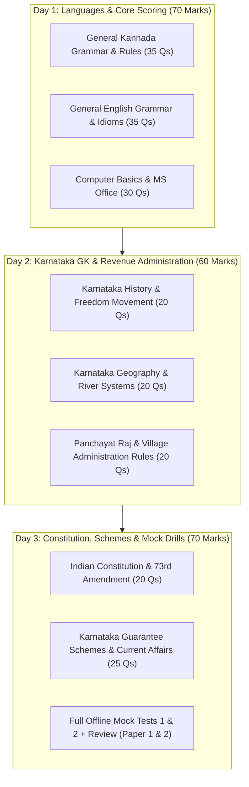

# KEA VAO 2026 — Official Syllabus, Pattern & Weightage

> [!IMPORTANT] Exam Architecture at a Glance
> - **Conducting Body:** Karnataka Examinations Authority (KEA) for the Department of Revenue (ಕಂದಾಯ ಇಲಾಖೆ).
> - **Designation:** Village Administrative Officer (VAO / ಗ್ರಾಮ ಆಡಳಿತಾಧಿಕಾರಿ - formerly ಗ್ರಾಮ ಲೆಕ್ಕಿಗ / Village Accountant).
> - **Total Competitive Marks:** 200 Marks (Paper 1: 100 Marks, Paper 2: 100 Marks).
> - **Question Format:** Multiple Choice Questions (MCQ) on OMR Sheet.
> - **Marking Scheme:** **+1.0 mark** for correct answer; **-0.25 mark (1/4th negative marking)** for every incorrect answer.
> - **Duration:** 2 Hours (120 minutes) per paper.
> - **Qualifying Paper:** Mandatory Kannada Language Examination (150 Marks, 50 marks qualifying threshold for non-Kannada medium candidates).
> - **Official Source:** [KEA Official Portal](https://cetonline.karnataka.gov.in/kea).

---

## 1. Exam Pattern Matrix

| Paper | Nomenclature | Subject Areas | No. of Questions | Maximum Marks | Duration | Negative Marking |
| :---: | :--- | :--- | :---: | :---: | :---: | :---: |
| **Paper-I** | General Knowledge (ಸಾಮಾನ್ಯ ಜ್ಞಾನ) | History, Geography, Indian Constitution, Panchayat Raj & Rural Development, Karnataka Affairs, General Science | 100 | 100 | 2 Hours (120 min) | 0.25 mark deduction |
| **Paper-II** | Language & Computer (ಭಾಷೆ ಮತ್ತು ಕಂಪ್ಯೂಟರ್ ಜ್ಞಾನ) | General Kannada (35 Qs), General English (35 Qs), Computer Knowledge (30 Qs) | 100 | 100 | 2 Hours (120 min) | 0.25 mark deduction |
| **Total** | | | **200** | **200** | **4 Hours** | |

---

## 2. Topic-Level Weightage Breakdown (Derived from Official Pattern & PYQs)

### Paper 1: General Knowledge (100 Marks / 100 Qs)

| Module / Subject | Dedicated Section | High-Yield Syllabus Focus | Estimated Marks / Qs | Priority Tier |
| :--- | :--- | :--- | :---: | :---: |
| **Karnataka & Indian History** | ಇತಿಹಾಸ | Kadambas, Badami Chalukyas, Rashtrakutas, Vijayanagara, Bahmani/Adil Shahi, Mysore Wodeyars, Hyder Ali & Tipu Sultan, Kittur Rani Chennamma, 1857 revolt in Karnataka, Unification Movement (ಏಕೀಕರಣ ಚಳವಳಿ). | 18–22 Qs | **Tier 1** |
| **Karnataka & Indian Geography** | ಭೂಗೋಳಶಾಸ್ತ್ರ | Physical divisions of Karnataka (Karavali, Malnad, Bayaluseeme), River drainage systems (Krishna, Cauvery, Tungabhadra, Sharavathi), Soil types, Agro-climatic zones, Minerals & Wildlife Sanctuaries. | 16–20 Qs | **Tier 1** |
| **Indian Constitution & Polity** | ಸಂವಿಧಾನ & ರಾಜಕೀಯ | Preamble, Fundamental Rights (Articles 14–32), DPSP, Fundamental Duties, President, Governor, State Legislature, Panchayati Raj (73rd Amendment), High Court & Subordinate Courts. | 16–18 Qs | **Tier 1** |
| **Rural Dev., Panchayat Raj & Land Admin** | ಗ್ರಾಮೀಣಾಭಿವೃದ್ಧಿ & ಕಂದಾಯ ಆಡಳಿತ | Karnataka Gram Swaraj & Panchayat Raj Act 1993, 3-tier structure (Gram, Taluk, Zilla Panchayat), Revenue hierarchy (DC, AC, Tahsildar, RI, VAO), Village Accountant duties, RTC (ಪಹಣಿ), Mutation (ನಾಮಾಂತರ). | 15–18 Qs | **Tier 1 (Core)** |
| **Current Affairs & State Welfare Schemes** | ಪ್ರಚಲಿತ ವಿದ್ಯಮಾನಗಳು & ಯೋಜನೆಗಳು | 5 State Guarantee Schemes (Gruha Lakshmi, Shakti, Yuva Nidhi, Anna Bhagya, Gruha Jyothi), Recent Karnataka budget allocations, National & International summits, Sports, Awards. | 16–20 Qs | **Tier 1** |
| **General Science & Environment** | ಸಾಮಾನ್ಯ ವಿಜ್ಞಾನ | Basic physics concepts, human biology & diseases, vitamins, environmental pollution, Western Ghats ecology, climate change. | 8–10 Qs | **Tier 2** |

---

### Paper 2: General Kannada, General English & Computer Knowledge (100 Marks / 100 Qs)

| Module / Subject | Dedicated Section | Syllabus Focus Areas | Estimated Marks / Qs | Priority Tier |
| :--- | :--- | :--- | :---: | :---: |
| **General Kannada** | ಸಾಮಾನ್ಯ ಕನ್ನಡ | ವರ್ಣಮಾಲೆ (ಸ್ವರ, ವ್ಯಂಜನ, ಯೋಗವಾಹ), ಸಂಧಿಗಳು (ಲೋಪ, ಆಗಮ, ಆದೇಶ, ಸವರ್ಣದೀರ್ಘ, ಗುಣ, ವೃದ್ಧಿ, ಯಣ್), ಸಮಾಸಗಳು (ತತ್ಪುರುಷ, ಕರ್ಮಧಾರಯ, ದ್ವಿಗು, ಬಹುವ್ರೀಹಿ, ದ್ವಂದ್ವ, ಕ್ರಿಯಾ), ತತ್ಸಮ-ತದ್ಭವ, ನಾಣ್ಣುಡಿ-ಗಾದೆಗಳು, ವಿಭಕ್ತಿ ಪ್ರತ್ಯಯಗಳು, ವಾಕ್ಯದೋಷ ತಿದ್ದುಪಡಿ. | 35 Qs | **Tier 1 (High Return)** |
| **General English** | General English | Parts of speech, Tenses, Subject-Verb Agreement, Active & Passive Voice, Direct & Indirect Speech, Prepositions, Conjunctions, Vocabulary (Synonyms, Antonyms, One-word substitutes, Idioms), Error Spotting, Comprehension. | 35 Qs | **Tier 1 (High Return)** |
| **Computer Knowledge** | ಗಣಕಯಂತ್ರ ಜ್ಞಾನ | Generations of computers, Hardware components (CPU, RAM, ROM, Cache, SSD, HDD), Operating Systems (Windows, Linux, Android), MS Office (Word, Excel shortcuts, PowerPoint, Access), Networking (LAN, WAN, IP, DNS), Cyber Security (Malware, Phishing, Firewalls), Karnataka E-governance portals (Bhoomi, K-GIS, e-Kshana, Kutumba). | 30 Qs | **Tier 1 (High Scoring)** |

---

## 3. High-Yield Preparation Strategy for 2–3 Days

---

## 4. Key Rules for Candidates
1. **Paper 2 is the Cut-off Determinant:** Candidates who master Kannada grammar, English rules, and Computer shortcuts easily score 80+ in Paper 2, which gives an insurmountable advantage.
2. **Negative Marking Defense:** With -0.25 penalty, guessing between 2 choices is mathematically advantageous, but random 1-in-4 guessing drains marks rapidly.
3. **OMR Strategy:** First pass (45 mins): answer all 100% certain questions; Second pass (45 mins): solve 50:50 questions; Final pass (30 mins): verify OMR bubbling and tackle remaining reasoning/comprehension questions.
