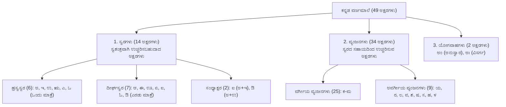
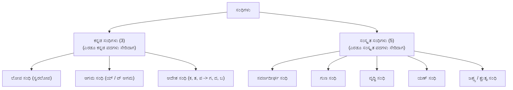
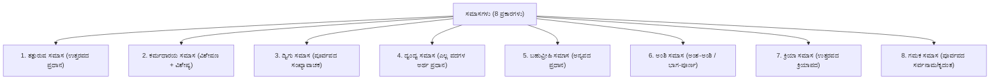

---exam: KEA VAO (Village Administrative Officer)
subject: Paper II - General Kannada (ಸಾಮಾನ್ಯ ಕನ್ನಡ)
topic: Kannada Grammar, Sandhi, Samasa & Vocabulary (ವ್ಯಾಕರಣ, ಸಂಧಿ, ಸಮಾಸ & ಶಬ್ದಕೋಶ)
priority: Tier 1 (35 Marks - High Scoring)
tags:
  - vao
  - general-kannada
  - vyakarana
  - sandhi
  - samasa
  - paper-2
  - high-yield
syllabus_refs:
  - P2-VAO-KAN-1.1
  - P2-VAO-KAN-1.2
  - P2-VAO-KAN-1.3
  - P2-VAO-KAN-1.4
  - P2-VAO-KAN-1.5
  - P2-VAO-KAN-1.6
  - P2-VAO-KAN-1.7
  - P2-VAO-KAN-1.8
last_verified: 2026-09-30
sources:
  - KEA VAO Official Notification
  - Karnataka State Secondary Board Kannada Vyakarana
---

# 01. General Kannada Grammar & Vocabulary (ಸಾಮಾನ್ಯ ಕನ್ನಡ ವ್ಯಾಕರಣ)

> [!IMPORTANT] Exam Focus & Mark Potential
> - **Expected Weightage:** **35 Questions (35 Marks)** in Paper-II.
> - **Cut-Off Decider:** Paper-II language scores separate successful candidates from the rest.
> - **Core High-Yield Areas:** ಕನ್ನಡ ವರ್ಣಮಾಲೆ (49 ಅಕ್ಷರಗಳು), ಕನ್ನಡ ಮತ್ತು ಸಂಸ್ಕೃತ ಸಂಧಿಗಳು (ಲೋಪ, ಆಗಮ, ಆದೇಶ, ಸವರ್ಣದೀರ್ಘ, ಗುಣ, ವೃದ್ಧಿ, ಯಣ್), ಎಂಟು ಪ್ರಮುಖ ಸಮಾಸಗಳು, ತತ್ಸಮ-ತದ್ಭವಗಳ ಪಟ್ಟಿ, ಮತ್ತು 7 ವಿಭಕ್ತಿ ಪ್ರತ್ಯಯಗಳು.

---

## 1. ಕನ್ನಡ ವರ್ಣಮಾಲೆ (Kannada Alphabet - 49 ಅಕ್ಷರಗಳು)

ಕನ್ನಡ ವರ್ಣಮಾಲೆಯಲ್ಲಿ ಒಟ್ಟು **49 ಅಕ್ಷರಗಳು** ಇವೆ. ಇವುಗಳನ್ನು ಮೂರು ಪ್ರಮುಖ ವಿಭಾಗಗಳಾಗಿ ವರ್ಗೀಕರಿಸಲಾಗಿದೆ:



### ವರ್ಗೀಯ ವ್ಯಂಜನಗಳ ವಿಂಗಡಣೆ (25 ಅಕ್ಷರಗಳು)

| ವರ್ಗ | ಅಲ್ಪಪ್ರಾಣ (ಕಡಿಮೆ ಉಸಿರು) | ಮಹಾಪ್ರಾಣ (ಹೆಚ್ಚು ಉಸಿರು) | ಅನುನಾಸಿಕ (ಮೂಗಿನ ಸಹಾಯ) | ಉಚ್ಚಾರಣಾ ಸ್ಥಾನ |
| :---: | :---: | :---: | :---: | :--- |
| **ಕ-ವರ್ಗ** | ಕ, ಗ | ಖ, ಘ | **ಙ** | ಕಂಠ್ಯ (ಗಂಟಲು) |
| **ಚ-ವರ್ಗ** | ಚ, ಜ | ಛ, ಝ | **ಞ** | ತಾಲವ್ಯ (ಅಂಗುಳ) |
| **ಟ-ವರ್ಗ** | ಟ, ಡ | ಠ, ಢ | **ಣ** | ಮೂರ್ಧನ್ಯ (ನಾಲಗೆಯ ತುದಿಯ ಮಡಿಚು) |
| **ತ-ವರ್ಗ** | ತ, ದ | ಥ, ಧ | **ನ** | ದಂತ್ಯ (ಹಲ್ಲುಗಳು) |
| **ಪ-ವರ್ಗ** | ಪ, ಬ | ಫ, ಭ | **ಮ** | ಓಷ್ಠ್ಯ (ತುಟಿಗಳು) |

---

## 2. ಸಂಧಿ ಪ್ರಕರಣ (Sandhi Rules)

ಎರಡು ವರ್ಣಗಳು (ಅಕ್ಷರಗಳು) ಪರಸ್ಪರ ಕಾಲವಿಳಂಬವಿಲ್ಲದೆ ಅರ್ಥವತ್ತಾಗಿ ಕೂಡುವುದನ್ನು **ಸಂಧಿ** ಎನ್ನುತ್ತಾರೆ.
- ಪೂರ್ವಪದದ ಕೊನೆಯ ಅಕ್ಷರ + ಉತ್ತರಪದದ ಮೊದಲ ಅಕ್ಷರ = ಸಂಧಿ ಪದ.



### 1. ಕನ್ನಡ ಸಂಧಿಗಳು

| ಸಂಧಿ ಹೆಸರು | ಸಂಧಿಯ ನಿಯಮ / ಲಕ್ಷಣ | ಪ್ರಮುಖ ಉದಾಹರಣೆಗಳು (ಪರೀಕ್ಷೆಯಲ್ಲಿ ಪುನರಾವರ್ತನೆ) |
| :--- | :--- | :--- |
| **ಲೋಪ ಸಂಧಿ** (ಸ್ವರಲೋಪ) | ಸ್ವರದ ಮುಂದೆ ಸ್ವರವು ಬಂದು ಸಂಧಿಯಾಗುವಾಗ ಅರ್ಥ ಕೆಡದಿದ್ದರೆ ಪೂರ್ವಪದದ ಕೊನೆಯ ಸ್ವರವು ಬಿಟ್ಟುಹೋಗುವುದು (ಲೋಪವಾಗುವುದು). | • ಊರು + ಊರು = **ಊರೂರು** ($ಉ + ಊ = ಊ$ - $ಉ$ ಲೋಪ)<br>• ಮಾತು + ಎಲ್ಲ = **ಮಾತೆಲ್ಲ** ($ಉ + ಎ = ಎ$)<br>• ಬೇರೆ + ಒಬ್ಬ = **ಬೇರೊಬ್ಬ** ($ಎ + ಒ = ಒ$) |
| **ಆಗಮ ಸಂಧಿ** (ಅಕ್ಷರಾಗಮ) | ಸ್ವರದ ಮುಂದೆ ಸ್ವರವು ಬಂದಾಗ ಅರ್ಥ ಕೆಡದಂತೆ ನಡುವೆ **'ಯ್'** ಅಥವಾ **'ವ್'** ಕಾರವು ಹೊಸದಾಗಿ ಬಂದು ಸೇರುವುದು. | • **ಯ-ಕಾರಾಗಮ:** ಮನೆ + ಅನ್ನು = **ಮನೆಯನ್ನು**; ಕೈ + ಇಂದ = **ಕೈಯಿಂದ**<br>• **ವ-ಕಾರಾಗಮ:** ಮರ + ಅನ್ನು = **ಮರವನ್ನು**; ಗುರು + ಅನ್ನು = **ಗುರುವನ್ನು**; ಹೂ + ಇಂದ = **ಹೂವಿನಿಂದ** |
| **ಆದೇಶ ಸಂಧಿ** (ವ್ಯಂಜನಾದೇಶ) | ಉತ್ತರಪದದ ಆದಿಯಲ್ಲಿರುವ **ಕ, ತ, ಪ** ವ್ಯಂಜನಗಳಿಗೆ ಕ್ರಮವಾಗಿ **ಗ, ದ, ಬ** ಕಾರಗಳು ಆದೇಶವಾಗಿ ಬರುತ್ತವೆ. (ಪ-ಬ-ವ ಸಹ ಆಗುವುದು). | • ಮಳೆ + ಕಾಲ = **ಮಳೆಗಾಲ** ($ಕ \to ಗ$)<br>• ಬೆಟ್ಟ + ತಾವರೆ = **ಬೆಟ್ಟದಾವರೆ** ($ತ \to ದ$)<br>• ಕಣ್ + ಪನಿ = **ಕಣ್ಣನಿ / ಕಂಬನಿ** ($ಪ \to ಬ$)<br>• ನೀರ್ + ಪನಿ = **ನೀರ್ಬನಿ / ನೀರ್ವನಿ** ($ಪ \to ವ$) |

### 2. ಸಂಸ್ಕೃತ ಸಂಧಿಗಳು

| ಸಂಧಿ ಹೆಸರು | ಸಂಧಿಯ ನಿಯಮ (Formula) | ಪ್ರಮುಖ ಉದಾಹರಣೆಗಳು |
| :--- | :--- | :--- |
| **ಸವರ್ಣದೀರ್ಘ ಸಂಧಿ** | ಸವರ್ಣ ಸ್ವರಗಳು ಒಂದರ ಮುಂದೊಂದು ಬಂದಾಗ ಅವೆರಡರ ಬದಲಿಗೆ ಅದೇ ಜಾತಿಯ ದೀರ್ಘಸ್ವರ ಬರುವುದು. ($ಅ/ಆ + ಅ/ಆ = ಆ$; $ಇ/ಈ + ಇ/ಈ = ಈ$; $ಉ/ಊ + ಉ/ಊ = ಊ$) | • ದೇವ + ಆಲಯ = **ದೇವಾಲಯ**<br>• ಗಿರಿ + ಈಶ = **ಗಿರೀಶ**<br>• ಗುರು + ಉಪದೇಶ = **ಗುರೂಪದೇಶ** |
| **ಗುಣ ಸಂಧಿ** | • $ಅ/ಆ + ಇ/ಈ = \mathbf{ಏ}$<br>• $ಅ/ಆ + ಉ/ಊ = \mathbf{ಓ}$<br>• $ಅ/ಆ + ಋ = \mathbf{ಅರ್}$ | • ಮಹಾ + ಈಶ = **ಮಹೇಶ**<br>• ಸೂರ್ಯ + ಉದಯ = **ಸೂರ್ಯೋದಯ**<br>• ದೇವ + ಋಷಿ = **ದೇವರ್ಷಿ**<br>• ಚಂದ್ರ + ಉದಯ = **ಚಂದ್ರೋದಯ** |
| **ವೃದ್ಧಿ ಸಂಧಿ** | • $ಅ/ಆ + ಏ/ಐ = \mathbf{ಐ}$<br>• $ಅ/ಆ + ಓ/ಔ = \mathbf{ಔ}$ | • ಏಕ + ಏಕ = **ಏಕೈಕ**<br>• ಲೋಕ + ಏಕವೀರ = **ಲೋಕೈಕವೀರ**<br>• ವನ + ಔಷಧಿ = **ವನೌಷಧಿ**<br>• ಜಲ + ಓಘ = **ಜಲೌಘ** |
| **ಯಣ್ ಸಂಧಿ** | $ಇ, ಈ, ಉ, ಊ, ಋ$ ಸ್ವರಗಳ ಮುಂದೆ ಬೇರೆ ಜಾತಿಯ ಅನ್ಯಸ್ವರ ಬಂದರೆ ಕ್ರಮವಾಗಿ **ಯ್, ವ್, ರ್** ಕಾರಗಳು ಬರುತ್ತವೆ. | • ಕೋಟಿ + ಅಧೀಶ = **ಕೋಟ್ಯಧೀಶ** ($ಇ + ಅ \to ಯ್$)<br>• ಜಾತಿ + ಅತೀತ = **ಜಾತ್ಯತೀತ**<br>• ಗುರು + ಆಜ್ಞೆ = **ಗುರ್ವಾಜ್ಞೆ** ($ಉ + ಆ \to ವ್$)<br>• ಪಿತೃ + ಆರ್ಜಿತ = **ಪಿತ್ರಾರ್ಜಿತ** ($ಋ + ಆ \to ರ್$) |

---

## 3. ಸಮಾಸ ಪ್ರಕರಣ (Compound Words)

ಎರಡು ಅಥವಾ ಎರಡಕ್ಕಿಂತ ಹೆಚ್ಚು ಪದಗಳು ಅರ್ಥಕ್ಕನುಗುಣವಾಗಿ ಸೇರಿ ಮಧ್ಯದಲ್ಲಿರುವ ವಿಭಕ್ತಿ ಪ್ರತ್ಯಯವನ್ನು ಕಳೆದುಕೊಂಡು ಒಂದೇ ಪದವಾಗುವುದನ್ನು **ಸಮಾಸ** ಎನ್ನುತ್ತಾರೆ.



### ಸಮಾಸಗಳ ವಿವರಣಾ ಕೋಷ್ಟಕ

| ಸಮಾಸ ಹೆಸರು | ಪ್ರಮುಖ ಲಕ್ಷಣ / ವ್ಯಾಖ್ಯೆ | ಪರೀಕ್ಷಾ ಉದಾಹರಣೆಗಳು |
| :--- | :--- | :--- |
| **ತತ್ಪುರುಷ ಸಮಾಸ** | ಪೂರ್ವಪದವು ನಾಮಪದವಾಗಿದ್ದು, ಉತ್ತರಪದದ ಅರ್ಥವು ಪ್ರಧಾನವಾಗಿರುವ ಸಮಾಸ. | • ಮರದ + ಕಾಲು = **ಮರಗಾಲು**<br>• ಹಾಲಿನ + ಬಣ್ಣ = **ಹಾಲ್ಬಣ್ಣ**<br>• ತಲೆಯಲ್ಲಿ + ನೋವು = **ತಲೆನೋವು** |
| **ಕರ್ಮಧಾರಯ ಸಮಾಸ** | ಪೂರ್ವಪದವು ವಿಶೇಷಣವಾಗಿಯೂ, ಉತ್ತರಪದವು ವಿಶೇಷ್ಯವಾಗಿಯೂ ಇರುವ ಸಮಾಸ. | • ಹಿರಿದಾದ + ಮರ = **ಹೆಮ್ಮರ**<br>• ಕರಿದಾದ + ಕೂದಲು = **ಕಂಗೂದಲು**<br>• ಇನಿದಾದ + ಸರ = **ಇಂಚರ**<br>• ಕೆಂಪಾದ + ತುಟಿ = **ಕೆಂದುಟಿ** |
| **ದ್ವಿಗು ಸಮಾಸ** | ಪೂರ್ವಪದವು **ಸಂಖ್ಯಾವಾಚಕ**ವಾಗಿದ್ದು, ಉತ್ತರಪದವು ನಾಮಪದವಾಗಿರುವ ಸಮಾಸ. | • ಮೂರು + ಮಡಿ = **ಮುಮ್ಮಡಿ**<br>• ಎರಡು + ಮಡಿ = **ಇಮ್ಮಡಿ**<br>• ಏಳು + ಕಡಲು = **ಏಳ್ಗಡಲು**<br>• ನಾಲ್ಕು + ದೆಸೆ = **ನಾಲ್ದೆಸೆ** |
| **ದ್ವಂದ್ವ ಸಮಾಸ** | ಸಮಾಸದಲ್ಲಿರುವ ಎಲ್ಲಾ ನಾಮಪದಗಳ ಅರ್ಥವೂ ಸಮಾನವಾಗಿ ಪ್ರಧಾನವಾಗಿರುವ ಸಮಾಸ. | • ಗಿಡವೂ + ಮರವೂ + ಬಳ್ಳಿಯೂ = **ಗಿಡಮರಬಳ್ಳಿಗಳು**<br>• ಹಗಲೂ + ಇರುಳೂ = **ಹಗಲಿರುಳು**<br>• ಭೀಮನೂ + ಅರ್ಜುನನೂ = **ಭೀಮಾರ್ಜುನರು** |
| **ಬಹುವ್ರೀಹಿ ಸಮಾಸ** | ಸೇರಿದ ಪದಗಳ ಅರ್ಥವಲ್ಲದೆ, **ಬೇರೊಂದು ಮೂರನೆಯ (ಅನ್ಯ) ವ್ಯಕ್ತಿಯ/ವಸ್ತುವಿನ ಅರ್ಥ** ಪ್ರಧಾನವಾಗಿರುವ ಸಮಾಸ. | • ಮುಕ್ಕಣ್ಣ (ಮೂರು ಕಣ್ಣುಳ್ಳವನು - **ಶಿವ**)<br>• ಚಕ್ರಪಾಣಿ (ಕೈಯಲ್ಲಿ ಚಕ್ರ ಉಳ್ಳವನು - **ವಿಷ್ಣು**)<br>• ಫಾಲನೇತ್ರ (ಹಣೆಯಲ್ಲಿ ಕಣ್ಣುಳ್ಳವನು - **ಈಶ್ವರ**) |
| **ಅಂಶಿ ಸಮಾಸ** | ಪೂರ್ವಪದವು ಅಂಗದ (ಭಾಗದ) ಹೆಸರಾಗಿದ್ದು, ಉತ್ತರಪದವು ಪೂರ್ಣ ವಸ್ತುವಿನ ಹೆಸರಾಗಿರುವ ಸಮಾಸ. | • ಕೈಯ + ಮುಂಭಾಗ = **ಮುಂಗೈ**<br>• ಕಾಲಿನ + ಹಿಂಭಾಗ = **ಹಿಂಗಾಲು**<br>• ನಾಲಗೆಯ + ತುದಿ = **ತುದಿನಾಲಗೆ** |
| **ಕ್ರಿಯಾ ಸಮಾಸ** | ಪೂರ್ವಪದವು ದ್ವಿತೀಯಾ ವಿಭಕ್ತ್ಯಂತ ನಾಮಪದವಾಗಿದ್ದು, ಉತ್ತರಪದವು **ಕ್ರಿಯಾಪದ**ವಾಗಿರುವ ಸಮಾಸ. | • ಕೈಯನ್ನು + ಮುಗಿ = **ಕೈಮುಗಿ**<br>• ಕಣ್ಣನ್ನು + ತೆರೆ = **ಕಣ್ತೆರೆ**<br>• ಮೈಯನ್ನು + ತಡವು = **ಮೈದಡವು** |
| **ಗಮಕ ಸಮಾಸ** | ಪೂರ್ವಪದವು ಸರ್ವನಾಮ ಅಥವಾ ಕೃದಂತವಾಗಿದ್ದು, ಉತ್ತರಪದವು ನಾಮಪದವಾಗಿರುವ ಸಮಾಸ. | • ಆ + ಹುಡುಗ = **ಆ ಹುಡುಗ**<br>• ಮಾಡಿದ + ಅಡುಗೆ = **ಮಾಡಿದಡುಗೆ**<br>• ಓಡುವ + ಕುದುರೆ = **ಓಡುವ ಕುದುರೆ** |

---

## 4. ತತ್ಸಮ - ತದ್ಭವ ಪಟ್ಟಿ (High-Yield Tatsama-Tadbhav)

ಸಂಸ್ಕೃತದ ಮೂಲ ರೂಪವೇ **ತತ್ಸಮ**; ಸಂಸ್ಕೃತದಿಂದ ಕನ್ನಡೀಕರಣಗೊಂಡು ಬದಲಾದ ರೂಪವೇ **ತದ್ಭವ**.

| ತತ್ಸಮ (ಸಂಸ್ಕೃತ) | ತದ್ಭವ (ಕನ್ನಡ) | ತತ್ಸಮ (ಸಂಸ್ಕೃತ) | ತದ್ಭವ (ಕನ್ನಡ) |
| :--- | :--- | :--- | :--- |
| **ಆಶ್ಚರ್ಯ** | ಅಚ್ಚರಿ | **ಲಕ್ಷ್ಮೀ** | ಲಕುಮಿ |
| **ಮುಖ** | ಮೊಗ | **ಕಾರ್ಯ** | ಕಜ್ಜ |
| **ವರ್ಷ** | ವರುಷ / ವರುಸ | **ಯುದ್ಧ** | ಜುಂಜು |
| **ಶೃಂಗಾರ** | ಸಿಂಗಾರ | **ಸ್ಥನ** | ತನ |
| **ಬ್ರಹ್ಮ** | ಬೊಮ್ಮ | **ಶಕ್ತಿ** | ಸಕುತಿ |
| **ಅಕ್ಷರ** | ಅಕ್ಕರ | **ಚಂದ್ರ** | ಚಂದಿರ |
| **ಪ್ರಾಣ** | ಹರಣ | **ರಾಜ** | ರಾಯ |
| **ಭಕ್ತಿ** | ಬಕುತಿ | **ಧರ್ಮ** | ದಮ್ಮ |
| **ಕುಲ** | ಕೊಳ | **ವಿದ್ಯಾ** | ಬಿಜ್ಜೆ |

---

## 5. ವಿಭಕ್ತಿ ಪ್ರತ್ಯಯಗಳು (Vibhakti Pratyayagalu)

| ವಿಭಕ್ತಿ | ಕಾರಕಾರ್ಥ (ಕಾರ್ಯ) | ಹಳೆಗನ್ನಡ ಪ್ರತ್ಯಯ | ಹೊಸಗನ್ನಡ ಪ್ರತ್ಯಯ | ಉದಾಹರಣೆ (ಮರ) |
| :---: | :--- | :---: | :---: | :--- |
| **ಪ್ರಥಮಾ** | ಕರ್ತೃ ಕಾರಕ | ಮ್ | **ಉ** | ಮರ + ಉ = ಮರವು |
| **ದ್ವಿತೀಯಾ** | ಕರ್ಮ ಕಾರಕ | ಅಮ್ | **ಅನ್ನು** | ಮರ + ಅನ್ನು = ಮರವನ್ನು |
| **ತೃತೀಯಾ** | ಕರಣ ಕಾರಕ (ಸಾಧನ) | ಇಂ, ಇಂದಂ | **ಇಂದ** | ಮರ + ಇಂದ = ಮರದಿಂದ |
| **ಚತುರ್ಥಿ** | ಸಂಪ್ರದಾನ (ಕೊಡುವಿಕೆ) | ಗೆ, ಂಗೆ, ಕ್ಕೆ | **ಗೆ, ಇಗೆ, ಕ್ಕೆ** | ಮರ + ಕ್ಕೆ = ಮರಕ್ಕೆ |
| **ಪಂಚಮೀ** | ಅಪಾದಾನ (ಬೇರ್ಪಡುವಿಕೆ) | ಅತ್ತಣಿಂ | **ದೆಸೆಯಿಂದ** | ಮರದ + ದೆಸೆಯಿಂದ |
| **ಷಷ್ಠೀ** | ಸಂಬಂಧ ಕಾರಕ | ಅ | **ಅ** | ಮರ + ಅ = ಮರದ |
| **ಸಪ್ತಮೀ** | ಅಧಿಕರಣ ಕಾರಕ (ಆಶ್ರಯ) | ಒಳ್ | **ಅಲ್ಲಿ** | ಮರ + ಅಲ್ಲಿ = ಮರದಲ್ಲಿ |
| **ಸಂಬೋಧನಾ** | ಆಹ್ವಾನ (ಕರೆಯುವುದು) | ಆ, ಈ, ಏ | **ಏ, ಇರಾ** | ಮರವೇ, ದೇವನೇ |

---

## 6. High-Yield Mnemonics

> [!NOTE] Memory Aids
> - **ಆದೇಶ ಸಂಧಿ ವ್ಯಂಜನ ಪರಿವರ್ತನೆ: "ಕ-ತ-ಪ $\to$ ಗ-ದ-ಬ"**
>   - ಉತ್ತರಪದದ ಮೊದಲ ಅಕ್ಷರ ಕ $\to$ ಗ, ತ $\to$ ದ, ಪ $\to$ ಬ.
> - **ಗುಣ ಸಂಧಿಯ ಫಲಿತಾಂಶ: "ಏ, ಓ, ಅರ್"**
>   - ಗುಣ ಸಂಧಿಯಲ್ಲಿ ಬರುವ ಹೊಸ ಸ್ವರಗಳು: ಮಹೇಶ (ಏ), ಸೂರ್ಯೋದಯ (ಓ), ದೇವರ್ಷಿ (ಅರ್).
> - **ದ್ವಿಗು ಸಮಾಸ ಗುರುತಿಸುವಿಕೆ: "ದ್ವಿಗು ಅಂದರೆ ಡಿಜಿಟ್ (Digit)"**
>   - ಪೂರ್ವಪದ ಸಂಖ್ಯೆ (Digit) ಆಗಿದ್ದರೆ ಅದು ದ್ವಿಗು ಸಮಾಸ (ಮುಮ್ಮಡಿ, ಏಳ್ಗಡಲು).

---

## 7. Likely Exam Questions & PYQ Patterns

1. **[KEA VAO PYQ]** *'ಮಳೆಗಾಲ' ಪದವು ಯಾವ ಸಂಧಿಗೆ ಉದಾಹರಣೆಯಾಗಿದೆ?*
   - ಮಳೆ + ಕಾಲ = ಮಳೆಗಾಲ (ಉತ್ತರಪದದ 'ಕ' ಕಾರಕ್ಕೆ 'ಗ' ಕಾರ ಬಂದಿದೆ) $\implies$ **ಆದೇಶ ಸಂಧಿ**.
2. **[KEA PYQ]** *'ಮುಕ್ಕಣ್ಣ' ಎಂಬುದು ಯಾವ ಸಮಾಸಕ್ಕೆ ಸೂಕ್ತ ಉದಾಹರಣೆ?*
   - ಮೂರು ಕಣ್ಣುಳ್ಳವನು ಅಂದರೆ ಶಿವ (ಅನ್ಯಪದದ ಅರ್ಥ ಪ್ರಧಾನ) $\implies$ **ಬಹುವ್ರೀಹಿ ಸಮಾಸ**.
3. **[Expected Question]** *'ಆಶ್ಚರ್ಯ' ಪದದ ಸರಿಯಾದ ತದ್ಭವ ರೂಪ ಯಾವುದು?*
   - **ಉತ್ತರ:** ಅಚ್ಚರಿ.
4. **[Expected Question]** *ಕನ್ನಡ ವರ್ಣಮಾಲೆಯಲ್ಲಿರುವ ಯೋಗವಾಹಗಳ ಸಂಖ್ಯೆ ಎಷ್ಟು ಮತ್ತು ಅವು ಯಾವುವು?*
   - **ಉತ್ತರ:** 2 (ಅಂ - ಅನುಸ್ವಾರ, ಅಃ - ವಿಸರ್ಗ).
5. **[Expected Question]** *'ಕೋಟ್ಯಧೀಶ' ಪದವನ್ನು ಬಿಡಿಸಿ ಬರೆದಾಗ ಯಾವ ಸಂಧಿಯಾಗುತ್ತದೆ?*
   - ಕೋಟಿ + ಅಧೀಶ = ಕೋಟ್ಯಧೀಶ ($ಇ + ಅ \to ಯ್$) $\implies$ **ಯಣ್ ಸಂಧಿ**.

---

## 8. Quick Revision Box

```
┌────────────────────────────────────────────────────────────────────────┐
│ ಸಾಮಾನ್ಯ ಕನ್ನಡ ವ್ಯಾಕರಣ REVISION CHEAT SHEET                            │
├────────────────────────────────────────────────────────────────────────┤
│ • ವರ್ಣಮಾಲೆ: 49 ಅಕ್ಷರಗಳು (ಸ್ವರ 14, ವ್ಯಂಜನ 34, ಯೋಗವಾಹ 2: ಅಂ, ಅಃ).          │
│ • ಲೋಪ ಸಂಧಿ: ಸ್ವರ ಬಿಟ್ಟುಹೋಗುವುದು (ಊರೂರು, ಮಾತೆಲ್ಲ).                         │
│ • ಆಗಮ ಸಂಧಿ: 'ಯ್' ಅಥವಾ 'ವ್' ಹೊಸದಾಗಿ ಸೇರುವುದು (ಮನೆಯನ್ನು, ಮರವನ್ನು).          │
│ • ಆದೇಶ ಸಂಧಿ: ಕ-ತ-ಪ ಗಳಿಗೆ ಗ-ದ-ಬ ಬರುವುದು (ಮಳೆಗಾಲ, ಬೆಟ್ಟದಾವರೆ, ಕಂಬನಿ).        │
│ • ಸವರ್ಣದೀರ್ಘ: ದೇವಾಲಯ, ಗಿರೀಶ | ಗುಣ ಸಂಧಿ: ಮಹೇಶ, ಸೂರ್ಯೋದಯ, ದೇವರ್ಷಿ.       │
│ • ವೃದ್ಧಿ ಸಂಧಿ: ಲೋಕೈಕವೀರ, ವನೌಷಧಿ | ಯಣ್ ಸಂಧಿ: ಕೋಟ್ಯಧೀಶ, ಗುರ್ವಾಜ್ಞೆ.           │
│ • ತತ್ಪುರುಷ: ಉತ್ತರಪದ ಪ್ರಧಾನ (ಮರಗಾಲು) | ಕರ್ಮಧಾರಯ: ವಿಶೇಷಣ (ಹೆಮ್ಮರ).        │
│ • ದ್ವಿಗು: ಸಂಖ್ಯೆ ಪ್ರಧಾನ (ಮುಮ್ಮಡಿ) | ದ್ವಂದ್ವ: ಸಮಾನ (ಗಿಡಮರಬಳ್ಳಿಗಳು).          │
│ • ಬಹುವ್ರೀಹಿ: ಅನ್ಯ ವ್ಯಕ್ತಿ ಪ್ರಧಾನ (ಮುಕ್ಕಣ್ಣ - ಶಿವ, ಚಕ್ರಪಾಣಿ - ವಿಷ್ಣು).         │
│ • ವಿಭಕ್ತಿ: ಪ್ರಥಮಾ(ಉ), ದ್ವಿತೀಯಾ(ಅನ್ನು), ತೃತೀಯಾ(ಇಂದ), ಚತುರ್ಥಿ(ಗೆ/ಕ್ಕೆ),      │
│   ಪಂಚಮೀ(ದೆಸೆಯಿಂದ), ಷಷ್ಠೀ(ಅ), ಸಪ್ತಮೀ(ಅಲ್ಲಿ).                             │
└────────────────────────────────────────────────────────────────────────┘
```

---
*Related Notes:*
- [[02_General_English_Grammar_and_Comprehension]]
- [[03_Computer_Knowledge_and_MS_Office]]
- [[07_Panchayat_Raj_Act_and_Rural_Administration]]
