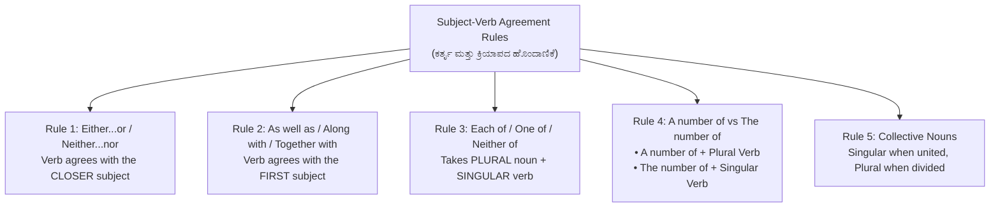
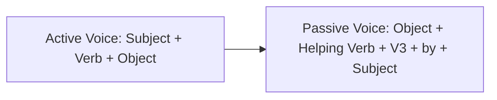

---exam: KEA VAO (Village Administrative Officer)
subject: Paper II - General English
topic: English Grammar, Syntax, Idioms & Error Spotting (ಸಾಮಾನ್ಯ ಇಂಗ್ಲಿಷ್)
priority: Tier 1 (35 Marks - High Scoring)
tags:
  - vao
  - general-english
  - grammar
  - syntax
  - vocabulary
  - paper-2
  - high-yield
syllabus_refs:
  - P2-VAO-ENG-2.1
  - P2-VAO-ENG-2.2
  - P2-VAO-ENG-2.3
  - P2-VAO-ENG-2.4
  - P2-VAO-ENG-2.5
  - P2-VAO-ENG-2.6
  - P2-VAO-ENG-2.7
  - P2-VAO-ENG-2.8
last_verified: 2026-09-30
sources:
  - KEA VAO Official Notification
  - Wren and Martin High School English Grammar
---

# 02. General English Grammar & Comprehension (ಸಾಮಾನ್ಯ ಇಂಗ್ಲಿಷ್)

> [!IMPORTANT] Exam Focus & Mark Potential
> - **Expected Weightage:** **35 Questions (35 Marks)** in Paper-II.
> - **High-Yield Scoring Rules:** Subject-Verb Agreement exceptions, Conditional clause formulas ("If + had V3... would have V3"), Active/Passive conversion, Direct to Indirect speech tense shifts, Fixed Prepositions (Senior *to*, Congratulate *on*), and High-Frequency Idioms.

---

## 1. Subject-Verb Agreement: The 5 Golden Rules



### Examples & Analysis
1. **Closer Subject Rule:**
   - *Incorrect:* Neither the teacher nor the students was present.
   - *Correct:* Neither the teacher nor the students **were** present. (Closer subject "students" is plural).
   - *Correct:* Neither the students nor the teacher **was** present. (Closer subject "teacher" is singular).
2. **First Subject Rule:**
   - The Captain, along with all his sailors, **was** drowned. (Subject is "The Captain" - singular).
3. **"One of / Each of" Rule:**
   - One of the **students is** absent today. (Plural noun "students", singular verb "is").
4. **"A number" vs "The number":**
   - **A number of** applicants **have** applied. (Plural).
   - **The number of** seats **is** fifty. (Singular specific total).

---

## 2. Conditional Sentences (The 3 Classical Types)

| Conditional Type | If-Clause (Condition) | Main Clause (Result) | Practical Exam Example |
| :---: | :--- | :--- | :--- |
| **Type 1: Probable** | If + **Simple Present** ($V_1$) | Subject + **will / shall + $V_1$** | If he **works** hard, he **will pass** the exam. |
| **Type 2: Hypothetical** | If + **Simple Past** ($V_2$ / were) | Subject + **would / could + $V_1$** | If I **were** the Prime Minister, I **would eliminate** poverty. |
| **Type 3: Impossible Past** | If + **Past Perfect** (had + $V_3$) | Subject + **would have + $V_3$** | If you **had studied**, you **would have cleared** the exam. |

> [!CAUTION] High-Frequency Trap in Type 3
> Never write: *"If you would have studied..."* $\implies$ The If-clause **never takes 'would'**! Always write: *"If you had studied..."*

---

## 3. Active and Passive Voice Transformations



### Tense Conversion Rules Matrix

| Tense | Active Voice | Passive Voice | Example |
| :--- | :--- | :--- | :--- |
| **Simple Present** | writes | is / am / are + **written** | A letter is written by him. |
| **Present Continuous** | is writing | is / am / are + **being written** | A letter is **being written** by him. |
| **Present Perfect** | has written | has / have + **been written** | A letter has **been written** by him. |
| **Simple Past** | wrote | was / were + **written** | A letter was written by him. |
| **Past Continuous** | was writing | was / were + **being written** | A letter was **being written** by him. |
| **Past Perfect** | had written | had + **been written** | A letter had **been written** by him. |
| **Modal Verbs** | can / must write | can / must + **be written** | This task must **be done**. |
| **Imperative (Orders)** | Shut the door | **Let + Object + be + $V_3$** | **Let** the door **be shut**. |

---

## 4. Direct to Indirect Speech (Tense & Time Shifts)

When reporting speech introduced by a reporting verb in the past tense (e.g., *He said*):
- **Simple Present $\to$ Simple Past:** "I work" $\to$ He worked.
- **Present Continuous $\to$ Past Continuous:** "I am playing" $\to$ He was playing.
- **Present Perfect $\to$ Past Perfect:** "I have seen" $\to$ He had seen.
- **Simple Past $\to$ Past Perfect:** "I saw" $\to$ He had seen.
- **Universal Truth Exception:** Tense **does NOT change** for eternal truths!
  - *Direct:* The teacher said, "The Earth revolves around the Sun."
  - *Indirect:* The teacher said that the Earth **revolves** around the Sun.

### Time & Pronoun Shifts:
- *Now* $\to$ *Then* | *Today* $\to$ *That day* | *Yesterday* $\to$ *The previous day* | *Tomorrow* $\to$ *The next day / following day* | *Here* $\to$ *There* | *This* $\to$ *That*.

---

## 5. Fixed Prepositions (KEA Exam Favorites)

Never replace these prepositions with "than" or "of":
- **Senior / Junior / Superior / Inferior / Prior / Preferable:** Always followed by **TO** (Never *than*!).
  - *Correct:* He is senior **to** me. *(Not senior than me)*.
  - *Correct:* Coffee is preferable **to** tea.
- **Congratulate:** Followed by **ON** (Not *for*). $\implies$ I congratulated him **on** his grand success.
- **Prevent / Abstain / Prohibit:** Followed by **FROM + V-ing**. $\implies$ He was prevented **from** entering.
- **Accused:** Followed by **OF** (Not *with*). $\implies$ He was accused **of** theft.
- **Die of vs Die from:**
  - Die **of** a disease (He died **of** cholera).
  - Die **from** a cause/overwork/exhaustion (He died **from** over-exhaustion).

---

## 6. High-Frequency Idioms & Phrases

| Idiom / Phrase | Literal / Actual Meaning | Sentence Context |
| :--- | :--- | :--- |
| **At the eleventh hour** | At the very last moment. | He submitted his scholarship application at the eleventh hour. |
| **A blessing in disguise** | Something good that seemed bad at first. | Missing that bus was a blessing in disguise; it met with an accident. |
| **Burn the midnight oil** | Work or study late into the night. | The candidate burned the midnight oil before the KEA exam. |
| **Break the ice** | Initiate conversation in a silent or awkward situation. | The host told an amusing joke to break the ice. |
| **Once in a blue moon** | Very rarely / infrequently. | He visits his native village once in a blue moon. |
| **Bite the bullet** | Face a painful or difficult situation with courage. | He decided to bite the bullet and confess his mistake. |

---

## 7. High-Yield Mnemonics

> [!NOTE] Memory Aids
> - **Latin Adjectives take 'TO': "S-J-S-I-P"**
>   - **S**enior, **J**unior, **S**uperior, **I**nferior, **P**rior all take **TO**, never *than*.
> - **Type 3 Conditional: "Had Done $\to$ Would Have Won"**
>   - If + **had** $V_3$ $\implies$ **would have** $V_3$.
> - **Congratulate: "Gratitude ON the date"**
>   - Congratulate takes **ON**, never *for*.

---

## 8. Likely Exam Questions & PYQ Patterns

1. **[KEA VAO PYQ]** *Choose the grammatically correct sentence:*
   - (A) He is senior than me in service.
   - (B) He is senior to me in service.
   - **Answer:** (B) He is senior **to** me in service.
2. **[KEA PYQ]** *If she had arrived on time, she ________ the train.*
   - (A) would catch
   - (B) would have caught
   - (C) will catch
   - **Answer:** (B) would have caught (Type 3 conditional).
3. **[Expected Question]** *Change into Passive Voice: "The municipal workers are repairing the road."*
   - **Answer:** The road **is being repaired** by the municipal workers.
4. **[Expected Question]** *Identify the meaning of the idiom: "To turn a deaf ear"*
   - **Answer:** To ignore or refuse to listen.
5. **[Expected Question]** *Fill in the blank: "One of my friends ________ living in Canada."*
   - (A) are
   - (B) is
   - (C) were
   - **Answer:** (B) **is** ("One of" takes singular verb).

---

## 9. Quick Revision Box

```
┌────────────────────────────────────────────────────────────────────────┐
│ GENERAL ENGLISH GRAMMAR REVISION CHEAT SHEET                           │
├────────────────────────────────────────────────────────────────────────┤
│ • Either/Neither...nor: Verb agrees with nearer subject.               │
│ • Along with / As well as: Verb agrees with FIRST subject.             │
│ • One of / Each of + Plural Noun + SINGULAR Verb.                      │
│ • Type 3: If + had V3 ... would have V3. (No 'would have' in if-clause)│
│ • Passive Continuous: is/was + BEING + V3. Perfect: has/had + BEEN + V3│
│ • Senior/Junior/Superior/Preferable: ALWAYS followed by 'TO'.          │
│ • Congratulate ON | Accused OF | Prevent FROM | Died OF disease.       │
│ • Universal Truth: Indirect speech does NOT change present tense.      │
│ • At the eleventh hour: At the very last moment.                       │
│ • Break the ice: To start a conversation in awkward silence.           │
└────────────────────────────────────────────────────────────────────────┘
```

---
*Related Notes:*
- [[01_General_Kannada_Grammar_and_Vocabulary]]
- [[03_Computer_Knowledge_and_MS_Office]]
- [[07_Panchayat_Raj_Act_and_Rural_Administration]]
