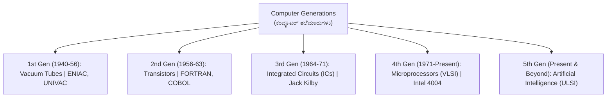
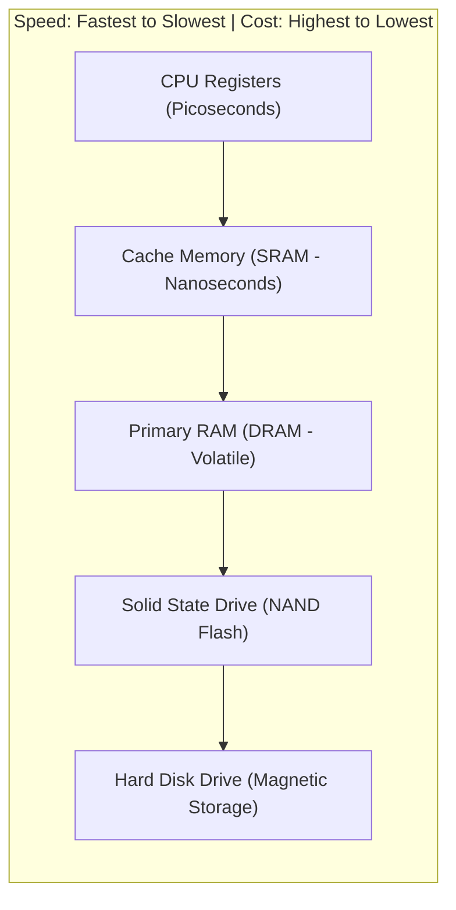
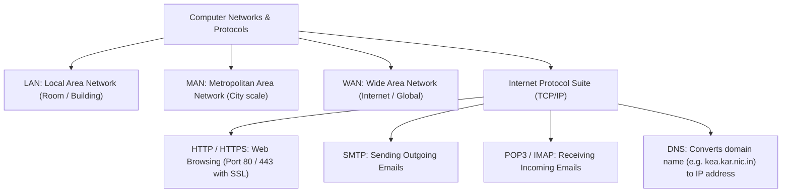

---exam: KEA VAO (Village Administrative Officer)
subject: Paper II - Computer Knowledge (ಗಣಕಯಂತ್ರ ಜ್ಞಾನ)
topic: Hardware, Operating Systems, MS Office & Cybersecurity
priority: Tier 1 (30 Marks - High Scoring)
tags:
  - vao
  - computer-knowledge
  - ms-office
  - internet
  - cybersecurity
  - paper-2
  - high-yield
syllabus_refs:
  - P2-VAO-COMP-3.1
  - P2-VAO-COMP-3.2
  - P2-VAO-COMP-3.3
  - P2-VAO-COMP-3.4
  - P2-VAO-COMP-3.5
  - P2-VAO-COMP-3.6
last_verified: 2026-09-30
sources:
  - KEA VAO Official Notification
  - Computer Fundamentals & MS Office Standards
  - CeG Karnataka
---

# 03. Computer Knowledge & MS Office (ಗಣಕಯಂತ್ರ ಜ್ಞಾನ)

> [!IMPORTANT] Exam Focus & Mark Potential
> - **Expected Weightage:** **30 Questions (30 Marks)** in Paper-II.
> - **High-Yield Scoring Focus:** Computer Generations & Components, Memory Hierarchy (Cache > RAM > SSD > HDD), MS Office Shortcut Keys (Word, Excel formulas, PowerPoint), Networking Protocols (IP, DNS, SMTP, POP3), and Cybersecurity Threat Types (Phishing, Trojan, Ransomware).

---

## 1. Computer Generations & Architectural Hardware



### Central Processing Unit (CPU) & Memory Hierarchy



### Memory & Storage Units Matrix
- **1 Bit** = Binary digit (0 or 1).
- **1 Nibble** = **4 Bits**.
- **1 Byte** = **8 Bits** (1 ASCII character).
- **1 Kilobyte (KB)** = **1,024 Bytes** ($2^{10}$).
- **1 Megabyte (MB)** = **1,024 KB** ($2^{20}$).
- **1 Gigabyte (GB)** = **1,024 MB** ($2^{30}$).
- **1 Terabyte (TB)** = **1,024 GB** ($2^{40}$).
- **1 Petabyte (PB)** = **1,024 TB** ($2^{50}$).

---

## 2. Operating Systems & Software Classification

- **System Software:** Operating System (OS) manages hardware resources.
  - Examples: **Windows**, **Linux** (Open-source kernel created by Linus Torvalds), **UNIX**, **macOS**, **Android**, **iOS**.
- **Application Software:** Programs designed to execute specific end-user tasks.
  - Examples: MS Word, Excel, Photoshop, Web Browsers (Chrome, Edge, Firefox).
- **Open-Source Software:** Source code is freely accessible, modifiable, and distributable (e.g., Linux, VLC Media Player, Python, LibreOffice).
- **Firmware / BIOS (Basic Input/Output System):** Stored in **ROM (Read-Only Memory)** on motherboard; runs the **POST (Power-On Self-Test)** during computer booting.

---

## 3. MS Office Productivity Suite (KEA Exam Essentials)

### High-Yield Shortcut Keys Matrix

| Shortcut Key | MS Word Function | MS Excel Function | MS PowerPoint Function |
| :--- | :--- | :--- | :--- |
| **Ctrl + C / Ctrl + V** | Copy / Paste | Copy / Paste | Copy / Paste |
| **Ctrl + Z / Ctrl + Y** | Undo / Redo | Undo / Redo | Undo / Redo |
| **Ctrl + K** | **Insert Hyperlink** | **Insert Hyperlink** | **Insert Hyperlink** |
| **Ctrl + H** | Find and Replace | Find and Replace | Find and Replace |
| **F7** | **Spelling & Grammar Check** | Spelling Check | Spelling Check |
| **Ctrl + S** | Save document | Save workbook | Save presentation |
| **Ctrl + E** | Center Alignment | Flash Fill | Center Alignment |
| **Ctrl + J** | Justify Paragraph Alignment | N/A | Justify Alignment |
| **F5** | Go To dialog | Go To cell | **Start Slide Show from Beginning** |
| **Shift + F5** | N/A | N/A | **Start Slide Show from Current Slide** |
| **F12** | Save As | Save As | Save As |

### MS Excel Core Formulas & Rules
- **Formula Prefix:** Every Excel formula **MUST start with an equals sign (`=`)**.
- **Cell Referencing:**
  - *Relative Reference:* `A1` (Changes when formula is dragged).
  - *Absolute Reference:* **`$A$1`** (Locked with dollar signs; does not change when copied).
  - *Mixed Reference:* `$A1` or `A$1`.
- **Key Functions:**
  - `=SUM(A1:A10)`: Calculates total sum of range.
  - `=AVERAGE(A1:A10)`: Computes arithmetic mean.
  - `=COUNT(A1:A10)`: Counts cells containing **numbers only**.
  - `=COUNTA(A1:A10)`: Counts all **non-empty cells** (numbers and text).
  - `=VLOOKUP(lookup_value, table_array, col_index_num, [range_lookup])`: Vertical lookup.
  - `=IF(condition, value_if_true, value_if_false)`: Logical evaluation.

---

## 4. Networking, Web Protocols & Internet



### IP Address vs MAC Address
- **IPv4 Address:** **32-bit** logical numeric address expressed as 4 decimal octets separated by dots (e.g., `192.168.1.1`).
- **IPv6 Address:** **128-bit** hexadecimal address introduced to overcome IPv4 exhaustion (e.g., `2001:0db8:85a3::8a2e:0370:7334`).
- **MAC Address (Media Access Control):** **48-bit** permanent physical hardware identifier burned into the Network Interface Card (NIC).

---

## 5. Cybersecurity Threats & Karnataka E-Governance

| Threat Name | Mechanism of Attack | Countermeasure / Security Protocol |
| :--- | :--- | :--- |
| **Phishing (ಫಿಶಿಂಗ್)** | Fraudulent emails, fake websites mimicking banks to steal passwords/credentials. | Never click unverified links; verify URL SSL lock (`https://`); use Two-Factor Authentication (2FA). |
| **Ransomware** | Malicious software that encrypts user data and demands cryptocurrency ransom. | Offline secure backups; robust endpoint antivirus; keeping OS updated. |
| **Trojan Horse** | Malware disguised as legitimate, harmless software (e.g., free game, utility). | Download software only from official verified sources. |
| **Computer Worm** | Self-replicating standalone malware that spreads across networks **without user action**. | Network firewalls; patching OS network vulnerabilities. |
| **Spyware** | Stealthily monitors user keystrokes (Keylogger) and web browsing habits. | Anti-spyware software; privacy browser configurations. |

### E-Governance Tools in Village Administration:
- **Bhoomi:** Online mutation and computerized Pahani / RTC (Form 16) portal.
- **e-Swathu:** Issuance of rural property certificates: **Form 9** (Gram Thana building) and **Form 11** (Gram Thana site).
- **Kutumba:** Single entitlement database linking family IDs with Aadhaar for seamless social welfare delivery.

---

## 6. High-Yield Mnemonics

> [!NOTE] Memory Aids
> - **Memory Nibble: "Nibble is Half a Byte"**
>   - 1 Nibble = **4 bits** (Half of 8 bits).
> - **Slide Show Keys: "F5 from Front, Shift+F5 from Spot"**
>   - **F5** starts from slide 1.
>   - **Shift + F5** starts from the current active slide.
> - **Email Protocols: "SMTP Sends, POP Pulls"**
>   - **S**MTP = **S**end Mail.
>   - **P**OP3 = **P**ull / Receive Mail.

---

## 7. Likely Exam Questions & PYQ Patterns

1. **[KEA VAO PYQ]** *In Microsoft Excel, all formulas must begin with which mathematical symbol?*
   - **Answer:** Equals sign (`=`).
2. **[KEA PYQ]** *Which shortcut key is used in Microsoft Office to insert a hyperlink?*
   - **Answer:** `Ctrl + K`.
3. **[Expected Question]** *What is the size of an IPv4 address and an IPv6 address respectively?*
   - **Answer:** IPv4 is **32 bits**; IPv6 is **128 bits**.
4. **[Expected Question]** *Which network protocol is specifically used for sending outgoing email messages?*
   - **Answer:** SMTP (Simple Mail Transfer Protocol).
5. **[Expected Question]** *One nibble corresponds to how many bits?*
   - **Answer:** 4 bits.

---

## 8. Quick Revision Box

```
┌────────────────────────────────────────────────────────────────────────┐
│ COMPUTER KNOWLEDGE REVISION CHEAT SHEET                                │
├────────────────────────────────────────────────────────────────────────┤
│ • Generations: 1st Tubes, 2nd Transistors, 3rd ICs, 4th Microprocessor.│
│ • Speed: Registers > Cache (SRAM) > RAM (DRAM) > SSD > HDD.            │
│ • 1 Nibble = 4 bits | 1 Byte = 8 bits | 1 KB = 1024 Bytes.             │
│ • Ctrl+K = Hyperlink | Ctrl+H = Replace | F7 = Spelling Check.         │
│ • PowerPoint: F5 = Start from beginning | Shift+F5 = Current slide.    │
│ • Excel: Formulas start with '='. Absolute cell reference uses '$'.    │
│ • COUNT = numbers only | COUNTA = all non-blank cells.                 │
│ • IPv4 = 32-bit | IPv6 = 128-bit | MAC Address = 48-bit.               │
│ • SMTP = Send email | POP3/IMAP = Receive email | DNS = Domain to IP.  │
│ • Phishing = Fake login trick | Trojan = Disguised malware.            │
└────────────────────────────────────────────────────────────────────────┘
```

---
*Related Notes:*
- [[01_General_Kannada_Grammar_and_Vocabulary]]
- [[02_General_English_Grammar_and_Comprehension]]
- [[07_Panchayat_Raj_Act_and_Rural_Administration]]
