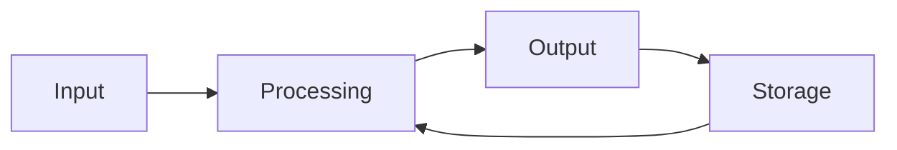

# 03. Computer Knowledge & MS Office — KEA VAO Master Notes

> [!IMPORTANT]
> **Purpose:** This is an expanded, exam-oriented Computer Knowledge notebook for **KEA VAO Paper-II**.
>
> The original note already identified the major areas: computer generations/components, memory, MS Office, networking/protocols, cybersecurity and Karnataka e-governance. This version broadens those areas into a more complete revision system. fileciteturn0file0L29-L31
>
> **Exam rule:** Learn definitions + differences + examples + shortcut keys + one-line facts. Computer questions are often direct and elimination-friendly.

---

## 0. How to Use This Note

### Priority legend

| Priority | Meaning | Study approach |
|---|---|---|
| 🔴 Tier 1 | Very likely / foundational | Memorise + practise MCQs |
| 🟠 Tier 2 | Common supporting area | Understand + revise |
| 🟡 Tier 3 | Possible factual question | Read once, revise before exam |
| 🟢 Bonus | Useful extra knowledge | Do only after Tier 1/2 |

> [!TIP]
> For a competitive exam, **do not spend equal time on every topic**. Master Tier 1 first.

### Core pillars

1. Computer fundamentals
2. Generations and classification
3. Hardware and CPU
4. Memory and storage
5. Input/output devices
6. Software and operating systems
7. Windows and file management
8. MS Word
9. MS Excel
10. MS PowerPoint
11. Internet and WWW
12. Networking
13. Email
14. Cybersecurity
15. Database fundamentals
16. Digital technology / cloud / emerging technology
17. Karnataka e-governance and citizen-facing digital services
18. Computer abbreviations
19. Shortcut keys
20. MCQ traps and rapid revision

---

# 1. Computer Fundamentals 🔴

## 1.1 What is a Computer?

A **computer** is an electronic programmable device that accepts data as input, processes it according to instructions, stores data/results, and produces information as output.

### Basic cycle



### IPO Cycle

- **I — Input:** Data/instructions entered into the system.
- **P — Processing:** CPU processes the data.
- **O — Output:** Processed information presented to the user.
- **Storage:** Data/results retained for future use.

> [!NOTE]
> **Data** = raw facts.
>
> **Information** = processed/meaningful data.

---

## 1.2 Characteristics of Computers

- High speed
- High accuracy
- Large storage capacity
- Automation
- Diligence / consistency
- Versatility
- Reliability
- Ability to perform repetitive operations
- Programmability

### Important limitation

A computer does **not inherently possess human-like intelligence or common sense**. It executes instructions/data according to its programming and available models.

---

# 2. Types / Classification of Computers 🔴

## 2.1 By Data Handling

| Type | Meaning | Example / use |
|---|---|---|
| Analog | Processes continuous values | Traditional measuring/control systems |
| Digital | Processes discrete/binary data | PCs, smartphones |
| Hybrid | Combines analog + digital characteristics | Certain specialised medical/scientific systems |

## 2.2 By Size / Processing Capability

| Type | General idea |
|---|---|
| Microcomputer | Personal computer, desktop, laptop |
| Minicomputer | Mid-range multi-user systems; largely historical classification |
| Mainframe | Very large-scale transaction/data processing |
| Supercomputer | Extremely high-performance scientific computation |

> [!WARNING]
> **Microprocessor ≠ Microcomputer.**
>
> A microprocessor is a CPU implemented on an integrated circuit. A microcomputer is a complete computer system built around a microprocessor.

---

# 3. Computer Generations 🔴

| Generation | Approx. period* | Main technology | Key characteristics / examples |
|---|---|---|---|
| 1st | 1940s–1950s | Vacuum tubes | Very large, expensive, high heat |
| 2nd | 1950s–1960s | Transistors | Smaller, faster, more reliable |
| 3rd | 1960s–1970s | Integrated Circuits (ICs) | Smaller and more reliable |
| 4th | 1970s onward | Microprocessors / VLSI | PCs and modern computing |
| 5th | Contemporary/future-oriented | AI, advanced integration, parallel processing etc. | AI-oriented systems |

\*Exact year boundaries vary by textbook.

### Famous examples / facts

- **ENIAC** — commonly associated with first-generation electronic computers.
- **UNIVAC I** — early commercial electronic computer.
- **Transistor** — defining technology of second generation.
- **IC** — defining technology of third generation.
- **Microprocessor** — defining technology of fourth generation.
- **AI** — commonly associated with fifth-generation computer discussions.

> [!CAUTION]
> Exam books sometimes present generation years differently. Remember the **technology progression** first:
>
> **Vacuum Tube → Transistor → IC → Microprocessor → AI/advanced computing**

---

# 4. Computer Architecture & CPU 🔴

## 4.1 CPU

**CPU = Central Processing Unit**

It is the principal processing unit of a computer.

### Major CPU components

| Component | Function |
|---|---|
| ALU | Arithmetic and logical operations |
| CU | Controls and coordinates operations |
| Registers | Very fast small storage inside CPU |
| Cache | High-speed memory close to/within CPU |

### ALU

**Arithmetic Logic Unit**

Performs:

- Addition
- Subtraction
- Multiplication
- Division
- Comparisons
- Logical operations such as AND, OR, NOT

### Control Unit

Controls and coordinates:

- Instruction fetching
- Decoding
- Execution flow
- Movement of data/instructions between components

---

## 4.2 Fetch–Decode–Execute Cycle


---

## 4.3 Registers

Registers are extremely fast storage locations used by the CPU.

Common textbook terms:

- Accumulator
- Program Counter (PC)
- Instruction Register (IR)
- Memory Address Register (MAR)
- Memory Data/Buffer Register (MDR/MBR)

> [!NOTE]
> Register names may appear in advanced questions, but for VAO-level preparation, know their broad purpose rather than memorising processor-specific implementation details.

---

# 5. Memory Hierarchy 🔴

## 5.1 Speed Hierarchy

A useful conceptual order:

```text
CPU Registers
      ↓
CPU Cache
      ↓
RAM
      ↓
SSD / Flash Storage
      ↓
HDD / Secondary Storage
```

Generally:

- Higher in hierarchy → faster and more expensive per unit of storage.
- Lower in hierarchy → slower but larger and cheaper per unit.

The original note correctly highlighted the core hierarchy from registers/cache through RAM and secondary storage. fileciteturn0file0L46-L56

---

## 5.2 Primary vs Secondary Memory

| Primary memory | Secondary storage |
|---|---|
| Directly used by CPU during normal processing | Long-term storage |
| Usually faster | Usually slower |
| RAM, cache, registers | HDD, SSD, optical discs, USB drives |
| RAM is volatile | Generally non-volatile |

---

## 5.3 RAM

**RAM = Random Access Memory**

Characteristics:

- Primary memory
- Read/write
- Normally volatile
- Holds programs/data currently being used

### RAM types

- **DRAM** — Dynamic RAM
- **SRAM** — Static RAM

> [!TIP]
> **Cache commonly uses SRAM**, while main system RAM commonly uses DRAM.

---

## 5.4 ROM

**ROM = Read Only Memory**

Traditional textbook description:

- Non-volatile
- Retains contents without normal power
- Used for firmware / boot-related instructions

Modern systems commonly use rewritable non-volatile firmware storage, so do not overgeneralise that all modern firmware literally sits on a physically read-only ROM chip.

### ROM types often asked

- PROM
- EPROM
- EEPROM

---

# 6. Storage Devices 🔴

## HDD vs SSD

| HDD | SSD |
|---|---|
| Magnetic storage | Flash-based storage |
| Mechanical moving parts | No mechanical moving parts |
| Generally slower | Generally faster |
| More susceptible to mechanical shock | More shock-resistant |
| Often cheaper per GB | Often more expensive per GB |

### Other storage media

- USB flash drive
- Memory card
- CD
- DVD
- Blu-ray Disc
- External HDD
- External SSD

---

# 7. Units of Digital Storage 🔴

| Unit | Equivalent |
|---|---:|
| 1 bit | 0 or 1 |
| 1 nibble | 4 bits |
| 1 byte | 8 bits |
| 1 KB | 1024 bytes in the traditional binary exam convention |
| 1 MB | 1024 KB |
| 1 GB | 1024 MB |
| 1 TB | 1024 GB |
| 1 PB | 1024 TB |
| 1 EB | 1024 PB |

### Memory trick

> **Nibble = Half Byte**

The original note uses the same 4-bit/8-bit distinction. fileciteturn0file0L58-L65

> [!WARNING]
> In modern storage/manufacturer specifications, decimal prefixes are also used:
> - 1 kB = 1000 bytes
> - 1 MB = 1000 kB
>
> Competitive-exam questions commonly use the **1024 convention** unless otherwise specified.

---

# 8. Input Devices 🔴

Input devices allow data/instructions to enter a computer.

### Common devices

- Keyboard
- Mouse
- Touchpad
- Touchscreen
- Scanner
- Microphone
- Webcam
- Joystick
- Trackball
- Light pen
- Barcode reader
- QR code scanner
- Biometric scanner
- OCR
- OMR
- MICR

---

## OCR vs OMR vs MICR 🔴

| Technology | Full form | Typical use |
|---|---|---|
| OCR | Optical Character Recognition | Converts printed/handwritten characters into machine-readable text |
| OMR | Optical Mark Recognition | Reads marked bubbles/forms |
| MICR | Magnetic Ink Character Recognition | Traditionally used for bank cheques |

> [!TIP]
> **OMR = Marks**
>
> **OCR = Characters**
>
> **MICR = Magnetic ink / Cheques**

---

# 9. Output Devices 🔴

- Monitor
- Printer
- Speaker
- Headphones
- Projector
- Plotter

## Printers

### Impact printers

Printing mechanism physically strikes the paper.

Examples:

- Dot matrix
- Daisy wheel
- Line printer

### Non-impact printers

No physical striking of paper.

Examples:

- Inkjet
- Laser
- Thermal printer

> [!TIP]
> **Dot matrix = Impact printer.**
>
> **Laser = Non-impact printer.**

---

# 10. Software Classification 🔴

## 10.1 System Software

Controls/manages computer resources.

Examples:

- Operating systems
- Device drivers
- Utility programs
- Firmware

## 10.2 Application Software

Designed for user tasks.

Examples:

- MS Word
- MS Excel
- PowerPoint
- Web browsers
- Image editors

## 10.3 Utility Software

Helps maintain/manage the system.

Examples:

- Backup tools
- Disk cleanup tools
- Compression utilities
- Antivirus software

---

# 11. Firmware, BIOS & UEFI 🟠

### Firmware

Software stored in non-volatile memory that provides low-level control for hardware.

### BIOS

**Basic Input/Output System**

Traditional firmware interface used during startup.

### POST

**Power-On Self-Test**

Checks essential hardware during startup.

### UEFI

**Unified Extensible Firmware Interface**

Modern firmware interface that largely replaces traditional BIOS implementations.

> [!TIP]
> Exam trap:
>
> **BIOS/UEFI is firmware**, not a normal application such as Word.

---

# 12. Operating Systems 🔴

## 12.1 Functions of an OS

An operating system manages:

- CPU/processes
- Memory
- Files
- Storage
- Input/output devices
- User accounts
- Security
- Networking
- Application execution

### Examples

- Microsoft Windows
- GNU/Linux
- macOS
- Android
- iOS
- UNIX / UNIX-like systems

---

## 12.2 OS Types / Concepts

| Term | Meaning |
|---|---|
| Single-user | Designed primarily for one user at a time |
| Multi-user | Supports multiple users |
| Multitasking | Runs/manages multiple tasks/processes |
| Multiprocessing | Uses multiple processing units/cores |
| Real-time OS | Designed for predictable response within timing constraints |
| Mobile OS | OS designed for smartphones/tablets |

---

# 13. Open Source vs Proprietary Software 🔴

| Open source | Proprietary |
|---|---|
| Source code available under applicable licence | Source code generally controlled by owner |
| Can often be modified/redistributed subject to licence | Modification/redistribution usually restricted |
| Linux, LibreOffice examples | Windows, Microsoft Office examples |

> [!WARNING]
> **Free software ≠ automatically open-source software.**
>
> “Free of cost” and “source code available under an open-source licence” are different concepts.

---

# 14. Windows & File Management 🔴

## Common file/folder concepts

- File
- Folder/directory
- Drive
- Path
- Extension
- Shortcut
- Recycle Bin

### Common extensions

| Extension | Typical file |
|---|---|
| `.docx` | Word document |
| `.xlsx` | Excel workbook |
| `.pptx` | PowerPoint presentation |
| `.pdf` | Portable Document Format |
| `.txt` | Plain text |
| `.csv` | Comma-separated values |
| `.jpg/.jpeg` | Image |
| `.png` | Image |
| `.mp3` | Audio |
| `.mp4` | Video |
| `.zip` | Compressed archive |
| `.exe` | Windows executable |

---

# 15. MS WORD — Complete Exam Layer 🔴

## 15.1 Basic Concepts

MS Word is a word-processing application.

Common uses:

- Creating documents
- Editing text
- Formatting
- Tables
- Page layout
- Headers/footers
- Mail merge
- Spell checking
- Printing

---

## 15.2 Text Formatting

### Character formatting

- Font
- Font size
- Bold
- Italic
- Underline
- Font colour
- Highlight

### Paragraph formatting

- Left alignment
- Center alignment
- Right alignment
- Justify
- Line spacing
- Indentation
- Bullets
- Numbering

### Alignment mnemonic

```text
Left    → Ctrl + L
Center  → Ctrl + E
Right   → Ctrl + R
Justify → Ctrl + J
```

---

## 15.3 Essential Word Shortcuts 🔴

| Shortcut | Function |
|---|---|
| Ctrl + N | New document |
| Ctrl + O | Open |
| Ctrl + S | Save |
| Ctrl + Shift + S | Save As in many current Office workflows |
| Ctrl + P | Print |
| Ctrl + C | Copy |
| Ctrl + X | Cut |
| Ctrl + V | Paste |
| Ctrl + Z | Undo |
| Ctrl + Y | Redo |
| Ctrl + A | Select all |
| Ctrl + F | Find |
| Ctrl + H | Replace |
| Ctrl + K | Insert hyperlink |
| Ctrl + B | Bold |
| Ctrl + I | Italic |
| Ctrl + U | Underline |
| Ctrl + L | Left align |
| Ctrl + E | Center align |
| Ctrl + R | Right align |
| Ctrl + J | Justify |
| Ctrl + Home | Beginning of document |
| Ctrl + End | End of document |
| F7 | Spelling/grammar-related checking |
| Shift + F3 | Change case |

---

## 15.4 Word Features

### Header

Appears at the top of pages.

### Footer

Appears at the bottom of pages.

### Page Break

Starts content on a new page.

### Section Break

Allows different formatting/layout settings in different sections.

### Mail Merge

Used to create personalised documents for multiple recipients from a common template/data source.

Examples:

- Letters
- Labels
- Envelopes
- Certificates

### Track Changes

Records edits made to a document.

### Comments

Used to add review notes.

---

# 16. MS EXCEL — Complete Exam Layer 🔴

## 16.1 Excel Basics

Excel is a spreadsheet application used for:

- Data entry
- Calculations
- Tables
- Sorting/filtering
- Charts
- Data analysis

### Terminology

- **Workbook** = Excel file containing worksheets.
- **Worksheet** = Individual spreadsheet sheet.
- **Row** = Horizontal.
- **Column** = Vertical.
- **Cell** = Intersection of row and column.
- **Cell address** = Column letter + row number, e.g. `B5`.
- **Range** = Group of cells, e.g. `A1:C10`.

---

## 16.2 Formula Rules 🔴

A formula generally begins with:

```excel
=
```

Examples:

```excel
=SUM(A1:A10)
=AVERAGE(B1:B10)
=MAX(C1:C10)
=MIN(C1:C10)
=IF(D2>=40,"Pass","Fail")
```

The original note correctly identifies `=` as the formula prefix. fileciteturn0file0L99-L110

---

## 16.3 Relative / Absolute / Mixed References 🔴

### Relative

```excel
A1
```

Changes when copied.

### Absolute

```excel
$A$1
```

Row and column remain fixed.

### Mixed

```excel
$A1
A$1
```

One dimension is fixed.

> [!TIP]
> **$ = lock/fix the reference.**

---

## 16.4 High-Yield Excel Functions 🔴

| Function | Purpose |
|---|---|
| SUM | Adds values |
| AVERAGE | Calculates mean |
| COUNT | Counts numeric cells |
| COUNTA | Counts non-empty cells |
| COUNTBLANK | Counts blank cells |
| MAX | Largest value |
| MIN | Smallest value |
| IF | Logical condition |
| AND | TRUE if all conditions are true |
| OR | TRUE if at least one condition is true |
| NOT | Reverses logical value |
| SUMIF | Conditional sum |
| COUNTIF | Conditional count |
| AVERAGEIF | Conditional average |
| ROUND | Rounds a number |
| TODAY | Current date |
| NOW | Current date and time |

### Lookup functions

- VLOOKUP — vertical lookup
- HLOOKUP — horizontal lookup
- XLOOKUP — modern lookup function in supported Excel versions

---

## 16.5 COUNT vs COUNTA 🔴

| Function | Counts |
|---|---|
| COUNT | Cells containing numbers |
| COUNTA | Non-empty cells |
| COUNTBLANK | Blank cells |

> [!TIP]
> **COUNT = Numbers**
>
> **COUNTA = Anything non-empty**

---

## 16.6 Excel Data Features 🟠

### Sort

Reorders data.

### Filter

Displays records matching conditions while hiding others from view.

### Freeze Panes

Keeps selected rows/columns visible while scrolling.

### Conditional Formatting

Automatically formats cells based on rules.

### Data Validation

Restricts or controls data entered into cells.

### Charts

Common types:

- Column
- Bar
- Line
- Pie
- Area
- Scatter

---

## 16.7 Excel Errors 🟠

| Error | Common meaning |
|---|---|
| `#DIV/0!` | Division by zero |
| `#VALUE!` | Wrong type/value |
| `#REF!` | Invalid cell reference |
| `#NAME?` | Unrecognised name/function |
| `#N/A` | Value not available |
| `#NUM!` | Invalid numeric value |
| `#NULL!` | Invalid intersection/operator situation |

---

## 16.8 Important Excel Shortcuts

| Shortcut | Function |
|---|---|
| Ctrl + C | Copy |
| Ctrl + X | Cut |
| Ctrl + V | Paste |
| Ctrl + Z | Undo |
| Ctrl + Y | Redo |
| Ctrl + S | Save |
| Ctrl + F | Find |
| Ctrl + H | Replace |
| Ctrl + A | Select data/current region depending on context |
| Ctrl + 1 | Format Cells |
| Ctrl + ; | Insert current date |
| Ctrl + Shift + : | Insert current time |
| F2 | Edit active cell |
| F4 | Toggle reference types while editing a formula / repeat action in some contexts |
| Ctrl + Arrow | Move to edge of current data region |
| Ctrl + E | Flash Fill in supported Excel versions |

> [!WARNING]
> Shortcut behaviour can vary slightly by Office version/context. For the exam, learn the **standard Windows desktop Microsoft Office shortcuts**.

---

# 17. MS POWERPOINT — Complete Exam Layer 🔴

PowerPoint is presentation software.

## Key terms

- Presentation
- Slide
- Layout
- Theme
- Template
- Transition
- Animation
- Slide Master
- Notes
- Handouts
- Slide Show

### Transition vs Animation

| Transition | Animation |
|---|---|
| Effect when moving between slides | Effect applied to objects within a slide |

---

## Important PowerPoint Shortcuts

| Shortcut | Function |
|---|---|
| Ctrl + M | New slide |
| Ctrl + N | New presentation |
| Ctrl + S | Save |
| Ctrl + P | Print |
| Ctrl + C | Copy |
| Ctrl + V | Paste |
| Ctrl + Z | Undo |
| Ctrl + K | Hyperlink |
| F5 | Start slide show from beginning |
| Shift + F5 | Start slide show from current slide |
| Esc | End slide show |

The original note already flags the especially important **F5 vs Shift+F5** distinction. fileciteturn0file0L95-L96

---

# 18. Internet & World Wide Web 🔴

## Internet vs WWW

| Internet | World Wide Web |
|---|---|
| Global network of interconnected networks | One service running over the Internet |
| Supports many services | Mainly web pages/resources |
| Includes email, web, file transfer etc. | Uses web technologies such as HTTP/HTTPS |

> [!TIP]
> **Internet ≠ WWW.**

---

## Browser vs Search Engine

### Browser

Software used to access web resources.

Examples:

- Chrome
- Edge
- Firefox
- Safari

### Search engine

Service that helps locate information on the web.

Examples:

- Google
- Bing
- DuckDuckGo

> [!WARNING]
> **Google Chrome = browser**
>
> **Google Search = search engine**

---

# 19. URL, Domain, IP Address 🔴

### URL

**Uniform Resource Locator**

Identifies the location/address of a resource.

Example structure:

```text
https://www.example.com/page
```

### Domain name

Human-readable name used to identify a website/domain.

### IP address

Numerical/logical network address used for communication.

---

# 20. DNS 🔴

**DNS = Domain Name System**

Converts/resolves domain names into IP addresses.

Example:

```text
example.com
      ↓
DNS resolution
      ↓
IP address
```

The original note correctly identifies DNS as the mechanism that resolves a domain such as a government website name to an IP address. fileciteturn0file0L123-L126

---

# 21. HTTP vs HTTPS 🔴

| HTTP | HTTPS |
|---|---|
| HyperText Transfer Protocol | HyperText Transfer Protocol Secure |
| Standard web protocol | HTTP protected using TLS |
| Port 80 commonly associated | Port 443 commonly associated |
| No TLS encryption by default | Provides encryption/authentication/integrity through TLS |

> [!WARNING]
> Do not memorise “HTTPS = SSL” as an exact technical definition.
>
> Modern HTTPS uses **TLS**. SSL is the older predecessor.

---

# 22. Common Internet Protocols 🔴

| Protocol | Main use |
|---|---|
| HTTP | Web communication |
| HTTPS | Secure web communication |
| FTP | File Transfer Protocol |
| SFTP | Secure file transfer over SSH |
| SMTP | Sending email |
| POP3 | Receiving/download-oriented email |
| IMAP | Synchronising/accessing email on server |
| DNS | Domain name resolution |
| DHCP | Automatic network configuration/IP assignment |
| SSH | Secure remote login |
| TCP | Reliable transport |
| UDP | Connectionless transport with lower overhead |

### Email mnemonic

> **SMTP Sends**
>
> **POP3 Pulls**
>
> **IMAP = Internet Mail Access / synchronisation**

The original note already uses the useful “SMTP Sends, POP Pulls” mnemonic. fileciteturn0file0L161-L163

---

# 23. Email Fundamentals 🔴

## Email fields

| Field | Meaning |
|---|---|
| To | Primary recipient |
| Cc | Carbon copy; visible to recipients |
| Bcc | Blind carbon copy; addresses hidden from other recipients |
| Subject | Brief description |
| Attachment | File sent with email |

### Common email terms

- Inbox
- Sent
- Draft
- Spam/Junk
- Trash/Deleted
- Attachment
- Reply
- Reply All
- Forward

---

# 24. Computer Networks 🔴

## Network Types

| Network | Scope |
|---|---|
| PAN | Personal Area Network |
| LAN | Local Area Network |
| MAN | Metropolitan Area Network |
| WAN | Wide Area Network |

### Memory trick

**PAN → LAN → MAN → WAN**

The original note covers LAN, MAN and WAN; PAN is added here as an important extension. fileciteturn0file0L117-L125

---

# 25. Network Devices 🔴

| Device | Function |
|---|---|
| Modem | Converts/modulates signals for communication; term derives from modulator-demodulator |
| Hub | Broadcasts incoming data to connected ports |
| Switch | Forwards frames intelligently within a LAN using MAC information |
| Router | Connects networks and forwards packets |
| Repeater | Regenerates/extends signals |
| Bridge | Connects network segments at Layer 2 |
| Access Point | Provides wireless network access |
| Gateway | Connects networks using different protocols/architectures; term has broader uses |

> [!TIP]
> **Switch → mainly LAN**
>
> **Router → connects different networks**

---

# 26. Network Topologies 🟠

## Bus

All devices share a common backbone.

## Star

Devices connect to a central device.

## Ring

Devices form a logical/physical ring.

## Mesh

Devices have multiple interconnections.

## Tree

Hierarchical arrangement.

## Hybrid

Combination of topologies.

### Most important

**Star topology** is widely used in modern Ethernet LANs.

---

# 27. IP Addressing 🔴

## IPv4

- 32-bit
- Written as four decimal octets
- Example:

```text
192.168.1.1
```

## IPv6

- 128-bit
- Written using hexadecimal groups
- Designed to provide a vastly larger address space

The original note identifies IPv4 as 32-bit and IPv6 as 128-bit. fileciteturn0file0L129-L132

---

# 28. MAC Address 🔴

**MAC = Media Access Control**

A MAC address identifies a network interface at the data-link layer.

Common textbook representation:

```text
00:1A:2B:3C:4D:5E
```

Traditional Ethernet MAC address length:

**48 bits**

> [!WARNING]
> **IP address ≠ MAC address**
>
> - IP → logical network addressing
> - MAC → link-layer hardware/interface addressing

---

# 29. TCP vs UDP 🟠

| TCP | UDP |
|---|---|
| Connection-oriented | Connectionless |
| Reliable delivery | No built-in delivery guarantee |
| Ordered delivery | No guarantee of order |
| More overhead | Lower overhead |
| Used where reliability matters | Useful where speed/low overhead matters |

---

# 30. Cybersecurity 🔴

## CIA Triad

```text
        Confidentiality
          /        \
         /          \
    Integrity ---- Availability
```

### Confidentiality

Only authorised parties can access information.

### Integrity

Information remains accurate and unaltered without authorisation.

### Availability

Systems/data remain accessible when required.

> [!TIP]
> **CIA = Confidentiality + Integrity + Availability**

---

# 31. Malware Types 🔴

| Malware | Key idea |
|---|---|
| Virus | Attaches to files/programs and usually requires user execution/spread mechanism |
| Worm | Self-replicates and can spread across networks without attaching to a host file |
| Trojan | Malicious software disguised as legitimate software |
| Ransomware | Encrypts/locks data or systems and demands payment |
| Spyware | Secretly monitors/collects information |
| Keylogger | Records keystrokes |
| Adware | Displays unwanted advertisements; may have additional tracking behaviour |
| Rootkit | Attempts to conceal malicious presence and maintain privileged access |

The original note already prioritises phishing, ransomware, Trojan, worms and spyware. fileciteturn0file0L136-L144

---

# 32. Phishing & Social Engineering 🔴

## Phishing

Fraudulent messages/websites designed to trick users into revealing information.

Targets may include:

- Passwords
- OTPs
- Banking details
- Card information
- Personal information

### Variants

- **Spear phishing** — targeted individual/organisation
- **Whaling** — targeted high-value executive/official
- **Smishing** — SMS-based phishing
- **Vishing** — voice/phone-based phishing

---

# 33. Password & Authentication Security 🔴

### Strong password principles

- Long
- Unique
- Not reused across important accounts
- Avoid easily guessed personal information
- Use password manager where appropriate

### MFA / 2FA

**Multi-factor authentication** uses multiple categories/factors for authentication.

Typical factors:

1. Something you know — password/PIN
2. Something you have — phone/security token
3. Something you are — biometric

> [!WARNING]
> **OTP is not the same as a password.**
>
> OTP = One-Time Password, usually valid for limited time/use.

---

# 34. Cyber Hygiene 🔴

- Keep OS/software updated.
- Use reputable security software.
- Back up important data.
- Prefer MFA.
- Verify links and domains.
- Avoid unknown attachments.
- Do not share OTP/PIN/password.
- Lock devices when unattended.
- Use secure networks for sensitive activity.
- Download applications from trusted sources.
- Be cautious with USB devices.

---

# 35. Encryption, Hashing & Digital Signature 🟠

## Encryption

Transforms readable data into protected ciphertext using cryptographic methods.

### Decryption

Converts ciphertext back into readable form.

## Hashing

One-way transformation commonly used for integrity checks and password storage systems.

## Digital Signature

Provides mechanisms for:

- Authenticity
- Integrity
- Non-repudiation (within the applicable legal/technical framework)

> [!WARNING]
> **Encryption ≠ Digital Signature**
>
> Encryption primarily protects confidentiality.
>
> Digital signatures primarily help establish authenticity/integrity.

---

# 36. Firewall & Antivirus 🔴

### Firewall

Controls network traffic according to security rules.

### Antivirus / Anti-malware

Detects, blocks and/or removes malicious software.

> [!TIP]
> **Firewall ≠ antivirus**
>
> Firewall → network traffic control
>
> Antivirus → malware detection/protection

---

# 37. Backup & Ransomware Protection 🔴

Good backup practice:

- Keep multiple copies.
- Keep at least one copy separated/offline where appropriate.
- Test restoration.
- Do not assume “having a backup” means it is recoverable.

### 3-2-1 backup concept

- 3 copies of data
- 2 different media
- 1 copy offsite

---

# 38. Database Fundamentals 🟠

## Database

An organised collection of data.

## DBMS

**Database Management System**

Software used to create, store, manage and retrieve data.

Examples:

- MySQL
- PostgreSQL
- Microsoft SQL Server
- Oracle Database
- SQLite

---

## 38.1 Basic Database Terms

| Term | Meaning |
|---|---|
| Table | Structured collection of rows and columns |
| Record / Row | One data entry/entity instance |
| Field / Column | Attribute/category of data |
| Primary Key | Uniquely identifies a record |
| Foreign Key | Links one table to another |
| Query | Request to retrieve/manipulate data |

### Example

**Village Residents**

| ID | Name | Village | Age |
|---|---|---|---:|
| 101 | Ravi | X | 34 |
| 102 | Asha | Y | 29 |

- Table = Village Residents
- Record = one person's row
- Field = Name/Village/Age
- Primary key = ID

---

# 39. Data vs Database vs DBMS 🔴

```text
Data
 ↓
Organised into
 ↓
Database
 ↓
Managed using
 ↓
DBMS
```

---

# 40. Cloud Computing 🟠

Cloud computing provides computing resources/services over a network, typically the Internet.

Examples:

- Online storage
- Cloud databases
- Virtual machines
- Web applications

### Service models

| Model | Meaning |
|---|---|
| IaaS | Infrastructure as a Service |
| PaaS | Platform as a Service |
| SaaS | Software as a Service |

### Easy mnemonic

**I → Infrastructure**
>
**P → Platform**
>
**S → Software**

---

# 41. AI, ML & Generative AI 🟡

## Artificial Intelligence

Broad field concerned with systems performing tasks associated with aspects of human intelligence.

## Machine Learning

A subset/approach within AI where systems learn patterns from data.

## Deep Learning

Uses multi-layer neural networks.

## Generative AI

Produces new content such as:

- Text
- Images
- Audio
- Video
- Code

> [!NOTE]
> For VAO preparation, understand the **definitions and distinctions** rather than going deep into algorithms unless the official syllabus specifically demands it.

---

# 42. Digital Payments & Digital Security 🔴

Important concepts:

- UPI
- QR code
- Debit card
- Credit card
- Internet banking
- Mobile banking
- OTP
- PIN
- Digital wallet
- Net banking

### Safety rules

- Never share UPI PIN.
- Never share OTP.
- Verify the recipient before payment.
- Remember: receiving money through UPI does not normally require entering your UPI PIN.
- Verify payment requests carefully.

---

# 43. E-Governance & Karnataka Digital Services 🔴

> [!IMPORTANT]
> This is particularly relevant because a VAO works within local administration and citizen-facing government processes.

## 43.1 Bhoomi

The original note identifies **Bhoomi** with computerised land records / Pahani (RTC) and mutation-related services. fileciteturn0file0L146-L148

### Remember

**Bhoomi → Land records**

Common exam association:

- RTC / Pahani
- Land records
- Mutation-related processes

---

## 43.2 e-Swathu

The original note identifies **e-Swathu** with rural property-related documentation, including references to Forms 9 and 11. fileciteturn0file0L146-L149

### Remember

**e-Swathu → Rural property records/certificates**

> [!WARNING]
> If the question asks for an exact form number or current service feature, verify against the latest official Karnataka government/department material because e-governance services can change.

---

## 43.3 Kutumba

The original note identifies **Kutumba** as a family/entitlement-oriented database intended to support welfare delivery. fileciteturn0file0L146-L149

### Remember

**Kutumba → Family / welfare entitlement data**

---

# 44. Computer Security Terms — One-Liners 🔴

| Term | Meaning |
|---|---|
| Spam | Unsolicited messages |
| Phishing | Fraudulent attempt to obtain sensitive information |
| Malware | Malicious software |
| Virus | Malware that commonly attaches to a host/file |
| Worm | Self-propagating malware |
| Trojan | Malware disguised as legitimate software |
| Ransomware | Extortion through data/system locking |
| Spyware | Secret monitoring/collection |
| Firewall | Controls network traffic |
| Antivirus | Protects against malware |
| Encryption | Protects data by transforming it |
| Authentication | Verifies identity |
| Authorisation | Determines permissions |
| CAPTCHA | Helps distinguish humans from automated bots |
| MFA | Multiple authentication factors |

---

# 45. Authentication vs Authorisation 🔴

> [!TIP]
> **Authentication = Who are you?**
>
> **Authorisation = What are you allowed to do?**

Example:

- Login verifies identity → authentication.
- Permission to edit a land-record application → authorisation.

---

# 46. Common Computer Abbreviations 🔴

| Abbreviation | Full form |
|---|---|
| CPU | Central Processing Unit |
| ALU | Arithmetic Logic Unit |
| CU | Control Unit |
| RAM | Random Access Memory |
| ROM | Read Only Memory |
| HDD | Hard Disk Drive |
| SSD | Solid State Drive |
| USB | Universal Serial Bus |
| UPS | Uninterruptible Power Supply |
| BIOS | Basic Input/Output System |
| UEFI | Unified Extensible Firmware Interface |
| GUI | Graphical User Interface |
| CLI | Command Line Interface |
| OS | Operating System |
| DBMS | Database Management System |
| LAN | Local Area Network |
| MAN | Metropolitan Area Network |
| WAN | Wide Area Network |
| PAN | Personal Area Network |
| IP | Internet Protocol |
| MAC | Media Access Control |
| DNS | Domain Name System |
| DHCP | Dynamic Host Configuration Protocol |
| HTTP | HyperText Transfer Protocol |
| HTTPS | HyperText Transfer Protocol Secure |
| FTP | File Transfer Protocol |
| SMTP | Simple Mail Transfer Protocol |
| POP | Post Office Protocol |
| IMAP | Internet Message Access Protocol |
| TCP | Transmission Control Protocol |
| UDP | User Datagram Protocol |
| URL | Uniform Resource Locator |
| WWW | World Wide Web |
| VPN | Virtual Private Network |
| PDF | Portable Document Format |
| OCR | Optical Character Recognition |
| OMR | Optical Mark Recognition |
| MICR | Magnetic Ink Character Recognition |
| QR | Quick Response |
| OTP | One-Time Password |
| UPI | Unified Payments Interface |
| AI | Artificial Intelligence |
| ML | Machine Learning |
| IoT | Internet of Things |
| ICT | Information and Communication Technology |
| IaaS | Infrastructure as a Service |
| PaaS | Platform as a Service |
| SaaS | Software as a Service |

---

# 47. High-Yield Shortcut Master Table 🔴

## General Windows / Office

| Shortcut | Function |
|---|---|
| Ctrl + A | Select all |
| Ctrl + C | Copy |
| Ctrl + X | Cut |
| Ctrl + V | Paste |
| Ctrl + Z | Undo |
| Ctrl + Y | Redo |
| Ctrl + S | Save |
| Ctrl + P | Print |
| Ctrl + F | Find |
| Ctrl + H | Replace |
| Ctrl + K | Hyperlink |
| Ctrl + N | New |
| Ctrl + O | Open |
| Alt + Tab | Switch applications |
| Alt + F4 | Close active window |
| F1 | Help |
| F2 | Rename selected item / edit cell in Excel |
| F5 | Refresh in many Windows/browser contexts; PowerPoint starts slide show from beginning |
| Ctrl + Shift + Esc | Open Task Manager |
| Win + E | File Explorer |
| Win + D | Show desktop |
| Win + L | Lock computer |

> [!WARNING]
> Some function keys are **context-dependent**. Example: `F5` does not perform the same action in every application.

---

# 48. MS Office Shortcut Traps 🔴

### Do not confuse:

- **Ctrl + B** → Bold
- **Ctrl + I** → Italic
- **Ctrl + U** → Underline
- **Ctrl + K** → Hyperlink
- **Ctrl + H** → Find/Replace
- **Ctrl + J** → Justify in Word
- **F5** → PowerPoint slideshow from beginning
- **Shift + F5** → PowerPoint slideshow from current slide
- **F7** → Spelling/grammar checking functionality in Office contexts
- **Ctrl + E in Excel** → Flash Fill in supported versions
- **F2 in Excel** → Edit active cell

---

# 49. Important Differences — MCQ Gold 🔴

## RAM vs ROM

| RAM | ROM |
|---|---|
| Usually volatile | Non-volatile |
| Read/write | Traditionally read-mostly |
| Working memory | Firmware/boot-related storage |

## HDD vs SSD

- HDD → magnetic + moving parts
- SSD → flash + no mechanical moving parts

## Internet vs WWW

- Internet → network infrastructure/global interconnected networks
- WWW → web service running over Internet

## Browser vs Search Engine

- Browser → Chrome/Firefox/Edge
- Search engine → Google/Bing

## Virus vs Worm

- Virus → commonly requires host file/program mechanism
- Worm → self-replicates independently across networks

## Phishing vs Malware

- Phishing → deception/social engineering
- Malware → malicious software

## Authentication vs Authorisation

- Authentication → identity
- Authorisation → permission

## HTTP vs HTTPS

- HTTP → ordinary HTTP
- HTTPS → HTTP protected with TLS

## SMTP vs POP3/IMAP

- SMTP → sending/relaying email
- POP3/IMAP → receiving/accessing email

## IP vs MAC

- IP → logical network address
- MAC → link-layer interface address

## Compiler vs Interpreter

- Compiler → translates program into another form, commonly before execution
- Interpreter → executes/translates program instructions progressively

---

# 50. Number Systems 🟠

## Binary

Base 2:

```text
0, 1
```

## Decimal

Base 10:

```text
0–9
```

## Octal

Base 8:

```text
0–7
```

## Hexadecimal

Base 16:

```text
0–9, A–F
```

### Example

```text
Binary:      1010
Decimal:     10
Hexadecimal: A
```

> [!TIP]
> Know the four bases and basic conversions. Complex conversion questions are lower priority unless seen in the recruitment syllabus/PYQs.

---

# 51. Compiler, Interpreter & Assembler 🟠

| Translator | Purpose |
|---|---|
| Compiler | Translates high-level program into machine/object code, generally before execution |
| Interpreter | Executes/translates program progressively |
| Assembler | Converts assembly language into machine code |

---

# 52. Programming Language Basics 🟡

### Machine language

- Binary instructions
- Directly understood by processor

### Assembly language

- Mnemonic instructions
- Requires assembler

### High-level language

More human-readable.

Examples:

- Python
- Java
- C
- C++
- JavaScript

> [!NOTE]
> Do not confuse **programming language** with **operating system**.

---

# 53. IoT — Internet of Things 🟡

IoT refers to connected physical devices capable of collecting/exchanging data.

Examples:

- Smart meters
- Smart agriculture sensors
- Connected cameras
- Wearable devices
- Environmental sensors

Basic chain:

```text
Sensor
  ↓
Data collection
  ↓
Network
  ↓
Processing / Cloud
  ↓
Application / Decision
```

---

# 54. Emerging Technologies — Awareness Layer 🟡

Know one-line meanings of:

- Artificial Intelligence
- Machine Learning
- Deep Learning
- Generative AI
- Internet of Things
- Cloud Computing
- Big Data
- Blockchain
- 5G
- Virtual Reality
- Augmented Reality
- Edge Computing
- Quantum Computing

> [!TIP]
> These are **awareness topics**, not a reason to spend hours learning advanced technical details for a basic computer paper.

---

# 55. Blockchain — One-Liner 🟡

A blockchain is a distributed digital ledger where records are organised into linked blocks using cryptographic techniques and consensus mechanisms.

Common associations:

- Distributed ledger
- Blocks
- Hashing
- Consensus
- Cryptographic linkage

---

# 56. VPN — One-Liner 🟠

**VPN = Virtual Private Network**

Creates a protected/virtual connection over a network, commonly used to improve privacy/security and connect to private networks.

> [!WARNING]
> A VPN is **not** a guarantee of complete anonymity.

---

# 57. Digital Certificates 🟠

Digital certificates help bind a public key to an identity through a trusted certificate authority (in common PKI systems).

Important association:

```text
HTTPS
 ↓
TLS
 ↓
Certificates / public-key cryptography
```

---

# 58. Public Key vs Private Key 🟠

### Public key

Can be distributed openly.

### Private key

Must be protected by its owner.

> [!WARNING]
> Never share a private cryptographic key as if it were a public identifier.

---

# 59. Common File Formats 🔴

| Format | Use |
|---|---|
| DOCX | Word document |
| XLSX | Excel workbook |
| PPTX | PowerPoint presentation |
| PDF | Portable document |
| TXT | Plain text |
| CSV | Tabular text data |
| JPG/JPEG | Image |
| PNG | Image |
| GIF | Image/animation |
| MP3 | Audio |
| WAV | Audio |
| MP4 | Video |
| ZIP | Compressed archive |

---

# 60. Exam-Trap Facts 🔴

> [!WARNING]
> Memorise these as rapid-fire distinctions.

1. CPU is **not** the same as the entire computer.
2. RAM is generally **volatile**.
3. ROM is **non-volatile**.
4. SSD has **no mechanical moving parts**.
5. 1 byte = **8 bits**.
6. 1 nibble = **4 bits**.
7. IPv4 = **32 bits**.
8. IPv6 = **128 bits**.
9. Traditional Ethernet MAC address = **48 bits**.
10. DNS resolves domain names.
11. SMTP is associated with sending email.
12. POP3/IMAP are associated with receiving/accessing email.
13. HTTP commonly uses port 80.
14. HTTPS commonly uses port 443.
15. Ctrl + K = hyperlink.
16. Ctrl + J = justify in Word.
17. F5 = PowerPoint slideshow from beginning.
18. Shift + F5 = PowerPoint slideshow from current slide.
19. COUNT counts numeric cells.
20. COUNTA counts non-empty cells.
21. `$A$1` = absolute reference.
22. `A1` = relative reference.
23. `#DIV/0!` = division by zero.
24. Firewall is not the same as antivirus.
25. Phishing is a social-engineering technique.
26. Trojan is disguised malware.
27. Worm can self-propagate.
28. Ransomware commonly locks/encrypts data for extortion.
29. Authentication asks “Who are you?”
30. Authorisation asks “What can you access/do?”
31. Browser ≠ search engine.
32. Internet ≠ WWW.
33. LAN ≠ WAN.
34. IP ≠ MAC.
35. Transition ≠ animation.
36. Workbook ≠ worksheet.
37. Cell ≠ range.
38. Data ≠ information.
39. Software ≠ hardware.
40. Open-source ≠ simply “free of cost”.

---

# 61. Karnataka VAO-Relevant Digital Administration 🟠

### High-yield associations

| Platform / concept | Remember |
|---|---|
| Bhoomi | Land records / RTC / Pahani / mutation ecosystem |
| e-Swathu | Rural property-related records/certificates |
| Kutumba | Family/entitlement data and welfare-delivery ecosystem |
| Digital signatures | Authentication/integrity of electronic documents |
| e-Governance | Delivery of government services using ICT |
| DBMS | Structured management of administrative data |
| Cybersecurity | Protection of citizen/government data |

> [!IMPORTANT]
> For current scheme/platform names, exact forms, portals, department ownership, and latest service features, cross-check the latest official Karnataka government/KEA material before the exam.

---

# 62. Likely Question Patterns 🔴

Expect questions of these forms:

### Direct fact

> Which protocol is used to send email?

**Answer:** SMTP

### Full form

> What is the full form of OCR?

**Answer:** Optical Character Recognition

### Difference

> Which is volatile memory?

**Answer:** RAM

### Shortcut

> Which shortcut inserts a hyperlink?

**Answer:** Ctrl + K

### Application identification

> Which software is primarily used for spreadsheets?

**Answer:** MS Excel

### Security identification

> Malware that encrypts files and demands payment?

**Answer:** Ransomware

### Networking

> IPv6 address length?

**Answer:** 128 bits

### Excel

> Which function counts numeric cells?

**Answer:** COUNT

### Karnataka e-governance

> Bhoomi is primarily associated with what?

**Answer:** Computerised land-record services.

---

# 63. PYQ / MCQ Practice Bank 🔴

## Q1

**1 nibble equals:**

A. 2 bits  
B. 4 bits  
C. 8 bits  
D. 16 bits

**Answer:** B

---

## Q2

**Which is volatile memory?**

A. ROM  
B. SSD  
C. RAM  
D. DVD

**Answer:** C

---

## Q3

**Which protocol is primarily associated with sending email?**

A. FTP  
B. SMTP  
C. POP3  
D. DNS

**Answer:** B

---

## Q4

**IPv4 uses:**

A. 16 bits  
B. 32 bits  
C. 64 bits  
D. 128 bits

**Answer:** B

---

## Q5

**IPv6 uses:**

A. 32 bits  
B. 64 bits  
C. 96 bits  
D. 128 bits

**Answer:** D

---

## Q6

**Which shortcut inserts a hyperlink in common Microsoft Office applications?**

A. Ctrl + H  
B. Ctrl + K  
C. Ctrl + L  
D. Ctrl + J

**Answer:** B

---

## Q7

**In Excel, which function counts cells containing numbers?**

A. COUNTA  
B. COUNT  
C. COUNTBLANK  
D. SUM

**Answer:** B

---

## Q8

**What does `$A$1` represent in Excel?**

A. Relative reference  
B. Mixed reference  
C. Absolute reference  
D. Invalid reference

**Answer:** C

---

## Q9

**Which is malware disguised as legitimate software?**

A. Worm  
B. Trojan  
C. Firewall  
D. Backup

**Answer:** B

---

## Q10

**Which malware commonly encrypts data and demands payment?**

A. Ransomware  
B. Spyware  
C. Adware  
D. Firmware

**Answer:** A

---

## Q11

**Which system translates domain names into IP addresses?**

A. DHCP  
B. DNS  
C. SMTP  
D. FTP

**Answer:** B

---

## Q12

**Which device commonly connects different IP networks?**

A. Router  
B. Keyboard  
C. Printer  
D. Scanner

**Answer:** A

---

## Q13

**Which is an output device?**

A. Scanner  
B. Keyboard  
C. Monitor  
D. Microphone

**Answer:** C

---

## Q14

**Which is an impact printer?**

A. Laser  
B. Inkjet  
C. Dot matrix  
D. Thermal

**Answer:** C

---

## Q15

**Which is NOT an operating system?**

A. Linux  
B. Windows  
C. Android  
D. MS Excel

**Answer:** D

---

# 64. Rapid Revision — 5 Minute Sheet 🔴

```text
COMPUTER BASICS
Input → Processing → Output → Storage

CPU
ALU = Arithmetic + Logic
CU  = Control
Registers = fastest CPU storage
Cache = high-speed memory
RAM = volatile
ROM = non-volatile

MEMORY
4 bits = 1 nibble
8 bits = 1 byte
1024 bytes = 1 KB (traditional exam convention)

STORAGE
HDD = magnetic + moving parts
SSD = flash + no moving parts

GENERATIONS
1 Vacuum tubes
2 Transistors
3 IC
4 Microprocessor
5 AI / advanced computing

MS WORD
Ctrl+B = Bold
Ctrl+I = Italic
Ctrl+U = Underline
Ctrl+K = Hyperlink
Ctrl+J = Justify
F7 = spelling/grammar checking

MS EXCEL
= starts formula
A1 = relative
$A$1 = absolute
$A1 / A$1 = mixed
COUNT = numbers
COUNTA = non-empty
SUM = total
AVERAGE = mean
IF = condition
F2 = edit cell

POWERPOINT
F5 = slideshow from beginning
Shift+F5 = slideshow from current slide
Transition = between slides
Animation = object within slide

NETWORKING
PAN → LAN → MAN → WAN
IPv4 = 32 bit
IPv6 = 128 bit
MAC = 48 bit (traditional Ethernet)
DNS = domain → IP
HTTP = web
HTTPS = secure HTTP
SMTP = send mail
POP3/IMAP = receive/access mail
TCP = reliable
UDP = low-overhead connectionless transport

CYBERSECURITY
Phishing = deceptive information theft
Trojan = disguised malware
Worm = self-spreading
Ransomware = extortion via locking/encryption
Spyware = secret monitoring
Firewall = network traffic control
Antivirus = malware protection
MFA = multiple factors

KARNATAKA
Bhoomi = land records
e-Swathu = rural property records
Kutumba = family/entitlement data
```

---

# 65. Ultra-High-Yield 30 Facts 🔴

> [!IMPORTANT]
> If you have very little time, revise these first.

1. Computer works on the **Input → Processing → Output** concept.
2. CPU = **Central Processing Unit**.
3. ALU performs arithmetic and logical operations.
4. CU controls/coordinates processing.
5. Registers are extremely fast CPU storage.
6. RAM is generally volatile.
7. ROM is non-volatile.
8. SSD uses flash storage.
9. HDD uses magnetic storage and moving mechanical parts.
10. 1 nibble = 4 bits.
11. 1 byte = 8 bits.
12. 1 KB = 1024 bytes under the common exam convention.
13. 1st generation = vacuum tubes.
14. 2nd = transistors.
15. 3rd = ICs.
16. 4th = microprocessors.
17. OS manages hardware/software resources.
18. Word = word processing.
19. Excel = spreadsheet.
20. PowerPoint = presentation.
21. Ctrl + K = hyperlink.
22. Excel formulas begin with `=`.
23. `$A$1` = absolute reference.
24. IPv4 = 32 bits.
25. IPv6 = 128 bits.
26. DNS = domain-name resolution.
27. SMTP = sending email.
28. Phishing = deceptive credential/data theft.
29. Ransomware = data/system extortion.
30. Bhoomi = Karnataka land-record ecosystem.

---

# 66. Final Exam Checklist

## 🔴 Must Finish

- [ ] Computer generations
- [ ] CPU / ALU / CU
- [ ] RAM / ROM / cache / registers
- [ ] HDD vs SSD
- [ ] Storage units
- [ ] Input/output devices
- [ ] Software classification
- [ ] OS functions
- [ ] Windows/file extensions
- [ ] Word shortcuts + features
- [ ] Excel formulas + references
- [ ] Excel functions
- [ ] PowerPoint shortcuts
- [ ] Internet vs WWW
- [ ] Browser vs search engine
- [ ] HTTP / HTTPS
- [ ] DNS
- [ ] SMTP / POP3 / IMAP
- [ ] LAN / MAN / WAN / PAN
- [ ] IP / MAC
- [ ] Network devices
- [ ] Cybersecurity threats
- [ ] Phishing / ransomware / Trojan / worm
- [ ] CIA triad
- [ ] Authentication vs authorisation
- [ ] Firewall / antivirus
- [ ] Karnataka digital governance associations

## 🟠 Should Finish

- [ ] Database basics
- [ ] DBMS
- [ ] SQL awareness
- [ ] Cloud computing
- [ ] IaaS / PaaS / SaaS
- [ ] Encryption / hashing
- [ ] Digital signatures
- [ ] TCP vs UDP
- [ ] Network topologies
- [ ] Compiler / interpreter / assembler
- [ ] Number systems
- [ ] Digital payments
- [ ] VPN
- [ ] Digital certificates

## 🟡 Final Revision / Bonus

- [ ] AI / ML / Deep Learning
- [ ] Generative AI
- [ ] IoT
- [ ] Blockchain
- [ ] Big Data
- [ ] AR / VR
- [ ] Edge computing
- [ ] Quantum computing

---

# 67. Obsidian Revision Links

- [[01_General_Kannada_Grammar_and_Vocabulary]]
- [[02_General_English_Grammar_and_Comprehension]]
- [[07_Panchayat_Raj_Act_and_Rural_Administration]]

### Suggested future notes

- [[Computer_Knowledge_PYQ_Bank]]
- [[MS_Office_Shortcuts_One_Page]]
- [[Cybersecurity_One_Page]]
- [[Karnataka_E_Governance_One_Page]]
- [[KEA_VAO_Paper_II_Final_Revision]]

---

# 68. Source / Verification Note

> [!NOTE]
> The original uploaded notebook lists the **KEA VAO Official Notification**, **Computer Fundamentals & MS Office Standards**, and **CeG Karnataka** among its sources. fileciteturn0file0L20-L24
>
> The expanded sections above deliberately distinguish:
>
> - **Core computer facts** — standard textbook/exam knowledge.
> - **Expanded exam-support topics** — added to reduce syllabus gaps.
> - **Karnataka e-governance associations** — retained from the original note.
> - **Current portal/service details** — should be checked against the latest official Karnataka/KEA material before the examination.

---

# 69. Final Strategy

> [!IMPORTANT]
> **Do not try to memorise this entire notebook line-by-line.**

### Pass 1 — Understand

Read:

- Computer fundamentals
- Hardware
- OS
- Office
- Internet/networking
- Cybersecurity

### Pass 2 — Memorise

Focus on:

- Full forms
- Shortcut keys
- Protocols
- Ports
- Memory units
- Excel functions
- File extensions
- Malware types
- Differences
- Karnataka e-governance associations

### Pass 3 — MCQs

Practise questions where two options look similar.

### Pass 4 — Last 24 hours

Revise only:

1. Shortcut table
2. Abbreviations
3. Differences
4. Excel formulas
5. Protocols
6. Cybersecurity
7. Karnataka e-governance
8. 30 ultra-high-yield facts

> [!SUCCESS]
> **Target:** Computer Knowledge should become a **high-accuracy scoring section**, not a section where you spend excessive time during preparation.
