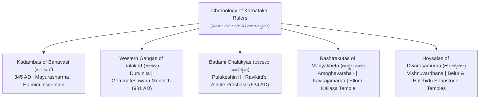
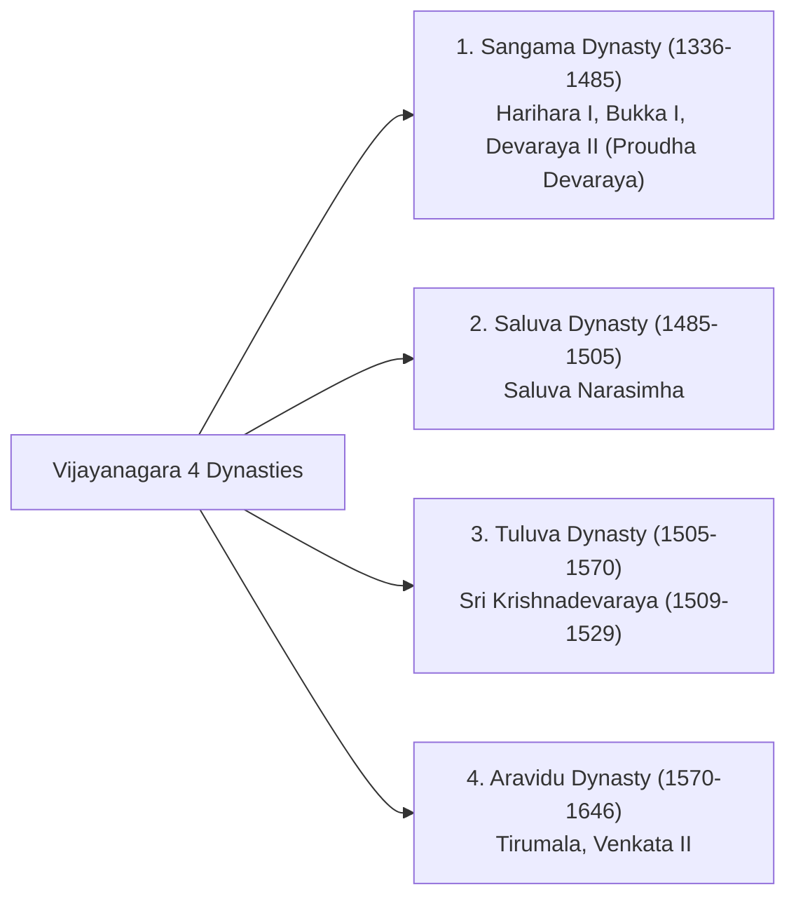
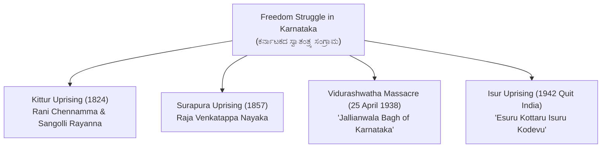

---exam: KEA VAO (Village Administrative Officer)
subject: Paper I - General Knowledge
topic: Karnataka History, Heritage & Unification (ಕರ್ನಾಟಕ ಇತಿಹಾಸ & ಪರಂಪರೆ)
priority: Tier 1 (18-22 Marks)
tags:
  - vao
  - general-knowledge
  - karnataka-history
  - freedom-movement
  - unification
  - paper-1
  - high-yield
syllabus_refs:
  - P1-VAO-HIST-1.1
  - P1-VAO-HIST-1.2
  - P1-VAO-HIST-1.3
  - P1-VAO-HIST-1.4
last_verified: 2026-09-30
sources:
  - KEA VAO Official Notification
  - Karnataka State Gazetteer & NCERT History
---

# 04. Karnataka History & Heritage (ಕರ್ನಾಟಕ ಇತಿಹಾಸ ಮತ್ತು ಪರಂಪರೆ)

> [!IMPORTANT] Exam Focus & Mark Potential
> - **Expected Weightage:** **18–22 Questions (18–22 Marks)** in Paper-I.
> - **Core High-Yield Dynasties:** Kadambas (Mayurasharma, Halmidi 450 AD), Badami Chalukyas (Pulakeshin II, Aihole Inscription), Rashtrakutas (Amoghavarsha I, Kavirajamarga c. 850 AD), Hoysalas (Vishnuvardhana, Belur-Halebidu), Vijayanagara Empire (Harihara-Bukka 1336, Krishnadevaraya 1509-29, Talikota 1565), Mysore Wodeyars (Chikka Devaraja, Nalvadi Krishnaraja Wodeyar, Sir MV), and Freedom Struggle & Ekikarana.
> - **Deep-Dive Studies:** See [[08a_Karnataka_History_Early_Dynasties]] (Prehistoric to Hoysalas) and [[08b_Karnataka_History_Vijayanagara_to_Modern]] (Vijayanagara to Ekikarana) for exhaustive dynasty-by-dynasty coverage, inscriptions, 50-fact sheets, and PYQs.

---

## 1. Ancient & Classical Dynasties of Karnataka



### Dynastic Master Summary Matrix

| Dynasty & Capital | Founder & Famous Ruler | Architecture & Inscriptions | Historical Landmark & Literature |
| :--- | :--- | :--- | :--- |
| **Kadambas of Banavasi** (Banavasi, Uttara Kannada) | **Mayurasharma** (Founder)<br>Kakusthavarma | Madhukeshwara Temple, Banavasi. | **Halmidi Inscription (c. 450 AD, Hassan)**: First lithic record in Kannada. Recognized as Karnataka's first indigenous ruling dynasty. |
| **Western Gangas of Talakad** (Talakadu, Mysuru) | Dadiga & Madhava<br>**Durvinita** (Greatest ruler) | **Gommateshwara (Bahubali) Monolith (981 AD, Shravanabelagola)**: 57-ft monolith commissioned by commander **Chavundaraya**. | Chavundaraya authored *Chavundaraya Purana* (first prose work in Kannada). Durvinita translated *Brihatkatha*. |
| **Badami Chalukyas** (Vatapi / Badami, Bagalkote) | Jayasimha (Founder)<br>**Pulakeshin II** (ಇಮ್ಮಡಿ ಪುಲಕೇಶಿ) | Rock-cut cave temples at Badami, Virupaksha temple at Pattadakal (UNESCO World Heritage Site), Durga temple at Aihole ("Cradle of Temple Architecture"). | **Aihole Inscription (634 AD)**: Written by court poet **Ravikirti**; details Pulakeshin II defeating Emperor Harsha on the banks of Narmada. |
| **Rashtrakutas of Manyakheta** (Malkhed, Kalaburagi) | **Dantidurga** (Founder)<br>**Amoghavarsha I (Nrupatunga)** | **Kailasanatha Temple at Ellora (Cave 16)**: Carved top-to-bottom from a single monolithic basalt cliff under King **Krishna I**. | **Kavirajamarga (c. 850 AD)**: First rhetorical text in Kannada by Sri Vijaya under Amoghavarsha. Defines Karnataka from *Cauvery to Godavari*. |
| **Hoysalas of Dwarasamudra** (Halebidu, Hassan) | Sala (Founder legend)<br>**Vishnuvardhana** (Bittideva) | **Chennakeshava Temple (Belur)**, **Hoysaleshwara Temple (Halebidu)**, Keshava Temple (Somanathapura). Characteristic star-shaped plinth using **soapstone**. | Royal sculptor: **Jakanachari**. Vishnuvardhana embraced Srivaishnavism under saint **Ramanujacharya**. |

---

## 2. Vijayanagara Empire (1336–1646 AD)

Founded on the banks of Tungabhadra River in **1336 AD** by brothers **Harihara I and Bukka I** under the spiritual guidance of **Sage Vidyaranya** of Sringeri Sharada Peetham.



### Sri Krishnadevaraya (1509–1529 AD):
- Titles: *Kannada Rajya Rama Ramana*, *Andhra Bhoja*, *Mooru Rayara Ganda*.
- Authored ***Amuktamalyada*** in Telugu and ***Jambavati Kalyanam*** in Sanskrit.
- Court featured the **Ashtadiggajas** (Eight great poets, including Allasani Peddana and Tenali Ramakrishna).
- Built the Hazara Rama Temple, Krishna Temple, and the colossal monolithic **Ugra Narasimha** at Hampi.
- **Battle of Talikota / Rakkasa-Tangadi (23 January 1565):** Combined Sultanates of Bijapur, Golconda, Ahmednagar, and Bidar defeated the Vijayanagara army under Aliya Rama Raya, leading to the destruction of Hampi.

---

## 3. Mysore Wodeyars, Hyder Ali, Tipu Sultan & Modern Karnataka

- **Chikka Devaraja Wodeyar:** Formed the **Athara Kacheri (18 Government Departments)**; purchased Bengaluru city from the Mughal general Qasim Khan in 1689.
- **Hyder Ali & Tipu Sultan (The Tiger of Mysore):**
  - **Four Anglo-Mysore Wars:**
    1. First War (1767–69) $\to$ Treaty of Madras.
    2. Second War (1780–84) $\to$ Treaty of Mangalore (Hyder died 1782).
    3. Third War (1790–92) $\to$ **Treaty of Srirangapatna** (Lord Cornwallis; Tipu surrendered half his territory).
    4. Fourth War (1799) $\to$ Fall of Srirangapatna on **4 May 1799**; Tipu killed in action.
- **Nalvadi Krishnaraja Wodeyar (1902–1940) — "Rajarshi":**
  - Appointed **Miller Committee (1918)** for backward class reservations in administration.
  - Established University of Mysore (1916) and built the **KRS Dam (1911–1932)**.
- **Sir M. Visvesvaraya (Dewan 1912–1918):**
  - Birthday celebrated on **15 September as National Engineers' Day**.
  - Engineered the automated sluice floodgates at Khadakwasla and KRS Dam.
  - Founded Bhadravati Iron & Steel Works (VISL), State Bank of Mysore (1913), UVCE (1917), and Kannada Sahitya Parishat (1915).

---

## 4. Freedom Movement & Unification of Karnataka (ಏಕೀಕರಣ)



### Karnataka Unification Milestones:
- **Alur Venkata Rao (ಆಲೂರು ವೆಂಕಟರಾವ್):** Revered as the **"Karnataka Kulapurohita"**. Published ***Karnataka Gatha Vaibhava (1912)***.
- **1924 Belgaum Congress Session:** Sole Congress session presided over by **Mahatma Gandhi**. Welcome song sung: *"Udayavagali Namma Cheluva Kannada Nadu"* composed by Huilgol Narayana Rao.
- **Fazal Ali States Reorganization Commission (1953):** Recommended creation of a united Kannada state.
- **1 November 1956:** Unified **Mysore State** formed with 19 districts (Chief Minister: S. Nijalingappa).
- **1 November 1973:** Chief Minister **D. Devaraj Urs** officially renamed Mysore State as **"Karnataka"**.

---

## 5. High-Yield Mnemonics

> [!NOTE] Memory Aids
> - **Vijayanagara Dynasties: "S-S-T-A"**
>   - **S**angama $\to$ **S**aluva $\to$ **T**uluva $\to$ **A**ravidu.
> - **Battle of Talikota: "1565 - Rakkasa Tangadi"**
>   - 23 January 1565.
> - **Four Anglo-Mysore Wars Treaties: "M-M-S-Death"**
>   - Treaty of **M**adras $\to$ Treaty of **M**angalore $\to$ Treaty of **S**rirangapatna $\to$ **Death** of Tipu (1799).

---

## 6. Likely Exam Questions & PYQ Patterns

1. **[KEA VAO PYQ]** *Who was the Dewan of Mysore responsible for founding the State Bank of Mysore and Kannada Sahitya Parishat?*
   - **Answer:** Sir M. Visvesvaraya (ಸರ್ ಎಂ.ವಿ.).
2. **[KEA PYQ]** *In which year was the Halmidi Inscription discovered, and to which dynasty does it belong?*
   - **Answer:** Kadamba dynasty of Banavasi (c. 450 AD).
3. **[Expected Question]** *The monolithic Gommateshwara statue at Shravanabelagola was consecrated in 981 AD by:*
   - **Answer:** Chavundaraya (Ganga military commander).
4. **[Expected Question]** *Which village in Karnataka declared itself independent during the 1942 Quit India Movement?*
   - **Answer:** Isur village (Shivamogga district).
5. **[Expected Question]** *Who is known as 'Karnataka Kulapurohita' for his pioneering role in Karnataka Ekikarana?*
   - **Answer:** Alur Venkata Rao.

---

## 7. Quick Revision Box

```
┌────────────────────────────────────────────────────────────────────────┐
│ KARNATAKA HISTORY & HERITAGE REVISION CHEAT SHEET                      │
├────────────────────────────────────────────────────────────────────────┤
│ • Kadambas: Mayurasharma, Banavasi, Halmidi Inscription (450 AD).      │
│ • Gangas: Talakad, Gommateshwara 981 AD (Chavundaraya).                │
│ • Badami Chalukyas: Pulakeshin II, Aihole Inscription 634 AD (Ravikirti)│
│ • Rashtrakutas: Manyakheta, Amoghavarsha I (Kavirajamarga c. 850 AD).  │
│ • Hoysalas: Dwarasamudra, Vishnuvardhana, soapstone Belur & Halebidu.  │
│ • Vijayanagara (1336): Harihara-Bukka. Krishnadevaraya (1509-1529).    │
│ • Battle of Talikota: 1565 AD (Rakkasa-Tangadi).                       │
│ • Mysore Wodeyars: Chikka Devaraja (Athara Kacheri). Nalvadi (Model).  │
│ • 4th Anglo-Mysore War: Tipu died 4 May 1799 at Srirangapatna.         │
│ • Vidurashwatha: 25 Apr 1938 | Isur: 1942 Quit India.                  │
│ • Reorganization: 1 Nov 1956 (Mysore) -> 1 Nov 1973 (Karnataka - Urs). │
└────────────────────────────────────────────────────────────────────────┘
```

---
*Related Notes:*
- [[08a_Karnataka_History_Early_Dynasties]] (Early Dynasties Deep Dive)
- [[08b_Karnataka_History_Vijayanagara_to_Modern]] (Vijayanagara to Modern Deep Dive)
- [[05_Karnataka_and_Indian_Geography]]
- [[09_Karnataka_Geography_Deep_Dive]]
- [[06_Indian_Constitution_and_Polity]]
- [[07_Panchayat_Raj_Act_and_Rural_Administration]]
