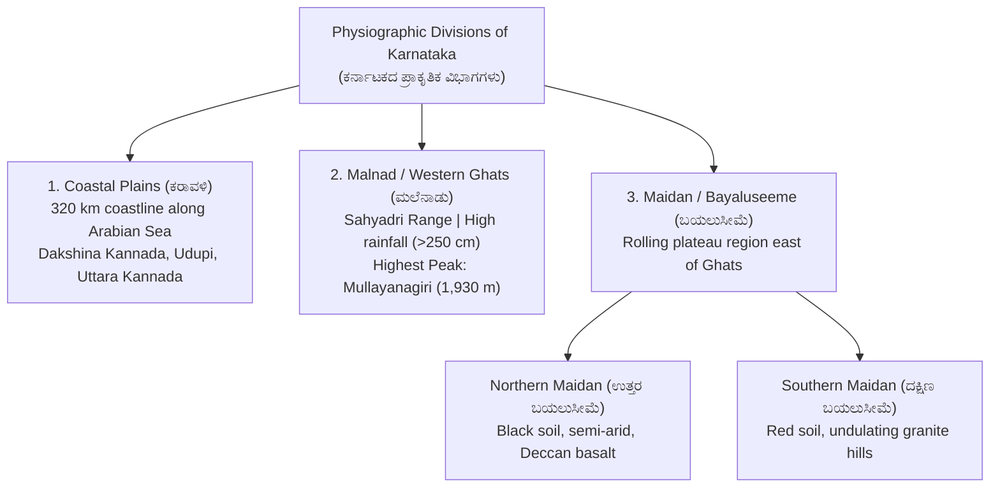
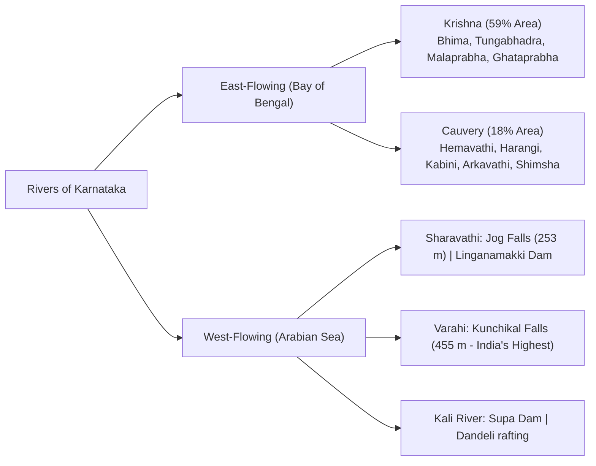
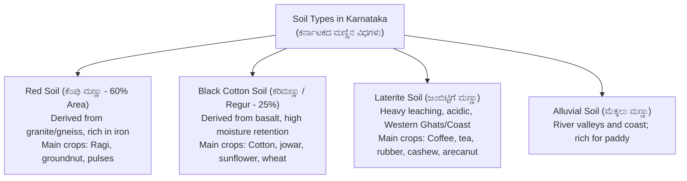

# 05. Karnataka & Indian Geography (ಭೂಗೋಳಶಾಸ್ತ್ರ)

> [!IMPORTANT] Exam Focus & Mark Potential
> - **Expected Weightage:** **16–20 Questions (16–20 Marks)** in Paper-I.
> - **Core Physical Features Tested:** 3 Physical zones (Karavali, Malnad, Bayaluseeme), Highest peak (Mullayanagiri, 1,930 m), Krishna & Cauvery river basins and dam projects, Famous waterfalls (Jog, Kunchikal, Shivanasamudra), Soils & 10 Agro-Climatic Zones, and Mineral resources (Hutti Gold Mines, Sandur Iron Ore).

---

## 1. Physical Divisions & Topography of Karnataka



### Critical Peaks & Physical Records
- **Mullayanagiri (ಮುಳ್ಳಯ್ಯನಗಿರಿ - 1,930 m):** In Bababudangiri range, Chikkamagaluru district. **Highest peak in Karnataka**.
- **Kudremukha (1,892 m):** Chikkamagaluru (Horse-face shaped peak, rich in magnetite iron ore).
- **Pushpagiri / Kumara Parvatha (1,712 m):** Kodagu / Dakshina Kannada border.
- **Agumbe (ಆಗುಂಬೆ):** In Thirthahalli taluk, Shivamogga district. Revered as the **"Cherrapunji of South India"** due to maximum annual rainfall; famous for King Cobra research station.

---

## 2. River Systems, Multipurpose Dams & Waterfalls



### Comprehensive River & Irrigation Dam Matrix

| River & Origin | Basin Area & Length | Tributaries | Major Dams & Multipurpose Projects | Waterfalls & Hydro Projects |
| :--- | :--- | :--- | :--- | :--- |
| **Krishna River** (Mahabaleshwar, Maharashtra) | $1,400\text{ km}$ ($483\text{ km}$ in KA) | **Ghataprabha**, **Malaprabha**, **Bhima**, **Tungabhadra** (Tunga + Bhadra merge at Kudli, Shivamogga). | • **Almatti Dam** (Lal Bahadur Shastri Sagar - Upper Krishna Project).<br>• **Narayanpur Dam** (Basava Sagar).<br>• **Tungabhadra Dam** at Hosapete (Vijayanagara). | **Gokak Falls** (52 m on Ghataprabha, "Niagara of Karnataka"). |
| **Cauvery River** (Talakaveri, Brahmagiri, Kodagu) | $805\text{ km}$ ($380\text{ km}$ in KA) | Harangi, **Hemavathi** (Gorur), **Kabini** (Beechanahalli), Lakshmanathirtha, Shimsha, Arkavathi. | • **Krishna Raja Sagara (KRS) Dam** (Kannambadi, Mandya).<br>• Gorur Dam (Hemavathi).<br>• Kabini Dam (HD Kote). | **Shivanasamudra Falls** (Gaganachukki & Bharachukki, 98 m). Home to Asia's first hydroelectric power station (1902). |
| **Sharavathi River** (Ambuthirtha, Shivamogga) | $128\text{ km}$ | Haridravathi | **Linganamakki Dam** (Sharavathi Valley Hydroelectric Project). | **Jog Falls / Gersoppa (253 m)**: Formed by 4 cascades: **Raja, Roarer, Rocket, Rani**. |
| **Varahi River** (Hebbagilu, Shivamogga) | $66\text{ km}$ | Kalandur | Mani Dam (Karnataka's underground powerhouse). | **Kunchikal Falls (455 m)**: Highest tiered cascade waterfall in India. |

---

## 3. Soils & 10 Agro-Climatic Zones of Karnataka

Karnataka is divided into **10 distinct Agro-Climatic Zones** for agrarian development:



---

## 4. Mineral Wealth of Karnataka

Karnataka is exceptionally rich in mineral reserves:
- **Gold (ಚಿನ್ನ):** **Hutti Gold Mines (ಹಟ್ಟಿ - Raichur district)** is currently the **only active primary gold producing underground mine in India**. (Historic Kolar Gold Fields / KGF ceased commercial production in 2001).
- **Iron Ore (ಕಬ್ಬಿಣದ ಅದಿರು):**
  - **Sandur Hills (Ballari / Vijayanagara)**: Hematite deposits.
  - **Kudremukha & Bababudangiri (Chikkamagaluru)**: Magnetite deposits.
- **Manganese:** Found abundantly in Sandur, Kumsi (Shivamogga), and Uttara Kannada.
- **Limestone:** Extensive sedimentary deposits in Bagalkote, Kalaburagi, and Sedam (major cement manufacturing hub of South India).

---

## 5. High-Yield Mnemonics

> [!NOTE] Memory Aids
> - **Only Active Gold Mine: "Hutti in Raichur"**
>   - Active gold mining $\implies$ **Hutti** (Raichur).
> - **Tunga + Bhadra Confluence: "Kudli Confluence"**
>   - Merge at **Kudli** in Shivamogga to become Tungabhadra.
> - **Almatti vs Narayanpur: "Lal Bahadur Almatti, Basava Narayanpur"**
>   - Almatti Dam = Lal Bahadur Shastri Sagar.
>   - Narayanpur Dam = Basava Sagar.

---

## 6. Likely Exam Questions & PYQ Patterns

1. **[KEA VAO PYQ]** *Which is the only active primary gold-producing mine in India at present?*
   - **Answer:** Hutti Gold Mines (Raichur district, Karnataka).
2. **[KEA PYQ]** *At which location do the rivers Tunga and Bhadra merge to form the Tungabhadra River?*
   - **Answer:** Kudli (ಕೂಡ್ಲಿ - Shivamogga district).
3. **[Expected Question]** *What is the official name of the reservoir formed by the Almatti Dam across the Krishna River?*
   - **Answer:** Lal Bahadur Shastri Sagar.
4. **[Expected Question]** *Which district in Karnataka is known as the "Cement Hub" of South India due to massive limestone deposits?*
   - **Answer:** Kalaburagi (Sedam) and Bagalkote.
5. **[Expected Question]** *How many Agro-Climatic Zones are officially demarcated in Karnataka?*
   - **Answer:** 10 Agro-Climatic Zones.

---

## 7. Quick Revision Box

```
┌────────────────────────────────────────────────────────────────────────┐
│ KARNATAKA GEOGRAPHY REVISION CHEAT SHEET                               │
├────────────────────────────────────────────────────────────────────────┤
│ • Mullayanagiri: 1,930 m in Chikkamagaluru (Highest peak).             │
│ • Agumbe: Cherrapunji of South India (Highest rainfall).               │
│ • Krishna: 59% area (Almatti = Shastri Sagar, Narayanpur = Basava Sagar)│
│ • Cauvery: 18% area (KRS Dam at Kannambadi, Talakaveri origin).        │
│ • Jog Falls: Sharavathi (253 m). Kunchikal: Varahi (455 m, India's high)│
│ • Shivanasamudra: 1902 Asia's first hydro-station on Cauvery.          │
│ • Tunga + Bhadra unite at Kudli (Shivamogga).                          │
│ • Red Soil: 60% (Ragi, pulses) | Black Soil: 25% (Cotton, jowar).      │
│ • 10 Agro-Climatic Zones in Karnataka.                                 │
│ • Gold: Hutti Mines (Raichur) - only active gold mine in India.        │
│ • Sandur (Ballari): Richest hematite iron ore and manganese.           │
└────────────────────────────────────────────────────────────────────────┘
```

---
*Related Notes:*
- [[04_Karnataka_History_and_Heritage]]
- [[06_Indian_Constitution_and_Polity]]
- [[07_Panchayat_Raj_Act_and_Rural_Administration]]
