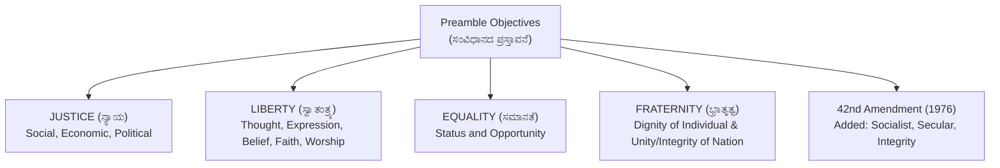
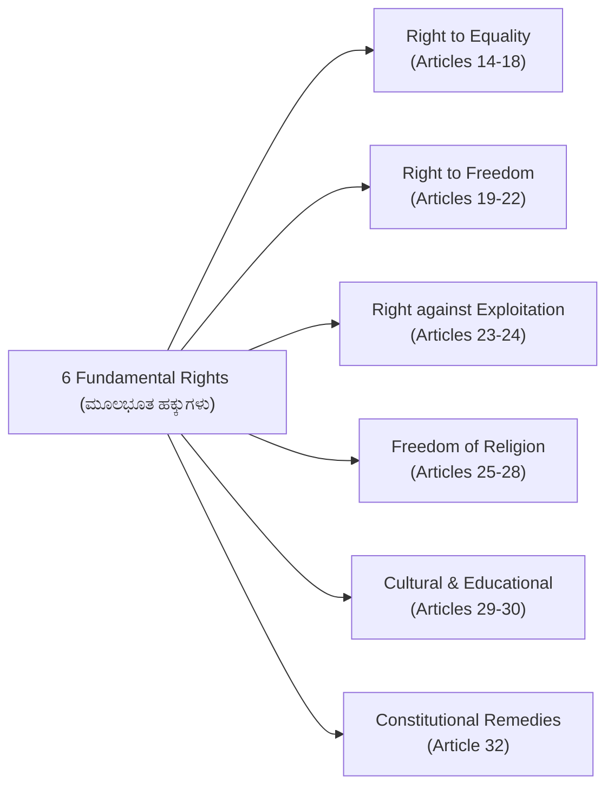
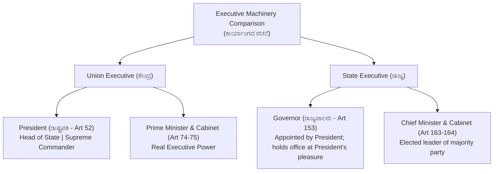

# 06. Indian Constitution & Polity (ಭಾರತೀಯ ಸಂವಿಧಾನ)

> [!IMPORTANT] Exam Focus & Mark Potential
> - **Expected Weightage:** **16–18 Questions (16–18 Marks)** in Paper-I.
> - **Core High-Yield Provisions:** Preamble values (Sovereign, Socialist, Secular, Democratic, Republic), Fundamental Rights (Articles 14–32), 5 Constitutional Writs, Directive Principles of State Policy (Articles 39A, 40, 44, 50), President & Governor appointment powers, and Parliament vs State Legislature structure.

---

## 1. Constitutional Foundations & Drafting History

- **Constituent Assembly:** First met on **9 December 1946** (Temporary Chairman: Dr. Sachchidananda Sinha; Permanent President elected 11 Dec 1946: **Dr. Rajendra Prasad**).
- **Drafting Committee (ಡ್ರಾಫ್ಟಿಂಗ್ ಕಮಿಟಿ):** Chaired by **Dr. B.R. Ambedkar** (appointed 29 August 1947).
- **Time taken to frame the Constitution:** **2 Years, 11 Months, and 18 Days**.
- **Adoption Date:** **26 November 1949** (celebrated annually as **National Constitution Day / ಸಂವಿಧಾನ ದಿನ**).
- **Commencement Date:** **26 January 1950** (Republic Day / ಗಣರಾಜ್ಯೋತ್ಸವ).



---

## 2. Fundamental Rights (ಮೂಲಭೂತ ಹಕ್ಕುಗಳು - Part III, Articles 12–35)



### Essential Fundamental Rights Articles

| Article | Constitutional Right & Scope | Landmark Significance |
| :---: | :--- | :--- |
| **Article 14** | Equality before Law & Equal Protection of the Laws. | Fundamental bedrock of Indian democracy. |
| **Article 15** | Prohibition of discrimination on grounds of religion, race, caste, sex, or place of birth. | Permits special affirmative provisions for women and socially backward classes. |
| **Article 16** | Equality of opportunity in matters of public employment. | Basis for reservations in government jobs. |
| **Article 17** | **Abolition of Untouchability (ಅಸ್ಪೃಶ್ಯತೆ ನಿರ್ಮೂಲನೆ)**. | Absolute right; enforcing disability is punishable under Protection of Civil Rights Act, 1955. |
| **Article 19** | Protection of **6 basic democratic freedoms**: Speech, Assembly, Association, Movement, Residence, Trade/Profession. | Enjoys constitutional protection subject to public order and sovereignty. |
| **Article 21** | **Protection of Life and Personal Liberty (ಜೀವಿಸುವ ಹಕ್ಕು)**. | Cannot be suspended even during Emergency (along with Art 20). Includes right to privacy (Puttaswamy case). |
| **Article 21A** | **Right to Free & Compulsory Elementary Education (6 to 14 years)**. | Enacted via **86th Amendment Act, 2002**; operationalized via RTE Act, 2009. |
| **Article 23** | Prohibition of human trafficking and forced labour (*Begar*). | Anti-exploitation protection. |
| **Article 24** | Prohibition of employment of children below 14 years in factories/mines. | Child labour abolition. |
| **Article 32** | **Right to Constitutional Remedies**. Supreme Court issues 5 Writs. | Termed the **"Heart and Soul of the Constitution"** by Dr. Ambedkar. |

---

## 3. The 5 Prerogative Writs (ಆದೇಶಗಳು - Articles 32 & 226)

| Writ Name | Literal Latin Meaning | Objective & Application |
| :--- | :--- | :--- |
| **Habeas Corpus** | *"To have the body"* | Remedy against unlawful detention. Court orders the detaining authority to produce the prisoner to examine legal justification. |
| **Mandamus** | *"We command"* | Issued to public officials or statutory authorities compelling them to perform an obligatory public duty. |
| **Prohibition** | *"To forbid"* | Issued to subordinate courts or tribunals to **prevent them from usurping jurisdiction** they do not possess. |
| **Certiorari** | *"To be certified"* | Issued to quash an order already passed by an inferior court/tribunal that acted in excess of legal authority. |
| **Quo-Warranto** | *"By what authority"* | Enquires into the legal title of an individual holding a public office to prevent unauthorized usurpation. |

---

## 4. Directive Principles (DPSP - Part IV) & Fundamental Duties (Part IV-A)

### High-Yield DPSP Articles (Borrowed from Ireland):
- **Article 39A:** Equal justice and **free legal aid** to the poor.
- **Article 40:** **Organization of Village Panchayats (ಗ್ರಾಮ ಪಂಚಾಯಿತಿಗಳ ಸಂಘಟನೆ)**.
- **Article 44:** **Uniform Civil Code (ಏಕರೂಪ ನಾಗರಿಕ ಸಂಹಿತೆ)**.
- **Article 45:** Provision for early childhood care and education to children below 6 years.
- **Article 48A:** Protection and improvement of environment, forests, and wildlife.
- **Article 50:** **Separation of Judiciary from Executive (ಕಾರ್ಯಾಂಗದಿಂದ ನ್ಯಾಯಾಂಗದ ಪ್ರತ್ಯೇಕತೆ)**.
- **Article 51:** Promotion of international peace and security.

### Fundamental Duties (Article 51A):
- Recommended by the **Swaran Singh Committee** and incorporated by the **42nd Amendment Act, 1976**.
- Currently **11 Duties** (11th duty added by **86th Amendment Act, 2002** regarding educating children aged 6–14).

---

## 5. Union & State Executive Machinery



### Karnataka State Legislature (Bicameral):
- **Vidhana Sabha (ವಿಧಾನಸಭೆ - Lower House):** **224 elected members** (MLAs) + tenure 5 years.
- **Vidhana Parishad (ವಿಧಾನಪರಿಷತ್ - Upper House):** **75 members** (MLCs); permanent house, 1/3rd members retire every 2 years.

---

## 6. High-Yield Mnemonics

> [!NOTE] Memory Aids
> - **Writs Acronym: "H-M-P-C-Q"**
>   - **H**abeas Corpus, **M**andamus, **P**rohibition, **C**ertiorari, **Q**uo-Warranto.
> - **Fundamental Duties Committee: "Swaran Singh Committee"**
>   - Golden rule: Swaran Singh recommended Fundamental Duties.
> - **Village Panchayats Article: "Article 40 is Four-Zero for Panchayats"**
>   - Article 40 in DPSP.

---

## 7. Likely Exam Questions & PYQ Patterns

1. **[KEA VAO PYQ]** *Which article of the Constitution directs the State to organize Village Panchayats as units of self-government?*
   - **Answer:** Article 40 (Part IV - DPSP).
2. **[KEA PYQ]** *The writ issued by the High Court or Supreme Court to quash an order passed without jurisdiction by a lower tribunal is:*
   - **Answer:** Certiorari (ಸರ್ಷಿಯೋರರಿ).
3. **[Expected Question]** *By which Constitutional Amendment were the words 'Socialist, Secular, and Integrity' added to the Preamble?*
   - **Answer:** 42nd Constitutional Amendment Act, 1976.
4. **[Expected Question]** *Who is the Constitutional Head of the State in India?*
   - **Answer:** The Governor (ರಾಜ್ಯಪಾಲರು).
5. **[Expected Question]** *Under Article 21A, free and compulsory education is guaranteed to children of what age group?*
   - **Answer:** 6 to 14 years.

---

## 8. Quick Revision Box

```
┌────────────────────────────────────────────────────────────────────────┐
│ INDIAN CONSTITUTION & POLITY REVISION CHEAT SHEET                      │
├────────────────────────────────────────────────────────────────────────┤
│ • Drafting Committee: Dr. B.R. Ambedkar. Formed: 29 Aug 1947.          │
│ • Constitution Day: 26 Nov | Republic Day: 26 Jan 1950.                │
│ • Preamble: Sovereign, Socialist, Secular, Democratic, Republic.       │
│ • Art 14: Equality before law | Art 17: Untouchability abolished.      │
│ • Art 19: 6 Freedoms | Art 21: Life and Personal Liberty.              │
│ • Art 21A: Right to Education (86th Amendment, 2002).                  │
│ • Art 32: Constitutional Remedies (Heart & Soul) - 5 Writs.            │
│ • Art 40: Village Panchayats | Art 44: Uniform Civil Code (UCC).       │
│ • Art 50: Separation of Judiciary from Executive.                      │
│ • Art 51A: 11 Fundamental Duties (Swaran Singh, 42nd Amendment).       │
│ • Governor: Appointed by President (Article 153).                      │
│ • Karnataka Legislature: Vidhana Sabha (224) + Vidhana Parishad (75).  │
└────────────────────────────────────────────────────────────────────────┘
```

---
*Related Notes:*
- [[04_Karnataka_History_and_Heritage]]
- [[05_Karnataka_and_Indian_Geography]]
- [[07_Panchayat_Raj_Act_and_Rural_Administration]]
