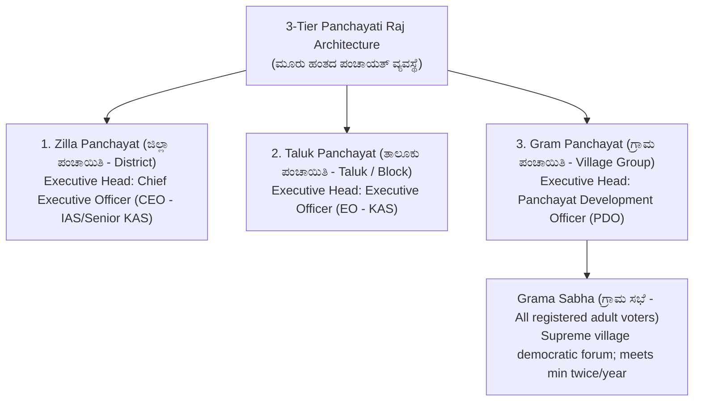
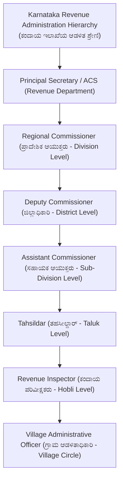
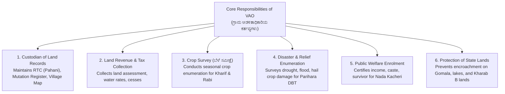

# 07. Panchayat Raj Act & Rural Revenue Administration (ಪಂಚಾಯತ್ ರಾಜ್ & ಕಂದಾಯ ಆಡಳಿತ)

> [!IMPORTANT] Exam Focus & Mark Potential
> - **Expected Weightage:** **15–18 Questions (15–18 Marks)** in Paper-I.
> - **Core Domain for VAO Post:** Karnataka Gram Swaraj & Panchayat Raj Act 1993, 3-tier PRI structure, Grama Sabha powers, Revenue Department Hierarchy (DC $\to$ AC $\to$ Tahsildar $\to$ RI $\to$ VAO), Duties of the Village Administrative Officer, Village Accounts & Registers (RTC / Pahani, Mutation Form 12, Jamabandi), and Bhoomi / e-Swathu workflows.

---

## 1. Panchayat Raj Evolution in Karnataka

Karnataka is recognized as the pioneer of modern decentralized rural self-governance in India.
- **Panchayat Raj Pioneer in Karnataka:** **Abdul Nazir Sab (ಅಬ್ದುಲ್ ನಜೀರ್ ಸಾಬ್)**, affectionately known as **"Neer Sab"** (for sinking borewells in rural areas). Under the Ramakrishna Hegde Government, he enacted the historic **Karnataka Zilla Parishads, Taluk Panchayat Samithis, Mandal Panchayats and Nyaya Panchayats Act, 1983**.
- **Karnataka Gram Swaraj and Panchayat Raj Act, 1993:** Enacted to conform with the **73rd Constitutional Amendment Act, 1992** (added Part IX and 11th Schedule containing 29 subjects).
- **2015 Amendment (Ramesh Kumar Committee):** Renamed the act as *The Karnataka Gram Swaraj and Panchayat Raj Act, 1993*, institutionalizing Ward Sabhas and Grama Swaraj principles.



### Key PRI Structural Rules in Karnataka:
1. **Gram Panchayat Population Criteria:** Formed for a population cluster of **5,000 to 7,000** in plains (Maidan) and **2,500 to 5,000** in Malnad and hilly districts. One member is elected for every **400 residents** in Malnad and every **500 residents** in Maidan.
2. **Tenure & Office:** Elected term is **5 years**.
3. **Women Reservation:** While the 73rd Amendment mandates 33.33%, **Karnataka provides 50% reservation for women** across all tiers and offices (Adhyaksha/Upadhyaksha).

---

## 2. Revenue Department Administrative Hierarchy

The Village Administrative Officer (VAO / ಗ್ರಾಮ ಆಡಳಿತಾಧಿಕಾರಿ - formerly Village Accountant / ಗ್ರಾಮ ಲೆಕ್ಕಿಗ) functions as the grassroots frontline revenue representative of the Government of Karnataka.



---

## 3. Statutory Duties of the Village Administrative Officer (VAO)

Under Section 16 & 17 of the **Karnataka Land Revenue Act, 1964**, the Village Administrative Officer performs essential administrative, revenue, and regulatory duties:



---

## 4. Land Records & Village Registers Master Matrix

| Document / Register | Official Form No. | Key Legal Contents & Function |
| :--- | :---: | :--- |
| **RTC / Pahani (ಪಹಣಿ)** | **Form 16** | **Record of Rights, Tenancy & Crops (ಹಕ್ಕು, ಗೇಣಿ ಮತ್ತು ಬೆಳೆ ದಾಖಲೆ)**.<br>• **Col 9:** Name of Owner, Joint holders, Extent, Soil assessment.<br>• **Col 11:** Liabilities, Bank mortgages, Government encumbrances.<br>• **Col 12:** Season, Crop names, Area sown, Irrigation source. |
| **Mutation Register (ನಾಮಾಂತರ ರಿಜಿಸ್ಟರ್)** | **Form 12** | Records changes in land ownership due to: Sale deed, Inheritance/Death, Partition, Gift deed, Court decree.<br>• Under **Section 129**, a **30-day public notice** is mandatory before confirmation. |
| **Record of Rights (ROR)** | **Form 21** | Comprehensive ownership title ledger for all agricultural holdings in the village. |
| **Jamabandi (ಜಮಾಬಂದಿ)** | Annual Inspection | Annual audit and settlement of all village accounts and land revenue records conducted by the Tahsildar or Assistant Commissioner. |
| **Village Accounts Form 1 to 24** | Manual Accounts | The traditional manual system of 24 village ledgers maintained by the Village Accountant prior to full computerization under the Bhoomi project. |

---

## 5. Village Property Governance: Bhoomi & e-Swathu

- **Bhoomi System (ಭೂಮಿ):**
  - All agricultural RTCs and Mutation workflows are 100% digital.
  - VAO verifies applications online and submits verification reports directly to the Revenue Inspector and Tahsildar via biometric digital authentication.
- **e-Swathu System (ಇ-ಸ್ವತ್ತು):**
  - Software for managing non-agricultural and rural residential properties under Gram Panchayats.
  - **Form 9 (ನಮೂನೆ 9):** Assessment list extract for buildings situated within the recognized village inhabited site (Grama Thana / Abadi).
  - **Form 11 (ನಮೂನೆ 11):** Assessment register extract for vacant residential plots and layout sites.
  - Property cannot be legally registered or sold without digitally signed Form 9 and Form 11!

---

## 6. High-Yield Mnemonics

> [!NOTE] Memory Aids
> - **Hierarchy Order: "D-A-T-R-V"**
>   - **D**C $\to$ **A**C $\to$ **T**ahsildar $\to$ **R**I $\to$ **V**AO.
> - **Forms Memory: "Form 16 = RTC, Form 12 = Mutation"**
>   - Form 16 is RTC/Pahani.
>   - Form 12 is Mutation Register.
> - **e-Swathu Forms: "Form 9 Building, Form 11 Site"**
>   - Form 9 for built-up house.
>   - Form 11 for vacant site.

---

## 7. Likely Exam Questions & PYQ Patterns

1. **[KEA VAO PYQ]** *In Karnataka, which official form represents the Record of Rights, Tenancy, and Crops (RTC / Pahani)?*
   - **Answer:** Form 16 (ನಮೂನೆ 16).
2. **[KEA PYQ]** *Under the Karnataka Land Revenue Act, what is the statutory notice period required for entering a mutation in Form 12?*
   - **Answer:** 30 days notice under Section 129.
3. **[Expected Question]** *Who is the administrative executive head of a Gram Panchayat in Karnataka?*
   - **Answer:** Panchayat Development Officer (PDO).
4. **[Expected Question]** *Which minister is hailed as the father of modern decentralized Panchayat Raj in Karnataka for introducing the historic 1983 Act?*
   - **Answer:** Abdul Nazir Sab (ಅಬ್ದುಲ್ ನಜೀರ್ ಸಾಬ್ - "Neer Sab").
5. **[Expected Question]** *In the e-Swathu portal, Form 9 is issued for which category of rural property?*
   - **Answer:** Built properties / residential houses situated within the Grama Thana (village settlement area).

---

## 8. Quick Revision Box

```
┌────────────────────────────────────────────────────────────────────────┐
│ PANCHAYAT RAJ & REVENUE ADMINISTRATION REVISION CHEAT SHEET            │
├────────────────────────────────────────────────────────────────────────┤
│ • Abdul Nazir Sab: Pioneered Karnataka Panchayat Raj (1983 Act).       │
│ • 1993 Act: 3-tier structure (Gram, Taluk, Zilla). 5-year tenure.      │
│ • Women reservation: 50% in Karnataka Panchayati Raj institutions.     │
│ • Grama Sabha: All adult voters in village (Meets min 2 times/year).   │
│ • Revenue Hierarchy: DC (Dist) -> AC (Sub-Div) -> Tahsildar (Taluk) -> │
│   RI (Hobli) -> VAO (Village Circle).                                  │
│ • RTC / Pahani: Form 16 | Col 9 (Owner), Col 11 (Loans), Col 12 (Crop).│
│ • Mutation: Form 12 | 30 days public notice under Section 129.         │
│ • Jamabandi: Annual inspection and audit of village revenue accounts.  │
│ • e-Swathu: Form 9 (Grama Thana house), Form 11 (Vacant site).         │
│ • Bhoomi: Computerized RTC and mutation workflow across all taluks.    │
└────────────────────────────────────────────────────────────────────────┘
```

---
*Related Notes:*
- [[04_Karnataka_History_and_Heritage]]
- [[05_Karnataka_and_Indian_Geography]]
- [[06_Indian_Constitution_and_Polity]]
- [[../04_Current_Affairs_GK/02_Karnataka_Revenue_Systems_and_Digitization]]
