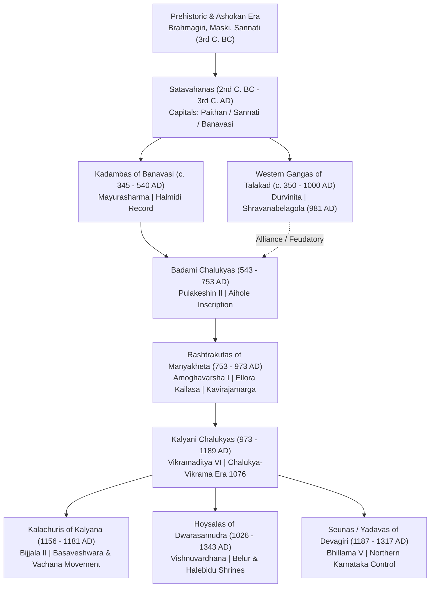
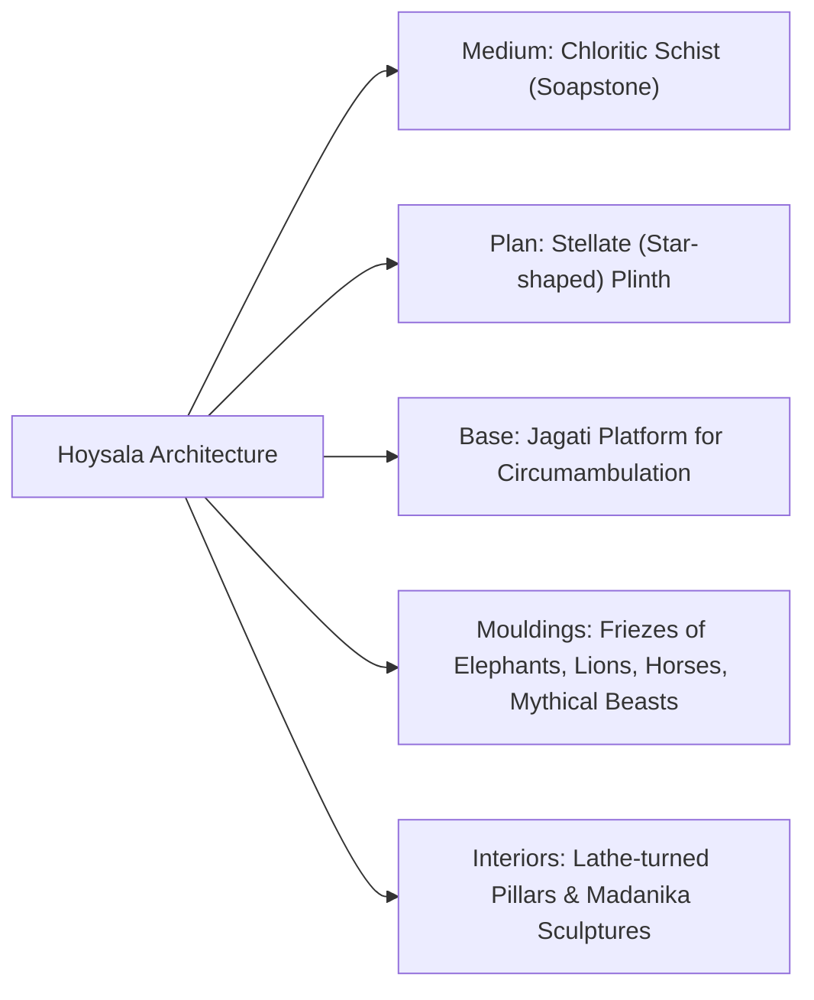

# 08a. Karnataka History Deep Dive: Early Dynasties to Hoysalas (ಪ್ರಾಚೀನ ಕರ್ನಾಟಕ ಇತಿಹಾಸ)

> [!IMPORTANT] Exam Focus & Mark Potential
> - **Expected Weightage:** **8–12 Questions** in Paper-I out of the 18–22 History marks belong to this early period.
> - **High-Yield Focal Points:**
>   1. **Inscriptions:** Halmidi (c. 450 AD), Talagunda, Aihole (634 AD), Kavirajamarga (c. 850 AD), Begur stone, Itagi inscription.
>   2. **Key Rulers & Titles:** Mayurasharma, Kakusthavarma, Pulakeshin II (*Parameshwara*), Amoghavarsha I (*Nrupatunga*), Vikramaditya VI (*Permadideva*), Vishnuvardhana (*Talakadugonda*).
>   3. **Temple Architecture:** Badami cave shrines, Pattadakal UNESCO complex, Ellora Kailasa monolithic rock-cut, Lakkundi/Itagi Kalyani Chalukyan, and Belur-Halebidu soapstone stellate temples.
>   4. **Foundational Literature:** *Kavirajamarga*, Pampa's *Vikramarjuna Vijaya*, Ponna, Ranna's *Gadayuddha*, Someshwara III's *Manasollasa*, and 12th-century Vachanas.

---

## 1. Master Chronological Timeline Matrix (Prehistoric to Hoysalas)



| Dynasty | Period | Primary & Secondary Capitals | Founder | Greatest Ruler | One-Line Exam Identity |
| :--- | :--- | :--- | :--- | :--- | :--- |
| **Mauryas in Karnataka** | c. 300–185 BC | Suvarnagiri (Kanakagiri, Koppal) | Chandragupta Maurya | Ashoka the Great | Introduced Brahmi script and Prakrit language via 14 Rock Edicts in Karnataka. |
| **Satavahanas** | c. 100 BC–225 AD | Pratishthana (Paithan) / Banavasi | Simukha | Gautamiputra Satakarni | First pan-Deccan empire; established Buddhist mahastupas at Sannati-Kanaganahalli. |
| **Kadambas** | c. 345–540 AD | Banavasi (Jayantipura), Uttara Kannada | Mayurasharma | Kakusthavarma | **First indigenous Kannada ruling dynasty**; issued earliest Kannada lithic inscription (Halmidi). |
| **Western Gangas** | c. 350–1000 AD | Kolar (Kuvalala) $\to$ Talakadu (Mysuru) | Dadiga & Madhava (Konganivarma) | Durvinita | Ruled Southern Karnataka (Gangavadi 96,000); consecrated Gommateshwara monolith (981 AD). |
| **Badami Chalukyas** | 543–753 AD | Vatapi (Badami, Bagalkote) | Jayasimha (real founder: Pulakeshin I) | Pulakeshin II (ಇಮ್ಮಡಿ ಪುಲಕೇಶಿ) | Unified Karnataka; stopped Harsha at Narmada; created Badami-Aihole-Pattadakal architecture. |
| **Rashtrakutas** | 753–973 AD | Mayurakhandi $\to$ Manyakheta (Malkhed, Kalaburagi) | Dantidurga | Amoghavarsha I (Nrupatunga) | Imperial Karnataka power; carved Ellora Kailasa; produced first Kannada literary work (*Kavirajamarga*). |
| **Kalyani Chalukyas** | 973–1189 AD | Manyakheta $\to$ Kalyana (Basavakalyana, Bidar) | Tailapa II | Vikramaditya VI (Vikramanka) | Started Chalukya-Vikrama Era (1076 AD); built ornate soapstone temples (*Devalaya Chakravarti* at Itagi). |
| **Kalachuris** | 1156–1181 AD | Kalyana (Bidar) | Bijjala II | Bijjala II | Usurped Chalukyan throne; backdrop for Basaveshwara's Sharana movement & Anubhava Mantapa. |
| **Hoysalas** | 1026–1343 AD | Sosavur (Angadi) $\to$ Dwarasamudra (Halebidu) | Sala (Arekalla / Nripakama) | Vishnuvardhana (Bittideva) | Mastered star-shaped soapstone architecture (Belur, Halebidu, Somanathapura); patron of Ramanujacharya. |
| **Seunas (Yadavas)** | 1187–1317 AD | Devagiri (Daulatabad, Maharashtra) | Bhillama V | Singhana II | Controlled Northern Karnataka; patronized Sharngadeva (*Sangita Ratnakara*) and Hemadri. |

---

## 2. Prehistoric Karnataka, Mauryas & Satavahanas

### Prehistoric & Proto-Historic Sites
- **Palaeolithic Sites:** Kibbanahalli (Tumakuru), Hunasagi & Baichbal Valley (Yadgir), Anagawadi (Bagalkote).
- **Mesolithic Sites:** Jalahalli (Bengaluru), Brahmagiri (Chitradurga), Sanganakallu (Ballari).
- **Neolithic / Ashmound Sites (ನವಶಿಲಾಯುಗದ ಬೂದಿ ದಿಬ್ಬಗಳು):**
  - **Sanganakallu & Kupgal (Ballari):** Massive Neolithic ash mounds and polished celts.
  - **Piklihal & Maski (Raichur):** Pastoral cattle pens yielding Neolithic burnished grey pottery.
  - **Hallur (Haveri):** Earliest Iron Age site in South India (carbon-dated to c. 1000–900 BC); evidence of horse bones and iron implements.
  - **Brahmagiri (Chitradurga):** Continuous stratigraphy from Neolithic to Megalithic cist burials excavated by Sir Mortimer Wheeler (1947).

### The Maurya Presence in Karnataka
- **Jain Tradition:** Chandragupta Maurya migrated to **Shravanabelagola (Chandragiri hill)** accompanied by Jain monk **Bhadrabahu** during a 12-year North Indian famine, ending his life via **Sallekhana** (ritual fasting).
- **Ashokan Rock Edicts in Karnataka (Total 14 Edicts across 9 Sites):**
  1. **Maski (Raichur):** Discovered by C. Beadon in 1915. **Most famous edict**: First to identify the emperor by his personal name **"Devanampriya Asoka"** (instead of just *Devanampriya*).
  2. **Koppal District:** Palkigundu and Gavimath (Minor Rock Edicts).
  3. **Chitradurga District:** Brahmagiri, Siddapura, and Jatinga Rameshwara (discovered by B.L. Rice in 1892). Isila was the local Mauryan administrative seat.
  4. **Ballari District:** Nittur and Udegolam (both mention *Raja Asoka*).
  5. **Kalaburagi District (Sannati / Kanaganahalli):** On the Bhima River. Major Rock Edicts (Special Rock Edicts XI & XII) found on granite slabs of the Chandralamba temple complex.

### Satavahanas in Karnataka
- Ruled parts of Northern Karnataka after the decline of the Mauryas.
- **Kanaganahalli (Sannati, Kalaburagi):** Excavations by the Archaeological Survey of India (ASI) revealed a monumental Maha Stupa (**Adholoka Maha Chaitya**). Features the world-famous inscribed stone slab portrait labeled **"Rayo Asoko"** (Emperor Ashoka flanked by queens).
- **Banavasi:** Yielded Satavahana lead and potin coins of Pulumavi and Yajna Sri Satakarni.
- **Literary Landmark:** *Gaha Sattasai* (*Gatha Saptasati*) in Maharashtri Prakrit compiled by Satavahana King **Hala**.

---

## 3. Kadambas of Banavasi (ಕದಂಬರು — c. 345–540 AD)

### 1. Origin and Capitals
- **Origin:** Native Kannada Brahmana family of Sthanakundur (Talagunda, Shivamogga district).
- **Capitals:** Primary capital at **Banavasi** (ancient Jayantipura/Vaijayanti on the Varada River, Uttara Kannada); secondary capital at **Triparvatha** (identified with Devagiri near Karwar or Murgod in Belagavi).
- **Royal Emblem:** **Lion** (ಸಿಂಹ).

### 2. Founder and Key Rulers
- **Mayurasharma (c. 345–365 AD):** Founder. Travelled to Kanchi to study Vedic scriptures at the Pallava Ghatika; insulted by a Pallava horseman, he took up the sword (*kshatradharma*), defeated Pallava frontier guards, and founded Karnataka's first indigenous kingdom.
- **Kangavarma (c. 365–390 AD):** Faced Vakataka aggression under Prithvishena.
- **Kakusthavarma (c. 435–455 AD):** Greatest ruler. Expanded frontiers; established matrimonial alliances with the imperial Guptas, Vakatakas, and Gangas. Built a large freshwater reservoir at Talagunda.
- **Shantivarma & Mrigeshavarma:** Continued administrative consolidation; Mrigeshavarma patronized Jainism and constructed Jain Chaityas at Banavasi.

### 3. Important Battles, Treaties, and Inscriptions
- **Talagunda Pillar Inscription (Talagunda, Shivamogga):**
  - Composed in classical Sanskrit poetry by court poet **Kubja** under Shantivarma.
  - Documents Mayurasharma's humiliation at Kanchi, his military revolt, and the lineage of the Kadamba dynasty.
- **Halmidi Inscription (ಹಾಲ್ಮಿಡಿ ಶಾಸನ — c. 450 AD):**
  - Location: Halmidi village, Belur taluk, Hassan district. Discovered by Dr. M.H. Krishna in 1936.
  - Script: Brahmi; Language: **Earliest deciphered lithic record in pre-old Kannada (ಪೂರ್ವದ ಹಳಗನ್ನಡ)**.
  - Issued under King **Kakusthavarma**; records a tax-free land grant (*Balgachu*) to a warrior named Vijaarasa for heroism in battle against the Gangas and Pallavas.
- **Chandravalli Inscription (Chitradurga):** Prakrit lithic inscription by Mayurasharma recording his victory over the Abhira, Pallava, Traikutaka, and Pariyatrika rulers, and the excavation of a water reservoir.

### 4. Administration and Society
- Decentralized provincial administration: Provinces called *Mandala*, districts called *Vishaya*.
- Royal officers included *Pradhana* (Prime Minister), *Maneveri* (Royal household steward), and *Tantrapala* (Foreign Affairs).
- Village assembly was called *Ooru*, headed by the *Gramika*.

### 5. Religion, Literature, and Architecture
- **Religion:** Brahmanical Hinduism (ardent devotees of Lord Shiva / *Pranaveshwara* of Talagunda and *Madhukeshwara* of Banavasi); also extended broad patronage to Jainism.
- **Architecture:** Developed the proto-Dravidian **Kadamba Shikhara** (stepped-pyramidal tower with a flat top crowned by a *Kalasha* or *Stupika*).
  - Key surviving example: **Madhukeshwara Temple, Banavasi** (renovated by later dynasties).

### 6. Decline and Exam Traps
- **Decline:** Collapsed due to internal partition between Banavasi and Triparvatha branches, and succumbed to the rising power of Badami Chalukya King **Kirtivarman I** around 540 AD.
- **Exam Trap:** Do not confuse Kadambas of Banavasi with later minor branches (Kadambas of Goa, Kadambas of Hangal). The *Halmidi Inscription* belongs to **Kakusthavarma**, but the *Talagunda Inscription* was composed under **Shantivarma**.

---

## 4. Western Gangas of Talakad (ತಲಕಾಡಿನ ಗಂಗರು — c. 350–1000 AD)

### 1. Origin and Capitals
- **Origin:** Claimed descent from the Ikshvaku lineage; initiated in southern Karnataka with the blessings of Jain Acharya **Simhanandi**.
- **Capitals:** Initial seat at **Kuvalala** (modern Kolar) $\to$ shifted permanently to **Talakadu** (on the banks of Cauvery, Mysuru district); military second capital at **Mankunda** (Ramanagara).
- **Royal Emblem:** **Elephant** (ಮದಗಜ).

### 2. Founder and Key Rulers
- **Dadiga and Madhava (Konganivarma, c. 350 AD):** Founding brothers.
- **Durvinita (c. 529–579 AD):** Greatest monarch of the dynasty. Great warrior, scholar, and diplomat. Conquered Punnata (Heggadadevanakote region); defeated Pallavas in the Battle of Vilinda.
- **Sripurusha (726–788 AD):** Titled *Permanadi*. Shifted seat to Manyapura (Manne near Nelamangala); defeated the Pandyan king; wrote an authoritative treatise on elephants: ***Gajashastra***.
- **Marasimha II (963–975 AD):** Ardent Jain; earned title *Gutjiya Ganga*; ended life by Sallekhana at Bankapura under Acharya Ajitasena.
- **Chavundaraya (Minister & Military Commander):** Served Kings Marasimha II and Rachamalla IV.

### 3. Historical Inscriptions & Literary Milestones
- **Chavundaraya:**
  - Consecrated the **57-ft monolithic Gommateshwara (Bahubali) statue** atop Vindhyagiri hill at **Shravanabelagola in 981 AD**.
  - Authored ***Chavundaraya Purana*** (978 AD, also called *Trishasthi Lakshana Mahapurana*), the **earliest available extant prose work in Kannada**.
- **Durvinita's Scholarship:**
  - Wrote a Sanskrit commentary on the 15th sarga of Bharavi's *Kiratarjuniya*.
  - Translated Gunadhya's *Brihatkatha* from Paisachi Prakrit into classical Sanskrit.
  - Revered in *Kavirajamarga* as one of the foremost early Kannada prose stylists.
- **Begur Hero Stone Inscription (Bengaluru):** Inscribed c. 908 AD under Ereyappa; contains the **earliest epigraphic mention of the placename "Bengaluru"** (*Benguluru kalagada*).

### 4. Architecture & Exam Traps
- **Architecture:** Dravidian brick and granite idiom with hallmark *Mahastambhas* (free-standing monolithic pillar monuments) and Jain *Basadis*.
  - **Chavundaraya Basadi & Chandragupta Basadi** (Shravanabelagola).
  - **Panchakuta Basadi** (Kambadahalli, Mandya district): Fine example of early trikuta/panchakuta Dravidian stone carving.
  - **Kapileshwara & Pataleshwara temples** (Talakadu).
- **Decline:** Subjugated by the Chola imperial expansion under Rajaraja Chola I (capture of Talakadu in 1004 AD).
- **Exam Trap:** Gommateshwara was commissioned by **Chavundaraya** (minister/commander), NOT the king himself. The ruling monarch on the throne in 981 AD was **Rachamalla IV**.

---

## 5. Badami Chalukyas (ಬಾದಾಮಿ ಚಾಲುಕ್ಯರು — 543–753 AD)

### 1. Origin and Capitals
- **Capitals:** **Vatapi** (modern Badami, Bagalkote district); secondary cultural capital at **Aihole** (Aryapura).
- **Royal Emblem:** **Varaha** (Boar incarnation of Vishnu - ವರಾಹ ಲಾಂಛನ).

### 2. Founder and Key Rulers
- **Jayasimha & Ranaraga:** Early chieftains.
- **Pulakeshin I (543–566 AD):** Real founder. Built the hill fort of Vatapi; performed the Ashwamedha sacrifice.
- **Kirtivarman I (566–597 AD):** Conquered Kadambas of Banavasi and Mauryas of Konkan.
- **Mangalesha (597–609 AD):** Regent uncle; excavated the famous Cave 3 (Vaishnava) at Badami (dated 578 AD); killed in civil war by nephew Pulakeshin II.
- **Pulakeshin II (ಇಮ್ಮಡಿ ಪುಲಕೇಶಿ — 609–642 AD):** Greatest sovereign.
  - Subdued Kadambas, Gangas, Alupas, and Latas.
  - **Battle of Narmada (c. 618–619 AD):** Inflicted a crushing defeat on Northern Emperor **Harshavardhana** of Kanauj, stopping Harsha's southern expansion and earning the supreme title **"Parameshwara"** and **"Dakshinapatheshwara"**.
  - Defeated Pallava King Mahendravarman I at Pullalur.
  - Defeated and killed in 642 AD when Pallava King **Narasimhavarman I (Mamalla)** invaded Vatapi and assumed the title *Vatapikonda*.
- **Vikramaditya I (655–680 AD):** Restored Chalukyan glory; captured Kanchi and expelled Pallava occupation.
- **Vikramaditya II (733–744 AD):** Invaded Kanchi three times; spared Kanchi's Kailasanatha temple; inscribed his victory on a pillar at Kanchi without looting the temple.

### 3. Inscriptions & Foreign Travellers
- **Aihole Inscription (ಐಹೊಳೆ ಪ್ರಶಸ್ತಿ — 634 AD / Saka 556):**
  - Incised on the eastern outer wall of the **Meguti Jain Temple** at Aihole.
  - Composed in 19 classical Sanskrit stanzas by Jain royal poet **Ravikirti**.
  - Contains exact verse dating referencing the Mahabharata War (3735 years elapsed) and the death of poet Kalidasa and Bharavi.
  - Provides the primary authentic chronological account of Pulakeshin II's conquests and the defeat of Harsha.
- **Hiuen Tsang (Xuanzang — visited 641 AD):** Chinese Buddhist pilgrim visited Pulakeshin II's court; left glowing descriptions of the prosperity of Maharashtra/Karnataka, the fearless character of its people (*Mo-ho-la-ch'a*), and the emperor's massive war elephant brigade.

### 4. Architecture: "The Cradle of Temple Architecture"
Pioneered the **Vesara style** (blend of Nagara and Dravidian idioms) across three hubs in Bagalkote:
1. **Aihole (120+ temples):**
   - **Durga Temple:** Horse-shoe shaped apsidal plinth (*Gajaprishtha* style) with perambulatory colonnade.
   - **Lad Khan Temple:** Flat-roofed, pillared hall style resembling a village community assembly hall.
   - **Huchimalli Gudi:** Introduced the first integrated *antardwara* / vestibule (*shukanasa*).
   - **Meguti Jain Temple:** Hilltop shrine housing Ravikirti's inscription.
2. **Badami Rock-Cut Caves (4 major caves):**
   - Cave 1: Shaiva (18-armed dancing Shiva / Nataraja performing *Tandava*).
   - Cave 2: Vaishnava (Trivikrama lifting left leg to heavens).
   - Cave 3: Vaishnava (Largest and most ornate; seated Vishnu on Adisesha; dated 578 AD under Mangalesha).
   - Cave 4: Jain (Tirthankaras Parshvanatha and Mahavira).
3. **Pattadakal (UNESCO World Heritage Site, 1987):**
   - **Virupaksha Temple (Lokeshwara):** Built by Queen **Lokamahadevi** in 740 AD to celebrate Vikramaditya II's victory over the Pallavas. Modelled after Kanchi Kailasanatha temple; chief royal architect was **Gunda Anivaritachari** (honoured with the title *Tribhuvanacharya*).
   - **Mallikarjuna Temple (Trailokyeshwara):** Built by junior Queen Trailokyamahadevi.
   - Papanatha Temple (Nagara curvilinear shikhara).

```
> [!CAUTION] Exam Trap
> - Virupaksha Temple at Pattadakal was built by Queen **Lokamahadevi** (Chalukyan).
> - Virupaksha Temple at Hampi was developed centuries later by the **Vijayanagara** kings on the Tungabhadra River.
```

---

## 6. Rashtrakutas of Manyakheta (ರಾಷ್ಟ್ರಕೂಟರು — 753–973 AD)

### 1. Origin and Capitals
- **Capitals:** Initially Mayurakhandi (Morkhand in Maharashtra) $\to$ permanently shifted to **Manyakheta** (modern Malkhed on the Kagina River, Sedam taluk, Kalaburagi district) by Amoghavarsha I.
- **Royal Emblem:** **Garuda** (ಗರುಡ ಲಾಂಛನ).

### 2. Founder and Key Rulers
- **Dantidurga (753–756 AD):** Founder. Overthrew the last Badami Chalukyan king Kirtivarman II; performed the *Hiranyagarbha Mahadana* sacrifice at Ujjain.
- **Krishna I (756–774 AD):** Commissioned the rock-cut **Kailasanatha Temple at Ellora (Cave 16)**.
- **Dhruva (780–793 AD) & Govinda III (793–814 AD):** Led northern military expeditions deep into the Gangetic plains, defeating Pratihara King Vatsaraja and Pala King Dharmapala (took imperial Rashtrakuta standards to the Himalayas).
- **Amoghavarsha I Nrupatunga (814–878 AD):** Ruled for 64 years. Great patron of arts, devout Jain, man of peace. Renowned as the **"Ashoka of the South"**. Shifted capital to Manyakheta. Arab merchant Sulaiman ranked his empire as one of the **Four Great Empires of the World** (alongside Rome, China, and Baghdad).
- **Krishna III (939–967 AD):** Last great warrior king. Defeated the Chola Crown Prince Rajaditya at the **Battle of Takkolam (949 AD)** with the assistance of Western Ganga ally Butuga II; erected a victory pillar (*Jayastambha*) at Rameshwaram.

### 3. Literature & Religion
- ***Kavirajamarga* (ಕವಿರಾಜಮಾರ್ಗ — c. 850 AD):**
  - Earliest available poetic and rhetorical work in Kannada.
  - Authored by court poet **Sri Vijaya** under the inspiration/direction of Amoghavarsha I.
  - Defined the geographical boundary of Karnataka: **"ಕಾವೇರಿಯಿಂದಮಾ ಗೋದಾವರಿವರಮಿರ್ಪ ನಾಡದಾ ಕನ್ನಡದೊಳ್"** (From River Cauvery in the south to River Godavari in the north).
- **Prashnottara Ratnamalika:** Sanskrit philosophical catechism authored by Amoghavarsha I.
- **The Classical Kannada "Ratnatraya" (ರತ್ನತ್ರಯರು):**
  1. **Pampa (ಆದಿಕವಿ ಪಂಪ):** Court poet of Vemulawada Chalukya Arikesari II (Rashtrakuta feudatory). Authored ***Adipurana*** (Jain religious epic on Rishabhanatha) and ***Vikramarjuna Vijaya*** (popularly known as *Pampa Bharata*, identifying his patron Arikesari with Arjuna).
  2. **Ponna:** Court poet of Krishna III; conferred title *Ubhayakavichakravarti*; authored ***Santipurana***.
  3. **Ranna:** (*Wrote primarily under the succeeding Western Chalukyas*); authored *Ajitapurana* and the monumental *Gadayuddha* (*Sahasa Bhima Vijaya*).
- **Sanskrit Scholars:** Jinasena authored *Adipurana* and *Harivamsa*; Mahaviracharya composed the mathematical treatise *Ganita Sara Sangraha*.

### 4. Architecture & Inscriptions
- **Kailasanatha Monolithic Temple, Ellora (Cave 16, Aurangabad):**
  - Commissioned by King **Krishna I**.
  - World's largest monolithic rock excavation; carved vertically top-down from a single basalt mountain cliff.
- **Navalinga Temple Complex (Kuknur, Koppal district):** Rashtrakuta cluster temple showing early Dravidian transition.
- **Decline:** Last ruler Karka II was overthrown in 973 AD by his feudatory **Tailapa II**, re-establishing the Chalukya line at Kalyani.

---

## 7. Kalyani Chalukyas / Western Chalukyas (ಕಲ್ಯಾಣದ ಚಾಲುಕ್ಯರು — 973–1189 AD)

### 1. Origin and Capitals
- **Capitals:** Manyakheta initially $\to$ shifted to **Kalyana** (modern Basavakalyana, Bidar district) by **Someshwara I**.
- **Royal Emblem:** **Varaha** (Boar).

### 2. Founder and Key Rulers
- **Tailapa II (973–997 AD):** Overthrew Rashtrakuta King Karka II; defeated Paramara King Munja of Malwa.
- **Someshwara I Ahavamalla (1042–1068 AD):** Founded the city of Kalyana; fought numerous wars against Chola Rajadhiraja (who was killed at the Battle of Koppam in 1054 AD); ended his life via ritual drowning (*Jalasamadhi*) in the Tungabhadra River at Kuruvatti due to an incurable fever.
- **Vikramaditya VI (ವಿಕ್ರಮಾದಿತ್ಯ VI — 1076–1126 AD):**
  - Greatest monarch of the dynasty. Dethroned elder brother Someshwara II.
  - Abolished the traditional Saka calendar and founded the **Chalukya-Vikrama Era (ಚಾಲುಕ್ಯ ವಿಕ್ರಮ ಶಕ)** starting with his coronation in **1076 AD**.
  - Maintained peace for nearly half a century; titles: *Tribhuvanamalla*, *Permadideva*.
- **Someshwara III (1126–1138 AD):** Scholar king titled **"Sarvajna Bhupa"** (Omniscient Monarch).
  - Authored the landmark Sanskrit encyclopedia ***Manasollasa*** (also known as ***Abhilashitartha Chintamani***), covering 100 topics including statecraft, medicine, culinary arts, architecture, games, and music.

### 3. Literary Masters & Legal Texts
- **Bilhana:** Kashmiri poet patronized by Vikramaditya VI; authored the historical eulogy ***Vikramankadeva Charita*** in Sanskrit.
- **Vijnaneshwara:** Court jurist under Vikramaditya VI; authored the legal treatise ***Mitakshara*** (a commentary on the *Yajnavalkya Smriti*), which became the foundational Hindu civil law governing property inheritance across India (except Bengal).
- **Ranna:** Patronized by Tailapa II and Satyashraya; wrote ***Sahasa Bhima Vijaya*** (*Gadayuddha*), depicting the club fight between Bhima and Duryodhana.

### 4. Architecture: "Gadag Style" of Vesara
Used fine-grained chloritic schist (soapstone) with ornate doorway mouldings, lathe-turned circular pillars, and intricate miniature towers.
- **Mahadeva Temple, Itagi (Koppal district):** Built by military general Mahadeva in 1112 AD. Its inscription famously proclaims it as **"Devalaya Chakravarti"** (Emperor among Temples).
- **Kashi Vishweshwara Temple, Lakkundi (Gadag district):** Hallmark of decorative soapstone relief.
- **Mallikarjuna Temple, Kuruvatti** & **Kalleshwara Temple, Bagali** (Vijayanagara/Ballari border).

---

## 8. Kalachuris of Kalyana (ಕಲಚೂರಿಗಳು — 1156–1181 AD)

### 1. Origin and Usurpation
- Originating as feudatories from Central India (Chedi/Dahala region), settled in the Tarikere/Mangalavedhe region.
- **Bijjala II (1156–1167 AD):** Military commander who deposed Kalyani Chalukya King Tailapa III in 1156 AD, capturing Kalyana.

### 2. The 12th-Century Sharana & Vachana Movement
- **Lord Basaveshwara (ಬಸವೇಶ್ವರ / ಬಸವಣ್ಣ — 1131–1167 AD):**
  - Born in **Ingaleshwar-Bagewadi** (Vijayapura district); served as Prime Minister and Royal Treasurer (*Bhandari*) in Bijjala II's court at Kalyana.
  - Propounded **Lingayatism / Veerashaivism**, preaching *Kayaka* (Work is Worship - ಕಾಯಕವೇ ಕೈಲಾಸ) and *Dasoha* (Equal distribution/sharing).
  - Established the **Anubhava Mantapa** (ಅನುಭವ ಮಂಟಪ) at Basavakalyana—the world's first socio-spiritual democratic parliament.
  - First President of Anubhava Mantapa: **Allama Prabhu**.
- **Prominent Vachanakaras:**
  - **Akka Mahadevi:** Born in Udutadi (Shivamogga); dedicated her vachanas to Lord *Chennamallikarjuna*.
  - **Channabasavanna:** Nephew of Basavanna; systematized Shatstala philosophy.
  - **Madivala Machideva, Jedara Dasimayya, Hadapada Appanna**.
- **The Kalyana Revolution (ಕಲ್ಯಾಣ ಕ್ರಾಂತಿ):** Social tensions peaked over an inter-caste marriage arranged between the son of Haralayya (untouchable) and the daughter of Madhuvarasa (Brahmin). Orthodox opposition led to executions, Bijjala's assassination, and the dispersal of Sharanas to Ulavi and Kudalasangama.

---

## 9. Hoysalas of Dwarasamudra (ಹೊಯ್ಸಳರು — 1026–1343 AD)

### 1. Origin, Myth, and Capitals
- **Legend of Origin:** In **Sosavur** (modern Angadi, Mudigere taluk, Chikkamagaluru), a youth named **Sala** struck down a tiger on the instruction of his Jain guru Sudatta who commanded **"Poy, Sala!"** (Strike, Sala!). This gave rise to the royal emblem: Sala slaying the tiger.
- **Capitals:** Sosavur $\to$ Belur $\to$ **Dwarasamudra** (modern Halebidu, Hassan district); secondary southern capital at **Kannanur Kuppam** (near Srirangam, Tamil Nadu).
- **Royal Emblem:** Sala slaying a tiger.



### 2. Founder and Key Rulers
- **Sala / Nripakama (1026–1047 AD):** Early founder.
- **Vinayaditya & Ereyanga:** Feudatories acknowledging Kalyani Chalukyan supremacy.
- **Vishnuvardhana (Bittideva — 1108–1152 AD):** Greatest monarch.
  - Converted from Jainism to Srivaishnavism under the spiritual guidance of **Ramanujacharya** (who sought refuge in Tondanur/Melukote from Chola persecution).
  - Military exploits: Captured Talakadu from the Cholas in 1116 AD, adopting the proud title **"Talakadugonda"**; also took Kanchi, Uchchangi, and Banavasi; challenged Chalukya Vikramaditya VI at the Battle of Kannegala.
  - Built the magnificent **Chennakeshava Temple (Vijayanarayana) at Belur** in 1117 AD to celebrate the Talakadu victory.
  - Queen **Shantala Devi**: Renowned Jain devotee, consummate dancer (*Natya Saraswati*); inspired the famous *Madanika* bracket sculptures of Belur.
- **Veera Ballala II (1173–1220 AD):** Declared sovereign independence from the decaying Kalyani Chalukyas; defeated Seuna King Bhillama V at the Battle of Soratur (1190 AD).
- **Veera Someshwara (1235–1263 AD):** Established residence at Kannanur near Srirangam; intervened in Chola-Pandya imperial politics.
- **Veera Ballala III (1292–1343 AD):** Last great ruler. Resisted the Delhi Sultanate invasions of Malik Kafur (1311 AD); killed in action at the Battle of Beribi (Kannur) fighting the Sultan of Madurai; patronized the founders of Vijayanagara.

### 3. Architecture: The Soapstone Pinnacle
Three Hoysala temple complexes were inscribed as **UNESCO World Heritage Sites in September 2023**:
1. **Chennakeshava Temple, Belur (Hassan district):** Dedicated to Vijayanarayana in 1117 AD by Vishnuvardhana. Famed for 42 *Salabhanjika* / *Madanika* bracket figures and gravity pillar (*Mahastambha*).
2. **Hoysaleshwara Temple, Halebidu (Hassan district):** Commissioned by wealthy officer Ketamalla around 1121 AD; twin-shrine (*Dvikuta*) dedicated to Hoysaleshwara and Shantaleshwara; unrivaled outer wall friezes running over 200 metres.
3. **Keshava Temple, Somanathapura (Mysuru district):** Built in 1268 AD by high commander **Soma Dandanayaka** under Narasimha III; complete, perfect trikuta temple with three intact soapstone towers (*shikharas*).
- **Celebrated Royal Sculptors:** **Jakanachari**, his son **Dankanachari** (legend of Kaidala), **Ruvari Mallitamma**, and **Dasoja of Balligavi**.

### 4. Literature
- **Janna:** Court poet of Ballala II; wrote ***Yashodhara Charite*** (dealing with moral dilemmas and non-violence) and *Ananthanatha Purana*; conferred title *Kavichakravarti*.
- **Harihara:** Introduced the *Ragale* metre in Kannada; composed 108 *Nambiyannana Ragale* and *Basavaraja Devara Ragale*.
- **Raghavanka:** Nephew of Harihara; pioneered the **Shatpadi** (six-line verse) metre; authored ***Harishchandra Kavya*** (masterpiece of Kannada dramatic poetry).
- **Kesiraja:** Authored ***Shabdamanidarpana*** (1260 AD), the definitive standard grammatical treatise of Old Kannada.

---

## 10. Seunas / Yadavas of Devagiri & Kakatiyas

### 1. Seunas of Devagiri (1187–1317 AD)
- **Origin:** Claimed descent from Lord Krishna's Yadu lineage; initially feudatories of Rashtrakutas and Kalyani Chalukyas.
- **Bhillama V (1187–1191 AD):** Founded independent dynasty and established the unassailable rock-cut hill capital at **Devagiri** (later renamed Daulatabad).
- **Singhana II (1200–1247 AD):** Greatest ruler. Pushed frontiers south of the Malaprabha and Tungabhadra rivers, seizing Shimoga, Belgaum, and Bellary from the Hoysalas.
- **Literary & Musical Giants:**
  - **Sharngadeva:** Authored the monumental ***Sangita Ratnakara*** in Devagiri, the definitive source treatise for both Carnatic and Hindustani classical music systems.
  - **Hemadri (Hemadpant):** Prime Minister; authored *Chaturvarga Chintamani* and popularized the mortarless, interlocked stone masonry architecture known as **Hemadpanthi style**.
- **Decline:** Sacked by Alauddin Khilji (1296 AD); final annexed under Malik Kafur; last ruler Ramachandra and son Shankaradeva executed.

### 2. Kakatiyas of Warangal in Karnataka History
- Ruled Andhra region from Warangal (Orugallu); clashed frequently with Hoysalas and Yadavas over the control of the Raichur Doab (between Krishna and Tungabhadra).
- **Queen Rudramadevi (1262–1289 AD):** Fought off Seuna invasions; praised by Venetian traveller Marco Polo.

---

## 11. High-Yield Mnemonics & Memory Hooks

> [!NOTE] Memory Aids for Early Dynasties
> - **Dynasty Succession Order: "K-G-C-R-C-H"**
>   - **K**adambas $\to$ **G**angas $\to$ **C**halukyas (Badami) $\to$ **R**ashtrakutas $\to$ **C**halukyas (Kalyani) $\to$ **H**oysalas.
> - **First Inscriptions: "Hal-Ta-Ai-Kavi"**
>   - **Hal**midi (c. 450, Kannada) $\to$ **Ta**lagunda (Kadamba origin) $\to$ **Ai**hole (634, Pulakeshin II) $\to$ **Kavi**rajamarga (c. 850, boundary).
> - **Three Gems of Kannada (Ratnatraya): "P-P-R"**
>   - **P**ampa (Arikesari II / 10th C.) $\to$ **P**onna (Krishna III) $\to$ **R**anna (Tailapa II & Satyashraya).
> - **Hoysala Tri-UNESCO Shrines: "B-H-S"**
>   - **B**elur (1117, Vishnuvardhana) $\to$ **H**alebidu (1121, Ketamalla) $\to$ **S**omanathapura (1268, Soma Dandanayaka).
> - **Ashoka Maski Formula: "M-M"**
>   - **M**aski = **M**aurya (Name **Asoka** confirmed).

---

## 12. Cross-Dynasty Comparative Synthesis Tables

### 1. Architectural Styles & Key Monuments

| Dynasty | Dominant Medium | Plinth / Ground Plan | Hallmarks | Masterpiece Monument & Location |
| :--- | :--- | :--- | :--- | :--- |
| **Kadambas** | Granitic stone / Laterite | Square / Rectangular | Stepped-pyramidal Kadamba Shikhara tower with Kalasha. | Madhukeshwara Temple, Banavasi (Uttara Kannada). |
| **Western Gangas** | Granite | Rectangular / Hall shrine | Free-standing monolithic *Manastambhas*; solid rock carving. | Gommateshwara Monolith, Shravanabelagola (Hassan). |
| **Badami Chalukyas** | Red Sandstone | Rectangular & Apsidal | Vesara fusion; massive rock-cut cave pillared halls. | Virupaksha Temple, Pattadakal (Bagalkote - UNESCO). |
| **Rashtrakutas** | Basalt | Monolithic cliff excavation | Vertical top-to-bottom monolithic trench excavation. | Kailasanatha Temple, Ellora Cave 16 (Aurangabad). |
| **Kalyani Chalukyas** | Chloritic Soapstone | Cruciform / Lathe-turned | Lathe-turned pillars, *kirtimukha* doorframes, *Devalaya Chakravarti*. | Mahadeva Temple, Itagi (Koppal). |
| **Hoysalas** | Chloritic Soapstone | Stellate (Star-shaped) plinth | High *Jagati* terrace, detailed horizontal narrative friezes, Madanika brackets. | Chennakeshava (Belur) & Hoysaleshwara (Halebidu). |

### 2. Landmark Literature & Court Poets

| Dynasty | Royal Patron | Author / Poet | Work Title | Language & Distinct Significance |
| :--- | :--- | :--- | :--- | :--- |
| **Kadamba** | Shantivarma | Kubja | *Talagunda Inscription* | Sanskrit kavya; documents origin of Mayurasharma. |
| **Ganga** | Self | Durvinita | Commentary on *Kiratarjuniya* | Sanskrit; translated *Brihatkatha* to Sanskrit. |
| **Ganga** | Rachamalla IV | Chavundaraya | *Chavundaraya Purana* (978 AD) | **Earliest extant Kannada prose work**. |
| **Badami Chalukya** | Pulakeshin II | Ravikirti | *Aihole Prashasti* (634 AD) | Sanskrit; details defeat of Harsha; dates Kalidasa. |
| **Rashtrakuta** | Amoghavarsha I | Sri Vijaya | *Kavirajamarga* (c. 850 AD) | **Earliest available Kannada poetic/rhetorical text**. |
| **Rashtrakuta Feud.** | Arikesari II | Adikavi Pampa | *Vikramarjuna Vijaya* (*Pampa Bharata*) | Champu style; equates Arikesari to Arjuna. |
| **Rashtrakuta** | Krishna III | Ponna | *Santipurana* | Kannada; titled *Ubhayakavichakravarti*. |
| **Kalyani Chalukya** | Tailapa II / Satya. | Ranna | *Sahasa Bhima Vijaya* (*Gadayuddha*) | Dramatic Kannada champu; club fight of Bhima-Duryodhana. |
| **Kalyani Chalukya** | Vikramaditya VI | Bilhana | *Vikramankadeva Charita* | Sanskrit biography of King Vikramaditya VI. |
| **Kalyani Chalukya** | Vikramaditya VI | Vijnaneshwara | *Mitakshara* | Foundational Hindu inheritance law commentary. |
| **Kalyani Chalukya** | Someshwara III | Someshwara III | *Manasollasa* (*Abhilashitartha Chintamani*) | Sanskrit 100-topic encyclopedia by "Sarvajna Bhupa". |
| **Hoysala** | Ballala II | Janna | *Yashodhara Charite* | Classical Kannada poetry on non-violence. |
| **Hoysala** | Narasimha I | Kesiraja | *Shabdamanidarpana* (1260 AD) | Definitive standard grammar of Old Kannada. |
| **Hoysala** | Ballala II | Raghavanka | *Harishchandra Kavya* | Introduced Shatpadi (six-line) metre in Kannada. |
| **Seuna (Yadava)** | Singhana II | Sharngadeva | *Sangita Ratnakara* | Foundational classic text for Indian music. |

---

## 13. High-Yield 50 Fact Sheet (Early Karnataka History)

1. The earliest iron-smelting evidence in South India was excavated at **Hallur** (Haveri district).
2. The **Maski edict** was discovered by C. Beadon in **1915**, revealing the name *Asoka*.
3. Ashokan Major Rock Edicts were excavated in Karnataka at **Sannati** (Kalaburagi) along the Bhima River.
4. The **Kanaganahalli stupa** panel features the unique stone relief titled **"Rayo Asoko"**.
5. Chandragupta Maurya observed **Sallekhana** at Shravanabelagola with Acharya **Bhadrabahu**.
6. The Kadamba dynasty was founded by **Mayurasharma** after conflict with the Pallavas at Kanchi.
7. The **Talagunda Pillar Inscription** was composed by poet **Kubja** under Shantivarma.
8. The **Halmidi Inscription** dates to **c. 450 AD** under King **Kakusthavarma**.
9. Halmidi was discovered by **Dr. M.H. Krishna** in 1936 in Belur taluk, Hassan district.
10. The Kadamba capital **Banavasi** was situated on the banks of the **Varada River**.
11. Western Gangas adopted the **Elephant** (ಮದಗಜ) as their royal crest.
12. Ganga King **Durvinita** wrote a commentary on Bharavi's *Kiratarjuniya*.
13. King Sripurusha authored the Sanskrit veterinary manual ***Gajashastra***.
14. The **Begur stone** (c. 908 AD) contains the earliest epigraphic mention of the name **Bengaluru**.
15. **Chavundaraya** consecrated the Bahubali statue at Shravanabelagola in **981 AD**.
16. *Chavundaraya Purana* is the oldest available continuous prose text in Kannada.
17. The Mahamastakabhisheka festival at Shravanabelagola occurs once every **12 years**.
18. Badami Chalukyas were founded by **Pulakeshin I** in **543 AD**.
19. Pulakeshin II defeated Emperor Harsha on the banks of River **Narmada** in **618–619 AD**.
20. The **Aihole Inscription** was composed by **Ravikirti** at Meguti Jain Temple in **634 AD**.
21. Chinese traveller **Hiuen Tsang** visited the court of Pulakeshin II in **641 AD**.
22. Pulakeshin II sent a diplomatic mission to Persian King **Khosrow II** in 625 AD.
23. The largest and most ornate cave at Badami is **Cave 3**, dedicated to Vishnu by **Mangalesha** in 578 AD.
24. The UNESCO World Heritage status was accorded to **Pattadakal** monuments in **1987**.
25. **Virupaksha Temple at Pattadakal** was commissioned by Queen **Lokamahadevi**.
26. The chief architect of Pattadakal Virupaksha temple was **Gunda Anivaritachari**.
27. Rashtrakuta founder **Dantidurga** performed the *Hiranyagarbha* ritual at Ujjain.
28. The monolithic **Kailasanatha Temple at Ellora** was excavated under Rashtrakuta King **Krishna I**.
29. Amoghavarsha I Nrupatunga ruled from **Manyakheta** (Malkhed, Kalaburagi) for 64 years.
30. Arab traveller **Sulaiman** described the Rashtrakuta empire as one of the 4 greatest world empires.
31. ***Kavirajamarga* (c. 850 AD)** was composed by court poet **Sri Vijaya**.
32. *Kavirajamarga* demarcates Kannada land from **Cauvery to Godavari**.
33. **Adikavi Pampa** wrote *Adipurana* and *Vikramarjuna Vijaya* (*Pampa Bharata*).
34. Pampa's royal patron was Vemulawada Chalukya King **Arikesari II**.
35. Rashtrakuta King Krishna III defeated the Cholas at the **Battle of Takkolam** in **949 AD**.
36. Western Chalukya King **Tailapa II** revived the Chalukyan dynasty in **973 AD**.
37. King Someshwara I founded the capital city of **Kalyana** (Basavakalyana, Bidar).
38. **Vikramaditya VI** established the **Chalukya-Vikrama Era** in **1076 AD**.
39. Kashmiri poet **Bilhana** wrote *Vikramankadeva Charita* on Vikramaditya VI.
40. Jurist **Vijnaneshwara** composed the Hindu legal inheritance treatise ***Mitakshara***.
41. King Someshwara III was titled **"Sarvajna Bhupa"** for authoring the encyclopedia ***Manasollasa***.
42. The **Mahadeva Temple at Itagi** (Koppal) bears the title **"Devalaya Chakravarti"**.
43. Kalachuri King **Bijjala II** captured Kalyana in **1156 AD**.
44. **Basaveshwara** established the socio-spiritual council **Anubhava Mantapa** at Basavakalyana.
45. **Allama Prabhu** served as the first presiding leader (*Shunyasimhasana*) of Anubhava Mantapa.
46. The Hoysala royal emblem portrays **Sala striking a tiger** upon guru Sudatta's command.
47. **Vishnuvardhana** built the **Belur Chennakeshava Temple** in **1117 AD** after conquering Talakad.
48. Vishnuvardhana's dancing queen was **Shantala Devi** (*Natya Saraswati*).
49. **Somanathapura Keshava Temple** was built in **1268 AD** by commander **Soma Dandanayaka**.
50. **Belur, Halebidu, and Somanathapura** were officially inscribed as **UNESCO World Heritage Sites in 2023**.

---

## 14. Probable VAO Exam Questions & Answers

1. **[KEA VAO PYQ]** *In which year was the Halmidi Inscription discovered, and which Kadamba ruler is mentioned in it?*
   - **Answer:** Discovered in 1936 by Dr. M.H. Krishna; belongs to Kadamba King **Kakusthavarma** (c. 450 AD).
2. **[KEA PYQ]** *Who composed the Aihole Inscription, and on which temple wall is it incised?*
   - **Answer:** Composed by court poet **Ravikirti**; inscribed on the eastern wall of the **Meguti Jain Temple** at Aihole (634 AD).
3. **[Expected Question]** *Which Kannada work is recognized as the earliest available prose text in the language?*
   - **Answer:** ***Chavundaraya Purana*** (978 AD), authored by Western Ganga minister Chavundaraya.
4. **[Expected Question]** *The monolithic Kailasa temple at Ellora was carved under which Rashtrakuta monarch?*
   - **Answer:** **Krishna I** (reigned 756–774 AD).
5. **[Expected Question]** *Which legal treatise written in Kalyana by Vijnaneshwara became the foundation of Hindu property law?*
   - **Answer:** ***Mitakshara*** (commentary on *Yajnavalkya Smriti*).
6. **[Expected Question]** *The title 'Devalaya Chakravarti' belongs to which Kalyani Chalukyan monument?*
   - **Answer:** **Mahadeva Temple at Itagi** (Koppal district, built 1112 AD).
7. **[Expected Question]** *Which three Hoysala temple complexes were inscribed on the UNESCO World Heritage list in 2023?*
   - **Answer:** **Chennakeshava Temple (Belur)**, **Hoysaleshwara Temple (Halebidu)**, and **Keshava Temple (Somanathapura)**.
8. **[Expected Question]** *Who was the first president of the Anubhava Mantapa established in Basavakalyana?*
   - **Answer:** **Allama Prabhu**.

---

## 15. Quick Revision Box

```
┌────────────────────────────────────────────────────────────────────────┐
│ EARLY KARNATAKA HISTORY REVISION CHEAT SHEET                           │
│ • Ashoka Maski: First edict bearing name "Devanampriya Asoka" (1915).  │
│ • Halmidi (450 AD): Earliest Kannada lithic inscription (Kakusthavarma)│
│ • Talagunda: Poet Kubja describes Mayurasharma's rise at Kanchi.       │
│ • Western Gangas: Gommateshwara 981 AD (Chavundaraya). Elephant emblem.│
│ • Begur Stone (908 AD): Earliest epigraphic mention of "Bengaluru".    │
│ • Pulakeshin II: Defeated Harsha at Narmada (618-19). Aihole 634 AD.   │
│ • Pattadakal: Virupaksha built by Lokamahadevi (Gunda Anivaritachari). │
│ • Krishna I: Ellora Kailasa Cave 16 top-down monolithic marvel.        │
│ • Kavirajamarga (c. 850): Sri Vijaya / Amoghavarsha I (Cauvery-Godavari│
│ • Ratnatraya: Pampa (Arikesari II), Ponna (Krishna III), Ranna (Tailapa│
│ • Vikramaditya VI: Chalukya-Vikrama Era 1076 AD. Bilhana & Mitakshara. │
│ • Someshwara III: Wrote Sanskrit encyclopedia "Manasollasa".           │
│ • Basaveshwara: Anubhava Mantapa at Kalyana. Allama Prabhu.            │
│ • Hoysalas: Vishnuvardhana (Talakadugonda - Belur 1117). Star plinth.  │
│ • UNESCO 2023: Belur, Halebidu, Somanathapura (Sacred Ensembles).      │
└────────────────────────────────────────────────────────────────────────┘
```

---
*Related Notes:*
- [[04_Karnataka_History_and_Heritage]]
- [[08b_Karnataka_History_Vijayanagara_to_Modern]]
- [[05_Karnataka_and_Indian_Geography]]
- [[09_Karnataka_Geography_Deep_Dive]]
