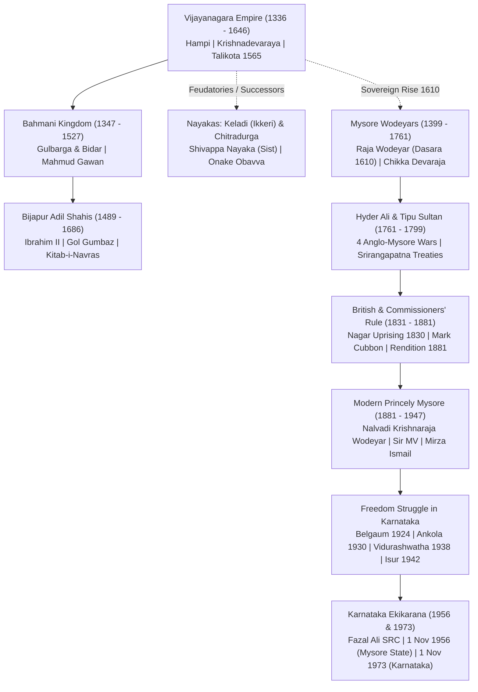
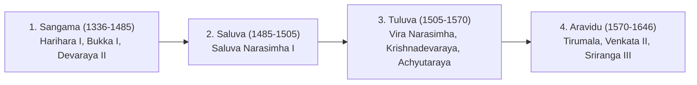
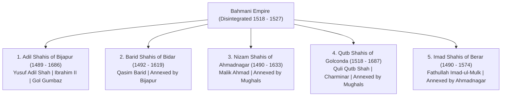
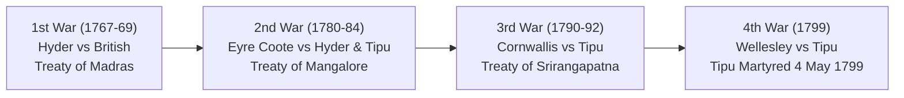
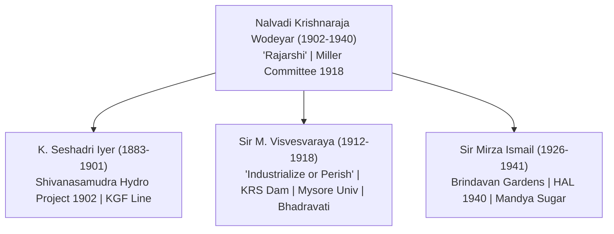
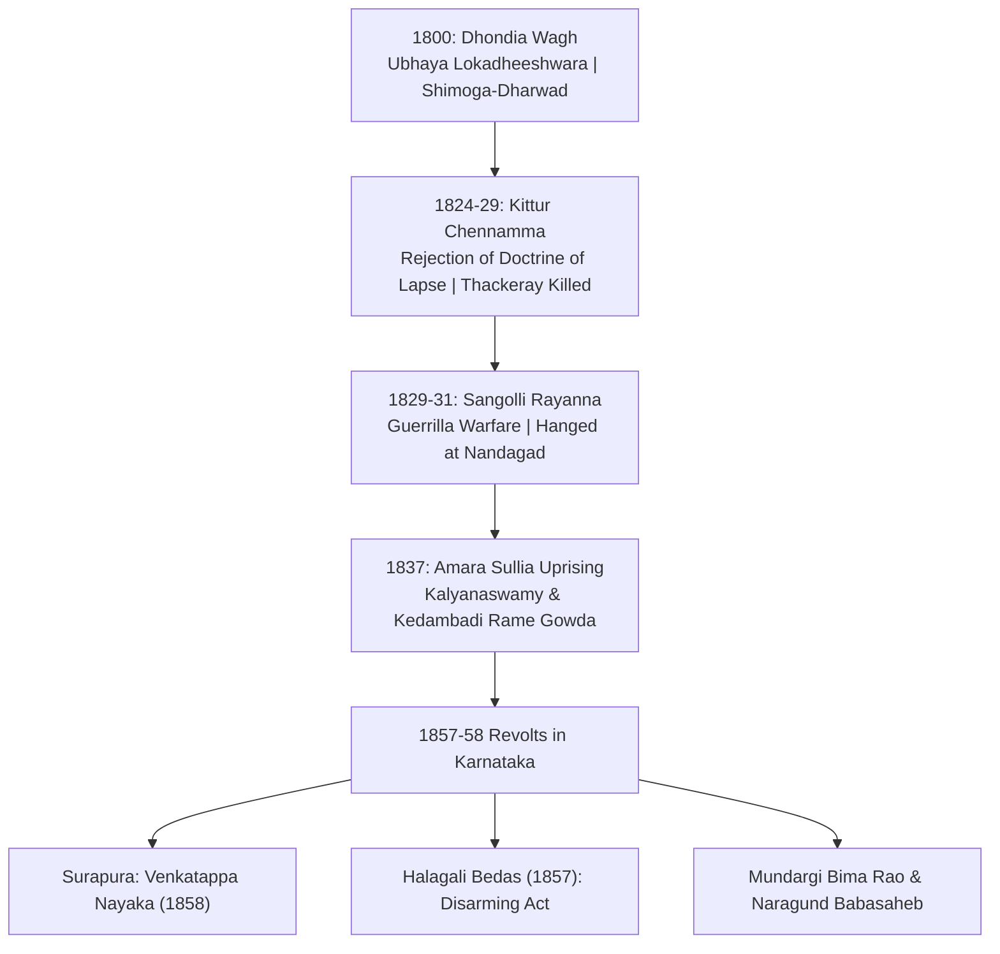
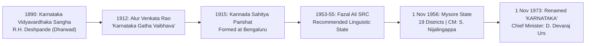

# 08b. Karnataka History Deep Dive: Vijayanagara to Modern Era & Ekikarana (ಮಧ್ಯಕಾಲೀನ & ಆಧುನಿಕ ಕರ್ನಾಟಕ ಇತಿಹಾಸ)

> [!IMPORTANT] Exam Focus & Mark Potential
> - **Expected Weightage:** **10–14 Questions** in Paper-I out of the total History section.
> - **Top Scoring Focal Points:**
>   1. **Vijayanagara Empire:** Sangama, Saluva, Tuluva, Aravidu; Krishnadevaraya's administrative & literary achievements; Battle of Rakkasa-Tangadi (23 Jan 1565); foreign travellers (Conti, Abdur Razzak, Barbosa, Paes, Nuniz).
>   2. **Bahmanis & Bijapur Adil Shahis:** Mahmud Gawan's Bidar Madrasa (1472); Ibrahim Adil Shah II (*Kitab-i-Navras*); Mohammed Adil Shah's Gol Gumbaz (whispering gallery).
>   3. **Keladi & Chitradurga Nayakas:** Shivappa Nayaka's *Sist*; Rani Chennamma resisting Aurangzeb; Chitradurga's Madakari Nayaka V & Onake Obavva.
>   4. **Wodeyars & Mysore Kingdom:** Raja Wodeyar (Dasara 1610); Chikka Devaraja (Athara Kacheri 1689); 4 Anglo-Mysore Wars & Treaties; Nalvadi Krishnaraja Wodeyar (*Rajarshi*) & visionary Diwans (Sir MV, Mirza Ismail).
>   5. **Armed Resistance & Freedom Movement:** Kittur Chennamma & Sangolli Rayanna (1824–31); Surapura Venkatappa Nayaka & Halagali Bedas (1857); 1924 Belgaum Congress (Gandhi); Ankola Salt Satyagraha; Vidurashwatha (1938); Isur Village revolt (1942); Mysore Chalo (1947).
>   6. **Karnataka Ekikarana:** Alur Venkata Rao (*Karnataka Gatha Vaibhava*); Fazal Ali SRC (1953–55); 1 Nov 1956 (Mysore State, 19 districts); 1 Nov 1973 (Renamed Karnataka by D. Devaraj Urs).

---

## 1. Master Chronological Timeline Matrix (Vijayanagara to Unification)



| Era / Empire | Period | Capitals / Headquarters | Key Personalities | Landmark Impact on Karnataka |
| :--- | :--- | :--- | :--- | :--- |
| **Vijayanagara** | 1336–1646 AD | Anegundi $\to$ Vijayanagara (Hampi) $\to$ Penukonda $\to$ Chandragiri | Harihara I, Bukka I, Devaraya II, Krishnadevaraya | Championed South Indian culture, built monumental Dravidian temples, established global trade network. |
| **Bahmanis & Deccan Sultanates** | 1347–1686 AD | Gulbarga (Ahsanabad) $\to$ Bidar $\to$ Bijapur | Hasan Gangu, Mahmud Gawan, Ibrahim Adil Shah II | Indo-Islamic architecture, Persian learning, Dakhani literature, built Gol Gumbaz and Bidar Madrasa. |
| **Keladi Nayakas** | 1499–1763 AD | Keladi $\to$ Ikkeri $\to$ Bidnur (Nagara) | Shivappa Nayaka, Rani Chennamma | Pioneered systematic land revenue (*Shivappa Nayakana Shist*); sheltered Chhatrapati Rajaram from Aurangzeb. |
| **Chitradurga Nayakas** | 1568–1779 AD | Chitradurga (*Kallina Kote*) | Madakari Nayaka V, Onake Obavva | Built impregnable 7-tiered hill fortress; celebrated for the heroic defense of Onake Obavva (1779). |
| **Early Wodeyars** | 1399–1761 AD | Mysuru $\to$ Srirangapatna | Raja Wodeyar, Kanthirava Narasaraja I, Chikka Devaraja | Founded sovereign kingdom; started Mysuru Dasara (1610); purchased Bengaluru (1687); created *Athara Kacheri*. |
| **Hyder Ali & Tipu Sultan** | 1761–1799 AD | Srirangapatna (Mandya) | Hyder Ali, Tipu Sultan (*Tiger of Mysore*) | Fought 4 Anglo-Mysore Wars; introduced war rockets, modern state enterprises, silk industry, and direct land taxation. |
| **Commissioners' Rule** | 1831–1881 AD | Bengaluru | Mark Cubbon, Lewin Bentham Bowring | Transferred administrative capital to Bengaluru; modernized revenue administration, railways, and judiciary. |
| **Modern Princely Mysore** | 1881–1947 AD | Mysuru / Bengaluru | Nalvadi Krishnaraja Wodeyar, Sir M. Visvesvaraya, Sir Mirza Ismail | Model State of India; launched hydro-electric power, IISc, Mysore University, KRS Dam, and affirmative action. |
| **Freedom Movement** | 1824–1947 AD | Belagavi, Ankola, Vidurashwatha, Isur, Shivapura | Kittur Chennamma, Rayanna, Karnad Sadashiva Rao, Mailara Mahadevappa | Transition from armed anti-colonial uprisings to Gandhian mass satyagrahas and "Mysore Chalo" democracy agitation. |
| **Karnataka Ekikarana** | 1890–1973 AD | Dharwad, Hubballi, Bengaluru, Mysuru | Alur Venkata Rao, S. Nijalingappa, D. Devaraj Urs | Unified Kannada-speaking regions into Mysore State (1 Nov 1956); officially renamed "Karnataka" (1 Nov 1973). |

---

## 2. Vijayanagara Empire (ವಿಜಯನಗರ ಸಾಮ್ರಾಜ್ಯ — 1336–1646 AD)

### 1. Origin and Capitals
- **Founding Date & Auspicious Blessing:** Founded on **18 April 1336** on the southern bank of the **Tungabhadra River** under the spiritual guidance of **Sage Vidyaranya** and his brother **Sayana** (of the Sringeri Sharada Peetham).
- **Founders:** **Harihara I (Hakka)** and **Bukka I**, sons of Sangama.
- **Chronological Sequence of Capitals:**
  1. **Anegundi** (first administrative seat, north of Tungabhadra in Koppal district).
  2. **Vijayanagara / Hampi** (Bellary / Vijayanagara district — capital of maximum glory).
  3. **Penukonda** (Anantapur, AP — shifted by Tirumala after the 1565 Battle of Talikota).
  4. **Chandragiri** (Chittoor, AP).
  5. **Vellore** (Tamil Nadu — final fortified retreat).
- **Emblem (ಲಾಂಛನ):** **Varaha (Wild Boar)** flanked by a dagger and the sun-moon, symbolizing the protection of the land.



### 2. Key Rulers and Titles
- **Harihara I (1336–1356):** Titled *Purva-Pashchima Samudradhishwara* (Lord of the Eastern and Western Seas). Established initial administrative structure.
- **Bukka I (1356–1377):** Titled *Veda Marga Pratistapanacharya* (Establishers of the Vedic path). Sent an official diplomatic mission to Ming China (1374).
- **Devaraya II / Praudha Devaraya (1424–1446):**
  - Greatest monarch of the Sangama dynasty.
  - Titles: **Gajabetekara** (The Elephant Hunter), *Dakshinapathada Chakravarthi*.
  - Enrolled thousands of Muslim cavalrymen and archers to modernize his army, placing a copy of the Quran beside his throne.
  - Persian ambassador **Abdur Razzak** visited his court in 1443.
- **Krishnadevaraya (1509–1529):**
  - Crowned on **Krishna Janmashtami (August 1509)**; greatest ruler of the Tuluva dynasty and all of Vijayanagara.
  - Titles: **Abhinava Bhoja**, **Andhra Bhoja**, **Mooru Rayara Ganda** (King of Three Kings), **Yavanarajya Pratistapanacharya** (Restorer of the Yavana Kingdom — after restoring the Bahmani prince at Bidar).
  - Prime Minister / Mentor: **Timmarusu** (affectionately called *Appaji*).
- **Aliya Rama Raya (Regent 1542–1565):** Son-in-law of Krishnadevaraya; wielded de facto power during the reign of puppet ruler Sadashiva Raya; adopted divisive diplomatic tactics between the Deccan Sultanates that backfired disastrously.

### 3. Battles and Treaties
- **Udayagiri & Kondavidu Campaigns (1513–1515):** Krishnadevaraya defeated Gajapati Prataparudra Deva of Odisha; married Gajapati's daughter Princess Jaganmohini (Tukkadevi).
- **Battle of Raichur (19 May 1520):** Krishnadevaraya decisively defeated Sultan **Ismail Adil Shah of Bijapur**, securing the fertile **Raichur Doab** between the Krishna and Tungabhadra rivers. Portuguese mercenary musketeers aided Krishnadevaraya.
- **Battle of Rakkasa-Tangadi / Talikota (23 January 1565):**
  - **Opponents:** Combined confederacy of four Deccan Sultanates (**Bijapur, Golconda, Ahmadnagar, Bidar**; Berar did not participate) vs Vijayanagara.
  - **Decisive Event:** 96-year-old **Aliya Rama Raya** commanded the center. The battle was decided when two prominent Muslim commanders (the Gilani brothers) defected with thousands of troops. Rama Raya was captured and beheaded by Husain Nizam Shah I of Ahmadnagar.
  - **Aftermath:** The imperial capital Hampi was plundered, burned, and ruined over six months. Rama Raya's brother **Tirumala Raya** retreated to Penukonda with the royal treasury and puppet king Sadashiva Raya, founding the Aravidu dynasty.

### 4. Administration and Taxation
- **Central Structure:** Monarchical; *Yuvaraja* associated with governance. Royal Council (*Mantri Parishad*) advised the king.
- **Divisions:** Empire $\to$ **Rajya / Mandala** (governed by *Mandaleshwara*) $\to$ **Nadu / Vishaya** $\to$ **Sthala** $\to$ **Grama** (village, the lowest tier).
- **Village Functionaries (Ayagar System / ಆಯಗಾರ ಪದ್ಧತಿ):**
  - A body of **12 village officials / craftsmen** (Gowda, Shanbhoga, Talavara, Kammar, Badagi, Agasa, etc.) administered the village.
  - Their offices were **hereditary**, and they were compensated with tax-free land plots called **Manya**.
- **Military Administration & Nayankara System (ನಾಯಂಕರ ಪದ್ಧತಿ):**
  - Provincial governors/military generals (*Nayakas* or *Palegars*) were granted territories called **Amaram**.
  - In return, they maintained a fixed contingent of infantry, cavalry, and war elephants for the emperor and remitted half of their local revenues to the central imperial treasury.
- **Key Central Departments:**
  - **Athavana (ಅಠವಣ):** Department of Revenue and Land Tax.
  - **Kandachara (ಕಂದಾಚಾರ):** Department of Military and Defense, headed by the *Dandanayaka* / *Senadhipathi*.
- **Taxation (*Sist*):** Land assessment was based on detailed soil surveys and crop yields. Standard tax was **one-sixth (1/6th) to one-fourth (1/4th)** of produce.
- **Coinage (ನಾಣ್ಯ ಪದ್ಧತಿ):**
  - **Varaha (ಗದ್ಯಾಣ / ಪಗೋಡ):** Standard high-value gold coin featuring emblems of Varaha, Gandabherunda, or Venkateshwara.
  - **Pratapa / Kati:** Fractional gold coins.
  - **Tara:** Silver coin.
  - **Jital / Kasu:** Copper coins for everyday market transactions.

### 5. Literature and Royal Patronage
- **Krishnadevaraya's Court (*Bhuvana Vijayam*):**
  - Patronized the **Ashtadiggajas** (Eight celebrated Telugu court poets):
    1. **Allasani Peddana** (*Andhra Kavita Pitamaha* — authored *Manucharitam*).
    2. **Nandi Thimmana** (authored *Parijatapaharanam*).
    3. **Tenali Ramakrishna** (court jester-scholar — authored *Panduranga Mahatmyam*).
    4. Dhurjati, Madayyagari Mallana, Ayyalaraju Ramabhadrudu, Pingali Surana, Ramarajabhushana.
- **Literary Works of Krishnadevaraya:**
  - ***Amuktamalyada*** (Telugu masterpiece detailing the life of Andal / Goda Devi and principles of *Raja Niti* / statecraft).
  - ***Jambavati Kalyanam*** (Sanskrit drama).
  - ***Usha Parinayam*** (Sanskrit work).
- **Other Landmark Works:**
  - ***Madhura Vijayam* (*Kamparaya Charitam*):** Sanskrit historical epic composed by **Gangadevi**, wife of Prince Kumara Kampana, recounting his conquest of the Madurai Sultanate.
  - ***Chikkadevaraya Binnapam*** and Vachanas continued in the vernacular.
  - **Kumaravyasa (Naranappa of Koliwada, Gadag):** Wrote ***Karnataka Bharata Katha Manjari*** (popularly *Gadugina Bharata* in *Bhamini Shatpadi* meter), composed before the presiding deity Veera Narayana at Gadag during the Sangama era.
  - **Chamarasa:** Composed ***Prabhulinga Leele*** (biography of Allama Prabhu in *Bhamini Shatpadi*) under Devaraya II.
  - **Haridasa Bhakti Movement:**
    - **Purandara Dasa (1484–1564):** *Karnataka Sangeetha Pitamaha* (Father of Carnatic Classical Music); disciple of Vyasathirtha.
    - **Kanakadasa (1509–1609):** Authored *Mohana Tarangini*, *Nalacharitre*, *Haribhaktisara*, and *Ramadhanya Charitre*; Kanakana Kindi at Udupi.
    - **Vyasathirtha:** Rajaguru of Krishnadevaraya; head of the Vyasaraja Matha.

### 6. Architecture and Art
- **Distinctive Style:** Dravidian-Vijayanagara fusion characterized by monumental enclosures, massive granite masonry, and exuberant carvings.
- **Architectural Hallmarks:**
  - **Raya Gopurams:** Soaring entrance gateway towers added to older temples throughout South India (Hampi, Kanchipuram, Tirupati, Srisailam, Chidambaram).
  - **Kalyana Mantapa:** Elaborately sculpted marriage halls with ornate pillars featuring rearing mythical beasts (**Yalis**) and mounted horsemen.
  - **Musical Pillars:** Pillars that emit distinct swaras/musical tones when struck (prominent in the Vijaya Vitthala temple).
- **Key Monuments at Hampi (UNESCO World Heritage Site inscribed in 1986):**
  - **Vijaya Vitthala Temple Complex:** Famous monolithic **Stone Chariot (ಕಲ್ಲಿನ ರಥ)** dedicated to Garuda (featured on the Indian ₹50 currency note), 56 musical pillars (*Sapthaswara pillars*).
  - **Virupaksha (Pampapathi) Temple:** The oldest functioning temple; 50-meter eastern gopuram built by Krishnadevaraya in 1509–10.
  - **Hazara Rama Temple:** Private royal family chapel; exterior walls carved with continuous narrative bas-reliefs of the entire *Ramayana*.
  - **Mahanavami Dibba (Dasara Dibba):** 12-meter high multi-tiered stone platform from which monarchs witnessed the Navaratri / Mahanavami festivities and military parades.
  - **Ugra Narasimha (Lakshmi Narasimha):** 6.7-meter monolithic statue carved in 1528 by Krishnabhatta.
  - **Badavilinga:** 3-meter monolithic Shiva linga standing in water.
  - **Lotus Mahal (Kamal Mahal) & Elephant Stables:** Secular Indo-Islamic hybrid structures inside the Royal Enclosure.

### 7. Foreign Travellers Matrix

| Traveller | Nationality | Year of Visit | Vijayanagara Monarch | Key Observations & Chronicled Details |
| :--- | :--- | :--- | :--- | :--- |
| **Ibn Battuta** | Moroccan | 1342 AD | Harihara I | Chronicled the initial founding of the empire and early geography of Coastal Karnataka (Honnavar). |
| **Nicolo de Conti** | Italian | 1420 AD | Devaraya I | Estimated city circumference at 60 miles; described the grandeur of Navaratri and Deepavali festivals. |
| **Abdur Razzak** | Persian (Ambassador of Timurid Shahrukh) | 1443 AD | Devaraya II (Praudha Devaraya) | Recorded: *"The eye has not seen, nor ear heard of any place to equal Vijayanagara on the whole earth."* Noted the city had **7 concentric rings of defensive walls**. |
| **Afanasy Nikitin** | Russian | 1470–1474 AD | Virupaksha Raya II | Visited the Deccan (Bahmani & Vijayanagara borders); described stark contrasts between royal luxury and rural peasant poverty. |
| **Duarte Barbosa** | Portuguese | 1514–1516 AD | Krishnadevaraya | Described extensive inland trade, horse trade from Arabian Gulf, religious freedom, and diamond markets. |
| **Domingo Paes** | Portuguese | 1520–1522 AD | Krishnadevaraya | Provided the most detailed eye-witness account of Krishnadevaraya's physical appearance (*"of medium height, fair complexion, cheerful, given to sports, subject to sudden fits of rage"*), Mahanavami festival, and city markets. |
| **Fernao Nuniz** | Portuguese horse trader | 1535–1537 AD | Achyutaraya | Detailed the complete history of Vijayanagara from its origin; described the Nayankara system, women bodyguards, wrestling, and royal court ceremonies. |
| **Caesar Frederick** | Italian | 1567 AD | Tirumala Raya (post-Talikota) | Visited Hampi two years after the 1565 battle; described Hampi as a completely desolated, ruined, and looted ghost city inhabited only by wild tigers and beasts. |

### 8. Decline and Successors
- Following the disaster of Talikota (1565), the **Aravidu Dynasty** under Tirumala, Sriranga I, and Venkata II operated from Penukonda and Chandragiri.
- The empire disintegrated into autonomous feudatory Nayakdoms (Keladi, Chitradurga, Madurai, Thanjavur, Gingee, and Mysore Wodeyars).
- The final titular ruler, **Sriranga III (1642–1646)**, was defeated by the combined armies of Bijapur and Golconda, terminating the empire.

### 9. Exam Traps & High-Yield Pitfalls
> [!CAUTION] Critical Exam Traps
> - **The True Battle Name:** The famous 1565 clash was fought between the two villages of **Rakkasagi and Tangadagi** (in present-day Vijayapura/Muddebihal taluk), over 30 miles away from Talikota. KEA papers frequently ask for both names: **Battle of Rakkasa-Tangadi** = Battle of Talikota = Battle of Bannihatti.
> - **Who Didn't Fight?** Among the five Deccan Sultanates, **Berar (Imad Shahi)** did NOT participate in the confederacy against Vijayanagara due to mutual rivalry with Ahmadnagar.
> - **Currency on ₹50 Note:** The **Hampi Stone Chariot** is featured on the reverse of the new **₹50 Indian banknote**. Note that it is technically a shrine dedicated to **Garuda**, situated in front of the Vijaya Vitthala temple.
> - **Ashtadiggajas vs Navaratnas:** Ashtadiggajas belonged to Krishnadevaraya's court (Telugu). Navaratnas belonged to Chandragupta II Vikramaditya and Mughal Emperor Akbar.

---

## 3. Bahmani Kingdom & Deccan Sultanates (1347–1686 AD)

### 1. Origin and Capitals
- **Founding Date:** **3 August 1347**; first independent Muslim kingdom in South India.
- **Founder:** **Alauddin Hasan Gangu Bahman Shah** (original name: Zafar Khan; claimed descent from legendary Persian king Bahman).
- **Capitals:**
  1. **Ahsanabad / Gulbarga (1347–1424 AD):** Capital established by Hasan Gangu.
  2. **Muhammadabad / Bidar (1424–1527 AD):** Capital shifted by **Ahmad Shah Wali** due to Bidar's healthier climate, strategic elevation, and defensive terrain.

### 2. Key Personalities
- **Firuz Shah Bahmani (1397–1422):** Cultured linguist; built the astronomical observatory at Daulatabad; married the daughter of Vijayanagara King Devaraya I after the Treaty of 1407. Built the township of **Firozabad** on the Bhima River.
- **Ahmad Shah Wali (1422–1436):** Shifted capital to Bidar; built the magnificent Bidar Fort and Solah Khamba Mosque.
- **Mahmud Gawan (Prime Minister / Khwaja Jahan, 1461–1481):**
  - Iranian-born merchant who became the chief minister during the minority of Muhammad Shah III.
  - Divided the empire into **8 provinces (Tarafs)** to curb the overweening power of provincial governors (*Tarafdars*).
  - Built the world-renowned **Mahmud Gawan Madrasa at Bidar (1472 AD)**: A 3-storey Islamic university with lecture halls, library of 3,000 rare manuscripts, minarets decorated with yellow, green, and blue Persian faience tiles.
  - **Tragic End:** Factional feud between native Deccan Muslims (*Deccanis*) and foreign immigrants (*Afaqis / Pardesis*). Rival nobles forged a treasonous letter; drunk Sultan Muhammad Shah III ordered Gawan's execution on **5 April 1481**. Gawan's death sealed the fate of the Bahmani Empire.



### 3. Adil Shahis of Bijapur (ವಿಜಯಪುರದ ಆದಿಲ್ ಶಾಹಿಗಳು — 1489–1686 AD)
- **Founder:** **Yusuf Adil Shah** (1489), governor of Bijapur who declared independence.
- **Ibrahim Adil Shah II (1580–1627) — Deep Dive:**
  - Known as **Jagadguru Badshah** (World Teacher) and **Abla Baba** (Friend of the Poor) for his deep secularism and patronage of Hindu musicians and poets.
  - Authored ***Kitab-i-Navras*** (Book of Nine Rasas) in Dakhani Urdu / musical verse, opening with invocations to Hindu deities **Saraswati** and **Ganesha** alongside Prophet Muhammad and Hazrat Gesudaraz.
  - Built the new township of **Navraspur** (near Vijayapura) in 1599.
  - Commissioned the **Ibrahim Rauza** at Vijayapura (known as the *"Taj Mahal of the Deccan"*, designed by architect Malik Sandal; inspired the layout of Agra's Taj Mahal).
- **Mohammed Adil Shah (1627–1656) and Gol Gumbaz:**
  - Built the **Gol Gumbaz (ಗೋಲ ಗುಮ್ಮಟ)** at Vijayapura as his mausoleum.
  - **Architect:** **Yaqut of Dabul**.
  - **Acoustic Marvel (Whispering Gallery):** The world's second-largest dome constructed without central pillar supports (diameter 44 meters). Any sound uttered at one side of the circular gallery echoes **7 to 11 times** and can be heard clearly across a span of 38 meters.
- **Ali Adil Shah I (1557–1580):** Built the **Jamia Masjid of Bijapur** and the city's 10-km stone fortification wall with 96 bastions. Installed the massive **Malik-e-Maidan** (Lord of the Battlefield) bronze cannon on the Burj-e-Sherz bastion (cast at Ahmadnagar by Muhammad bin Husain Rumi).
- **Fall of Bijapur:** Mughal Emperor **Aurangzeb** personally besieged Vijayapura for 15 months, forcing the surrender of the last Sultan, **Sikandar Adil Shah**, on **12 September 1686**.

---

## 4. Nayakas of Keladi & Chitradurga

### Keladi (Ikkeri) Nayakas (ಕೇಳದಿ ನಾಯಕರು — 1499–1763 AD)
- **Capitals:** **Keladi** $\to$ **Ikkeri** (both in Sagar taluk, Shimoga) $\to$ **Bidnur / Bidanur (Nagara)** in Hosanagara taluk.
- **Founder:** **Chaudappa Nayaka** (1499); recognized as feudatory governor by Vijayanagara.
- **Sadashiva Nayaka:** Granted royal title and royal insignia (*Varaha*) by Ramaraya for loyal military service.
- **Shivappa Nayaka (1645–1660) — Outstanding Ruler:**
  - Liberated the coastal ports of Mangaluru, Honnavar, and Kundapura from Portuguese dominion.
  - Built strong coastal defense forts including **Bekal Fort** (Kasaragod) and **Chandragiri Fort**.
  - **Shivappa Nayakana Shist (ಶಿವಪ್ಪ ನಾಯಕನ ಶಿಸ್ತು):** Landmark scientific land classification and revenue system. Classified agricultural land into 5 categories based on fertility, water source, and yield: *Uttama* (best), *Madhyama* (medium), *Kanishta* (low), *Adhama* (poor), and *Anyaya* (waste). Fixed standard state tax at **1/3rd (one-third) of gross yield**, eliminating middleman exploitation.
- **Rani Chennamma of Keladi (1671–1696) — Brave Queen:**
  - Heroically granted political asylum and protection to **Chhatrapati Rajaram** (son of Shivaji Maharaj) who was fleeing pursuit by Mughal Emperor Aurangzeb's armies.
  - Fought off the invading Mughal forces under Azam Tara in the dense jungles of the Western Ghats; forced Aurangzeb to sign a treaty of non-aggression.
- **Fall:** Annexed by **Hyder Ali** in **1763 AD**; Bidnur was captured and renamed *Hydernagar*.

### Chitradurga Nayakas (ಚಿತ್ರದುರ್ಗದ ಪಾಳೆಯಗಾರರು — 1568–1779 AD)
- **Capitals:** Chitradurga (*Kallina Kote* — Fort of Stone).
- **Fort Structure:** Built a celebrated hill citadel with **Yelu Suttina Kote (Seven-tiered concentric wall fortress)** with hidden waterways (*Tanniru Doni*), oil grinders, and granaries.
- **Founder:** **Timmanna Nayaka** (appointed governor by Saluva Narasimha).
- **Madakari Nayaka V (1754–1779):** The last and most famous Palegar of Chitradurga. Fought valiantly against Hyder Ali during multiple sieges.
- **Legend of Onake Obavva (ಒನಕೆ ಓಬವ್ವ — 1779):**
  - Wife of fortress guard **Kahale Mudda Hanuma**.
  - When Hyder Ali's soldiers attempted to infiltrate the fort through a narrow secret crevice (*Kindi* / *Tanniru Doni*), Obavva spotted them while fetching water.
  - Armed only with a heavy wooden rice pestle (**Onake**), she silently bludgeoned every entering enemy soldier on the head and dragged them aside, killing scores of soldiers before being spotted and slain.
  - The secret crevice is immortalized today as **"Obavvana Kindi"** (ಒಬವ್ವನ ಕಿಂಡಿ) inside the Chitradurga Fort.

---

## 5. Early Wodeyars of Mysuru (1399–1761 AD)

### 1. Origin and Capitals
- **Founders:** Two brothers, **Yaduraya (Vijaya)** and **Krishnaraya**, who arrived from Dwaraka (Gujarat), defeated Mara Nayaka of Hadinadu (Mysuru), and established the dynasty in **1399 AD**.
- **Initial Capital:** Mysuru (Mahishuru).
- **Royal Emblem:** **Gandabherunda (ಗಂಡಭೇರುಂಡ)** — a mythical two-headed giant eagle holding elephants in its talons and beak.

### 2. Landmark Monarchs
- **Raja Wodeyar (1578–1617):**
  - Acquired the historic island fortress of **Srirangapatna** in **1610 AD** from the Vijayanagara viceroy Sri Ranga Raya (Tirumala).
  - Shifted the royal capital from Mysuru to **Srirangapatna**.
  - Inaugurated the world-renowned **Mysuru Dasara Festival in 1610** at Srirangapatna on the lines of the Vijayanagara Mahanavami tradition.
- **Kanthirava Narasaraja Wodeyar I (1638–1659):**
  - First Wodeyar monarch to exercise absolute independent sovereign power.
  - Successfully defended Srirangapatna against the invading armies of the Bijapur Sultanate under Ranadulla Khan.
  - First to issue independent coinage: **Kanthirayi Hana** (gold fanams).
  - Constructed the Narasimha temple at Srirangapatna.
- **Chikka Devaraja Wodeyar (1673–1704) — The Great Administrator:**
  - Titled **Navakotinarayana** (Lord of Nine Crores) for accumulating 9 crore gold varahas in the state treasury.
  - Purchased the town and fort of **Bengaluru** from Mughal general Qasim Khan in **1687 / 1689** for a sum of **3 lakh pagodas / rupees**.
  - Constructed the Bangalore Fort and the historic **Kote Venkataramana Temple** at Bengaluru.
  - Reorganized central state administration into **18 distinct ministerial departments** designated as **Athara Kacheri (ಅಠಾರ ಕಛೇರಿ)**.
  - Built the Chikka Devaraja Sagara canal across the Cauvery.
  - Court poets: **Tirumalarya** (wrote *Chikkadevaraja Vijaya*), poetess **Helavanakatte Giriyamma**, and Singararya (wrote *Mitravinda Govinda*, earliest surviving Kannada play).

---

## 6. Hyder Ali & Tipu Sultan: The 4 Anglo-Mysore Wars (1761–1799)



### Hyder Ali (1721–1782)
- Rose from an ordinary horseman (*Naik*) to **Faujdar of Dindigul (1755)**; established a modern artillery arsenal with French assistance.
- Usurped de facto executive control of Mysore Kingdom in **1761**, sidelining the puppet King Krishnaraja Wodeyar II and Diwan Khande Rao. Styled himself **Sarvadhikari** / *Nawab*.
- Conquered Bednur (1763), Sunda, and coastal Malabar.

### Tipu Sultan — "Tiger of Mysore" (1750–1799)
- **Military Innovations:**
  - Modernized the Mysore infantry on European lines; established specialized rocket corps (*Kushoon*).
  - Deployed iron-cased **Mysorean War Rockets (ಬಾಣಗಳು)** containing combustible black powder against British forces at Pollilur (1780), regarded as the world's first successful military rocket artillery (preserved in the Royal Artillery Museum, Woolwich, UK).
- **Diplomacy & Modern Outlook:**
  - Sent official diplomatic embassies to **France (King Louis XVI)**, **Ottoman Empire (Istanbul)**, and **Afghanistan (Zaman Shah)**.
  - Founded the **Jacobin Club** of Mysore at Srirangapatna in 1797; planted the **Tree of Liberty**; styled himself *Citizen Tipu*.
- **Economic & Administrative Modernization:**
  - Introduced the **silk/sericulture industry** to Karnataka by importing silkworm eggs and mulberry cuttings from Bengal and China.
  - Created state trading monopolies; established 30 state factories; founded commercial trading stations at Muscat, Jeddah, and Ormuz.
  - Reformed state calendar: Introduced the **Mauludi calendar** (solar-lunar reckoning starting from the birth of Prophet Muhammad).
  - Introduced new coinage system named after Islamic saints and astronomical bodies (gold *Ahmadi*, silver *Rupiya*, copper *Paisa*).
  - Built **Dariya Daulat Bagh** (Summer Palace) at Srirangapatna decorated with vibrant Indo-Islamic wall murals of the Battle of Pollilur.
  - Expanded **Lalbagh Botanical Gardens** at Bengaluru (originally laid out by Hyder Ali in 1760).

### The Four Anglo-Mysore Wars: Master Matrix Table

| War & Period | Mysore Leader | British Commander / Governor-General | Major Battles | Concluding Treaty & Terms |
| :--- | :--- | :--- | :--- | :--- |
| **First Anglo-Mysore War**<br/>(1767–1769 AD) | **Hyder Ali** | Col. Joseph Smith / Harry Verelst | Battle of Changama, Battle of Tiruvannamalai (1767) | **Treaty of Madras (4 April 1769):**<br/>Hyder dictated terms right outside Madras fort. Mutual restitution of captured territories and a defensive military alliance (British promised to help Hyder if attacked by third parties). |
| **Second Anglo-Mysore War**<br/>(1780–1784 AD) | **Hyder Ali** & **Tipu Sultan** | Sir Eyre Coote / Warren Hastings | **Battle of Pollilur (1780):** British army under Col. Baillie routed.<br/>**Battle of Porto Novo (1781):** Eyre Coote defeated Hyder.<br/>*Hyder died of cancer on 7 Dec 1782 near Chittoor.* | **Treaty of Mangalore (11 March 1784):**<br/>Signed by Tipu Sultan and Lord Macartney. Mutual restoration of captured lands and release of prisoners of war. *Last treaty where an Indian ruler dictated terms to the British.* |
| **Third Anglo-Mysore War**<br/>(1790–1792 AD) | **Tipu Sultan** | **Lord Cornwallis** (Triple Alliance: British + Marathas + Nizam) | Battle of Arakere (1791); Siege of Bangalore Fort (March 1791); Siege of Srirangapatna (1792). | **Treaty of Srirangapatna (March 1792):**<br/>Tipu ceded **half (50%) of his kingdom** (Malabar to British, Tungabhadra region to Marathas, Krishna-Pennar to Nizam). Paid war indemnity of **3.3 crore rupees** and surrendered **two young sons (Abdul Khaliq & Muiz-ud-din) as hostages** to Cornwallis. |
| **Fourth Anglo-Mysore War**<br/>(1799 AD) | **Tipu Sultan** | **Lord Wellesley** (Richard Wellesley) & General George Harris | Battle of Malavalli (March 1799); Siege and storming of Srirangapatna (April–May 1799). | **No Treaty (Decisive Annexation):**<br/>Tipu Sultan fell fighting heroically at the **Water Gate** of Srirangapatna on **4 May 1799** (*"Better to live one day as a tiger than a thousand years as a sheep"*). Mysore partitioned; core restored to Wodeyars. |

---

## 7. British Rule, Commissioners' Rule & Rendition (1799–1881 AD)

### Post-1799 Settlement & Regency of Purnaiah
- After Tipu's fall in 1799, Lord Wellesley restored the truncated Mysore Kingdom to 5-year-old **Krishnaraja Wodeyar III (Mummadi Krishnaraja Wodeyar)**.
- Imposed the **Subsidiary Alliance** on Mysore (annual tribute of 7 lakh pagodas).
- **Diwan Purnaiah (1799–1810):** Served as first Diwan and Regent during the Maharaja's minority. Constructed the 48-km **Purnaiah Canal** from the Lakshmanathirtha River to Mysuru city; accumulated a surplus treasury of over 2 crore rupees.

### The Nagar Peasant Uprising (1830–1831)
- **Causes:** Severe agrarian distress, extortionate tax-farming (*Guttige*), corrupt revenue officials, and famine in the Malnad region.
- **Leaders:** **Budi Basappa** (who claimed to be the rightful successor to the Keladi throne) and **Sardar Malla**.
- British troops assisted the Mysore state in brutally suppressing the insurrection.
- **Consequence:** Governor-General **Lord William Bentinck** used the insurrection as an excuse to declare the administration incompetent, deposing Krishnaraja Wodeyar III and placing Mysore under direct **British Commissioners' Rule in October 1831**.

### Commissioners' Rule (1831–1881 AD)
- Mysore was administered directly by British Chief Commissioners operating from Bengaluru for **50 years**.
- **Sir Mark Cubbon (Chief Commissioner 1834–1861 — 27 Years):**
  - Transferred the administrative headquarters of Mysore State from **Mysuru to Bengaluru in 1834**.
  - Reorganized administrative departments on modern British lines; constructed thousands of miles of trunk roads and bridges.
  - Introduced the first railway line in Mysore: **Jolarpettai to Bangalore Cantonment (opened 1 August 1864)**.
  - Constructed the magnificent red stone neoclassical public office building **Attara Kacheri (1864–1868)** at Bengaluru (present-day **High Court of Karnataka**).
  - Cubbon Park at Bengaluru was named in his memory.
- **Lewin Bentham Bowring (Chief Commissioner 1862–1870):**
  - Introduced systematic cadastral land revenue surveys and settlement.
  - Reorganized administrative hierarchy into 8 districts under Deputy Commissioners (*DC*).
  - Built the Bowring Institute and Bowring Hospital at Bengaluru.

### The Rendition of Mysore (1881 AD — ಮೈಸೂರು ಪುನರ್ ಸ್ಥಾಪನೆ)
- On **25 March 1881**, British Viceroy **Lord Ripon** officially retroceded and restored sovereign administrative powers of Mysore back to the royal house.
- **Chamaraja Wodeyar X** was installed on the throne.
- British kept Bangalore Cantonment (*Civil and Military Station*) under their direct jurisdiction until 1947.
- **C. Rangacharlu** was appointed the **first Diwan of Mysore under the Rendition**.

---

## 8. Modern Princely Mysuru & Progressive Diwans (1881–1947 AD)

Mysore earned the distinction of being recognized across the subcontinent as the **"Model State" (ಮಾದರಿ ಮೈಸೂರು)** and a pioneer in democratic institutions and industrial development.

### 1. The Democratic Landmark: Mysore Representative Assembly (1881)
- Established on **25 August 1881** by Maharaja Chamaraja Wodeyar X and Diwan C. Rangacharlu.
- **Historical Significance:** **First legislative representative assembly in the entire Indian subcontinent**, providing elected public representatives an official platform to question government policies 4 years before the Indian National Congress was founded.
- Upgraded to a bicameral legislature with the establishment of the **Mysore Legislative Council (ವಿಧಾನ ಪರಿಷತ್) in 1907**.

### 2. Nalvadi Krishnaraja Wodeyar (Krishna Raja Wadiyar IV — 1902–1940)
- Ascended throne in 1902 upon attaining majority (Maharani Regent Kempananjammanni / Vani Vilasa ruled 1894–1902).
- Revered as **"Rajarshi" (Saintly King)** by Mahatma Gandhi.
- **Social Justice & Affirmative Action (Miller Committee 1918):**
  - Appointed the landmark **Sir Leslie Miller Committee in 1918** to investigate backward community representation in government service.
  - In **1921**, based on Miller's report, Mysore became the **first government in India to implement official caste-based reservations / affirmative action** for backward classes in state administration and education.
- **Educational Milestones:**
  - Made primary education free and compulsory (Elementary Education Act 1913).
  - Founded the **University of Mysore (27 July 1916)** — the **first university in an Indian princely state** and the sixth in India.
  - Granted 371 acres of prime land and funds to establish the **Indian Institute of Science (IISc, Bengaluru)** in **1909** following the vision of Jamsetji Tata and Swami Vivekananda.
  - Founded the **Kannada Sahitya Parishat (1915)** at Bengaluru under the presidency of H.V. Nanjundaiah.
- **Infrastructure & Industrial Titans:**
  - **Shivanasamudra Hydro-electric Project (1902):** Built on the Cauvery River under Diwan K. Seshadri Iyer. **First major hydroelectric generating station in India and Asia**. Power was transmitted over 147 km via high-voltage lines to illuminate the **Kolar Gold Fields (KGF)** in 1902 and **Bengaluru city in 1905** (making Bengaluru the **first electrified city in India**).
  - **Krishnarajasagara (KRS) Dam (1911–1932):** Constructed across the Cauvery River at Kannambadi (Mandya district) under the chief engineer and later Diwan **Sir M. Visvesvaraya**. Created irrigation for lakhs of acres in the dry Mandya basin and powered Mysuru and Bengaluru.
  - **Vani Vilasa Sagara Dam (Marikanive Dam, 1898–1907):** Constructed across the Vedavathi River at Hiriyur (Chitradurga district) by chief engineer M.C. Hutchins — **oldest modern masonry dam in Karnataka**.



### 3. Celebrated Diwans of Mysuru: Master Reference Table

| Diwan | Tenure | Monarch | Landmark Contributions & Historical Milestones |
| :--- | :--- | :--- | :--- |
| **C. Rangacharlu** | 1881–1883 | Chamaraja Wodeyar X | First Diwan after Rendition; inaugurated the **Mysore Representative Assembly (1881)**; built Bengaluru-Mysuru railway line. |
| **Sir K. Seshadri Iyer** | 1883–1901 | Chamaraja Wodeyar X / Regency | **Longest serving Diwan (18 years)**; created the **Shivanasamudra Hydro-Electric Project (1902)**; laid drinking water pipeline from Hesaraghatta lake to Bengaluru; established KGF mining leases. |
| **P.N. Krishnamurti** | 1901–1906 | Nalvadi Krishnaraja Wodeyar | Electrified Bengaluru streets (5 August 1905); restructured police administration. |
| **V.P. Madhava Rao** | 1906–1909 | Nalvadi Krishnaraja Wodeyar | Formed the **Mysore Legislative Council (1907)**; established the Department of Agriculture; abolished the tax on arecanut. |
| **T. Ananda Rao** | 1909–1912 | Nalvadi Krishnaraja Wodeyar | Commenced construction work on the KRS Dam and Shimsha hydro project; established the Mysore Economic Conference. |
| **Sir M. Visvesvaraya**<br/>(Sir MV) | 1912–1918 | Nalvadi Krishnaraja Wodeyar | Celebrated engineer-statesman; motto: *"Industrialize or Perish"*. Founded **University of Mysore (1916)**, **State Bank of Mysore (1913)**, **Mysore Iron and Steel Works at Bhadravati (VISL 1923)**, **Government Soap Factory (Mysore Sandal Soap 1916)**, Sri Jayachamarajendra Polytechnic, UVCE Bengaluru (1917), and completed the blueprint and early execution of the **KRS Dam**. Awarded **Bharat Ratna in 1955**; his birthday (**15 September**) celebrated as **National Engineers' Day**. |
| **Sir Kantaraj Urs** | 1918–1922 | Nalvadi Krishnaraja Wodeyar | Implemented the **Miller Committee Report (1921)** granting reservations to backward communities; established Mysuru City Improvement Trust Board. |
| **Sir Albion Banerjee** | 1922–1926 | Nalvadi Krishnaraja Wodeyar | Introduced Mysore Civil Service regulations; expanded rural credit cooperatives. |
| **Sir Mirza M. Ismail** | 1926–1941 | Nalvadi Krishnaraja Wodeyar | Long-time friend and master aesthetic modernizer. Built the world-famous **Brindavan Gardens at KRS**; established **Hindustan Aeronautics Limited (HAL, Bengaluru, 1940)** with Walchand Hirachand; **Mysore Paper Mills (MPM) Bhadravati (1937)**; Mysore Lamp Works; Mysore Acetate and Chemical Company; Mandya National Sugar Mills (1933); Glass House expansion at Lalbagh; rural electrification across hundreds of villages. |
| **N. Madhava Rao** | 1941–1946 | Jayachamarajendra Wodeyar | Managed severe food grain procurement during World War II; member of the Indian Constitution Drafting Committee. |
| **Sir A. Ramaswami Mudaliar** | 1946–1949 | Jayachamarajendra Wodeyar | **Last Diwan of Mysore**; negotiated the Instrument of Accession to the Indian Union; witnessed the historic "Mysore Chalo" popular movement. |

---

## 9. Armed Resistance & Early Anti-Colonial Revolts in Karnataka

Before the advent of the Gandhian mass movement, Karnataka was the storm center of fierce armed resistance against the British East India Company.



### 1. Dhondia Wagh (1800 AD)
- Known as the **"Wagh" (Tiger)**; titled himself *Ubhaya Lokadheeshwara* (King of Two Worlds).
- Organized an army of displaced cavalrymen and conquered Bidnur, Shimoga, and parts of Dharwad after Tipu's fall.
- Arthur Wellesley (later Duke of Wellington) hunted him down with a massive force; Dhondia fell fighting at **Konagal** on **10 September 1800**.

### 2. Rani Chennamma of Kittur (1824 AD)
- Kittur is situated in Belagavi district.
- When King Mallasarja and his son Shivalingarudra Sarja died without natural heirs, Chennamma adopted **Shivalingappa**.
- British Political Agent **St. John Thackeray** refused to recognize the adoption under an early version of the **Doctrine of Lapse** and attempted to seize the Kittur treasury.
- **First Battle of Kittur (23 October 1824):** Kittur forces led by **Amatya Gurusiddappa** routed the British; Thackeray was shot dead by Kittur soldier Balappa; two British officers (Stevenson and Elliot) were taken prisoner.
- **Second Battle (December 1824):** Col. Deacon launched a massive assault with reinforcements from Bombay and Madras; traitor Mallappa Shetty poisoned the fort's gunpowder reserves.
- Kittur fell; Rani Chennamma was captured and imprisoned in the **Bailhongal Fort**, where she passed away on **21 February 1829**.

### 3. Sangolli Rayanna (1829–1831 AD)
- Faithful army commander of Kittur from the Kuruba community.
- Continued the freedom fight by launching legendary **guerrilla warfare** against British garrisons, destroying British treasuries at Sampagaon and Bidi.
- Betrayed by treacherous local landlords (Laxmana & Linganagowda) while bathing at a jungle stream near Dori; captured by the British.
- Sentenced to death and hanged publicly from a banyan tree at **Nandagad (Belagavi district)** on **26 January 1831**.
- His close friend **Bichugatti Channabasappa** planted an Ashoka tree on his samadhi, which stands as a pilgrimage site.

### 4. Amara Sullia / Kalyanaswamy Uprising (1837 AD)
- Known as the **Kalyanappana Katakayi** in Kodagu and Dakshina Kannada.
- Led by **Kedambadi Rame Gowda**, **Kalyanaswamy**, and **Guddemane Appayya Gowda** against British land-rent policies and deposition of Kodagu Raja Chikkaveeraradjendra.
- The rebels marched to Mangaluru, broke open the jail, lowered the British Union Jack, and hoisted their victory flag at **Bikarnakatte** for 13 days before British naval reinforcements arrived.

### 5. The 1857 War of Independence in Karnataka
- **Raja Venkatappa Nayaka of Surapura (Shorapur, Yadgir District — 1858):**
  - Young Nayaka ruler who coordinated with Nana Saheb's emissaries and armed Rohilla, Arab, and Beda warriors.
  - Defeated British forces under Col. Hughes; British political agent Meadows Taylor described his tragic bravery. Betrayed at Hyderabad, captured, sentenced to deportation, and reportedly shot himself at Secunderabad.
- **Halagali Bedas' Armed Rebellion (Mudhol Taluk, Bagalkote — November 1857):**
  - The British passed the draconian **Indian Arms Act / Disarming Act of 1857 (ನಿರಾಯುಧ ಕಾಯಿದೆ)**, ordering Indian villagers to surrender their traditional hunting guns and swords.
  - The Bedas of Halagali village flatly refused: *"Our weapons are our honor and our deities; we will never surrender them."*
  - Leaders: **Babaji Nimbalkar, Bala, Rama, and Jadaga**.
  - British troops led by Col. Malcolm surrounded and set Halagali on fire, massacring scores of freedom fighters.
- **Mundargi Bima Rao (Gadag) & Naragund Babasaheb (Bhaskar Rao Bhave):**
  - Joined hands with the Nawab of Savanur and local chieftains.
  - Bhaskar Rao Bhave beheaded British officer Manson and hung his head from the fort gate of Naragund.
  - Mundargi Bima Rao heroically died fighting British forces inside the **Koppal Fort (May 1858)**.

---

## 10. Freedom Movement in Karnataka: Gandhian Era (1920–1947 AD)

### 1. The 1924 Belgaum Congress Session (39th INC Session)
- **Historical Superlative:** The **ONLY session of the Indian National Congress ever presided over by Mahatma Gandhi**.
- Organized by prominent Karnataka leaders **Gangadhar Rao Deshpande** (revered as the *"Lion of Karnataka"*), **Karnad Sadashiva Rao**, and **Govindrao Yalgi**.
- Venue named **Vijayanagar Nagar**.
- **The Anthem:** **Huilgol Narayana Rao** of Gadag composed and personally sang the soul-stirring inaugural Kannada national song:
  > *"ಉದಯವಾಗಲಿ ನಮ್ಮ ಚೆಲುವ ಕನ್ನಡ ನಾಡು..."* (May our beautiful Kannada land arise!)
- Marked the complete integration of Karnataka into mainstream national freedom politics.

### 2. Salt Satyagraha (ಉಪ್ಪು ಸತ್ಯಾಗ್ರಹ — 1930)
- **Ankola (Uttara Kannada):** Known as the **"Bardoli of Karnataka"**.
- On **13 April 1930**, under the leadership of **M.P. Nadakarni**, **K.T. Bhashyam**, and **R.R. Diwakar**, over 40,000 people gathered at the Ankola beachfront to break the salt laws by manufacturing illegal salt.
- Led directly into the fierce **No-Tax Campaign (ಕರನಿರಾಕರಣೆ ಚಳವಳಿ)** in Ankola, Sirsi, and Siddapur taluks, where peasants surrendered their entire properties rather than pay colonial taxes.

### 3. Vidurashwatha Tragedy — "Jallianwala Bagh of Karnataka" (25 April 1938)
- Located at **Vidurashwatha** village (Gauribidanur taluk, Chikkaballapura district).
- Over 10,000 villagers and Congress satyagrahis gathered near the historic sacred Ashwatha tree to hoist the National Tricolor flag as part of the state-wide Dhwaja Satyagraha.
- Without warning or provocation, British police and state forces opened continuous fire into the trapped crowd.
- **Casualties:** Official records admitted 10 dead, but independent national reports recorded **32 to 35 martyrs**.
- Mahatma Gandhi deputed **Sardar Vallabhbhai Patel** and **Acharya J.B. Kripalani** to investigate the massacre; resulted in the Patel-Mirza Pact.

### 4. Shivapura Flag Satyagraha (ಶಿವಪುರ ಧ್ವಜ ಸತ್ಯಾಗ್ರಹ — April 1938)
- Held at **Shivapura** (near Maddur, Mandya district).
- Led by Mysore State Congress President **T. Siddalingaiah**, accompanied by H.K. Veeranna Gowda.
- Defied the colonial ban and hoisted the National Flag in open defiance of the princely Mysore police administration.
- The memorial **Satyagraha Soudha** commemorates this event today at Maddur.

### 5. Quit India Movement (1942) in Karnataka
- **The Republic of Isur (ಈಸೂರು ಗ್ರಾಮ — Shikaripura Taluk, Shivamogga District):**
  - In **September 1942**, the fiery village of Isur declared itself an independent sovereign republic free from British rule.
  - Put up bold notice boards outside the village:
    > *"ಏಸೂರು ಕೊಟ್ಟರೂ ಈಸೂರು ಕೊಡೆವು!"* (You may give many villages, but we won't surrender Isur!)
  - Appointed children as the village *Amildar* (Tahsildar) and Police Inspector.
  - When British police sub-inspector Kenchappa and Revenue Inspector Chennakrishnappa entered the village to suppress the rebellion, violence erupted and both officials were killed by the furious mob.
  - Colonial courts sentenced 5 heroic Isur freedom fighters to death by hanging: **Guroppa, Jinahalli Mallappa, Suryanarayanachari, Badiyappa, and Halappa** (hanged in March 1943).
- **Mailara Mahadevappa (1911–1943):**
  - Born in Motebennur (Haveri district); sole representative from Karnataka to march alongside Mahatma Gandhi during the historic **1930 Dandi March**.
  - During the 1942 Quit India struggle, he formed an underground revolutionary band (*Krantikari Dal*) and was shot dead by police while raiding the government treasury at **Hosaritti** on **1 April 1943**.

### 6. Mysore Chalo Movement (ಮೈಸೂರು ಚಲೋ — September 1947)
- While India gained independence on **15 August 1947**, Maharaja Jayachamarajendra Wodeyar and Diwan Sir A. Ramaswami Mudaliar delayed the establishment of a responsible democratic government in Mysore.
- The Mysore State Congress launched the thunderous mass agitation **"Mysore Chalo"** (March to Mysore) under the presidency of **K.C. Reddy** and **K. Hanumanthaiah**.
- Thousands of agitators marched from Bengaluru and every district towards Mysuru city.
- Yielding to overwhelming public demand, the Maharaja signed the agreement on **24 October 1947**.
- **Kyasamballi Chengalaraya Reddy (K.C. Reddy)** was sworn in as the **first Chief Minister of Mysore State on 25 October 1947**.

---

## 11. Karnataka Ekikarana Movement (ಕರ್ನಾಟಕ ಏಕೀಕರಣ ಚಳವಳಿ)



### 1. Fragmentation Background
- Following the fall of Tipu Sultan (1799) and the Kittur uprising, Kannada-speaking territories were fragmented across **more than 20 administrative jurisdictions**:
  1. Bombay Presidency (*Bombay Karnataka*: Belagavi, Dharwad, Bijapur, Karwar).
  2. Madras Presidency (*Madras Karnataka*: Bellary, South Canara).
  3. Hyderabad State (*Hyderabad Karnataka*: Bidar, Gulbarga, Raichur).
  4. Princely Mysore State (9 old southern districts).
  5. Princely State of Kodagu (Coorg).
  6. Minor princely jagirs (Jamkhandi, Ramdurg, Mudhol, Sandur).

### 2. Pioneers and Institutions
- **Karnataka Vidyavardhaka Sangha (Dharwad — 1890):** Founded by **R.H. Deshpande**; first organized forum to advocate for Kannada language preservation and geographical unity.
- **Alur Venkata Rao (1880–1964) — "Karnataka Kula Purohita":**
  - Awakened dormant Kannada national consciousness by writing the landmark historical treatise ***Karnataka Gatha Vaibhava* (ಕರ್ನಾಟಕ ಗತ ವೈಭವ — 1912)**.
  - Founded the **Karnataka Ekikarana Sabha** at Dharwad in 1916.
- **Kannada Sahitya Parishat (Bengaluru — May 1915):** Established under royal patronage of Nalvadi Krishnaraja Wodeyar; first president was **H.V. Nanjundaiah**.
- **Nagpur Congress Resolution (1920):** INC accepted linguistic provincial reorganization; created the unified **Karnataka Provincial Congress Committee (KPCC)** under Gangadhar Rao Deshpande.
- **Andanappa Doddameti:** Spearheaded the first official unification resolution in the Bombay Legislative Assembly in 1938.

### 3. Committees and Commissions

| Committee / Commission | Year | Recommendation / Outcome regarding Karnataka |
| :--- | :--- | :--- |
| **Nehru Committee** | 1928 | Chaired by Motilal Nehru; endorsed the linguistic reorganization of states, declaring Karnataka unification an immediate imperative. |
| **Dhar Commission** | 1948 | Recommended against linguistic state reorganization on grounds of national unity and administrative convenience. |
| **JVP Committee**<br/>(Jawaharlal, Vallabhbhai, Pattabhi) | 1949 | Advised caution and postponement of linguistic division. |
| **Fazal Ali Commission**<br/>(States Reorganisation Commission — SRC) | **1953–1955** | **Three Members:** Justice **Fazal Ali** (Chairman), **H.N. Kunzru**, and **K.M. Panikkar**.<br/>Submitted historic report on **30 September 1955**, recommending the formation of a unified Kannada-speaking state by amalgamating all dispersed regions. |

### 4. Unification Realized: 1956 and 1973
- **1 November 1956 (Kannada Rajyotsava):**
  - **Mysore State (ವಿಶಾಲ ಮೈಸೂರು ರಾಜ್ಯ)** was inaugurated under the States Reorganisation Act 1956.
  - Consisted of **19 districts**: 9 from old Mysore State, 4 from Bombay Karnataka, 3 from Hyderabad Karnataka, 2 from Madras Karnataka, and Coorg (Kodagu).
  - **First Governor / Rajpramukh:** **Jayachamarajendra Wodeyar**.
  - **First Chief Minister of Unified Mysore State:** **S. Nijalingappa** (sworn in 1 Nov 1956).
- **1 November 1973 (Renaming as Karnataka):**
  - Visionary Chief Minister **D. Devaraj Urs** officially renamed the state from "Mysore State" to **"KARNATAKA" (ಕರ್ನಾಟಕ)**, deriving from *Karu-Nadu* (elevated black land).

---

## 12. Cross-Era Comparative Tables & Quick Lookup Matrices

### 1. Freedom Struggle Revolts & Martyrs Matrix

| Event / Revolt | Year | District / Location | Key Leaders | Colonial Opponents | Historical Significance |
| :--- | :--- | :--- | :--- | :--- | :--- |
| **Dhondia Wagh Rebellion** | 1800 | Shimoga / Dharwad | Dhondia Wagh (*Ubhaya Lokadheeshwara*) | Arthur Wellesley | Earliest armed resistance after Tipu's fall; martyred at Konagal. |
| **Kittur Uprising** | 1824 | Bailhongal, Belagavi | Rani Chennamma, Gurusiddappa, Balappa | St. John Thackeray, Col. Deacon | Direct challenge to early Doctrine of Lapse; Thackeray killed. |
| **Sangolli Rayanna Guerrilla War** | 1829–31 | Belagavi | Sangolli Rayanna, Bichugatti Channabasappa | Capt. Master | Heroic guerrilla resistance; hanged at Nandagad on 26 Jan 1831. |
| **Nagar Peasant Uprising** | 1830–31 | Shivamogga (Malnad) | Budi Basappa, Sardar Malla | William Bentinck | Peasant tax revolt; led directly to 50 years of Commissioners' Rule. |
| **Amara Sullia Uprising** | 1837 | Kodagu / Dakshina Kannada | Kedambadi Rame Gowda, Kalyanaswamy | British garrison | Hoisted rebel victory flag at Bikarnakatte (Mangaluru) for 13 days. |
| **Surapura Revolt** | 1858 | Surapura, Yadgir | Raja Venkatappa Nayaka | Meadows Taylor, Col. Hughes | Key 1857 resistance center in Hyderabad Karnataka. |
| **Halagali Bedas' Rebellion** | 1857 | Mudhol, Bagalkote | Babaji Nimbalkar, Bala, Rama, Jadaga | Col. Malcolm | Heroic revolt against the 1857 Disarming Act (*Nirayudha Kayide*). |
| **Mundargi Resistance** | 1858 | Koppal / Gadag | Mundargi Bima Rao, Naragund Babasaheb | Manson, British army | Martyred inside Koppal Fort fighting against colonial forces. |
| **Ankola Salt Satyagraha** | 1930 | Ankola, Uttara Kannada | M.P. Nadakarni, Karnad Sadashiva Rao | British District Magistrate | *"Bardoli of Karnataka"*; broken salt laws and massive no-tax movement. |
| **Vidurashwatha Massacre** | 1938 | Gauribidanur, Chikkaballapura | Local flag satyagrahis | British police forces | *"Jallianwala Bagh of Karnataka"*; 32+ flag satyagrahis gunned down. |
| **Shivapura Flag Satyagraha** | 1938 | Maddur, Mandya | T. Siddalingaiah | Princely State Police | Defied flag ban; commemorated by Satyagraha Soudha at Maddur. |
| **Isur Village Republic** | 1942 | Shikaripura, Shivamogga | Jinahalli Mallappa, Guroppa, Halappa | Sub-Inspector Kenchappa | Declared independent village republic; 5 martyrs hanged in 1943. |
| **Mysore Chalo Movement** | 1947 | Bengaluru / Mysuru | K.C. Reddy, K. Hanumanthaiah | Diwan Ramaswami Mudaliar | Mass march demanding democratic responsible government in Mysore. |

---

## 13. High-Yield 50 Fact Sheet (Medieval to Modern Karnataka)

1. The Vijayanagara Empire was founded on **18 April 1336** under the spiritual blessings of **Sage Vidyaranya**.
2. **Devaraya II (Praudha Devaraya)** held the title **"Gajabetekara"** and enrolled Muslim cavalry archers into his army.
3. The famous Persian ambassador **Abdur Razzak** visited Hampi in **1443 AD** during Devaraya II's reign.
4. **Krishnadevaraya** ruled from **1509 to 1529 AD** and belonged to the **Tuluva dynasty**.
5. Krishnadevaraya's administrative mentor and prime minister was **Timmarusu (Appaji)**.
6. Krishnadevaraya won the strategic **Raichur Doab** in the **Battle of Raichur (1520)** against Ismail Adil Shah.
7. Krishnadevaraya composed the Telugu political treatise ***Amuktamalyada*** and Sanskrit play ***Jambavati Kalyanam***.
8. The historic epic ***Madhura Vijayam*** was composed by poetess-queen **Gangadevi**.
9. The Battle of Rakkasa-Tangadi (Talikota) occurred on **23 January 1565**.
10. Vijayanagara general **Aliya Rama Raya** was beheaded by Husain Nizam Shah I of Ahmadnagar.
11. The four confederate Sultanates at Talikota were **Bijapur, Golconda, Ahmadnagar, and Bidar** (Berar did not take part).
12. The Hampi Stone Chariot is actually a dedicated shrine to **Garuda** inside the Vijaya Vitthala temple complex.
13. The reverse side of the new Indian **₹50 banknote** features the **Hampi Stone Chariot**.
14. The **Ayagar system** in Vijayanagara comprised **12 hereditary village functionaries** endowed with tax-free *Manya* lands.
15. Military governors in Vijayanagara held land tracts called **Amaram** under the **Nayankara system**.
16. The **Bahmani Kingdom** was founded by **Alauddin Hasan Gangu** on **3 August 1347** at **Gulbarga**.
17. Capital of the Bahmanis was shifted from Gulbarga to **Bidar** by Sultan **Ahmad Shah Wali** in 1424.
18. Bahmani Prime Minister **Mahmud Gawan** built the three-storey **Madrasa at Bidar in 1472 AD**.
19. Gawan was unjustly executed on **5 April 1481** by Sultan Muhammad Shah III.
20. Bijapur Sultan **Ibrahim Adil Shah II** was titled **"Jagadguru Badshah"** and authored ***Kitab-i-Navras***.
21. The **Gol Gumbaz** of Vijayapura was designed by architect **Yaqut of Dabul** for Mohammed Adil Shah.
22. The colossal bronze cannon **Malik-e-Maidan** sits on the Burj-e-Sherz bastion in Vijayapura.
23. Mughal Emperor **Aurangzeb** annexed Bijapur in **1686 AD**, overthrowing Sikandar Adil Shah.
24. Keladi King **Shivappa Nayaka** introduced the famous agricultural land revenue assessment known as **"Sist"**.
25. **Rani Chennamma of Keladi** sheltered Shivaji's son **Chhatrapati Rajaram** from Mughal forces.
26. **Onake Obavva** defended the secret crevice (*Tanniru Doni*) of **Chitradurga Fort** with a wooden rice pestle in **1779**.
27. **Raja Wodeyar** shifted the capital to Srirangapatna and started the **Mysuru Dasara in 1610**.
28. **Chikka Devaraja Wodeyar** bought Bengaluru from the Mughals in **1687/89 for 3 lakh pagodas** and formed the **Athara Kacheri** (18 departments).
29. Hyder Ali established a modern artillery arsenal at **Dindigul (1755)** with French expertise.
30. Tipu Sultan became a member of the French revolutionary **Jacobin Club** and planted the **Tree of Liberty** at Srirangapatna.
31. The **Treaty of Mangalore (1784)** concluded the Second Anglo-Mysore War on equal terms.
32. In the **Treaty of Srirangapatna (1792)**, Tipu surrendered half his territory and surrendered **two sons as hostages** to Cornwallis.
33. Tipu Sultan fell fighting heroically at the Water Gate of Srirangapatna on **4 May 1799**.
34. **Diwan Purnaiah** served as regent to young Krishnaraja Wodeyar III and built the 48-km Purnaiah Canal.
35. The **Nagar Peasant Uprising (1830–31)** prompted Lord William Bentinck to impose British Commissioners' Rule.
36. **Sir Mark Cubbon** transferred the capital from Mysuru to Bengaluru in **1834** and built the **Attara Kacheri** (High Court building).
37. The **Rendition of Mysore** took place in **1881** under British Viceroy **Lord Ripon**.
38. The **Mysore Representative Assembly** was created on **25 August 1881** by Diwan C. Rangacharlu.
39. The **Shivanasamudra Hydro-electric Project** was launched in **1902** under Diwan **K. Seshadri Iyer**.
40. Bengaluru became the **first city in India to be electrified** on **5 August 1905**.
41. Nalvadi Krishnaraja Wodeyar enacted backward caste reservation in **1921** based on the **Sir Leslie Miller Committee (1918)** report.
42. **Sir M. Visvesvaraya** served as Diwan from 1912 to 1918; his birthday (**15 September**) is **Engineers' Day**.
43. Sir Mirza Ismail commissioned the **Brindavan Gardens** and co-founded **HAL (1940)** with Walchand Hirachand.
44. **Sangolli Rayanna** was executed by hanging from a banyan tree at **Nandagad** on **26 January 1831**.
45. The **Halagali Bedas' revolt (1857)** was fought against the British Disarming Act (*Nirayudha Kayide*).
46. The **1924 Belgaum Congress Session** was the **only Congress session presided over by Mahatma Gandhi**.
47. **Vidurashwatha (Chikkaballapura)** is known as the **"Jallianwala Bagh of Karnataka"** (massacre on 25 April 1938).
48. **Isur village (Shivamogga)** declared independence in **1942** under the slogan *"Yesuru Kottaru Isuru Kodevu"*.
49. **Mysore State** was unified on **1 November 1956** with **19 districts**; S. Nijalingappa was the first Chief Minister.
50. Chief Minister **D. Devaraj Urs** officially renamed Mysore State as **"KARNATAKA"** on **1 November 1973**.

---

## 14. Probable VAO Exam Questions & Answers

1. **[KEA VAO PYQ]** *In which year was the historic Battle of Rakkasa-Tangadi (Talikota) fought, and who led the Vijayanagara army?*
   - **Answer:** **23 January 1565**; commanded by 96-year-old general **Aliya Rama Raya**.
2. **[KEA PYQ]** *Which Portuguese traveller visited Vijayanagara during Krishnadevaraya's reign and recorded the most vivid physical description of the monarch?*
   - **Answer:** **Domingo Paes** (visited 1520–1522 AD).
3. **[Expected Question]** *Who authored 'Kitab-i-Navras', and which Hindu deities are invoked in its opening verse?*
   - **Answer:** Bijapur Sultan **Ibrahim Adil Shah II**; invokes Goddess **Saraswati** and Lord **Ganesha**.
4. **[Expected Question]** *What was 'Shivappa Nayakana Shist' introduced by the Keladi rulers?*
   - **Answer:** A scientific land classification and revenue settlement system that fixed state tax at **one-third (1/3rd)** of agricultural yield based on 5 soil classes.
5. **[Expected Question]** *Which treaty brought the Second Anglo-Mysore War to an end in 1784?*
   - **Answer:** **Treaty of Mangalore** (signed by Tipu Sultan and Lord Macartney).
6. **[Expected Question]** *Under whose tenure as Diwan was the Miller Committee appointed, and what was its core mandate?*
   - **Answer:** Appointed under Nalvadi Krishnaraja Wodeyar in **1918** (implemented 1921 under Diwan Kantaraj Urs) to provide **affirmative action / reservation for backward communities** in government employment.
7. **[Expected Question]** *Why is Vidurashwatha called the 'Jallianwala Bagh of Karnataka'?*
   - **Answer:** Because on **25 April 1938**, British colonial police opened indiscriminate fire on thousands of unarmed satyagrahis hoisting the national tricolor, killing 32+ people.
8. **[Expected Question]** *On which date and under which Chief Minister was Mysore State officially renamed as 'Karnataka'?*
   - **Answer:** On **1 November 1973**, under Chief Minister **D. Devaraj Urs**.

---

## 15. Quick Revision Box

```
┌────────────────────────────────────────────────────────────────────────┐
│ MEDIEVAL & MODERN KARNATAKA REVISION CHEAT SHEET                       │
│ • Vijayanagara (1336): Hakka-Bukka, Sage Vidyaranya. 4 dynasties (SSTA)│
│ • Devaraya II: "Gajabetekara", enrolled Muslim cavalry, Abdur Razzak.  │
│ • Krishnadevaraya (1509-29): Amuktamalyada, Raichur Doab, Domingo Paes.│
│ • Talikota (23 Jan 1565): 4 Sultanates vs Rama Raya. Berar absent.     │
│ • Bahmanis: Hasan Gangu (1347 Gulbarga), Gawan Bidar Madrasa (1472).   │
│ • Adil Shahis: Ibrahim II (Kitab-i-Navras), Gol Gumbaz (Yaqut Dabul).  │
│ • Keladi: Shivappa Nayaka (Sist 1/3rd tax), Rani Chennamma (Rajaram).  │
│ • Chitradurga: Madakari Nayaka V, Onake Obavva (pestle at Kindi 1779). │
│ • Mysore Wodeyars: Raja Wodeyar (Dasara 1610), Chikka Devaraja (1689). │
│ • Anglo-Mysore Wars: Madras (1769), Mangalore (1784), Srirangapatna    │
│   (1792 - half kingdom ceded), Tipu martyr 4 May 1799.                 │
│ • Commissioners (1831-81): Mark Cubbon (capital Bengaluru, High Court).│
│ • Rendition (1881): Ripon restored Chamaraja X. Assembly formed 1881.  │
│ • Nalvadi Krishnaraja: Miller Committee 1918, Mysore Univ 1916, IISc.  │
│ • Sir MV: "Industrialize or Perish", KRS Dam, VISL, Bharat Ratna 1955. │
│ • Sir Mirza: Brindavan Gardens, HAL (1940), Mandya Sugar.              │
│ • Revolts: Kittur Chennamma 1824, Rayanna (Nandagad 1831), 1857 Bedas. │
│ • Freedom: Belgaum Congress 1924 (Gandhi), Ankola 1930, Vidurashwatha  │
│   1938 (32 killed), Isur 1942 ("Yesuru Kottaru"), Mysore Chalo 1947.   │
│ • Ekikarana: Fazal Ali SRC, 1 Nov 1956 (19 districts), 1 Nov 1973 Urs. │
└────────────────────────────────────────────────────────────────────────┘
```

---
*Related Notes:*
- [[04_Karnataka_History_and_Heritage]]
- [[08a_Karnataka_History_Early_Dynasties]]
- [[05_Karnataka_and_Indian_Geography]]
- [[09_Karnataka_Geography_Deep_Dive]]
- [[06_Indian_Constitution_and_Polity]]
- [[07_Panchayat_Raj_Act_and_Rural_Administration]]
