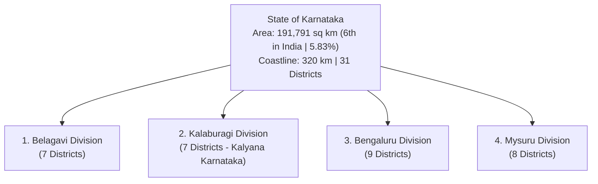
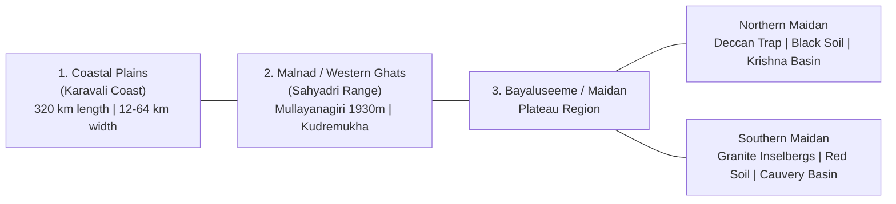
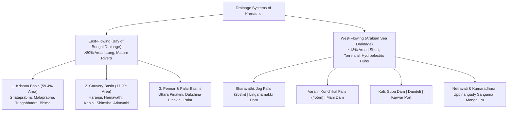
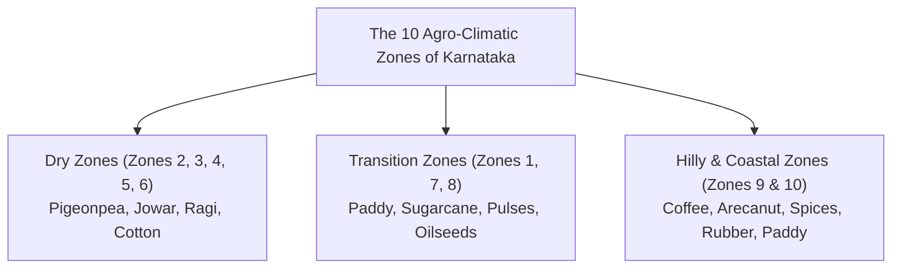
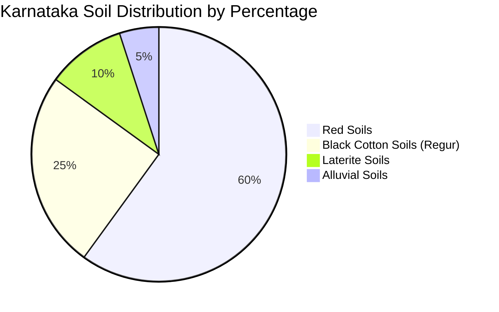
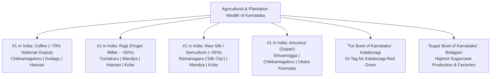
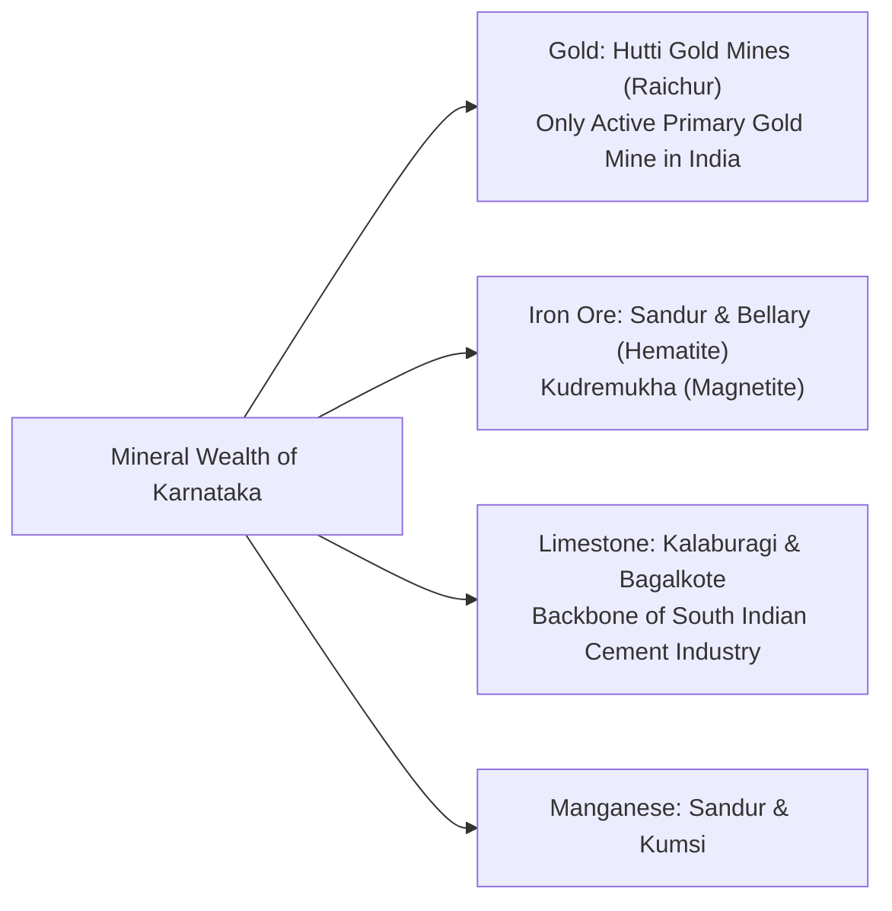
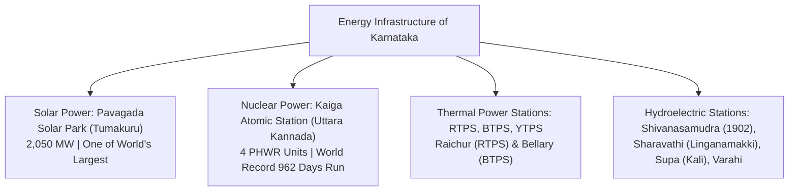
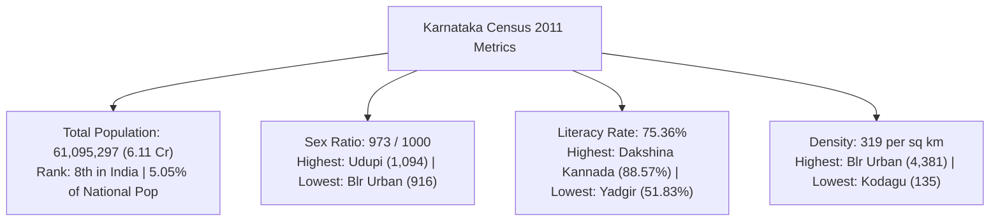

# 09. Karnataka Geography Deep Dive (ಕರ್ನಾಟಕ ಸಮಗ್ರ ಭೂಗೋಳಶಾಸ್ತ್ರ)

> [!IMPORTANT] Exam Focus & Mark Potential
> - **Expected Weightage:** **18–22 Questions** in Paper-I out of the General Knowledge paper.
> - **Top Scoring Focal Points:**
>   1. **Physiography & Mountain Peaks:** Mullayanagiri (1,930 m - highest), Kudremukha, Bababudangiri, Tadiandamol; Western Ghats mountain passes (Shiradi, Charmadi, Agumbe, Hulikal).
>   2. **Drainage, Dams & Waterfalls:** Krishna & Cauvery basin tributaries; Almatti (Lal Bahadur Shastri Sagar), KRS, Tungabhadra; Jog Falls (253 m, Sharavathi), Kunchikal (455 m, Varahi), Shivanasamudra.
>   3. **Agro-Climatic Zones & Soils:** The 10 Agro-Climatic Zones; Red soil (60%), Black cotton soil (25%), Laterite & Alluvial belts; Agumbe/Hulikal rainfall extremes.
>   4. **Forests, Wildlife & Protected Areas:** 5 National Parks (Bandipur, Nagarhole, Kudremukha, Bannerghatta, Anshi/Kali); 4 Ramsar sites (Ranganathittu, Aghanashini, Magadi, Ankasamudra); Uttara Kannada highest forest cover.
>   5. **Crops & Minerals:** Coffee (70% of India - #1), Ragi (#1), Sericulture/Silk (#1, Ramanagara), Pulses (Kalaburagi Red Gram GI); Hutti Gold Mines (Raichur), Sandur iron ore, Kalaburagi limestone.
>   6. **Energy & Infrastructure:** Pavagada Solar Park (2,050 MW), Kaiga Nuclear Station, RTPS Raichur, New Mangalore Port (NMPT), SWR Hubballi.
>   7. **2011 Census Metrics:** Population (6.11 Cr), Sex Ratio (973; Udupi 1,094), Literacy (75.36%; Dakshina Kannada 88.57%), Density (319; Bengaluru Urban 4,381; Kodagu 135).

---

## 1. Spatial Dimensions, Administrative Geometry & The 31 Districts



### 1. Spatial Dimensions & Geographic Coordinates
- **Latitudinal Extent:** **$11^\circ 31'\text{ N}$ to $18^\circ 45'\text{ N}$** (Spans approximately $7^\circ 14'$).
- **Longitudinal Extent:** **$74^\circ 12'\text{ E}$ to $78^\circ 40'\text{ E}$** (Spans approximately $4^\circ 28'$).
- **Linear Distances:**
  - North to South (Aurad in Bidar to Chamrajnagar): **~750 km**.
  - West to East (Karwar in Uttara Kannada to Mulbagal in Kolar): **~400 km**.
- **Total Area:** **$191,791\text{ km}^2$** (74,051 sq miles).
  - Represents **5.83% of India's total geographical area**.
  - **Rank in India:** **6th Largest State** by land area (after Rajasthan, MP, Maharashtra, UP, and Gujarat).
- **Coastline Length:** **320 km** along the Arabian Sea, known as the **Karavali Coast** (Canara Coast).
- **Bordering States (6 Neighboring States):**
  1. **Maharashtra** (North & North-West — longest interstate border).
  2. **Goa** (North-West — shortest interstate border).
  3. **Telangana** (North-East).
  4. **Andhra Pradesh** (East).
  5. **Tamil Nadu** (South-East & South).
  6. **Kerala** (South-West).

### 2. Administrative Divisions & The 31 Districts
- Karnataka is divided into **4 Administrative Revenue Divisions** comprising **31 Districts**:
  1. **Belagavi Division (7):** Belagavi, Bagalkote, Vijayapura, Dharwad, Gadag, Haveri, Uttara Kannada.
  2. **Kalaburagi Division (7 — Kalyana Karnataka / Art. 371J):** Kalaburagi, Bidar, Raichur, Koppal, Yadgir, Ballari, Vijayanagara.
  3. **Bengaluru Division (9):** Bengaluru Urban, Bengaluru Rural, Ramanagara, Kolar, Chikkaballapura, Tumakuru, Chitradurga, Davanagere, Shivamogga.
  4. **Mysuru Division (8):** Mysuru, Mandya, Hassan, Chikkamagaluru, Kodagu, Dakshina Kannada, Udupi, Chamarajanagar.
- **The 31st District:** **Vijayanagara District** was carved out of Ballari as the 31st district on **2 October 2021** (Notification issued 8 Feb 2021; headquarters: **Hosapete**, 6 taluks: Hosapete, Harapanahalli, Hoovina Hadagali, Hagaribommanahalli, Kotturu, Kudligi).
- **Size Extremes:**
  - **Largest District by Area:** **Belagavi** ($13,415\text{ km}^2$).
  - **Smallest District by Area:** **Bengaluru Urban** ($2,196\text{ km}^2$).

---

## 2. Physiographic Divisions & Mountain Ranges

Karnataka is physiographically structured into three distinct parallel natural belts:



### 1. Coastal Plains (ಕರಾವಳಿ ತೀರ — Karavali)
- Stretches 320 km from Karwar (Majali) in the north to Talapady (Mangaluru) in the south.
- Width varies from **12 km to 64 km** (narrowest near Bhatkal; widest near Netravati-Gurupura estuary at Mangaluru).
- Comprises 3 coastal districts: **Uttara Kannada, Udupi, Dakshina Kannada**.
- Features sand spits, lagoons, estuaries, and scenic beaches (Gokarna Om Beach, Malpe, Ullal, Maravanthe where NH-66 runs between the Souparnika River and Arabian Sea).
- **St. Mary's Island (Coconut Island, Malpe, Udupi):** Declared a National Geological Monument by GSI for its unique **columnar basaltic lava formations**.

### 2. Malnad / Western Ghats (ಮಲೆನಾಡು — ಸಹ್ಯಾದ್ರಿ ಪರ್ವತಶ್ರೇಣಿ)
- Sanskrit term: *Sahyadri*; Kannada: *Malenadu* (Land of Hills/Rain).
- Average elevation: **900 to 1,500 meters** above sea level; runs parallel to the Arabian Sea coast.
- Dense evergreen to semi-evergreen tropical rainforests; one of the world's 36 **Biodiversity Hotspots**.
- **Key Mountain Passes (Ghats / ಕಣಿವೆ ಮಾರ್ಗಗಳು) Connecting Coast to Interior:**
  - **Shiradi Ghat (ಶಿರಾಡಿ ಘಾಟ್):** On NH-75, connects Sakaleshpur (Hassan) to Mangaluru (Dakshina Kannada).
  - **Charmadi Ghat (ಚಾರ್ಮಾಡಿ ಘಾಟ್):** Connects Mudigere/Kottigehara (Chikkamagaluru) to Belthangady/Mangaluru.
  - **Agumbe Ghat (ಆಗುಂಬೆ ಘಾಟ್):** 14 hairpin bends; connects Thirthahalli (Shivamogga) to Someshwara/Udupi.
  - **Hulikal / Balebare Ghat (ಬಾಳೆಬರೆ ಘಾಟ್):** Connects Hosanagara (Shivamogga) to Kundapura (Udupi).
  - **Devimane Ghat (ದೇವಿಮನೆ ಘಾಟ್):** Connects Sirsi to Kumta (Uttara Kannada).
  - **Anmod Ghat (ಅನ್ಮೋಡ್ ಘಾಟ್):** Connects Belagavi / Khanapur to Goa.

### 3. Mountain Peaks of Karnataka: Master Elevation Matrix

| Peak | Range / Hill Group | District | Height (m) | Strategic Significance & VAO Identity |
| :--- | :--- | :--- | :--- | :--- |
| **Mullayanagiri** (ಮುಳ್ಳಯ್ಯನಗಿರಿ) | Bababudan Range | **Chikkamagaluru** | **1,930 m** | **Highest mountain peak in Karnataka**; named after saint Mulappa Swamy. |
| **Bababudangiri** (Dattagiri / Chandradrona) | Bababudan Range | **Chikkamagaluru** | **1,895 m** | Revered shrine of Sufi saint Baba Budan (introduced coffee to India in 1670) and Dattatreya. |
| **Kudremukha** (ಕುದುರೆಮುಖ) | Western Ghats | **Chikkamagaluru** | **1,892 m** | Resembles a horse's face; Kudremukh National Park; magnetite iron ore reserves. |
| **Tadiandamol** (ತಡಿಯಂಡಮೋಳು) | Brahmagiri Range | **Kodagu** | **1,748 m** | **Highest mountain peak in Kodagu district**; second highest in southern Karnataka. |
| **Pushpagiri** (Kumara Parvatha) | Western Ghats | **Kodagu / Dakshina Kannada** | **1,712 m** | Famous trekking peak near Kukke Subrahmanya temple. |
| **Brahmagiri** (ಬ್ರಹ್ಮಗಿರಿ) | Western Ghats | **Kodagu** | **1,608 m** | Sacred hill range near Talakaveri; origin of the Lakshmanathirtha River. |
| **Biligirirangana Hills** (BR Hills) | Eastern/Western Ghats Junction | **Chamarajanagar** | **1,816 m** | Katappe Betta; ecological bridge connecting Western and Eastern Ghats; Soliga tribe. |
| **Gopalaswamy Betta** (Himavad) | Nilgiri Extension | **Chamarajanagar** | **1,454 m** | Highest peak inside Bandipur National Park; perpetually shrouded in mist. |
| **Nandi Hills** (ನಂದಿದುರ್ಗ) | Eastern range | **Chikkaballapura** | **1,478 m** | Hill resort; source of Arkavathi, Palar, and Pennar rivers; Tipu's Drop. |
| **Madhugiri Monolith** (ಮಧುಗಿರಿ ಬೆಟ್ಟ) | Maidan outlier | **Tumakuru** | **1,200 m** | **Largest monolithic granite hill in Asia**; fortified hill citadel with 7 gates. |
| **Skandagiri** (Kalavara Durga) | Eastern range | **Chikkaballapura** | **1,450 m** | Renowned night trekking peak above sea of clouds. |

### 4. Maidan / Bayaluseeme (ಬಯಲುಸೀಮೆ)
- **Northern Maidan (ಉತ್ತರ ಬಯಲುಸೀಮೆ):**
  - Vast, treeless, semi-arid plateau situated between 300 m and 600 m elevation.
  - Drained by the Krishna, Ghataprabha, Malaprabha, and Bhima rivers.
  - Dominated by rich black cotton soil (*Regur*) derived from the weathering of volcanic basalt lava of the **Deccan Trap**.
  - Distinctive relief features: Flat-topped mesas, isolated buttes, and dry limestone canyons (Gokak gorge).
- **Southern Maidan (ದಕ್ಷಿಣ ಬಯಲುಸೀಮೆ):**
  - Undulating plateau situated between 600 m and 900 m elevation (rising to 1,000 m around Bengaluru).
  - Drained by the Cauvery, Hemavathi, Kabini, Shimsha, and Arkavathi rivers.
  - Geologically composed of ancient Archean Dharwar granites, gneisses, and charnockites.
  - Dotted with steep, bare granite domes and inselbergs (*Kalluguddagalu*): Savandurga, Madhugiri, Ramanagara monoliths.

---

## 3. Drainage Systems, River Basins, Dams & Waterfalls

Karnataka's rivers originate primarily in the Western Ghats and drain into two unequal drainage basins:
- **East-Flowing Rivers:** Drain into the Bay of Bengal, covering **~82% of the state's geographical area**.
- **West-Flowing Rivers:** Drain into the Arabian Sea, covering **~18% of the area**, characterized by short lengths, extreme velocity, deep gorges, and enormous hydroelectric capacity.



### 1. The Krishna River Basin (59.4% of State Area)
- **Krishna River:**
  - Originates at Mahabaleshwar (Maharashtra); enters Karnataka at **Chikkapadasalagi** (Jamkhandi taluk, Bagalkote).
  - Flows 480 km within Karnataka before entering Telangana.
- **Major Tributaries:**
  1. **Ghataprabha (283 km):** Originates in Western Ghats (Sindhudurg, Maharashtra); flows east; forms the famous horse-shoe shaped **Gokak Falls (53 m)**; **Hidkal Dam (Raja Lakhamagouda Reservoir)** in Belagavi.
  2. **Malaprabha (306 km):** Originates at Kanakumbi (Khanapur, Belagavi); flows through historical Badami and Aihole; joins Krishna at **Kudalasangama** (Bagalkote — Aikya Mantapa of Basaveshwara); **Naviluthirtha Dam (Renuka Sagara)** at Saundatti.
  3. **Tungabhadra (531 km — largest tributary):** Formed at **Kudli** (Shivamogga district) by the confluence of the **Tunga** (originates at Gangamoola, Chikkamagaluru; Gajanur Dam) and the **Bhadra** (originates at Gangamoola; Bhadra Dam at Lakkavalli). Flows past Hampi; impounded by the massive **Tungabhadra Dam (Pampa Sagara)** at Hosapete (Vijayanagara district); joins Krishna at Alampur (Telangana).
  4. **Bhima (861 km total):** Originates at Bhimashankar (Maharashtra); enters Karnataka in Afzalpur taluk (Kalaburagi); major tributaries: Bennethora, Amarja, Kagina.
- **Major Storage Reservoirs on Krishna Mainstream (Upper Krishna Project - UKP):**
  - **Almatti Dam:** Officially designated **Lal Bahadur Shastri Sagar** (Nidagundi, Vijayapura/Bagalkote). Major multipurpose irrigation and hydro project (full reservoir level: 519.6 m).
  - **Narayanpur Dam:** Officially designated **Basava Sagar** (Yadgir district).

### 2. The Cauvery River Basin (17.9% of State Area)
- **Cauvery River (ಕಾವೇರಿ ನದಿ — Dakshina Ganga):**
  - Originates at **Talakaveri** (elevation 1,341 m, Brahmagiri range, Kodagu district).
  - Flows approximately 320 km within Karnataka before cascading into Tamil Nadu.
- **Major Tributaries:**
  - **Harangi:** Joins Cauvery near Kushalnagar (Kodagu).
  - **Hemavathi (245 km):** Originates at Ballalarayanadurga (Chikkamagaluru); **Hemavathi Dam (Gorur Reservoir)** at Hassan; joins Cauvery at Krishnarajasagara.
  - **Lakshmanathirtha:** Originates at Brahmagiri; forms **Iruppu Falls**; joins Cauvery at KRS backwaters.
  - **Kabini (Kapila):** Originates in Wayanad (Kerala); joins Cauvery at **Tirumakudalu Narasipura (T. Narasipura — Triveni Sangama of Cauvery, Kapila, and mythical Spatika Sarovara)**; **Kabini Dam** at Beechanahalli (H.D. Kote, Mysuru).
  - **Shimsha:** Joins Cauvery near Shivanasamudra; Shimsha Hydroelectric Project (1940).
  - **Arkavathi (161 km):** Originates at Nandi Hills; flows past Hesaraghatta and Thippagondanahalli reservoirs; joins Cauvery at **Kanaka Sangama / Mekedatu** (Kanakapura, Ramanagara).
  - **Suvarnavathi:** Joins Cauvery in Kollegal taluk.
- **The Three Famous River Islands Formed by Cauvery:**
  1. **Adi Ranga:** **Srirangapatna** (Mandya district).
  2. **Madhya Ranga:** **Shivanasamudra** (Mandya / Chamarajanagar border).
  3. **Antya Ranga:** **Srirangam** (Tiruchirappalli, Tamil Nadu).
- **Major Dams on Cauvery:**
  - **Krishnarajasagara (KRS Dam):** Located at Kannambadi (Mandya district); designed and constructed under Sir M. Visvesvaraya (1911–1932); Brindavan Gardens located on its terrace.

### 3. West-Flowing Rivers of Karnataka
- **Sharavathi (128 km):**
  - Originates at **Ambuthirtha** (Thirthahalli taluk, Shivamogga).
  - Flows northwest through the Western Ghats; impounded by **Linganamakki Dam** (storage capacity 151 TMC; feeds Mahatma Gandhi Hydroelectric Project and Sharavathi Generating Station).
  - Forms the world-famous **Jog Falls (Gersoppa Falls / Mahatma Gandhi Falls)**: Vertical plunge of **253 meters** across 4 distinct cascades:
    1. **Raja:** Grandest, unbroken, dignified vertical fall.
    2. **Roarer:** Crashes out of a rocky fissure with immense sound.
    3. **Rocket:** Shoots out at high speed through small jets.
    4. **Rani (The White Lady):** Twisting, frothing ribbon of water resembling a dancer.
- **Varahi (Haladi River):**
  - Originates at Hebbagilu (Shivamogga); forms **Kunchikal Falls (455 m)** — the **highest tiered stepped waterfall in India**.
  - **Varahi Hydro Electric Project:** Karnataka's **first underground powerhouse** (located at Hosangadi, Udupi district).
- **Kali River (184 km):**
  - Originates at Diggi (Supa taluk, Uttara Kannada); famous for white-water rafting at Dandeli; forms **Supa Dam** (Ganeshgudi), Kodasalli, and Kadra dams; empties into Arabian Sea at Karwar.
- **Netravati (103 km):**
  - Originates at Bangaraballige (Chikkamagaluru); flows past Dharmasthala; joins **Kumaradhara** at **Uppinangady** (*Gaya of the South*); empties into Arabian Sea at Mangaluru.
- **Aghanashini (121 km):**
  - Originates at Shankara Honda (Sirsi, Uttara Kannada); forms **Unchalli Falls (Lushington Falls — 116 m)**; pristine unpolluted estuary designated as a **Ramsar Site in 2024**.
- **Gangavali / Bedthi:** Formed by the union of Shalmala and Bedthi; forms **Magod Falls (180 m)** near Yellapura.
- **Mahadayi / Mandovi:** Originates at Degaon (Khanapur taluk, Belagavi); subject of the inter-state **Kalasa-Banduri Nala Drinking Water Project dispute** between Karnataka and Goa.

### 4. Master Waterfalls Matrix

| Waterfall | River | District | Height (m) | Unique Identifier & Key Exam Fact |
| :--- | :--- | :--- | :--- | :--- |
| **Jog Falls** (Gersoppa) | Sharavathi | **Shivamogga** | **253 m** | Unbroken vertical plunge; 4 cascades (Raja, Roarer, Rocket, Rani); MG Hydro Project. |
| **Kunchikal Falls** | Varahi | **Shivamogga** | **455 m** | **Highest stepped waterfall in India**; feeds underground Varahi power station. |
| **Shivanasamudra Falls** | Cauvery | **Mandya / Chamarajanagar** | **98 m** | Twin falls: **Gaganachukki** (steep roar) and **Bharachukki** (wide fan); Asia's first hydro project (1902). |
| **Gokak Falls** | Ghataprabha | **Belagavi** | **53 m** | Known as the **"Niagara of Karnataka"**; horseshoe-shaped sandstone gorge with hanging bridge. |
| **Magod Falls** | Bedthi (Gangavali) | **Uttara Kannada** | **180 m** | Two-tiered cataract amidst dense Western Ghat forests near Yellapura. |
| **Unchalli Falls** (Lushington) | Aghanashini | **Uttara Kannada** | **116 m** | Discovered in 1845 by British collector J.D. Lushington; deafening roar (*Keppa Joga*). |
| **Barkana Falls** | Seetha | **Shivamogga** | **259 m** | Tiered waterfall located in the dense evergreen forests of Agumbe. |
| **Iruppu Falls** (Lakshmanathirtha)| Lakshmanathirtha | **Kodagu** | **52 m** | Sacred pilgrimage spot on Brahmagiri slopes near Rameshwara temple. |
| **Abbey Falls** (Jessie Falls) | Local streams (Cauvery) | **Kodagu** | **21 m** | Located amidst private coffee plantations near Madikeri; named after British lady Jessie. |
| **Hebbe Falls** | Local mountain streams | **Chikkamagaluru** | **168 m** | Twin stages (*Dodda Hebbe* and *Chikka Hebbe*) near Kemmangundi hill station. |
| **Kalhatti Falls** | Sharavathi headwaters | **Chikkamagaluru** | **122 m** | Cascades over Veerabhadreshwara cave temple near Tarikere. |
| **Chunchi Falls** | Arkavathi | **Ramanagara** | **15 m** | Rocky gorge waterfall near Kanakapura before joining Cauvery at Mekedatu. |

---

## 4. Climate, Monsoons & The 10 Agro-Climatic Zones

### 1. Climate Characteristics & The Four Seasons
- Karnataka enjoys a **Tropical Monsoon Climate** transitioning from humid coastal maritime to semi-arid continental interior.
- **Four Distinct Meteorological Seasons:**
  1. **Winter Season (ಶೀತಗಾಲ — January to February):** Dry, cool, pleasant weather. Lowest temperatures recorded in Belagavi and Bidar.
  2. **Summer Season (ಬೇಸಿಗೆಗಾಲ — March to May):** Hot, dry inland. Maximum temperatures exceed $40^\circ\text{C}$ in Kalaburagi, Raichur, and Ballari. Features pre-monsoon convective thunderstorms known as:
     - **Mango Showers (ಮಾವಿನ ಹೊಯಿಲು):** Aid the ripening of mangoes in coastal and southern districts.
     - **Coffee Blossoms / Cherry Showers (ಕಾಫಿ ಹೂ ಮಳೆ):** Vital for flowering coffee plants in Kodagu, Hassan, and Chikkamagaluru.
  3. **South-West Monsoon (ಮುಂಗಾರು ಮಳೆ — June to September):**
     - Accounts for **~80% of Karnataka's total annual rainfall**.
     - Arabian Sea branch strikes the Western Ghats perpendicularly, causing massive **orographic precipitation** (3,000 to 5,000 mm) in Malnad and Coast.
     - Eastern plateau falls into the severe **Rain Shadow Zone** (average rainfall drops to 500–600 mm).
  4. **North-East Retreating Monsoon (ಹಿಂಗಾರು ಮಳೆ — October to December):**
     - Brings cyclonic rainfall to Southern and Eastern Maidan districts (Kolar, Chikkaballapura, Bengaluru, Tumakuru).
- **Rainfall Superlatives:**
  - **Wettest Places in Karnataka:** **Hulikal** (Hosanagara taluk, Shivamogga — consistently records highest annual rainfall >8,000 mm) and **Agumbe** (Thirthahalli taluk, Shivamogga — historically titled the **"Cherrapunji of South India"**).
  - **Driest Place in Karnataka:** **Nayakanahatti / Challakere** (Chitradurga district — the "Oil City" / dry pulse belt recording <450 mm rainfall).

### 2. The 10 Agro-Climatic Zones of Karnataka (Official Classification)



| Zone No. | Name of Agro-Climatic Zone | Districts / Taluks Covered | Predominant Soil Type | Average Rainfall (mm) | Signature Crops |
| :--- | :--- | :--- | :--- | :--- | :--- |
| **Zone 1** | **North Eastern Transition Zone** | Bidar district and Aland taluk (Kalaburagi) | Medium to deep black; red lateritic in Bidar | 800–900 mm | Red gram, Green gram, Jowar, Soybean |
| **Zone 2** | **North Eastern Dry Zone** | Kalaburagi, Yadgir, Raichur | Deep black cotton soil | 650–750 mm | Tur (Pigeonpea), Jowar, Sunflower, Bajra |
| **Zone 3** | **Northern Dry Zone** *(Largest Zone)* | Vijayapura, Bagalkote, Gadag, Koppal, Ballari, Vijayanagara, parts of Belagavi | Deep to medium black soils | 500–600 mm | Jowar, Cotton, Sunflower, Bengal gram |
| **Zone 4** | **Central Dry Zone** | Chitradurga, Davanagere, parts of Tumakuru (Chiknayakanhalli, Sira) | Red sandy loam & medium black | 500–700 mm | Ragi, Groundnut, Maize, Pomegranate |
| **Zone 5** | **Eastern Dry Zone** | Bengaluru Urban, Bengaluru Rural, Ramanagara, Kolar, Chikkaballapura | Red loamy & red gravelly | 700–850 mm | Ragi, Mulberry (Sericulture), Mango, Grapes |
| **Zone 6** | **Southern Dry Zone** | Mandya, Mysuru (dry taluks), Chamarajanagar | Red sandy loam | 650–800 mm | Sugarcane, Ragi, Paddy, Mulberry |
| **Zone 7** | **Southern Transition Zone** | Hassan, parts of Mysuru (Hunsur, Periyapatna), Tarikere | Red sandy & clay loam | 800–1,000 mm | Tobacco (FCV), Ragi, Maize, Potato |
| **Zone 8** | **Northern Transition Zone** | Dharwad, Belagavi (Khanapur/Bailhongal), Haveri | Medium black & red loam | 750–1,000 mm | Cotton, Maize, Groundnut, Chillies |
| **Zone 9** | **Hilly Zone (Malnad)** | Kodagu, Shivamogga, Chikkamagaluru, upland Uttara Kannada | Laterite & red gravelly loam | 1,500–3,500 mm | Coffee, Arecanut, Cardamom, Pepper, Tea |
| **Zone 10** | **Coastal Zone** | Coastal Uttara Kannada, Udupi, Dakshina Kannada | Deep laterite & coastal alluvium | 3,000–4,500 mm | Paddy, Cashew, Coconut, Arecanut |

---

## 5. Soils of Karnataka: Distribution & Characteristics



### 1. Red Soils (ಕೆಂಪು ಮಣ್ಣು — ~60% Area)
- **Origin & Composition:** Formed by the weathering of ancient crystalline Archean rocks (granites and gneisses). Rich in **iron peroxide** (giving its distinct reddish color), but deficient in nitrogen, phosphorus, and humus.
- **Distribution:** Dominates Southern Maidan — Tumakuru, Bengaluru, Ramanagara, Kolar, Chikkaballapura, Mandya, Mysuru, Chamarajanagar, and parts of Hassan.
- **Agricultural Profile:** Porous, friable, well-drained. Excellent for dryland farming under irrigation.
- **Key Crops:** **Ragi (Finger Millet)**, groundnut, castor, red gram, horsegram, and mulberry.

### 2. Black Cotton Soils / Regur (ಕಪ್ಪು ಮಣ್ಣು — ~25% Area)
- **Origin & Composition:** Derived from the weathering of volcanic basalt lava sheets of the **Deccan Trap**. Rich in calcium, magnesium carbonates, aluminum, and potash. Contains high percentages of **montmorillonite clay**.
- **Special Property (Self-Ploughing / ಸ್ವಯಂ ಉಳುವಿಕೆ):** Highly moisture-retentive; swells and becomes sticky when wet; develops deep, wide polygonal shrinkage cracks during dry summer, aerating the soil naturally.
- **Distribution:** Dominates Northern Maidan — Vijayapura, Bagalkote, Belagavi, Dharwad, Gadag, Kalaburagi, Yadgir, Raichur, Ballari.
- **Key Crops:** **Cotton**, Jowar (Sorghum), wheat, Bengal gram, sunflower, safflower.

### 3. Laterite Soils (ಜಂಬಿಟ್ಟಿಗೆ ಮಣ್ಣು — ~10% Area)
- **Origin & Composition:** Formed in tropical regions experiencing alternating heavy rainfall and high temperatures via intense **leaching (ನಿಕ್ಷಾಲನ)** of silica. Rich in hydrated iron and aluminum oxides; distinctly acidic (pH 4.5–5.5); deficient in nitrogen and lime.
- **Distribution:** Malnad and Coastal districts — Uttara Kannada, Udupi, Dakshina Kannada, Kodagu, Chikkamagaluru, and parts of Belagavi/Bidar.
- **Key Crops:** **Coffee, Tea, Rubber, Cashewnut, Arecanut, Coconut, Cardamom**.

### 4. Alluvial Soils (ಮೆಕ್ಕಲು ಮಣ್ಣು — ~5% Area)
- **Origin:** Deposited by river courses and marine tides along coastal river deltas and floodplains.
- **Distribution:** Narrow coastal strips along Arabian Sea (Netravati, Sharavathi, Kali estuaries) and river floodplains of the Cauvery and Krishna.
- **Key Crops:** **Paddy, Sugarcane, Plantain (Banana)**.

---

## 6. Forests, Wildlife, 5 National Parks & Biosphere Reserves

### 1. Forest Cover Statistics (ISFR 2021)
- **Total Recorded Forest Area:** **$38,575\text{ km}^2$** (~20.11% of Karnataka's total geographical area).
- **National Forest Policy Target:** 33.33%.
- **District Extremes:**
  - **Highest Forest Cover by Area & Percentage:** **Uttara Kannada** (>78% of district area covered in dense forest).
  - **Lowest Forest Cover:** **Vijayapura** (<0.2% forest cover).
- **Forest Types:**
  1. *Tropical Wet Evergreen Forests:* High rainfall Western Ghat slopes (>2,500 mm). Trees: Rosewood (*Beete*), Ebony, Teak (*Tega*), White Cedar.
  2. *Tropical Moist Deciduous Forests:* Malnad foothills (1,500–2,000 mm). Trees: Sandalwood (*Gandha* — Karnataka is the *"Land of Sandalwood"*), Teak, Mathi, Honne, Bamboo.
  3. *Tropical Dry Deciduous Forests:* Maidan fringes (750–1,000 mm). Trees: Dindiga, Bevu (Neem), Bage.
  4. *Tropical Thorn & Scrub Forests:* Arid Northern and Central Maidan (<600 mm). Trees: Kaggali (Acacia), Cacti, Babul.

### 2. The 5 National Parks of Karnataka: Master Matrix

| National Park | Year Estd | District(s) | Area (sq km) | Prominent Fauna & Exam Identity |
| :--- | :--- | :--- | :--- | :--- |
| **Bandipur National Park** | 1974 | **Chamarajanagar** | 874 | Part of **Nilgiri Biosphere Reserve** (India's 1st Biosphere Reserve, 1986). Pioneer Project Tiger reserve; famous for Bengal tigers, Asian elephants, gaurs, and chital. |
| **Nagarhole National Park**<br/>(Rajiv Gandhi NP) | 1988 | **Kodagu & Mysuru** | 643 | Located on the banks of **Kabini River**; world's highest density of Asiatic elephants and leopards; famous for black panthers. |
| **Kudremukha National Park** | 1987 | **Chikkamagaluru, Dakshina Kannada, Udupi** | 600 | Shola-grassland ecosystem; origin of Tunga, Bhadra, and Netravati; endangered **Lion-tailed Macaque**. |
| **Bannerghatta National Park** | 1974 | **Bengaluru Urban & Ramanagara** | 260 | Located 22 km from Bengaluru; contains **India's first dedicated Butterfly Park (2006)**, biological safari park, and rescue center. |
| **Anshi National Park**<br/>(Kali Tiger Reserve) | 1987 | **Uttara Kannada** | 417 | Located in the pristine Kali River basin; dense evergreen rainforest; renowned habitat for the elusive **Black Panther** (*Melanistic Leopard*). |

### 3. Key Wildlife Sanctuaries & Conservation Reserves
- **Bhadra Wildlife Sanctuary (Muthodi):** Chikkamagaluru; Project Tiger reserve.
- **Dandeli Wildlife Sanctuary:** Uttara Kannada; hornbill conservation reserve on Kali River.
- **Daroji Sloth Bear Sanctuary:** Vijayanagara / Ballari; **Asia's first dedicated Sloth Bear sanctuary** (established 1994).
- **Ranganathittu Bird Sanctuary:** Srirangapatna (Mandya); island sanctuary on Cauvery River discovered by Dr. Salim Ali in 1940; declared **Karnataka's first Ramsar Wetland Site in 2022**.
- **Ramadevara Betta Vulture Sanctuary:** Ramanagara; **India's first and only Vulture Sanctuary** (protecting endangered Long-billed Vultures).
- **Jayamangali Blackbuck Reserve:** Maidenahalli (Madhugiri, Tumakuru); dedicated to blackbuck antelopes (*Krishnamriga*).
- **Kokkare Bellur Pelicanry:** Maddur (Mandya); breeding colony of Spot-billed Pelicans and Painted Storks.
- **Attiveri Bird Sanctuary:** Mundgod (Uttara Kannada).
- **Gudavi Bird Sanctuary:** Soraba (Shivamogga).

### 4. Ramsar Wetland Sites of International Importance in Karnataka (4 Sites)

| Ramsar Site | District | Year Inscribed | Wetland Ecosystem & Ecological Significance |
| :--- | :--- | :--- | :--- |
| **1. Ranganathittu Bird Sanctuary** | Mandya | **2022** | Riverine island wetland on Cauvery River; breeding haven for 40,000+ migratory waterfowl. |
| **2. Aghanashini Estuary** | Uttara Kannada | **2024** | Pristine estuarine wetland where the unpolluted Aghanashini River joins the Arabian Sea; extensive mangroves, traditional bivalve fishing, and bird congregation. |
| **3. Magadi Kere Conservation Reserve** | Gadag | **2024** | Human-made perennial irrigation tank; premier wintering ground in South India for the high-altitude migratory **Bar-headed Goose** (*Anser indicus*). |
| **4. Ankasamudra Bird Conservation Reserve** | Vijayanagara | **2024** | Natural tank supporting 140+ wetland bird species; first wetland reserve in Kalyana Karnataka. |

---

## 7. Agriculture, Major Crops & Plantation Profile

Karnataka ranks among India's top agricultural producers in dryland cereals, plantation crops, and sericulture:



### 1. Food Grain & Pulse Production
- **Ragi (Finger Millet — ರಾಗಿ):**
  - **Karnataka is the undisputed #1 producer of Ragi in India**, producing over 50% of the national crop.
  - Southern Maidan staple: Tumakuru, Hassan, Mandya, Kolar, Ramanagara.
- **Jowar (Sorghum — ಜೋಳ):**
  - Staple grain of Northern Maidan (*Jolada Rotti*).
  - Major producers: Vijayapura, Kalaburagi, Bagalkote, Raichur, Dharwad.
- **Paddy (Rice — ಭತ್ತ):**
  - Major canal-irrigated districts: Raichur (**"Rice Bowl of Karnataka"**), Gangavathi (Koppal), Davanagere, Shivamogga, Mandya.
- **Pulses & Red Gram (ತೊಗರಿ):**
  - **Kalaburagi is officially hailed as the "Tur Bowl of Karnataka"** (ತೊಗರಿ ಕಣಜ).
  - Awarded the prestigious **Geographical Indication (GI) Tag for *Kalaburagi Red Gram***.

### 2. Plantation & Commercial Crops
- **Coffee (ಕಾಫಿ — #1 in India):**
  - Produces **~70% of total Indian coffee**.
  - Historical introduction: 7 beans brought from Mocha (Yemen) by **Sufi Saint Baba Budan** in **1670 AD** and planted on Chandradrona Parvatha (Chikkamagaluru).
  - **Chikkamagaluru:** Known as the **"Cradle of Coffee in India"**; headquarters of the **Central Coffee Research Institute (CCRI, Balehonnur)**.
  - Kodagu produces the highest volume among districts, followed by Chikkamagaluru and Hassan.
  - Varieties: *Coffea Arabica* (high altitude, aromatic) and *Coffea Canephora / Robusta* (hardy, low altitude).
- **Silk & Sericulture (ರೇಷ್ಮೆ — #1 in India):**
  - Produces **~45% of India's mulberry raw silk**.
  - **Ramanagara:** Known as the **"Silk City"** of Karnataka; houses the **largest raw silk cocoon trading market in Asia**.
  - Other silk hubs: Sidlaghatta (Chikkaballapura), Kolar, Mandya, Mysuru.
- **Arecanut (ಅಡಿಕೆ — #1 in India):**
  - Leading producers: Shivamogga, Chikkamagaluru, Davanagere, Uttara Kannada.
- **Sugarcane (ಕಬ್ಬು):**
  - **Belagavi** is the **"Sugar Bowl of Karnataka"**, possessing the highest number of cooperative sugar factories and acreage, followed by Mandya and Bagalkote.
- **Cotton (ಹತ್ತಿ):**
  - Grown extensively in the black soil belt: Haveri, Ballari, Dharwad, Raichur.

---

## 8. Mineral Wealth & Geological Formations

Karnataka is geologically anchored by the ancient Archean **Dharwar Craton** (3.6 to 2.5 billion years old), making it one of the most mineral-rich states in the Indian subcontinent.



### 1. Gold (ಚಿನ್ನ)
- **Hutti Gold Mines (ಹಟ್ಟಿ ಚಿನ್ನದ ಗಣಿ — Raichur District):**
  - Operated by Hutti Gold Mines Company Limited (HGML, Govt of Karnataka).
  - **The ONLY active primary gold producing mine in India today**.
- **Kolar Gold Fields (KGF — Kolar District):**
  - Champion Reef was once the second deepest mine in the world (>3,200 m deep).
  - First energized by Shivanasamudra hydroelectric plant in 1902; closed in 2001 due to depletion and high extraction costs.

### 2. Iron Ore (ಕಬ್ಬಿಣದ ಅದಿರು)
- Karnataka possesses vast reserves of high-grade **Hematite** and **Magnetite**:
  1. **Sandur–Hospet–Bellary Belt (Vijayanagara & Ballari Districts):** Richest hematite reserves (up to 65% Fe content); feeds the giant JSW Steel Toranagallu complex.
  2. **Chikkamagaluru Belt:** Bababudangiri, Kemmangundi, and **Kudremukha** (massive low-grade magnetite deposits; mining discontinued for ecological protection).
  3. **Tumakuru–Chitradurga Belt:** Chiknayakanhalli, Hosadurga, Sasalu.

### 3. Other Key Industrial Minerals
- **Limestone (ಸುಣ್ಣದ ಕಲ್ಲು):** Extensive deposits in the Bhima River basin of **Kalaburagi (Wadi, Sedam, Shahabad)** and Bagalkote. Hailed as the **"Cement Hub of South India"** (hosts giant ACC, Ultratech, Vasavadatta, Rajashree plants).
- **Manganese:** Found alongside iron ore in Sandur (Ballari), Kumsi (Shivamogga), and Supa (Uttara Kannada).
- **Bauxite (Aluminum Ore):** Belagavi (Khanapur taluk, feeds INDAL/Hindalco smelter), Uttara Kannada, Udupi.
- **Granite:** Karnataka is renowned for decorative dimension stones:
  - *Ilkal Pink Granite:* Bagalkote.
  - *Chamundi Black Granite:* Mysuru / Chamarajanagar.
  - *Kanminike Multi-color Granite:* Ramanagara.

---

## 9. Industries & Energy Infrastructure



### 1. Power Generation Profile
- Karnataka was the first state in India to generate hydroelectric power and is currently a national leader in renewable green energy:
  - **Hydroelectric Energy:**
    - **Shivanasamudra (1902):** Asia's first commercial hydro station (Cauvery River).
    - **Sharavathi Generating Station (Jog / Linganamakki):** Installed capacity 1,035 MW.
    - **Varahi Hydro Project:** Underground power station (460 MW).
    - **Kali Hydroelectric Project (Supa & Nagjhari):** Uttara Kannada (870 MW).
  - **Thermal Power Plants (Coal):**
    - **Raichur Thermal Power Station (RTPS, Shaktinagar, Raichur):** First and largest state-owned coal-fired thermal plant (1,720 MW, 8 units).
    - **Bellary Thermal Power Station (BTPS, Kudatini, Ballari):** 1,700 MW.
    - **Yermarus Thermal Power Station (YTPS, Raichur):** Supercritical coal plant (1,600 MW).
    - **Udupi Power Corporation Limited (UPCL, Nandikur, Udupi):** 1,200 MW imported-coal coastal plant.
  - **Nuclear Energy:**
    - **Kaiga Atomic Power Station (ಕೈಗಾ ಅಣು ವಿದ್ಯುತ್ ಸ್ಥಾವರ — Uttara Kannada):**
      - Located on the Kali River; operates 4 Pressurized Heavy Water Reactors (PHWR) of 220 MW each (Total: 880 MW).
      - **Global Record:** Kaiga Unit-1 set a **world record for continuous uninterrupted operation of 962 days** (surpassing British Heysham-2 plant in 2018).
  - **Solar Energy:**
    - **Pavagada Solar Park ("Shakti Sthala" — Tumakuru District):**
      - Commissioned in 2019 across 13,000 acres of drought-prone land.
      - Total capacity: **2,050 MW** (2.05 GW); ranks among the **largest solar photovoltaic parks in the world**.

### 2. Major Industrial Titans
- **Iron and Steel:**
  - **Visvesvaraya Iron and Steel Plant (VISL, Bhadravati, Shivamogga):** Founded in **1923** by Nalvadi Krishnaraja Wodeyar and Sir MV; pioneer alloy steel producer.
  - **JSW Steel Limited (Vijayanagar Works, Toranagallu, Ballari):** India's largest single-location integrated steel plant (capacity >12 MTPA).
- **Hindustan Aeronautics Limited (HAL, Bengaluru — 1940):** Established by Walchand Hirachand and Mysore State; manufactures Tejas fighter aircraft, Dhruv ALH.
- **Information Technology & Biotechnology:** Bengaluru is hailed globally as the **"Silicon Valley of India"** and **"ITBT Capital"**, contributing over 38% of India's software exports.

---

## 10. Transport, Ports & Connectivity

### 1. Ports of Karnataka
- **New Mangalore Port (NMPT — Panambur, Dakshina Kannada):**
  - **Karnataka's ONLY Major Port** (declared India's 9th Major Port on 4 May 1974 by PM Indira Gandhi).
  - All-weather deep-water port; handles export of iron ore pellets, coffee, cashew, spices, granite, and import of crude POL, coal, and LPG.
- **Old Mangalore Port (Bunder):** Handles minor coastal trade and passenger ferries to Lakshadweep.
- **Karwar Port (Baithkol, Uttara Kannada):** Natural intermediate port; located adjacent to **INS Kadamba (Project Seabird)** — the largest dedicated naval base of the Indian Navy east of the Suez Canal.

### 2. Railways & Key Highways
- **South Western Railway (SWR — ನೈಋತ್ಯ ರೈಲ್ವೆ):**
  - Zonal Headquarters located at **Hubballi (Dharwad district)** (operational since 1 April 2003).
  - **Shree Siddharoodha Swamiji Hubballi Railway Station:** Officially recognized by Guinness World Records as the **World's Longest Railway Platform (1,507 meters)** on Platform No. 8.
- **Major National Highways Passing Through Karnataka:**
  - **NH-44:** Srinagar to Kanyakumari — longest NH in India; traverses North-South through Bengaluru and Ballari.
  - **NH-48:** Delhi to Chennai (passes through Belagavi, Hubballi, Davanagere, Tumakuru, Bengaluru).
  - **NH-66:** Panvel (Maharashtra) to Kanyakumari — scenic 4-lane Coastal Highway traversing Karwar, Kumta, Kundapura, Udupi, and Mangaluru.
  - **NH-75:** Connects port city Mangaluru with Bengaluru via Shiradi Ghat and Hassan.

---

## 11. 2011 Census Demographic Matrix for Karnataka

Official validated metrics from the **2011 Census of India (Karnataka Series)**:



### Master Demographic Summary Table

| Demographic Indicator | Karnataka State Metric | National Average (India) | Highest District in Karnataka | Lowest District in Karnataka |
| :--- | :--- | :--- | :--- | :--- |
| **Total Population** | **61,095,297 (6.11 Crore)** | 1,210,854,977 (1.21 Bn) | **Bengaluru Urban** (9,621,551 — ~96.2 Lakh) | **Kodagu** (554,519 — ~5.54 Lakh) |
| **Decadal Growth Rate** (2001–2011) | **15.60%** | 17.70% | **Bengaluru Urban** (47.18%) | **Chikkamagaluru** (-0.26% — negative growth) |
| **Population Density** | **319 persons / $\text{km}^2$** | 382 persons / $\text{km}^2$ | **Bengaluru Urban** (**4,381** / $\text{km}^2$) | **Kodagu** (**135** / $\text{km}^2$) |
| **Sex Ratio** (Females / 1000 Males) | **973** | 943 | **Udupi** (**1,094**) *(Kodagu 2nd: 1,019)* | **Bengaluru Urban** (**916**) |
| **Child Sex Ratio** (0–6 Years) | **948** | 919 | **Kodagu** (978) | **Belagavi** (931) |
| **Overall Literacy Rate** | **75.36%** | 74.04% | **Dakshina Kannada** (**88.57%**) | **Yadgir** (**51.83%**) |
| **Male Literacy Rate** | **82.47%** | 82.14% | **Dakshina Kannada** (93.13%) | **Yadgir** (62.25%) |
| **Female Literacy Rate** | **68.08%** | 65.46% | **Dakshina Kannada** (84.13%) | **Yadgir** (41.38%) |
| **Urban Population %** | **38.67%** | 31.16% | **Bengaluru Urban** (90.94%) | **Kodagu** (14.61%) |
| **Rural Population %** | **61.33%** | 68.84% | **Kodagu** (85.39%) | **Bengaluru Urban** (9.06%) |

> [!CAUTION] Exam Pitfall: Udupi vs Dakshina Kannada
> - **Sex Ratio Leader:** **Udupi** has the highest overall sex ratio (**1,094 females** per 1,000 males).
> - **Literacy Leader:** **Dakshina Kannada** has the highest overall literacy rate (**88.57%**), male literacy (93.13%), and female literacy (84.13%).
> - **Lowest Literacy District:** **Yadgir** is lowest across overall (51.83%), male (62.25%), and female (41.38%) literacy.
> - **Negative Decadal Growth:** **Chikkamagaluru** recorded a negative population growth rate of **-0.26%** between 2001 and 2011.

---

## 12. "Where Is It?" Quick-Lookup District Directory

A high-speed lookup directory indexing geographical features, infrastructure, and sanctuaries to their exact administrative districts:

| District | Signature Peaks / Relief | Rivers, Dams & Waterfalls | Sanctuaries, National Parks & Minerals |
| :--- | :--- | :--- | :--- |
| **Chikkamagaluru** | **Mullayanagiri (1,930 m)**, Bababudangiri (1,895 m), Kudremukha (1,892 m) | Bhadra Dam (Lakkavalli), Hebbe Falls, Kalhatti Falls | Kudremukha NP, Bhadra WLS (Muthodi), CCRI Balehonnur (Coffee hub) |
| **Kodagu** | Tadiandamol (1,748 m), Brahmagiri (1,608 m), Pushpagiri | Talakaveri (Cauvery origin), Iruppu Falls, Abbey Falls, Harangi Dam | Nagarhole NP, Brahmagiri WLS, Pushpagiri WLS |
| **Shivamogga** | Agumbe Ghat, Hulikal Ghat, Kodachadri (1,343 m) | Sharavathi, Linganamakki Dam, **Jog Falls (253 m)**, Kunchikal Falls (455 m) | Gudavi Bird Sanctuary, VISL & MPM Bhadravati |
| **Uttara Kannada** | Sahyadri evergreen slopes, Devimane Ghat | Kali River, Supa Dam, Aghanashini Estuary, Unchalli Falls, Magod Falls | **Anshi NP (Kali Tiger Reserve)**, Dandeli WLS, Kaiga Nuclear Station, Karwar Port |
| **Udupi** | St. Mary's Columnar Basalt Island | Varahi underground powerhouse, Souparnika River | Mookambika WLS, UPCL Nandikur thermal plant, Highest Sex Ratio (1,094) |
| **Dakshina Kannada** | Coastal strip, Netravati-Gurupura plains | Netravati, Kumaradhara, Uppinangady Sangama | **New Mangalore Port (NMPT)**, Highest Literacy (88.57%) |
| **Belagavi** | Northern transition plateau | Ghataprabha, Malaprabha origin, Hidkal Dam, **Gokak Falls (53 m)** | Sugar Bowl of Karnataka, Bauxite mining |
| **Bagalkote** | Sandstone plateaus, Badami scarps | Malaprabha-Krishna confluence (**Kudalasangama**), Almatti Dam | Ilkal pink granite, Ghataprabha Bird Sanctuary |
| **Vijayapura** | Deccan Trap black soil plain | Krishna River, Doni River (*Doni Haridare Rotti*) | Almatti Dam (Lal Bahadur Shastri Sagar), Gol Gumbaz, lowest forest cover |
| **Kalaburagi** | Semi-arid black cotton tract | Bhima River, Bennethora, Kagina | **"Tur Bowl of Karnataka"** (GI Red Gram), Cement hub (Wadi, Sedam) |
| **Yadgir** | Hunasagi pre-historic valley | Krishna River, Narayanpur Dam (**Basava Sagar**) | Lowest Literacy District (51.83%) |
| **Raichur** | Raichur Doab (Krishna-Tungabhadra) | Krishna & Tungabhadra rivers | **Hutti Gold Mines**, **RTPS Shaktinagar**, Rice Bowl of Karnataka |
| **Ballari** | Sandur schist belt, Copper mountain | Tungabhadra River, Hagari River | Sandur hematite iron ore, Daroji Sloth Bear Sanctuary, BTPS Kudatini |
| **Vijayanagara** | UNESCO Hampi boulders & hills | Tungabhadra Dam (**Pampa Sagara** at Hosapete) | 31st District of Karnataka (2021), Ankasamudra Ramsar Site |
| **Mandya** | Irrigated Cauvery-Hemavathi plains | Cauvery River, **KRS Dam (Kannambadi)**, Gaganachukki Falls | **Ranganathittu Ramsar Site**, Kokkare Bellur Pelicanry, Sugar & Silk |
| **Chamarajanagar** | BR Hills (1,816 m), Himavad Gopalaswamy | Cauvery River, Bharachukki Falls, Suvarnavathi | **Bandipur National Park**, Male Mahadeshwara WLS |
| **Tumakuru** | **Madhugiri Monolith (1,200 m)** | Shimsha River, Jayamangali River | **Pavagada Solar Park (2,050 MW)**, Jayamangali Blackbuck Reserve, Ragi #1 |
| **Chitradurga** | 7-ringed granite hills, Nayakanahatti plain | Vedavathi River, **Vani Vilasa Sagara Dam (Marikanive)** | Driest region of state, Wind energy hub |
| **Ramanagara** | Closepet granite rocky outcrops | Arkavathi River, Kanaka Sangama, Chunchi Falls | **"Silk City"** (Asia's largest cocoon market), Ramadevara Betta Vulture Sanctuary |
| **Chikkaballapura** | Nandi Hills (1,478 m), Skandagiri | Origin of Arkavathi, Palar, and Pennar rivers | Vidurashwatha pilgrimage, Silk reeling |
| **Gadag** | Kappatagudda gold hills | Malaprabha River | **Magadi Kere Ramsar Wetland** (Bar-headed geese), Windmills |

---

## 13. High-Yield 50 Fact Sheet (Karnataka Geography)

1. Karnataka's total geographical area is **$191,791\text{ km}^2$**, ranking **6th in India** (5.83% of national area).
2. The state shares land borders with **6 Indian states**; longest with Maharashtra, shortest with Goa.
3. **Mullayanagiri (1,930 m)** in the Bababudan range of Chikkamagaluru is the **highest mountain peak in Karnataka**.
4. **Tadiandamol (1,748 m)** is the highest mountain peak in **Kodagu district**.
5. **Madhugiri (Tumakuru)** is recognized as the **largest monolithic granite hill in Asia**.
6. The **Krishna Basin** is the largest drainage basin in Karnataka, covering **59.4%** of the state's total area.
7. The **Cauvery River** originates at **Talakaveri** in the Brahmagiri range of Kodagu.
8. The **Almatti Dam** is officially named **Lal Bahadur Shastri Sagar**.
9. The **Narayanpur Dam** is officially named **Basava Sagar**.
10. The **Tungabhadra Reservoir** at Hosapete is called **Pampa Sagara**.
11. **Jog Falls** on the Sharavathi River drops vertically from a height of **253 meters** in 4 cascades: **Raja, Roarer, Rocket, and Rani**.
12. **Kunchikal Falls (455 m)** on the Varahi River in Shivamogga is the **highest tiered waterfall in India**.
13. **Gokak Falls (53 m)** on the Ghataprabha River is known as the **"Niagara of Karnataka"**.
14. The **Shivanasamudra twin falls** on the Cauvery River are **Gaganachukki and Bharachukki**.
15. **Hulikal** (Hosanagara) and **Agumbe** (Thirthahalli) in Shivamogga record the highest annual rainfall in Karnataka.
16. **Nayakanahatti / Challakere** in Chitradurga district records the lowest average rainfall in Karnataka.
17. Karnataka is officially divided into **10 Agro-Climatic Zones**.
18. The **Northern Dry Zone (Zone 3)** is the largest agro-climatic zone in Karnataka.
19. **Red soils** cover approximately **60%** of Karnataka's total land area, predominant in the Southern Maidan.
20. **Black cotton soil (Regur)** covers ~25% of the state and exhibits the unique property of **self-ploughing**.
21. **Laterite soil** is formed by the intense process of **leaching** in high-rainfall belts.
22. **Uttara Kannada** has the highest forest cover (>78%), while **Vijayapura** has the lowest (<0.2%).
23. Karnataka has **5 National Parks**: Bandipur, Nagarhole, Kudremukha, Bannerghatta, and Anshi (Kali).
24. **Bannerghatta National Park** hosts **India's first dedicated Butterfly Park (2006)**.
25. **Bandipur National Park** was among the first 9 tiger reserves selected under **Project Tiger in 1973–74**.
26. Karnataka has **4 Ramsar Wetland Sites**: Ranganathittu (2022), Aghanashini Estuary (2024), Magadi Kere (2024), and Ankasamudra (2024).
27. **Daroji Sanctuary** (Ballari/Vijayanagara) is **Asia's first dedicated sanctuary for Sloth Bears**.
28. **Ramadevara Betta** in Ramanagara is **India's only Vulture Sanctuary**.
29. Karnataka produces **~70% of India's coffee**, ranking **#1 in India**.
30. Coffee was first introduced to India in **1670 AD** by Sufi saint **Baba Budan** on the Chandradrona hills.
31. The **Central Coffee Research Institute (CCRI)** is located at **Balehonnur** (Chikkamagaluru).
32. Karnataka produces **~50% of India's Ragi**, ranking **#1 in India**.
33. **Kalaburagi** is known as the **"Tur Bowl of Karnataka"** and holds a GI Tag for *Kalaburagi Red Gram*.
34. **Ramanagara** is known as the **"Silk City"** and houses the largest cocoon market in Asia.
35. **Belagavi** is known as the **"Sugar Bowl of Karnataka"**.
36. **Raichur** is hailed as the **"Rice Bowl of Karnataka"**.
37. **Hutti Gold Mines (Raichur)** is the **only active primary gold mine in India**.
38. **Kolar Gold Fields (KGF)** was electrified in **1902** via the Shivanasamudra project and closed in 2001.
39. High-grade hematite iron ore is heavily concentrated in the **Sandur-Hospet-Bellary belt**.
40. The limestone belt of **Wadi and Sedam in Kalaburagi** forms the cement hub of South India.
41. **Pavagada Solar Park (Shakti Sthala)** in Tumakuru has a total generation capacity of **2,050 MW**.
42. **Kaiga Atomic Power Station** in Uttara Kannada holds a world record for continuous operation of **962 days**.
43. **Raichur Thermal Power Station (RTPS)** at Shaktinagar was Karnataka's first coal-based power station.
44. **New Mangalore Port (NMPT)** at Panambur is Karnataka's **only Major Port** (inaugurated 1974).
45. **South Western Railway (SWR)** zonal headquarters is located at **Hubballi**.
46. The platform at **Hubballi Railway Station** is the **longest railway platform in the world (1,507 m)**.
47. According to Census 2011, Karnataka's total population is **61,095,297 (6.11 Crore)**.
48. **Udupi** has the highest sex ratio in Karnataka with **1,094 females** per 1,000 males.
49. **Dakshina Kannada** has the highest literacy rate in Karnataka at **88.57%**.
50. **Yadgir** has the lowest literacy rate in Karnataka at **51.83%**.

---

## 14. Probable VAO Exam Questions & Answers

1. **[KEA VAO PYQ]** *Which is the highest mountain peak in Karnataka, and what is its altitude above mean sea level?*
   - **Answer:** **Mullayanagiri** in Chikkamagaluru district; elevation **1,930 meters**.
2. **[KEA PYQ]** *What are the official names of the reservoirs formed by the Almatti Dam and Narayanpur Dam across the Krishna River?*
   - **Answer:** Almatti Dam forms **Lal Bahadur Shastri Sagar**; Narayanpur Dam forms **Basava Sagar**.
3. **[Expected Question]** *What are the names of the four distinct cascades that compose the world-famous Jog Falls on the Sharavathi River?*
   - **Answer:** **Raja, Roarer, Rocket, and Rani**.
4. **[Expected Question]** *Which four wetland sites in Karnataka are currently designated as Ramsar Sites of International Importance?*
   - **Answer:** **Ranganathittu Bird Sanctuary** (Mandya), **Aghanashini Estuary** (Uttara Kannada), **Magadi Kere Conservation Reserve** (Gadag), and **Ankasamudra Bird Conservation Reserve** (Vijayanagara).
5. **[Expected Question]** *Which Agro-Climatic Zone is the largest in Karnataka, and which major districts does it cover?*
   - **Answer:** **Zone 3 (Northern Dry Zone)**; covers Vijayapura, Bagalkote, Gadag, Koppal, Ballari, and parts of Belagavi.
6. **[Expected Question]** *Which is the only active primary gold-producing mine in India today, and in which district is it located?*
   - **Answer:** **Hutti Gold Mines**, located in **Raichur district** (operated by HGML).
7. **[Expected Question]** *What is the total power generation capacity of the Pavagada Solar Park (Shakti Sthala), and in which district is it situated?*
   - **Answer:** **2,050 MW (2.05 GW)**; situated in **Pavagada taluk, Tumakuru district**.
8. **[Expected Question]** *According to the 2011 Census, which districts in Karnataka recorded the highest sex ratio, highest literacy rate, and lowest literacy rate respectively?*
   - **Answer:** Highest Sex Ratio: **Udupi (1,094)**; Highest Literacy Rate: **Dakshina Kannada (88.57%)**; Lowest Literacy Rate: **Yadgir (51.83%)**.

---

## 15. Quick Revision Box

```
┌────────────────────────────────────────────────────────────────────────┐
│ KARNATAKA GEOGRAPHY REVISION CHEAT SHEET                               │
│ • Area: 191,791 sq km (6th in India, 5.83%). Coastline: 320 km.        │
│ • 31st District: Vijayanagara (carved from Ballari, 2 Oct 2021).       │
│ • Peaks: Mullayanagiri (1,930 m - highest), Kudremukha (1,892 m),      │
│   Bababudangiri (1,895 m), Tadiandamol (1,748 m - Kodagu).             │
│ • Monolith: Madhugiri Betta (Tumakuru, 1,200 m) - largest in Asia.     │
│ • Basins: Krishna (59.4% area), Cauvery (17.9% area).                  │
│ • Dams: Almatti (Lal Bahadur Shastri), Narayanpur (Basava Sagar),      │
│   KRS (Kannambadi - Sir MV), Tungabhadra (Pampa Sagara Hosapete).      │
│ • Falls: Jog (253 m, Sharavathi, Raja-Roarer-Rocket-Rani), Kunchikal   │
│   (455 m, Varahi - highest tiered), Gokak (53 m, Ghataprabha).        │
│ • Rain: Hulikal & Agumbe (wettest), Nayakanahatti (driest <450 mm).    │
│ • 10 Agro-Climatic Zones. Largest: Zone 3 (Northern Dry Zone).         │
│ • Soils: Red (60%), Black / Regur (25% - self-ploughing), Laterite.   │
│ • 5 National Parks: Bandipur (1974), Nagarhole, Kudremukha,            │
│   Bannerghatta (Butterfly park 2006), Anshi / Kali (Black panther).    │
│ • 4 Ramsar: Ranganathittu (2022), Aghanashini, Magadi, Ankasamudra.   │
│ • #1 Ranks: Coffee (70%), Ragi (50%), Silk (45% - Ramanagara), Areca.  │
│ • Pulses: Kalaburagi "Tur Bowl" (GI Red Gram). Belagavi "Sugar Bowl".  │
│ • Mines: Hutti Gold (Raichur - only active), Sandur iron ore (hematite)│
│ • Power: Pavagada Solar (2,050 MW), Kaiga Nuclear (962 days record).   │
│ • Transport: NMPT Panambur (only Major Port), SWR Hubballi (1,507 m).  │
│ • Census 2011: Pop 6.11 Cr (8th). Sex Ratio 973 (Udupi 1,094).         │
│   Literacy 75.36% (Dakshina Kannada 88.57%, Yadgir 51.83%).            │
│   Density 319 (Bengaluru Urban 4,381, Kodagu 135).                     │
└────────────────────────────────────────────────────────────────────────┘
```

---
*Related Notes:*
- [[05_Karnataka_and_Indian_Geography]]
- [[04_Karnataka_History_and_Heritage]]
- [[08a_Karnataka_History_Early_Dynasties]]
- [[08b_Karnataka_History_Vijayanagara_to_Modern]]
- [[06_Indian_Constitution_and_Polity]]
- [[07_Panchayat_Raj_Act_and_Rural_Administration]]
