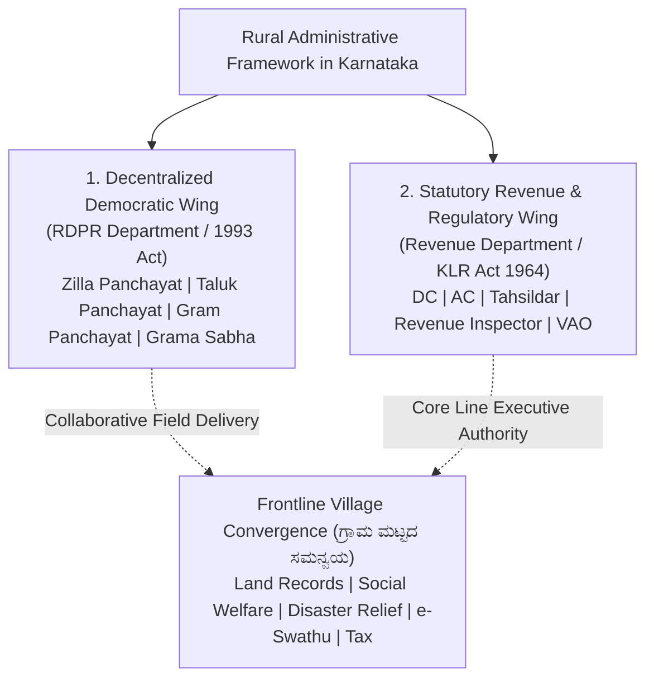
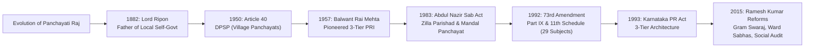
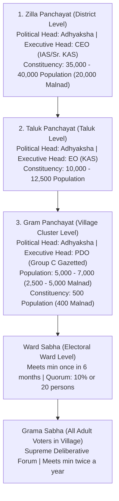
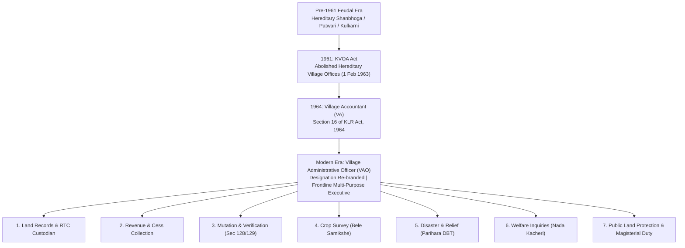
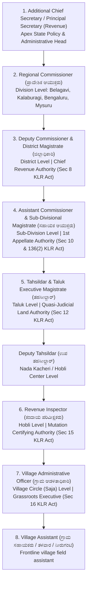
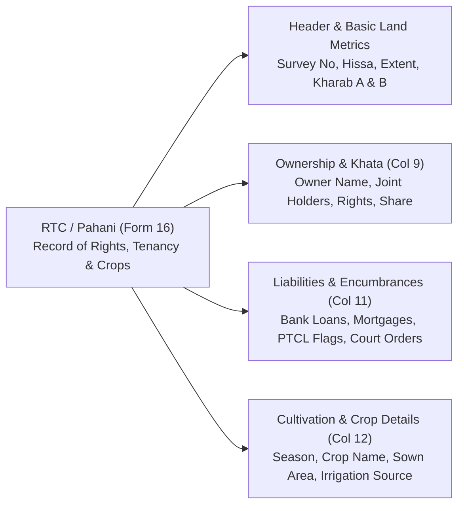
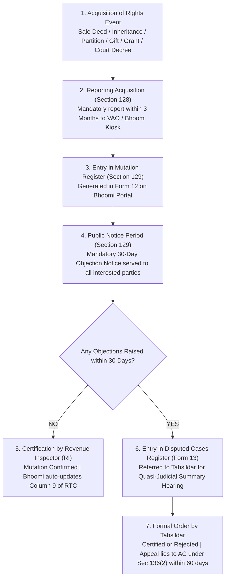
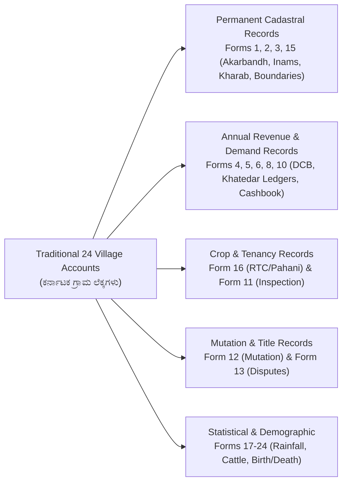
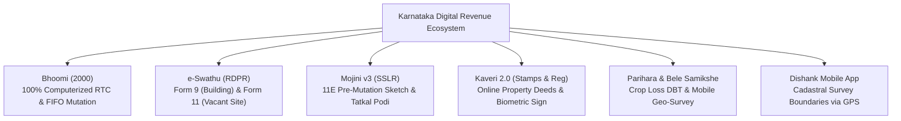

# 10. Panchayat Raj Act & Rural Revenue Administration Deep Dive (ಪಂಚಾಯತ್ ರಾಜ್ & ಗ್ರಾಮ ಆಡಳಿತಾಧಿಕಾರಿಯ ಸಮಗ್ರ ಕೈಪಿಡಿ)

> [!IMPORTANT] Exam Focus & Core Professional Domain
> - **Expected Weightage:** **18–22 Questions (18–22 Marks)** in Paper-I.
> - **Why this note is critical:** Since this examination is specifically recruiting **Village Administrative Officers (VAO / ಗ್ರಾಮ ಆಡಳಿತಾಧಿಕಾರಿ)**, KEA tests this domain with deep technical, statutory, and scenario-based questions that general GK books miss.
> - **Master Focal Points:**
>   1. **Constitutional PRIs & Karnataka Legacy:** 73rd Amendment (Articles 243 to 243-O, 11th Schedule 29 subjects); Abdul Nazir Sab's 1983 Act; 1993 Act; K.R. Ramesh Kumar Committee 2015 amendments (*Grama Swaraj*).
>   2. **3-Tier Structure & Rules:** Gram, Taluk, Zilla Panchayats; population criteria; 50% women reservation; standing committees; Grama Sabha & Ward Sabha powers and social audit; Section 49 no-confidence motion.
>   3. **The VAO Role & Hierarchy:** KLR Act 1964 Sections 16, 17, 18; Revenue chain (DC $\to$ AC $\to$ Tahsildar $\to$ RI $\to$ VAO $\to$ Village Assistant); village circle (*Saja*) operations.
>   4. **Land Records Anatomy:** Full 12-column breakdown of **RTC / Pahani (Form 16)**; Kharab A vs Kharab B; Col 9, 11, and 12 rules.
>   5. **Mutation Workflows:** KLR Act Sections 128 (3-month reporting) & 129 (30-day notice, Form 12); disputed register (Form 13); appeal process under Section 136(2) and revision under 136(3).
>   6. **Village Registers & Jamabandi:** Traditional 24 Village Accounts and computerized counterparts; annual Jamabandi settlement.
>   7. **Encroachment & Public Lands:** Protection of Gomala, lake beds, burial grounds; Sections 192A, 192B; Form 50/53/57 Akrama-Sakrama; PTCL Act 1978; KVOA Act 1961.
>   8. **Digital Governance:** Bhoomi (FIFO mutation), e-Swathu (Form 9 & Form 11), Mojini v3 (11E sketch, Tatkal Podi), Parihara, Bele Samikshe, and Dishank app.

---

## 1. Master Operational Overview



---

## 2. Constitutional Foundation & Panchayat Raj Evolution in Karnataka



### 1. Constitutional Milestones & Key Committees
- **Lord Ripon's Resolution (1882):** Acclaimed as the **"Magna Carta of Local Self-Government in India"**; Lord Ripon is recognized as the *Father of Local Self-Government in India*.
- **Article 40 of Indian Constitution (Part IV - DPSP):** Directs that the State shall take steps to organize village panchayats and endow them with necessary powers and authority.
- **National Advisory Committees:**
  1. **Balwant Rai Mehta Committee (1957):** Recommended a **3-tier Panchayati Raj system** (Gram Panchayat, Panchayat Samiti, Zilla Parishad) and coined the philosophy of **Democratic Decentralization**.
  2. **Ashok Mehta Committee (1977):** Recommended replacing the 3-tier system with a **2-tier system** (Mandal Panchayat covering 15,000–20,000 population and Zilla Parishad at district level). Strongly influenced Karnataka's 1983 Act.
  3. **G.V.K. Rao Committee (1985):** Appointed by Planning Commission; described bureaucracy-dominated rural development as *"grass without roots"*; recommended making the district the basic unit of planning and regular elections.
  4. **L.M. Singhvi Committee (1986):** Recommended **Constitutional recognition, protection, and preservation** for Panchayati Raj institutions, along with the creation of Nyaya Panchayats.
  5. **P.K. Thungon Committee (1988):** Endorsed constitutional entrenchment of 3-tier PRIs with a fixed 5-year tenure.

### 2. The 73rd Constitutional Amendment Act, 1992
- Enacted in 1992; came into statutory effect on **24 April 1993** (celebrated annually as **National Panchayati Raj Day**).
- Added **Part IX** to the Constitution titled *"The Panchayats"* (Articles 243 to 243-O).
- Added the **Eleventh Schedule (11th Schedule)** specifying **29 Functional Subjects** devolved to Panchayats.

### 3. Karnataka's Pioneering Heritage: Abdul Nazir Sab & The 1983 Act
- Karnataka has historically led India in rural decentralization:
  - Mysore Local Boards Act, 1902 & Mysore Village Panchayats Act, 1952.
  - Mysore Village Panchayats and Local Boards Act, 1959.
- **The Watershed 1983 Act:**
  - Enacted by the Janata Party Government under Chief Minister **Ramakrishna Hegde** and visionary Rural Development Minister **Abdul Nazir Sab** (popularly hailed as **"Neer Sab"** for drilling drinking water borewells across rural Karnataka).
  - Titled *The Karnataka Zilla Parishads, Taluk Panchayat Samithis, Mandal Panchayats and Nyaya Panchayats Act, 1983* (received Presidential assent in 1985; enacted in 1987).
  - Adopted the Ashok Mehta Committee model: Created powerful **Zilla Parishads** headed by an elected Adhyaksha with rank of Minister of State, and **Mandal Panchayats** at cluster level, devolving substantial administrative powers and finances.
  - Served as the practical living template for the Union Government when drafting the 73rd Constitutional Amendment!

### 4. The Karnataka Panchayat Raj Act, 1993 & The 2015 "Gram Swaraj" Overhaul
- **1993 Act:** Enacted on **30 April 1993** (came into force 10 May 1993) under Chief Minister M. Veerappa Moily to bring Karnataka's legal framework into full compliance with the 73rd Amendment. Restored the 3-tier hierarchy (Gram, Taluk, Zilla).
- **The 2015 Ramesh Kumar Committee Overhaul (Act No. 44 of 2015):**
  - High-power committee chaired by senior legislator **K.R. Ramesh Kumar** submitted landmark recommendations to infuse genuine participatory democracy.
  - **Renamed the Act:** Officially changed to ***The Karnataka Gram Swaraj and Panchayat Raj Act, 1993***.
  - Institutionalized **Habitation Sabhas (ವಸತಿ ಸಭೆ)** and **Ward Sabhas (ವಾರ್ಡ್ ಸಭೆ)** below the Grama Sabha.
  - Made **Social Audit (ಸಾಮಾಜಿಕ ಲೆಕ್ಕಪರಿಶೋಧನೆ)** a mandatory statutory requirement.
  - Codified the concept of **Grama Swaraj** as a constitutional way of life, empowering citizens to prioritize local works and verify public spending.

---

## 3. Statutory Architecture: Articles 243–243-O vs Karnataka Act Sections

```mermaid
flowchart TD
    subgraph CONST["Constitution of India (Part IX)"]
        A243A["Art. 243A: Grama Sabha"]
        A243B["Art. 243B: 3-Tier Constitution"]
        A243C["Art. 243C: Composition"]
        A243D["Art. 243D: Reservation"]
        A243E["Art. 243E: 5-Year Duration"]
        A243F["Art. 243F: Disqualifications"]
        A243G["Art. 243G: 29 Subjects (11th Sched)"]
        A243I["Art. 243-I: State Finance Comm."]
        A243K["Art. 243K: State Election Comm."]
    end
    
    subgraph KARACT["Karnataka Gram Swaraj & PR Act, 1993"]
        S3["Sec. 3 & 3A: Grama/Ward Sabha"]
        S4["Sec. 4, 119, 158: Establishment"]
        S5["Sec. 5, 120, 159: Composition"]
        SRES["Sec. 5 & 123: 50% Women & Caste Quota"]
        SDUR["Sec. 43, 127, 166: Terms"]
        SDISQ["Sec. 12, 128, 167: Disqualification"]
        SPOW["Sec. 58, 145, 184: Functions"]
        SSFC["Sec. 267: Finance Commission"]
        SSEC["Sec. 308: Election Commission"]
    end

    A243A <--> S3
    A243B <--> S4
    A243C <--> S5
    A243D <--> SRES
    A243E <--> SDUR
    A243F <--> SDISQ
    A243G <--> SPOW
    A243I <--> SSFC
    A243K <--> SSEC
```



### Comprehensive Article-to-Section Comparative Matrix

| Article | Constitutional Subject Matter | Corresponding Karnataka Act Section | Key Karnataka Specific Rule / Exam Fact |
| :--- | :--- | :--- | :--- |
| **Art. 243** | Definitions | **Section 2** | Defines Habitation, Ward, Grama Sabha, Adhyaksha, Executive Officer, etc. |
| **Art. 243A** | **Grama Sabha** | **Sections 3, 3A, 3B, 3C** | Comprises all registered adult voters; meets min twice/year; 2015 Act created Ward & Habitation Sabhas. |
| **Art. 243B** | **Constitution of Panchayats** | **Sections 4 (GP), 119 (TP), 158 (ZP)** | Mandatory 3-tier structure across all districts of Karnataka. |
| **Art. 243C** | **Composition of Panchayats** | **Sections 5 (GP), 120 (TP), 159 (ZP)** | GP: 1 member per 400 (Malnad) / 500 (Maidan) residents. Direct universal adult franchise. |
| **Art. 243D** | **Reservation of Seats** | **Sections 5, 123, 162** | **50% reservation for women** across all tiers; SC/ST proportional; OBC Category A (27%) & Category B (4%). |
| **Art. 243E** | **Duration of Panchayats** | **Sections 43 (GP), 127 (TP), 166 (ZP)** | **5-year fixed tenure** from date of first meeting; election must be held before expiry or within 6 months of dissolution. |
| **Art. 243F** | **Disqualification of Members** | **Sections 12, 128, 167** | Minimum age: **21 years**; disqualifications include unsound mind, insolvent, conviction >6 months, lack of sanitary toilet. |
| **Art. 243G** | **Powers, Authority & Duties** | **Sections 58 (GP), 145 (TP), 184 (ZP)** | Devolves **29 Subjects** of the 11th Schedule (agriculture, water, roads, rural housing, social forestry). |
| **Art. 243H** | **Taxes, Funds & Grants** | **Sections 199 to 205** | Gram Panchayats empowered to levy property tax, water tax, market fees, license fees under Schedule IV. |
| **Art. 243-I** | **State Finance Commission** | **Section 267** | Constituted by Governor every 5 years to recommend state tax devolution to PRIs. |
| **Art. 243J** | **Audit of Accounts** | **Section 246** | State Local Fund Audit and CAG guidelines; compulsory Social Audit. |
| **Art. 243K** | **State Election Commission** | **Section 308** | Headed by State Election Commissioner appointed by Governor; superintendence and conduct of all PRI elections. |
| **Art. 243M** | Non-applicability to certain areas | **Section 1(2)** | Excludes urban local bodies (BBMP, City Corporations, CMC, TMC, Town Panchayats). |
| **Art. 243-O** | Bar to interference by courts | **Section 310** | Court interference barred in delimitation and electoral boundaries; election challenged only via Election Petition. |

---

## 4. The Three-Tier Panchayati Raj Institutions (PRIs) in Karnataka



### 1. Gram Panchayat (ಗ್ರಾಮ ಪಂಚಾಯಿತಿ — GP)
- **Establishment & Population Criteria (Section 4):**
  - Declared by Deputy Commissioner for a contiguous territory having a population between **5,000 and 7,000** in plains, and **2,500 and 5,000** in Malnad, hilly, and sparsely populated regions.
- **Electoral Ratio (Section 5):**
  - **One member is elected for every 500 residents** in plains, and **one member for every 400 residents** in Malnad.
  - Direct election via secret ballot using EVMs/ballot papers on a non-party basis.
- **Office of Adhyaksha & Upadhyaksha (Section 44 & 45):**
  - Elected by the chosen GP members from amongst themselves.
  - **Term of Office:** **5 Years** (amended by Act 44 of 2015 to synchronize with the full 5-year lifecycle of the Panchayat; previously rotated every 30 months).
  - **Reservation:** 50% reserved for women across all categories (General, SC, ST, Backward Classes).
- **No-Confidence Motion Rules (Section 49 — Critical Exam Topic):**
  - Motion expressing want of confidence against Adhyaksha or Upadhyaksha cannot be moved **within the first 30 months** of assumption of office.
  - Cannot be moved within **one year before the expiry** of the term.
  - Requires written notice signed by at least **one-half (50%)** of the total members.
  - Must be passed by a majority of **not less than two-thirds (2/3rd)** of the total members present and voting at a meeting presided over by the Assistant Commissioner.
- **Standing Committees of Gram Panchayat (Section 61):**
  1. **General Standing Committee:** Agricultural production, animal husbandry, public works, power, village industries.
  2. **Finance, Audit and Planning Committee:** Budget preparation, revenue collection, financial audit, taxation.
  3. **Social Justice Committee (ಸಾಮಾಜಿಕ ನ್ಯಾಯ ಸಮಿತಿ):**
     - Chaired statutorily by the **Upadhyaksha** of the GP.
     - Must include at least **one woman member** and at least **one member belonging to SC or ST**.
     - Promotes educational, economic, and social welfare of SC/ST, women, and vulnerable classes.
- **Administrative Personnel:**
  - **Panchayat Development Officer (PDO):** Executive secretary of the GP; executes decisions, maintains accounts, exercises disciplinary control over subordinate staff.
  - **Gram Panchayat Secretary (Grade-1 & Grade-2):** Assists PDO; maintains records.
  - **Bill Collector, Data Entry Operator (DEO), Waterman (ನೀರುಗಂಟಿ), and Peon.**

### 2. Taluk Panchayat (ತಾಲೂಕು ಪಂಚಾಯಿತಿ — TP)
- Established at the intermediate Taluk level (Section 119).
- **Electoral Ratio (Section 120):** One directly elected member for every **10,000 to 12,500 population** (or fraction thereof).
- **Ex-Officio Members:** All MLAs and MLCs representing the taluk; one-fifth (1/5th) of the GP Adhyakshas in the taluk rotated annually.
- **Administrative Head:** **Executive Officer (EO / ಇಒ — KAS Junior/Senior Scale)**.
- **Standing Committees (Section 148):** General Standing Committee, Finance/Audit/Planning Committee, Social Justice Committee.

### 3. Zilla Panchayat (ಜಿಲ್ಲಾ ಪಂಚಾಯಿತಿ — ZP)
- Established at the apex District level (Section 158).
- **Electoral Ratio (Section 159):** One directly elected member for every **35,000 to 40,000 population** (or **20,000 to 25,000** in Malnad/hilly regions).
- **Ex-Officio Members:** All MPs (Lok Sabha and Rajya Sabha), MLAs, and MLCs representing the district; all Presidents of Taluk Panchayats in the district.
- **Political Executive:** Adhyaksha and Upadhyaksha elected for a 5-year term.
- **Administrative Head:** **Chief Executive Officer (CEO / ಸಿಇಒ — Senior IAS or Senior Selection Grade KAS)**. The CEO exercises total executive control over all district development departments.
- **The Five Standing Committees of ZP (Section 186):**
  1. General Standing Committee.
  2. Finance, Audit and Planning Committee (Chaired by ZP Adhyaksha).
  3. **Social Justice Committee** (Chaired by ZP Upadhyaksha).
  4. Education and Health Committee.
  5. Agriculture and Industry Committee.

### 4. Direct Democracy: Ward Sabha & Grama Sabha
- **Ward Sabha (ವಾರ್ಡ್ ಸಭೆ — Section 3A):**
  - Comprises all registered adult voters within an electoral ward of a Gram Panchayat.
  - Must meet at least **once in 6 months**.
  - **Quorum:** Not less than **10% of total voters or 20 persons** (whichever is less), of whom at least **30% must be women**.
- **Grama Sabha (ಗ್ರಾಮ ಸಭೆ — Section 3):**
  - Comprises all registered adult voters residing within the revenue villages under the GP.
  - Must meet at least **twice a year** (traditionally conducted around national days: Republic Day, May Day, Independence Day, Gandhi Jayanti).
  - **Quorum:** Not less than **10% of voters or 100 voters** (whichever is less), with proportional SC/ST and 30% women participation.
  - **Supreme Powers:**
    - Final authority for identifying and approving eligible beneficiaries for all state/central housing, pension, and welfare schemes.
    - Conducts mandatory **Social Audit (ಸಾಮಾಜಿಕ ಲೆಕ್ಕಪರಿಶೋಧನೆ)** of all civil works and MNREGS muster rolls.
    - Formulates and ratifies the annual **Gram Panchayat Development Plan (GPDP)**.

---

## 5. The Village Administrative Officer (VAO): History, Profile & Duties



### 1. Historical Evolution of the Office
- **Ayagar Heritage:** In classical Karnataka (Vijayanagara, Nayakas, Wodeyars), village accounts were maintained by hereditary scribes called **Shanbhoga (ಶಾನುಭೋಗ)**, **Patwari (ಪಟವಾರಿ)**, or **Kulkarni (ಕುಲಕರ್ಣಿ)** under the traditional 12-member Ayagar system.
- **Abolition of Hereditary Rights:** The Government enacted the landmark **Karnataka Village Offices Abolition Act, 1961 (KVOA Act 1961)**, which came into full force on **1 February 1963**, legally abolishing all hereditary village offices and resuming Inam lands.
- **Creation of Village Accountant:** The post was officially reconstituted under **Section 16 of the Karnataka Land Revenue Act, 1964** as the **Village Accountant (ಗ್ರಾಮ ಲೆಕ್ಕಿಗ)**, appointed as a non-hereditary civil servant.
- **Re-designation as VAO:** The Government officially renamed the cadre as **Village Administrative Officer (VAO / ಗ್ರಾಮ ಆಡಳಿತಾಧಿಕಾರಿ)** to reflect the expanded contemporary mandate beyond basic arithmetic ledger-keeping to encompass digital administration, disaster management, election logistics, and public welfare distribution.

### 2. Cadre Profile & Administrative Positioning
- **Cadre Classification:** Group 'C' Non-Gazetted Executive Post in the Department of Revenue (ಕಂದಾಯ ಇಲಾಖೆ).
- **Jurisdiction:** In charge of a **Village Circle (ಗ್ರಾಮ ವೃತ್ತ / ಸಜಾ - Saja)**, consisting of one or more revenue villages, hamlets (*Majare*), and thandas/hattigalu.
- **Reporting Hierarchy:**
  - Reports immediately to the **Revenue Inspector (RI / Hobli level)**.
  - Under the administrative supervision of the **Tahsildar (Taluk level)** and **Assistant Commissioner (Sub-division level)**.
  - Head of the Revenue District is the **Deputy Commissioner (DC)**.

### 3. The 7 Core Operational Pillars of the VAO

| Operational Pillar | Statutory Basis | Specific Duties & Daily Responsibilities |
| :--- | :--- | :--- |
| **1. Custody of Land Records** | Sec 16 & 17 KLR Act 1964 | Acts as sole legal custodian of village cadastral maps (*Grama Nakshe*), Akarbandh, Tippani/FMB books, and settlement registers. |
| **2. RTC Maintenance & Crop Survey** | Sec 17 KLR Act & Crop Survey Directives | Conducts physical seasonal field inspection for **Bele Samikshe**; records exact acreage under Kharif, Rabi, and Summer crops in **Column 12 of RTC**. |
| **3. Mutation Processing** | Sec 128 & 129 KLR Act 1964 | Enters acquisition of rights in Mutation Register (**Form 12**); serves **30-day statutory notice** to interested parties; reports objections to RI/Tahsildar. |
| **4. Land Revenue & Cess Collection** | Sec 158 to 180 KLR Act 1964 | Collects land assessment, water rates, road cess, education cess; maintains receipt registers; executes recovery of dues as land revenue arrears. |
| **5. Natural Calamity & Relief (Parihara)** | Karnataka Disaster Management Manual | Conducts immediate spot inspection during droughts, floods, landslides, fire, and crop failure; uploads farmer damage metrics into the **Parihara DBT portal**. |
| **6. Welfare Verification (Nada Kacheri)** | Citizen Services Directives | Conducts spot inquiries and submits field inspection reports for over 35 statutory certificates (Caste, Income, Survivorship, Agriculturist, Landless Laborer). |
| **7. Protection of Government Lands** | Sec 192A & 192B KLR Act | Identifies encroachments on Gomala, lake beds, burial grounds, and Kharab lands; files complaints; assists the Tahsildar in eviction operations. |

---

## 6. Revenue Administration Hierarchy & Appellate Architecture



### Revenue Court & Dispute Appellate Sequence
Under the Karnataka Land Revenue Act, 1964, revenue officers function as quasi-judicial courts:
1. **Initial Mutation Dispute:** Handled by the **Tahsildar** (disputed entries entered in Form 13).
2. **First Appeal (Section 136(2) KLR Act):**
   - Any person aggrieved by an order of the Tahsildar regarding the Record of Rights may file an appeal before the **Assistant Commissioner (AC)** within **60 days**.
3. **Revision Petition (Section 136(3) KLR Act):**
   - The **Deputy Commissioner (DC)** may, either suo motu or on an application, call for and examine any record to satisfy themselves as to the legality or propriety of the AC's order.
4. **Appellate Tribunal / Judicial Review:**
   - Orders of the DC can be appealed before the **Karnataka Appellate Tribunal (KAT)** or challenged via Writ Petition under Articles 226/227 in the **High Court of Karnataka**.
   - Note: A Revenue Court cannot decide intricate questions of legal title; disputed ownership must ultimately be adjudicated by a competent **Civil Court**!

---

## 7. The RTC / Pahani (Form 16) Column-by-Column Deep Dive

The **Record of Rights, Tenancy and Crops (RTC / Pahani — ನಮೂನೆ 16)** is the foundational document of all agricultural land administration in Karnataka.



### Master Column-by-Column Analysis of Form 16

| Column Number | Column Heading in RTC | Crucial Statutory Contents & Legal Rules |
| :---: | :--- | :--- |
| **Header** | District, Taluk, Hobli, Village | Identifies the geographic and administrative location of the parcel. |
| **Col 1** | **Survey Number & Hissa** | The unique cadastral survey number and its official sub-division (*Hissa*). |
| **Col 2** | **Total Extent (ಒಟ್ಟು ವಿಸ್ತೀರ್ಣ)** | Gross total land area measured in **Acres - Guntas - Annas** (1 Acre = 40 Guntas; 1 Gunta = 121 sq yards / 1,089 sq ft). |
| **Col 3** | **Uncultivable Land (Kharab / ಖರಾಬು)** | Uncultivable land classified into two distinct legal categories:<br>• **Kharab A (ಎ-ಖರಾಬು):** Pits, rocks, ridges, uncultivable patches inside private holding; exempt from land assessment but belongs to the landholder.<br>• **Kharab B (ಬಿ-ಖರಾಬು):** Land reserved for public or government purposes (roads, public cart tracks, footpaths, tank beds, streams, burial grounds). **Belongs permanently to the Government; strictly inalienable!** |
| **Col 4** | **Net Cultivable Extent (ಬೀಳು ಬಿಟ್ಟ ವಿಸ್ತೀರ್ಣ)** | Net area available for cultivation (Col 2 Gross Extent minus Col 3 Kharab Extent). |
| **Col 5** | **Soil Assessment (ಕಂದಾಯ / Assessment)** | Statutory land tax/revenue payable to the State Government calculated based on soil fertility classification. |
| **Col 6** | **Water Rate (ಜೋಡಿ / ಜಲ ಕಂದಾಯ)** | Water cess levied on irrigated lands drawing water from state canals, rivers, or public reservoirs. |
| **Col 7** | **Nature of Tenure (ಹಿಡುವಳಿ ವಿವರ)** | Classification of holding: Patta, Rayatwari, Inam, Sarakari (Govt), Sarakari Gomala, etc. |
| **Col 8** | **Khata Number (ಖಾತಾ ಸಂಖ್ಯೆ)** | Unique account number assigned to the landholder in the village revenue ledger. |
| **Col 9** | **Owner Details & Rights (ಮಾಲೀಕರ ಹೆಸರು)** | **Name of the Khatedar/Owner**, father's/husband's name, residence, joint holders' names, and their respective shares. |
| **Col 10** | **Nature of Acquisition & Tenancy** | Mode of acquisition (Purchase, Inheritance, Partition, Government Grant) and tenancy terms (historical). |
| **Col 11** | **Liabilities & Encumbrances (ಋಣಗಳು & ಭಾದ್ಯತೆಗಳು)** | **Most critical column for land buyers and banks!** Records:<br>1. Bank crop loans, mortgage charges, hypothecation.<br>2. **PTCL Restriction Flag:** Indicates if land is SC/ST granted land with non-alienation restrictions.<br>3. Injunctions, attachments, or stay orders passed by Civil Courts.<br>4. Government recovery charges and Section 136 revision notices. |
| **Col 12** | **Crop Details (ಬೆಳೆ ವಿವರ)** | **Updated annually/seasonally by VAO:**<br>1. Season: Kharif (ಮುಂಗಾರು), Rabi (ಹಿಂಗಾರು), Summer (ಬೇಸಿಗೆ).<br>2. Name of standing crop (Ragi, Paddy, Maize, Sugarcane, Arecanut, Mango).<br>3. Area sown under crop vs fallow land (*Beelu*).<br>4. Soil type and water source: Rainfed (*Kushi*), Wet/Canal (*Tari*), Garden (*Bagayat*), Borewell. |

---

## 8. Mutation Workflows: Sections 128 & 129 of KLR Act, 1964

**Mutation (ನಾಮಾಂತರ)** is the formal legal administrative recording of any transfer or change in title, possession, or encumbrance of land in the official Record of Rights.



### 1. Section 128: Acquisition of Rights to be Reported
- Every person acquiring any right in agricultural land by virtue of:
  - Registered Sale Deed (ಖರೀದಿ / ಕ್ರಯ),
  - Inheritance or Succession (ವಾರಸುದಾರಿಕೆ / ಪೌತಿ ಖಾತೆ),
  - Partition (ಕುಟುಂಬ ವಿಭಾಗ / ಪಾಲುಪಟ್ಟಿ),
  - Gift (ದಾನ ಪತ್ರ), Release Deed (ಹಕ್ಕು ಬಿಡುಗಡೆ),
  - Court Decree or Execution,
  - Government Grant (ಸರಕಾರಿ ಮಂಜೂರಾತಿ),
- **Statutory Mandate:** Must report such acquisition to the Village Administrative Officer or through the Bhoomi kiosk **within three (3) months** from the date of acquisition.
- If registered under the Registration Act (via Kaveri 2.0), the Sub-Registrar automatically transmits a digital copy (**J-Slip / Form 21**) directly to Bhoomi!

### 2. Section 129: Mutation Register (Form 12) & 30-Day Notice Rule
- The VAO enters the particulars in the **Mutation Register (Form 12 — ನಮೂನೆ 12)**.
- **The Mandatory 30-Day Notice Period:**
  - Notice is officially issued to all Khatedars, co-owners, and interested parties whose names appear in the Record of Rights.
  - A copy of the notice is prominently affixed on the notice board of the Chavadi (village office) and the Gram Panchayat.
  - An objection window of **exactly 30 days** is provided by law.
- **Confirmation:**
  - If **no objection** is received within 30 days, the **Revenue Inspector (RI)** inspects the file, certifies the mutation, and the Bhoomi system instantly updates the ownership names in Column 9 of the computerized RTC.
- **Disputed Cases (Form 13):**
  - If any valid objection is lodged within 30 days, the VAO cannot certify it.
  - The matter is transferred to the **Register of Disputed Cases (Form 13)**.
  - The **Tahsildar** conducts a quasi-judicial summary inquiry, issues notices, examines evidence, and passes a formal appealable order.

---

## 9. Village Accounts: The 24 Traditional Registers & Jamabandi

Before total computerization under Bhoomi, the Village Accountant was personally required to maintain a set of **24 Village Accounts (ಹಳ್ಳಿಯ ಲೆಕ್ಕಗಳು)** under the Karnataka Land Revenue Rules, 1966.



### The 24 Village Accounts Master Reference Table

| Account No. | Form Title & Purpose | Computerized Equivalent / Modern Status |
| :---: | :--- | :--- |
| **Form 1** | **General Register of Lands (Akarbandh):** Total area, boundaries, soil classification, survey numbers. | Digitized in Bhoomi / KSRSAC spatial database. |
| **Form 2** | **Register of Inam & Manya Lands:** Religious, charitable, and service grants. | Digitized in Bhoomi Inam abolition modules. |
| **Form 3** | **Register of Government & Kharab Lands:** Gomala, lakes, roads, forest, burial grounds. | Digitized in Government Land Bank Portal. |
| **Form 4** | **Register of Fluctuations in Land Revenue:** Increases/decreases due to diluvion, alluvion, or conversion. | Auto-computed in Bhoomi land conversion system. |
| **Form 5** | **Register of Lands Leased by Government:** Leaseholder names, terms, lease rent. | Maintained in Tahsil office lease records. |
| **Form 6** | **Register of Land Revenue Demand (DCB):** Demand, Collection, and Balance ledger of village. | Revenue collection module in Bhoomi. |
| **Form 7** | **Daily Collection Register (Challan Book):** Daily record of tax money collected from ryots. | Digital Treasury (K2 / Khajane II) challan. |
| **Form 8** | **Khatedar Ledger (Khata Book):** Individual ledger account of every landholder in the village. | Bhoomi digital Khata ledger. |
| **Form 9** | **Receipt Book (ಪಾವತಿ ರಸೀದಿ):** Official printed counterfoil receipt given to the farmer upon tax payment. | Digital computerized receipt generated via Bhoomi. |
| **Form 10** | **Day-to-Day Cash Book:** Cash balance maintained by Village Accountant. | Handled via digital treasury interfaces. |
| **Form 11** | **Crop Inspection Register:** Preliminary field notes for seasonal standing crops. | Replaced by the mobile **Bele Samikshe App**. |
| **Form 12** | **Mutation Register (ನಾಮಾಂತರ ವಹಿ):** Records all proposed transfers and acquisition of rights. | Core Bhoomi Mutation Module. |
| **Form 13** | **Disputed Cases Register:** Record of contested mutation entries awaiting Tahsildar inquiry. | Bhoomi Disputed Cases Monitoring System. |
| **Form 14** | **Register of Stray Trees & Forest Produce:** State-owned trees on government lands. | Maintained jointly with Forest Department. |
| **Form 15** | **Register of Boundary Stones & Survey Marks:** Record of missing or damaged boundary stones. | Managed via Mojini spatial survey workflows. |
| **Form 16** | **The Combined RTC / Pahani (ಪಹಣಿ):** Master Record of Rights, Tenancy, and Crops. | **The primary public RTC document generated by Bhoomi.** |
| **Form 17** | **Annual Abstract of Agricultural Statistics:** Gross cropped area, double cropped area. | Directorate of Economics & Statistics portal. |
| **Form 18** | **Register of Irrigation Sources:** Canals, tanks, wells, lift irrigation units. | Minor Irrigation and WRD spatial datasets. |
| **Form 19** | **Rainfall Register (ಮಳೆ ವಹಿ):** Daily rainfall recorded at rain-gauge stations. | KSNDMC (Disaster Monitoring Centre) telemetric network. |
| **Form 20** | **Register of Boundary Disputes & Encroachments:** Spot inquiry records of land encroachments. | Digitized under Land Protection Cells. |
| **Form 21** | **Register of Tenancy & Leases:** Record of tenants under historical land reform acts. | Archival record of Land Tribunals. |
| **Form 22** | **Cattle Census Register (ಪಶು ಗಣತಿ):** Livestock population enumerated every 5 years. | National Animal Disease Control / AH&VS portal. |
| **Form 23** | **Births and Deaths Register (ಜನನ-ಮರಣ ನೋಂದಣಿ):** Civil registration of vital statistics. | Replaced by **e-Janma Portal**. |
| **Form 24** | **Monthly Abstract of Vital Statistics:** Summary of births and deaths submitted to Tahsil office. | Automated via e-Janma. |

### Jamabandi (ಜಮಾಬಂದಿ — Annual Revenue Settlement & Audit)
- **Definition:** The annual inspection, audit, and final settlement of all village revenue records, land tax assessments, and collection registers.
- **Conducting Authority:** Presided over by the **Tahsildar** or the **Assistant Commissioner (AC)** once every agricultural year (between February and April).
- **Core Verification Checklist during Jamabandi:**
  1. Verification of DCB (Demand, Collection, and Balance) of land revenue, water cess, and penalties.
  2. Audit of crop survey statistics (*Bele Samikshe*) against rainfall and drought declarations.
  3. Verification of all pending and certified Mutations under Section 129.
  4. Inspection of government lands (*Gomala, Kharab, Lakes*) to detect unauthorized encroachments.
  5. Scrutiny of social security pensions (Sandhya Suraksha, Widow pension, Disability pension).
  6. Public grievance redressal where village ryots directly present petitions to the presiding officer.

---

## 10. Public Lands, Encroachment & Protective Land Legislation

### 1. Classification of Public & Communal Lands
- **Gomala (ಗೋಮಾಳ — Cattle Pasture Land):**
  - Land reserved under Section 71 of KLR Act for the common grazing of village cattle.
  - Statutory standard: **12 hectares per 100 cattle head**.
  - Reduction or diversion of Gomala land requires the prior sanction of the Deputy Commissioner, subject to cattle population guidelines.
- **Kharab A vs Kharab B:**
  - **Kharab A:** Cultivable land uncultivated due to natural contours inside private boundaries; non-assessed; belongs to farmer.
  - **Kharab B:** Government land dedicated to public utility (roads, water bodies, temples, canals, burial grounds); **strictly cannot be assigned, encroached, or alienated**.
- **Tank Beds & Lake Foreshores (ಕೆರೆ ಅಂಗಳ):**
  - Supreme Court (*Hinch Lal Tiwari case*) and Karnataka High Court directives strictly prohibit the grant, conversion, or regularization of lake bed lands.

### 2. Criminal Liability for Encroachments (Sections 192A, 192B & 192C)
- Introduced by the Karnataka Land Revenue (Amendment) Act, 2007:
  - **Section 192A:** Unlawful occupation or encroachment upon any government land, lake bed, pasture, or public property is a **cognizable criminal offense** punishable with **imprisonment for a term which may extend to 3 years and a fine up to ₹5,000**.
  - **Section 192B:** **Liability of Government Officers:** Any revenue officer (including the **VAO or Revenue Inspector**) who intentionally fails to report encroachments, aids, abets, or connives in the illegal encroachment of government lands is liable for **criminal prosecution and imprisonment up to 3 years**.
  - **Section 192C:** Liability of local authorities and public servants for illegal layout sanctions.

### 3. Akrama-Sakrama Schemes: Regularization of Unauthorized Cultivation
- **Section 94A & 94B of KLR Act (Form 50 & Form 53):** Regularization of historical unauthorized cultivation of government lands by landless agricultural laborers.
- **Section 94C & 94CC (Form 57 & Rural Housing):**
  - **Section 94C:** Regularization of unauthorized construction of residential houses on government lands in rural areas (up to 30x40 feet site).
  - Presided over by a Taluk Committee chaired by the local **MLA**, with the **Tahsildar** serving as Member-Secretary.

### 4. Landmark Protective Statutes Tested in VAO Exams

| Protective Statute | Year | Core Mandate & Crucial Exam Provisions |
| :--- | :---: | :--- |
| **Karnataka Land Reforms Act (KLRA)** | **1961** *(1974 Amendment)* | • Enacted historic land ceiling and abolition of tenancy by Chief Minister **D. Devaraj Urs**.<br>• Slogan: ***"ಉಳುವವನಿಗೇ ಭೂಮಿ" (Land to the Tiller)***.<br>• Formed **Land Tribunals (ಭೂ ನ್ಯಾಯಮಂಡಳಿ)** at Taluk level (chaired by AC with MLA & members) to confer occupancy rights via **Form 7**.<br>• Sections 79A & 79B restricted non-agriculturists from buying farmland (significantly relaxed in 2020). |
| **PTCL Act** *(Prohibition of Transfer of Certain Lands)* | **1978** | • **Protects SC/ST Grantees:** Completely prohibits the transfer, sale, gift, or mortgage of lands granted by the Government to persons belonging to SC or ST without prior government permission.<br>• **Null and Void:** Any sale made in violation is *null and void ab initio*.<br>• Under **Sections 4 & 5**, the **Assistant Commissioner (AC)** has summary powers to evict purchasers and restore the land to the original grantee or their heirs. |
| **KVOA Act** *(Karnataka Village Offices Abolition Act)* | **1961** *(In force 1 Feb 1963)* | • Abolished all traditional hereditary village offices (Shanbhoga, Patwari, Kulkarni, Talawara, Thoti, Neeraganti).<br>• Resumed all *Inam* lands granted for village service.<br>• Provided for re-grant of resumed lands to erstwhile office-holders under Section 5 upon payment of occupancy price. |

---

## 11. Digital Revenue Portals & E-Governance Ecosystem



### 1. Bhoomi Portal (ಭೂಮಿ ತಂತ್ರಾಂಶ — Pioneer of India)
- Conceived and implemented across all taluks in Karnataka between **2000 and 2002** under the visionary leadership of **Rajeev Chawla, IAS**.
- Digitally manages over **2.5 crore agricultural holdings** across the state.
- **First-In, First-Out (FIFO) Rule:** When an application for mutation is registered, it enters an automated digital FIFO queue. Officials are legally prohibited from arbitrarily jumping queues, eliminating bribery and favoritism.
- **Biometric & DSC Integrity:** No revenue entry, mutation order, or record alteration can occur without the cryptographic **Digital Signature Certificate (DSC)** and biometric thumb-print of the authorized Tahsildar / Revenue Inspector.

### 2. e-Swathu (ಇ-ಸ್ವತ್ತು — Rural Property Governance)
- Implemented across all **Gram Panchayats** under the RDPR Department to eliminate fraudulent transactions, unauthorized rural layouts, and double-registrations.
- **Form 9 (ನಮೂನೆ 9):**
  - Official property assessment register extract issued **strictly for built residential properties** located inside the legally recognized **Grama Thana (village settlement boundary)**.
  - Requires proof of building license, electricity connection, and property tax payment.
- **Form 11 (ನಮೂನೆ 11):**
  - Property assessment register extract issued for **vacant residential sites** inside Grama Thana or legally approved layout sites.
- **Registration Bar:** Sub-Registrars under the Department of Stamps and Registration **are legally barred from registering any rural property without a digitally signed e-Swathu Form 9 or 11!**

### 3. Mojini v3 (ಮೋಜಣಿ — Survey and Land Records)
- Developed by the Department of Survey Settlement and Land Records (SSLR).
- **11E Sketch (ನಮೂನೆ 11E):**
  - A pre-mutation survey sketch prepared by a licensed government/private surveyor under **Section 131(c) of KLR Act**.
  - **Mandatory requirement** before registering the sale or transfer of an undivided portion of an agricultural survey number.
- **Tatkal Podi (ತತ್ಕಾಲ್ ಪೋಡಿ):**
  - Streamlined workflow for carrying out rapid single-window survey partitioning of joint family holdings, converting cumbersome joint-khata lands into independent survey hissas.

### 4. Bele Samikshe (ಬೆಳೆ ಸಮೀಕ್ಷೆ — Mobile Crop Survey)
- Flagship agricultural mobile application in Karnataka.
- Allows farmers to take **geotagged and timestamped photographs** of their standing crops in the field and upload them directly.
- **VAO Validation Duty:** Village Administrative Officers physically ground-truth and validate a prescribed sample percentage of crop survey entries.
- The validated crop data automatically updates **Column 12 of the RTC** and serves as the sole authoritative basis for:
  1. Minimum Support Price (MSP) grain procurement.
  2. Direct Benefit Transfer of drought/flood relief under Parihara.
  3. Pradhan Mantri Fasal Bima Yojana (PMFBY) crop insurance payouts.

### 5. Dishank (ದಿಶಾಂಕ್ ಮೊಬೈಲ್ ಆ್ಯಪ್)
- Innovative mobile GIS application developed by the **Karnataka State Remote Sensing Applications Centre (KSRSAC)**.
- Uses the smartphone's real-time GPS location overlaid on georeferenced digitized cadastral maps (*Akarbandh* & village maps).
- Enables the citizen or VAO standing on any patch of land to immediately identify the exact **Survey Number, Hissa Number, village name, and whether the parcel is private patta land or government kharab/lake bed!**

---

## 12. High-Yield 50 Fact Sheet (Panchayat Raj & VAO Administration)

1. The **73rd Constitutional Amendment Act** came into force on **24 April 1993**, celebrated as **National Panchayati Raj Day**.
2. **Part IX** (Articles 243 to 243-O) and the **11th Schedule** (29 subjects) were inserted into the Constitution by the 73rd Amendment.
3. **Lord Ripon's 1882 Resolution** is hailed as the Magna Carta of local self-government in India.
4. **Article 40** of the Directive Principles of State Policy directs the State to organize village panchayats.
5. The **Balwant Rai Mehta Committee (1957)** pioneered the 3-tier Panchayati Raj system in India.
6. The **Ashok Mehta Committee (1977)** recommended a 2-tier system comprising Mandal Panchayats and Zilla Parishads.
7. **Abdul Nazir Sab ("Neer Sab")** introduced the landmark **1983 Panchayat Act** under Ramakrishna Hegde's government.
8. The current governing statute in Karnataka was renamed as ***The Karnataka Gram Swaraj and Panchayat Raj Act, 1993*** in **2015**.
9. The 2015 overhaul was based on the comprehensive recommendations of the **K.R. Ramesh Kumar Committee**.
10. Karnataka provides **50% reservation for women** across all tiers and offices in Panchayati Raj institutions.
11. A Gram Panchayat is formed for a population cluster of **5,000 to 7,000** in plains, and **2,500 to 5,000** in Malnad.
12. One GP member is elected for every **500 people** in plains, and every **400 people** in Malnad.
13. The elected tenure of a Gram Panchayat is **5 years** from the date of its first meeting.
14. The term of GP Adhyaksha and Upadhyaksha in Karnataka is **5 years** (as amended by Act 44 of 2015).
15. A No-Confidence Motion under **Section 49** cannot be moved within the **first 30 months** of assumption of office.
16. A No-Confidence Motion against a GP Adhyaksha requires a **two-thirds (2/3rd)** majority of total members.
17. The **Social Justice Committee** of a Gram Panchayat is statutorily chaired by the **Upadhyaksha**.
18. The administrative and executive head of a Gram Panchayat is the **Panchayat Development Officer (PDO)**.
19. A Taluk Panchayat member represents a population of **10,000 to 12,500**.
20. The executive head of a Taluk Panchayat is the **Executive Officer (EO)** belonging to the KAS cadre.
21. A Zilla Panchayat member represents a population of **35,000 to 40,000** (20,000 in Malnad).
22. The executive head of a Zilla Panchayat is the **Chief Executive Officer (CEO)**, an IAS or senior KAS officer.
23. The **Grama Sabha** comprises all registered adult voters in the village and must meet at least **twice a year**.
24. A **Ward Sabha** comprises all voters in an electoral ward and must meet at least **once every 6 months**.
25. Quorum for a Ward Sabha is **10% of voters or 20 persons**, with at least **30% women**.
26. The **State Election Commission** for PRIs is established under **Article 243K** and **Section 308** of the Karnataka Act.
27. The **State Finance Commission** is constituted every 5 years under **Article 243-I** and **Section 267**.
28. The Village Administrative Officer was traditionally known as the **Shanbhoga, Patwari, or Kulkarni**.
29. The **Karnataka Village Offices Abolition Act (KVOA Act)** abolished hereditary village offices w.e.f. **1 February 1963**.
30. The Village Administrative Officer is appointed under **Section 16 of the Karnataka Land Revenue Act, 1964**.
31. The jurisdiction of a VAO is known as a **Village Circle or Saja (ಸಜಾ)**.
32. The official form number of the **RTC / Pahani** is **Form 16 (ನಮೂನೆ 16)**.
33. **Column 9** of the RTC contains the **Name of the Khatedar / Owner and their share**.
34. **Column 11** of the RTC contains **Liabilities, Bank Mortgages, Court Orders, and PTCL Flags**.
35. **Column 12** of the RTC contains **Crop Details, Sown Area, Season, and Irrigation Source**.
36. **Kharab A** land is uncultivable private land inside holding; exempt from assessment.
37. **Kharab B** land is state land reserved for public utility (roads, lakes, streams); **strictly inalienable**.
38. **One Gunta** is equal to **121 square yards** or **1,089 square feet** (40 Guntas = 1 Acre).
39. Acquisition of land rights must be reported under **Section 128 of KLR Act** within **3 months**.
40. The Mutation Register is maintained in **Form 12 (ನಮೂನೆ 12)** under **Section 129**.
41. The statutory public objection notice period under Section 129 is **30 days**.
42. Disputed mutation cases are entered in **Form 13** and adjudicated by the **Tahsildar**.
43. A First Appeal against a Tahsildar's mutation order lies to the **Assistant Commissioner (AC)** under **Section 136(2)** within **60 days**.
44. A Revision Petition against an AC's order lies to the **Deputy Commissioner (DC)** under **Section 136(3)**.
45. **Jamabandi** is the annual settlement and audit of village land revenue accounts conducted by the Tahsildar or AC.
46. Encroachment of government land is a cognizable criminal offense under **Section 192A of KLR Act** (up to 3 years jail).
47. Under **Section 192B**, revenue officers conniving in encroachments face criminal prosecution and imprisonment.
48. In e-Swathu, **Form 9** is issued for built-up houses inside Grama Thana, while **Form 11** is for vacant sites.
49. An **11E Sketch** prepared under Mojini is mandatory before registering the sale of a portion of a survey number.
50. The **Dishank mobile app** was developed by **KSRSAC** to display live survey boundaries via smartphone GPS.

---

## 13. Probable VAO Exam Questions & Answers

1. **[KEA VAO PYQ]** *Under Section 49 of the Karnataka Gram Swaraj and Panchayat Raj Act, within what period can a No-Confidence Motion NOT be moved against an Adhyaksha after election?*
   - **Answer:** Within the **first 30 months** of assumption of office.
2. **[KEA PYQ]** *In an RTC (Pahani) issued under Form 16, which column records the liabilities, bank mortgages, and court injunctions?*
   - **Answer:** **Column 11 (ಋಣಗಳು ಮತ್ತು ಭಾದ್ಯತೆಗಳು)**.
3. **[Expected Question]** *What is the statutory standard for allocating Gomala (cattle grazing land) in Karnataka?*
   - **Answer:** **12 hectares per 100 cattle head** under Section 71 of the Karnataka Land Revenue Act, 1964.
4. **[Expected Question]** *What is the statutory time limit for reporting an acquisition of rights in agricultural land under Section 128 of the KLR Act, 1964?*
   - **Answer:** Within **three (3) months** from the date of acquisition.
5. **[Expected Question]** *Under which section of the Karnataka Land Revenue Act is encroachment on government land declared a cognizable criminal offense?*
   - **Answer:** **Section 192A** (punishable with imprisonment up to 3 years and fine).
6. **[Expected Question]** *What is the primary legal distinction between Kharab A land and Kharab B land in Column 3 of an RTC?*
   - **Answer:** **Kharab A** is private uncultivable land exempt from assessment; **Kharab B** is state land reserved for public purposes (roads, lakes, tanks) and is strictly inalienable.
7. **[Expected Question]** *In the e-Swathu portal, which form serves as the assessment list extract for vacant residential layout sites in rural Grama Thana areas?*
   - **Answer:** **Form 11 (ನಮೂನೆ 11)**.
8. **[Expected Question]** *Before whom does a statutory first appeal lie against a Tahsildar's order regarding Record of Rights under Section 136(2) of the KLR Act?*
   - **Answer:** Before the **Assistant Commissioner (AC / ಸಹಾಯಕ ಆಯುಕ್ತರು)** within a period of 60 days.

---

## 14. Quick Revision Box

```
┌────────────────────────────────────────────────────────────────────────┐
│ PANCHAYAT RAJ & VAO ADMINISTRATION CHEAT SHEET                        │
│ • 73rd Amendment: 24 April 1993, Part IX (243-243O), 11th Sched (29 sub)│
│ • Abdul Nazir Sab: 1983 Watershed Act (Zilla Parishad & Mandal).       │
│ • 2015 Reforms: Ramesh Kumar Committee (Gram Swaraj & Ward Sabhas).    │
│ • Women Quota: 50% across all tiers and offices in Karnataka.          │
│ • GP Criteria: 5,000-7,000 (Plains) | 2,500-5,000 (Malnad). 5-yr term. │
│ • No-Confidence (Sec 49): Barred in first 30 months; 2/3rd majority.   │
│ • Ward Sabha: Meets min once in 6 months; Quorum 10% or 20 persons.    │
│ • Grama Sabha: All adult voters; min twice a year; Social Audit.       │
│ • VAO Appointment: Section 16 KLR Act 1964 (in charge of Saja / Circle)│
│ • KVOA Act: Abolished Shanbhoga/Patwari hereditary posts (1 Feb 1963). │
│ • Hierarchy: DC (Dist) -> AC (Sub-Div) -> Tahsildar -> RI -> VAO.      │
│ • RTC (Form 16): Col 9 (Owner), Col 11 (Loans/PTCL), Col 12 (Crops).   │
│ • Kharab: A = Private uncultivable; B = Govt public utility (No sale!). │
│ • Mutation: Sec 128 (Report in 3 months); Sec 129 (Form 12, 30d notice)│
│ • Appeals: Tahsildar order -> Appeal to AC (Sec 136(2)) within 60 days │
│   -> Revision to DC (Sec 136(3)).                                      │
│ • Jamabandi: Annual land revenue account settlement & audit by Tahsildar│
│ • Encroachment: Sec 192A (3 yrs jail); Sec 192B (Officer liability).   │
│ • e-Swathu: Form 9 (Grama Thana house), Form 11 (Vacant plot).         │
│ • Mojini: 11E Pre-mutation sketch | Dishank: GPS Cadastral survey app. │
│ • PTCL Act 1978: SC/ST land sale without govt nod is void ab initio.   │
└────────────────────────────────────────────────────────────────────────┘
```

---
*Related Notes:*
- [[07_Panchayat_Raj_Act_and_Rural_Administration]]
- [[../04_Current_Affairs_GK/02_Karnataka_Revenue_Systems_and_Digitization]]
- [[06_Indian_Constitution_and_Polity]]
- [[08a_Karnataka_History_Early_Dynasties]]
- [[08b_Karnataka_History_Vijayanagara_to_Modern]]
- [[09_Karnataka_Geography_Deep_Dive]]
