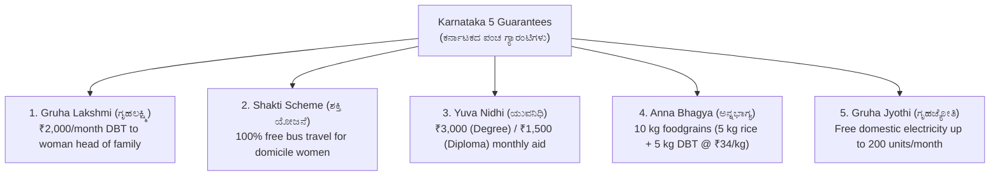

# 01. Karnataka Government Guarantee Schemes & Welfare 2026 (ಪಂಚ ಗ್ಯಾರಂಟಿ ಯೋಜನೆಗಳು)

> [!IMPORTANT] Exam Focus & Mark Potential
> - **Expected Weightage:** **16–20 Questions (16–20 Marks)** in Paper-I.
> - **Core Focus for VAO Candidates:** Since the Village Administrative Officer handles ground-level DBT verification, beneficiary surveys, and Nada Kacheri issues, questions on the 5 Guarantee Schemes are guaranteed.
> - **Financial Magnitude:** ₹51,286 crore allocated in the 2026–27 State Budget (total budget ₹4,48,004 crore).

---

## 1. Executive Summary of the Five Guarantee Schemes



---

## 2. In-Depth Operational Breakdown

### 1. Gruha Lakshmi (ಗೃಹಲಕ್ಷ್ಮಿ ಯೋಜನೆ)
- **Objective:** Economic empowerment of women and combating inflationary pressure on rural families.
- **Financial Benefit:** **₹2,000 per month** transferred directly via Aadhaar-enabled DBT to the bank account of the female head of the family (ಯಜಮಾನಿ).
- **Eligibility:**
  - Woman named as the head of the family in Antyodaya (AAY), BPL, or APL ration cards.
  - Exclusions: Female head or her husband paying Income Tax or filing GST returns.
  - Registration: Conducted through Grama One, Karnataka One, and Bapuji Seva Kendras.

### 2. Shakti Scheme (ಶಕ್ತಿ ಯೋಜನೆ)
- **Objective:** Enhancing female workforce participation, mobility, and educational access.
- **Benefit:** **100% Free Travel** for all women and transgender persons residing in Karnataka.
- **Operational Scope:**
  - Valid on 4 State Road Transport Corporations: **KSRTC, BMTC, NWKRTC, and KKRTC**.
  - Operates on City, Ordinary, and Express bus services within Karnataka.
  - Excludes luxury and inter-state services (Airavat, Club Class, Flybus, Rajahamsa, Non-AC Sleepers).
  - Identification: Government-issued photo identity card with Karnataka domicile address (Voter ID, Aadhaar, Driving License).

### 3. Yuva Nidhi (ಯುವನಿಧಿ ಯೋಜನೆ)
- **Objective:** Financial safety net and skill enhancement for educated unemployed youth.
- **Financial Benefit:**
  - **₹3,000 per month** for unemployed Degree Graduates.
  - **₹1,500 per month** for unemployed Diploma Holders.
- **Eligibility Criteria:**
  - Beneficiary must have passed their degree/diploma in the recent academic cycles and remained unemployed for **at least 6 months**.
  - Benefit continues for a **maximum period of 2 years** or until the candidate secures employment or self-employment (whichever is earlier).
  - Beneficiaries must complete periodic skill assessment declarations on the Seva Sindhu portal.

### 4. Anna Bhagya (ಅನ್ನಭಾಗ್ಯ ಯೋಜನೆ)
- **Objective:** Eradication of hunger and ensuring household food security.
- **Benefit:** Total of **10 kg free foodgrains** per person per month for BPL and Antyodaya households.
- **Operational Mechanism:**
  - 5 kg of rice is provided free by the Central Government under PMGKAY.
  - The remaining 5 kg is guaranteed by the Karnataka Government. Where physical rice grain procurement is limited, the State transfers **cash DBT directly at ₹34 per kg** (i.e., **₹170 per person per month** into the bank account of the cardholder).

### 5. Gruha Jyothi (ಗೃಹಜ್ಯೋತಿ ಯೋಜನೆ)
- **Objective:** Providing relief from rising energy costs to domestic households.
- **Benefit:** **Free domestic electricity up to 200 units** per month.
- **Calculation Rule:**
  - Entitlement is calculated based on the consumer's average monthly consumption for the preceding 12 months plus a **10% buffer**.
  - If the consumer's monthly consumption is within this calculated entitlement (and $\le 200$ units), the bill is generated as **Zero Bill (ಶೂನ್ಯ ಬಿಲ್)**.
  - Commercial connections, farm irrigation pump-sets, and industrial meters are excluded.

---

## 3. High-Yield Mnemonics

> [!NOTE] Memory Aids
> - **Five Guarantees Acronym: "G-S-Y-A-G"**
>   - **G**ruha Lakshmi, **S**hakti, **Y**uva Nidhi, **A**nna Bhagya, **G**ruha Jyothi.
> - **Yuva Nidhi Numbers: "Three Thousand Degree, Fifteen Hundred Diploma"**
>   - Exactly 2:1 ratio for Degree vs Diploma financial assistance.

---

## 4. Likely Exam Questions & PYQ Patterns

1. **[KEA VAO PYQ]** *Under the 'Gruha Lakshmi' scheme of Karnataka, who is the eligible recipient of the ₹2,000 monthly financial benefit?*
   - **Answer:** The woman designated as the head of the household in the ration card.
2. **[Expected Question]** *What is the maximum duration for which an unemployed youth can receive financial assistance under the 'Yuva Nidhi' scheme?*
   - **Answer:** 2 years (or until securing employment/self-employment).
3. **[Expected Question]** *In the 'Anna Bhagya' scheme, when physical rice is unavailable, what is the cash equivalent transferred per kg by the state government?*
   - **Answer:** ₹34 per kg (₹170 per beneficiary per month for 5 kg).
4. **[Expected Question]** *Which types of buses are exempted from the free travel concession under the 'Shakti' scheme?*
   - **Answer:** Luxury and premium inter-state services such as Airavat, Rajahamsa, Non-AC Sleeper, and Flybus.
5. **[Expected Question]** *How is the subsidized electricity entitlement calculated for a domestic consumer under 'Gruha Jyothi'?*
   - **Answer:** Average monthly consumption of the past 12 months + 10% buffer (up to a ceiling of 200 units).

---

## 5. Quick Revision Box

```
┌────────────────────────────────────────────────────────────────────────┐
│ KARNATAKA GUARANTEE SCHEMES 2026 REVISION CHEAT SHEET                  │
├────────────────────────────────────────────────────────────────────────┤
│ • Budget 2026-27 Allocation: ₹51,286 Crore for 5 Guarantees.           │
│ • Gruha Lakshmi: ₹2,000/month DBT to woman head of family.             │
│ • Shakti Scheme: 100% free bus travel for domicile women (ordinary/exp)│
│ • Yuva Nidhi: ₹3,000 (Degree) / ₹1,500 (Diploma) monthly for max 2 yrs.│
│ • Anna Bhagya: 10 kg/person (5 kg Central + 5 kg State / ₹34/kg DBT).   │
│ • Gruha Jyothi: Free power up to 200 units (12-month avg + 10% buffer).│
│ • Mukhya Mantri Saura Krishi Yojane: Solar power for farm pump-sets.   │
└────────────────────────────────────────────────────────────────────────┘
```

---
*Related Notes:*
- [[02_Karnataka_Revenue_Systems_and_Digitization]]
- [[../03_Notes/07_Panchayat_Raj_Act_and_Rural_Administration]]
