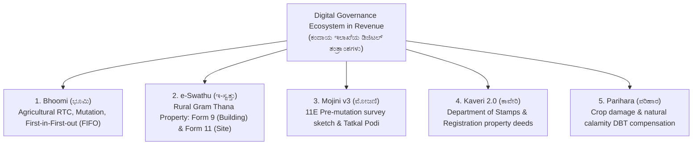

---exam: KEA VAO (Village Administrative Officer)
subject: Paper I - General Knowledge & E-Governance
topic: Karnataka Revenue Systems & Digital Governance (ಕಂದಾಯ ವ್ಯವಸ್ಥೆ ಮತ್ತು ಡಿಜಿಟಲೀಕರಣ)
priority: Tier 1 (14-16 Marks - Highly Relevant to VAO Role)
tags:
  - vao
  - revenue-systems
  - bhoomi
  - e-swathu
  - kaveri
  - parihara
  - paper-1
  - high-yield
syllabus_refs:
  - P1-VAO-RDPR-4.5
last_verified: 2026-09-30
sources:
  - Karnataka SSLR Department Manuals
  - Bhoomi & Mojini Technical Documentation
---

# 02. Karnataka Revenue Systems & Digital Governance (ಕಂದಾಯ ವ್ಯವಸ್ಥೆ ಮತ್ತು ಡಿಜಿಟಲೀಕರಣ)

> [!IMPORTANT] Exam Focus & Mark Potential
> - **Expected Weightage:** **14–16 Questions** in Paper-I.
> - **Core Systems Tested:** Bhoomi (Computerized RTC & Mutation Workflow), e-Swathu (Rural Property Forms 9 & 11), Mojini v3 (11E Pre-mutation sketch), Kaveri 2.0 (Online Property Registration), Parihara (Disaster Compensation DBT), and e-Kshana / Kutumba citizen registries.

---

## 1. Digital Ecosystem of Karnataka Revenue Administration

Karnataka is the national pioneer in land records computerization, eliminating discretion and corruption through integrated digital governance platforms.



---

## 2. In-Depth Operational Breakdown of Revenue Portals

### 1. Bhoomi Project (ಭೂಮಿ ತಂತ್ರಾಂಶ)
- Launched across Karnataka between 2000 and 2002 under the leadership of **Rajeev Chawla, IAS**.
- Digitally manages over 20 million agricultural land records across 31 districts.
- **First-in, First-out (FIFO) Mutation Process:** When an application for change of ownership (mutation) is filed, it is automatically assigned in chronological sequence. Officials cannot arbitrarily jump queues.
- **Section 129 Notice:** Notice is served to all interested parties with a mandatory **30-day objection period** before confirmation of mutation by the Revenue Inspector.
- **Biometric & DSC Security:** No record can be altered without the cryptographic digital signature of the authorized Tahsildar / Revenue Inspector.

### 2. e-Swathu (ಇ-ಸ್ವತ್ತು - Rural Property Management)
- Implemented across all Gram Panchayats in Karnataka under the Rural Development and Panchayat Raj (RDPR) department to eliminate unauthorized layout formations and fraudulent property registrations.
- **Form 9 (ನಮೂನೆ 9):**
  - Village site assessment extract for properties with **residential buildings** situated inside the legally recognized **Grama Thana (village settlement area)**.
  - Requires proof of building sanction, electricity connection, and property tax payment.
- **Form 11 (ನಮೂನೆ 11):**
  - Village site assessment extract for **vacant residential plots** or approved layout sites.
- **Registration Integration:** Sub-Registrars under the Registration Department **cannot legally register any rural property sale deed without an authenticated digital e-Swathu Form 9 or 11!**

### 3. Mojini v3 (ಮೋಜಣಿ v3 - Digital Survey Workflow)
- **11E Sketch (ನಮೂನೆ 11E):** Pre-mutation sketch prepared by a surveyor under Section 131(c) of the Karnataka Land Revenue Act before registering a partitioned or sold sub-division of an agricultural survey number.
- **Tatkal Podi (ತತ್ಕಾಲ್ ಪೋಡಿ):** Rapid single-window system to clear backlogs of joint family land partition and assign independent survey hissa numbers.

### 4. Kaveri 2.0 (ಕಾವೇರಿ 2.0 - Online Registration Portal)
- End-to-end web portal launched by the Department of Stamps and Registration.
- Citizens draft deeds, calculate stamp duty, book appointment slots, and pay fees online.
- SRO visit is reduced to **less than 15 minutes** purely for biometric verification and webcam photograph.
- Fully interconnected with Bhoomi (for agricultural title validation) and e-Swathu (for rural residential validity).

### 5. Parihara Portal (ಪರಿಹಾರ - Disaster Relief DBT)
- Direct Benefit Transfer (DBT) portal for farmers suffering crop loss due to drought, floods, landslides, or hailstorms.
- **Bele Samikshe (ಬೆಳೆ ಸಮೀಕ್ಷೆ):** Farmers self-upload geotagged photos of standing crops via a mobile application. The data is validated by Village Administrative Officers.
- Compensation calculated under SDRF/NDRF norms is credited directly into Aadhaar-seeded bank accounts without middlemen.

---

## 3. Citizen Certificates: e-Kshana & Kutumba

- **e-Kshana (ಇ-ಕ್ಷಣ):** Web application delivering instantly verified Caste, Income, and Residence certificates without requiring physical visits to Nada Kacheri offices by querying integrated school and family databases.
- **Kutumba (ಕುಟುಂಬ - Social Registry):** Comprehensive entitlement database maintaining verified socioeconomic profiles of every family in Karnataka, ensuring welfare schemes (e.g., Gruha Lakshmi, Anna Bhagya) are disbursed automatically.

---

## 4. High-Yield Mnemonics

> [!NOTE] Memory Aids
> - **Bhoomi Mutation Rule: "FIFO with Thirty Days"**
>   - First-In First-Out rule; **30-day** notice under Section 129.
> - **e-Swathu Document Numbers: "Nine for Nest (House), Eleven for Empty (Site)"**
>   - Form **9** = Built House / Building.
>   - Form **11** = Empty / Vacant Site.

---

## 5. Likely Exam Questions & PYQ Patterns

1. **[KEA VAO PYQ]** *In the e-Swathu system, which form is issued as the assessment extract for built-up houses in Grama Thana areas?*
   - **Answer:** Form 9 (ನಮೂನೆ 9).
2. **[KEA PYQ]** *The online disaster relief payment portal utilized in Karnataka for direct benefit transfer of crop loss compensation is:*
   - **Answer:** Parihara (ಪರಿಹಾರ).
3. **[Expected Question]** *What principle prevents discretion and manual queue-jumping in the Bhoomi mutation workflow?*
   - **Answer:** First-In, First-Out (FIFO) processing.
4. **[Expected Question]** *Which sketch must be prepared through Mojini v3 before the sub-division of an agricultural survey number can be registered?*
   - **Answer:** 11E Sketch.
5. **[Expected Question]** *The property registration portal developed by the Department of Stamps and Registration in Karnataka is called:*
   - **Answer:** Kaveri 2.0 (ಕಾವೇರಿ 2.0).

---

## 6. Quick Revision Box

```
┌────────────────────────────────────────────────────────────────────────┐
│ KARNATAKA REVENUE SYSTEMS & DIGITAL GOVERNANCE REVISION CHEAT SHEET    │
├────────────────────────────────────────────────────────────────────────┤
│ • Bhoomi: Computerized RTC/Pahani & FIFO mutation (30 days notice).    │
│ • e-Swathu: Form 9 (Grama Thana house) & Form 11 (Vacant plot).        │
│ • Mojini v3: 11E pre-mutation sketch & Tatkal Podi workflow.           │
│ • Kaveri 2.0: Online property registration by Stamps & Registration.   │
│ • Parihara: Calamity crop loss compensation directly via DBT.          │
│ • Bele Samikshe: Mobile crop survey validated by VAO.                  │
│ • e-Kshana: Instant online caste & income certificates.                │
│ • Kutumba: Integrated family entitlement database.                     │
└────────────────────────────────────────────────────────────────────────┘
```

---
*Related Notes:*
- [[01_Karnataka_Government_Guarantee_Schemes_2026]]
- [[../03_Notes/07_Panchayat_Raj_Act_and_Rural_Administration]]
