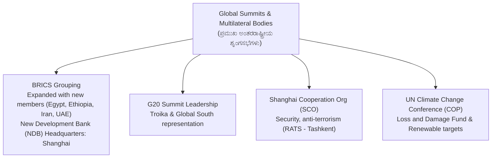
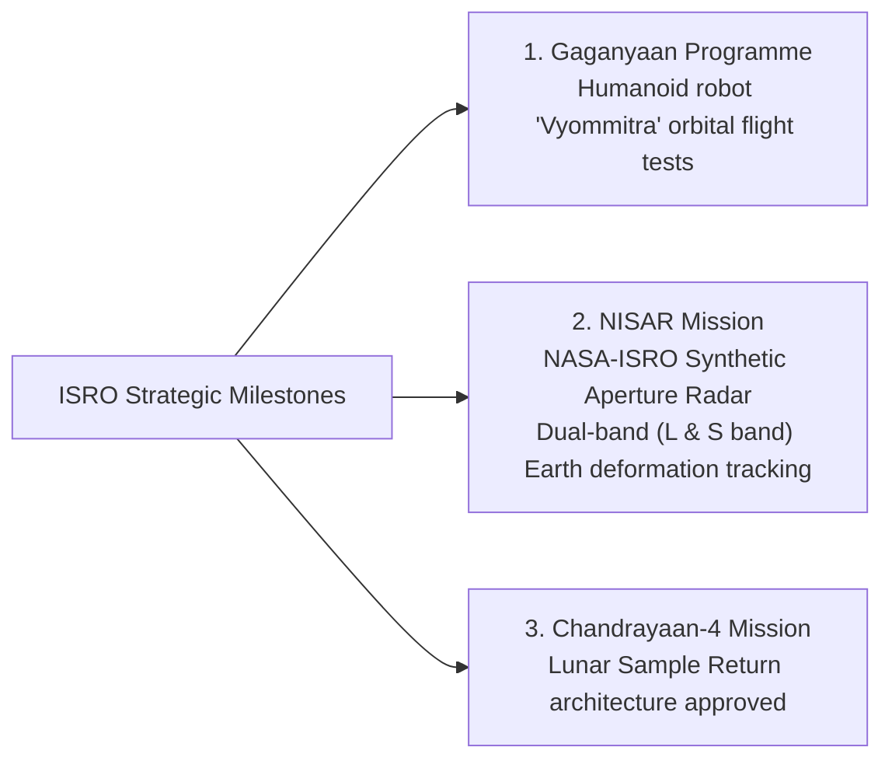

---exam: KEA VAO (Village Administrative Officer)
subject: Paper I - General Knowledge
topic: National & International Current Affairs 2026 (ರಾಷ್ಟ್ರೀಯ & ಅಂತರರಾಷ್ಟ್ರೀಯ ವಿದ್ಯಮಾನಗಳು)
priority: Tier 1 (14-16 Marks)
tags:
  - vao
  - current-affairs
  - national-affairs
  - summits
  - sports
  - isro
  - paper-1
  - high-yield
syllabus_refs:
  - P1-VAO-CA-5.3
  - P1-VAO-CA-5.4
last_verified: 2026-09-30
sources:
  - KEA VAO Official Notification
  - National News Portals & Press Information Bureau (2026)
---

# 03. National & International Current Affairs 2026 (ಪ್ರಚಲಿತ ವಿದ್ಯಮಾನಗಳು)

> [!IMPORTANT] Exam Focus & Mark Potential
> - **Expected Weightage:** **14–16 Questions** in Paper-I.
> - **Core High-Yield Focus:** International Summits & Groupings (BRICS expansion, G20, SCO), ISRO Space Milestones (Gaganyaan, NISAR, Chandrayaan-4), National Awards (Bharat Ratna, Padma Awards 2026), and Major Sports Milestones.

---

## 1. Major International Summits & Multilateral Groupings



### High-Yield Facts Matrix

| Organization / Summit | Headquarters / Location | Key Recent Developments & Exam Significance |
| :--- | :--- | :--- |
| **BRICS** | NDB: Shanghai, China | Expanded beyond original five to include Egypt, Ethiopia, Iran, and UAE. Focus on local currency settlements. |
| **G20** | Rotational Presidency | Focuses on multilateral development bank reforms, digital public infrastructure (DPI), and climate finance. |
| **SCO (Shanghai Cooperation Organisation)** | Secretariat: Beijing, China | RATS (Regional Anti-Terrorist Structure) located in Tashkent, Uzbekistan. |
| **United Nations Climate COP** | UNFCCC | Global stocktake on Paris Agreement emissions; tripling global renewable energy capacity goals. |

---

## 2. ISRO & Indian Science Milestones (2025–2026)



- **Gaganyaan Human Spaceflight:** India's maiden crewed orbital mission. Uncrewed flight tested with female humanoid robot **"Vyommitra"** (ವ್ಯೋಮಮಿತ್ರ - "Friend in Space").
- **NISAR Satellite:** Joint flagship mission between NASA and ISRO utilizing dual-band (L-band and S-band) Synthetic Aperture Radar. Tracks Earth's surface deformation, ice-sheet collapses, and coastal erosion down to millimeter scale.
- **Chandrayaan-4:** Next-generation lunar mission engineered to land on the Moon, collect surface regolith core samples, and launch back to Earth.

---

## 3. National Awards & Cultural Landmarks

- **Bharat Ratna (ಭಾರತ ರತ್ನ):** India's highest civilian honor.
- **Padma Awards 2026 (ಪದ್ಮ ಪ್ರಶಸ್ತಿಗಳು):** Conferred on the eve of Republic Day. Karnataka recipients honored in Yakshagana folk theatre, classical Carnatic music, Bidriware handicraft, and agricultural innovation.
- **Jnanpith Award (ಜ್ಞಾನಪೀಠ ಪ್ರಶಸ್ತಿ):** India's highest literary award. Karnataka has the distinction of winning **8 Jnanpith Awards** (Kuvempu, Da.Ra. Bendre, Shivaram Karanth, Masti Venkatesha Iyengar, V.K. Gokak, U.R. Ananthamurthy, Girish Karnad, Chandrashekhara Kambara).
- **Saraswati Samman:** Eminent literature award instituted by KK Birla Foundation (previously won by S.L. Bhyrappa and Veerappa Moily from Karnataka).

---

## 4. High-Yield Mnemonics

> [!NOTE] Memory Aids
> - **Karnataka Jnanpith Count: "Great Eight Jnanpith"**
>   - Exactly **8 Jnanpith Awards** won by Kannada authors.
> - **ISRO Robot Name: "Vyom-Mitra = Space-Friend"**
>   - Vyoma (Sky/Space) + Mitra (Friend).

---

## 5. Likely Exam Questions & PYQ Patterns

1. **[KEA VAO PYQ]** *How many writers in the Kannada language have been conferred the prestigious Jnanpith Award to date?*
   - **Answer:** 8 writers (Kuvempu was the first in 1967 for *Sri Ramayana Darshanam*).
2. **[Expected Question]** *What is the name of the female humanoid robot developed by ISRO for the uncrewed test missions of the Gaganyaan programme?*
   - **Answer:** Vyommitra (ವ್ಯೋಮಮಿತ್ರ).
3. **[Expected Question]** *The joint satellite mission developed by NASA and ISRO to monitor Earth surface changes with dual-band radar is:*
   - **Answer:** NISAR (NASA-ISRO Synthetic Aperture Radar).
4. **[Expected Question]** *Where is the headquarters of the New Development Bank (NDB) established by BRICS located?*
   - **Answer:** Shanghai, China.
5. **[Expected Question]** *Which Kannada author won the Saraswati Samman for the epic novel 'Mandra'?*
   - **Answer:** Dr. S.L. Bhyrappa.

---

## 6. Quick Revision Box

```
┌────────────────────────────────────────────────────────────────────────┐
│ NATIONAL & INTERNATIONAL AFFAIRS REVISION CHEAT SHEET                  │
├────────────────────────────────────────────────────────────────────────┤
│ • BRICS: Includes Egypt, Ethiopia, Iran, UAE. NDB Head: Shanghai.     │
│ • Gaganyaan: India's crewed space mission; robot is Vyommitra.         │
│ • NISAR: NASA-ISRO Dual frequency (L & S band) Radar satellite.        │
│ • Chandrayaan-4: Lunar sample return mission.                          │
│ • Jnanpith in Kannada: 8 Awards (Kuvempu was first in 1967).           │
│ • SCO: Secretariat in Beijing; RATS in Tashkent, Uzbekistan.           │
│ • New Mangalore Port: Only major port in Karnataka (Gateway of KA).    │
└────────────────────────────────────────────────────────────────────────┘
```

---
*Related Notes:*
- [[01_Karnataka_Government_Guarantee_Schemes_2026]]
- [[02_Karnataka_Revenue_Systems_and_Digitization]]
- [[../03_Notes/04_Karnataka_History_and_Heritage]]
