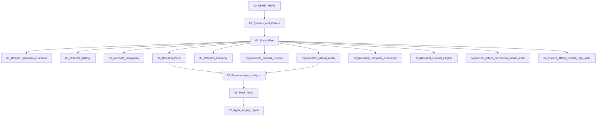

# Karnataka VAO 2026 — Master Study Kit Index

> [!focus] Verified Kit
> Exam date: **04.10.2026**. Pattern confirmed from official KEA notification (`VAO_p05.png`). Paper 1: GK 100 Q / 100 marks / 2 hrs. Paper 2: General Kannada + General English + Computer Knowledge, 100 Q / 100 marks / 2 hrs. See [[02_Syllabus_and_Pattern]].

> [!important] Your starting point. This file is the vault's front door — open it first, every time.

---

## How to Use This Kit

1. **Read this index** to orient. Everything links via `[[wikilinks]]`.
2. **Before you study anything**, read [[02_Syllabus_and_Pattern]] to lock the subject weightage in your head: **Paper 1 (GK) ~45% of study time, Paper 2 (Kannada 20% + English + Computer 15%), Current Affairs ~15%**.
3. **Follow the plan** in [[01_Study_Plan]] — day-by-day schedule with checkboxes. Mark tasks done as you go.
4. **Study subject notes** in [[03_Notes/01_Kannada_Grammar|03_Notes/]] (use the "60-second revision" box at the bottom of each).
5. **Drill practice questions** in [[05_Resources/pyq_analysis]].
6. **Run timed mock tests** in [[06_Mock_Tests/README|06_Mock_Tests/]] — simulate exam conditions.
7. **Check the QA verdict** in [[07_Agent_Log/qa_report]] before relying on any link or claim.

> [!tip] Quick decision tree
> - **3 days left:** follow Day 1–3 schedule in [[01_Study_Plan]].
> - **48 hours left:** jump to the **compressed 2-day track** in [[01_Study_Plan#2-emergency-2-day-compressed-track-48-hour-sprint]].
> - **Need one fact fast:** use Ctrl/Cmd+P → type the subject name (e.g., "Polity") to jump to that note's Quick Revision box.

---

## Vault Contents at a Glance

### Core Study Materials

| # | Deliverable | File | Description |
|---|---|---|---|
| 1 | **Study Plan** | [[01_Study_Plan]] | Day-by-day schedule with revision and mock-test slots |
| 2 | **Syllabus & Pattern** | [[02_Syllabus_and_Pattern]] | Exam weightage, subject breakdown, official source links |

### Subject Notes (`03_Notes/`)

| # | Subject Note | Link | Priority | Covers |
|---|---|---|---|---|
| 01 | Kannada Grammar | [[03_Notes/01_Kannada_Grammar]] | Highest | Sandhi, Samasa, Vibhakti, Pratyaya, synonyms/antonyms, idioms, spellings |
| 02 | History | [[03_Notes/02_History]] | High | Ancient, Medieval, Modern India; Karnataka dynasties; freedom struggle |
| 03 | Geography | [[03_Notes/03_Geography]] | High | India + Karnataka physical, districts, rivers, soils, climate, crops |
| 04 | Polity | [[03_Notes/04_Polity]] | Highest | Constitution, FRs, DPSP, Panchayati Raj, VAO role & duties |
| 05 | Economy | [[03_Notes/05_Economy]] | Medium | Basic econ, agriculture, welfare schemes, rural development |
| 06 | General Science | [[03_Notes/06_General_Science]] | Medium | Physics, Chemistry, Biology, Environment — everyday facts |
| 07 | Mental Ability | [[03_Notes/07_Mental_Ability]] | Medium | Series, coding, blood relations, directions, syllogism, arithmetic |
| 08 | Computer Knowledge | [[03_Notes/08_Computer_Knowledge]] | High | Hardware, software, Internet, email, digital initiatives, cyber security |
| 09 | General English | [[03_Notes/09_General_English]] | High | Grammar, vocabulary, comprehension, error spotting, letter writing |

### Current Affairs & GK (`04_Current_Affairs_GK/`)

| # | Note | Link | Priority | Covers |
|---|---|---|---|---|
| 01 | Current Affairs 2026 | [[04_Current_Affairs_GK/Current_Affairs_2026]] | High | Karnataka governance, guarantee schemes, appointments, budget |
| 02 | GK High Yield | [[04_Current_Affairs_GK/GK_High_Yield]] | High | Static GK tables — facts, dates, symbols, capitals, UN bodies |

### Resources (`05_Resources/`)

| # | Resource | Link | Status |
|---|---|---|---|
| 01 | PYQ Analysis | [[05_Resources/pyq_analysis]] | Complete — 60 expected MCQs with answers |
| 02 | YouTube Links | [[05_Resources/YouTube_Links]] | Gap — 0 verified URLs (web search empty this session) |
| 03 | Resources | [[05_Resources/resources]] | Verified: kea.kar.nic.in, kpsc.kar.nic.in, karnataka.gov.in (unverified this session) |

### Mock Tests (`06_Mock_Tests/`)

| # | Mock Test | Status |
|---|---|---|
| 01 | Full-length mock (100 Q) | [[06_Mock_Tests/mock1.html]] | Build in progress — see `07_Agent_Log/qa_report` |
| 02 | Full-length mock (100 Q) | [[06_Mock_Tests/mock2.html]] | Build in progress |
| 03 | Full-length mock (100 Q) | [[06_Mock_Tests/mock3.html]] | Build in progress |

### Agent Log & QA (`07_Agent_Log/`)

| # | Log | Link |
|---|---|---|
| 01 | Build plan & roster | [[07_Agent_Log/plan_and_roster]] |
| 02 | Syllabus pattern research | [[07_Agent_Log/syllabus_pattern]] |
| 03 | Build ledger | [[07_Agent_Log/ledger]] |
| 04 | QA report | [[07_Agent_Log/qa_report]] |

---

## Study Path Recommendation

**Path:** Index → Syllabus → Study Plan → Notes (by weightage) → Practice Qs → Mock Tests → QA Report.

---

## Quick Reference: Exam Weightage (verified pattern)

| Subject | Paper | Weightage | Priority |
|---|---|---|---|
| General Knowledge (History + Geography + Polity + Economy + Science + Admin) | Paper 1 | 100 Q / 100 marks | Focus first |
| General Kannada | Paper 2 (ಎ) | 25–30 Q | High |
| General English | Paper 2 (ಬಿ) | 20–25 Q | High |
| Computer Knowledge | Paper 2 (ಸಿ) | 20–22 Q | High |
| Mental Ability | — | derived/optional | Last |

*Paper 1 and Paper 2 each: 100 Q / 100 marks / 120 min / 0.25 negative / 35% minimum. Exam 04.10.2026.*

---

