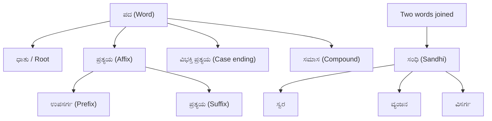

> [!tip] Exam Focus
> The VAO exam is **Kannada medium**, so grammar carries the heaviest scoring weight and the language paper is usually the easiest to score 90%+ on. Almost every year the paper asks: (a) identify the **sandhi** in a joined word, (b) name the **samasa** type, (c) pick the **vibhakti** (case) of an underlined word, (d) one synonym/antonym pair, (e) meaning of an idiom (ಬಸಿಗೋಳು/ಬೆರಡುಗೋಳು), and (f) the **correct spelling** of an official/administrative word. Target: 15–20 marks from this file alone.

## 1. Sandhi (ಸಂಧಿ)

Sandhi is the phonetic joining of two words or of a word-end and a word-beginning (ಪದಗಳ ಸೇರಿದಾಗ ಉಚ್ಚಾರಣ ಬದಲಾವಣೆ). It is the single most repeated question type. Kannada grammar recognises three main divisions.

| Sandhi type | Kannada name | Rule in brief | Worked example |
|---|---|---|---|
| Vowel sandhi | ಸ್ವರ ಸಂಧಿ | Two vowels meet; same vowels merge into one long vowel (ದೀರ್ಘ), or a + i / a + u become e / o (ಗುಣ) | ವಿದ್ಯಾ + ಅಭ್ಯಾಸ = **ವಿದ್ಯಾಭ್ಯಾಸ**; ದೇಶ + ಅಭಿಮಾನ = **ದೇಶಾಭಿಮಾನ**; ದೇವ + ಇಂದ್ರ = **ದೇವೇಂದ್ರ**; ನರ + ಉತ್ತಮ = **ನರೋತ್ತಮ** |
| Consonant sandhi | ವ್ಯಂಜನ ಸಂಧಿ | Final consonant of the first word joins the initial vowel/consonant of the next, forming a conjunct letter (ಸಂಯುಕ್ತಾಕ್ಷರ) | ಗಣ + ತಂತ್ರ = **ಗಣತಂತ್ರ**; ಉತ್ತಮ + ಸ್ಥಾನ = **ಉತ್ತಮಸ್ಥಾನ** |
| Visarga sandhi | ವಿಸರ್ಗ ಸಂಧಿ | ಃ before a consonant is retained; before a vowel it changes | ಅನಃ + ಕರಣ = **ಅನಃಕರಣ** |

Advanced grammars add **ಆದೇಶ** varieties (ಯಣಾದೇಶ, ಚಾಯಾದೇಶ) where ಇ/ಉ turn into ಯ/ವ — treat these only if your prescribed textbook lists them.

*Reading the diagram:* a Kannada word is analysed on two axes. Downward you break one word into root + affix + case ending; sideways you break a joined form back into its two components — if the change happened at the vowel/consonant contact point it is **sandhi**, if the two words simply sit together with a meaning-link it is **samasa**. Exam trick:拆开 "ದೇವೇಂದ್ರ" → swap the joined pair mentally: ದೇವ + ಇಂದ್ರ = ಗುಣ ಸ್ವರ ಸಂಧಿ.

## 2. Samasa (ಸಮಾಸ)

Samasa is the fusion of two or more words into one compound whose internal relation is understood (ಸಂಬಂಧವನ್ನು ಅರ್ಥ ಮಾಡಿಕೊಳ್ಳಬೇಕಾದ ಒಂದೂರಿಕೆ). Six types:

| Type | Relation | Example |
|---|---|---|
| ದ್ವಂದ್ವ | "and" (co-ordination) | ತಾಯಿ + ಮಕ್ಕಳು = ತಾಯಿಮಕ್ಕಳು |
| ತತ್ಪುರುಷ | 2nd word is the main, 1st qualifies it (4th-case link) | ಗ್ರಾಮ + ಹಿತ = ಗ್ರಾಮಹಿತ; ರಾಮ + ಭಕ್ತ = ರಾಮಭಕ್ತ |
| ಕರ್ಮಧಾರಯ | Both words denote the *same* thing (qualification) | ಮಹಾ + ಪುರುಷ = ಮಹಾಪುರುಷ |
| ದ್ವೀಗು | First word is a number | ಚತುರ್ + ಮುಖ = ಚತುರ್ಮುಖ |
| ಬಹುವ್ರೀಹಿ | Words give a *quality*; the real object is outside the compound | ದೀರ್ಘ + ಬಾಹು = ದೀರ್ಘಬಾಹು (the long-armed one) |
| ಅವ್ಯಯೀಭಾವ | First word is indeclinable (ಉಪಸರ್ಗ/ಅವ್ಯಯ) and dominates | ಆ + ರಾತ್ರಿ = ಆರಾತ್ರಿ (the whole night) |

## 3. Vibhakti (ವಿಭಕ್ತಿ — the eight cases)

| # | Name | Suffixes (ಪ್ರತ್ಯಯ) | Function | Example |
|---|---|---|---|---|
| 1 | ಪ್ರಥಮ | -ನು, -ಳು, -ಉ | Subject (ಕರ್ತಾ) | ರಾಮನು ಬಂದನು |
| 2 | ದ್ವಿತೀಯಾ | -ಅನ್ನು, -ನು, -ಳನ್ನು | Object (ಕರ್ಮಾ) | ಪುಸ್ತಕವನ್ನು ಓದಿದನು |
| 3 | ತೃತೀಯಾ | -ದಿಂದ, -ದೊಂದಿಗೆ, -ಆಲ್ | Instrument / with | ಪೆನ್ನಿಂದ ಬರೆದನು |
| 4 | ಚತುರ್ಥಿ | -ಗೆ, -ಕೆ | Beneficiary (to/for) | ತಾಯಿಗೆ ಕೊಟ್ಟನು |
| 5 | ಪಂಚಮಿ | -ಇಂದ, -ದಿಂದ, -ಸಿ? | Separation (from) | ಊರಿನಿಂದ ಬಂದನು |
| 6 | ಷಷ್ಠಿ | -ದ, -ರ, -ಣ್ | Possession (of) | ರಾಮನ ಮನೆ |
| 7 | ಸಪ್ತಮಿ | -ದಲಿ, -ನಲಿ, -ಅಳಿ, -ದೊಳು | Place/time (in/on/at) | ತರಗತಿಯಲಿ ಕುಳಿತನು |
| 8 | ಸಂಬೋಧನ | -ಏ, -ಎ, -ಅ | Address (O!) | ಎಲೈ ರಾಮನೇ |

**Mnemonic — vibhakti order:** "**ಪ**್ರ **ದ್ವ**ಿ **ತೃ** **ಚ** **ಪಂ** **ಷ** **ಸ** **ಸಂ**" → say it as one word: *ಪ್ರದ್ವಿತೃಚಪಂಷಸಸಂ*. Suffix chain to remember by ear: *ನು–ಅನ್ನು–ದಿಂದ–ಗೆ–ಇಂದ–ದ–ದಲಿ–ಏ*.

**Mnemonic — sandhi (3 types):** "**ಸ್ವ**ರ–**ವ**್ಯಂಜನ–**ವಿ**ಸರ್ಗ" = **ಸ್ವ-ವ-ವಿ**.
**Mnemonic — samasa (6 types):** "**ದ** **ತ** **ಕ** — **ದ್ವೀ** **ಬ** **ಅ**" (ದ-ತ-ಕ, ದ್ವೀ-ಬ-ಅ; the first three are the "qualifier" group, the last three the special group).

## 4. Pratyaya (ಪ್ರತ್ಯಯ — affixes)

ಉಪಸರ್ಗ (prefix, before the root) and ಪ್ರತ್ಯಯ (suffix, after the root) both change or specialise meaning.

| ಉಪಸರ್ಗ | Meaning | Words |
|---|---|---|
| ಪ್ರ | forward / forth | ಪ್ರಕಾರ, ಪ್ರಯಾಣ |
| ಅಪ | away / wrong | ಅಪಮಾನ, ಅಪಘಾತ |
| ಸಂ | together | ಸಂಯೋಗ, ಸಂಹಿತೆ |
| ವಿ | apart / various | ವಿಶೇಷ, ವಿಯೋಗ |
| ನಿ | out / down | ನಿರ್ಗಮನ, ನಿಷೇಧ |
| ಅತಿ | beyond | ಅತಿಥಿ, ಅತಿವೃಷ್ಟಿ |
| ದುಃ / ದುರ್ | bad | ದುರ್ಘಟನೆ, ದುಷ್ಕೃತ್ಯ |
| ಸು | good | ಸುಗಮ, ಸುರಕ್ಷಿತ |
| ಉಪ | near / subordinate | ಉಪಕಾರ, ಉಪಜಿಲ್ಲಾ? |

ಪ್ರತ್ಯಯ examples worth memorising: ಶಿಲ್ಪ + ಇಕ = **ಶಿಲ್ಪಿ**; ಧರ್ಮ + ಇಕ = **ಧಾರ್ಮಿಕ**; ಬಟ್ಟೆ + ಗಾರ = **ಬಟ್ಟೆಗಾರ**; ಯುವಕ → **ಯುವತಿ** (feminine), ನಾಗ → **ನಾಗಿ**; plural -ಗಳು / -ರು (ಮರಗಳು, ಅವರು). Verb-formative and tense suffixes (-ಎ → ನಡ್ + ಎ = **ನಡೆ**, -ಉ, -ಊ, -ಅಲ್, -ಐ, -ಳ್) are asked as "ಧಾತುಪ್ರತ್ಯಯ" in some years — drill the list from your textbook.

## 5. ಸಮಾನಾರ್ಥಕ (synonyms) and ವಿರುದ್ಧಾರ್ಥಕ (antonyms)

| One meaning, many words | Opposite pairs |
|---|---|
| ನೀರು = ಜಲ, ಸಲಿಲ, ವಾರಿ, ಅಂಬು, ಪಾನೀಯ | ಸತ್ಯ – ಸುಳ್ಳು |
| ಸೂರ್ಯ = ರವಿ, ಭಾನು, ದಿನಕರ, ಭಾಸ್ಕರ, ಆದಿತ್ಯ | ಬೆಳಕು – ಕತ್ತಲೆ |
| ಚಂದ್ರ = ಇಂದು, ಶಶಿ, ಶಶಾಂಕ | ಸುಖ – ದುಃಖ |
| ಹೂವು = ಪುಷ್ಪ, ಕುಸುಮ, ಸುಮನ, ಮಲರ | ಒಳಗೆ – ಹೊರಗೆ |
| ಮನೆ = ಗೃಹ, ನಿವಾಸ, ಆಲಯ | ಜನನ – ಮರಣ |
| ಬೆಂಕಿ = ಅಗ್ನಿ, ಪಾವಕ, ಅನಲ, ವಹ್ನಿ | ಉಪಕಾರ – ಅಪಕಾರ |
| ಗಾಳಿ = ವಾಯು, ಮಾರುತ, ಪವನ, ಅನಿಲ | ಉನ್ನತಿ – ಅವನತಿ |
| ಹಣ = ಧನ, ಸಂಪತ್ತು, ಆಸ್ತಿ, ನಿಧಿ | ಗುಣ – ದೋಷ |
| ಭಯ = ಭೀತಿ, ಆತಂಕ, ಕಂಪ | ಸಕ್ರಿಯ – ನಿಷ್ಕ್ರಿಯ |

## 6. ಬಸಿಗೋಳು / ಬೆರಡುಗೋಳು (idioms and proverbs)

Idioms give a figurative meaning different from the literal words (ಪದಗಳ ಅಕ್ಷರಶಃ ಅರ್ಥವಲ್ಲದ ಒಟ್ಟರ್ಥ).

- **ಬೆಂಕಿಗೆ ತುಪ್ಪ ಸುರಿಯುವುದು** — to pour ghee on fire; make a bad situation worse.
- **ಕಲ್ಲಿಗೆ ಮೀಸೆ ಬರುವುದು** — a moustache on a stone; something impossible.
- **ಕಣ್ಣಿಗೆ ಕಟ್ಟಿದಂತೆ** — put before the eyes; perfectly obvious (used in office/legal writing).
- **ಬಾಯಿಗೆ ಬಂದಂತೆ** — whatever comes to the mouth; speaking without thinking.
- **ಮೈ ಮರೆತು ಕೆಲಸ ಮಾಡುವುದು** — to work forgetting oneself; whole-hearted service.
- Proverb (ಬಸಿಗೋಳು): **ಹಾಕಿದ ಒಡೆಯನೇ ಕಾಕಿದ ಒಡೆಯ** — the one who fed you is your true master (loyalty/gratitude). Expect 1–2 idiom-meaning MCQs picked from the *prescribed textbook list* — revise that list verbatim, do not improvise meanings.

## 7. Correct spellings of office words (ಲೇಖಾಲಯ ಪದಬಳಕೆ)

Very high yield for a VAO aspirant because these appear in the drafting/letter-writing section.

| Commonly wrong | Correct |
|---|---|
| ಸರಕಾರ | **ಸರ್ಕಾರ** |
| ಕಛೇರಿ | **ಕಚೇರಿ** |
| ಅನುಧಾನ | **ಅನುದಾನ** (grant) |
| ತಾಲೂಕು | **ತಾಲ್ಲೂಕು** |
| ಪಂಚಾಯಿತಿ | **ಪಂಚಾಯತಿ** |
| ಸಾಕ್ಷೀದಾರ | **ಸಾಕ್ಷಿದಾರ** |
| ಇತ್ಯಾದಿಗಳು | **ಇತ್ಯಾದಿ** (no plural) |
| ಆದೇಸ | **ಆದೇಶ** |
| ಸದಸ್ಯರು | **ಸದಸ್ಯ** (singular) / ಸದಸ್ಯರು (plural) |
| ಮುಖ್ಯಮಂತ್ರೀ | **ಮುಖ್ಯಮಂತ್ರಿ** |

Also distinguish ಳ್ vs ಲ್, which changes meaning: **ಕೊಳ್ಳು** (take) vs **ಕೊಲ್ಲು** (kill); ಮಣ್ಣು (soil) vs ಮನು (Manu). Rule followed by the Kannada Sahitya Parishat and the Secretariat Manual of Kannada us; write **ಅನುವಾದ**, **ಮುದ್ರಿತ**, **ಪ್ರತಿ**, **ದಾಖಲೆ**, **ಅರ್ಜಿ**, **ಸಹಿ** exactly as given.

## Likely Questions / PYQ

1. "ವಿದ್ಯಾಭ್ಯಾಸ" ದಲ್ಲಿ ಯಾವ ಸಂಧಿ? — (a) ದೀರ್ಘ ಸ್ವರ ಸಂಧಿ ✔ (b) ಗುಣ ಸಂಧಿ (c) ವ್ಯಂಜನ ಸಂಧಿ (d) ವಿಸರ್ಗ ಸಂಧಿ
2. "ಮಹಾಪುರುಷ" ಎಂಬ ಪದ ಯಾವ ಸಮಾಸ? — (a) ಕರ್ಮಧಾರಯ ✔ (b) ದ್ವಂದ್ವ (c) ಬಹುವ್ರೀಹಿ (d) ದ್ವೀಗು
3. "ಅವನು ಪುಸ್ತಕವನ್ನು ಓದಿದನು" — "ಪುಸ್ತಕವನ್ನು" ಯಾವ ವಿಭಕ್ತಿ? — (a) ದ್ವಿತೀಯಾ ✔ (b) ತೃತೀಯಾ (c) ಷಷ್ಠಿ (d) ಪ್ರಥಮ
4. "ಚತುರ್ಮುಖ" — ಸಮಾಸ? — (a) ದ್ವೀಗು ✔
5. "ಅಗ್ನಿ" ಗೆ ಸಮಾನಾರ್ಥಕ — (a) ಪಾವಕ ✔ (b) ಪಾವುರ? (c) ಪಾಪ (d) ಪ್ರಕಾಶ? → ಪಾವಕ/ಅನಲ/ವಹ್ನಿ
6. "ಬೆಂಕಿಗೆ ತುಪ್ಪ ಸುರಿಯುವುದು" ಅರ್ಥ — (a) ಕೆಲಸವನ್ನು ಇನ್ನಷ್ಟು ಹೆಚ್ಚಿಸುವುದು ✔ (b) ಕೋಪಗೊಳ್ಳುವುದು
7. ಸರಿಯಾದ ಬರಹ — (a) ಸರ್ಕಾರ ✔ (b) ಸರಕಾರ (c) ಸರ್ಕಾರ್ (d) ಸರಕಾರ್
8. "ಎಲೈ ರಾಮನೇ" — ವಿಭಕ್ತಿ? — (a) ಸಂಬೋಧನ ✔

## Quick Revision

> [!abstract] 60-second revision
> - **ಸಂಧಿ 3**: ಸ್ವರ (ದೀರ್ಘ/ಗುಣ), ವ್ಯಂಜನ, ವಿಸರ್ಗ → ಸ್ವ-ವ-ವಿ
> - **ಸಮಾಸ 6**: ದ್ವಂದ್ವ, ತತ್ಪುರುಷ, ಕರ್ಮಧಾರಯ, ದ್ವೀಗು, ಬಹುವ್ರೀಹಿ, ಅವ್ಯಯೀಭಾವ → ದ-ತ-ಕ / ದ್ವೀ-ಬ-ಅ
> - **ವಿಭಕ್ತಿ 8**: ಪ್ರ-ದ್ವಿ-ತೃ-ಚ-ಪಂ-ಷ-ಸ-ಸಂ; ಸಂಬೋಧನ is 8th, ಸಪ್ತಮಿ = "in/at"
> - **ಪ್ರತ್ಯಯ**: ಉಪಸರ್ಗ (ಪ್ರ, ಅಪ, ಸಂ, ವಿ, ನಿ, ಅತಿ, ದುಃ, ಸು, ಉಪ) + ಪ್ರತ್ಯಯ (-ಇಕ, -ಗಾರ, -ಗಳು, -ರು)
> - Idioms are taken from the textbook list; spellings: ಸರ್ಕಾರ, ಕಚೇರಿ, ಅನುದಾನ, ತಾಲ್ಲೂಕು, ಪಂಚಾಯತಿ
> - Scoring plan: 20 min/day, one full sandhi+samasa drill per mock cycle

## Related notes

[[02_History]] · [[03_Geography]] · [[04_Polity]] · [[05_Economy]] · [[06_General_Science]] · [[07_Mental_Ability]] · [[02_Syllabus_and_Pattern]] · [[04_Polity#Panchayati Raj]] (official Kannada terminology used in revenue work)
