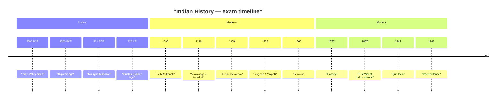

> [!tip] Exam Focus
> History gives 8–12 questions: 2–3 ancient (Indus, Maurya, Gupta), 2–3 medieval with **Vijayanagara weighted heaviest for Karnataka**, 2–3 freedom movement, and 2–3 Karnataka dynasties (Chalukyas, Rashtrakutas, Hoysalas, Wodeyars, unification). Memorise **capitals, founders, and one signature monument per dynasty** — that trio answers most MCQs.

## 1. Ancient India (ಪ್ರಾಚೀನ ಭಾರತ)

- **Indus Valley Civilisation (ಸಿಂಧೂ ನಾಗರಿಕತೆ, c. 2600–1900 BCE):** planned grid cities, Great Bath at Mohenjo-daro, dockyard at Lothal, undeciphered script. Largest Indian sites: Dholavira, Rakhigarhi, Lothal.
- **Vedic Age (ವೈದಿಕ ಯುಗ):** Rigveda oldest; later Vedas + Upanishads; varna system crystallises; Painted Grey Ware culture; Mahajanapadas emerge by 6th century BCE (Magadha, Kosala, Vatsa, Avanti).
- **Mauryas (ಮೌರ್ಯರು, 321–185 BCE):** founder Chandragupta Maurya (with Chanakya/Kautilya, author of Arthashastra); Ashoka (ಅಶೋಕ, r. 268–232 BCE) — Kalinga war (261 BCE), Dhamma policy, rock and pillar edicts; Maski and Brahmagiri edicts are in **Karnataka**.
- **Guptas (ಗುಪ್ತರು, 4th–6th CE):** "Golden Age" — Chandragupta II (Vikramaditya), Kalidasa, Aryabhata; Nalanda foundations laid later under Kumaragupta; temple architecture (Dashavatara, Deogarh) begins.

## 2. Medieval India (ಮಧ್ಯಕಾಲೀನ ಭಾರತ)

- **Delhi Sultanate (ದೆಹಲಿ ಸುಲ್ತಾನರು, 1206–1526):** Slave dynasty (Qutb-ud-din Aibak — Qutb Minar begun), Khaljis (Alauddin — market reforms, Malik Kafur's Deccan raid reaching Halebidu/Dwarasamudra), Tughlaqs (Muhammad bin Tughlaq — capital shift, token currency), Sayyids, Lodis.
- **Mughals (ಮೊಘಲರು, 1526–1707+):** Babur (Panipat 1526) → Humayun → Akbar (ಅಕ್ಬರ್ — Din-i-Ilahi, mansabdari, Todar Mal revenue) → Jahangir → Shah Jahan (ತಾಜ್ ಮಹಲ್) → Aurangzeb (ಔರಂಗಜೇಬ — expansion to Deccan, long Maratha wars).
- **Vijayanagara (ವಿಜಯನಗರ, 1336–1565):** founded by **Harihara I and Bukka Raya I** with Vidyaranya's guidance; capital **Hampi**; Krishnadevaraya (r. 1509–1529, Tuluva dynasty) — peak, Amuktamalyada, Ashtadiggajas, Hazar Rama and Vittala temples; Battle of Talikota (1565) ends ascendancy.

*Reading the timeline:* it runs strictly left-to-right, oldest to newest, in three bands the exam mirrors (ancient / medieval / modern). Anchor on five dates — 321 BCE (Mauryas), 1336 (Vijayanagara), 1526 (Mughals), 1857 (revolt), 1947 — and hang every other fact off the nearest anchor.

## 3. Modern India (ಆಧುನಿಕ ಭಾರತ)

- **British rule:** Plassey (1757) → Buxar (1764) → Diwani; 1857 revolt (ಮೊದಲ ಸ್ವಾತಂತ್ರ್ಯ ಸಂಗ್ರಾಮ — Mangal Pandey, Rani Lakshmibai, Tantia Tope; centres: Meerut, Delhi, Kanpur, Lucknow, Jhansi); Crown rule from 1858.
- **Freedom movement:** INC founded 1885 (Mumbai, A.O. Hume); Moderates → Extremists (Lal-Bal-Pal); Gandhi's return 1915 — Non-Cooperation (1920), Civil Disobedience/Dandi (1930), Quit India (1942, "Do or Die"); Subhas Chandra Bose and INA; Partition and Independence, 15 Aug 1947.
- **Karnataka's freedom figures:** Kittur Rani Chennamma (1824 revolt — among India's earliest), Sangolli Rayanna, Belgaum Congress session 1924 (Gandhi presided), Shivapura satyagraha, Vidurashwatha ("Jallianwala of Karnataka").

## 4. Karnataka History (ಕರ್ನಾಟಕ ಇತಿಹಾಸ)

| Dynasty | Capital | Founder / key king | Signature mark |
|---|---|---|---|
| Chalukyas of Badami (ಬಾದಾಮಿ ಚಾಲುಕ್ಯರು, 6th–8th CE) | Badami (ವಾತಾಪಿ) | Pulakeshin II (defeated Harshavardhana; Aihole inscription by Ravikirti) | Rock-cut temples: Badami, Aihole, Pattadakal (UNESCO) |
| Rashtrakutas (ರಾಷ್ಟ್ರಕೂಟರು, 8th–10th CE) | Manyakheta (Malkhed) | Amoghavarsha I (wrote Kavirajamarga, first Kannada literary work) | Ellora Kailasa temple; Kannada-Sanskrit patronage |
| Hoysalas (ಹೊಯ್ಸಳರು, 11th–14th CE) | Dwarasamudra (Halebidu) | Vishnuvardhana | Star-shaped (stellate) temples: Belur, Halebidu, Somanathapura (UNESCO) |
| Vijayanagara (see above) | Hampi | Harihara–Bukka; Krishnadevaraya | Hampi monuments (UNESCO) |
| Wodeyars of Mysore (ಮೈಸೂರು ಒಡೆಯರು) | Mysore | Yaduraya (1399); Krishnaraja Wodeyar IV + Diwan Visvesvaraya (modern Mysore) | Mysore Palace, KRS dam, Minto Eye Hospital |
| Kannada unification (ಏಕೀಕರಣ) | — | Aluru Venkata Rao ("Karnataka Kulapurohita", Karnataka Gatha Vaibhava) | States Reorganisation, **1 Nov 1956** (Kannada Rajyotsava); renamed Karnataka 1973 |

**Mnemonics:** dynasty order — "**ಚಾ–ರಾ–ಹೊ–ವಿ–ಒ**" (Chalukya → Rashtrakuta → Hoysala → Vijayanagara → Wodeyar). Capitals — "**ಬಾ–ಮ–ದ್ವಾ–ಹಂ–ಮೈ**" (Badami, Malkhed, Dwarasamudra, Hampi, Mysore). Freedom trio — "**ಅಸಹಕಾರ–ಅವಿಧೇಯ–ಭಾರತ ಬಿಟ್ಟು**" (1920 Non-Cooperation, 1930 Disobedience, 1942 Quit India).

## Likely Questions / PYQ

1. Founder of the Maurya dynasty? — (a) Chandragupta Maurya ✔ (b) Ashoka (c) Bindusara (d) Kanishka
2. Ashokan edicts found in Karnataka at? — (a) Maski and Brahmagiri ✔ (b) Sanchi (c) Jaugada (d) Girnar
3. Who wrote the Aihole inscription praising Pulakeshin II? — (a) Ravikirti ✔ (b) Banabhatta (c) Kalhana (d) Bilhana
4. Author of Kavirajamarga? — (a) Amoghavarsha I ✔ (b) Pampa (c) Ranna (d) Ponna
5. Hoysala temples are distinguished by? — (a) Stellate (star-shaped) plan ✔ (b) Shikhara only (c) Gopuram only (d) Rock-cut halls
6. Battle of Talikota year? — (a) 1565 ✔ (b) 1526 (c) 1576 (d) 1556
7. Kittur revolt leader and year? — (a) Rani Chennamma, 1824 ✔ (b) Rayanna, 1857 (c) Chennamma, 1857 (d) Abbakka, 1824
8. Karnataka unification date? — (a) 1 Nov 1956 ✔ (b) 15 Aug 1947 (c) 1 Nov 1973 (d) 26 Jan 1950

## Quick Revision

> [!abstract] 60-second revision
> - Ancient: Indus (Lothal dockyard) → Vedas → Mauryas (Ashoka, Maski edict) → Guptas (Golden Age)
> - Medieval: Sultanate (Aibak→Lodi) → Vijayanagara 1336, Krishnadevaraya 1509–29, Talikota 1565 → Mughals 1526
> - Modern: 1757 → 1857 → 1885 INC → 1920/1930/1942 → 1947
> - Karnataka: ಚಾ–ರಾ–ಹೊ–ವಿ–ಒ; capitals ಬಾ–ಮ–ದ್ವಾ–ಹಂ–ಮೈ; 1 Nov 1956 unification; renamed Karnataka 1973

## Related notes

[[01_Kannada_Grammar]] · [[03_Geography]] · [[04_Polity]] · [[02_Syllabus_and_Pattern]] · [[05_Economy]]

Hello, world! It's 3:45 p.m. — “curly quotes” and 'single'; (brackets) [square] {braces} #hash @at 50% & more.
Second line: naïve café, Zoë, Müller, ₹500, €20.
CJK: 日本語 中文 한국어. Emoji: 😀 👍 🚀.
	Tabbed line. END-OF-TEST

Hello, world! It's 3:45 p.m. — “curly quotes” and 'single'; (brackets) [square] {braces} #hash @at 50% & more.
Second line: naïve café, Zoë, Müller, ₹500, €20.
CJK: 日本語 中文 한국어. Emoji: 😀 👍 🚀.
	Tabbed line. END-OF-TEST
	